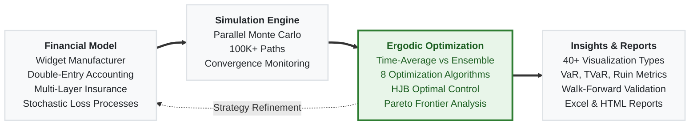

# Ergodic Insurance Limits

**What if the cheapest insurance strategy is the one that costs you the most?**


[](https://pypi.org/project/ergodic-insurance/) [](https://alexfiliakov.github.io/Ergodic-Insurance-Limits/) [](https://deepwiki.com/AlexFiliakov/Ergodic-Insurance-Limits)

Traditional insurance analysis asks: *"Does the expected recovery exceed the premium?"* When it doesn't, the recommendation is to self-insure. This framework asks a different question: *"Which strategy maximizes a single company's compound growth over time?"* The answer turns out to be surprisingly different, and it explains why sophisticated buyers routinely pay premiums well above expected losses.

This is a Python simulation framework that applies [ergodic economics](https://ergodicityeconomics.com/) (Ole Peters, 2019) to insurance optimization. It models a business over thousands of simulated timelines to find the insurance structure (retention, limits, layers) that maximizes long-term growth, not just minimizes short-term cost.

> For the general introduction to this research and its business implications, see [mostlyoptimal.com](https://mostlyoptimal.com).

---

## Why Ergodic Economics Matters for Insurance

If you're an actuary, you already understand ruin theory and geometric returns. Ergodic economics provides a unifying framework that connects these ideas to insurance purchasing decisions in a way that expected value analysis cannot.

The core issue is familiar: business wealth compounds multiplicatively. A 50% loss followed by a 50% gain doesn't bring you back to even. It leaves you at 75%. This is the **volatility tax**, and it means large losses destroy more long-term growth than their expected value suggests. Traditional analysis, which averages outcomes *across* many companies at a single point in time (the ensemble average), misses this entirely. What matters for any *single* company is the average outcome *over time* (the time average).

Insurance mitigates this volatility tax. Even when premiums exceed expected losses (sometimes significantly), the reduction in downside variance can result in higher compound growth. The framework precisely quantifies when and by how much.

Practically, this implies there exists an optimal insurance structure for a given risk profile where the growth benefit of variance reduction outweighs the cost of the premium. This framework finds it.

<details>
<summary><strong>The formal relationship</strong></summary>

For multiplicative wealth dynamics, the time-average growth rate is:

$$g = \lim_{T\to\infty}{\frac{1}{T}\ln{\frac{x(T)}{x(0)}}}$$

This is the geometric growth rate: the quantity that actually determines long-term outcomes for a single entity. Optimizing this rate, rather than the expected value $\mathbb{E}[x(T)]$, naturally balances profitability with survival and eliminates the need for arbitrary utility functions or risk preferences.

For a deeper treatment, see the [theory documentation](ergodic_insurance/docs/theory/) or Peters' original paper: [The ergodicity problem in economics](https://doi.org/10.1038/s41567-019-0732-0) (Nature Physics, 2019).
</details>

---

## What This Framework Does



The framework models a **widget manufacturer**, a deliberately generic business entity inspired by economics textbooks, through a complete financial simulation with stochastic losses, multi-layer insurance, and double-entry accounting. (The widget manufacturer is the default; contributions to extend the model to other business types are welcome.)

### Ergodic Analysis
- **Time-average vs ensemble-average growth**: the core framework for evaluating insurance decisions
- **Scenario comparison** with statistical significance testing (insured vs uninsured trajectories)
- **Convergence validation** to ensure time-average estimates are reliable
- **Loss-integrated ergodic analysis** connecting loss processes to growth rate impacts

### Monte Carlo Simulation
- **Parallel Monte Carlo engine** with convergence monitoring, checkpointing, and adaptive stopping
- **Bootstrap confidence intervals** for ruin probability and key metrics
- **CPU-optimized parallel execution** designed for budget hardware (4-8 cores, 100K+ simulations in <4GB RAM)

### Financial Modeling
- **Widget manufacturer model** with 75+ methods for revenue, expenses, and balance sheet management
- **Double-entry ledger** with event-sourced accounting and trial balance generation
- **Full financial statements**: balance sheets, income statements, cash flow statements with GAAP compliance
  - GAAP compliance is currently a sophisticated approximation, but needs a professional corporate accountant to review
- **Stochastic processes** including geometric Brownian motion, mean-reversion, and lognormal volatility
- **Multi-year claim liability scheduling** with actuarial development patterns and collateral tracking

### Insurance Modeling
- **Multi-layer insurance programs** with attachment points, limits, and reinstatement provisions
- **Market cycle-aware pricing** (soft/normal/hard markets) with cycle transition simulation
  - Significant research work is needed on modeling insurance market cycles, **contributors are welcome**
- **Aggregate and per-occurrence limit tracking** with layer utilization monitoring
- **Actuarial claim development** patterns (standard, slow, fast) with cash flow projection

### Optimization
- **8 optimization algorithms** — SLSQP, Differential Evolution, Trust Region, Penalty Method, Augmented Lagrangian, Multi-Start, and more
- **Business outcome optimizer** — maximize ROE, minimize bankruptcy risk, optimize capital efficiency
- **HJB optimal control solver** — stochastic control via Hamilton-Jacobi-Bellman PDE
- **Multi-objective Pareto frontier** generation (weighted-sum, epsilon-constraint, evolutionary methods)

### Risk Metrics & Validation

- **Standard risk metrics** — VaR, TVaR, Expected Shortfall, PML, maximum drawdown, economic capital
- **Ruin probability analysis** with multi-horizon support and bootstrap confidence intervals
- **Walk-forward validation** with out-of-sample testing across rolling windows
- **Strategy backtesting** with pre-built strategies (conservative, aggressive, adaptive, optimized)

### Visualization & Reporting

- **40+ executive and technical plots** — ROE-ruin frontiers, ruin cliffs, tornado diagrams, convergence diagnostics, Pareto frontiers
- **Interactive dashboards** (Plotly-based) for exploration
- **Excel report generation** with cover sheets, financial statements, metrics dashboards, and pivot data
- **45+ Jupyter notebooks** organized by topic for interactive analysis

### Configuration
- **3-tier architecture** — profiles, modules, and presets with inheritance and dot-notation overrides
- **Industry-specific configs** (manufacturing, service, retail) and market condition presets

---

## Reproducible Research

### [Ergodic Insurance Under Volatility](ergodic_insurance/notebooks/reproducible_research_2026_02_02_basic_volatility/)

Traditional insurance analysis says companies should self-insure whenever premiums exceed expected losses. A 250,000-path Monte Carlo simulation over 50-year horizons shows this advice is **directionally wrong**: the strategy that minimizes expected costs (no insurance) produces the worst actual compound growth, while guaranteed cost insurance achieves the highest growth despite costing the most. The mechanism is the Volatility Tax, where large losses destroy more growth than their expected value suggests because wealth compounds multiplicatively. Without insurance, 37.8% of simulated firms go insolvent; with full coverage, just 0.01% do. The entire experiment is reproducible on Google Colab for ~$25. See the [project README](ergodic_insurance/notebooks/reproducible_research_2026_02_02_basic_volatility/README.md) for setup instructions and parameters to tweak.

### Published Results

- [Ergodic Insurance Part 1: From Cost Center to Growth Engine: When N=1](https://medium.com/@alexfiliakov/ergodic-insurance-part-1-from-cost-center-to-growth-engine-when-n-1-52c17b048a94)
- [Insurance Limit Selection Through Ergodicity: When the 99.9th Percentile Isn't Enough](https://applications.mostlyoptimal.com/insurance-limit-selection-through-ergodicity-when-the-99p9th-percentile-isnt-enough)
- [Beyond Point Estimates: Stochasticizing Tail Uncertainty With Sobol Sequences](https://applications.mostlyoptimal.com/stochasticizing-tail-risk)
- [The Insurance Cliff: Where Small Decisions Create Catastrophic Outcomes](https://applications.mostlyoptimal.com/insurance-cliff-by-risk-profile)

---

## Quick Start

### Install

```bash
pip install ergodic-insurance
```

Requires Python 3.12+. For optional features: `pip install ergodic-insurance[excel]` (Excel reports).

### Run Your First Analysis

```python
from ergodic_insurance import run_analysis

results = run_analysis(
    initial_assets=10_000_000,
    loss_frequency=2.5,
    loss_severity_mean=1_000_000,
    deductible=500_000,
    coverage_limit=10_000_000,
    premium_rate=0.025,
    n_simulations=1000,
    time_horizon=20,
)
print(results.summary())   # human-readable comparison
results.plot()              # 2x2 insured-vs-uninsured chart
df = results.to_dataframe() # per-simulation metrics
```

### Verify Installation

```python
from ergodic_insurance import run_analysis

results = run_analysis(n_simulations=5, time_horizon=5, seed=42)
print(results.summary())
print("Installation successful!")
```

### Explore Further

| Notebook | Topic |
|---|---|
| [Setup Verification](ergodic_insurance/notebooks/getting-started/01_setup_verification.ipynb) | Confirm your environment works |
| [Quick Start](ergodic_insurance/notebooks/getting-started/02_quick_start.ipynb) | First simulation walkthrough |
| [Ergodic Advantage](ergodic_insurance/notebooks/core/03_ergodic_advantage.ipynb) | Time-average vs ensemble-average demonstration |
| [Monte Carlo Simulation](ergodic_insurance/notebooks/core/04_monte_carlo_simulation.ipynb) | Deep dive into the simulation engine |
| [Risk Metrics](ergodic_insurance/notebooks/core/05_risk_metrics.ipynb) | VaR, TVaR, ruin probability analysis |
| [Retention Optimization](ergodic_insurance/notebooks/optimization/04_retention_optimization.ipynb) | Finding optimal deductibles |
| [HJB Optimal Control](ergodic_insurance/notebooks/advanced/01_hjb_optimal_control.ipynb) | Theoretical optimal control benchmarks |

See the [full documentation](https://alexfiliakov.github.io/Ergodic-Insurance-Limits/) or the [Getting Started tutorial](https://docs.mostlyoptimal.com/tutorials/01_getting_started.html) for more.

---

## Professional Standards and Disclaimers

This framework provides actuarial research tools subject to [ASOP No. 41: Actuarial Communications](https://www.actuarialstandardsboard.org/asops/actuarial-communications/) and [ASOP No. 56: Modeling](http://www.actuarialstandardsboard.org/asops/modeling-3/). Full compliance disclosures are in the [Actuarial Standards Compliance](ergodic_insurance/docs/user_guide/actuarial_standards.rst) document.

**Research Use Only.** This is an early-stage research tool. It does not constitute an actuarial opinion or rate filing. Outputs are intended for qualified actuaries who can independently validate the methodology and results.

**Responsible Actuary:** Alex Filiakov, ACAS. Review is ongoing; the responsible actuary does not currently take responsibility for the accuracy of the methodology or results.

<details>
<summary><strong>Key Limitations & Disclosures</strong></summary>

- Outputs should not be used for regulatory filings, rate opinions, or reserve opinions without independent actuarial analysis.
- Results are illustrative and depend on input assumptions. Treat them as directional guidance, not prescriptive recommendations.
- The framework embeds simplifying assumptions (Poisson frequency, log-normal severity, no regulatory capital, deterministic margins) documented in the compliance disclosures.
- Development involved extensive reliance on Large Language Models for research and code generation.
- **Conflict of Interest:** The responsible actuary is employed by an insurance broker. See the compliance document for full disclosure and mitigation measures.
</details>

---

## Contributing

This project is in active development (pre-1.0) and there is meaningful work to be done. Whether you're an experienced actuary who can stress-test the methodology or a developer who can tackle implementation issues, contributions are welcome.

### Where to Start

- **[Open Issues](https://github.com/AlexFiliakov/Ergodic-Insurance-Limits/issues)** — 30 open issues spanning mathematical correctness, actuarial methodology, and security hardening. Many are well-scoped and self-contained.
- **[Codebase Onboarding Guide](docs/Codebase%20Onboarding%20Guide.md)** — A structured walkthrough of the key concepts, domain terms, and architecture. Start here before diving into the code.
- **[DeepWiki](https://deepwiki.com/AlexFiliakov/Ergodic-Insurance-Limits)** — AI-powered Q&A over the entire codebase. Useful for navigating 74 modules without reading all of them.

### Areas Where Help Is Needed

| Area | Examples | Good For |
|---|---|---|
| **Mathematical correctness** | Variance corrections, bias adjustments, convergence estimators | Actuaries, statisticians, quantitative researchers |
| **Actuarial methodology** | Claim reserve re-estimation, development pattern calibration, bootstrap CI improvements | Practicing actuaries, CAS/SOA candidates |
| **New business models** | Extending beyond the widget manufacturer to service, retail, or other industry types | Domain experts in other industries |
| **Optimization & theory** | HJB solver improvements, new objective functions, multi-period strategies | Applied mathematicians, operations researchers |
| **Testing & validation** | Walk-forward validation, convergence diagnostics, edge case coverage | Anyone comfortable with pytest |

### Developer Setup

```bash
git clone https://github.com/AlexFiliakov/Ergodic-Insurance-Limits.git
cd Ergodic-Insurance-Limits
python ergodic_insurance/scripts/setup_dev.py
```

This installs the package in editable mode with dev dependencies and configures pre-commit hooks (black, isort, mypy, pylint, conventional commits). Or manually:

```bash
pip install -e ".[dev]"
pre-commit install
pre-commit install --hook-type commit-msg
```

### Running Tests

```bash
pytest                                              # all tests with coverage
pytest ergodic_insurance/tests/test_manufacturer.py  # specific module
pytest --cov=ergodic_insurance --cov-report=html     # HTML coverage report
```

### Branch Strategy

- **`main`** — stable releases only, protected
- **`develop`** — integration branch, PRs go here
- Use conventional commit messages (`feat:`, `fix:`, `docs:`, etc.) — this drives automated versioning

---

## Project Structure

```
Ergodic-Insurance-Limits/
├── ergodic_insurance/              # Main Python package (74 modules)
│   ├── manufacturer.py            # Widget manufacturer financial model
│   ├── simulation.py              # Simulation orchestrator
│   ├── monte_carlo.py             # Parallel Monte Carlo engine
│   ├── ergodic_analyzer.py        # Time-average growth analysis
│   ├── insurance.py               # Insurance structures and layers
│   ├── insurance_program.py       # Multi-layer program management
│   ├── insurance_pricing.py       # Premium calculation models
│   ├── loss_distributions.py      # Statistical loss modeling (lognormal, Pareto, etc.)
│   ├── optimization.py            # Optimization algorithms and solvers
│   ├── business_optimizer.py      # Business outcome optimization
│   ├── hjb_solver.py              # Hamilton-Jacobi-Bellman optimal control
│   ├── pareto_frontier.py         # Multi-objective Pareto analysis
│   ├── risk_metrics.py            # VaR, TVaR, ruin probability
│   ├── financial_statements.py    # GAAP-compliant financial statements
│   ├── stochastic_processes.py    # GBM, mean-reversion, volatility models
│   ├── parallel_executor.py       # CPU-optimized parallel processing
│   ├── gpu_mc_engine.py           # GPU-accelerated Monte Carlo (CuPy)
│   ├── walk_forward_validator.py  # Walk-forward validation framework
│   ├── strategy_backtester.py     # Insurance strategy backtesting
│   ├── convergence.py             # Convergence diagnostics
│   ├── bootstrap_analysis.py      # Bootstrap statistical methods
│   ├── sensitivity.py             # Sensitivity analysis
│   ├── config/                    # 3-tier configuration system
│   │   ├── core.py                #   Config classes and validation
│   │   ├── presets.py             #   Market condition templates
│   │   └── ...                    #   Insurance, manufacturer, simulation configs
│   ├── reporting/                 # Report generation
│   │   ├── executive_report.py    #   Executive-level summaries
│   │   ├── technical_report.py    #   Technical analysis reports
│   │   ├── insight_extractor.py   #   Automated insight extraction
│   │   └── ...                    #   Excel, tables, scenario comparison
│   ├── visualization/             # Plotting (executive, technical, interactive)
│   ├── notebooks/                 # 45+ Jupyter notebooks
│   │   ├── getting-started/       #   Setup and first steps
│   │   ├── core/                  #   Loss distributions, insurance, ergodic advantage
│   │   ├── optimization/          #   Retention, Pareto, sensitivity, parameter sweeps
│   │   ├── advanced/              #   HJB control, walk-forward, convergence
│   │   ├── reconciliation/        #   10 validation and reconciliation notebooks
│   │   ├── visualization/         #   Dashboards, plots, scenario comparison
│   │   ├── reporting/             #   Report and table generation
│   │   └── research/              #   Exploratory research notebooks
│   ├── tests/                     # 60+ test modules
│   ├── examples/                  # Demo scripts
│   ├── data/config/               # YAML configuration profiles and presets
│   ├── docs/                      # Sphinx documentation (API, tutorials, theory)
│   └── scripts/                   # Setup and utility scripts
├── assets/                        # Images and visual resources
├── docs/                          # GitHub Pages documentation
├── .github/workflows/             # CI/CD pipelines
├── pyproject.toml                 # Project configuration and dependencies
├── CHANGELOG.md                   # Release history
└── LICENSE                        # MIT
```

---

## License

MIT. See [LICENSE](LICENSE).
