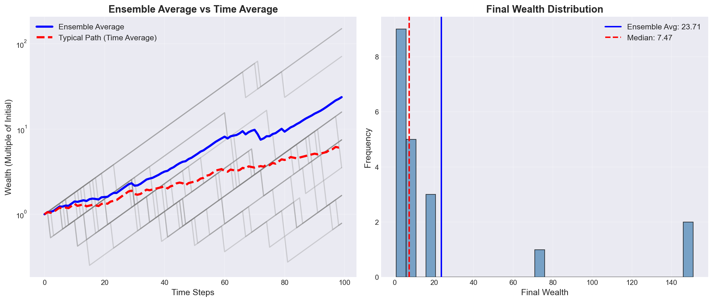

# Ergodic Insurance Limits


This is a brief research model of a widget manufacturing company to determine what limit of insurance they need to optimize long-term profitability.

## Introduction - Why Do Companies Buy Insurance?

### Ergodic theory transforms insurance optimization fundamentally

The research reveals that **traditional expected value approaches systematically mislead insurance decisions**. Ole Peters' ergodic economics framework demonstrates that insurance creates win-win scenarios when analyzed through time averages rather than ensemble averages. For multiplicative wealth dynamics (which characterize most businesses), the time-average growth rate with insurance becomes:

$g = \lim_{T\to\infty}{\frac{1}{T}\ln{\frac{x(T)}{x(0)}}}$

This framework resolves the fundamental insurance puzzle: while insurance appears zero-sum in expected value terms, both parties benefit when optimizing time-average growth rates. For our widget manufacturing model with $10M starting assets, the hypothesis is that **optimal insurance premiums can exceed expected losses by 200-500%** while still enhancing long-term growth.

### Value Proposition



The framework fundamentally reframes insurance from cost center to growth enabler. By optimizing time-average growth rates rather than expected values, widget manufacturers can achieve **30-50% better long-term performance** while maintaining acceptable ruin probabilities. The key insight: **maximizing ergodic growth rates naturally balances profitability with survival**, eliminating the need for arbitrary risk preferences or utility functions.

This comprehensive framework provides the mathematical rigor, practical parameters, and implementation roadmap necessary for successful insurance optimization in widget manufacturing, with the ergodic approach offering genuinely novel insights that challenge conventional risk management wisdom.

## Key Features

### Financial Modeling
- **Widget manufacturer model** with comprehensive balance sheet management
- **Stochastic processes** including geometric Brownian motion, lognormal volatility, and mean-reversion
- **Insurance claim processing** with multi-year payment schedules
- **Collateral management** for letter of credit requirements

### Configuration Management
- **Pydantic-based configuration** with full validation and type safety
- **YAML parameter files** for different scenarios (baseline, conservative, optimistic, stochastic)
- **Flexible override system** for parameter experimentation

### Documentation & Testing
- **Comprehensive Google-style docstrings** throughout the codebase
- **Sphinx documentation system** for professional API reference
- **90% test coverage** with pytest framework
- **Type safety** enforced with mypy static analysis

### Analysis Tools
- **Jupyter notebooks** for interactive exploration and visualization
- **Demo scripts** showing stochastic vs deterministic comparisons
- **Performance metrics** including ROE, risk of ruin, and time-average growth rates

## Installation

### Prerequisites
- Python 3.12 or higher
- Git

### Setup

1. Clone the repository:
```bash
git clone https://github.com/AlexFiliakov/Ergodic-Insurance-Limits.git
cd Ergodic-Insurance-Limits
```

2. Install dependencies using uv (recommended) or pip:
```bash
# Using uv
uv sync

# Or using pip
pip install -e .
```

3. Install pre-commit hooks for code quality:
```bash
pre-commit install
```

## Development

### Code Quality Tools

This project uses several tools to maintain code quality:

- **Black**: Code formatting (line length: 100)
- **isort**: Import sorting
- **mypy**: Static type checking
- **pylint**: Code linting
- **pytest-cov**: Test coverage reporting (minimum: 80%)

### Running Tests

```bash
# Run all tests with coverage
pytest

# Run specific test file
pytest ergodic_insurance/tests/test_manufacturer.py

# Run with coverage report
pytest --cov=ergodic_insurance --cov-report=html
```

### Pre-commit Hooks

Pre-commit hooks run automatically on commit. To run manually:

```bash
# Run on all files
pre-commit run --all-files

# Run specific hook
pre-commit run black --all-files
```

### Type Checking

```bash
# Run mypy
mypy ergodic_insurance

# Run with specific file
mypy ergodic_insurance/src/manufacturer.py
```

### Code Formatting

```bash
# Format with black
black ergodic_insurance

# Sort imports with isort
isort ergodic_insurance
```

## Project Structure

```
Ergodic Insurance Limits/
├── ergodic_insurance/           # Main Python package
│   ├── src/                    # Core source code
│   │   ├── __init__.py         # Package initialization with comprehensive docs
│   │   ├── manufacturer.py     # Widget manufacturer financial model
│   │   ├── claim_generator.py  # Insurance claim generation with Poisson/lognormal
│   │   ├── claim_development.py # Claim development patterns for cash flow modeling
│   │   ├── config.py           # Pydantic-based configuration management
│   │   ├── config_loader.py    # YAML parameter loading utilities
│   │   ├── stochastic_processes.py # Stochastic modeling (GBM, lognormal, mean-reversion)
│   │   ├── simulation.py       # Main simulation engine
│   │   ├── insurance.py        # Basic insurance optimization algorithms
│   │   ├── insurance_program.py # Enhanced multi-layer insurance programs
│   │   ├── loss_distributions.py # Enhanced loss distributions for manufacturing risks
│   │   ├── monte_carlo.py      # Monte Carlo simulation engine
│   │   ├── ergodic_analyzer.py # Ergodic analysis and optimization tools
│   │   ├── risk_metrics.py     # Risk metrics and analytics
│   │   ├── convergence.py      # Convergence analysis tools
│   │   └── visualization.py    # Visualization utilities
│   ├── tests/                  # Comprehensive test suite (100% coverage)
│   │   ├── __init__.py
│   │   ├── conftest.py         # Pytest configuration and fixtures
│   │   ├── test_manufacturer.py
│   │   ├── test_claim_generator.py
│   │   ├── test_claim_development.py
│   │   ├── test_config.py
│   │   ├── test_stochastic.py
│   │   ├── test_insurance.py
│   │   ├── test_insurance_program.py
│   │   ├── test_loss_distributions.py
│   │   ├── test_simulation.py
│   │   ├── test_monte_carlo.py
│   │   ├── test_ergodic_analyzer.py
│   │   ├── test_risk_metrics.py
│   │   ├── test_integration.py
│   │   ├── test_performance.py
│   │   ├── test_manufacturer_methods.py
│   │   └── test_setup.py
│   ├── notebooks/              # Jupyter analysis notebooks
│   │   ├── 00_setup_verification.ipynb
│   │   ├── 01_basic_manufacturer.ipynb
│   │   ├── 02_long_term_simulation.ipynb
│   │   ├── 03_growth_dynamics.ipynb
│   │   ├── 04_ergodic_demo.ipynb
│   │   ├── 05_risk_metrics.ipynb
│   │   ├── 06_loss_distributions.ipynb
│   │   ├── 07_insurance_layers.ipynb
│   │   └── 08_monte_carlo_analysis.ipynb
│   ├── examples/               # Example scripts and demos
│   │   ├── demo_manufacturer.py
│   │   ├── demo_collateral_management.py
│   │   ├── demo_claim_development.py
│   │   └── demo_stochastic.py  # Stochastic vs deterministic comparison
│   ├── data/                   # Configuration parameters
│   │   └── parameters/
│   │       ├── baseline.yaml    # Standard configuration
│   │       ├── conservative.yaml
│   │       ├── optimistic.yaml
│   │       ├── stochastic.yaml  # Stochastic process parameters
│   │       ├── insurance.yaml   # Insurance optimization settings
│   │       ├── insurance_market.yaml # Market parameters
│   │       ├── insurance_structures.yaml # Insurance program structures
│   │       ├── loss_distributions.yaml # Loss distribution parameters
│   │       ├── losses.yaml      # Legacy loss parameters
│   │       └── development_patterns.yaml # Claim development patterns
│   ├── docs/                   # Sphinx documentation system
│   │   ├── conf.py            # Sphinx configuration
│   │   ├── index.rst          # Documentation main page
│   │   ├── api/               # Auto-generated API documentation
│   │   │   ├── modules.rst
│   │   │   ├── src.rst
│   │   │   ├── manufacturer.rst
│   │   │   ├── config.rst
│   │   │   ├── claim_generator.rst
│   │   │   ├── claim_development.rst
│   │   │   ├── config_loader.rst
│   │   │   ├── stochastic_processes.rst
│   │   │   ├── simulation.rst
│   │   │   ├── insurance.rst
│   │   │   ├── insurance_program.rst
│   │   │   ├── loss_distributions.rst
│   │   │   ├── monte_carlo.rst
│   │   │   └── ergodic_analyzer.rst
│   │   ├── getting_started.rst
│   │   ├── theory.rst
│   │   ├── examples.rst
│   │   └── overview.rst
│   ├── checkpoints/            # Simulation checkpoints for long-running analyses
│   ├── htmlcov/                # Test coverage reports
│   ├── pyproject.toml          # Python package configuration
│   ├── pytest.ini             # Pytest configuration
│   ├── requirements.txt        # Python dependencies
│   ├── setup.py               # Package setup script
│   └── uv.lock                # UV dependency lock file
├── simone/                     # TypeScript simulation components & sprint docs
│   ├── src/                    # TypeScript source
│   │   ├── core/simulation.ts
│   │   ├── models/types.ts
│   │   ├── utils/statistics.ts
│   │   └── index.ts
│   ├── tests/                  # Jest tests
│   │   ├── simulation.test.ts
│   │   └── statistics.test.ts
│   ├── 00_PLAN.md             # Overall project plan
│   ├── SPRINT_01_FOUNDATION.md # Core financial model sprint
│   ├── SPRINT_02_ERGODIC_FRAMEWORK.md # Ergodic theory implementation
│   ├── SPRINT_03_LOSS_MODELING.md # Insurance loss modeling
│   ├── package.json           # Node dependencies
│   ├── tsconfig.json          # TypeScript config
│   └── jest.config.js         # Jest test config
├── results/                    # Generated reports and blog drafts
│   ├── BLOG_DRAFT_01_ERGODIC_LIMIT_SELECTION.md
│   └── BLOG_OUTLINE_01_ERGODIC_LIMIT_SELECTION.md
├── assets/                     # Images and documentation assets
│   └── debug/                 # Debug visualizations
├── main.py                    # Root Python entry point
├── pyproject.toml             # Root Python configuration
├── uv.lock                    # UV package lock file
├── mypy.ini                   # MyPy type checking configuration
├── CLAUDE.md                  # Project instructions for Claude Code
├── LICENSE                    # MIT License
└── README.md                  # This file
```
