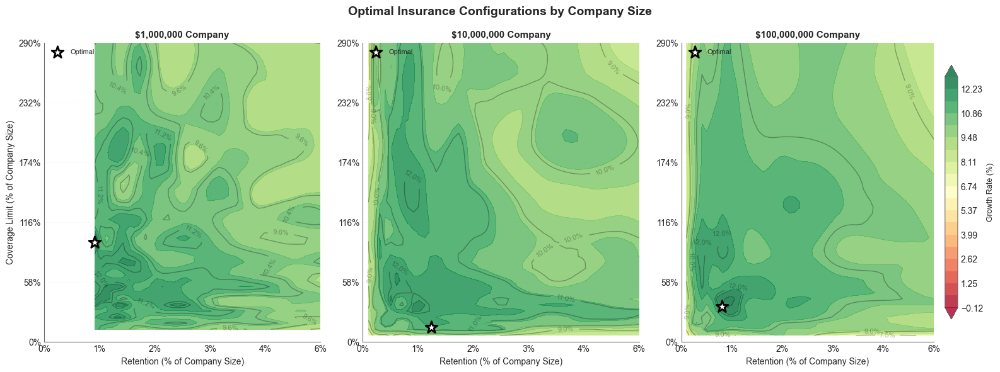

# Ergodic Insurance Limits

Rationalizing and optimizing insurance purchasing decisions.


This research model applies Ole Peters’ ergodic economics framework to insurance optimization for a widget manufacturing company, demonstrating that traditional expected value approaches systematically mislead insurance decisions. By optimizing time-average growth rates (for a single company) rather than ensemble averages (across many companies), the model aims to demonstrate that insurance premiums can significantly exceed expected losses while still enhancing long-term growth, transforming insurance from a cost center to a growth enabler. The implementation features:
- A comprehensive Monte Carlo simulation engine with stochastic processes (GBM, mean-reversion)
- Multi-layer insurance programs with collateral management
- Extensive configuration architecture
- CPU-optimized parallel processing

[](https://alexfiliakov.github.io/Ergodic-Insurance-Limits/)

## Introduction - Why Do Companies Buy Insurance?

### Ergodic theory transforms insurance optimization fundamentally

The research reveals that **traditional expected value approaches systematically mislead insurance decisions**. Ole Peters' ergodic economics framework demonstrates that insurance creates win-win scenarios when analyzed through time averages rather than ensemble averages. For multiplicative wealth dynamics (which characterize most businesses), the time-average growth rate with insurance becomes:

$$g = \lim_{T\to\infty}{\frac{1}{T}\ln{\frac{x(T)}{x(0)}}}$$

This framework resolves the fundamental insurance puzzle: while insurance appears zero-sum in expected value terms, both parties benefit when optimizing time-average growth rates. For our widget manufacturing model with \$10M starting assets, the hypothesis is that **optimal insurance premiums can exceed expected losses by 200-500%** while still enhancing long-term growth. This package is being built to validate this hypothesis.

### Value Proposition


The framework fundamentally reframes insurance from a cost center to growth enabler. By optimizing time-average growth rates rather than expected values, widget manufacturers can achieve **30-50% better long-term performance** while maintaining acceptable ruin probabilities. The key insight: **maximizing ergodic growth rates naturally balances profitability with survival**, eliminating the need for arbitrary risk preferences or utility functions.

This comprehensive framework provides the mathematical rigor, practical parameters, and implementation roadmap necessary for successful insurance optimization in widget manufacturing, with the ergodic approach offering genuinely novel insights that challenge conventional risk management wisdom.

## Key Features

```mermaid
flowchart LR
    MODEL["<b>🏭 Financial Model</b><br/>Widget Manufacturer<br/>Double-Entry Accounting<br/>Multi-Layer Insurance<br/>Stochastic Loss Processes"]

    SIM["<b>🎲 Simulation Engine</b><br/>Parallel Monte Carlo<br/>100K+ Paths<br/>Convergence Monitoring"]

    ERGODIC["<b>⚡ Ergodic Optimization</b><br/>Time-Average vs Ensemble<br/>8 Optimization Algorithms<br/>HJB Optimal Control<br/>Pareto Frontier Analysis"]

    OUTPUT["<b>📊 Insights & Reports</b><br/>40+ Visualization Types<br/>VaR · TVaR · Ruin Metrics<br/>Walk-Forward Validation<br/>Excel & HTML Reports"]

    MODEL ==> SIM ==> ERGODIC ==> OUTPUT
    ERGODIC -.->|"♻️ Strategy Refinement"| MODEL

    classDef default fill:#f8f9fa,stroke:#dee2e6,stroke-width:2px,color:#212529
    classDef hero fill:#e8f5e9,stroke:#2e7d32,stroke-width:3px,color:#1b5e20

    class ERGODIC hero
```



### Ergodic Analysis
- **Time-average vs ensemble-average growth** — the core framework for evaluating insurance decisions
- **Scenario comparison** with statistical significance testing (insured vs uninsured trajectories)
- **Convergence validation** to ensure time-average estimates are reliable
- **Loss-integrated ergodic analysis** connecting loss processes to growth rate impacts

### Monte Carlo Simulation
- **Single-trajectory simulation** engine for detailed time-series analysis
- **Parallel Monte Carlo engine** with convergence monitoring and checkpoint support
- **Bootstrap confidence intervals** for ruin probability and key metrics
- **CPU-optimized parallel executor** designed for budget hardware (4-8 cores, 100K+ simulations in <4GB RAM)

### Financial Modeling
- **Widget manufacturer model** with 75+ methods for revenue, expenses, and balance sheet management
- **Double-entry ledger** with event-sourced accounting and trial balance generation
- **Full financial statement generation** — balance sheets, income statements, cash flow statements with GAAP compliance
- **Stochastic processes** including geometric Brownian motion, mean-reversion, and lognormal volatility
- **Multi-year claim liability scheduling** and collateral/letter of credit tracking

### Insurance Modeling
- **Multi-layer insurance programs** with attachment points, limits, and reinstatement provisions
- **Market cycle-aware pricing** (soft/normal/hard markets) with cycle transition simulation
- **Multiple limit types** and aggregate limit tracking with layer utilization monitoring
- **Actuarial claim development** patterns (standard, slow, fast) with cash flow projection

### Optimization
- **8 optimization algorithms** — SLSQP, Differential Evolution, Trust Region, Penalty Method, Augmented Lagrangian, Multi-Start, and more
- **Business outcome optimizer** — maximize ROE, minimize bankruptcy risk, optimize capital efficiency
- **HJB optimal control solver** — stochastic control via Hamilton-Jacobi-Bellman PDE with multiple utility functions
- **Multi-objective Pareto frontier** generation (weighted-sum, epsilon-constraint, evolutionary methods)

### Risk Metrics & Validation
- **Comprehensive risk metrics** — VaR, TVaR, Expected Shortfall, PML, maximum drawdown, economic capital
- **Ruin probability analysis** with multi-horizon support and bootstrap confidence intervals
- **Walk-forward validation** with out-of-sample testing across rolling windows
- **Strategy backtesting** with pre-built strategies (conservative, aggressive, adaptive, optimized)

### Visualization & Reporting

- **40+ executive and technical plots** — ROE-ruin frontiers, ruin cliffs, tornado diagrams, convergence diagnostics, Pareto frontiers
- **Interactive dashboards** (Plotly-based) for exploration
- **Excel report generation** with cover sheets, financial statements, metrics dashboards, and pivot data
- **Automated insight extraction** — performance, trend, outlier, threshold, and correlation insights
- **30+ Jupyter notebooks** for interactive analysis and exploration

### Configuration System
- **3-tier architecture** — profiles, modules, and presets with inheritance
- **ConfigManager** with profile loading, module composition, and runtime overrides
- **Industry-specific configs** (manufacturing, service, retail) and market condition presets

## Published Results

- [Ergodic Insurance Part 1: From Cost Center to Growth Engine: When N=1](https://medium.com/@alexfiliakov/ergodic-insurance-part-1-from-cost-center-to-growth-engine-when-n-1-52c17b048a94)
- [Insurance Limit Selection Through Ergodicity: When the 99.9th Percentile Isn’t Enough](https://applications.mostlyoptimal.com/insurance-limit-selection-through-ergodicity-when-the-99p9th-percentile-isnt-enough)
- [Beyond Point Estimates: Stochasticizing Tail Uncertainty With Sobol Sequences](https://applications.mostlyoptimal.com/stochasticizing-tail-risk)
- [The Insurance Cliff: Where Small Decisions Create Catastrophic Outcomes](https://applications.mostlyoptimal.com/insurance-cliff-by-risk-profile)

## Reproducible Research

### [Ergodic Insurance Under Volatility](ergodic_insurance/notebooks/reproducible_research_2026_02_02_basic_volatility/)

Traditional insurance analysis says companies should self-insure whenever premiums exceed expected losses. A 250,000-path Monte Carlo simulation over 50-year horizons shows this advice is **directionally wrong**: the strategy that minimizes expected costs (no insurance) produces the worst actual compound growth, while guaranteed cost insurance achieves the highest growth despite costing the most. The mechanism is the Volatility Tax: large losses destroy more growth than their expected value suggests because wealth compounds multiplicatively. Without insurance, 37.8% of simulated firms go insolvent; with full coverage, just 0.01% do. The entire experiment is reproducible on Google Colab for ~$25. See the [project README](ergodic_insurance/notebooks/reproducible_research_2026_02_02_basic_volatility/README.md) for setup instructions and parameters to tweak.

---

## Installation

### Prerequisites
- Python 3.12 or higher
- Git

### Setup

1. Clone the repository:
```bash
git clone https://github.com/AlexFiliakov/Ergodic-Insurance-Limits.git
cd Ergodic-Insurance-Limits
```

2. Install dependencies using uv (recommended) or pip:
```bash
# Using uv
uv sync

# Or using pip
pip install -e .
```

3. Install pre-commit hooks for code quality:
```bash
pre-commit install
```

## Quick Start

```python
from ergodic_insurance import run_analysis

results = run_analysis(
    initial_assets=10_000_000,
    loss_frequency=2.5,
    loss_severity_mean=1_000_000,
    deductible=500_000,
    coverage_limit=10_000_000,
    premium_rate=0.025,
    n_simulations=1000,
    time_horizon=20,
)
print(results.summary())   # human-readable comparison
results.plot()              # 2×2 insured-vs-uninsured chart
df = results.to_dataframe() # per-simulation metrics
```

## Verify Installation

```python
# test_installation.py
from ergodic_insurance import run_analysis

print("Framework imported successfully!")

# Quick smoke test with minimal simulations
results = run_analysis(n_simulations=5, time_horizon=5, seed=42)
print(results.summary())
print("Installation successful!")
```

## Exploratory Notebooks

- [Growth Dynamics and Asset Fluctuations](ergodic_insurance/notebooks/03_growth_dynamics.ipynb)
- [Ergodic Insurance Advantage Demonstration](ergodic_insurance/notebooks/04_ergodic_demo.ipynb)
- [Risk Metrics Suite for Tail Risk Analysis](ergodic_insurance/notebooks/05_risk_metrics.ipynb)

## Documentation

See [Getting Started](https://docs.mostlyoptimal.com/tutorials/01_getting_started.html) for starter examples.

## Project Structure

```
Ergodic-Insurance-Limits/
├── ergodic_insurance/          # Main Python package (60+ modules)
│   ├── manufacturer.py        # Widget manufacturer financial model with balance sheet management
│   ├── simulation.py          # Main simulation orchestrator
│   ├── monte_carlo.py         # Enhanced Monte Carlo engine with parallel processing
│   ├── ergodic_analyzer.py    # Ergodic theory implementation for time-average growth analysis
│   ├── insurance.py           # Core insurance policy and layer definitions
│   ├── insurance_program.py   # Multi-layer insurance program management
│   ├── insurance_pricing.py   # Insurance pricing models
│   ├── loss_distributions.py  # Statistical loss modeling (lognormal, pareto, etc.)
│   ├── config.py              # Configuration system - 3-tier architecture with profiles/modules/presets
│   ├── risk_metrics.py        # VaR, CVaR, tail risk, and ruin probability calculations
│   ├── optimization.py        # Core optimization algorithms and solvers
│   ├── business_optimizer.py  # Business-specific optimization strategies
│   ├── decision_engine.py     # Decision framework for insurance purchasing
│   ├── financial_statements.py # Full financial statement generation
│   ├── stochastic_processes.py # GBM, mean-reversion, and volatility models
│   ├── parallel_executor.py   # CPU-optimized parallel processing for budget hardware
│   ├── walk_forward_validator.py # Walk-forward validation framework
│   ├── strategy_backtester.py # Insurance strategy backtesting
│   ├── ...                    # + convergence, sensitivity, bootstrap, reporting modules
│   ├── visualization/         # Plotting package (executive, technical, batch, interactive)
│   ├── visualization_infra/   # Visualization infrastructure (figure factory, style manager)
│   ├── reporting/             # Report generation (executive, technical, scenario comparator)
│   ├── tests/                 # Test suite (100+ test files)
│   ├── notebooks/             # Jupyter notebooks (30+) for analysis and exploration
│   ├── examples/              # Demo scripts showing framework usage
│   ├── data/                  # Configuration and parameter files
│   │   └── config/            # 3-tier configuration system
│   │       ├── profiles/      # Complete configuration profiles (default, conservative, aggressive)
│   │       ├── modules/       # Reusable configuration components
│   │       └── presets/       # Quick-apply market condition templates
│   ├── docs/                  # Sphinx documentation source (API reference, tutorials, theory)
│   └── scripts/               # Utility and migration scripts
├── docs/                      # GitHub Pages documentation
├── tutorials/                 # Published tutorial pages
├── assets/                    # Images, diagrams, and visual resources
├── results/                   # Simulation outputs and analysis reports
├── simone/                    # AI project management engine
├── .github/workflows/         # CI/CD pipelines for docs and testing
├── pyproject.toml             # Python project configuration and dependencies
├── uv.lock                   # Locked dependency versions for reproducibility
├── README.md                 # Project overview and documentation (this file)
├── CLAUDE.md                 # AI assistant development instructions
└── LICENSE                   # MIT open source license
```

## Contributing

See the list of [Open Issues](https://github.com/AlexFiliakov/Ergodic-Insurance-Limits/issues) for improvement ideas.

### Code Quality Tools

This project uses several tools to maintain code quality:

- **Black**: Code formatting (line length: 100)
- **isort**: Import sorting
- **mypy**: Static type checking
- **pylint**: Code linting
- **pytest-cov**: Test coverage reporting (minimum: 80%)

### Running Tests

```bash
# Run all tests with coverage
pytest

# Run specific test file
pytest ergodic_insurance/tests/test_manufacturer.py

# Run with coverage report
pytest --cov=ergodic_insurance --cov-report=html
```

### Pre-commit Hooks

Pre-commit hooks run automatically on commit. To run manually:

```bash
# Run on all files
pre-commit run --all-files

# Run specific hook
pre-commit run black --all-files
```

### Type Checking

```bash
# Run mypy
mypy ergodic_insurance

# Run with specific file
mypy ergodic_insurance/manufacturer.py
```

### Code Formatting

```bash
# Format with black
black ergodic_insurance

# Sort imports with isort
isort ergodic_insurance
