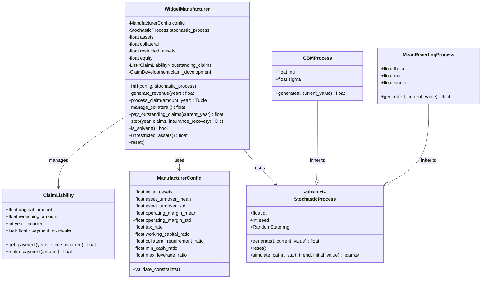
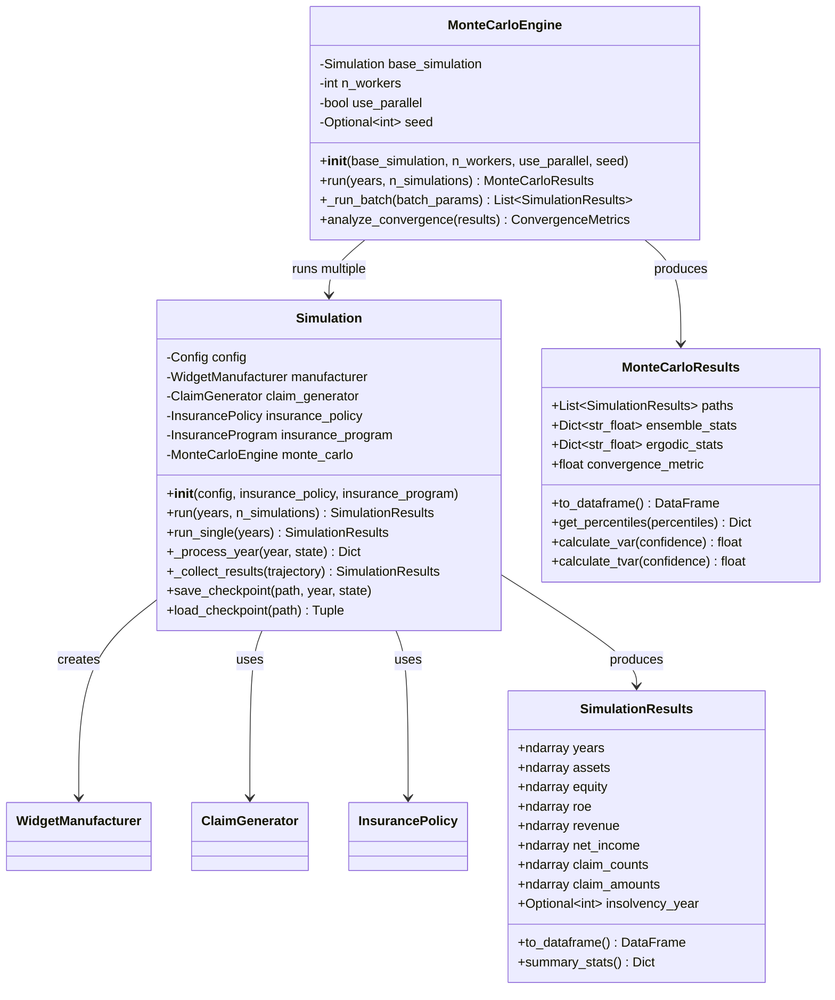
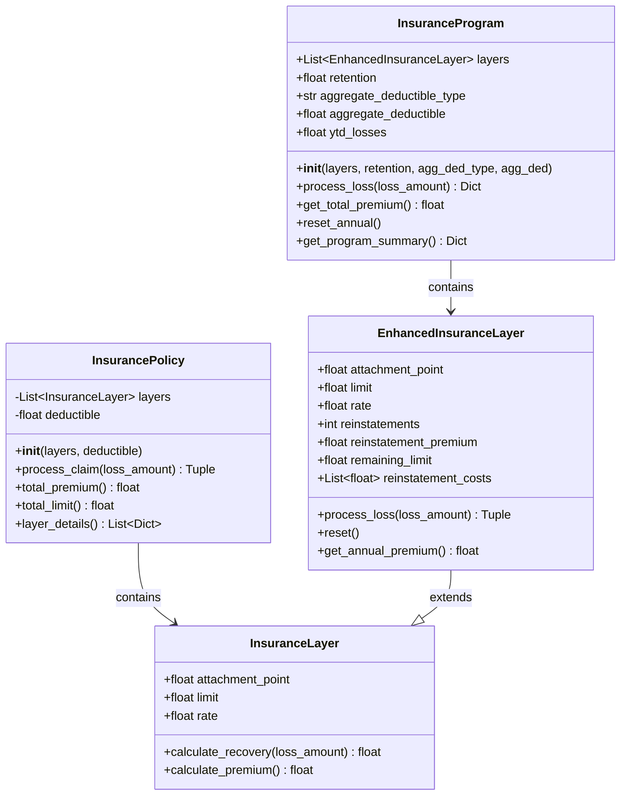
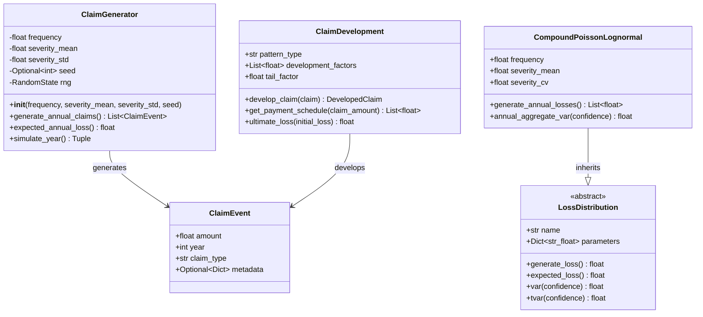
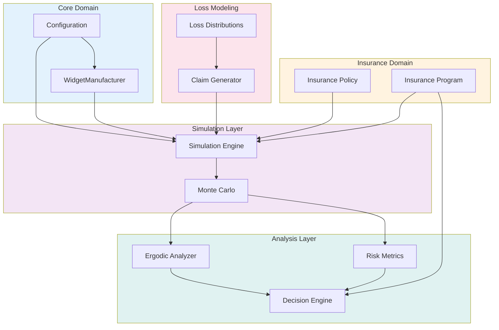

# Core Classes Architecture

## Overview
This document details the class structures and relationships for the core components of the Ergodic Insurance system.

## Manufacturer and Financial Model

## Simulation Engine

## Insurance Framework

## Claims and Loss Modeling

## Bird's-Eye View: Complete System

