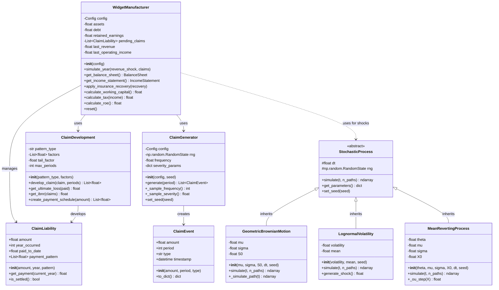

# Core Classes Diagram

(financial-core-classes)=
## Financial Core Classes

(insurance-classes)=
(insurance-classes)=
## Insurance Classes

(loss-distribution-classes)=
(loss-distribution-classes)=
## Loss Distribution Classes

(simulation-engine-classes)=
## Simulation Engine Classes

## Key Relationships Summary

1. **Financial Core**: `WidgetManufacturer` is the central financial model that integrates claims, stochastic shocks, and insurance
2. **Claims Pipeline**: `ClaimGenerator` → `ClaimEvent` → `ClaimDevelopment` → `ClaimLiability`
3. **Insurance Structure**: `InsuranceProgram` orchestrates multiple `EnhancedInsuranceLayer` with state tracking
4. **Loss Modeling**: `ManufacturingLossGenerator` combines frequency and severity distributions
5. **Simulation**: `MonteCarloEngine` parallelizes multiple `Simulation` runs with result aggregation
6. **Stochastic**: All stochastic processes inherit from abstract `StochasticProcess` base class
