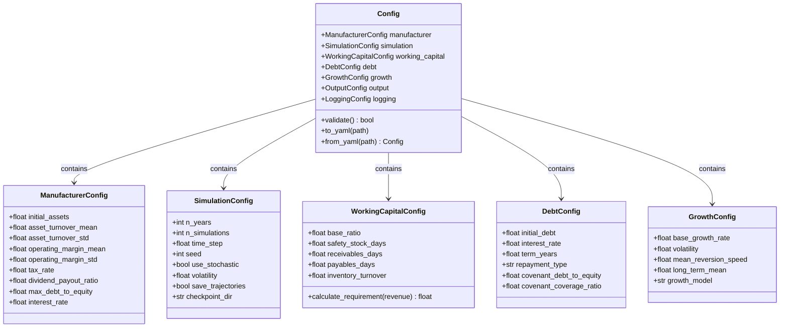
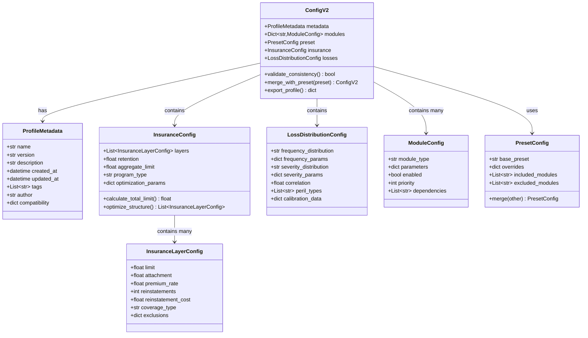
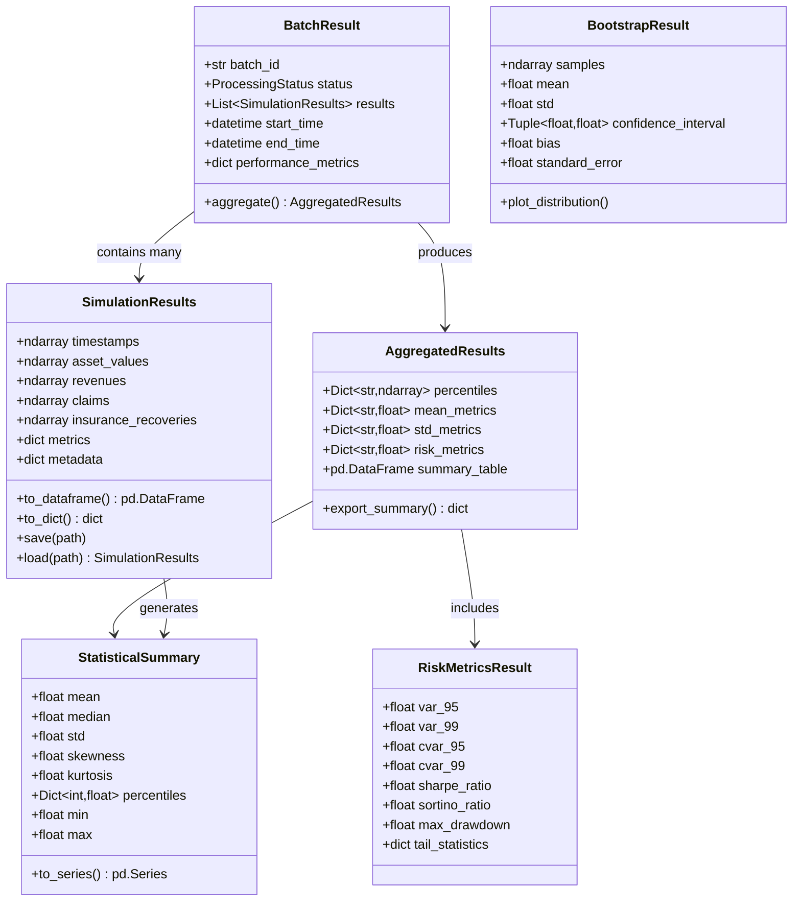
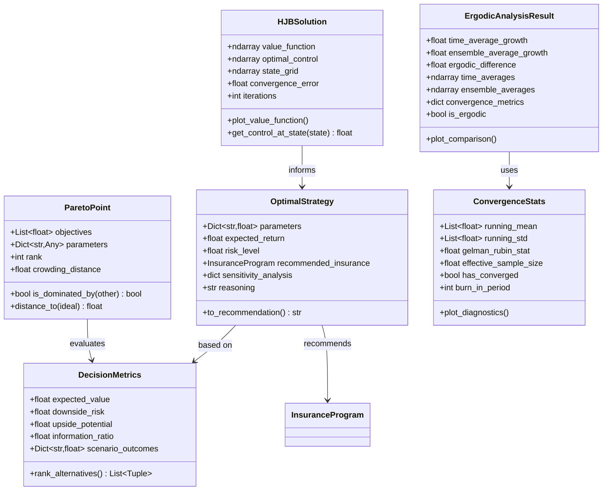
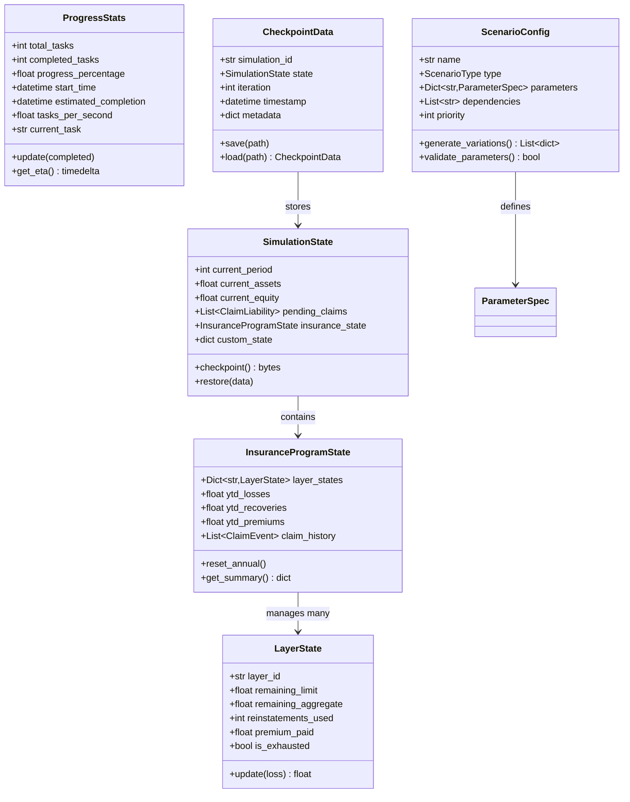
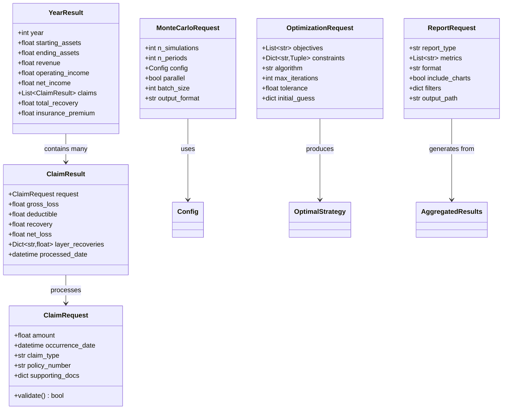

# Data Models and Configuration Classes

(configuration-data-models)=
## Configuration Data Models

## ConfigV2 Enhanced Models

(result-data-models)=
## Result Data Models

## Analysis Result Models

(state-and-progress-models)=
## State and Progress Models

## Data Transfer Objects

## Key Data Model Patterns

1. **Configuration Hierarchy**: Nested configuration models with validation at each level
2. **Result Aggregation**: Hierarchical results from individual simulations to batch aggregations
3. **State Management**: Comprehensive state tracking for checkpointing and recovery
4. **Request-Response**: Clean DTOs for API boundaries and service interactions
5. **Immutable Results**: Result objects are designed to be immutable after creation
6. **Serialization**: All data models support serialization to/from standard formats (JSON, YAML, HDF5)
