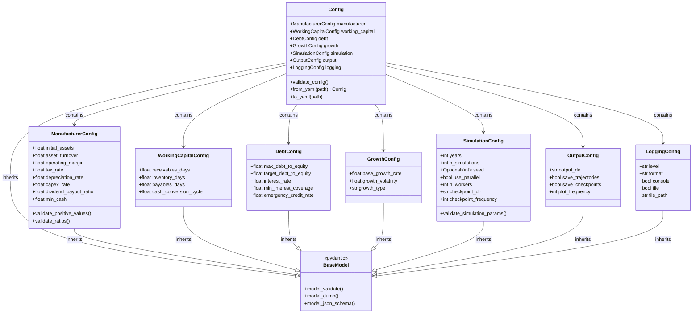

# Data Models and Configuration Architecture

## Overview
This document details the data models, configuration structures, and their relationships within the Ergodic Insurance system.

## Configuration Models (Pydantic)

## Result Data Models

## Event and State Models

## Data Flow Relationships

## Configuration Loading Pattern

## Data Persistence

