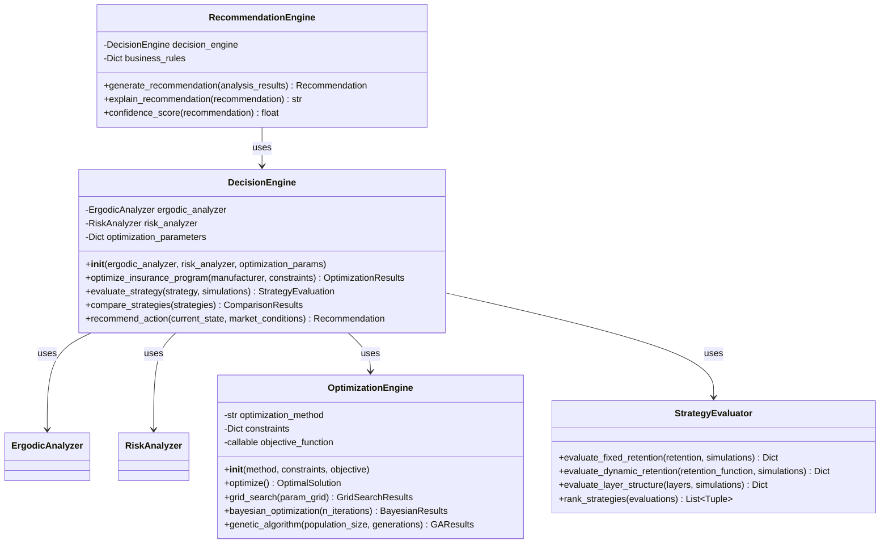
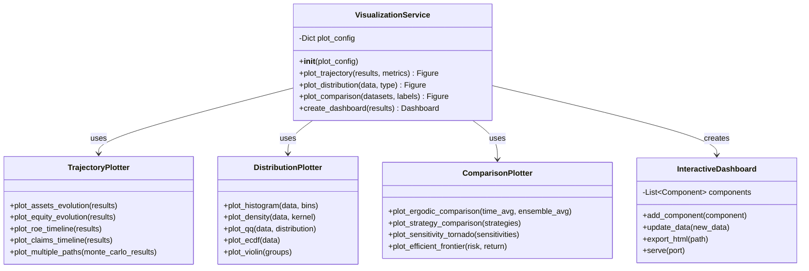
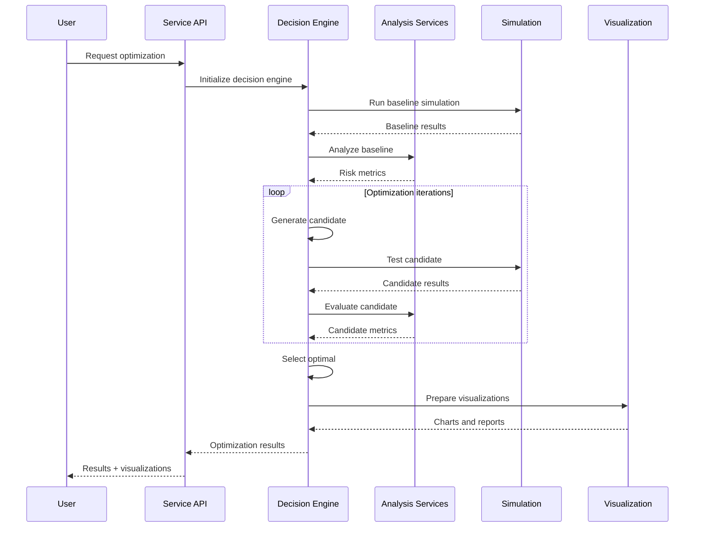
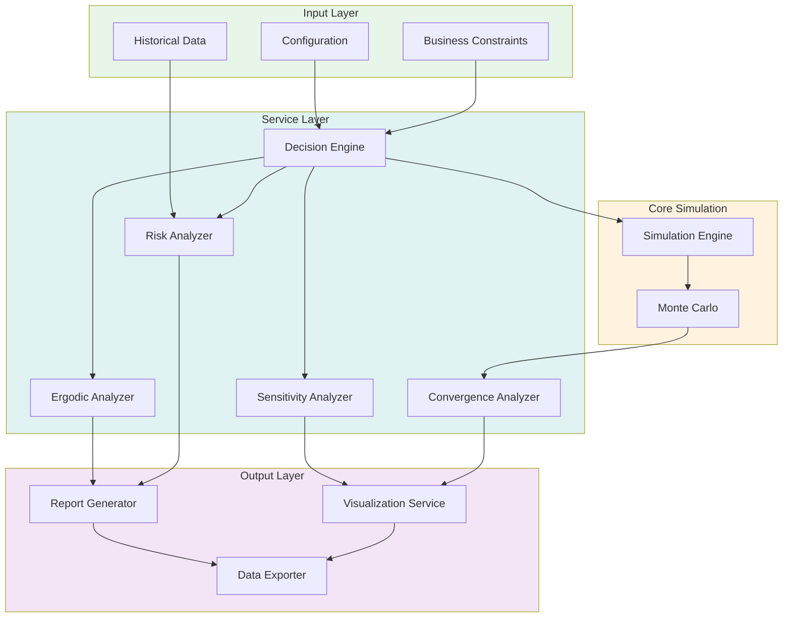
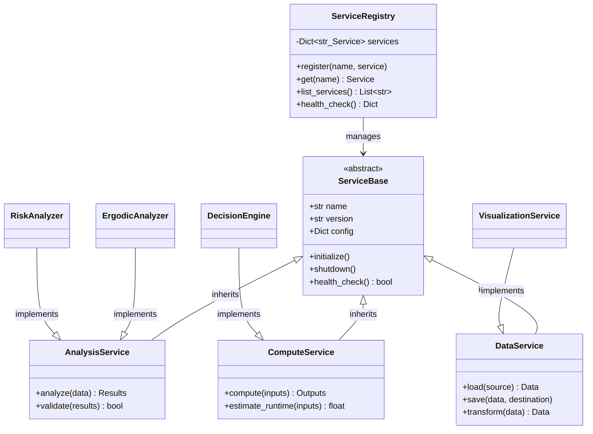

# Service Layer Architecture

## Overview
This document details the service layer components that provide analysis, decision-making, and visualization capabilities.

## Analysis Services

```mermaid
classDiagram
    class ErgodicAnalyzer {
        -float convergence_threshold
        +__init__(convergence_threshold)
        +calculate_time_average(values) float
        +calculate_ensemble_average(paths) float
        +calculate_growth_rate(trajectory) float
        +compare_averages(simulation_results) Dict
        +analyze_insurance_impact(with_insurance, without_insurance) Dict
        +validate_ergodicity(results) bool
        +plot_ergodic_comparison(results)
    }

    class RiskAnalyzer {
        -Dict risk_parameters
        +__init__(risk_parameters)
        +calculate_var(data, confidence) float
        +calculate_tvar(data, confidence) float
        +calculate_expected_shortfall(data, confidence) float
        +calculate_maximum_drawdown(trajectory) float
        +calculate_ruin_probability(paths, threshold) float
        +calculate_sharpe_ratio(returns, risk_free_rate) float
        +calculate_sortino_ratio(returns, mar) float
        +comprehensive_risk_report(results) RiskMetrics
    }

    class ConvergenceAnalyzer {
        -float tolerance
        -int min_samples
        +__init__(tolerance, min_samples)
        +test_convergence(data) ConvergenceResults
        +calculate_standard_error(data) float
        +gelman_rubin_statistic(chains) float
        +effective_sample_size(data) int
        +plot_convergence_diagnostic(data)
    }

    class SensitivityAnalyzer {
        -Dict baseline_params
        -List~str~ parameters_to_vary
        +__init__(baseline_params, parameters_to_vary)
        +run_sensitivity_analysis(simulation, param_ranges) Dict
        +calculate_elasticity(param, results) float
        +tornado_diagram(sensitivities)
        +heatmap_2d_sensitivity(param1, param2, results)
    }
```

## Decision Engine

## Visualization Services

## Integration Layer

## Service Orchestration

## Complete Service Architecture

