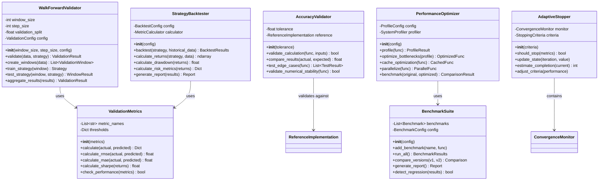

# Service Layer Architecture

(analytics-and-optimization-services)=
## Analytics and Optimization Services

(simulation-orchestration-services)=
## Simulation Orchestration Services

(statistical-analysis-services)=
## Statistical Analysis Services

(validation-framework-services)=
## Validation Framework Services

(control-and-optimization-services)=
## Control and Optimization Services

(service-integration-layer)=
## Service Integration Layer

## Service Responsibilities

### Core Services

| Service | Primary Responsibility | Key Operations |
|---------|----------------------|----------------|
| **MonteCarloEngine** | Orchestrate ensemble simulations | run(), checkpoint(), aggregate() |
| **ErgodicAnalyzer** | Ergodic theory calculations | time_average(), ensemble_average() |
| **BusinessOptimizer** | Find optimal strategies | optimize(), evaluate_strategy() |
| **RiskMetrics** | Calculate risk measures | VaR, CVaR, Sharpe, Sortino |

### Infrastructure Services

| Service | Primary Responsibility | Key Operations |
|---------|----------------------|----------------|
| **ParallelExecutor** | Distribute computation | execute(), map_reduce() |
| **TrajectoryStorage** | Persist simulation data | store(), retrieve(), query() |
| **ProgressMonitor** | Track execution progress | update(), get_eta() |
| **ResultAggregator** | Combine and summarize results | aggregate(), hierarchical_aggregate() |

### Analysis Services

| Service | Primary Responsibility | Key Operations |
|---------|----------------------|----------------|
| **BootstrapAnalyzer** | Bootstrap confidence intervals | bootstrap_statistic(), confidence_interval() |
| **StatisticalTests** | Hypothesis testing | t_test(), ks_test(), adf_test() |
| **SummaryStatistics** | Statistical summaries | calculate(), rolling_statistics() |
| **ResultExporter** | Export results to various formats | export_csv(), export_html_report() |

### Control Services

| Service | Primary Responsibility | Key Operations |
|---------|----------------------|----------------|
| **HJBSolver** | Solve Hamilton-Jacobi-Bellman equations | solve(), compute_optimal_control() |
| **OptimalController** | Implement control strategies | compute_control(), update_feedback() |
| **ScenarioManager** | Manage simulation scenarios | create_scenario(), generate_grid() |
| **BatchProcessor** | Process simulation batches | process_batch(), merge_results() |

### Validation Services

| Service | Primary Responsibility | Key Operations |
|---------|----------------------|----------------|
| **WalkForwardValidator** | Out-of-sample validation | validate(), create_windows() |
| **StrategyBacktester** | Historical strategy testing | backtest(), calculate_returns() |
| **ValidationMetrics** | Performance metric calculation | calculate(), check_performance() |
| **AccuracyValidator** | Numerical accuracy testing | validate_calculation(), test_edge_cases() |
| **PerformanceOptimizer** | Speed optimization | profile(), optimize_bottlenecks() |
| **BenchmarkSuite** | Performance benchmarking | run_all(), detect_regression() |
| **AdaptiveStopper** | Early stopping logic | should_stop(), estimate_completion() |

## Key Service Patterns

1. **Dependency Injection**: Services receive dependencies through constructors
2. **Strategy Pattern**: Multiple implementations for control strategies
3. **Chain of Responsibility**: Aggregators can be chained for processing
4. **Observer Pattern**: Progress monitoring with callbacks
5. **Repository Pattern**: TrajectoryStorage abstracts data persistence
6. **Factory Pattern**: ScenarioManager creates scenario configurations
7. **Template Method**: Abstract base classes for aggregators and strategies
8. **Singleton Pattern**: Service registry maintains single instances
