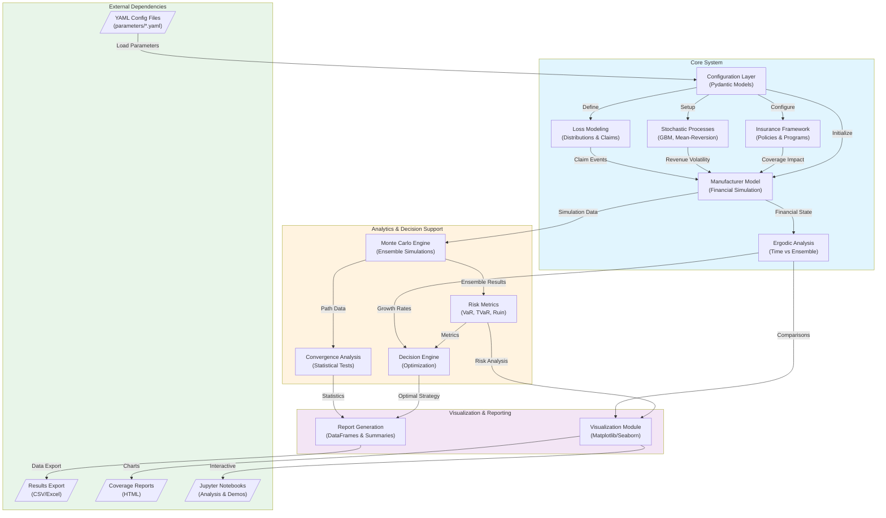

# High-Level System Context Diagram

## Overview
This diagram shows the overall architecture of the Ergodic Insurance Limits system, illustrating how different components interact to provide insurance optimization through ergodic theory.

## Component Descriptions

### External Dependencies
- **YAML Config Files**: Parameter configurations for different scenarios (baseline, conservative, optimistic, stochastic)
- **Results Export**: Simulation results exported to CSV/Excel for further analysis
- **Coverage Reports**: HTML test coverage reports from pytest
- **Jupyter Notebooks**: Interactive analysis and demonstration notebooks

### Core System
- **Configuration Layer**: Pydantic-based configuration management with validation
- **Manufacturer Model**: Widget manufacturer financial simulation with balance sheet evolution
- **Insurance Framework**: Multi-layer insurance policies and programs with reinstatements
- **Stochastic Processes**: GBM, lognormal volatility, and mean-reversion processes for uncertainty modeling
- **Loss Modeling**: Claim generation with Poisson frequency and lognormal severity
- **Ergodic Analysis**: Core ergodic theory implementation comparing time vs ensemble averages

### Analytics & Decision Support
- **Monte Carlo Engine**: Parallel simulation engine for ensemble analysis
- **Risk Metrics**: Comprehensive risk metrics including VaR, TVaR, and ruin probability
- **Decision Engine**: Insurance optimization and decision-making algorithms
- **Convergence Analysis**: Statistical tests for simulation convergence

### Visualization & Reporting
- **Visualization Module**: Matplotlib and Seaborn-based charting capabilities
- **Report Generation**: Structured output generation with pandas DataFrames

## Data Flow Patterns

1. **Configuration Flow**: YAML → Pydantic Models → Component Initialization
2. **Simulation Flow**: Manufacturer + Stochastic + Loss → Time Evolution → Results
3. **Analysis Flow**: Simulation Results → Risk/Ergodic Analysis → Decision Support
4. **Output Flow**: Analysis Results → Visualization/Reports → External Formats
