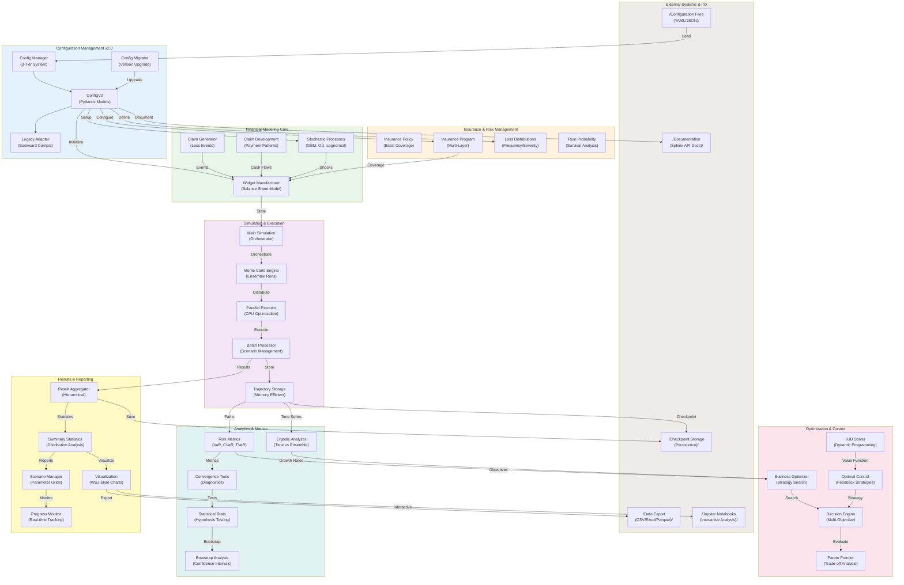

# High-Level System Context Diagram

## Overview
This diagram shows the overall architecture of the Ergodic Insurance Limits system, illustrating how different components interact to provide insurance optimization through ergodic theory.

## Component Descriptions

### External Systems & I/O
- **Configuration Files**: YAML and JSON configuration files for scenarios and parameters
- **Data Export**: Results export to CSV, Excel, and Parquet formats
- **Checkpoint Storage**: Persistence layer for simulation checkpoints and recovery
- **Jupyter Notebooks**: Interactive analysis and demonstration environment
- **Documentation**: Sphinx-generated API documentation

### Configuration Management v2.0
- **Config Manager**: 3-tier configuration system (profiles, modules, presets)
- **ConfigV2**: Enhanced Pydantic v2 models with validation
- **Legacy Adapter**: Backward compatibility with v1 configurations
- **Config Migrator**: Tool for upgrading legacy configurations

### Financial Modeling Core
- **Widget Manufacturer**: Balance sheet evolution and financial state modeling
- **Claim Generator**: Loss event generation with configurable distributions
- **Claim Development**: Payment pattern modeling over time
- **Stochastic Processes**: GBM, Ornstein-Uhlenbeck, and lognormal volatility

### Insurance & Risk Management
- **Insurance Policy**: Basic insurance coverage implementation
- **Insurance Program**: Multi-layer insurance structures with reinstatements
- **Loss Distributions**: Frequency and severity modeling (Poisson, lognormal, Pareto)
- **Ruin Probability**: Survival analysis and bankruptcy risk assessment

### Optimization & Control
- **Business Optimizer**: Strategy search and optimization algorithms
- **Decision Engine**: Multi-objective decision support system
- **Pareto Frontier**: Trade-off analysis between competing objectives
- **HJB Solver**: Hamilton-Jacobi-Bellman equation solver for dynamic programming
- **Optimal Control**: Feedback control strategies for adaptive decisions

### Simulation Framework
- **Main Simulation**: Central orchestrator for simulation execution
- **Monte Carlo Engine**: Ensemble simulation runner
- **Parallel Executor**: CPU-optimized parallel processing
- **Batch Processor**: Scenario batch management with checkpointing
- **Trajectory Storage**: Memory-efficient storage of simulation paths

### Analytics & Metrics
- **Ergodic Analyzer**: Time average vs ensemble average comparison
- **Risk Metrics**: Comprehensive risk measures (VaR, CVaR, TVaR, Sharpe, etc.)
- **Convergence Tools**: Statistical convergence diagnostics
- **Bootstrap Analysis**: Confidence interval estimation
- **Statistical Tests**: Hypothesis testing framework

### Results Processing
- **Result Aggregator**: Hierarchical aggregation of simulation results
- **Summary Statistics**: Distribution analysis and statistical summaries
- **Scenario Manager**: Parameter grid management and scenario generation
- **Progress Monitor**: Real-time simulation progress tracking
- **Visualization**: WSJ-style professional charting

## Data Flow Patterns

1. **Configuration Pipeline**: External configs → Manager → V2 models → Component initialization
2. **Simulation Pipeline**: Financial model + Stochastic + Insurance → Simulation engine → Parallel execution
3. **Analytics Pipeline**: Raw trajectories → Metrics calculation → Statistical analysis → Optimization
4. **Results Pipeline**: Aggregation → Summary stats → Visualization → Export

## Key Architectural Decisions

1. **Modular Design**: Each component has a single responsibility with clear interfaces
2. **Configuration-Driven**: All parameters externalized through Pydantic models
3. **Parallel Processing**: CPU-optimized execution for large-scale simulations
4. **Memory Efficiency**: Trajectory storage and batch processing for long simulations
5. **Extensibility**: Plugin-style architecture for new loss distributions and processes
6. **Testing**: 100% test coverage with comprehensive unit and integration tests
