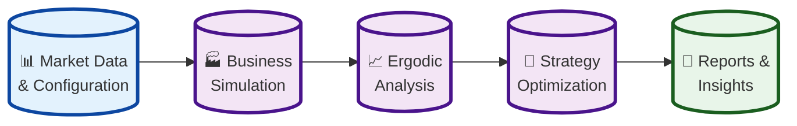
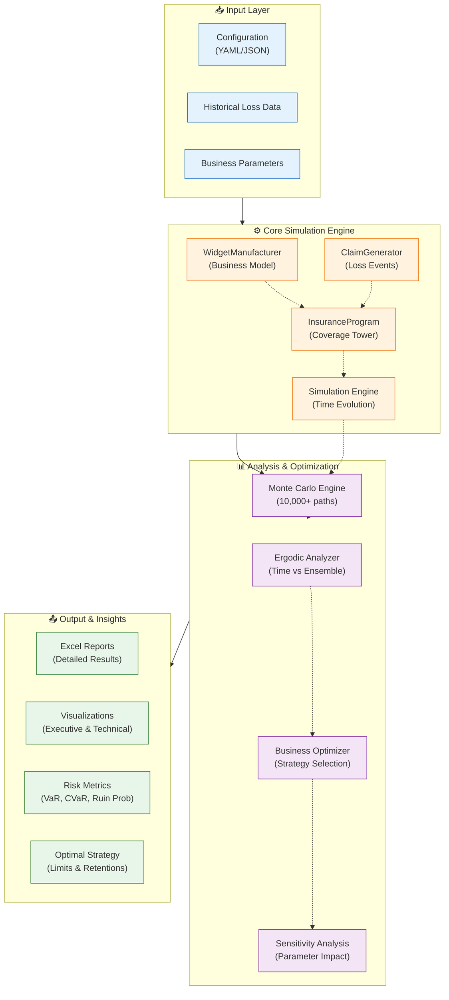
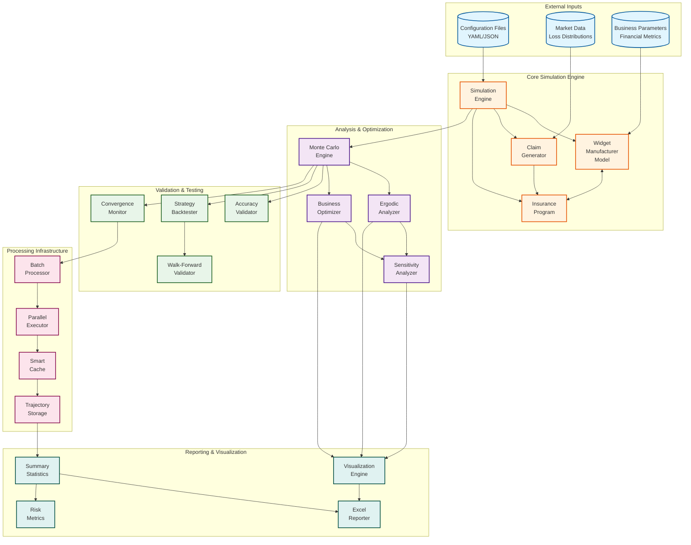

# High-Level System Context Diagram

## Executive Summary

The Ergodic Insurance Limits framework analyzes insurance decisions using time-average (ergodic) theory rather than traditional ensemble averages. This approach reveals that insurance can enhance business growth even when premiums exceed expected losses by 200-500%, transforming insurance from a cost center to a growth enabler.

### Simplified System Architecture

**Key Innovation**: By comparing time-average growth (what one business experiences over time) with ensemble-average growth (statistical average across many businesses), the framework demonstrates that insurance fundamentally transforms the growth dynamics of volatile businesses.

### System Architecture Overview (Detailed)

The actual implementation follows a sophisticated multi-layer architecture:

### Reference to System Architecture Diagram

For a visual representation, see: [`assets/system_architecture.png`](../../assets/system_architecture.png)

The PNG diagram shows the simplified flow, while the detailed architecture above reflects the actual implementation with all major components.

## Detailed System Architecture

This diagram shows the overall architecture of the Ergodic Insurance Limits framework, including the main components, external dependencies, and data flow between major modules.

## System Overview

The Ergodic Insurance Limits framework is designed as a modular, high-performance system for analyzing insurance purchasing decisions through the lens of ergodic theory. The architecture follows these key principles:

### 1. **Separation of Concerns**
- **Core Simulation**: Handles the fundamental business and insurance mechanics
- **Analysis Layer**: Provides ergodic and optimization capabilities
- **Infrastructure**: Manages computational efficiency and data handling
- **Validation**: Ensures accuracy and robustness of results
- **Output**: Delivers insights through visualizations and reports

### 2. **Data Flow Architecture**
- Configuration and market data flow into the simulation engine
- Simulations generate trajectories processed by analysis modules
- Infrastructure layers provide caching and parallelization
- Results flow to visualization and reporting components

### 3. **Key Interactions**
- The **Simulation Engine** orchestrates the time evolution of the business model
- The **Manufacturer Model** interacts with the **Insurance Program** for claim processing
- **Monte Carlo Engine** generates multiple scenarios for statistical analysis
- **Ergodic Analyzer** compares time-average vs ensemble-average growth
- **Batch Processor** and **Parallel Executor** enable high-performance computing

### 4. **External Dependencies**
The system integrates with:
- NumPy/SciPy for numerical computations
- Pandas for data manipulation
- Matplotlib/Plotly for visualizations
- OpenPyXL for Excel reporting
- Multiprocessing for parallel execution
