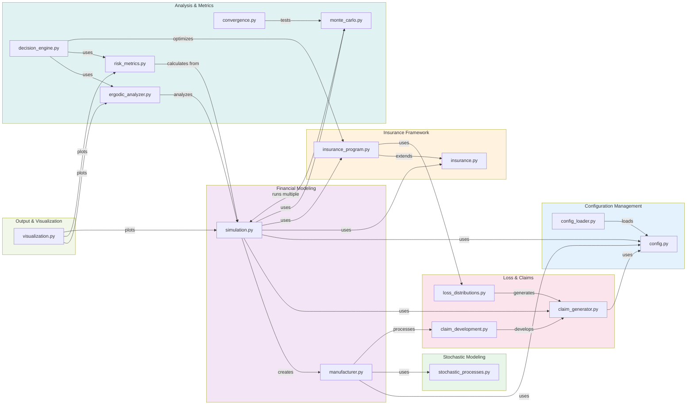
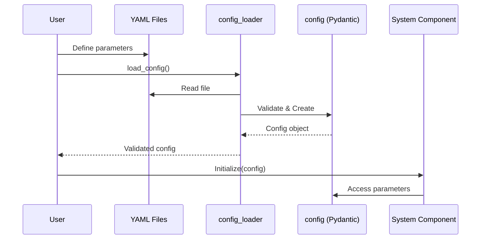
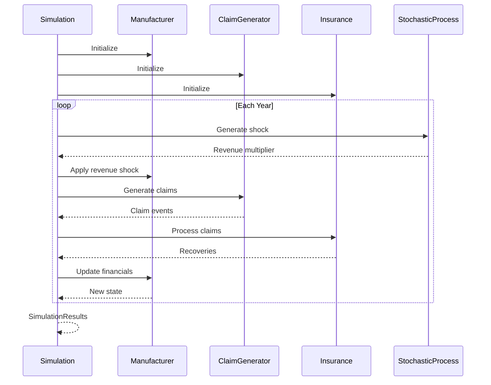
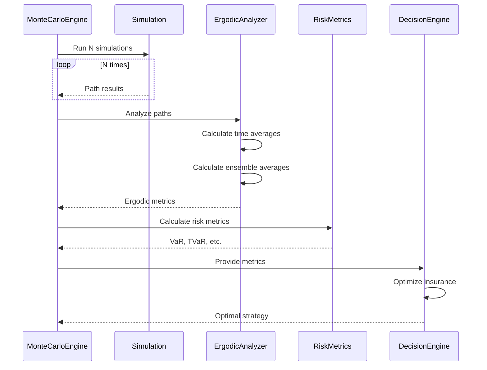

# Module Dependencies and Relationships

## Overview
This diagram illustrates the detailed module dependencies and import relationships within the Ergodic Insurance system.

## Module Interaction Patterns

### 1. Configuration Flow

### 2. Simulation Flow

### 3. Ergodic Analysis Flow

## Key Module Responsibilities

### Core Modules

| Module | Primary Responsibility | Key Classes |
|--------|----------------------|-------------|
| `config.py` | Configuration models with validation | Config, ManufacturerConfig, InsuranceConfig |
| `manufacturer.py` | Financial model and balance sheet | WidgetManufacturer, ClaimLiability |
| `simulation.py` | Time evolution orchestration | Simulation, SimulationResults |
| `insurance.py` | Basic insurance structures | InsuranceLayer, InsurancePolicy |

### Advanced Modules

| Module | Primary Responsibility | Key Classes |
|--------|----------------------|-------------|
| `insurance_program.py` | Complex insurance programs | EnhancedInsuranceLayer, InsuranceProgram |
| `ergodic_analyzer.py` | Ergodic theory calculations | ErgodicAnalyzer, ErgodicAnalysisResults |
| `monte_carlo.py` | Ensemble simulation engine | MonteCarloEngine, MonteCarloResults |
| `decision_engine.py` | Insurance optimization | DecisionEngine, OptimizationResults |

### Support Modules

| Module | Primary Responsibility | Key Classes |
|--------|----------------------|-------------|
| `stochastic_processes.py` | Random process generation | GBMProcess, MeanRevertingProcess |
| `claim_generator.py` | Claim event generation | ClaimGenerator, ClaimEvent |
| `loss_distributions.py` | Loss distribution modeling | LossDistribution, LossData |
| `risk_metrics.py` | Risk metric calculations | RiskMetrics, RiskResults |
