# Module Overview and Dependencies

## Module Dependency Graph

This diagram shows the detailed module dependencies and import relationships in the ergodic insurance system.

```mermaid
graph TD
    subgraph Core["Core Financial Domain"]
        manufacturer["manufacturer.py<br/>WidgetManufacturer<br/>ClaimLiability"]
        claim_generator["claim_generator.py<br/>ClaimGenerator<br/>ClaimEvent"]
        claim_development["claim_development.py<br/>ClaimDevelopment<br/>Claim, ClaimCohort<br/>CashFlowProjector"]
        stochastic["stochastic_processes.py<br/>GeometricBrownianMotion<br/>LognormalVolatility<br/>MeanRevertingProcess"]
    end

    subgraph Insurance["Insurance Domain"]
        insurance["insurance.py<br/>InsuranceLayer<br/>InsurancePolicy"]
        insurance_program["insurance_program.py<br/>InsuranceProgram<br/>EnhancedInsuranceLayer<br/>LayerState"]
        loss_distributions["loss_distributions.py<br/>LossDistribution<br/>LognormalLoss<br/>ParetoLoss<br/>FrequencyGenerator"]
        ruin_probability["ruin_probability.py<br/>RuinProbabilityAnalyzer<br/>RuinProbabilityResults"]
    end

    subgraph Simulation["Simulation Engine"]
        simulation["simulation.py<br/>Simulation<br/>SimulationResults"]
        monte_carlo["monte_carlo.py<br/>MonteCarloEngine<br/>SimulationConfig<br/>SimulationResults"]
        parallel_executor["parallel_executor.py<br/>ParallelExecutor<br/>CPUProfile<br/>ChunkingStrategy"]
        batch_processor["batch_processor.py<br/>BatchProcessor<br/>BatchResult<br/>AggregatedResults"]
        trajectory_storage["trajectory_storage.py<br/>TrajectoryStorage<br/>StorageConfig<br/>SimulationSummary"]
    end

    subgraph Analytics["Analytics & Metrics"]
        ergodic_analyzer["ergodic_analyzer.py<br/>ErgodicAnalyzer"]
        risk_metrics["risk_metrics.py<br/>RiskMetrics<br/>RiskMetricsResult<br/>ROEAnalyzer"]
        convergence["convergence.py<br/>ConvergenceDiagnostics<br/>ConvergenceStats"]
        bootstrap_analysis["bootstrap_analysis.py<br/>BootstrapAnalyzer<br/>BootstrapResult"]
        statistical_tests["statistical_tests.py<br/>HypothesisTestResult"]
    end

    subgraph Optimization["Optimization & Control"]
        business_optimizer["business_optimizer.py<br/>BusinessOptimizer<br/>OptimalStrategy<br/>BusinessObjective"]
        decision_engine["decision_engine.py<br/>InsuranceDecisionEngine<br/>DecisionMetrics<br/>InsuranceDecision"]
        pareto_frontier["pareto_frontier.py<br/>ParetoFrontier<br/>ParetoPoint<br/>Objective"]
        optimization["optimization.py"]
        hjb_solver["hjb_solver.py<br/>HJBSolver<br/>HJBProblem<br/>StateSpace<br/>UtilityFunction"]
        optimal_control["optimal_control.py<br/>OptimalController<br/>ControlStrategy<br/>HJBFeedbackControl"]
    end

    subgraph Results["Results & Reporting"]
        result_aggregator["result_aggregator.py<br/>ResultAggregator<br/>TimeSeriesAggregator<br/>HierarchicalAggregator"]
        summary_statistics["summary_statistics.py<br/>SummaryStatistics<br/>QuantileCalculator<br/>DistributionFitter"]
        scenario_manager["scenario_manager.py<br/>ScenarioManager<br/>ScenarioConfig<br/>ParameterSpec"]
        progress_monitor["progress_monitor.py<br/>ProgressMonitor<br/>ProgressStats"]
        visualization["visualization.py<br/>WSJFormatter"]
    end

    subgraph Config["Configuration"]
        config["config.py<br/>Config<br/>ManufacturerConfig<br/>SimulationConfig"]
        config_v2["config_v2.py<br/>ConfigV2<br/>InsuranceConfig<br/>ModuleConfig"]
        config_manager["config_manager.py<br/>ConfigManager"]
        config_loader["config_loader.py<br/>ConfigLoader"]
        config_compat["config_compat.py<br/>LegacyConfigAdapter<br/>ConfigTranslator"]
        config_migrator["config_migrator.py<br/>ConfigMigrator"]
    end

    %% Core Dependencies
    manufacturer --> config
    manufacturer --> claim_generator
    manufacturer --> claim_development
    manufacturer --> stochastic
    manufacturer --> insurance_program

    claim_generator --> config
    claim_development --> config
    stochastic --> config

    %% Insurance Dependencies
    insurance --> config
    insurance_program --> insurance
    insurance_program --> loss_distributions
    loss_distributions --> config
    ruin_probability --> risk_metrics

    %% Simulation Dependencies
    simulation --> manufacturer
    simulation --> monte_carlo
    simulation --> ergodic_analyzer
    simulation --> config

    monte_carlo --> parallel_executor
    monte_carlo --> trajectory_storage
    monte_carlo --> progress_monitor

    parallel_executor --> batch_processor
    batch_processor --> scenario_manager
    batch_processor --> result_aggregator

    %% Analytics Dependencies
    ergodic_analyzer --> convergence
    risk_metrics --> summary_statistics
    convergence --> statistical_tests
    bootstrap_analysis --> statistical_tests

    %% Optimization Dependencies
    business_optimizer --> decision_engine
    decision_engine --> pareto_frontier
    decision_engine --> risk_metrics
    pareto_frontier --> optimization

    hjb_solver --> optimal_control
    optimal_control --> hjb_solver

    %% Results Dependencies
    result_aggregator --> summary_statistics
    summary_statistics --> visualization
    scenario_manager --> config_v2
    progress_monitor --> trajectory_storage

    %% Config Dependencies
    config_manager --> config_v2
    config_manager --> config_loader
    config_v2 --> config_compat
    config_compat --> config
    config_migrator --> config_v2
    config_migrator --> config_compat

    %% Styling
    style Core fill:#e8f5e9
    style Insurance fill:#fff3e0
    style Simulation fill:#f3e5f5
    style Analytics fill:#e0f2f1
    style Optimization fill:#fce4ec
    style Results fill:#fff9c4
    style Config fill:#e3f2fd
```

## Module Interaction Patterns

### 1. Configuration Flow

### 2. Simulation Execution Flow

### 3. Insurance Claim Processing

### 4. Optimization Workflow

## Module Categories and Responsibilities

### Core Financial Domain (4 modules)
- **manufacturer.py**: Central financial model, balance sheet evolution
- **claim_generator.py**: Loss event generation with configurable frequencies
- **claim_development.py**: Payment pattern modeling over time
- **stochastic_processes.py**: Revenue and cost volatility modeling

### Insurance & Risk (4 modules)
- **insurance.py**: Basic insurance coverage calculations
- **insurance_program.py**: Complex multi-layer insurance structures
- **loss_distributions.py**: Statistical distributions for losses
- **ruin_probability.py**: Bankruptcy risk assessment

### Simulation Infrastructure (5 modules)
- **simulation.py**: Main orchestrator for running simulations
- **monte_carlo.py**: Ensemble simulation engine
- **parallel_executor.py**: CPU-optimized parallel processing
- **batch_processor.py**: Efficient batch scenario processing
- **trajectory_storage.py**: Memory-efficient result storage

### Analytics & Metrics (5 modules)
- **ergodic_analyzer.py**: Time vs ensemble average comparison
- **risk_metrics.py**: Comprehensive risk measure calculations
- **convergence.py**: Statistical convergence diagnostics
- **bootstrap_analysis.py**: Confidence interval estimation
- **statistical_tests.py**: Hypothesis testing framework

### Optimization & Control (6 modules)
- **business_optimizer.py**: Business strategy optimization
- **decision_engine.py**: Multi-criteria decision support
- **pareto_frontier.py**: Multi-objective optimization
- **optimization.py**: Core optimization algorithms
- **hjb_solver.py**: Dynamic programming solutions
- **optimal_control.py**: Feedback control strategies

### Results & Visualization (5 modules)
- **result_aggregator.py**: Hierarchical result aggregation
- **summary_statistics.py**: Statistical analysis and summaries
- **scenario_manager.py**: Scenario generation and management
- **progress_monitor.py**: Real-time progress tracking
- **visualization.py**: Professional chart generation

### Configuration Management (6 modules)
- **config_v2.py**: Modern Pydantic v2 configuration models
- **config_manager.py**: 3-tier configuration system
- **config_compat.py**: Backward compatibility layer
- **config_migrator.py**: Configuration version migration
- **config.py**: Legacy configuration (deprecated)
- **config_loader.py**: Legacy loader (deprecated)

## Import Hierarchy

### Top-Level Modules (no internal dependencies)
- `config.py`
- `stochastic_processes.py`
- `optimization.py`
- `visualization.py`

### Mid-Level Modules (depend on top-level)
- `claim_generator.py` → config
- `claim_development.py` → config
- `insurance.py` → config
- `loss_distributions.py` → config
- `config_loader.py` → config
- `config_v2.py` → config (via compat)

### High-Level Modules (depend on mid-level)
- `manufacturer.py` → config, claim_*, stochastic, insurance_program
- `insurance_program.py` → insurance, loss_distributions
- `risk_metrics.py` → summary_statistics
- `config_manager.py` → config_v2, config_loader
- `config_compat.py` → config, config_v2

### Integration Modules (orchestrate others)
- `simulation.py` → manufacturer, monte_carlo, ergodic_analyzer
- `monte_carlo.py` → parallel_executor, trajectory_storage, progress_monitor
- `batch_processor.py` → scenario_manager, result_aggregator
- `business_optimizer.py` → decision_engine, hjb_solver
- `decision_engine.py` → pareto_frontier, risk_metrics

## Key Design Patterns

1. **Factory Pattern**: ConfigManager creates appropriate config objects
2. **Strategy Pattern**: StochasticProcess implementations (GBM, OU, Lognormal)
3. **Observer Pattern**: ProgressMonitor tracks simulation progress
4. **Template Method**: LossDistribution abstract base class
5. **Adapter Pattern**: ConfigCompat bridges v1 and v2 configs
6. **Singleton Pattern**: ConfigManager ensures single config instance
7. **Command Pattern**: BatchProcessor queues and executes simulation tasks
8. **Composite Pattern**: InsuranceProgram composes multiple InsuranceLayers
