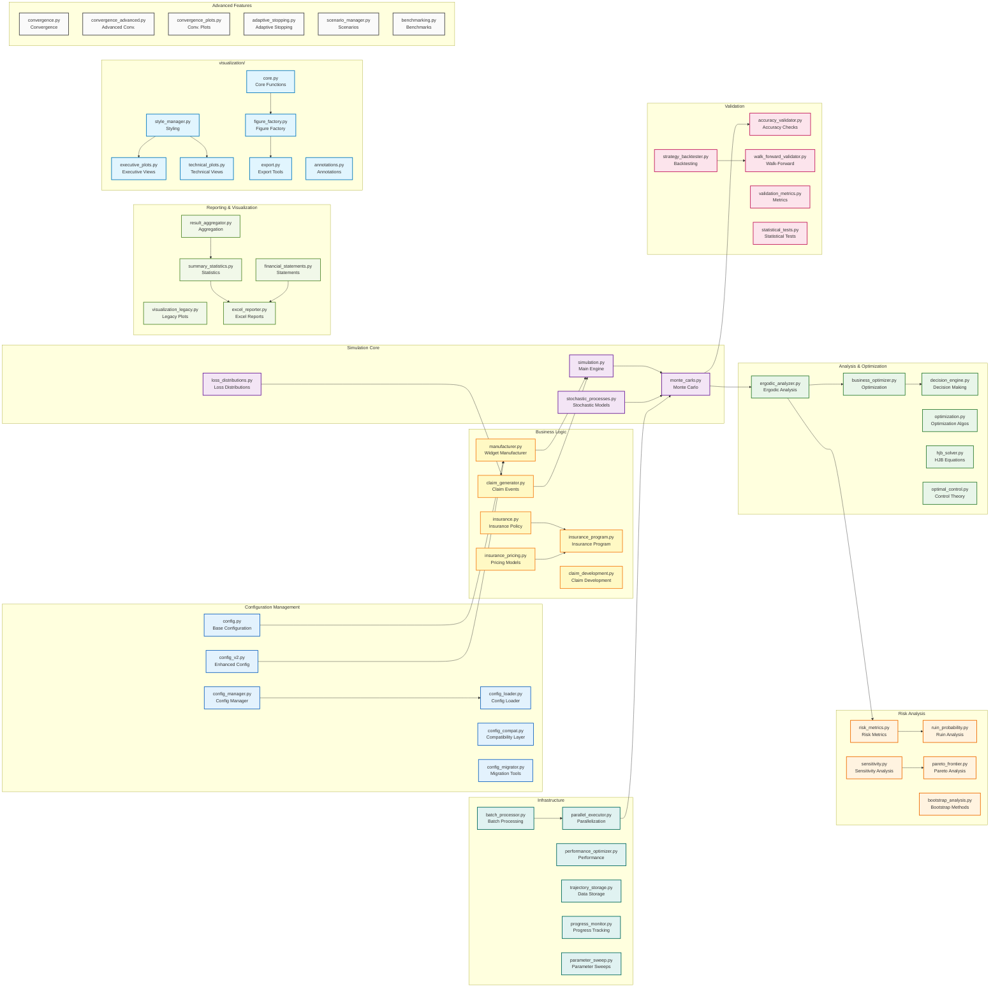

# Module Overview and Dependencies

This diagram shows the detailed module structure and dependencies within the Ergodic Insurance framework.

## Module Categories

### Configuration Management
Handles all configuration aspects including loading, validation, migration, and compatibility between different configuration versions.

### Business Logic
Core business domain models including the manufacturer, insurance policies, pricing, and claim processing.

### Simulation Core
The main simulation engine that orchestrates time evolution, Monte Carlo runs, and stochastic processes.

### Analysis & Optimization
Advanced analytical tools including ergodic analysis, business optimization, and decision-making engines.

### Validation
Comprehensive validation framework for ensuring accuracy and robustness of simulations.

### Risk Analysis
Specialized risk assessment tools including ruin probability, sensitivity analysis, and bootstrap methods.

### Infrastructure
High-performance computing infrastructure for parallel processing, caching, and data management.

### Reporting & Visualization
Output generation including Excel reports, visualizations, and statistical summaries.

### Advanced Features
Sophisticated features for convergence monitoring, adaptive stopping, and benchmarking.
