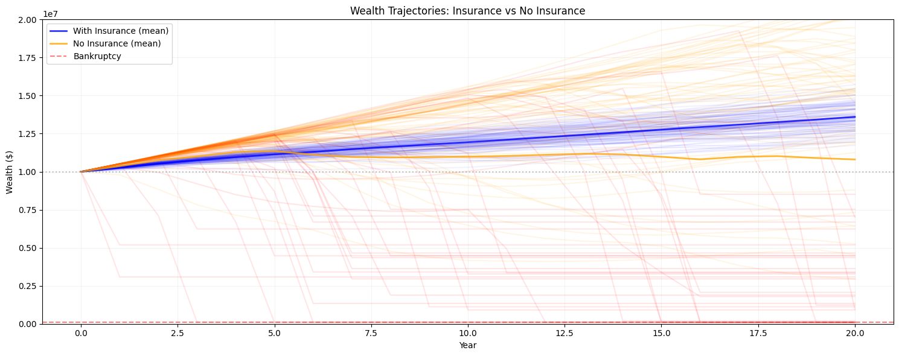

Getting Started
===============

Installation
------------

1. **Clone the Repository**::

    git clone https://github.com/AlexFiliakov/Ergodic-Insurance-Limits.git
    cd Ergodic-Insurance-Limits/ergodic_insurance

2. **Install Dependencies**

   Using uv (recommended)::

    uv sync

   Or using pip::

    pip install -e .

3. **Install Development Dependencies** (optional)::

    uv sync --extra dev --extra notebooks --extra docs

4. **Verify Installation**::

    python -c "import ergodic_insurance; print('Installation successful')"

Quick Example
-------------

Here's a simple example to get you started:

.. code-block:: python

    from ergodic_insurance.manufacturer import WidgetManufacturer
    from ergodic_insurance.loss_distributions import ManufacturingLossGenerator
    from ergodic_insurance.config import ManufacturerConfig

    # Create configuration
    manufacturer_config = ManufacturerConfig(
        initial_assets=10_000_000,
        asset_turnover_ratio=1.0,
        base_operating_margin=0.08,
        tax_rate=0.25,
        retention_ratio=0.8
    )

    # Create manufacturer
    manufacturer = WidgetManufacturer(manufacturer_config)
    revenue = manufacturer.total_assets * manufacturer_config.asset_turnover_ratio

    # Two-tier loss structure to demonstrate insurance value:
    # 1. Regular operational losses (frequent, manageable)
    regular_generator = ManufacturingLossGenerator.create_simple(
        frequency=5.0 * (revenue / 10_000_000),  # ~5 per year, scales with revenue
        severity_mean=80_000,     # Mean $80K
        severity_std=50_000,      # Moderate variation
        seed=42
    )

    # 2. Catastrophic losses (rare but potentially ruinous)
    catastrophic_generator = ManufacturingLossGenerator.create_simple(
        frequency=0.3 * (revenue / 10_000_000),  # ~0.3 per year (once every 3 years)
        severity_mean=2_000_000,  # Mean $2M
        severity_std=1_500_000,   # Can reach $5M+
        seed=43
    )

    # Generate both regular and catastrophic losses
    regular_losses, _ = regular_generator.generate_losses(
        duration=1,
        revenue=revenue
    )
    catastrophic_losses, _ = catastrophic_generator.generate_losses(
        duration=1,
        revenue=revenue
    )

    # Combine all losses
    all_losses = regular_losses + catastrophic_losses

    # Calculate company's net loss after insurance
    total_company_payment = 0
    annual_premium = 100_000  # Annual insurance premium

    for loss in all_losses:
        loss_amount = loss.amount
        if loss_amount <= 100_000:
            # Below deductible, company pays all
            company_payment = loss_amount
        else:
            # Above deductible, insurance covers rest up to limit
            company_payment = 100_000  # Deductible
            if loss_amount > 5_000_000:
                company_payment += loss_amount - 5_000_000  # Excess over limit

        total_company_payment += company_payment

    # Apply losses to manufacturer using the apply_loss method
    if total_company_payment > 0:
        manufacturer.record_insurance_loss(total_company_payment)

    # Check results
    print(f"Final assets: ${manufacturer.total_assets:,.0f}")
    print(f"Final equity: ${manufacturer.equity:,.0f}")
    print(f"Survived: {manufacturer.total_assets > 0}")

Simulation Results
------------------

The graph above shows a 20-year simulation comparing wealth trajectories with and without insurance.
Notice how insurance provides protection during catastrophic loss years (marked with orange lines),
preventing bankruptcy and enabling steady long-term growth.

Configuration
-------------

The system uses YAML configuration files for parameter management:

**Baseline Configuration** (``data/parameters/baseline.yaml``)
    Standard parameters representing a typical widget manufacturer

**Conservative Configuration** (``data/parameters/conservative.yaml``)
    Lower growth, higher margins, more conservative assumptions

**Optimistic Configuration** (``data/parameters/optimistic.yaml``):
    Higher growth, aggressive assumptions for best-case scenarios

You can override any parameter programmatically:

.. code-block:: python

    # Create configuration with custom parameters
    from ergodic_insurance.config import ManufacturerConfig

    config = ManufacturerConfig(
        initial_assets=10_000_000,
        base_operating_margin=0.12,  # Override default margin
        asset_turnover_ratio=1.5,
        tax_rate=0.25,
        retention_ratio=0.7  # Retain 70% of earnings
    )

Running Tests
-------------

Execute the test suite to ensure everything is working correctly::

    # Run all tests
    pytest

    # Run with coverage
    pytest --cov=ergodic_insurance --cov-report=html

    # Run specific test file
    pytest tests/test_manufacturer.py

Code Quality
------------

The project includes comprehensive code quality tools:

**Formatting**::

    black ergodic_insurance/

**Linting**::

    pylint ergodic_insurance/

**Type Checking**::

    mypy ergodic_insurance/

**All Quality Checks**::

    pre-commit run --all-files

Next Steps
----------

* Read the :doc:`theory/index` section to understand the ergodic framework
* Explore the :doc:`examples` for more complex usage patterns
* Check the :doc:`api/modules` for detailed API documentation
* Run the Jupyter notebooks in ``notebooks/`` for interactive exploration
