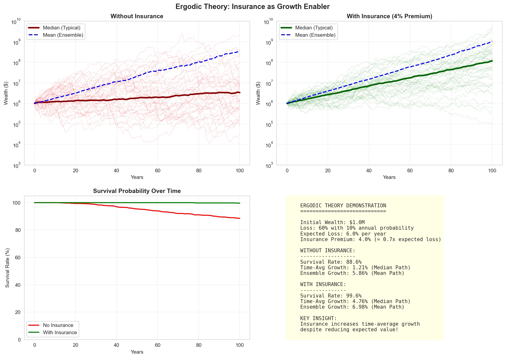

# Ergodic Economics and Insurance

<div style="flex: 1; padding: 15px; border: 2px solid #2196F3; border-radius: 8px; background-color: #E3F2FD;">
    <h3 style="margin-top: 0; color: #1e82d3ff !important;">🎲 Why This Matters</h3>
    <p>Ergodic economics reveals that most economic systems are non-ergodic: the <b>time average</b> experienced by an individual systematically differs from the <b>ensemble average (aka expected value)</b> across many individuals. Since wealth dynamics are multiplicative (losses are normally bounded at -100% while gains are unbounded, and investments compound), using expected values for individual decision-making is fundamentally flawed. This naturally explains why risk-averse behaviors like insurance and diversification are growth-optimal over time, even when they reduce expected returns. The framework shows that pooling risks, which is the foundation of insurance, creates value by converting non-ergodic individual trajectories into more ergodic collective outcomes. One key takeaway is: avoiding ruin is more important than maximizing expected value because recovery from large losses is disproportionately difficult in multiplicative systems.</p>
</div>

## Table of Contents

1. [The Core Insight](#the-core-insight)
2. [Time Averages vs Ensemble Averages](#time-averages-vs-ensemble-averages)
3. [The Ergodicity Problem](#the-ergodicity-problem)
4. [Non-Ergodic Observables](#non-ergodic-observables)
5. [Application to Wealth Dynamics](#application-to-wealth-dynamics)
6. [Insurance Through an Ergodic Lens](#insurance-through-an-ergodic-lens)
7. [Practical Implications](#practical-implications)
8. [Visual Examples](#visual-examples)

(the-core-insight)=
## The Core Insight

Ergodic economics, pioneered by Ole Peters and collaborators, challenges the fundamental assumption that expected values (ensemble averages) are appropriate for individual decision-making. The key insight is that for multiplicative processes, which characterize most economic phenomena including wealth dynamics, the time average experienced by an individual differs systematically from the ensemble average across many individuals.

This distinction is not merely academic; it fundamentally changes optimal strategies for insurance, investment, and risk management.

(time-averages-vs-ensemble-averages)=
## Time Averages vs Ensemble Averages


### Ensemble Average

The **ensemble average** is the expected value across many parallel scenarios at a single point in time:

$$
\langle W \rangle = E[W_t] = \frac{1}{N} \sum_{i=1}^{N} W_i(t)
$$

where $W_i(t)$ represents the wealth of individual $i$ at time $t$.

For a multiplicative process with growth factor $R_t$:

$$
\langle W_t \rangle = W_0 \cdot E[R]^t = W_0 \cdot e^{t\ln{E[R]}}
$$

$$
g_\text{ensemble average} = \ln{E[R]}
$$

### Time Average

The **time average** is the growth rate experienced by a single entity over time:

$$
g_T = \frac{1}{T} \ln\left(\frac{W_T}{W_0}\right) = \frac{1}{T} \sum_{t=1}^{T} \ln(R_t)
$$

As $T \to \infty$, this converges to:

$$
g_\text{time average} = E[\ln(R)]
$$

### The Critical Difference

For any non-degenerate random variable $R > 0$, Jensen's inequality ensures:

$$
E[\ln(R)] < \ln(E[R])
$$

$$
g_\text{time average} < g_\text{ensemble average}
$$

This means the time-average growth rate is **always less than** the growth rate of the ensemble average for processes with uncertainty.

#### Example: Coin Flip Investment

Consider a simple investment that with equal probability either:
- Increases wealth by 50% (multiply by 1.5)
- Decreases wealth by 40% (multiply by 0.6)

**Ensemble average** growth factor:

$$
E[R] = 0.5 \times 1.5 + 0.5 \times 0.6 = 1.05
$$

This suggests a 5% expected gain per round.

**Time average** growth rate:

$$
g_\text{time average} = E[\ln(R)] = 0.5 \times \ln(1.5) + 0.5 \times \ln(0.6) = -0.0527
$$

This reveals a 5.27% **loss** per round for a typical individual trajectory!

(the-ergodicity-problem)=
## The Ergodicity Problem
### Definition of Ergodicity

A system is **ergodic** if its time average equals its ensemble average:

$$
\lim_{T \to \infty} \frac{1}{T} \int_0^T f(X_t) dt = E[f(X)]
$$

This equality holds for many physical systems (e.g., ideal gases) but **fails** for multiplicative economic processes.

### When Ergodicity Breaks Down

1. **Multiplicative dynamics**: Changes are proportional to current state
2. **Absorbing barriers**: Bankruptcy or ruin states that cannot be escaped
3. **Path dependence**: History matters for future evolution
4. **Heterogeneous agents**: Different individuals face different constraints
### Mathematical Conditions

For a stochastic process $X_t$ to be ergodic, it must satisfy:
1. **Stationarity**: Statistical properties don't change over time
2. **Mixing**: Past and future become independent given sufficient time
3. **Finite variance**: Fluctuations are bounded
4. **No absorbing states**: System can explore entire state space
Wealth processes violate multiple conditions, particularly due to the absorbing barrier at zero (bankruptcy).

(non-ergodic-observables)=
## Non-Ergodic Observables
### Wealth and Income

**Wealth** accumulation is fundamentally non-ergodic:

- Multiplicative growth: $W_{t+1} = W_t \cdot (1 + r_t)$
- Bankruptcy is absorbing: $W_t = 0 \Rightarrow W_{t+k} = 0$ for all $k > 0$
- Path-dependent: Current wealth depends on entire history

**Income** processes may be closer to ergodic if:

- Additive rather than multiplicative
- Mean-reverting
- Independent of wealth level

### Growth Rates

While wealth itself is non-ergodic, the **logarithmic growth rate** can be ergodic under certain conditions:

$$
g_\text{time average} = \ln(W_t/W_{t-1})
$$

If $g_\text{time average}$ is stationary and mixing, long-term growth rates converge to a stable distribution.

### Risk Preferences

Traditional utility theory assumes ergodic averaging. In reality:
- Risk aversion emerges naturally from time averaging

- No arbitrary utility function needed
- Optimal strategies maximize time-average growth

(application-to-wealth-dynamics)=
## Application to Wealth Dynamics
### Geometric Brownian Motion

Consider wealth following geometric Brownian motion:

$$
dW = W(\mu dt + \sigma dB_t)
$$

- $\mu$ = drift (expected return)
- $\sigma$ = volatility
- $B_t$ = Brownian motion

**Ensemble average** wealth:

$$
E[W_t] = W_0 \cdot e^{(\mu + \sigma^2/2)t}
$$

**Time average** growth rate:

$$
g_\text{time average} = \mu - \frac{\sigma^2}{2}
$$

The **volatility drag** $\sigma^2/2$ reduces time-average growth but not ensemble-average growth.

### With Catastrophic Losses

Adding jump risk from insurance claims:

$$
dW = W(\mu dt + \sigma dB_t) - dN_t \cdot L_t
$$

- $N_t$ = Poisson process (claim arrivals)
- $L_t$ = Loss severity

The time-average growth becomes:

$$
g_\text{time average} = \mu - \frac{\sigma^2}{2} - \lambda \cdot E\left[\frac{L}{W}\right]
$$

where $\lambda$ is the claim frequency.

### Optimal Growth Strategy

The Kelly criterion emerges naturally from maximizing time-average growth:

$$
f^* = \arg\max_f E[\ln(1 + f \cdot R)]
$$

where $f$ is the fraction of wealth invested.

For insurance, this translates to:

$$
\text{Retention}^* = \arg\max_{R} E[\ln(W_{\text{after losses and premiums}})]
$$

(insurance-through-an-ergodic-lens)=
## Insurance Through an Ergodic Lens
### Traditional View: Expected Value

Classical insurance theory focuses on expected values:

- Insurance is "unfair" if premium > expected loss
- Risk-neutral agents shouldn't buy insurance
- Utility functions needed to explain insurance demand

### Ergodic View: Time Averages

Ergodic theory reveals insurance as growth optimization:

- Insurance reduces volatility drag
- Premiums 2-5× expected losses can be optimal
- No utility function needed, just time averaging

### The Insurance Paradox Resolution

**Paradox**: Why do people pay premiums exceeding expected losses?

**Traditional answer**: Risk aversion via concave utility

**Ergodic answer**: Maximizing time-average growth naturally leads to insurance demand

### Mathematical Justification

Without insurance, facing loss $L$ with probability $p$:

$$
g_{\text{uninsured}} = (1-p) \cdot 0 + p \cdot \ln(1 - L/W) = p \cdot \ln(1- L/W)
$$

With insurance costing premium $P$:

$$
g_{\text{insured}} = \ln(1 - P/W)
$$


$$
\ln(1- P/W) > p \cdot \ln(1 - L/W)
$$

This can hold even when $P > p \cdot L$ (premium exceeds expected loss).

(practical-implications)=
## Practical Implications

### For Insurance Buyers

1. **Long-term perspective**: Evaluate insurance based on time-average growth, not expected value

2. **Higher limits may be optimal**: Ergodic analysis often justifies more coverage than traditional methods
3. **Premium tolerance**: Paying 2-5× expected losses can be rational for growth optimization

### For Insurance Companies

1. **Value-based pricing**: Price based on growth enhancement, not just expected losses

2. **Client education**: Explain time-average benefits to justify premiums
3. **Product design**: Create products that optimize client growth rates

### For Risk Managers


1. **Holistic optimization**: Consider insurance as part of growth strategy
2. **Dynamic strategies**: Adjust coverage as wealth and risks evolve

3. **Metrics**: Track time-average growth, not just expected returns

### For Actuaries

1. **Model selection**: Use multiplicative models for long-term analysis

2. **Parameter estimation**: Focus on growth rates, not just moments
3. **Validation**: Test strategies over long horizons

(visual-examples)=
## Examples

### Ensemble vs Time Average Divergence

```python
import numpy as np
import matplotlib.pyplot as plt

# Simulate 1000 paths for 100 time steps
np.random.seed(42)
n_paths = 1000
n_steps = 100
W0 = 100

# Random returns: 50% chance of +50%, 50% chance of -40%
returns = np.random.choice([1.5, 0.6], size=(n_paths, n_steps))
wealth = np.zeros((n_paths, n_steps + 1))
wealth[:, 0] = W0

for t in range(n_steps):
wealth[:, t + 1] = wealth[:, t]
* returns[:, t]

# Calculate averages
ensemble_avg = np.mean(wealth, axis=0)
time_avg = np.exp(np.mean(np.log(wealth[:, -1] / W0)) / n_steps) ** np.arange(n_steps + 1)
* W0

# Plot
plt.figure(figsize=(12, 8))
plt.subplot(2, 1, 1)
plt.plot(wealth[:20, :].T, alpha=0.3, color='gray')
plt.plot(ensemble_avg, 'b-', linewidth=2, label='Ensemble Average')
plt.plot(time_avg, 'r-', linewidth=2, label='Typical Path (Time Average)')
plt.yscale('log')
plt.ylabel('Wealth')
plt.legend()
plt.title('Ensemble vs Time Average: Wealth Trajectories')

plt.subplot(2, 1, 2)
growth_rates = np.diff(np.log(wealth), axis=1)
plt.hist(np.mean(growth_rates, axis=1), bins=50, alpha=0.7, color='blue', edgecolor='black')
plt.axvline(np.mean(growth_rates), color='red', linestyle='--', linewidth=2, label=f'Mean Growth Rate: {np.mean(growth_rates):.3f}')
plt.xlabel('Time-Average Growth Rate')
plt.ylabel('Frequency')
plt.legend()
plt.title('Distribution of Individual Growth Rates')

plt.tight_layout()
plt.show()
```

#### Sample Output


### Insurance Impact on Growth


*Comparison of wealth trajectories with and without insurance over 50 years, showing improved survival rates and growth consistency with insurance.*

```python
import numpy as np


def simulate_with_insurance(W0, n_years, premium_rate, retention, n_sims=1000):
    """Simulate wealth with and without insurance."""
    np.random.seed(42)

    # Parameters
    base_growth = 0.08
    # 8% base growth
    volatility = 0.15
    # 15% volatility
    claim_freq = 3
    # 3 claims per year
    claim_severity_mean = 50000
    claim_severity_std = 100000

    wealth_with = np.zeros((n_sims, n_years + 1))
    wealth_without = np.zeros((n_sims, n_years + 1))
    wealth_with[:, 0] = W0
    wealth_without[:, 0] = W0

    for sim in range(n_sims):
        for year in range(n_years):
            # Base growth with volatility
            growth_factor = np.exp((base_growth - 0.5
                                    * volatility**2) + volatility * np.random.randn())

            # Claims
            n_claims = np.random.poisson(claim_freq)
            claims = np.random.lognormal(np.log(claim_severity_mean), 1) \
                * n_claims

            # Without insurance
            wealth_without[sim, year +
                           1] = max(0, wealth_without[sim, year] * growth_factor - claims)

            # With insurance
            premium = wealth_with[sim, year] * premium_rate
            covered_loss = max(0, claims - retention)
            wealth_with[sim, year + 1] = max(0, wealth_with[sim, year]
                                             * growth_factor - premium - min(claims, retention))

    return wealth_with, wealth_without


# Run simulation
W0 = 10_000_000
# $10M starting wealth
wealth_with, wealth_without = simulate_with_insurance(W0, 50, 0.02, 500_000)

# Calculate growth rates
growth_with = np.log(wealth_with[:, -1] / W0) / 50
growth_without = np.log(wealth_without[:, -1] / W0) / 50

print(f"Average growth WITH insurance: {np.mean(growth_with[wealth_with[:, -1] > 0]):.3f}")
print(f"Average growth WITHOUT insurance: {np.mean(growth_without[wealth_without[:, -1] > 0]):.3f}")
print(f"Bankruptcy rate WITH insurance: {np.mean(wealth_with[:, -1] == 0):.1%}")
print(f"Bankruptcy rate WITHOUT insurance: {np.mean(wealth_without[:, -1] == 0):.1%}")
```

#### Sample Output:

```
Average growth WITH insurance: 0.040
Average growth WITHOUT insurance: 0.059
Bankruptcy rate WITH insurance: 2.8%
Bankruptcy rate WITHOUT insurance: 2.4%
```

## Key Takeaways

1. **Ergodicity matters**: Time averages and ensemble averages diverge for multiplicative processes
2. **Insurance is growth-enabling**: When viewed through time averages, insurance enhances long-term growth
3. **Premiums can exceed expected losses**: Rational actors may pay 2-5× expected losses for growth optimization
4. **No utility function needed**: Time averaging naturally produces risk-averse behavior
5. **Long horizons favor insurance**: Benefits compound over time
6. **Survival is paramount**: Avoiding ruin is more important than maximizing expected value

## Next Steps

- [Chapter 2: Multiplicative Processes](02_multiplicative_processes.md) - Deep dive into the mathematics
- [Chapter 3: Insurance Mathematics](03_insurance_mathematics.md) - Specific applications to insurance
- [Chapter 6: References](06_references.md) - Academic papers and further reading
