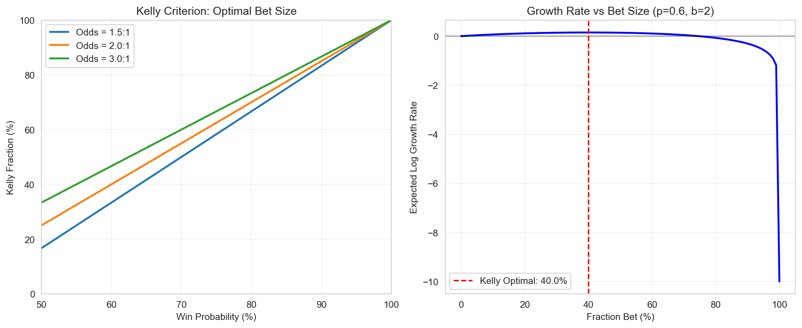
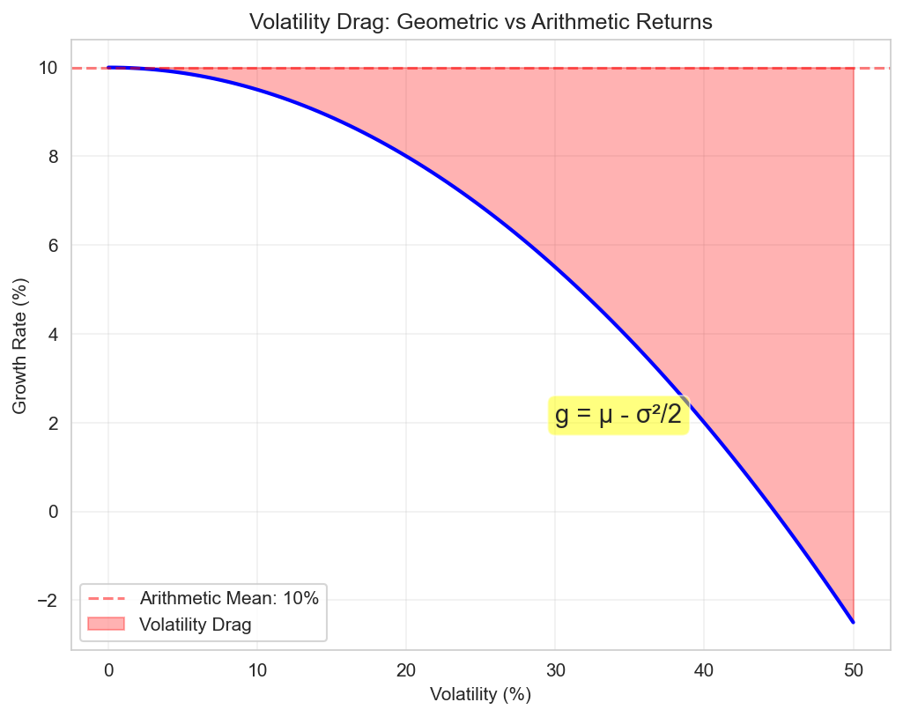

# Multiplicative Processes in Finance and Insurance

## Table of Contents
1. [Introduction to Multiplicative Dynamics](#introduction-to-multiplicative-dynamics)
2. [Geometric Brownian Motion](#geometric-brownian-motion)
3. [Log-Normal Distributions](#log-normal-distributions)
4. [Path Dependence and History](#path-dependence-and-history)
5. [Growth Rate Calculations](#growth-rate-calculations)
6. [The Kelly Criterion](#the-kelly-criterion)
7. [Volatility Drag](#volatility-drag)
8. [Practical Examples](#practical-examples)

## Introduction to Multiplicative Dynamics

### Definition

A **multiplicative process** is one where changes are proportional to the current state:

$$X_{t+1} = X_t \cdot R_t$$

where $R_t$ is a random growth factor. This contrasts with **additive processes**:

$$Y_{t+1} = Y_t + A_t$$

where $A_t$ is a random increment.

### Why Multiplicative Processes Matter

Most economic quantities evolve multiplicatively:
- **Wealth**: Returns compound on existing capital
- **Populations**: Growth rates apply to current size
- **Company revenues**: Growth percentages, not fixed amounts
- **Insurance losses**: Often proportional to exposure

### Key Properties

1. **Non-negative**: Cannot go below zero (natural boundary)
2. **Scale-dependent**: Absolute changes depend on current level
3. **Compound effects**: Small differences accumulate exponentially
4. **Log-additivity**: Logarithms transform to additive process

## Geometric Brownian Motion

### Mathematical Definition

Geometric Brownian Motion (GBM) is the continuous-time limit of multiplicative random walks:

$$dS_t = S_t(\mu dt + \sigma dW_t)$$

where:
- $S_t$ = Stock price or wealth at time $t$
- $\mu$ = Drift parameter (expected return)
- $\sigma$ = Volatility parameter
- $W_t$ = Standard Brownian motion

### Analytical Solution

The solution to the GBM stochastic differential equation is:

$$S_t = S_0 \exp\left[\left(\mu - \frac{\sigma^2}{2}\right)t + \sigma W_t\right]$$

This shows explicitly the volatility drag term $-\sigma^2/2$.

### Properties of GBM

1. **Log-normality**: $\ln(S_t/S_0)$ is normally distributed
2. **Martingale property**: Under risk-neutral measure with $\mu = r$
3. **Self-similarity**: Statistical properties scale with time
4. **Markov property**: Future depends only on present, not past

### Simulation in Discrete Time

Euler-Maruyama discretization for time step $\Delta t$:

```python
import numpy as np

def simulate_gbm(S0, mu, sigma, T, dt, n_paths=1000):
    """Simulate Geometric Brownian Motion paths."""
    n_steps = int(T / dt)
    t = np.linspace(0, T, n_steps + 1)

    # Generate random shocks
    dW = np.random.randn(n_paths, n_steps) * np.sqrt(dt)

    # Initialize paths
    S = np.zeros((n_paths, n_steps + 1))
    S[:, 0] = S0

    # Simulate using exact solution for each step
    for i in range(n_steps):
        S[:, i + 1] = S[:, i] * np.exp((mu - 0.5 * sigma**2) * dt + sigma * dW[:, i])

    return t, S

# Example simulation
t, paths = simulate_gbm(S0=100, mu=0.08, sigma=0.2, T=10, dt=0.01)

# Calculate statistics
final_values = paths[:, -1]
print(f"Mean final value: {np.mean(final_values):.2f}")
print(f"Median final value: {np.median(final_values):.2f}")
print(f"Probability of loss: {np.mean(final_values < 100):.1%}")
```

## Log-Normal Distributions

### Definition and Properties

If $X \sim \text{LogNormal}(\mu, \sigma^2)$, then $\ln(X) \sim \text{Normal}(\mu, \sigma^2)$.

**Probability density function**:

$$f(x) = \frac{1}{x\sigma\sqrt{2\pi}} \exp\left[-\frac{(\ln x - \mu)^2}{2\sigma^2}\right], \quad x > 0$$

### Moments of Log-Normal Distribution

For $X \sim \text{LogNormal}(\mu, \sigma^2)$:

- **Mean**: $E[X] = e^{\mu + \sigma^2/2}$
- **Median**: $\text{Med}[X] = e^{\mu}$
- **Mode**: $\text{Mode}[X] = e^{\mu - \sigma^2}$
- **Variance**: $\text{Var}[X] = e^{2\mu + \sigma^2}(e^{\sigma^2} - 1)$

Note: Mean > Median > Mode (right-skewed distribution)

### Connection to Multiplicative Processes

If returns are multiplicative with log-normal distribution:

$$R_t \sim \text{LogNormal}(\mu_r, \sigma_r^2)$$

Then wealth after $n$ periods:

$$W_n = W_0 \prod_{t=1}^n R_t$$

Taking logarithms:

$$\ln(W_n) = \ln(W_0) + \sum_{t=1}^n \ln(R_t)$$

By Central Limit Theorem, $\ln(W_n)$ approaches normal distribution.

### Insurance Loss Modeling

Log-normal distributions are common for:
- **Claim severities**: Natural for multiplicative effects
- **Asset values**: Result of compound growth
- **Time-to-event**: With log-time normally distributed

```python
from scipy import stats
import matplotlib.pyplot as plt

# Parameters for claim severity
mu_claim = 10  # log-mean (corresponds to ~$22k median)
sigma_claim = 2  # log-standard deviation

# Create distribution
claim_dist = stats.lognorm(s=sigma_claim, scale=np.exp(mu_claim))

# Calculate statistics
mean_claim = claim_dist.mean()
median_claim = claim_dist.median()
percentile_95 = claim_dist.ppf(0.95)
percentile_99 = claim_dist.ppf(0.99)

print(f"Mean claim: ${mean_claim:,.0f}")
print(f"Median claim: ${median_claim:,.0f}")
print(f"95th percentile: ${percentile_95:,.0f}")
print(f"99th percentile: ${percentile_99:,.0f}")

# Visualize
x = np.linspace(0, percentile_99 * 1.2, 1000)
pdf = claim_dist.pdf(x)

plt.figure(figsize=(10, 6))
plt.plot(x, pdf, 'b-', linewidth=2)
plt.axvline(mean_claim, color='r', linestyle='--', label=f'Mean: ${mean_claim:,.0f}')
plt.axvline(median_claim, color='g', linestyle='--', label=f'Median: ${median_claim:,.0f}')
plt.fill_between(x[x > percentile_95], pdf[x > percentile_95], alpha=0.3, color='red', label='Top 5% tail')
plt.xlabel('Claim Size ($)')
plt.ylabel('Probability Density')
plt.title('Log-Normal Claim Severity Distribution')
plt.legend()
plt.grid(True, alpha=0.3)
plt.show()
```

## Path Dependence and History

### Definition of Path Dependence

A process is **path-dependent** if the outcome depends not just on the starting and ending points, but on the entire trajectory taken.

### Examples in Finance

1. **Barrier options**: Payoff depends on whether price crossed a threshold
2. **Asian options**: Payoff based on average price over time
3. **Bankruptcy**: Once wealth hits zero, it stays there
4. **Credit ratings**: History of defaults affects future borrowing

### Mathematical Formulation

For a path-dependent functional:

$$V = F(S_0, S_1, ..., S_T)$$

Cannot be reduced to:

$$V = G(S_0, S_T)$$

### Impact on Insurance

Path dependence affects:
- **Claims development**: Past payments influence reserves
- **Experience rating**: History determines future premiums
- **Reputation effects**: Past performance affects market position
- **Capital requirements**: Regulatory views based on history

### Measuring Path Dependence

```python
def calculate_path_metrics(paths):
    """Calculate various path-dependent metrics."""

    metrics = {
        'final_value': paths[:, -1],
        'maximum': np.max(paths, axis=1),
        'minimum': np.min(paths, axis=1),
        'average': np.mean(paths, axis=1),
        'max_drawdown': np.zeros(len(paths)),
        'time_underwater': np.zeros(len(paths)),
        'volatility_realized': np.zeros(len(paths))
    }

    for i, path in enumerate(paths):
        # Maximum drawdown
        cummax = np.maximum.accumulate(path)
        drawdown = (cummax - path) / cummax
        metrics['max_drawdown'][i] = np.max(drawdown)

        # Time underwater
        metrics['time_underwater'][i] = np.mean(path < path[0])

        # Realized volatility
        returns = np.diff(np.log(path))
        metrics['volatility_realized'][i] = np.std(returns) * np.sqrt(252)

    return metrics

# Analyze path dependence
metrics = calculate_path_metrics(paths)

# Compare final values with path metrics
correlation_matrix = np.corrcoef([
    metrics['final_value'],
    metrics['maximum'],
    metrics['max_drawdown'],
    metrics['volatility_realized']
])

print("Correlation with final value:")
print(f"Maximum reached: {correlation_matrix[0, 1]:.3f}")
print(f"Max drawdown: {correlation_matrix[0, 2]:.3f}")
print(f"Realized volatility: {correlation_matrix[0, 3]:.3f}")
```

## Growth Rate Calculations

### Arithmetic vs Geometric Returns

**Arithmetic mean return**:
$$r_a = \frac{1}{T} \sum_{t=1}^T r_t$$

**Geometric mean return**:
$$r_g = \left(\prod_{t=1}^T (1 + r_t)\right)^{1/T} - 1$$

### Relationship Between Means

For small returns, approximately:
$$r_g \approx r_a - \frac{\sigma^2}{2}$$

Exact relationship:
$$r_g = r_a - \frac{\sigma^2}{2(1 + r_a)}$$

### Time-Average Growth Rate

For continuous compounding:
$$g = \lim_{T \to \infty} \frac{1}{T} \ln\left(\frac{W_T}{W_0}\right)$$

This equals:
$$g = E[\ln(1 + r)]$$

where $r$ is the period return.

### Volatility Drag

The difference between arithmetic and geometric means:
$$\text{Drag} = r_a - r_g \approx \frac{\sigma^2}{2}$$

This represents the cost of volatility on compound growth.

### Example Calculation

```python
def analyze_growth_rates(returns):
    """Compare different growth rate measures."""

    # Arithmetic mean
    r_arithmetic = np.mean(returns)

    # Geometric mean
    wealth_factor = np.prod(1 + returns)
    r_geometric = wealth_factor**(1/len(returns)) - 1

    # Log growth rate
    log_returns = np.log(1 + returns)
    g_log = np.mean(log_returns)

    # Volatility
    volatility = np.std(returns)

    # Theoretical drag
    theoretical_drag = volatility**2 / 2
    actual_drag = r_arithmetic - r_geometric

    results = {
        'Arithmetic Mean': r_arithmetic,
        'Geometric Mean': r_geometric,
        'Log Growth Rate': g_log,
        'Volatility': volatility,
        'Theoretical Drag': theoretical_drag,
        'Actual Drag': actual_drag,
        'Final Wealth Multiple': wealth_factor
    }

    return results

# Example with volatile returns
np.random.seed(42)
returns = np.random.randn(100) * 0.3 + 0.1  # 10% mean, 30% volatility

results = analyze_growth_rates(returns)
for key, value in results.items():
    if 'Wealth' in key:
        print(f"{key}: {value:.2f}x")
    else:
        print(f"{key}: {value:.2%}")
```

## The Kelly Criterion


*Figure 2: Kelly criterion visualization showing optimal bet sizing (left) and growth rate vs fraction bet (right) for different odds and probabilities.*

### Original Formulation

For a binary bet with probability $p$ of winning $b$ times the wager:

$$f^* = \frac{p \cdot b - q}{b} = \frac{p \cdot b - (1-p)}{b}$$

where $f^*$ is the optimal fraction of wealth to bet.

### Continuous Distribution

For continuous returns $R$ with distribution $F$:

$$f^* = \arg\max_f E[\ln(1 + f \cdot R)]$$

### Insurance Application

Optimal retention level:

$$R^* = \arg\max_R E[\ln(W_{\text{end}})]$$

where:
$$W_{\text{end}} = W_{\text{start}} \cdot (1 + r) - \text{Premium}(R) - \min(\text{Loss}, R)$$

### Properties of Kelly Betting

1. **Maximizes geometric growth**: Optimal for long-term wealth
2. **Never risks ruin**: Always maintains positive wealth
3. **Volatility-adjusted**: Naturally accounts for risk
4. **Time-consistent**: Optimal regardless of horizon

### Fractional Kelly

Due to estimation error and preferences, often use fractional Kelly:

$$f_{\text{used}} = \alpha \cdot f^*$$

where $\alpha \in (0, 1]$, typically $\alpha \approx 0.25$ to $0.5$.

### Implementation

```python
def kelly_optimal_insurance(wealth, growth_rate, volatility,
                           claim_frequency, claim_severity_dist,
                           premium_loading=1.3):
    """Find Kelly-optimal insurance retention."""

    def expected_log_wealth(retention):
        # Annual premium
        expected_loss = claim_frequency * claim_severity_dist.mean()
        premium = min(expected_loss, retention) * premium_loading

        # Simulate one year
        n_sims = 10000
        final_wealth = np.zeros(n_sims)

        for i in range(n_sims):
            # Base growth
            w = wealth * np.exp(growth_rate - 0.5*volatility**2 +
                               volatility*np.random.randn())

            # Claims
            n_claims = np.random.poisson(claim_frequency)
            if n_claims > 0:
                claims = claim_severity_dist.rvs(n_claims)
                total_claim = np.sum(claims)
                retained_loss = min(total_claim, retention)
            else:
                retained_loss = 0

            # Final wealth
            final_wealth[i] = max(0, w - premium - retained_loss)

        # Expected log wealth (excluding zeros)
        positive_wealth = final_wealth[final_wealth > 0]
        if len(positive_wealth) == 0:
            return -np.inf

        return np.mean(np.log(positive_wealth / wealth))

    # Optimize
    from scipy.optimize import minimize_scalar

    result = minimize_scalar(
        lambda r: -expected_log_wealth(r),
        bounds=(0, wealth * 0.5),
        method='bounded'
    )

    return result.x

# Example usage
claim_dist = stats.lognorm(s=2, scale=50000)
optimal_retention = kelly_optimal_insurance(
    wealth=10_000_000,
    growth_rate=0.08,
    volatility=0.15,
    claim_frequency=3,
    claim_severity_dist=claim_dist
)

print(f"Kelly-optimal retention: ${optimal_retention:,.0f}")
```

## Volatility Drag


*Figure 3: The impact of volatility on growth rates, showing how geometric mean decreases with volatility even when arithmetic mean is constant.*

### Mathematical Definition

For a process with arithmetic mean return $\mu$ and volatility $\sigma$:

$$\text{Volatility Drag} = \frac{\sigma^2}{2}$$

This reduces the geometric growth rate:

$$g = \mu - \frac{\sigma^2}{2}$$

### Intuitive Explanation

Consider two scenarios:
1. Steady 10% annual return → 1.1^10 = 2.594x after 10 years
2. Alternating +30% and -10% (average 10%) → (1.3 × 0.9)^5 = 2.373x

The volatile path underperforms despite same average.

### Impact on Insurance Decisions

Insurance reduces volatility drag by:
1. Capping downside losses
2. Smoothing cash flows
3. Enabling higher risk-taking in core business

### Quantifying the Benefit

```python
def calculate_volatility_drag_benefit(base_volatility,
                                     volatility_with_insurance,
                                     time_horizon=10):
    """Calculate wealth improvement from volatility reduction."""

    # Assume same arithmetic mean
    mu = 0.10

    # Growth rates
    g_without = mu - base_volatility**2 / 2
    g_with = mu - volatility_with_insurance**2 / 2

    # Wealth multiples
    wealth_without = np.exp(g_without * time_horizon)
    wealth_with = np.exp(g_with * time_horizon)

    # Benefit
    benefit = (wealth_with / wealth_without - 1) * 100

    print(f"Base volatility: {base_volatility:.1%}")
    print(f"With insurance: {volatility_with_insurance:.1%}")
    print(f"Growth without insurance: {g_without:.2%}")
    print(f"Growth with insurance: {g_with:.2%}")
    print(f"Wealth improvement: {benefit:.1f}%")

    return benefit

# Example
benefit = calculate_volatility_drag_benefit(
    base_volatility=0.30,
    volatility_with_insurance=0.15,
    time_horizon=20
)
```

## Practical Examples

### Example 1: Widget Manufacturer

A widget manufacturer faces:
- Revenue growth: 8% expected, 15% volatility
- Operating leverage: 2x (costs are 50% fixed)
- Catastrophic risk: 5% chance of $5M loss annually

Without insurance:
```python
def simulate_manufacturer(years=10, with_insurance=False):
    """Simulate manufacturer wealth evolution."""

    W0 = 10_000_000  # $10M initial capital
    wealth = [W0]

    for year in range(years):
        # Revenue growth
        revenue_shock = np.exp(0.08 - 0.5*0.15**2 + 0.15*np.random.randn())

        # Operating leverage effect
        profit_shock = 1 + 2 * (revenue_shock - 1)

        # Catastrophic loss
        if np.random.rand() < 0.05:
            loss = 5_000_000
        else:
            loss = 0

        if with_insurance:
            premium = 0.02 * wealth[-1]  # 2% of assets
            retention = 500_000
            covered_loss = max(0, loss - retention)
            net_loss = premium + min(loss, retention)
        else:
            net_loss = loss

        # Update wealth
        new_wealth = max(0, wealth[-1] * profit_shock - net_loss)
        wealth.append(new_wealth)

    return wealth

# Run simulations
np.random.seed(42)
n_sims = 1000
results_with = []
results_without = []

for _ in range(n_sims):
    results_with.append(simulate_manufacturer(20, True))
    results_without.append(simulate_manufacturer(20, False))

# Analyze
final_with = [r[-1] for r in results_with]
final_without = [r[-1] for r in results_without]

print("With Insurance:")
print(f"  Median final wealth: ${np.median(final_with):,.0f}")
print(f"  Bankruptcy rate: {np.mean(np.array(final_with) == 0):.1%}")
print(f"  Growth rate: {np.mean(np.log(np.array(final_with)[np.array(final_with) > 0] / 10_000_000) / 20):.2%}")

print("\nWithout Insurance:")
print(f"  Median final wealth: ${np.median(final_without):,.0f}")
print(f"  Bankruptcy rate: {np.mean(np.array(final_without) == 0):.1%}")
print(f"  Growth rate: {np.mean(np.log(np.array(final_without)[np.array(final_without) > 0] / 10_000_000) / 20):.2%}")
```

### Example 2: Investment Portfolio

Portfolio with tail risk:
```python
def portfolio_with_tail_risk(leverage=1.0, tail_hedge=False):
    """Simulate leveraged portfolio with tail risk."""

    # Parameters
    years = 30
    base_return = 0.07
    base_vol = 0.15
    tail_prob = 0.02  # 2% annual chance
    tail_loss = 0.40  # 40% loss in tail event

    wealth_paths = []

    for _ in range(1000):
        wealth = 100
        for year in range(years):
            # Normal return with leverage
            normal_return = base_return * leverage
            normal_vol = base_vol * leverage

            year_return = np.random.randn() * normal_vol + normal_return

            # Tail event
            if np.random.rand() < tail_prob:
                year_return = -tail_loss * leverage

            if tail_hedge:
                # Pay 1% for tail protection
                hedge_cost = 0.01
                if year_return < -0.20:
                    year_return = -0.20  # Cap losses at 20%
                year_return -= hedge_cost

            wealth *= (1 + year_return)
            wealth = max(0, wealth)

        wealth_paths.append(wealth)

    return np.array(wealth_paths)

# Compare strategies
unhedged = portfolio_with_tail_risk(leverage=1.5, tail_hedge=False)
hedged = portfolio_with_tail_risk(leverage=1.5, tail_hedge=True)

print("Leveraged Portfolio (1.5x):")
print(f"Without hedge - Median: ${np.median(unhedged):.0f}, Ruin: {np.mean(unhedged == 0):.1%}")
print(f"With hedge - Median: ${np.median(hedged):.0f}, Ruin: {np.mean(hedged == 0):.1%}")
```

## Key Takeaways

1. **Multiplicative processes dominate economics**: Most financial quantities compound
2. **GBM captures essential features**: But real processes have jumps and fat tails
3. **Log-normal distributions arise naturally**: From multiplicative effects
4. **Path dependence matters**: History constrains future possibilities
5. **Geometric mean < Arithmetic mean**: Volatility drag is real and substantial
6. **Kelly criterion optimizes growth**: Natural framework for insurance decisions
7. **Volatility reduction enhances growth**: Insurance benefit beyond loss coverage

## Next Steps

- [Chapter 1: Ergodic Economics](01_ergodic_economics.md) - Foundational concepts
- [Chapter 3: Insurance Mathematics](03_insurance_mathematics.md) - Specific insurance applications
- [Chapter 4: Optimization Theory](04_optimization_theory.md) - Mathematical optimization methods
