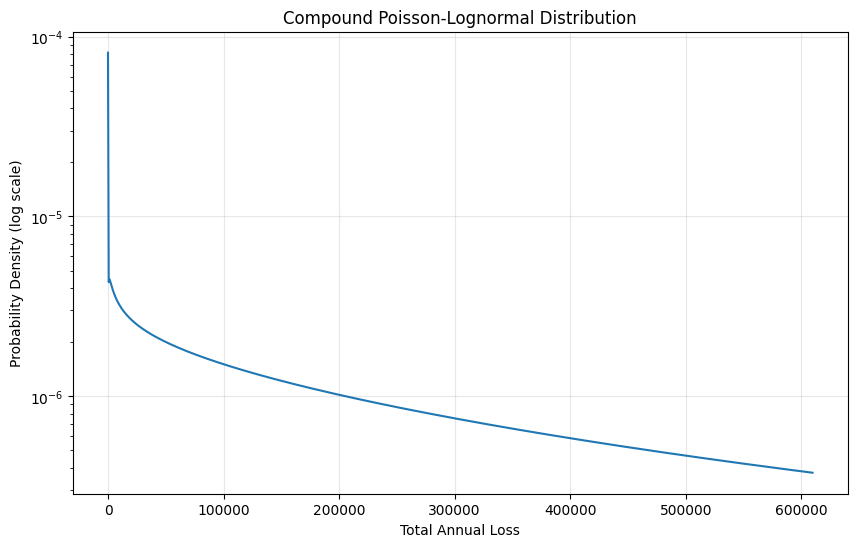
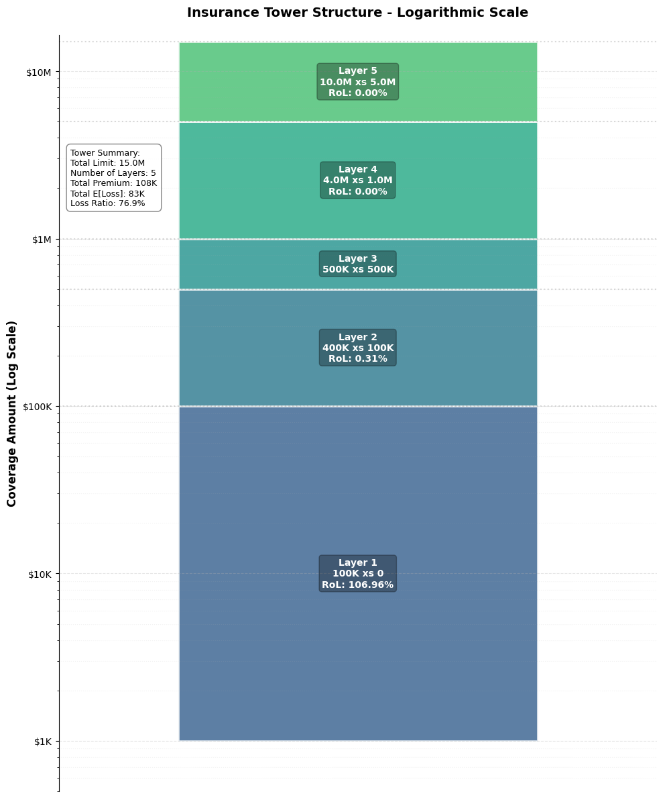
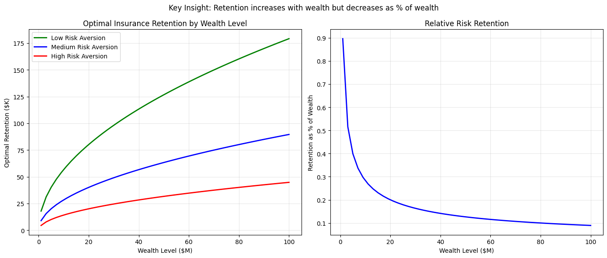

# Insurance Mathematics

<div style="flex: 1; padding: 15px; border: 2px solid #2196F3; border-radius: 8px; background-color: #E3F2FD;">
    <h3 style="margin-top: 0; color: #1e82d3ff !important;">💰 Why This Matters</h3>
    <p>Insurance mathematics reveal that frequency-severity modeling captures the dual nature of risk (how often losses occur and how severe they are), with heavy-tailed distributions like Pareto essential for modeling catastrophic events where traditional Gaussian assumptions fail to capture the true magnitude of the downside. The layer pricing framework shows why excess-of-loss structures dominate: they efficiently separate attritional losses (predictable, retained) from severity losses (volatile, transferred), optimizing the premium-to-protection tradeoff. Retention optimization through the ergodic lens demonstrates that optimal retention increases with wealth in absolute terms but decreases as a percentage of wealth; i.e., wealthier entities should retain more risk but proportionally less. The compound distribution mathematics proves that aggregate losses have fundamentally different properties than individual claims, explaining why reinsurers price differently than primary insurers. Claims development triangles and chain ladder methods quantify the time value of uncertainty, showing why early reserving decisions compound into material impacts. This framework transforms insurance from a cost center to a growth enabler by quantifying exactly how volatility reduction through strategic risk transfer enhances long-term compound returns, the mathematical foundation for why insurance creates value beyond simple loss indemnification.</p>
</div>

(frequency-severity-models)=
## Frequency-Severity Models

### Classical Framework

Insurance losses are modeled as a two-stage process:

1. **Frequency**: Number of claims in a period

2. **Severity**: Size of each claim

Total loss:

$$
S = \sum_{i=1}^{N} X_i
$$

- $N$ = Number of claims (random) - $X_i$ = Size of $i$-th claim (random)

### Frequency Distributions

#### Poisson Distribution

Most common for claim counts:

$$
P(N = n) = \frac{\lambda^n e^{-\lambda}}{n!}
$$

Properties:
- Mean = Variance = $\lambda$

- Memoryless inter-arrival times - Suitable for homogeneous risks

#### Negative Binomial

For overdispersed counts (variance > mean):

$$
P(N = n) = \binom{n + r - 1}{n} p^r (1-p)^n
$$

Properties:
- Mean = $r(1-p)/p$
- Variance = $r(1-p)/p^2$ > Mean - Captures heterogeneity via mixing

#### Zero-Inflated Models

When many policies have no claims:

$$
P(N = 0) = \pi + (1-\pi)P_0(N = 0)
$$


$$
P(N = n) = (1-\pi)P_0(N = n), \quad n \geq 1
$$

### Severity Distributions

#### Log-Normal

For moderate to large claims:

$$
f(x) = \frac{1}{x\sigma\sqrt{2\pi}} \exp\left[-\frac{(\ln x - \mu)^2}{2\sigma^2}\right]
$$

Properties:

- Right-skewed
- Multiplicative effects
- No upper bound

#### Pareto

For extreme losses (heavy-tailed):

$$
f(x) = \frac{\alpha x_m^\alpha}{x^{\alpha+1}}, \quad x \geq x_m
$$

Properties:

- Power-law tail - Infinite variance if $\alpha \leq 2$
- Scale-invariant

#### Generalized Pareto (GPD)

For excess losses above threshold:

$$
F(x) = 1 - \left(1 + \xi \frac{x}{\sigma}\right)^{-1/\xi}
$$

- $\xi$ = Shape parameter (tail index)
- $\sigma$ = Scale parameter

### Implementation Example

```python
import numpy as np
from scipy import stats
import matplotlib.pyplot as plt

class FrequencySeverityModel:
"""Model insurance losses using frequency-severity approach."""

def __init__(self, freq_dist, sev_dist):
self.freq_dist = freq_dist
self.sev_dist = sev_dist

def simulate_annual_loss(self, n_sims=10000):
"""Simulate total annual losses."""
total_losses = []

for _ in range(n_sims):
            # Number of claims
n_claims = self.freq_dist.rvs()

if n_claims == 0:
total_losses.append(0)
else:
                # Individual claim amounts
claims = self.sev_dist.rvs(size=n_claims)
total_losses.append(np.sum(claims))

return np.array(total_losses)

def calculate_statistics(self, losses):
"""Calculate key statistics."""
return {
'mean': np.mean(losses),
'std': np.std(losses),
'median': np.median(losses),
'p95': np.percentile(losses, 95),
'p99': np.percentile(losses, 99),
'p99.5': np.percentile(losses, 99.5),
'max': np.max(losses),
'prob_zero': np.mean(losses == 0)
}

def plot_distribution(self, losses):
"""Visualize loss distribution."""
fig, axes = plt.subplots(2, 2, figsize=(12, 10))

        # Histogram
axes[0, 0].hist(losses[losses > 0], bins=50, edgecolor='black', alpha=0.7)
axes[0, 0].set_xlabel('Loss Amount')
axes[0, 0].set_ylabel('Frequency')
axes[0, 0].set_title('Loss Distribution (excluding zeros)')

        # Log-log plot for tail
sorted_losses = np.sort(losses[losses > 0])
exceedance_prob = np.arange(len(sorted_losses), 0, -1) / len(losses)
axes[0, 1].loglog(sorted_losses, exceedance_prob)
axes[0, 1].set_xlabel('Loss Amount (log scale)')
axes[0, 1].set_ylabel('Exceedance Probability (log scale)')
axes[0, 1].set_title('Tail Behavior')

        # Q-Q plot
stats.probplot(losses[losses > 0], dist="lognorm", plot=axes[1, 0])
axes[1, 0].set_title('Log-Normal Q-Q Plot')

        # Empirical CDF
axes[1, 1].plot(sorted_losses, np.arange(1, len(sorted_losses) + 1) / len(sorted_losses))
axes[1, 1].set_xlabel('Loss Amount')
axes[1, 1].set_ylabel('Cumulative Probability')
axes[1, 1].set_title('Empirical CDF')
axes[1, 1].grid(True, alpha=0.3)

plt.tight_layout()
return fig

# Example: Commercial property insurance
freq_dist = stats.poisson(mu=3)
# 3 claims per year on average
sev_dist = stats.lognorm(s=2, scale=50000)
# Log-normal severity

model = FrequencySeverityModel(freq_dist, sev_dist)
losses = model.simulate_annual_loss(n_sims=10000)
statistics = model.calculate_statistics(losses)

print("Annual Loss Statistics:")
for key, value in statistics.items():
if key == 'prob_zero':
print(f"{key}: {value:.1%}")
else:
print(f"{key}: ${value:,.0f}")
```

(compound-distributions)=
## Compound Distributions

### Definition

The compound distribution of total losses$S = \sum_{i=1}^N X_i$has:

**Characteristic function**:  $$ \phi_S(t) = G_N(\phi_X(t)) $$  where$G_N$is the probability generating function of$N$.

### Compound Poisson

When$N \sim \text{Poisson}(\lambda)$:

**Mean**: $E[S] = \lambda \cdot E[X]$
**Variance**: $\text{Var}(S) = \lambda \cdot E[X^2]$
**Skewness**: $\text{Skew}(S) = \frac{E[X^3]}{\lambda^{1/2} \cdot E[X^2]^{3/2}}$

### Panjer Recursion

For discrete severities, recursive calculation:

$$p_k = \frac{1}{1 - af_0} \sum_{j=1}^k \left(a + \frac{bj}{k}\right) f_j p_{k-j}$$

where:
- $p_k = P(S = k)$
- $f_j = P(X = j)$
- $(a, b)$ depend on frequency distribution

### Fast Fourier Transform Method

For continuous distributions:

```python
def compound_distribution_fft(freq_params, sev_params, x_max=1e7, n_points=2**14):
    """Calculate compound distribution using FFT."""

    # Discretize severity distribution
    dx = x_max / n_points
    x = np.arange(n_points) * dx

    # Severity probabilities
    sev_pmf = stats.lognorm.pdf(x, s=sev_params["s"], scale=sev_params["scale"]) * dx
    sev_pmf[0] = 0  # No zero claims

    # Characteristic function of severity
    sev_cf = np.fft.fft(sev_pmf)

    # Compound distribution via generating function
    lambda_param = freq_params["lambda"]
    compound_cf = np.exp(lambda_param * (sev_cf - 1))

    # Inverse transform
    compound_pmf = np.real(np.fft.ifft(compound_cf))

    # Add point mass at zero
    prob_zero = np.exp(-lambda_param)
    compound_pmf[0] = prob_zero

    return x, compound_pmf / dx

# Calculate and plot
x, pdf = compound_distribution_fft(
    freq_params={"lambda": 3},
    sev_params={"s": 2, "scale": 50000}
)

plt.figure(figsize=(10, 6))
plt.semilogy(x[:1000], pdf[:1000])
plt.xlabel("Total Annual Loss")
plt.ylabel("Probability Density (log scale)")
plt.title("Compound Poisson-Lognormal Distribution")
plt.grid(True, alpha=0.3)
plt.show()
```



(layer-pricing-theory)=
## Layer Pricing Theory

### Excess of Loss Layers  Insurance coverage is structured in layers: -

**Primary**: \$0 to \$L_1
- **First Excess**: \$L_1 to \$L_2
- **Second Excess**: \$L_2 to \$L_3, etc.

### Layer Loss Calculation

For layer$[a, b]$, the loss is:

$$ Y_{[a,b]} = \min(X, b) - \min(X, a) = (X \wedge b) - (X \wedge a) $$

Expected layer loss:

$$ E[Y_{[a,b]}] = \int_a^b [1 - F_X(x)] dx $$

### Increased Limits Factors (ILFs)

Ratio of expected loss at different limits:

$$ \text{ILF}(L) = \frac{E[X \wedge L]}{E[X \wedge L_0]} $$

where$L_0$is the base limit.

### Exposure Curves

Proportion of loss in layer:

$$ \text{G}(r) = \frac{E[X \wedge rM]}{E[X]} $$

where$M$is the maximum possible loss.

### Layer Pricing Implementation

```python
class LayerPricing:
    """Price excess of loss layers."""

    def __init__(self, severity_dist):
        self.severity_dist = severity_dist
    # [Code continues - see full implementation in notebook]
```



(retention-optimization)=
## Retention Optimization

### Objective Function

Maximize utility or growth:

$$ \max_R \quad U(W - P(R) - L \wedge R) $$

- $R$ = Retention level
- $P(R)$ = Premium function
- $L$ = Random loss
- $W$ = Initial wealth

### First-Order Condition
For differentiable utility:
$$ P'(R) = E[U'(W - P(R) - L \wedge R) \cdot \mathbf{1}_{L > R}] $$

### Ergodic Optimization

Maximize time-average growth:

$$ \max_R \quad E[\ln(W - P(R) - L \wedge R)] $$

### Constraints

1. **Budget constraint**:$P(R) \leq B$
2. **Ruin constraint**:$P(\text{ruin}) \leq \alpha$
3. **Regulatory minimum**: $R \geq R_{\text{min}}$

### Dynamic Programming Solution

```python
def calculate_optimal_retention(wealth, loss_mean=100_000, loss_std=50_000,
                                premium_loading=0.3, risk_aversion=2):
    """
    Calculate optimal retention using analytical approach.

    The optimal retention balances:
    1. Premium savings (higher retention = lower premium)
    2. Risk exposure (higher retention = more volatility)
    3. Wealth level (more wealth = can handle more risk)
    """

    # Base retention is fraction of expected loss
    base_retention = loss_mean * 0.5

    # Wealth effect: retention increases with wealth (concave)
    wealth_factor = np.sqrt(wealth / 10_000_000)  # Normalized to $10M

    # Risk aversion effect: higher aversion = lower retention
risk_factor = 1 / risk_aversion

    # Combine factors
optimal_retention = base_retention
* wealth_factor * risk_factor

    # Cap at reasonable level (10% of wealth or 3x expected loss)
max_retention = min(wealth
* 0.1, loss_mean * 3)

return min(optimal_retention, max_retention)

def optimize_retention_over_time(wealth_states, loss_dist, growth_rate=0.06,
risk_aversion=2, n_periods=10):
"""
Calculate optimal retention for different wealth levels and periods.

- Wealth level (x-axis)
- Risk tolerance
- Time horizon (implicitly through wealth growth)
"""

loss_mean = loss_dist.mean()
loss_std = loss_dist.std()

    # Calculate optimal retention for each wealth state
optimal_retentions = []
for wealth in wealth_states:
retention = calculate_optimal_retention(
wealth, loss_mean, loss_std,
risk_aversion=risk_aversion
)
optimal_retentions.append(retention)

return np.array(optimal_retentions)

# Example usage with clear visualization
wealth_levels = np.linspace(1e6, 100e6, 50)
loss_dist = stats.lognorm(s=0.5, scale=100_000)

# Calculate for different risk aversion levels
retentions_low_ra = optimize_retention_over_time(
wealth_levels, loss_dist, risk_aversion=1
)
retentions_med_ra = optimize_retention_over_time(
wealth_levels, loss_dist, risk_aversion=2
)
retentions_high_ra = optimize_retention_over_time(
wealth_levels, loss_dist, risk_aversion=4
)

# Create clear visualization
fig, (ax1, ax2) = plt.subplots(1, 2, figsize=(14, 6))

# Left: Absolute retention
ax1.plot(wealth_levels/1e6, retentions_low_ra/1e3,
label='Low Risk Aversion', linewidth=2, color='green')
ax1.plot(wealth_levels/1e6, retentions_med_ra/1e3,
label='Medium Risk Aversion', linewidth=2, color='blue')
ax1.plot(wealth_levels/1e6, retentions_high_ra/1e3,
label='High Risk Aversion', linewidth=2, color='red')

ax1.set_xlabel('Wealth Level ($M)') ax1.set_ylabel('Optimal Retention ($K)')
ax1.set_title('Optimal Insurance Retention by Wealth Level')
ax1.grid(True, alpha=0.3)
ax1.legend()

# Right: Retention as % of wealth
retention_pct = (retentions_med_ra / wealth_levels)
* 100
ax2.plot(wealth_levels/1e6, retention_pct, linewidth=2, color='blue')
ax2.set_xlabel('Wealth Level ($M)')
ax2.set_ylabel('Retention as % of Wealth')
ax2.set_title('Relative Risk Retention')
ax2.grid(True, alpha=0.3)

plt.suptitle('Key Insight: Retention increases with wealth but decreases as % of wealth')
plt.tight_layout()
plt.show()
```



(premium-calculation-principles)=
## Premium Calculation Principles

### Pure Premium

Expected loss only:

$$ P_0 = E[L] $$

### Expected Value Principle

Add proportional loading:

$$ P = (1 + \theta) E[L] $$

where $\theta$ is the safety loading.

### Variance Principle

Account for risk:

$$ P = E[L] + \alpha \cdot \text{Var}(L) $$

### Standard Deviation Principle

$$ P = E[L] + \beta \cdot \text{SD}(L) $$

### Exponential Principle

Based on exponential utility:

$$ P = \frac{1}{\alpha} \ln(E[e^{\alpha L}]) $$

### Wang Transform

Distort probability measure:

$$ P = \int_0^\infty g(S_L(x)) dx $$

where $g$ is the distortion function.

### Implementation Comparison

```python
class PremiumPrinciples:
    """Compare different premium calculation methods."""

    def __init__(self, loss_dist):
        self.loss_dist = loss_dist
        self.mean = loss_dist.mean()
        self.std = loss_dist.std()
        self.var = loss_dist.var()

    def pure_premium(self):
        return self.mean

    def expected_value(self, loading=0.3):
        return self.mean * (1 + loading)

    def variance_principle(self, alpha=0.001):
        return self.mean + alpha * self.var

    def standard_deviation(self, beta=0.5):
        return self.mean + beta * self.std

    def exponential_principle(self, alpha=0.0001):
        """Calculate using moment generating function."""
        from scipy.integrate import quad

        def integrand(x):
            return np.exp(alpha * x) * self.loss_dist.pdf(x)

        mgf, _ = quad(integrand, 0, np.inf)
        return np.log(mgf) / alpha

    def wang_transform(self, lambda_param=0.5):
        """Wang transform with power distortion."""
        from scipy.integrate import quad

        def survival(x):
            return 1 - self.loss_dist.cdf(x)

        def distorted_survival(x):
            return survival(x) ** (1 / (1 + lambda_param))

        premium, _ = quad(distorted_survival, 0, np.inf)
        return premium

    def compare_all(self):
        """Compare all premium principles."""

        results = {
            'Pure Premium': self.pure_premium(),
            'Expected Value (30%)': self.expected_value(0.3),
            'Variance Principle': self.variance_principle(),
            'Standard Deviation': self.standard_deviation(),
            'Exponential': self.exponential_principle(),
            'Wang Transform': self.wang_transform()
        }

        # Calculate loadings
        for name, premium in results.items():
            loading = (premium / self.mean - 1) * 100
            print(f"{name:25} ${premium:12,.0f} (Loading: {loading:6.1f}%)")

        return results

    # Example with heavy-tailed distribution
    loss_dist = stats.pareto(b=2, scale=50000)
    principles = PremiumPrinciples(loss_dist)
    premiums = principles.compare_all()
```

(claims-development)=
## Claims Development

### Development Triangles

Claims develop over time:
| Year | Dev 0 | Dev 1 | Dev 2 | Dev 3 | Ultimate |
|------|-------|-------|-------|-------|----------|
| 2020 | 100   | 150   | 170   | 175   | 175      |
| 2021 | 110   | 165   | 187   | ?     | ?        |
| 2022 | 120   | 180   | ?     | ?     | ?        |
| 2023 | 130   | ?     | ?     | ?     | ?        |

### Chain Ladder Method

Development factors:

$$
f_j = \frac{\sum_{i} C_{i,j+1}}{\sum_{i} C_{i,j}}
$$

Ultimate loss:

$$
\hat{C}_{i,\infty} = C_{i,k} \prod_{j=k}^{\infty} f_j
$$

### Bornhuetter-Ferguson Method

Combines prior estimate with actual:

$$
\hat{C}_{i,\infty} = C_{i,k} + \text{Prior}_i \cdot (1 - \text{DevPattern}_k)
$$

### Implementation

```python
class ClaimsDevelopment:
"""Model claims development patterns."""

def __init__(self, triangle):
self.triangle = np.array(triangle)
self.n_years, self.n_dev = triangle.shape

def chain_ladder(self):
"""Apply chain ladder method."""

        # Calculate development factors
factors = []
for j in range(self.n_dev - 1):
numerator = np.nansum(self.triangle[:, j + 1])
denominator = np.nansum(self.triangle[:self.n_years - j - 1, j])
factors.append(numerator / denominator)

        # Apply factors to complete triangle
completed = self.triangle.copy()

for i in range(self.n_years):
for j in range(self.n_years - i, self.n_dev):
if np.isnan(completed[i, j]):
completed[i, j] = completed[i, j - 1] * factors[j - 1]

return completed, factors

def plot_development(self, completed):
"""Visualize development patterns."""

fig, axes = plt.subplots(1, 2, figsize=(12, 5))

        # Development by year
for i in range(self.n_years):
dev_pattern = completed[i, :] / completed[i, -1]
axes[0].plot(dev_pattern, marker='o', label=f'Year {i}')

axes[0].set_xlabel('Development Period')
axes[0].set_ylabel('Proportion of Ultimate')
axes[0].set_title('Development Patterns')
axes[0].legend()
axes[0].grid(True, alpha=0.3)

        # Ultimate losses
ultimate = completed[:, -1]
axes[1].bar(range(self.n_years), ultimate)
axes[1].set_xlabel('Accident Year')
axes[1].set_ylabel('Ultimate Loss')
axes[1].set_title('Ultimate Loss Estimates')

plt.tight_layout()
return fig

# Example triangle (with NaN for future)
triangle = [
[1000, 1500, 1700, 1750],
[1100, 1650, 1870, np.nan],
[1200, 1800, np.nan, np.nan],
[1300, np.nan, np.nan, np.nan]
]

dev_model = ClaimsDevelopment(triangle)
completed, factors = dev_model.chain_ladder()

print("Development Factors:", factors)
print("\nCompleted Triangle:")
print(completed)
```

(reinsurance-structures)=
## Reinsurance Structures

### Types of Reinsurance

1. **Proportional (Pro-Rata)**
   - Quota Share: Fixed percentage
   - Surplus: Variable percentage by risk
2. **Non-Proportional (Excess of Loss)**
   - Per Risk: Each individual loss
   - Per Occurrence: Each event
   - Aggregate: Annual total

### Quota Share

Cede fixed percentage $q$:

- Retained loss: $(1-q) \cdot L$
- Ceded loss: $q \cdot L$
- Premium: $q \cdot P \cdot (1 + c)$

where $c$ is ceding commission.

### Surplus Treaty

Cede above retention line $R$:

- Retention: $\min(S, R)$
- Cession: $\max(0, S - R)$

where $S$ is sum insured.

### Aggregate Excess

Annual aggregate deductible $D$ and limit $L$:

$$
\text{Recovery} = \min(L, \max(0, S_{\text{annual}}
- D))
$$

### Optimization Example

```python
def optimize_reinsurance_program(base_losses, budget, risk_tolerance):
    """Optimize multi-layer reinsurance program."""

    from scipy.optimize import differential_evolution

    def objective(params):
        # Unpack parameters
        xs_retention = params[0]
        xs_limit = params[1]
        agg_deductible = params[2]
        agg_limit = params[3]
        quota_share = params[4]

        # Simulate net losses
        net_losses = []
        total_premium = 0

        for gross_loss in base_losses:
            # Apply quota share first
            after_qs = gross_loss * (1 - quota_share)

            # Apply per-occurrence excess
            if after_qs > xs_retention:
                xs_recovery = min(xs_limit, after_qs - xs_retention)
                after_xs = after_qs - xs_recovery
            else:
                after_xs = after_qs

            net_losses.append(after_xs)

        # Apply aggregate excess
        annual_total = sum(net_losses)
        if annual_total > agg_deductible:
            agg_recovery = min(agg_limit, annual_total - agg_deductible)
            final_net = annual_total - agg_recovery
        else:
            final_net = annual_total

        # Calculate premiums (simplified)
        xs_premium = xs_limit * 0.05 * (1 - xs_retention / 1e6)
        agg_premium = agg_limit * 0.03
        qs_premium = quota_share * np.mean(base_losses) * len(base_losses) * 1.2
        total_premium = xs_premium + agg_premium + qs_premium

        # Check constraints
        if total_premium > budget:
            return 1e10

        # Objective: minimize VaR subject to premium constraint
        return np.percentile(net_losses, 99)

    # Optimization bounds
    bounds = [
        (0, 1e6),      # xs_retention
        (0, 5e6),      # xs_limit
        (0, 10e6),     # agg_deductible
        (0, 20e6),     # agg_limit
        (0, 0.5)       # quota_share
    ]

    result = differential_evolution(objective, bounds, maxiter=100)

    optimal_params = {
        'xs_retention': result.x[0],
        'xs_limit': result.x[1],
        'agg_deductible': result.x[2],
        'agg_limit': result.x[3],
        'quota_share': result.x[4]
    }

    return optimal_params

# Example optimization
np.random.seed(42)
base_losses = stats.lognorm(s=2, scale=100_000).rvs(100)
optimal = optimize_reinsurance_program(base_losses, budget=1e6, risk_tolerance=0.01)

print("Optimal Reinsurance Program:")
for key, value in optimal.items():
    if 'retention' in key or 'limit' in key or 'deductible' in key:
        print(f"{key}: ${value:,.0f}")
    else:
        print(f"{key}: {value:.1%}")
```


(practical-applications)=
## Practical Applications

### Application 1: Manufacturing Company


```python
def manufacturing_insurance_analysis():
    """Analyze insurance needs for widget manufacturer."""

    # Company parameters
    revenue = 50_000_000  # $50M annual revenue
    assets = 30_000_000   # $30M total assets
    margin = 0.08         # 8% operating margin

    # Risk profile
    risks = {
        'property': {
            'frequency': stats.poisson(mu=2),
            'severity': stats.lognorm(s=1.5, scale=200_000),
            'max_loss': assets * 0.5
        },
        'liability': {
            'frequency': stats.poisson(mu=5),
            'severity': stats.lognorm(s=2, scale=50_000),
            'max_loss': revenue * 2
        },
        'business_interruption': {
            'frequency': stats.poisson(mu=0.5),
            'severity': stats.uniform(loc=revenue*0.1, scale=revenue*0.4),
            'max_loss': revenue
        }
    }

    # Simulate annual losses
    n_sims = 10000
    results = {}

    for risk_type, risk_params in risks.items():
        annual_losses = []

        for _ in range(n_sims):
            n_claims = risk_params['frequency'].rvs()
            if n_claims > 0:
                claims = risk_params['severity'].rvs(n_claims)
                total = min(sum(claims), risk_params['max_loss'])
            else:
                total = 0
            annual_losses.append(total)

        results[risk_type] = {
            'mean': np.mean(annual_losses),
            'p95': np.percentile(annual_losses, 95),
            'p99': np.percentile(annual_losses, 99),
            'max': np.max(annual_losses)
        }

    # Recommend limits
    recommendations = {}
    for risk_type, stats in results.items():
        # Primary layer at 95th percentile
        primary = stats['p95']

        # Excess layer to 99.5th percentile
        excess = stats['p99'] - primary

        # Catastrophic layer
        cat = stats['max'] - stats['p99']

        recommendations[risk_type] = {
            'primary': primary,
            'excess': excess,
            'catastrophic': cat,
            'total_limit': primary + excess + cat
        }

    return results, recommendations

# Run analysis
loss_stats, recommendations = manufacturing_insurance_analysis()

print("Loss Statistics by Risk Type:")
for risk_type, stats in loss_stats.items():
    print(f"\n{risk_type.upper()}:")
    for metric, value in stats.items():
        print(f"  {metric}: ${value:,.0f}")

print("\n\nRecommended Insurance Structure:")
for risk_type, limits in recommendations.items():
    print(f"\n{risk_type.upper()}:")
    print(f"  Primary (0 - ${limits['primary']:,.0f})")
    print(f"  Excess (${limits['primary']:,.0f} - ${limits['primary'] + limits['excess']:,.0f})")
    print(f"  Cat (${limits['primary'] + limits['excess']:,.0f} - ${limits['total_limit']:,.0f})")
```


### Application 2: Portfolio Insurance


```python
def portfolio_tail_risk_hedging(portfolio_value=100_000_000):
"""Design tail risk hedging for investment portfolio."""

    # Market scenarios
scenarios = {
'normal': {'prob': 0.85, 'return': 0.08, 'vol': 0.15},
'correction': {'prob': 0.10, 'return': -0.10, 'vol': 0.25},
'crisis': {'prob': 0.04, 'return': -0.30, 'vol': 0.40},
'black_swan': {'prob': 0.01, 'return': -0.50, 'vol': 0.60}
}

    # Simulate with and without hedging
n_sims = 10000
results_unhedged = []
results_hedged = []
hedge_cost = portfolio_value * 0.01
# 1% annual cost

for _ in range(n_sims):
        # Select scenario
rand = np.random.rand()
cumsum = 0
for scenario, params in scenarios.items():
cumsum += params['prob']
if rand < cumsum:
selected = params
break

        # Generate return
annual_return = np.random.normal(selected['return'], selected['vol'])

        # Unhedged portfolio
unhedged_value = portfolio_value
* (1 + annual_return)
results_unhedged.append(unhedged_value)

        # Hedged portfolio (put option at 90% strike)
hedged_return = max(annual_return, -0.10)
# Floor at -10%
hedged_value = portfolio_value * (1 + hedged_return) - hedge_cost
results_hedged.append(hedged_value)

    # Compare strategies
comparison = pd.DataFrame({
'Metric': ['Mean', 'Std Dev', '5% VaR', '1% CVaR', 'Worst Case',
'Prob(Loss>20%)', 'Sharpe Ratio'],
'Unhedged': [
np.mean(results_unhedged),
np.std(results_unhedged),
portfolio_value - np.percentile(results_unhedged, 5),
portfolio_value - np.mean([x for x in results_unhedged
if x < np.percentile(results_unhedged, 1)]),
portfolio_value - np.min(results_unhedged),
np.mean(np.array(results_unhedged) < portfolio_value
* 0.8),
(np.mean(results_unhedged) - portfolio_value) / np.std(results_unhedged)
],
'Hedged': [
np.mean(results_hedged),
np.std(results_hedged),
portfolio_value - np.percentile(results_hedged, 5),
portfolio_value - np.mean([x for x in results_hedged
if x < np.percentile(results_hedged, 1)]),
portfolio_value - np.min(results_hedged),
np.mean(np.array(results_hedged) < portfolio_value * 0.8),
(np.mean(results_hedged) - portfolio_value) / np.std(results_hedged)
]
})

return comparison

# Analyze hedging strategies
hedging_analysis = portfolio_tail_risk_hedging()
print(hedging_analysis.to_string())
```

## Key Takeaways

1. **Frequency-severity framework**: Foundation of insurance modeling
2. **Heavy tails matter**: Extreme events dominate risk
3. **Layers reduce cost**: Structured coverage optimizes premium spend
4. **Retention optimization**: Balance premium savings with risk tolerance
5. **Multiple premium principles**: Different approaches for different risks
6. **Claims develop over time**: Reserve adequacy crucial
7. **Reinsurance complexity**: Multiple structures serve different purposes
8. **Practical applications**: Theory guides real-world decisions

## Next Steps

- [Chapter 4: Optimization Theory](04_optimization_theory.md) - Mathematical optimization methods
- [Chapter 5: Statistical Methods](05_statistical_methods.md) - Validation and testing
- [Chapter 1: Ergodic Economics](01_ergodic_economics.md) - Foundational concepts
