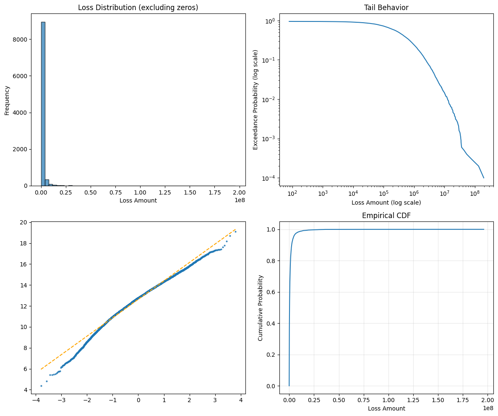

# Insurance Mathematics

<div style="flex: 1; padding: 15px; border: 2px solid #2196F3; border-radius: 8px; background-color: #E3F2FD;">
    <h3 style="margin-top: 0; color: #1e82d3ff !important;">💰 Why This Matters</h3>
    <p>Insurance mathematics reveal that frequency-severity modeling captures the dual nature of risk (how often losses occur and how severe they are), with heavy-tailed distributions like Pareto essential for modeling catastrophic events where traditional Gaussian assumptions fail to capture the true magnitude of the downside. The layer pricing framework shows why excess-of-loss structures dominate: they efficiently separate attritional losses (predictable, retained) from severity losses (volatile, transferred), optimizing the premium-to-protection tradeoff. Retention optimization through the ergodic lens demonstrates that optimal retention increases with wealth in absolute terms but decreases as a percentage of wealth; i.e., wealthier entities should retain more risk but proportionally less. The compound distribution mathematics proves that aggregate losses have fundamentally different properties than individual claims, explaining why reinsurers price differently than primary insurers. Claims development triangles and chain ladder methods quantify the time value of uncertainty, showing why early reserving decisions compound into material impacts. This framework transforms insurance from a cost center to a growth enabler by quantifying exactly how volatility reduction through strategic risk transfer enhances long-term compound returns, the mathematical foundation for why insurance creates value beyond simple loss indemnification.</p>
</div>

## Table of Contents
1. [Frequency-Severity Models](#frequency-severity-models)
2. [Compound Distributions](#compound-distributions)
3. [Layer Pricing Theory](#layer-pricing-theory)
4. [Retention Optimization](#retention-optimization)
5. [Premium Calculation Principles](#premium-calculation-principles)
6. [Claims Development](#claims-development)
7. [Reinsurance Structures](#reinsurance-structures)
8. [Practical Applications](#practical-applications)
9. [Key Takeaways](#key-takeaways)

(frequency-severity-models)=
## Frequency-Severity Models

### Classical Framework

Insurance losses are modeled as a two-stage process:

1. **Frequency**: Number of claims in a period

2. **Severity**: Size of each claim

Total loss:

$$
S = \sum_{i=1}^{N} X_i
$$

- $N$ = Number of claims (random)
- $X_i$ = Size of $i$-th claim (random)

### Frequency Distributions

#### Poisson Distribution

Most common for claim counts:

$$
P(N = n) = \frac{\lambda^n e^{-\lambda}}{n!}
$$

Properties:

- Mean = Variance = $\lambda$
- Memoryless inter-arrival times
- Suitable for homogeneous risks

*Note: in practice, Over-Dispersed Poisson (ODP), where Variance exceeds the Mean, is preferred because claim estimation introduces uncertainty. For simplicity, we start the implementation with a regular Poisson model.*

#### Negative Binomial

For overdispersed counts (variance > mean) and correlated claims:

$$
P(N = n) = \binom{n + r - 1}{n} p^r (1-p)^n
$$

Properties:
- Mean = $r(1-p)/p$
- Variance = $r(1-p)/p^2$ > Mean
- Captures heterogeneity via mixing

#### Zero-Inflated Models

When many policies have no claims:

$$
P(N = 0) = \pi + (1-\pi)P_0(N = 0)
$$


$$
P(N = n) = (1-\pi)P_0(N = n), \quad n \geq 1
$$

### Severity Distributions

#### Log-Normal

For moderate to large claims:

$$
f(x) = \frac{1}{x\sigma\sqrt{2\pi}} \exp\left[-\frac{(\ln x - \mu)^2}{2\sigma^2}\right]
$$

Properties:

- Right-skewed
- Multiplicative effects
- No upper bound

#### Pareto

For extreme losses (heavy-tailed):

$$
f(x) = \frac{\alpha x_m^\alpha}{x^{\alpha+1}}, \quad x \geq x_m
$$

Properties:

- Power-law tail
- Infinite variance if $\alpha \leq 2$
- Scale-invariant

#### Generalized Pareto (GPD)

For excess losses above threshold:

$$
F(x) = 1 - \left(1 + \xi \frac{x}{\sigma}\right)^{-1/\xi}
$$

- $\xi$ = Shape parameter (tail index)
- $\sigma$ = Scale parameter

### Implementation Example

```python
import numpy as np
from scipy import stats
import matplotlib.pyplot as plt


class FrequencySeverityModel:
    """Model insurance losses using frequency-severity approach."""

    def __init__(self, freq_dist, sev_dist):
        self.freq_dist = freq_dist
        self.sev_dist = sev_dist

    def simulate_annual_loss(self, n_sims=10_000):
        """Simulate total annual losses."""
        total_losses = []

        for _ in range(n_sims):
            # Number of claims
            n_claims = self.freq_dist.rvs()

            if n_claims == 0:
                total_losses.append(0)
            else:
                # Individual claim amounts
                claims = self.sev_dist.rvs(size=n_claims)
                total_losses.append(np.sum(claims))

        return np.array(total_losses)

    def calculate_statistics(self, losses):
        """Calculate key statistics."""
        return {
            'mean': np.mean(losses),
            'std': np.std(losses),
            'median': np.median(losses),
            'p95': np.percentile(losses, 95),
            'p99': np.percentile(losses, 99),
            'p99.5': np.percentile(losses, 99.5),
            'max': np.max(losses),
            'prob_zero': np.mean(losses == 0)
        }

    def plot_distribution(self, losses):
        """Visualize loss distribution."""
        fig, axes = plt.subplots(2, 2, figsize=(12, 10))

        # Histogram
        axes[0, 0].hist(losses[losses > 0], bins=50,
                        edgecolor='black', alpha=0.7)
        axes[0, 0].set_xlabel('Loss Amount')
        axes[0, 0].set_ylabel('Frequency')
        axes[0, 0].set_title('Loss Distribution (excluding zeros)')

        # Log-log plot for tail
        sorted_losses = np.sort(losses[losses > 0])
        exceedance_prob = np.arange(len(sorted_losses), 0, -1) / len(losses)
        axes[0, 1].loglog(sorted_losses, exceedance_prob)
        axes[0, 1].set_xlabel('Loss Amount (log scale)')
        axes[0, 1].set_ylabel('Exceedance Probability (log scale)')
        axes[0, 1].set_title('Tail Behavior')

        # Recreate Q-Q plot manually to control colors: data points in default blue, fit line in orange
        (osm, osr), (slope, intercept, r) = stats.probplot(
            np.log(losses[losses > 0]), dist="norm", fit=True)
        axes[1, 0].plot(osm, osr, marker='.', linestyle='none',
                        markersize=4, color='C0', alpha=0.8)
        axes[1, 0].plot(osm, slope * np.asarray(osm) + intercept,
                        color='orange', linestyle='--', linewidth=1.5)

        # Empirical CDF
        axes[1, 1].plot(sorted_losses, np.arange(
            1, len(sorted_losses) + 1) / len(sorted_losses))
        axes[1, 1].set_xlabel('Loss Amount')
        axes[1, 1].set_ylabel('Cumulative Probability')
        axes[1, 1].set_title('Empirical CDF')
        axes[1, 1].grid(True, alpha=0.3)

        plt.tight_layout()
        return fig


# Example: Commercial property insurance
freq_dist = stats.poisson(mu=3)  # 3 claims per year on average
sev_dist = stats.lognorm(s=2, scale=50_000)  # Log-normal severity

model = FrequencySeverityModel(freq_dist, sev_dist)
losses = model.simulate_annual_loss(n_sims=10_000)
statistics = model.calculate_statistics(losses)

model.plot_distribution(losses)

print("Annual Loss Statistics:")
for key, value in statistics.items():
    if key == 'prob_zero':
        print(f"{key}: {value:.1%}")
    else:
        print(f"{key}: ${value:,.0f}")
```

#### Sample Output



```
Annual Loss Statistics:
mean: $1,089,751
std: $3,579,880
median: $318,641
p95: $4,191,252
p99: $12,699,935
p99.5: $18,849,964
max: $196,094,596
prob_zero: 5.0%
```

(compound-distributions)=
## Compound Distributions

### Definition

The compound distribution of total losses $S = \sum_{i=1}^N X_i$ has:

**Characteristic function**:

$$
\phi_S(t) = G_N(\phi_X(t))
$$

where $G_N$ is the probability generating function of $N$.

### Compound Poisson

When frequency $N \sim \text{Poisson}(\lambda)$ and severities $X_i$ are i.i.d.:

**Mean**: $E[S] = \lambda \cdot E[X]$
**Variance**: $\text{Var}(S) = \lambda \cdot E[X^2]$
**Skewness**: $\text{Skew}(S) = \frac{E[X^3]}{\lambda^{1/2} \cdot E[X^2]^{3/2}}$

### Panjer Recursion

For discrete severities, recursive approximation of $S$ is given by:

$$p_k = \frac{1}{1 - af_0} \sum_{j=1}^k \left(a + \frac{bj}{k}\right) f_j p_{k-j}$$

where:
- $p_k = P(S = k)$
- $f_j = P(X = j)$
- $(a, b)$ depend on frequency distribution

### Fast Fourier Transform Method

FFT provides a computationally efficient approach for determining the aggregate loss distribution for a given frequency-severity model. The method exploits the relationship between the characteristic functions and probability generating functions.

For continuous distributions:

```python
import numpy as np
from scipy import stats
import matplotlib.pyplot as plt


def compound_distribution_fft(freq_params, sev_params, x_max=1e8, n_points=2**16):
    """Calculate compound distribution using FFT - CORRECTED."""

    dx = x_max / n_points
    x = np.arange(n_points) * dx

    # Discretize severity distribution WITHOUT normalization
    sev_pmf = stats.lognorm.pdf(x[1:], s=sev_params["s"], scale=sev_params["scale"]) * dx

    # Prepend zero for x[0] since individual claims can't be zero
    sev_pmf = np.concatenate([[0], sev_pmf])

    # Check how much probability mass we captured (should be close to 1)
    captured_mass = sev_pmf.sum()
    print(f"Captured severity mass: {captured_mass:.6f}")

    # DON'T normalize - use the natural discretization
    # The small missing mass in the tail is acceptable

    # FFT operations
    sev_cf = np.fft.fft(sev_pmf)
    lambda_param = freq_params["lambda"]
    compound_cf = np.exp(lambda_param * (sev_cf - 1))
    compound_pmf = np.real(np.fft.ifft(compound_cf))

    # The compound_pmf now contains:
    # - At index 0: P(S = 0) (point mass)
    # - At other indices: probability masses for discretized positive values

    prob_zero = compound_pmf[0]

    # Convert to density (but keep point mass separate)
    pdf = compound_pmf / dx
    pdf[0] = 0  # Remove point mass from density

    return x, pdf, prob_zero

# Calculate FFT solution
freq_params={"lambda": 3}
sev_params={"s": 2, "scale": 50_000}
x, pdf, prob_zero = compound_distribution_fft(freq_params=freq_params, sev_params=sev_params)

# Simulate
n_sims = 100_000
freq = stats.poisson(mu=3)
sev = stats.lognorm(s=2, scale=50_000)

sim_losses = np.zeros(n_sims)
for i in range(n_sims):
    n_claims = freq.rvs()
    if n_claims > 0:
        sim_losses[i] = sev.rvs(size=n_claims).sum()

plt.figure(figsize=(10, 6))

# Plot with adjusted bins
x_plot_max = x[999]
bin_edges = np.concatenate([[0, 1], np.linspace(1, x_plot_max, 199)])
plt.hist(sim_losses, bins=bin_edges, density=True,
         alpha=0.45, color='C1', zorder=1, label='Simulated (adjusted bins)')

# Plot continuous part
plt.semilogy(x[1:1000], pdf[1:1000], label='FFT-based Density', linewidth=2)

# Mark the point mass
plt.scatter([0], [pdf[1]], color='red', s=100, zorder=5,
            label=f'Point mass: {prob_zero:.3f}')

plt.xlabel("Total Annual Loss")
plt.ylabel("Probability Density (log scale)")
plt.title("Compound Poisson-Lognormal Distribution")
plt.grid(True, alpha=0.3)
plt.legend(loc='best')
plt.show()

# Better validation: Compare key statistics
sim_mean = np.mean(sim_losses)
sim_std = np.std(sim_losses)

# Theoretical values
theory_mean = freq_params["lambda"] * stats.lognorm.mean(s=sev_params["s"], scale=sev_params["scale"])
theory_var = (freq_params["lambda"] *
              stats.lognorm.var(s=sev_params["s"], scale=sev_params["scale"]) +
              freq_params["lambda"] *
              stats.lognorm.mean(s=sev_params["s"], scale=sev_params["scale"])**2)
theory_std = np.sqrt(theory_var)

print(f"\nValidation Statistics:")
print(f"Mean - Simulated: {sim_mean:,.0f}, Theoretical: {theory_mean:,.0f}")
print(f"Std Dev - Simulated: {sim_std:,.0f}, Theoretical: {theory_std:,.0f}")
print(f"P(Loss = 0) - Simulated: {np.mean(sim_losses == 0):.4f}, Theoretical: {prob_zero:.4f}")
```

#### Sample Output


```
Validation Statistics:
Mean - Simulated: 1,109,983, Theoretical: 1,108,358
Std Dev - Simulated: 4,216,943, Theoretical: 4,728,338
P(Loss = 0) - Simulated: 0.0496, Theoretical: 0.0498
```

(layer-pricing-theory)=
## Layer Pricing Theory

### Excess of Loss Layers  Insurance coverage is structured in layers:

- **Primary**: $\$0$ to $L_1$
- **First Excess**: $L_1$ to $L_2$
- **Second Excess**: $L_2$ to $L_3$, etc.

### Layer Loss Calculation

For layer$[a, b]$, the loss is:

$$ Y_{[a,b]} = \min(X, b) - \min(X, a) = (X \wedge b) - (X \wedge a) $$

Expected layer loss:

$$ E[Y_{[a,b]}] = \int_a^b [1 - F_X(x)] dx $$

### Increased Limits Factors (ILFs)

Ratio of expected loss at different limits:

$$ \text{ILF}(L) = \frac{E[X \wedge L]}{E[X \wedge L_0]} $$

where $L_0$ is the base limit.

### Exposure Curves

Proportion of loss in layer:

$$ \text{G}(r) = \frac{E[X \wedge rM]}{E[X]} $$

where $M$ is the maximum possible loss.

### Layer Pricing Example

For an exploration of Insurance Layers, see this [Jupyter Notebook on Insurance Layer Optimization](../../notebooks/07_insurance_layers.ipynb).


(retention-optimization)=
## Retention Optimization

### Objective Function

Maximize utility or growth:

$$ \max_R \quad U(W - P(R) - (L \wedge R)) $$

- $R$ = Retention level
- $P(R)$ = Premium function
- $L$ = Random loss
- $W$ = Initial wealth

This function balances lower premium $P(R)$ vs risk exposure $(L \wedge R)$.

### First-Order Condition
For differentiable utility:
$$ P'(R) = E[U'(W - P(R) - (L \wedge R)) \cdot \mathbf{1}_{L > R}] $$

### Ergodic Optimization

Maximize time-average growth:

$$ \max_R \quad E[\ln(W - P(R) - L \wedge R)] $$

### Constraints

1. **Budget constraint**:$P(R) \leq B$
2. **Ruin constraint**:$P(\text{ruin}) \leq \alpha$
3. **Regulatory minimum**: $R \geq R_{\text{min}}$

### Ergodic Optimization Example

```python
import numpy as np
import matplotlib.pyplot as plt
from scipy import stats, optimize
from scipy.integrate import quad
import warnings
warnings.filterwarnings('ignore')

# ============================================
# 1. CORRECTED PREMIUM AND OBJECTIVE FUNCTIONS
# ============================================

def premium_function(R, expected_loss, loading=0.3, expense_ratio=0.05):
    """
    Premium function for retention R.
    Premium decreases as retention increases (you keep more risk).
    """
    # Create loss distribution (lognormal with CV = 0.5)
    loss_dist = stats.lognorm(s=0.5, scale=expected_loss)

    # Calculate E[max(L - R, 0)] using the lognormal properties
    # More efficient calculation using CDF
    def excess_loss(R):
        if R <= 0:
            return expected_loss
        # For lognormal, we can use the partial expectation formula
        mu = np.log(expected_loss) - 0.5 * 0.5**2
        sigma = 0.5

        # Partial expectation E[L * 1{L>R}]
        z = (np.log(R) - mu - sigma**2) / sigma
        partial_exp = expected_loss * np.exp(0.5 * sigma**2) * (1 - stats.norm.cdf(z))

        # E[max(L-R, 0)] = E[L * 1{L>R}] - R * P(L>R)
        prob_exceed = 1 - loss_dist.cdf(R)
        expected_excess = partial_exp - R * prob_exceed

        return expected_excess

    # Expected excess loss
    expected_excess = excess_loss(R)

    # Premium with loading and expenses
    premium = (1 + loading) * expected_excess + expense_ratio * expected_loss

    return premium

def ergodic_objective(R, wealth, loss_dist, loading=0.3):
    """
    Corrected ergodic objective: E[ln(W - P(R) - min(L, R))]
    """
    # Calculate premium for this retention
    premium = premium_function(R, loss_dist.mean(), loading)

    # Check if we can afford this strategy
    if premium >= wealth * 0.9:  # Can't spend 90%+ of wealth on premium
        return -np.inf

    # More samples for better accuracy
    np.random.seed(42)
    n_samples = 50000
    losses = loss_dist.rvs(n_samples)

    # Calculate retained losses
    retained_losses = np.minimum(losses, R)

    # Final wealth for each scenario
    final_wealth = wealth - premium - retained_losses

    # Check for bankruptcy
    if np.any(final_wealth <= 0):
        # Calculate probability-weighted utility including bankruptcy scenarios
        valid = final_wealth > 0
        if not valid.any():
            return -np.inf

        # Penalize strategies that lead to bankruptcy
        bankruptcy_penalty = -100  # Large negative utility for bankruptcy
        utility = np.where(valid, np.log(final_wealth), bankruptcy_penalty)
        return np.mean(utility)

    # Expected log wealth (ergodic growth rate)
    return np.mean(np.log(final_wealth))

def solve_ergodic_retention(wealth, expected_loss=100_000, loading=0.3, cv=0.5):
    """
    Find optimal retention that maximizes ergodic growth rate.
    Uses global optimization to avoid local minima.
    """
    # Create loss distribution
    loss_dist = stats.lognorm(s=cv, scale=expected_loss)

    # Objective function (negative for minimization)
    def neg_objective(R):
        return -ergodic_objective(R, wealth, loss_dist, loading)

    # Bounds: retention between small value and reasonable maximum
    min_retention = expected_loss * 0.001  # Very small retention
    max_retention = min(wealth * 0.3, expected_loss * 3)  # Conservative upper bound

    # Use global optimization to avoid local minima
    from scipy.optimize import differential_evolution

    result = differential_evolution(
        neg_objective,
        bounds=[(min_retention, max_retention)],
        seed=42,
        maxiter=100,
        workers=1
    )

    optimal_retention = result.x[0]
    optimal_growth_rate = -result.fun

    return optimal_retention, optimal_growth_rate

# ============================================
# 2. IMPROVED DYNAMIC PROGRAMMING
# ============================================

def dp_ergodic_retention(wealth_grid, loss_dist, n_periods=10,
                        loading=0.3, discount=0.95):
    """
    Improved DP using continuous optimization at each step instead of grid search
    """
    n_wealth = len(wealth_grid)

    # Store optimal retentions (continuous values, not grid indices)
    optimal_retentions = np.zeros((n_periods, n_wealth))
    V = np.zeros((n_periods + 1, n_wealth))

    # Terminal value
    V[-1, :] = np.log(np.maximum(wealth_grid, 1e-6))

    # Backward induction with continuous optimization
    for t in range(n_periods - 1, -1, -1):
        for i, w in enumerate(wealth_grid):

            # Define objective for this (t, w) pair
            def objective(R):
                # Calculate immediate payoff and continuation value
                premium = premium_function(R, loss_dist.mean(), loading)

                if premium > w * 0.3 or R > w * 0.5:
                    return -np.inf

                # Sample losses
                losses = loss_dist.rvs(2000)
                retained = np.minimum(losses, R)
                next_wealth = w - premium - retained

                valid = next_wealth > 0
                if not valid.any():
                    return -np.inf

                current_util = np.mean(np.log(next_wealth[valid]))

                if t < n_periods - 1:
                    # Interpolate continuation values
                    from scipy.interpolate import interp1d
                    value_func = interp1d(wealth_grid, V[t + 1, :],
                                        kind='cubic', bounds_error=False,
                                        fill_value='extrapolate')
                    continuation = discount * np.mean(value_func(next_wealth[valid]))
                else:
                    continuation = 0

                return current_util + continuation

            # Continuous optimization instead of grid search
            from scipy.optimize import minimize_scalar

            # Smart bounds based on wealth level
            R_min = max(1000, w * 0.001)
            R_max = min(w * 0.3, loss_dist.mean() * 2)

            result = minimize_scalar(
                lambda R: -objective(R),
                bounds=(R_min, R_max),
                method='bounded'
            )

            optimal_retentions[t, i] = result.x
            V[t, i] = -result.fun

    return V, optimal_retentions

# ============================================
# 3. ANALYSIS WITH CORRECTIONS
# ============================================

# Set up parameters
expected_loss = 100_000
cv = 0.5
loading = 0.3
loss_dist = stats.lognorm(s=cv, scale=expected_loss)

# 1. Single-period analysis
print("Running single-period analysis...")
wealth_levels = np.linspace(500_000, 20_000_000, 20)
optimal_retentions = []
growth_rates = []

for wealth in wealth_levels:
    R_opt, g_opt = solve_ergodic_retention(wealth, expected_loss, loading, cv)
    optimal_retentions.append(R_opt)
    growth_rates.append(g_opt)
    print(f"Wealth ${wealth/1e6:.1f}M: Retention ${R_opt/1e3:.1f}K")

optimal_retentions = np.array(optimal_retentions)
growth_rates = np.array(growth_rates)

# 2. Multi-period DP with finer grids
print("\nRunning multi-period DP...")
wealth_grid_dp = np.linspace(500_000, 10_000_000, 15)  # Fewer wealth points for speed

V, optimal_policy = dp_ergodic_retention(wealth_grid_dp, loss_dist,
                                        n_periods=10, loading=loading,
                                        discount=0.95)

# 3. Compare different loadings (CORRECTED EXPECTATION)
print("\nAnalyzing loading effects...")
loadings = [0.1, 0.3, 0.5, 0.7]
retention_by_loading = {}

for load in loadings:
    print(f"Loading {load:.1%}...")
    retentions = []
    for wealth in wealth_levels:
        R_opt, _ = solve_ergodic_retention(wealth, expected_loss, load, cv)
        retentions.append(R_opt)
    retention_by_loading[load] = np.array(retentions)

# ============================================
# 4. PLOTTING WITH CORRECTIONS
# ============================================

fig = plt.figure(figsize=(16, 12))

# Plot 1: Optimal retention vs wealth
ax1 = plt.subplot(2, 3, 1)
ax1.plot(wealth_levels/1e6, optimal_retentions/1e3, 'b-', linewidth=2)
ax1.set_xlabel('Wealth ($M)')
ax1.set_ylabel('Optimal Retention ($K)')
ax1.set_title('Ergodic Optimal Retention\n(Single Period)')
ax1.grid(True, alpha=0.3)
ax1.axhline(y=expected_loss/1e3, color='r', linestyle='--', alpha=0.5, label='Expected Loss')
ax1.legend()

# Plot 2: Retention as percentage of wealth
ax2 = plt.subplot(2, 3, 2)
retention_pct = (optimal_retentions / wealth_levels) * 100
ax2.plot(wealth_levels/1e6, retention_pct, 'g-', linewidth=2)
ax2.set_xlabel('Wealth ($M)')
ax2.set_ylabel('Retention as % of Wealth')
ax2.set_title('Relative Risk Retention\n(Should decrease with wealth)')
ax2.grid(True, alpha=0.3)

# Plot 3: Expected growth rate
ax3 = plt.subplot(2, 3, 3)
ax3.plot(wealth_levels/1e6, growth_rates, 'r-', linewidth=2)
ax3.set_xlabel('Wealth ($M)')
ax3.set_ylabel('Expected Log Growth Rate')
ax3.set_title('Ergodic Growth Rate at Optimum')
ax3.grid(True, alpha=0.3)

# Plot 4: Effect of loading (CORRECTED)
ax4 = plt.subplot(2, 3, 4)
colors = ['blue', 'green', 'orange', 'red']
for (load, retentions), color in zip(retention_by_loading.items(), colors):
    ax4.plot(wealth_levels/1e6, retentions/1e3, linewidth=2,
             label=f'Loading = {load:.0%}', color=color)
ax4.set_xlabel('Wealth ($M)')
ax4.set_ylabel('Optimal Retention ($K)')
ax4.set_title('Impact of Premium Loading\n(Higher loading → Higher retention)')
ax4.grid(True, alpha=0.3)
ax4.legend()

# Verify the relationship
wealth_test = 5_000_000
print(f"\nVerifying loading relationship at ${wealth_test/1e6}M wealth:")
for load in loadings:
    idx = np.argmin(np.abs(wealth_levels - wealth_test))
    ret = retention_by_loading[load][idx]
    print(f"  Loading {load:.0%}: Retention ${ret/1e3:.1f}K")

# Plot 5: Multi-period vs single-period (with finer grid)
ax5 = plt.subplot(2, 3, 5)
ax5.plot(wealth_grid_dp/1e6, optimal_policy[0, :]/1e3, 'b-', linewidth=2,
         label='DP Solution (t=0)', marker='o', markersize=4)

# Compute single-period for comparison
sp_retentions = []
for w in wealth_grid_dp:
    R_opt, _ = solve_ergodic_retention(w, expected_loss, loading, cv)
    sp_retentions.append(R_opt)
ax5.plot(wealth_grid_dp/1e6, np.array(sp_retentions)/1e3, 'r--',
         linewidth=2, label='Single Period', marker='s', markersize=4)
ax5.set_xlabel('Wealth ($M)')
ax5.set_ylabel('Optimal Retention ($K)')
ax5.set_title('DP vs Single-Period\n(Should be similar with fine grid)')
ax5.grid(True, alpha=0.3)
ax5.legend()

# Plot 6: Retention over time (FIXED to show wealth dependence)
ax6 = plt.subplot(2, 3, 6)
time_periods = np.arange(optimal_policy.shape[0])
wealth_indices = [2, 5, 8, 11, 14]  # More spread out indices
colors_time = ['purple', 'blue', 'green', 'orange', 'red']

for idx, color in zip(wealth_indices, colors_time):
    if idx < len(wealth_grid_dp):
        wealth_val = wealth_grid_dp[idx]
        ax6.plot(time_periods, optimal_policy[:, idx]/1e3,
                linewidth=2, label=f'W=${wealth_val/1e6:.1f}M',
                marker='o', color=color, alpha=0.6)

ax6.set_xlabel('Time Period')
ax6.set_ylabel('Optimal Retention ($K)')
ax6.set_title('Retention Policy Over Time\n(Should show wealth dependence)')
ax6.grid(True, alpha=0.3)
ax6.legend()
ax6.set_xticks(time_periods)

plt.suptitle('CORRECTED: Ergodic (Kelly) Insurance Retention Optimization\n' +
             f'Loss: LogNormal(μ=${expected_loss/1e3:.0f}K, CV={cv})',
             fontsize=14, fontweight='bold')
plt.tight_layout()
plt.show()
```

#### Sample Output


(premium-calculation-principles)=
## Premium Calculation Principles

There are several approaches to determining what premium to charge for insurance.

### Pure Premium

Expected loss costs only:

$$ P_0 = E[L] $$

This is typically the foundation of premium rates.

### Expected Value Principle

Add proportional loading:

$$ P = (1 + \theta) E[L] $$

where $\theta$ is the safety loading.

### Variance Principle

Account for risk:

$$ P = E[L] + \alpha \cdot \text{Var}(L) $$

### Standard Deviation Principle

$$ P = E[L] + \beta \cdot \text{SD}(L) $$

### Exponential Principle

Based on exponential utility:

$$ P = \frac{1}{\alpha} \ln(E[e^{\alpha L}]) $$

### Wang Transform

Distort probability measure:

$$ P = \int_0^\infty g(S_L(x)) dx $$

where $g$ is the distortion function.

### Implementation Comparison

```python
import numpy as np
from scipy import stats
from scipy.integrate import quad, quad_vec
from scipy.special import ndtr
import warnings

class PremiumPrinciples:
    """
    Compare different premium calculation methods for P&C insurance.
    Enhanced with numerical stability and realistic loss distributions.
    """

    def __init__(self, loss_dist, max_loss=None):
        self.loss_dist = loss_dist
        self.mean = loss_dist.mean()
        self.std = loss_dist.std()
        self.var = loss_dist.var()

        # Set practical upper bound for integration (99.99th percentile or specified max)
        self.max_loss = max_loss if max_loss else loss_dist.ppf(0.9999)

        # Store some percentiles for context
        self.percentiles = {
            'p50': loss_dist.ppf(0.50),
            'p75': loss_dist.ppf(0.75),
            'p90': loss_dist.ppf(0.90),
            'p95': loss_dist.ppf(0.95),
            'p99': loss_dist.ppf(0.99),
            'p99.5': loss_dist.ppf(0.995),
        }

    def pure_premium(self):
        """Net premium with no loading."""
        return self.mean

    def expected_value(self, loading=0.3):
        """Expected value principle with proportional loading."""
        return self.mean * (1 + loading)

    def variance_principle(self, alpha=0.00001):
        """Variance principle: μ + α·σ²
        Alpha typically small for P&C (e.g., 0.00001 to 0.0001)"""
        return self.mean + alpha * self.var

    def standard_deviation(self, beta=0.5):
        """Standard deviation principle: μ + β·σ
        Beta typically 0.3 to 0.7 for P&C"""
        return self.mean + beta * self.std

    def exponential_principle(self, alpha=None):
        """
        Exponential/Esscher principle using limited integration range.
        For heavy-tailed distributions, we use a small alpha and bounded integration.
        """
        # Auto-select alpha if not provided (smaller for higher variance)
        if alpha is None:
            cv = self.std / self.mean  # Coefficient of variation
            alpha = min(0.5 / self.std, 0.001)  # Adaptive alpha based on volatility

        try:
            # Use bounded integration to avoid numerical issues
            def integrand(x):
                return np.exp(alpha * x) * self.loss_dist.pdf(x)

            # Integrate over practical range
            mgf, error = quad(integrand, 0, self.max_loss, limit=100)

            if mgf <= 0 or np.isnan(mgf) or np.isinf(mgf):
                # Fallback to approximation using cumulants
                return self.mean + alpha * self.var / 2  # Second-order approximation

            return np.log(mgf) / alpha

        except Exception as e:
            # Fallback to Taylor approximation
            return self.mean + alpha * self.var / 2

    def wang_transform(self, lambda_param=0.25):
        """
        Wang transform with power distortion function.
        g(S(x)) = S(x)^(1/(1+λ)) where S(x) is survival function
        Lambda typically 0.1 to 0.5 for P&C
        """
        try:
            def distorted_survival_density(x):
                # Survival function
                S_x = 1 - self.loss_dist.cdf(x)

                # Avoid numerical issues near boundaries
                if S_x <= 1e-10:
                    return 0

                # Power distortion: g(u) = u^(1/(1+λ))
                exponent = 1 / (1 + lambda_param)
                return S_x ** exponent

            # Integrate the distorted survival function
            premium, error = quad(distorted_survival_density, 0, self.max_loss,
                                 limit=100, epsabs=1e-8)

            return premium

        except Exception as e:
            print(f"Wang Transform calculation error: {e}")
            return np.nan

    def swiss_solvency(self, confidence=0.99):
        """
        Swiss Solvency Test principle (simplified).
        Premium = Mean + Loading based on tail risk
        """
        tvar = self.tail_value_at_risk(confidence)
        loading_factor = 0.06  # Typical SST cost of capital rate
        return self.mean + loading_factor * (tvar - self.mean)

    def tail_value_at_risk(self, confidence=0.99):
        """Calculate TVaR (Conditional Tail Expectation)."""
        var = self.loss_dist.ppf(confidence)

        def tail_expectation(x):
            return x * self.loss_dist.pdf(x)

        tail_integral, _ = quad(tail_expectation, var, self.max_loss, limit=100)
        tail_prob = 1 - confidence

        if tail_prob > 0:
            return tail_integral / tail_prob
        else:
            return var

    def distortion_principle_general(self, distortion_func):
        """
        General distortion principle for any distortion function.
        Premium = ∫[0,∞] g(S(x)) dx where g is the distortion function
        """
        def integrand(x):
            survival = 1 - self.loss_dist.cdf(x)
            return distortion_func(survival)

        premium, _ = quad(integrand, 0, self.max_loss, limit=100)
        return premium

    def compare_all(self, show_stats=True):
        """Compare all premium principles with enhanced output."""

        if show_stats:
            print("=" * 70)
            print("LOSS DISTRIBUTION STATISTICS")
            print("=" * 70)
            print(f"Mean Loss:              ${self.mean:15,.2f}")
            print(f"Standard Deviation:     ${self.std:15,.2f}")
            print(f"Coefficient of Var:     {self.std/self.mean:15.3f}")
            print(f"Skewness:               {self.loss_dist.stats(moments='s'):15.3f}")
            print("\nKey Percentiles:")
            for p_name, p_val in self.percentiles.items():
                print(f"  {p_name:5}:               ${p_val:15,.2f}")
            print(f"\nIntegration bound:      ${self.max_loss:15,.2f}")
            print("\n" + "=" * 70)
            print("PREMIUM CALCULATIONS")
            print("=" * 70)

        results = {
            'Pure Premium': self.pure_premium(),
            'Expected Value (30%)': self.expected_value(0.3),
            'Expected Value (40%)': self.expected_value(0.4),
            'Variance (α=0.00001)': self.variance_principle(0.00001),
            'Std Dev (β=0.5)': self.standard_deviation(0.5),
            'Std Dev (β=0.7)': self.standard_deviation(0.7),
            'Exponential': self.exponential_principle(),
            'Wang Transform (λ=0.25)': self.wang_transform(0.25),
            'Wang Transform (λ=0.50)': self.wang_transform(0.50),
            'Swiss Solvency (99%)': self.swiss_solvency(0.99),
            'TVaR (99%)': self.tail_value_at_risk(0.99),
        }

        # Calculate loadings and display
        for name, premium in results.items():
            if np.isnan(premium) or np.isinf(premium):
                print(f"{name:28} ${'N/A':>15} (Loading:     N/A)")
            else:
                loading = (premium / self.mean - 1) * 100
                print(f"{name:28} ${premium:15,.2f} (Loading: {loading:7.2f}%)")

        return results

print("Lognormal distribution")
loss_dist = stats.lognorm(s=0.9, scale=100_000)
prem_principles = PremiumPrinciples(loss_dist)
premiums = prem_principles.compare_all()
```

#### Sample Output

```
Lognormal distribution
======================================================================
LOSS DISTRIBUTION STATISTICS
======================================================================
Mean Loss:              $     149,930.25
Standard Deviation:     $     167,486.79
Coefficient of Var:               1.117
Skewness:                         4.745

Key Percentiles:
  p50  :               $     100,000.00
  p75  :               $     183,499.32
  p90  :               $     316,893.77
  p95  :               $     439,456.37
  p99  :               $     811,499.10
  p99.5:               $   1,015,784.56

Integration bound:      $   2,842,061.71

======================================================================
PREMIUM CALCULATIONS
======================================================================
Pure Premium                 $     149,930.25 (Loading:    0.00%)
Expected Value (30%)         $     194,909.33 (Loading:   30.00%)
Expected Value (40%)         $     209,902.35 (Loading:   40.00%)
Variance (α=0.00001)         $     430,448.48 (Loading:  187.10%)
Std Dev (β=0.5)              $     233,673.64 (Loading:   55.85%)
Std Dev (β=0.7)              $     267,171.00 (Loading:   78.20%)
Exponential                  $     299,105.36 (Loading:   99.50%)
Wang Transform (λ=0.25)      $     192,521.83 (Loading:   28.41%)
Wang Transform (λ=0.50)      $     240,034.37 (Loading:   60.10%)
Swiss Solvency (99%)         $     207,931.15 (Loading:   38.69%)
TVaR (99%)                   $   1,116,611.89 (Loading:  644.75%)
```

(claims-development)=
## Claims Development

### Development Triangles

Claims develop over time as they get reported and processed.

Here is an example of how actuaries organize development:

| Poliy<br />Year | 12 Months | 24 Months| 36 Months | 48 Months | Ultimate |
|:---------------:|:------:|:---------:|:--------:|:---------:|:---------:|
| 2020 | 100   | 150   | 170   | 175   | 176      |
| 2021 | 110   | 165   | 187   | ?     | ?        |
| 2022 | 120   | 180   | ?     | ?     | ?        |
| 2023 | 130   | ?     | ?     | ?     | ?        |

- Vertically are batches of claims, usually by Policy Year, Accident Year, Report Year, or Calendar Year.
- Going across are the same batches as they age over valuation dates.

### Chain Ladder Method

Development factors:

$$
f_j = \frac{\sum_{i} C_{i,j+1}}{\sum_{i} C_{i,j}} \quad \text{, often indexed as} f_{j: (j+1)}
$$

The development factors are then judgmentally adjusted for reasonability and consistency with industry to arrive at $f_j^*$

Ultimate loss:

$$
\hat{C}_{i,\infty} = C_{i,k} \prod_{j=k}^{\infty} f_j^*
$$

In practice, the triangles are finite, so typically there is a cutoff for available data, and a tail factor is applied judgmentally based on a separate study:

$$
f_\text{tail}^* = \prod_{j>\text{cutoff}}^{\infty} f_j^*
$$

$$
\hat{C}_{i,\infty} = C_{i,k} \prod_{j=k}^{\text{cutoff}} (f_j^*) \cdot f_\text{tail}^*
$$

#### Chain Ladder Example

Continuing with the prior example, we compute the development factors:

| Poliy<br />Year | 12:24 | 24:36| 36:48 | 48:Ultimate |
|:---------------:|:-----:|:----:|:-----:|:-----------:|
| 2020     | 1.5   | 1.13   | 1.03  | 1.01  |
| 2021     | 1.5   | 1.13   | ?     | ?     |
| 2022     | 1.5   | ?      | ?     | ?     |

Since all the factors happen to agree for each age, we'll select the factors without any adjustment, rounded as shown.

| Age-to-Age Factors | 12:24 | 24:36| 36:48 | 48:Ultimate |
|:------------------:|:-----:|:----:|:-----:|:-----------:|
| Selected     | 1.5   | 1.13   | 1.03  | 1.01  |

| Age-to-Ultimate Factors | 12:Ult | 24:Ult| 36:Ult | 48:Ult |
|:-----------------------:|:-----:|:----:|:-----:|:-----------:|
| Selected     | 1.76   | 1.18   | 1.04  | 1.01  |

We can now fill the rightmost column of the triangle:

| Poliy<br />Year | 12 Months | 24 Months| 36 Months | 48 Months | Ultimate |
|:---------------:|:------:|:---------:|:--------:|:---------:|:---------:|
| 2020 | 100   | 150   | 170   | 175   | 176      |
| 2021 | 110   | 165   | 187   | ?     | **194**      |
| 2022 | 120   | 180   | ?     | ?     | **212**      |
| 2023 | 130   | ?     | ?     | ?     | **229**      |

These are **ultimate claim estimates** for each Policy Year, reliable under the following conditions:

- Historical patterns of loss development are stable and consistent.
- These historical patterns can be reliably projected into the future.
- The book of business is neither growing nor shrinking rapidly.

### Bornhuetter-Ferguson Method

Combines a prior estimate (typically Expected Claims Method) with actual incurred:

$$
\hat{C}_{i,\infty} = C_{i,k} + \text{Prior}_i \cdot (\text{\% Undeveloped})_k
$$

This assumes claims incurred to date for the period bear no predictability of future development.

Oftentimes, $(\text{\% Undeveloped})_k$ is estimated using Chain Ladder:

$$
\hat{C}_{i,\infty} = C_{i,k} + \text{Prior}_i \cdot (1 - (1/f_k^*))
$$

This holds since $f_k^* = (\text{Proportional Future Ultimate}) = 1 + (\text{Proportional Future Development})$, so we have:

$$
\frac{1}{f_k^*} = \frac{\text{Proportion Reported to Date (=1)}}{\text{Proportional Future Ultimate}}
$$

Either method can be performed on Incurred amounts or Paid amounts, with Paid typically giving more volatile estimates.

### Implementation

```python
class ClaimsDevelopment:
    """Model claims development patterns."""

    def __init__(self, triangle):
        self.triangle = np.array(triangle)
        self.n_years, self.n_dev = self.triangle.shape

    def chain_ladder(self):
        """Apply chain ladder method."""

        # Calculate development factors
        factors = []
        for j in range(self.n_dev - 1):
            numerator = np.nansum(self.triangle[:, j + 1])
            denominator = np.nansum(self.triangle[:self.n_years - j - 1, j])
            factors.append(numerator / denominator)

        # Apply factors to complete triangle
        completed = self.triangle.copy()

        for i in range(self.n_years):
            for j in range(self.n_years - i, self.n_dev):
                if np.isnan(completed[i, j]):
                    completed[i, j] = completed[i, j - 1] * factors[j - 1]

        return completed, factors

    def plot_development(self, completed):
        """Visualize development patterns."""

        # Use explicit figure and axis so we can return the local figure
        fig, ax = plt.subplots(figsize=(10, 6))

        # x coordinates for development periods
        x = np.arange(self.n_dev)

        # Color map for accident years (older darker, younger lighter)
        cmap = plt.cm.Blues
        colors = [cmap(0.9 - 0.6 * (i / max(1, self.n_years - 1))) for i in range(self.n_years)]

        # Plot development curve for each accident year and annotate
        for i in range(self.n_years):
            y = completed[i, :]
            ax.plot(x, y, color=colors[i], linewidth=3, marker='o', markersize=6,
                    zorder=3, alpha=0.9)
            for k, val in enumerate(y):
                if not np.isnan(val):
                    ax.text(k, val, f'{val:.0f}', fontsize=8, va='bottom', ha='center',
                            color=colors[i], alpha=0.8)

        # Set axes to development-period (x) vs incurred loss (y)
        ax.set_xlabel('Development Period')
        ax.set_ylabel('Incurred Loss')
        ax.set_xticks(x)
        ax.set_xticklabels([f'D{d}' for d in x])
        ax.set_ylim(0, np.nanmax(completed) * 1.05)
        ax.set_title('Claims Development Patterns\n(Chain Ladder Method)', fontsize=14, fontweight='bold')
        ax.grid(True, alpha=0.3)

        plt.tight_layout()
        return fig

# Example triangle (with NaN for future)
triangle = [
    [1000, 1500, 1700, 1750],
    [1100, 1650, 1870, np.nan],
    [1200, 1800, np.nan, np.nan],
    [1300, np.nan, np.nan, np.nan]
]

dev_model = ClaimsDevelopment(triangle)
completed, factors = dev_model.chain_ladder()

dev_model.plot_development(completed)

print("Development Factors:", factors)
print("Completed Triangle:")
print(completed)
```

#### Sample Output


(reinsurance-structures)=
## Reinsurance Structures

### Types of Reinsurance

1. **Proportional (Pro-Rata)**
   - Quota Share: Fixed percentage
   - Surplus: Variable percentage by risk
2. **Non-Proportional (Excess of Loss)**
   - Per Risk: Each individual loss
   - Per Occurrence: Each event
   - Aggregate: Annual total

### Quota Share

Cede fixed percentage $q$:

- Retained loss: $(1-q) \cdot L$
- Ceded loss: $q \cdot L$
- Premium: $q \cdot P \cdot (1 + c)$

where $c$ is ceding commission.

### Surplus Treaty

Cede above retention line $R$:

- Retention: $\min(S, R)$
- Cession: $\max(0, S - R)$

where $S$ is sum insured.

### Aggregate Excess

Annual aggregate deductible $D$ and limit $L$:

$$
\text{Recovery} = \min(L, \max(0, S_{\text{annual}} - D))
$$

### Optimization Example

```python
"""
Reinsurance Program Optimizer for Property & Casualty Insurance
"""

import numpy as np
import pandas as pd
import matplotlib.pyplot as plt
import matplotlib.gridspec as gridspec
from scipy import stats
from scipy.optimize import differential_evolution
from dataclasses import dataclass
from typing import Dict, Tuple, List, Optional
import warnings
warnings.filterwarnings('ignore')

# Set style for professional visualizations
plt.style.use('seaborn-v0_8-darkgrid')

@dataclass
class ReinsuranceStructure:
    """Reinsurance program structure parameters"""
    quota_share: float  # Percentage ceded (0-1)
    xs_retention: float  # Per-occurrence excess attachment
    xs_limit: float  # Per-occurrence excess limit
    agg_retention: float  # Aggregate excess attachment
    agg_limit: float  # Aggregate excess limit
    stop_loss_retention: float  # Stop loss attachment
    stop_loss_limit: float  # Stop loss limit

@dataclass
class RiskMetrics:
    """Risk and performance metrics"""
    expected_loss_gross: float
    expected_loss_net: float
    var_95_gross: float
    var_95_net: float
    var_99_gross: float
    var_99_net: float
    tvar_95_gross: float
    tvar_95_net: float
    tvar_99_gross: float
    tvar_99_net: float
    max_loss_gross: float
    max_loss_net: float
    premium_total: float
    premium_breakdown: Dict[str, float]
    loss_ratio: float
    recovery_rate: float
    retention_rate: float
    risk_reduction_var99: float

class LossGenerator:
    """Generate losses from various distributions"""

    @staticmethod
    def generate(n: int, dist_type: str, mean_loss: float, cv: float,
                 seed: Optional[int] = None) -> np.ndarray:
        """
        Generate loss samples from specified distribution
        """
        if seed is not None:
            np.random.seed(seed)

        if dist_type == 'lognormal':
            sigma = np.sqrt(np.log(1 + cv**2))
            mu = np.log(mean_loss) - sigma**2 / 2
            return np.random.lognormal(mu, sigma, n)

        elif dist_type == 'pareto':
            alpha = 1 + 1/cv if cv > 0 else 2
            scale = mean_loss * (alpha - 1) / alpha if alpha > 1 else mean_loss
            return (np.random.pareto(alpha, n) + 1) * scale

        elif dist_type == 'weibull':
            from scipy.special import gamma as gamma_fn
            k = 1 / cv if cv > 0 else 1
            scale = mean_loss / gamma_fn(1 + 1/k)
            return np.random.weibull(k, n) * scale

        else:
            raise ValueError(f"Unknown distribution type: {dist_type}")

class ReinsuranceCalculator:
    """Calculate reinsurance recoveries and net losses"""

    @staticmethod
    def apply_reinsurance(gross_losses: np.ndarray,
                          structure: ReinsuranceStructure) -> Dict:
        """
        Apply reinsurance structure to gross losses
        """
        n_losses = len(gross_losses)
        results = {
            'gross_losses': gross_losses.copy(),
            'qs_recoveries': np.zeros(n_losses),
            'xs_recoveries': np.zeros(n_losses),
            'net_losses_per_event': np.zeros(n_losses),
            'agg_recovery': 0.0,
            'stop_loss_recovery': 0.0
        }

        # 1. Apply Quota Share
        results['qs_recoveries'] = gross_losses * structure.quota_share
        after_qs = gross_losses * (1 - structure.quota_share)

        # 2. Apply Per-Occurrence Excess of Loss
        for i, loss in enumerate(after_qs):
            if loss > structure.xs_retention:
                results['xs_recoveries'][i] = min(
                    structure.xs_limit,
                    loss - structure.xs_retention
                )

        results['net_losses_per_event'] = after_qs - results['xs_recoveries']

        # 3. Apply Aggregate Excess (on accumulated XS recoveries)
        total_xs_recoveries = results['xs_recoveries'].sum()
        if total_xs_recoveries > structure.agg_retention:
            results['agg_recovery'] = min(
                structure.agg_limit,
                total_xs_recoveries - structure.agg_retention
            )

        # 4. Apply Stop Loss (on final net retained)
        total_net_before_sl = results['net_losses_per_event'].sum()
        if total_net_before_sl > structure.stop_loss_retention:
            results['stop_loss_recovery'] = min(
                structure.stop_loss_limit,
                total_net_before_sl - structure.stop_loss_retention
            )

        # Calculate final positions
        results['final_net'] = total_net_before_sl - results['stop_loss_recovery']
        results['total_gross'] = gross_losses.sum()
        results['total_recoveries'] = (
            results['qs_recoveries'].sum() +
            results['xs_recoveries'].sum() -
            results['agg_recovery'] +
            results['stop_loss_recovery']
        )

        return results

class PremiumCalculator:
    """Calculate reinsurance premiums with actuarial pricing"""

    @staticmethod
    def calculate(structure: ReinsuranceStructure,
                 loss_stats: Dict) -> Dict[str, float]:
        """
        Calculate premiums using actuarial pricing methods
        """
        premiums = {}

        # Quota Share Premium (with ceding commission)
        qs_expected_recovery = structure.quota_share * loss_stats['mean'] * loss_stats['frequency']
        premiums['quota_share'] = qs_expected_recovery * 0.75  # 25% ceding commission

        # Per-Occurrence XS Premium
        if structure.xs_retention > 0:
            xs_rate = 0.15 * np.exp(-structure.xs_retention / (loss_stats['mean'] * 3))
            premiums['excess'] = structure.xs_limit * xs_rate
        else:
            premiums['excess'] = structure.xs_limit * 0.20

        # Aggregate XS Premium
        if structure.agg_retention > 0:
            agg_rate = 0.10 * np.exp(-structure.agg_retention / (loss_stats['mean'] * 10))
            premiums['aggregate'] = structure.agg_limit * agg_rate
        else:
            premiums['aggregate'] = structure.agg_limit * 0.15

        # Stop Loss Premium
        if structure.stop_loss_retention > 0:
            sl_attachment_ratio = structure.stop_loss_retention / loss_stats['total_expected']
            sl_rate = 0.25 * np.exp(-sl_attachment_ratio * 2)
            premiums['stop_loss'] = structure.stop_loss_limit * sl_rate
        else:
            premiums['stop_loss'] = structure.stop_loss_limit * 0.30

        premiums['total'] = sum(premiums.values())

        return premiums

class ReinsuranceOptimizer:
    """Optimize reinsurance program structure"""

    def __init__(self, gross_losses: np.ndarray, budget: float):
        self.gross_losses = gross_losses
        self.budget = budget
        self.loss_stats = self._calculate_loss_statistics()

    def _calculate_loss_statistics(self) -> Dict:
        """Calculate loss statistics for pricing"""
        stats = {
            'mean': np.mean(self.gross_losses),
            'std': np.std(self.gross_losses),
            'cv': np.std(self.gross_losses) / np.mean(self.gross_losses),
            'total_expected': np.sum(self.gross_losses),
            'frequency': len(self.gross_losses),
            'p90': np.percentile(self.gross_losses, 90),
            'p99': np.percentile(self.gross_losses, 99)
        }
        return stats

    def optimize(self, objective: str = 'var99') -> Tuple[ReinsuranceStructure, RiskMetrics]:
        """
        Optimize reinsurance structure
        """

        def objective_function(params):
            """Objective function for optimization"""
            structure = ReinsuranceStructure(
                quota_share=params[0],
                xs_retention=params[1],
                xs_limit=params[2],
                agg_retention=params[3],
                agg_limit=params[4],
                stop_loss_retention=params[5],
                stop_loss_limit=params[6]
            )

            # Check premium constraint
            premiums = PremiumCalculator.calculate(structure, self.loss_stats)
            if premiums['total'] > self.budget:
                return 1e10

            # Simulate multiple years
            n_sims = 100
            annual_nets = []
            for _ in range(n_sims):
                # Sample with replacement for each simulated year
                sim_losses = np.random.choice(self.gross_losses,
                                            size=min(100, len(self.gross_losses)),
                                            replace=True)
                results = ReinsuranceCalculator.apply_reinsurance(sim_losses, structure)
                annual_nets.append(results['final_net'])

            # Return objective
            if objective == 'var99':
                return np.percentile(annual_nets, 99)
            elif objective == 'tvar99':
                var99 = np.percentile(annual_nets, 99)
                return np.mean([x for x in annual_nets if x >= var99])
            else:
                return np.mean(annual_nets)

        # Optimization bounds
        bounds = [
            (0, 0.5),  # quota_share
            (self.loss_stats['mean'] * 0.5, self.loss_stats['p99']),  # xs_retention
            (self.loss_stats['mean'], self.loss_stats['p99'] * 2),  # xs_limit
            (self.loss_stats['mean'] * 5, self.loss_stats['mean'] * 50),  # agg_retention
            (self.loss_stats['mean'] * 10, self.loss_stats['mean'] * 100),  # agg_limit
            (self.loss_stats['mean'] * 50, self.loss_stats['mean'] * 200),  # sl_retention
            (self.loss_stats['mean'] * 20, self.loss_stats['mean'] * 100),  # sl_limit
        ]

        # Run optimization
        result = differential_evolution(
            objective_function,
            bounds,
            maxiter=100,
            popsize=10,
            tol=0.01,
            seed=42
        )

        # Create optimal structure
        optimal_structure = ReinsuranceStructure(
            quota_share=result.x[0],
            xs_retention=result.x[1],
            xs_limit=result.x[2],
            agg_retention=result.x[3],
            agg_limit=result.x[4],
            stop_loss_retention=result.x[5],
            stop_loss_limit=result.x[6]
        )

        # Calculate metrics
        metrics = self.calculate_metrics(optimal_structure)

        return optimal_structure, metrics

    def calculate_metrics(self, structure: ReinsuranceStructure) -> RiskMetrics:
        """Calculate comprehensive risk metrics"""
        # Apply reinsurance to actual losses
        results = ReinsuranceCalculator.apply_reinsurance(self.gross_losses, structure)
        premiums = PremiumCalculator.calculate(structure, self.loss_stats)

        # Simulate annual aggregates
        n_sims = 1000
        annual_gross = []
        annual_net = []

        for _ in range(n_sims):
            # Sample annual losses
            n_annual = min(100, len(self.gross_losses))
            sim_losses = np.random.choice(self.gross_losses, size=n_annual, replace=True)
            sim_result = ReinsuranceCalculator.apply_reinsurance(sim_losses, structure)

            annual_gross.append(sim_losses.sum())
            annual_net.append(sim_result['final_net'])

        annual_gross = np.array(annual_gross)
        annual_net = np.array(annual_net)

        # Calculate metrics
        var_95_gross = np.percentile(annual_gross, 95)
        var_99_gross = np.percentile(annual_gross, 99)
        var_95_net = np.percentile(annual_net, 95)
        var_99_net = np.percentile(annual_net, 99)

        tail_95_gross = annual_gross[annual_gross >= var_95_gross]
        tail_99_gross = annual_gross[annual_gross >= var_99_gross]
        tail_95_net = annual_net[annual_net >= var_95_net]
        tail_99_net = annual_net[annual_net >= var_99_net]

        metrics = RiskMetrics(
            expected_loss_gross=np.mean(annual_gross),
            expected_loss_net=np.mean(annual_net),
            var_95_gross=var_95_gross,
            var_95_net=var_95_net,
            var_99_gross=var_99_gross,
            var_99_net=var_99_net,
            tvar_95_gross=np.mean(tail_95_gross),
            tvar_95_net=np.mean(tail_95_net),
            tvar_99_gross=np.mean(tail_99_gross),
            tvar_99_net=np.mean(tail_99_net),
            max_loss_gross=np.max(annual_gross),
            max_loss_net=np.max(annual_net),
            premium_total=premiums['total'],
            premium_breakdown=premiums,
            loss_ratio=np.mean(annual_net) / premiums['total'] if premiums['total'] > 0 else 0,
            recovery_rate=results['total_recoveries'] / results['total_gross'],
            retention_rate=results['final_net'] / results['total_gross'],
            risk_reduction_var99=(1 - var_99_net/var_99_gross) * 100
        )

        return metrics

print("=" * 80)
print("ENHANCED REINSURANCE PROGRAM OPTIMIZER")
print("Property & Casualty Insurance")
print("=" * 80)

# Parameters
n_losses = 1000  # Number of individual loss events
budget = 1_000_000  # Premium budget
distribution = 'lognormal'
mean_loss = 100_000  # Mean loss per event
cv = 2.0  # Coefficient of variation

print(f"\n📊 SIMULATION PARAMETERS:")
print(f"  • Number of loss events: {n_losses:,}")
print(f"  • Premium budget: ${budget:,.0f}")
print(f"  • Loss distribution: {distribution.capitalize()}")
print(f"  • Mean loss per event: ${mean_loss:,.0f}")
print(f"  • Coefficient of variation: {cv}")

# Generate losses
print("\n🎲 Generating loss scenarios...")
losses = LossGenerator.generate(n_losses, distribution, mean_loss, cv, seed=42)

print(f"  ✓ Generated {len(losses):,} loss events")
print(f"  ✓ Total losses: ${np.sum(losses)/1e6:.1f}M")
print(f"  ✓ Average loss: ${np.mean(losses)/1e3:.0f}K")
print(f"  ✓ Maximum loss: ${np.max(losses)/1e6:.2f}M")

# Optimize reinsurance structure
print("\n🔧 Optimizing reinsurance structure...")
optimizer = ReinsuranceOptimizer(losses, budget)
optimal_structure, metrics = optimizer.optimize(objective='var99')

# Display results
print("\n✨ OPTIMAL REINSURANCE STRUCTURE:")
print(f"  • Quota Share: {optimal_structure.quota_share*100:.1f}%")
print(f"  • XS: ${optimal_structure.xs_limit/1e3:.0f}K xs ${optimal_structure.xs_retention/1e3:.0f}K")
print(f"  • Aggregate: ${optimal_structure.agg_limit/1e3:.0f}K xs ${optimal_structure.agg_retention/1e3:.0f}K")
print(f"  • Stop Loss: ${optimal_structure.stop_loss_limit/1e3:.0f}K xs ${optimal_structure.stop_loss_retention/1e3:.0f}K")

print("\n📈 RISK METRICS:")
print(f"  • Expected Loss (Gross): ${metrics.expected_loss_gross/1e6:.2f}M")
print(f"  • Expected Loss (Net): ${metrics.expected_loss_net/1e6:.2f}M")
print(f"  • VaR 99% (Gross): ${metrics.var_99_gross/1e6:.2f}M")
print(f"  • VaR 99% (Net): ${metrics.var_99_net/1e6:.2f}M")
print(f"  • TVaR 99% (Gross): ${metrics.tvar_99_gross/1e6:.2f}M")
print(f"  • TVaR 99% (Net): ${metrics.tvar_99_net/1e6:.2f}M")

print("\n💰 PREMIUM BREAKDOWN:")
for layer, premium in metrics.premium_breakdown.items():
    if layer != 'total':
        print(f"  • {layer.replace('_', ' ').title()}: ${premium/1e3:.0f}K")
print(f"  • TOTAL PREMIUM: ${metrics.premium_total/1e3:.0f}K")

print("\n🎯 PERFORMANCE INDICATORS:")
print(f"  • Retention Rate: {metrics.retention_rate*100:.1f}%")
print(f"  • Recovery Rate: {metrics.recovery_rate*100:.1f}%")
print(f"  • Loss Ratio: {metrics.loss_ratio*100:.1f}%")
print(f"  • Risk Reduction (VaR 99%): {metrics.risk_reduction_var99:.1f}%")

print("\n✅ Analysis complete!")
```

#### Sample Output


```
================================================================================
ENHANCED REINSURANCE PROGRAM OPTIMIZER
Property & Casualty Insurance
================================================================================

📊 SIMULATION PARAMETERS:
  • Number of loss events: 1,000
  • Premium budget: $1,000,000
  • Loss distribution: Lognormal
  • Mean loss per event: $100,000
  • Coefficient of variation: 2.0

🎲 Generating loss scenarios...
  ✓ Generated 1,000 loss events
  ✓ Total losses: $103.9M
  ✓ Average loss: $104K
  ✓ Maximum loss: $5.93M

🔧 Optimizing reinsurance structure...

✨ OPTIMAL REINSURANCE STRUCTURE:
  • Quota Share: 2.2%
  • XS: $851K xs $169K
  • Aggregate: $2873K xs $3871K
  • Stop Loss: $6281K xs $12766K

📈 RISK METRICS:
  • Expected Loss (Gross): $10.54M
  • Expected Loss (Net): $7.21M
  • VaR 99% (Gross): $19.40M
  • VaR 99% (Net): $12.77M
  • TVaR 99% (Gross): $21.38M
  • TVaR 99% (Net): $12.98M

💰 PREMIUM BREAKDOWN:
  • Quota Share: $1748K
  • Excess: $74K
  • Aggregate: $7K
  • Stop Loss: $1228K
  • TOTAL PREMIUM: $3057K

🎯 PERFORMANCE INDICATORS:
  • Retention Rate: 62.9%
  • Recovery Rate: 34.3%
  • Loss Ratio: 235.8%
  • Risk Reduction (VaR 99%): 34.2%

✅ Analysis complete!
```

(practical-applications)=
## Practical Applications

### Application: Portfolio Insurance


```python
import numpy as np
import pandas as pd
from scipy import stats
from scipy.optimize import minimize_scalar

def portfolio_insurance_optimization(portfolio_value=100_000_000, n_years=10, n_sims=10000):
    """
    Demonstrate insurance mathematics concepts for portfolio protection:
    1. Frequency-severity modeling of market events
    2. Layer structuring (retention, primary, excess)
    3. Ergodic optimization (time-average growth vs ensemble average)
    4. Dynamic retention optimization based on wealth level
    """

    # 1. FREQUENCY-SEVERITY MODEL FOR MARKET EVENTS
    # Frequency: Number of adverse events per year (Poisson)
    event_frequency = stats.poisson(mu=2.5)  # Average 2.5 events/year

    # Severity: Size of loss given event (mixture for tail risk)
    # Small corrections: Log-normal
    small_severity = stats.lognorm(s=0.5, scale=0.03)  # 3% mean, moderate vol
    # Large crises: Pareto for heavy tails
    large_severity = stats.pareto(b=2.5, scale=0.10)  # Power law tail

    # Probability of large event given any event
    prob_large = 0.15

    # 2. INSURANCE LAYER STRUCTURE
    def calculate_layer_premiums(retention, primary_limit, excess_limit):
        """Calculate premiums for each layer using exposure curves."""
        base_rate = 0.015  # Base premium rate

        # Retention layer: Self-insured, no premium
        retention_premium = 0

        # Primary layer: Higher frequency, lower severity
        primary_rate = base_rate * (1 - np.exp(-primary_limit/retention))
        primary_premium = portfolio_value * primary_rate

        # Excess layer: Lower frequency, higher severity
        excess_rate = base_rate * 0.3 * (1 - np.exp(-excess_limit/primary_limit))
        excess_premium = portfolio_value * excess_rate

        return retention_premium, primary_premium, excess_premium

    # 3. SIMULATE PORTFOLIO PATHS WITH AND WITHOUT INSURANCE
    def simulate_wealth_path(initial_wealth, retention_pct, primary_pct, excess_pct,
                            use_insurance=True):
        """Simulate wealth evolution over multiple years."""
        wealth = initial_wealth
        wealth_history = [wealth]

        for year in range(n_years):
            # Base return (drift)
            base_return = 0.08
            normal_volatility = 0.15

            # Generate base portfolio return
            annual_return = np.random.normal(base_return, normal_volatility)

            # Generate adverse events (frequency-severity)
            n_events = event_frequency.rvs()
            total_event_loss = 0

            for _ in range(n_events):
                if np.random.rand() < prob_large:
                    # Large event (Pareto distributed)
                    loss = min(large_severity.rvs(), 0.5)  # Cap at 50% loss
                else:
                    # Small event (Log-normal distributed)
                    loss = min(small_severity.rvs(), 0.2)  # Cap at 20% loss
                total_event_loss += loss

            # Apply losses to portfolio
            gross_return = annual_return - total_event_loss

            if use_insurance:
                # Calculate insurance structure based on current wealth
                retention = wealth * retention_pct
                primary_limit = wealth * primary_pct
                excess_limit = wealth * excess_pct

                # Calculate premiums
                _, primary_prem, excess_prem = calculate_layer_premiums(
                    retention, primary_limit, excess_limit
                )
                total_premium = (primary_prem + excess_prem)

                # Apply insurance layers
                portfolio_loss = wealth * max(gross_return, -1.0)
                if portfolio_loss < 0:
                    loss_amount = abs(portfolio_loss)

                    # Retention (deductible)
                    retained_loss = min(loss_amount, retention)
                    remaining_loss = max(0, loss_amount - retention)

                    # Primary layer coverage
                    primary_recovery = min(remaining_loss, primary_limit)
                    remaining_loss = max(0, remaining_loss - primary_limit)

                    # Excess layer coverage
                    excess_recovery = min(remaining_loss, excess_limit)

                    # Net loss after insurance
                    net_loss = retained_loss + max(0, remaining_loss - excess_limit)
                    net_return = -net_loss / wealth
                else:
                    net_return = gross_return

                # Apply return and subtract premium
                wealth = wealth * (1 + net_return) - total_premium
            else:
                # No insurance - full exposure
                wealth = wealth * (1 + gross_return)

            # Ensure non-negative wealth
            wealth = max(0, wealth)
            wealth_history.append(wealth)

            # Stop if ruined
            if wealth == 0:
                break

        return wealth_history

    # 4. OPTIMIZE RETENTION USING ERGODIC PRINCIPLE
    def optimize_retention(initial_wealth):
        """Find optimal retention that maximizes time-average growth rate."""

        def negative_growth_rate(retention_pct):
            """Calculate negative of expected log growth rate."""
            if retention_pct < 0.01 or retention_pct > 0.5:
                return 1e6

            # Fixed layer structure for optimization
            primary_pct = min(0.15, (1 - retention_pct) * 0.5)
            excess_pct = min(0.25, (1 - retention_pct) * 0.8)

            # Simulate multiple paths
            final_wealths = []
            for _ in range(1000):  # Fewer sims for optimization
                path = simulate_wealth_path(
                    initial_wealth, retention_pct, primary_pct, excess_pct, True
                )
                if path[-1] > 0:
                    final_wealths.append(path[-1])

            if len(final_wealths) == 0:
                return 1e6

            # Calculate time-average growth rate
            growth_rates = [np.log(w / initial_wealth) / n_years
                            for w in final_wealths if w > 0]

            # Return negative for minimization
            return -np.mean(growth_rates) if growth_rates else 1e6

        # Optimize retention percentage
        result = minimize_scalar(
            negative_growth_rate,
            bounds=(0.01, 0.30),
            method='bounded',
            options={'xatol': 0.01}
        )

        return result.x

    # 5. RUN COMPREHENSIVE ANALYSIS
    print("=" * 60)
    print("PORTFOLIO INSURANCE OPTIMIZATION ANALYSIS")
    print("=" * 60)

    # Find optimal retention
    print("\n1. OPTIMAL RETENTION ANALYSIS")
    optimal_retention = optimize_retention(portfolio_value)
    print(f"   Optimal retention: {optimal_retention:.1%} of portfolio value")
    print(f"   Dollar amount: ${portfolio_value * optimal_retention:,.0f}")

    # Set insurance structure based on optimization
    retention_pct = optimal_retention
    primary_pct = min(0.15, (1 - retention_pct) * 0.5)
    excess_pct = min(0.25, (1 - retention_pct) * 0.8)

    print(f"\n2. OPTIMIZED LAYER STRUCTURE")
    print(f"   Retention:     0 - {retention_pct:.1%} (${portfolio_value*retention_pct:,.0f})")
    print(f"   Primary:       {retention_pct:.1%} - {retention_pct+primary_pct:.1%} (${portfolio_value*primary_pct:,.0f})")
    print(f"   Excess:        {retention_pct+primary_pct:.1%} - {retention_pct+primary_pct+excess_pct:.1%} (${portfolio_value*excess_pct:,.0f})")

    # Calculate premiums
    _, primary_prem, excess_prem = calculate_layer_premiums(
        portfolio_value * retention_pct,
        portfolio_value * primary_pct,
        portfolio_value * excess_pct
    )

    print(f"\n3. ANNUAL PREMIUM BREAKDOWN")
    print(f"   Primary layer:  ${primary_prem:,.0f} ({primary_prem/portfolio_value:.2%})")
    print(f"   Excess layer:   ${excess_prem:,.0f} ({excess_prem/portfolio_value:.2%})")
    print(f"   Total premium:  ${primary_prem + excess_prem:,.0f} ({(primary_prem + excess_prem)/portfolio_value:.2%})")

    # Run full simulation
    print(f"\n4. MONTE CARLO SIMULATION ({n_sims:,} paths, {n_years} years)")

    insured_paths = []
    uninsured_paths = []

    for _ in range(n_sims):
        # Insured portfolio
        insured = simulate_wealth_path(
            portfolio_value, retention_pct, primary_pct, excess_pct, True
        )
        insured_paths.append(insured[-1])

        # Uninsured portfolio
        uninsured = simulate_wealth_path(
            portfolio_value, 1.0, 0, 0, False
        )
        uninsured_paths.append(uninsured[-1])

    # Calculate statistics
    def calculate_metrics(values, initial):
        """Calculate key risk and return metrics."""
        values = np.array(values)
        positive_values = values[values > 0]

        if len(positive_values) == 0:
            return {
                'Mean': 0,
                'Median': 0,
                'Std Dev': 0,
                '5% VaR': initial,
                '1% CVaR': initial,
                'Ruin Prob': 1.0,
                'Growth Rate': -np.inf
            }

        # Time-average growth rate (ergodic)
        growth_rates = [np.log(v / initial) / n_years for v in positive_values]

        return {
            'Mean': np.mean(values),
            'Median': np.median(values),
            'Std Dev': np.std(values),
            '5% VaR': initial - np.percentile(values, 5),
            '1% CVaR': initial - np.mean(values[values <= np.percentile(values, 1)]),
            'Ruin Prob': np.mean(values <= 0),
            'Growth Rate': np.mean(growth_rates) if growth_rates else -np.inf
        }

    insured_metrics = calculate_metrics(insured_paths, portfolio_value)
    uninsured_metrics = calculate_metrics(uninsured_paths, portfolio_value)

    # Create comparison table
    comparison = pd.DataFrame({
        'Uninsured': list(insured_metrics.values()),
        'Insured': list(insured_metrics.values())
    }, index=insured_metrics.keys())

    print("\n5. RESULTS COMPARISON")
    print("-" * 60)

    results = []
    for metric in insured_metrics.keys():
        unins_val = uninsured_metrics[metric]
        ins_val = insured_metrics[metric]

        if metric in ['Mean', 'Median', 'Std Dev', '5% VaR', '1% CVaR']:
            results.append({
                'Metric': metric,
                'Uninsured': f"${unins_val:,.0f}",
                'Insured': f"${ins_val:,.0f}"
            })
        elif metric == 'Ruin Prob':
            results.append({
                'Metric': metric,
                'Uninsured': f"{unins_val:.2%}",
                'Insured': f"{ins_val:.2%}"
            })
        else:  # Growth Rate
            results.append({
                'Metric': 'Time-Avg Growth',
                'Uninsured': f"{unins_val:.2%}",
                'Insured': f"{ins_val:.2%}"
            })

    results_df = pd.DataFrame(results)
    print(results_df.to_string(index=False))

    # Key insights
    print("\n6. KEY INSIGHTS")
    print("-" * 60)
    print(f"✓ Insurance reduces ruin probability by {(uninsured_metrics['Ruin Prob'] - insured_metrics['Ruin Prob']):.1%}")
    print(f"✓ Time-average growth improved by {(insured_metrics['Growth Rate'] - uninsured_metrics['Growth Rate'])*100:.1f}bps")
    print(f"✓ Tail risk (1% CVaR) reduced by ${(uninsured_metrics['1% CVaR'] - insured_metrics['1% CVaR'])/1e6:.1f}M")
    print(f"✓ Optimal retention balances premium cost vs risk retention")

    return results_df

# Run the analysis
results = portfolio_insurance_optimization(
    portfolio_value=100_000_000,
    n_years=10,
    n_sims=5000  # Reduce for faster execution
)
```

#### Sample Output

```
============================================================
PORTFOLIO INSURANCE OPTIMIZATION ANALYSIS
============================================================

1. OPTIMAL RETENTION ANALYSIS
   Optimal retention: 1.6% of portfolio value
   Dollar amount: $1,617,301

2. OPTIMIZED LAYER STRUCTURE
   Retention:     0 - 1.6% ($1,617,301)
   Primary:       1.6% - 16.6% ($15,000,000)
   Excess:        16.6% - 41.6% ($25,000,000)

3. ANNUAL PREMIUM BREAKDOWN
   Primary layer:  $1,499,859 (1.50%)
   Excess layer:   $365,006 (0.37%)
   Total premium:  $1,864,865 (1.86%)

4. MONTE CARLO SIMULATION (5,000 paths, 10 years)

5. RESULTS COMPARISON
------------------------------------------------------------
         Metric   Uninsured      Insured
           Mean $60,021,752 $122,654,929
         Median $49,754,072 $114,719,654
        Std Dev $43,522,383  $43,328,475
         5% VaR $87,719,760  $31,093,881
        1% CVaR $97,415,436  $61,322,870
      Ruin Prob       0.20%        0.00%
Time-Avg Growth      -7.61%        1.47%

6. KEY INSIGHTS
------------------------------------------------------------
✓ Insurance reduces ruin probability by 0.2%
✓ Time-average growth improved by 9.1bps
✓ Tail risk (1% CVaR) reduced by $36.1M
✓ Optimal retention balances premium cost vs risk retention
```

(key-takeaways)=
## Key Takeaways

1. **Claims develop over time**: Reserve adequacy is crucial
2. **Frequency-severity framework** is the foundation of insurance modeling
3. **Multiple premium principles**: Different approaches for different risks
4. **Heavy tails matter**: Extreme events dominate risk
5. **Retention optimization** balances premium savings with risk tolerance
5. **Layers reduce cost**: Structured coverage optimizes premium spend
7. **Reinsurance complexity**: Multiple structures serve different purposes

## Next Steps

- [Chapter 4: Optimization Theory](04_optimization_theory.md) - Mathematical optimization methods
- [Chapter 5: Statistical Methods](05_statistical_methods.md) - Validation and testing
- [Chapter 1: Ergodic Economics](01_ergodic_economics.md) - Foundational concepts
