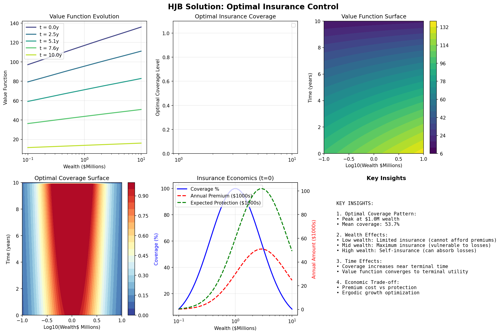
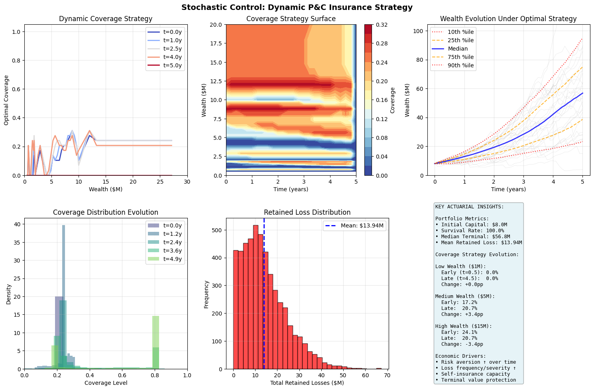

# Optimization Theory for Insurance

<div style="flex: 1; padding: 15px; border: 2px solid #2196F3; border-radius: 8px; background-color: #E3F2FD;">
    <h3 style="margin-top: 0; color: #1e82d3ff !important;">⚖️ Why This Matters</h3>
    <p>Optimization theory reveals that insurance decisions are fundamentally multi-objective problems with no single optimal solution. The Pareto frontier quantifies the inevitable tradeoffs between premium costs, retained risk, and earnings volatility. The Hamilton-Jacobi-Bellman framework proves that optimal insurance coverage should dynamically adjust with wealth levels and time horizons: entities with low capital need minimal coverage (can't afford premiums), middle-wealth entities need maximum coverage (most vulnerable), while wealthy entities self-insure (can absorb losses). Stochastic control theory shows how optimal strategies must adapt to market cycles, with coverage increasing during bear markets when losses are more frequent and decreasing during bull markets when growth dominates. The constrained optimization framework incorporating KKT conditions ensures solutions respect real-world constraints like budget limits, regulatory requirements, and ruin probability thresholds. Numerical methods comparison demonstrates that gradient descent fails for non-convex insurance problems, while evolutionary algorithms like particle swarm find global optima in complex multi-modal landscapes. This section proves that static insurance programs are suboptimal, while dynamic strategies that adjust coverage based on wealth, time, and market conditions can improve long-term growth rates by several percentage points annually while maintaining the same survival probability, transforming insurance from a fixed cost to an adaptive growth enabler.</p>
</div>


## Table of Contents

1. [Constrained Optimization](#constrained-optimization)
2. [Pareto Efficiency](#pareto-efficiency)
3. [Multi-Objective Optimization](#multi-objective-optimization)
4. [Hamilton-Jacobi-Bellman Equations](#hamilton-jacobi-bellman-equations)
5. [Numerical Methods](#numerical-methods)
6. [Stochastic Control](#stochastic-control)
7. [Convergence Criteria](#convergence-criteria)


(constrained-optimization)=
## Constrained Optimization

### General Formulation

The insurance optimization problem:

$$
\begin{align} \max_{x \in \mathcal{X}} &\quad f(x) \\
\text{subject to} &\quad g_i(x) \leq 0, \quad i = 1, ..., m \\
&\quad h_j(x) = 0, \quad j = 1, ..., p \end{align}
$$

- $x$ = Decision variables (retention, limits, premiums)
- $f(x)$ = Objective (growth rate, utility, profit)
- $g_i(x)$ = Inequality constraints (budget, ruin probability)
- $h_j(x)$ = Equality constraints (regulatory requirements)

### Lagrangian Method

Form the Lagrangian:

$$
\mathcal{L}(x, \lambda, \mu) = f(x) - \sum_{i=1}^m \lambda_i g_i(x) - \sum_{j=1}^p \mu_j h_j(x)
$$

- $\lambda_i$ = "shadow price" for the inequality constraint $g_i$, which represents the marginal change in optimal objective value if we relax constraint $g_i$ slightly.
  - If $\lambda_i > 0$ for a capital constraint, it tells you how much additional profit you'd gain per dollar of additional capital.
  - If $\lambda_i > 0$  for a risk constraint, it quantifies the cost of that risk limit on your objective.
- $\mu_i$ = shadow price for equality constraint $h_j$

### Karush-Kuhn-Tucker (KKT) Conditions

Necessary conditions for optimality:

1. **Stationarity**: $\nabla_x \mathcal{L} = 0$
    - The gradient with respect to decision variables equals zero (local optimum)
    - Example: Marginal profit from increasing retention equals marginal cost

2. **Primal feasibility**: $g_i(x) \leq 0$, $h_j(x) = 0$
    - The solution satisfies all original constraints
    - Example: Capital requirements met, regulatory ratios satisfied

3. **Dual feasibility**: $\lambda_i \geq 0$
    - Lagrange multipliers for inequality constraints must be non-negative
    - Economic interpretation: Shadow prices for "≤" constraints are positive
      (relaxing a binding constraint improves the objective)
    - Example: The value of additional capital is always positive or zero

4. **Complementary slackness**: $\lambda_i g_i(x) = 0$
    - Either the constraint is binding ($g_i(x) = 0$) OR its multiplier is zero ($\lambda_i = 0$)
    - Economic interpretation: You only "pay a price" for constraints that are binding
    - Example: If you have excess capital ($g_i(x) < 0$), then $\lambda_i = 0$
      (additional capital has no marginal value)
    - If capital constraint is binding ($g_i(x) = 0$), then $\lambda_i > 0$
      (additional capital would improve profit)

### Practical Insurance Example:

Consider maximizing expected profit subject to a VaR constraint:
- If VaR constraint is NOT binding: $\lambda_{VaR} = 0$ (risk limit doesn't affect optimal solution)
- If VaR constraint IS binding: $\lambda_{VaR} > 0$ tells you the profit sacrifice per unit of risk limit

### Insurance Application

```python
import numpy as np
from scipy import stats
from scipy.optimize import minimize, NonlinearConstraint
import matplotlib.pyplot as plt

class InsuranceOptimizer:
    """Optimize insurance program with constraints."""

    def __init__(self, initial_wealth, growth_params, loss_dist):
        self.W0 = initial_wealth
        self.growth_params = growth_params
        self.loss_dist = loss_dist

    def objective(self, x):
        """Maximize expected log wealth (negative for minimization)."""
        retention, limit = x[0], x[1]

            # Simulate outcomes
        n_sims = 1000
        final_wealth = []

        for _ in range(n_sims):
            # Base growth
            growth = np.random.normal(
                self.growth_params['mu'],
                self.growth_params['sigma']
            )
            wealth = self.W0 * (1 + growth)

            # Loss and insurance
            loss = self.loss_dist.rvs()
            retained_loss = min(loss, retention)
            covered_loss = min(max(0, loss - retention), limit)

            # Premium (simplified)
            premium = 0.01 * limit + 0.02 * max(0, limit - retention)

            # Final wealth
            wealth = wealth - retained_loss - premium
            final_wealth.append(max(0, wealth))

        # Expected log utility
        positive_wealth = [w for w in final_wealth if w > 0]

        if not positive_wealth:
            return 1e10 # Penalize bankruptcy

        return -np.mean(np.log(positive_wealth))

    def ruin_constraint(self, x):
        """Probability of ruin constraint."""
        retention, limit = x[0], x[1]

        # Simulate ruin probability
        n_sims = 1000
        ruin_count = 0

        for _ in range(n_sims):
            wealth = self.W0
            for year in range(10):
                # 10-year horizon
                growth = np.random.normal(
                    self.growth_params['mu'],
                    self.growth_params['sigma']
                )
                wealth *= (1 + growth)

                loss = self.loss_dist.rvs()
                retained_loss = min(loss, retention)
                premium = 0.01 * limit + 0.02 * max(0, limit - retention)

                wealth = wealth - retained_loss - premium

                if wealth <= 0:
                    ruin_count += 1
                    break

        return ruin_count / n_sims  # Should be <= threshold

    def optimize(self, ruin_threshold=0.01, budget=None):
        """Find optimal insurance program."""

        # Initial guess
        x0 = [self.W0 * 0.05, self.W0 * 0.20]  # 5% retention, 20% limit

        # Bounds
        bounds = [
            (0, self.W0 * 0.10),  # Retention: 0 to 10% of wealth
            (0, self.W0 * 0.50)  # Limit: 0 to 50% of wealth
        ]

        # Constraints
        constraints = []

        # Ruin probability constraint
        constraints.append(NonlinearConstraint(
            self.ruin_constraint,
            lb=0,
            ub=ruin_threshold
        ))

        # Budget constraint if specified
        if budget:
            def premium_constraint(x):
                return 0.01 * x[1] + 0.02 * max(0, x[1] - x[0])

            constraints.append(NonlinearConstraint(
                premium_constraint,
                lb=0,
                ub=budget
            ))

        # Optimize
        result = minimize(
            self.objective,
            x0,
            method='SLSQP',
            bounds=bounds,
            constraints=constraints,
            options={'maxiter': 100}
        )

        return result

# Example optimization
optimizer = InsuranceOptimizer(
    initial_wealth=10_000_000,
    growth_params={'mu': 0.08, 'sigma': 0.15},
    loss_dist=stats.lognorm(s=2, scale=100_000)
)

result = optimizer.optimize(ruin_threshold=0.01)

print(f"Optimal retention: ${result.x[0]:,.0f}")
print(f"Optimal limit: ${result.x[1]:,.0f}")
print(f"Expected growth: {-result.fun:.4f}")
```

#### Sample Output

```
Optimal retention: $500,078
Optimal limit: $1,997,977
Expected growth: 16.1570
```

(pareto-efficiency)=
## Pareto Efficiency

### Definition

A solution is **Pareto efficient** if no objective can be improved without worsening another.

### Pareto Frontier

Set of all Pareto efficient solutions:

$$
\mathcal{P} = \{x^* \in \mathcal{X} : x^* \text{ is not dominated by any other } x \in \mathcal{X}\}
$$

Where "$x$ dominatex $x^*$" means:

- $f_i(x) \geq f_i(x^*)$ for all objectives $i$, AND
- $f_j(x) > f_j(x^*)$ for at least one objective $j$

### Scalarization Methods

Scalarization methods transform multi-objective optimization problems into single-objective problems, making them solvable using standard optimization techniques. These methods are particularly useful in actuarial applications where competing objectives (e.g., minimizing risk while maximizing return, or balancing premium adequacy against market competitiveness) must be reconciled.

#### Weighted Sum

The weighted sum method combines multiple objectives into a single scalar objective through a linear combination:

$$
\min_{x} \sum_{i=1}^k w_i f_i(x)
$$

where $\sum w_i = 1$, $w_i \geq 0$.

The solution obtained corresponds to a point on the Pareto frontier.

##### Key Considerations:

- **Weights** ($w_i$): Represent the relative importance of each objective. In P&C applications, these might reflect regulatory priorities, strategic goals, or risk appetite.
- **Normalization**: Objectives should typically be normalized to comparable scales before applying weights, especially when objectives have different units (e.g., dollars vs. percentages).
  - For objectives with different scales, one normalization approach is to use the following formula:

$$
\bar{f}_i(x) = \frac{f_i(x) - f_i^{\text{min}}}{f_i^{\text{max}} - f_i^{\text{min}}}
$$

##### Advantages:

- Computationally efficient and straightforward to implement
- Intuitive interpretation of weights as trade-off ratios
- Can leverage existing single-objective optimization solvers

##### Limitations:

- Cannot find solutions in non-convex regions of the Pareto frontier
- Requires careful weight selection; small changes can lead to significantly different solutions
- May miss important trade-off solutions if the Pareto frontier has non-convex regions

#### Epsilon-Constraint

The epsilon-constraint method optimizes one primary objective while constraining all others:

$$
\begin{align} \min_{x} &\quad f_1(x) \\ \text{s.t.} &\quad f_i(x) \leq \epsilon_i, \quad i = 2, ..., k \end{align}
$$

##### Key Concepts:

- **Primary Objective**: The objective function $f_1(x)$ selected for optimization
- **Constraint Bounds** ($\epsilon_i$): Upper limits for secondary objectives, effectively defining acceptable trade-off levels

##### Implementation Considerations:

- The choice of primary objective should reflect the most critical business priority
- Systematic variation of $\epsilon$ values generates multiple Pareto-optimal solutions
- Constraint bounds must be feasible; infeasible bounds result in empty solution sets

##### Advantages:

- Can identify all Pareto-optimal solutions, including those in non-convex regions
- Provides clear interpretation: "minimize $f_1$​ given that $f_2$​ cannot exceed $\epsilon_2$​"
- More flexible than weighted sum for complex Pareto frontiers
- Natural fit for problems with hard constraints on certain objectives

##### Limitations:

- Requires solving multiple optimization problems to characterize the Pareto frontier
- Selection of appropriate $\epsilon$ values can be challenging without prior knowledge
  - Less intuitive than weights-as-tradeoffs decision in the weighted sum approach
- Computational cost increases with the number of constraint variations explored
- May require sophisticated constraint-handling techniques for complex problems

### Insurance Trade-offs: Pareto Frontier Optimization for P&C Insurance Decisions

Implementation of weighted sum and epsilon-constraint methods for multi-objective optimization in actuarial applications.

```python
import numpy as np
import matplotlib.pyplot as plt
from scipy.optimize import minimize, NonlinearConstraint
from typing import List, Dict, Callable, Tuple
import warnings
warnings.filterwarnings('ignore')


class ParetoFrontier:
    """
    Compute Pareto frontier for insurance portfolio optimization.

    Typical P&C applications include:
    - Reinsurance structure optimization (retention vs cost)
    - Capital allocation (risk vs return)
    - Reserve adequacy (surplus vs competitiveness)
    """

    def __init__(self, objectives: List[Callable], constraints: List = None):
        """
        Initialize Pareto frontier solver.

        Args:
            objectives: List of objective functions to minimize
            constraints: Optional list of optimization constraints
        """
        self.objectives = objectives
        self.constraints = constraints if constraints else []

    def weighted_sum_method(self, weights_grid: List[Tuple]) -> List[Dict]:
        """
        Generate Pareto frontier using weighted sum scalarization.

        This method is computationally efficient and intuitive for stakeholders
        who can express preferences as relative weights.

        Args:
            weights_grid: List of weight tuples, each summing to 1

        Returns:
            List of Pareto-optimal solutions with objectives and weights
        """
        frontier = []

        for i, weights in enumerate(weights_grid):
            # Verify weights sum to 1
            assert abs(sum(weights) - 1.0) < 1e-6, f"Weights must sum to 1, got {sum(weights)}"

            # Combined objective function
            def combined_objective(x):
                return sum(w * obj(x) for w, obj in zip(weights, self.objectives))

            # Use varied starting points for better exploration
            # This helps avoid local minima in non-convex problems
            x0_retention = 0.1 + 0.8 * (i / len(weights_grid))
            x0_coverage = 0.9 - 0.7 * (i / len(weights_grid))

            # Optimize using Sequential Least Squares Programming
            result = minimize(
                combined_objective,
                x0=[x0_retention, x0_coverage],
                bounds=[(0, 1), (0, 2)],  # Extended bounds for coverage flexibility
                constraints=self.constraints,
                method='SLSQP',
                options={'disp': False, 'maxiter': 200}
            )

            if result.success:
                # Evaluate all objectives at solution point
                obj_values = [obj(result.x) for obj in self.objectives]
                frontier.append({
                    'x': result.x,
                    'objectives': obj_values,
                    'weights': weights,
                    'method': 'weighted_sum'
                })

        return frontier

    def epsilon_constraint_method(self, epsilon_grid: List[List[float]]) -> List[Dict]:
        """
        Generate Pareto frontier using epsilon-constraint method.

        This method can find solutions in non-convex regions and is ideal
        when some objectives have natural constraint thresholds (e.g.,
        regulatory minimums, risk limits).

        Args:
            epsilon_grid: List of epsilon values for constraining secondary objectives

        Returns:
            List of Pareto-optimal solutions with objectives and epsilon values
        """
        frontier = []

        for eps_values in epsilon_grid:
            # Primary objective: minimize first objective
            def primary_objective(x):
                return self.objectives[0](x)

            # Create constraints for other objectives
            additional_constraints = []
            for i, obj in enumerate(self.objectives[1:], 1):
                # Each secondary objective must be <= its epsilon value
                additional_constraints.append(
                    NonlinearConstraint(
                        obj,
                        lb=-np.inf,
                        ub=eps_values[i-1],
                        keep_feasible=False
                    )
                )

            # Combine original and epsilon constraints
            all_constraints = self.constraints + additional_constraints

            # Optimize with multiple starting points for robustness
            for start_point in [[0.3, 0.7], [0.5, 0.5], [0.7, 0.3]]:
                result = minimize(
                    primary_objective,
                    x0=start_point,
                    bounds=[(0, 1), (0, 2)],
                    constraints=all_constraints,
                    method='SLSQP',
                    options={'disp': False, 'maxiter': 200}
                )

                if result.success:
                    obj_values = [obj(result.x) for obj in self.objectives]
                    frontier.append({
                        'x': result.x,
                        'objectives': obj_values,
                        'epsilon': eps_values,
                        'method': 'epsilon_constraint'
                    })
                    break  # Use first successful result

        return frontier

    def plot_frontier(self, frontier: List[Dict], obj_names: List[str] = None,
                     title: str = 'Pareto Frontier - Insurance Optimization'):
        """
        Visualize Pareto frontier with actuarial annotations.

        Args:
            frontier: List of Pareto-optimal solutions
            obj_names: Names for objectives (default: ['Obj 1', 'Obj 2'])
            title: Plot title
        """
        if not frontier:
            print("No valid solutions found in frontier")
            return

        objectives = np.array([f['objectives'] for f in frontier])

        if obj_names is None:
            obj_names = [f'Objective {i+1}' for i in range(objectives.shape[1])]

        if objectives.shape[1] == 2:
            # 2D Pareto frontier plot
            plt.figure(figsize=(12, 8))

            # Color by method if available
            methods = [f.get('method', 'unknown') for f in frontier]
            method_colors = {'weighted_sum': 'blue', 'epsilon_constraint': 'red', 'unknown': 'gray'}
            colors = [method_colors.get(m, 'gray') for m in methods]

            # Main scatter plot
            for method in set(methods):
                mask = [m == method for m in methods]
                method_objectives = objectives[mask]
                if len(method_objectives) > 0:
                    plt.scatter(method_objectives[:, 0], method_objectives[:, 1],
                              s=100, alpha=0.7, edgecolors='black', linewidth=0.5,
                              label=method.replace('_', ' ').title())

            # Connect points to show frontier
            sorted_idx = np.argsort(objectives[:, 0])
            plt.plot(objectives[sorted_idx, 0], objectives[sorted_idx, 1],
                    'g--', alpha=0.3, linewidth=1, label='Frontier')

            # Labels and formatting
            plt.xlabel(obj_names[0], fontsize=12)
            plt.ylabel(obj_names[1], fontsize=12)
            plt.title(title, fontsize=14, fontweight='bold')
            plt.grid(True, alpha=0.3)
            plt.legend(loc='best')

            # Annotate key solutions
            self._annotate_key_points(objectives, obj_names)

            plt.tight_layout()
            plt.show()

        elif objectives.shape[1] == 3:
            # 3D Pareto frontier plot
            fig = plt.figure(figsize=(12, 9))
            ax = fig.add_subplot(111, projection='3d')

            scatter = ax.scatter(objectives[:, 0], objectives[:, 1], objectives[:, 2],
                               c=range(len(objectives)), cmap='viridis', s=50, alpha=0.7)

            ax.set_xlabel(obj_names[0], fontsize=10)
            ax.set_ylabel(obj_names[1], fontsize=10)
            ax.set_zlabel(obj_names[2], fontsize=10)
            ax.set_title(title, fontsize=12, fontweight='bold')

            plt.colorbar(scatter, label='Solution Index')
            plt.tight_layout()
            plt.show()

    def _annotate_key_points(self, objectives: np.ndarray, obj_names: List[str]):
        """Add annotations for key solutions on the Pareto frontier."""
        # Extreme points
        min_obj1_idx = np.argmin(objectives[:, 0])
        min_obj2_idx = np.argmin(objectives[:, 1])

        plt.annotate(f'Min {obj_names[0]}',
                    (objectives[min_obj1_idx, 0], objectives[min_obj1_idx, 1]),
                    xytext=(10, 10), textcoords='offset points',
                    bbox=dict(boxstyle='round,pad=0.3', facecolor='yellow', alpha=0.7),
                    arrowprops=dict(arrowstyle='->', color='black', alpha=0.5))

        plt.annotate(f'Min {obj_names[1]}',
                    (objectives[min_obj2_idx, 0], objectives[min_obj2_idx, 1]),
                    xytext=(10, -20), textcoords='offset points',
                    bbox=dict(boxstyle='round,pad=0.3', facecolor='orange', alpha=0.7),
                    arrowprops=dict(arrowstyle='->', color='black', alpha=0.5))

        # Balanced solution (closest to utopia point)
        obj_norm = (objectives - objectives.min(axis=0)) / (objectives.max(axis=0) - objectives.min(axis=0) + 1e-10)
        distances = np.sqrt(np.sum(obj_norm**2, axis=1))
        balanced_idx = np.argmin(distances)

        plt.annotate('Balanced Solution',
                    (objectives[balanced_idx, 0], objectives[balanced_idx, 1]),
                    xytext=(-50, 20), textcoords='offset points',
                    bbox=dict(boxstyle='round,pad=0.3', facecolor='lightgreen', alpha=0.7),
                    arrowprops=dict(arrowstyle='->', color='black', alpha=0.5))


# ==============================================================================
# P&C ACTUARIAL EXAMPLE 1: REINSURANCE OPTIMIZATION
# ==============================================================================

def reinsurance_example():
    """
    Example: Optimize reinsurance program balancing retention and cost.

    This is a common P&C actuarial problem where we need to find the optimal
    retention level and coverage limit that balances:
    1. Expected retained losses (minimize)
    2. Reinsurance premium costs (minimize)
    """
    print("=" * 70)
    print("EXAMPLE 1: REINSURANCE OPTIMIZATION")
    print("=" * 70)

    def expected_retained_loss(x):
        """
        Expected retained losses as function of retention and limit.

        Args:
            x: [retention_ratio, coverage_limit_ratio]
        """
        retention, coverage = x
        # Simplified loss model with severity and frequency components
        base_loss = 100  # Million USD
        retention_factor = retention**1.2  # Non-linear retention impact
        coverage_benefit = 1 - 0.7 * (1 - np.exp(-2 * coverage))
        return base_loss * retention_factor * coverage_benefit

    def reinsurance_cost(x):
        """
        Reinsurance premium based on retention and coverage.

        Higher coverage and lower retention = higher premium
        """
        retention, coverage = x
        base_premium = 20  # Million USD
        # Premium increases with coverage and decreases with retention
        premium_factor = (1 - retention * 0.5) * (1 + coverage * 0.8)
        loading_factor = 1.15  # Typical reinsurer loading
        return base_premium * premium_factor * loading_factor

    # Set up optimization
    objectives = [expected_retained_loss, reinsurance_cost]

    # Constraint: Total program cost must be reasonable
    constraints = [
        NonlinearConstraint(
            lambda x: expected_retained_loss(x) + reinsurance_cost(x),
            lb=0, ub=150  # Total cost cap at 150M
        )
    ]

    pareto = ParetoFrontier(objectives, constraints)

    # Method 1: Weighted Sum
    print("\n1. WEIGHTED SUM METHOD")
    print("-" * 30)

    # Generate weight combinations emphasizing different priorities
    weights_grid = []
    for i in range(20):
        w1 = i / 19  # From 0 to 1
        w2 = 1 - w1
        weights_grid.append((w1, w2))

    frontier_ws = pareto.weighted_sum_method(weights_grid)

    # Display sample solutions
    print(f"Found {len(frontier_ws)} Pareto-optimal solutions")
    print("\nSample solutions (different risk appetites):")

    # Conservative (minimize retained loss)
    conservative = min(frontier_ws, key=lambda x: x['objectives'][0])
    print(f"\nConservative (80% loss, 20% cost weight):")
    print(f"  Retention: {conservative['x'][0]:.2%}")
    print(f"  Coverage: {conservative['x'][1]:.2f}x")
    print(f"  Expected Loss: ${conservative['objectives'][0]:.1f}M")
    print(f"  Reinsurance Cost: ${conservative['objectives'][1]:.1f}M")

    # Aggressive (minimize cost)
    aggressive = min(frontier_ws, key=lambda x: x['objectives'][1])
    print(f"\nAggressive (20% loss, 80% cost weight):")
    print(f"  Retention: {aggressive['x'][0]:.2%}")
    print(f"  Coverage: {aggressive['x'][1]:.2f}x")
    print(f"  Expected Loss: ${aggressive['objectives'][0]:.1f}M")
    print(f"  Reinsurance Cost: ${aggressive['objectives'][1]:.1f}M")

    # Method 2: Epsilon-Constraint
    print("\n2. EPSILON-CONSTRAINT METHOD")
    print("-" * 30)

    # Set epsilon values for reinsurance cost constraint
    epsilon_grid = []
    for cost_limit in np.linspace(15, 40, 15):  # Cost limits from 15M to 40M
        epsilon_grid.append([cost_limit])

    frontier_ec = pareto.epsilon_constraint_method(epsilon_grid)

    print(f"Found {len(frontier_ec)} Pareto-optimal solutions")
    print("\nSolutions at different cost constraints:")

    for i in [0, len(frontier_ec)//2, -1]:
        if i < len(frontier_ec):
            sol = frontier_ec[i]
            print(f"\nCost limit: ${sol['epsilon'][0]:.1f}M")
            print(f"  Retention: {sol['x'][0]:.2%}")
            print(f"  Coverage: {sol['x'][1]:.2f}x")
            print(f"  Expected Loss: ${sol['objectives'][0]:.1f}M")
            print(f"  Actual Cost: ${sol['objectives'][1]:.1f}M")

    # Combine and plot
    all_solutions = frontier_ws + frontier_ec
    pareto.plot_frontier(
        all_solutions,
        obj_names=['Expected Retained Loss ($M)', 'Reinsurance Cost ($M)'],
        title='Reinsurance Program Optimization - Pareto Frontier'
    )

    return pareto, all_solutions


# ==============================================================================
# P&C ACTUARIAL EXAMPLE 2: CAPITAL ALLOCATION
# ==============================================================================

def capital_allocation_example():
    """
    Example: Optimize capital allocation across business lines.

    Balance between:
    1. Portfolio risk (VaR or TVaR)
    2. Expected return (ROE)
    3. Diversification benefit
    """
    print("\n" + "=" * 70)
    print("EXAMPLE 2: CAPITAL ALLOCATION ACROSS LINES")
    print("=" * 70)

    def portfolio_risk(x):
        """
        Portfolio Value-at-Risk (simplified model).

        Args:
            x: [allocation_personal_lines, allocation_commercial]
        """
        personal, commercial = x
        # Standalone risks
        risk_personal = 50 * personal**0.8
        risk_commercial = 80 * commercial**0.9
        # Correlation benefit
        correlation = 0.3
        diversified_risk = np.sqrt(
            risk_personal**2 + risk_commercial**2 +
            2 * correlation * risk_personal * risk_commercial
        )
        return diversified_risk

    def negative_roe(x):
        """
        Negative expected ROE (for minimization).
        """
        personal, commercial = x
        # Expected returns differ by line
        roe_personal = 0.12 * personal
        roe_commercial = 0.18 * commercial * (1 - 0.1 * commercial)  # Diminishing returns
        combined_roe = roe_personal + roe_commercial
        return -combined_roe  # Negative for minimization

    def concentration_penalty(x):
        """
        Penalty for concentration risk (regulatory concern).
        """
        personal, commercial = x
        # Herfindahl index for concentration
        total = personal + commercial
        if total == 0:
            return 0
        hhi = (personal/total)**2 + (commercial/total)**2
        return hhi * 100  # Scale for visibility

    # Three-objective optimization
    objectives = [portfolio_risk, negative_roe, concentration_penalty]

    # Constraints: allocations must sum to 1
    constraints = [
        NonlinearConstraint(
            lambda x: x[0] + x[1],
            lb=0.95, ub=1.05  # Allow small deviation for numerical stability
        )
    ]

    pareto = ParetoFrontier(objectives[:2], constraints)  # Use first 2 objectives for 2D viz

    print("\n1. WEIGHTED SUM METHOD (Risk vs Return)")
    print("-" * 30)

    # Generate weights for different risk preferences
    weights_grid = []
    for risk_aversion in np.linspace(0, 1, 15):
        w_risk = risk_aversion
        w_return = 1 - risk_aversion
        weights_grid.append((w_risk, w_return))

    frontier_ws = pareto.weighted_sum_method(weights_grid)

    print(f"Found {len(frontier_ws)} Pareto-optimal allocations")

    # Analyze key allocations
    if frontier_ws:
        # Risk-averse allocation
        risk_averse = min(frontier_ws, key=lambda x: x['objectives'][0])
        print(f"\nRisk-Averse Allocation:")
        print(f"  Personal Lines: {risk_averse['x'][0]:.1%}")
        print(f"  Commercial Lines: {risk_averse['x'][1]:.1%}")
        print(f"  Portfolio VaR: ${risk_averse['objectives'][0]:.1f}M")
        print(f"  Expected ROE: {-risk_averse['objectives'][1]:.1%}")

        # Return-seeking allocation
        return_seeking = min(frontier_ws, key=lambda x: x['objectives'][1])
        print(f"\nReturn-Seeking Allocation:")
        print(f"  Personal Lines: {return_seeking['x'][0]:.1%}")
        print(f"  Commercial Lines: {return_seeking['x'][1]:.1%}")
        print(f"  Portfolio VaR: ${return_seeking['objectives'][0]:.1f}M")
        print(f"  Expected ROE: {-return_seeking['objectives'][1]:.1%}")

    print("\n2. EPSILON-CONSTRAINT METHOD (Constrain Risk)")
    print("-" * 30)

    # Set risk limits
    epsilon_grid = []
    for risk_limit in np.linspace(30, 70, 10):
        epsilon_grid.append([risk_limit])  # Constraint on negative ROE not needed here

    # For epsilon-constraint, we minimize return subject to risk constraint
    # So swap objectives
    pareto_ec = ParetoFrontier([negative_roe, portfolio_risk], constraints)
    frontier_ec = pareto_ec.epsilon_constraint_method(epsilon_grid)

    print(f"Found {len(frontier_ec)} Pareto-optimal allocations")

    if frontier_ec:
        # Sample allocation at moderate risk limit
        mid_solution = frontier_ec[len(frontier_ec)//2] if frontier_ec else None
        if mid_solution:
            print(f"\nModerate Risk Limit (VaR ≤ ${mid_solution['epsilon'][0]:.1f}M):")
            print(f"  Personal Lines: {mid_solution['x'][0]:.1%}")
            print(f"  Commercial Lines: {mid_solution['x'][1]:.1%}")
            print(f"  Achieved ROE: {-mid_solution['objectives'][0]:.1%}")
            print(f"  Actual VaR: ${mid_solution['objectives'][1]:.1f}M")

    # Plot frontier (swap objectives back for consistent view)
    if frontier_ec:
        for sol in frontier_ec:
            sol['objectives'] = [sol['objectives'][1], sol['objectives'][0]]

    all_solutions = frontier_ws + frontier_ec
    if all_solutions:
        pareto.plot_frontier(
            all_solutions,
            obj_names=['Portfolio Risk (VaR $M)', 'Negative ROE'],
            title='Capital Allocation - Risk vs Return Trade-off'
        )

    return pareto, all_solutions


# ==============================================================================
# MAIN EXECUTION
# ==============================================================================

if __name__ == "__main__":
    # Run reinsurance optimization example
    pareto_reins, solutions_reins = reinsurance_example()

    # Run capital allocation example
    pareto_capital, solutions_capital = capital_allocation_example()

    # Summary statistics
    print("\n" + "=" * 70)
    print("OPTIMIZATION SUMMARY")
    print("=" * 70)

    print(f"\nReinsurance Optimization:")
    print(f"  Total solutions found: {len(solutions_reins)}")
    if solutions_reins:
        obj_values = np.array([s['objectives'] for s in solutions_reins])
        print(f"  Loss range: ${obj_values[:, 0].min():.1f}M - ${obj_values[:, 0].max():.1f}M")
        print(f"  Cost range: ${obj_values[:, 1].min():.1f}M - ${obj_values[:, 1].max():.1f}M")

    print(f"\nCapital Allocation:")
    print(f"  Total solutions found: {len(solutions_capital)}")
    if solutions_capital:
        obj_values = np.array([s['objectives'] for s in solutions_capital])
        print(f"  Risk range: ${obj_values[:, 0].min():.1f}M - ${obj_values[:, 0].max():.1f}M")
        print(f"  ROE range: {-obj_values[:, 1].max():.1%} - {-obj_values[:, 1].min():.1%}")

    print("\nKey Insights:")
    print("• Weighted Sum: Efficient for convex frontiers, intuitive weights")
    print("• Epsilon-Constraint: Handles non-convex regions, natural for risk limits")
    print("• Both methods provide complementary views of the trade-off space")
    print("• Actuarial judgment needed to select final solution from frontier")
```

#### Sample Output

```
======================================================================
EXAMPLE 1: REINSURANCE OPTIMIZATION
======================================================================

1. WEIGHTED SUM METHOD
------------------------------
Found 20 Pareto-optimal solutions

Sample solutions (different risk appetites):

Conservative (80% loss, 20% cost weight):
  Retention: 0.00%
  Coverage: 0.00x
  Expected Loss: $0.0M
  Reinsurance Cost: $23.0M

Aggressive (20% loss, 80% cost weight):
  Retention: 100.00%
  Coverage: 0.00x
  Expected Loss: $100.0M
  Reinsurance Cost: $11.5M

2. EPSILON-CONSTRAINT METHOD
------------------------------
Found 15 Pareto-optimal solutions

Solutions at different cost constraints:

Cost limit: $15.0M
  Retention: 69.57%
  Coverage: 0.00x
  Expected Loss: $64.7M
  Actual Cost: $15.0M

Cost limit: $27.5M
  Retention: 0.00%
  Coverage: 0.16x
  Expected Loss: $0.0M
  Actual Cost: $26.0M

Cost limit: $40.0M
  Retention: 0.00%
  Coverage: 0.92x
  Expected Loss: $0.0M
  Actual Cost: $40.0M
```


```
======================================================================
EXAMPLE 2: CAPITAL ALLOCATION ACROSS LINES
======================================================================

1. WEIGHTED SUM METHOD (Risk vs Return)
------------------------------
Found 15 Pareto-optimal allocations

Risk-Averse Allocation:
  Personal Lines: 95.0%
  Commercial Lines: 0.0%
  Portfolio VaR: $48.0M
  Expected ROE: 11.4%

Return-Seeking Allocation:
  Personal Lines: 0.0%
  Commercial Lines: 105.0%
  Portfolio VaR: $83.6M
  Expected ROE: 16.9%

2. EPSILON-CONSTRAINT METHOD (Constrain Risk)
------------------------------
Found 5 Pareto-optimal allocations

Moderate Risk Limit (VaR ≤ $61.1M):
  Personal Lines: 51.7%
  Commercial Lines: 53.3%
  Achieved ROE: 15.3%
  Actual VaR: $61.1M
```


(multi-objective-optimization)=
## Multi-Objective Optimization

Multi-objective optimization (MOO) addresses the reality that actuarial decisions rarely involve a single goal. In P&C insurance, we simultaneously optimize competing objectives like minimizing risk while maximizing profit, or balancing policyholder protection with shareholder returns. Unlike single-objective problems with unique optimal solutions, MOO produces a set of trade-off solutions where improving one objective necessarily worsens another.

### Problem Formulation

The general multi-objective optimization problem is expressed as:

$$
\min_{x \in \mathcal{X}} F(x) = [f_1(x), f_2(x), ..., f_k(x)]^T
$$

#### Components:

- **Decision Variables** $(x)$: Vector of controllable parameters $x = [x_1, x_2, ..., x_n]^T$
- **Decision Space** $(\mathcal{X})$: Feasible region defined by the following constraints:

$$
\mathcal{X} = \{x \in \mathbb{R}^n : g_i(x) \leq 0, h_j(x) = 0\}
$$

- **Objective Functions** ($f_i$): $k$ functions to be simultaneously minimized
- **Objective Space** ($\mathcal{Y}$): The $k$-dimensional space of objective values

#### Constraint Types:

- **Inequality Constraint**s: $g_i(x) \leq 0$ for $i = 1, ..., m$
- **Equality Constraints**: $h_j(x) = 0$ for $j = 1, ..., p$
- **Box Constraints**: $x_i^L \leq x_i \leq x_i^U$ defining variable bounds

### Dominance Relations

Dominance relations establish a partial ordering among solutions in multi-objective space, forming the mathematical foundation for identifying optimal trade-offs.

Solution $x$ **dominates** $y$ if: - $f_i(x) \leq f_i(y)$ for all $i$ - $f_j(x) < f_j(y)$ for at least one $j$

#### Pareto Dominance

Solution $x$ **Pareto dominates** solution $y$ (denoted $x \prec y$) if and only if:

- $f_i​(x) \leq f_i​(y)$ for all $i \in \{1, 2, ... , k\}$ (no worse in any objective)
- $f_j(x) < f_j(y)$ for at least one $j \in \{1, 2, ..., k\}$ (strictly better in at least one)

#### Weak Dominance

Solution $x$ **weakly dominates** $y$ ($x \preceq y$) if:

- $f_i(x) \leq f_i(y)$ for all $i \in \{1, 2, ..., k\}$

This relaxes the strict improvement requirement, useful for handling solutions with identical objective values.

#### Strict Dominance

Solution $x$ **strictly dominates** $y$ (denoted $x \prec\prec y$) if:

- $f_i(x) < f_i(y)$ for all $i \in \{1, 2, ..., k\}$

Rare in practice but represents unambiguous superiority across all objectives.

#### Pareto Optimality

**Pareto Optimal Solution**: A solution $x^* \in \mathcal{X}$ is Pareto optimal if no other solution dominates it:

$$
\nexists x \in \mathcal{X} : x \prec x^*
$$

**Pareto Optimal Set**: $\mathcal{P} = \{x \in \mathcal{X} : x \text{ is Pareto optimal}\}$
**Pareto Front**: The image of the Pareto optimal set in objective space:

$$
\mathcal{PF} = \{F(x) : x \in \mathcal{P}\}
$$

- where $F(x)$ is the vector function of all $k$ objective values:

$$
F(x) = \begin{bmatrix} f_1(x) \\
                        f_2(x) \\
                        \vdots \\
                        f_k(x) \end{bmatrix}
$$

(so the **Pareto Optimal Set** are the input solutions, while the **Pareto Front** are the resulting objectives)

**Local vs Global Pareto Optimality**:

- **Locally Pareto Optimal**: No dominating solution in a neighborhood $\mathcal{N}(x^*, \epsilon)$ of some size $\epsilon$ around the solution $x^*$
- **Globally Pareto Optimal**: No dominating solution in entire feasible space $\mathcal{X}$

**P&C Example - Reinsurance Treaties:** Consider three reinsurance structures:

| Treaty | Retention | Premium | $E[\text{Loss}]$ |
|:------:|:---------:|:-------:|:----------------:|
| $A$ | $\$100K$ | $\$5M$ | $\$20M$ |
| $B$ | $\$200K$ | $\$3M$ | $\$25M$ |
| $C$ | $\$150K$ | $\$4M$ | $\$22M$ |

Analysis:

Treaty $A$ strictly dominates Treaty $C$ (lower retention, lower premium, lower expected loss)
Treaties $A$ and $B$ are non-dominated (trade-off between premium and expected loss risk)
Pareto set: $\{A, B\}$

### Evolutionary Algorithms

Evolutionary algorithms (EAs) are population-based metaheuristics (high-level, problem-independent algorithmic frameworks) particularly suited for multi-objective optimization. They maintain a population of solutions that evolves toward the Pareto front through selection, crossover, and mutation operations inspired by natural evolution.

#### NSGA-II (Non-dominated Sorting Genetic Algorithm II)

The most widely-used multi-objective EA, NSGA-II employs fast non-dominated sorting and crowding distance to maintain diversity.

##### Algorithm Structure:

1. Initialize population $P_0$ of size $N$
2. For generation $t = 0$ to $\text{max\_generations}$:

   a. Create offspring population $Q_t$ using:

      - Tournament selection
      - Crossover (probability $p_c$)
      - Mutation (probability $p_m$)

    b. Combine: $R_t = P_t \bigcup Q_t$
    c. Non-dominated sorting of $R_t$ into fronts $F_1, F_2, ...$
    d. Select next population $P_{t+1}$:

      - Add complete fronts until $|P_{t+1}| + |F_i| > N$
      - Sort last front $F_i$ by crowding distance
      - Fill remaining slots from sorted $F_i$

#### Other EAs worth mentioning include:

##### MOEA/D (Multi-Objective Evolutionary Algorithm based on Decomposition)

MOEA/D decomposes the multi-objective problem into scalar subproblems solved simultaneously.

##### SPEA2 (Strength Pareto Evolutionary Algorithm 2)

Uses fine-grained fitness assignment based on dominance strength and density.

##### Indicator-Based Algorithms (SMS-EMOA, IBEA)

Optimize quality indicators directly rather than using dominance relations. Maximizes **hypervolume**.

- **Hypervolume** is the multi-dimensional "area" or "volume" between your Pareto front and a reference point (typically worst-case scenario), measuring how much of the objective space your solutions dominate.
  - Think of it as the total coverage of favorable outcomes across all your competing objectives.
  - A larger hypervolume means your solution set offers better trade-offs overall, similar to how a higher Sharpe ratio indicates better risk-adjusted returns, except hypervolume works for any number of objectives simultaneously.

#### Considerations

**Use NSGA-II when:**

- Problem has 2-3 objectives
- Robust general-purpose solution needed
- No specific preference information available
- Example: Balancing loss ratio vs expense ratio vs growth

**Use MOEA/D when:**

- Many objectives (>3) present
- Preference information available (can set weights)
- Computational efficiency critical
- Example: Optimizing across multiple risk measures (VaR, TVaR, Standard Deviation, Maximum Loss)

**Use SPEA2 when:**

- Need fine-grained fitness discrimination
- Solution quality more important than speed
- External archive of best solutions desired
- Example: Long-term strategic planning with solution history requirements

**Use SMS-EMOA/IBEA when:**

- Single quality metric suffices for decision-making
- Hypervolume represents a meaningful business metric
- Need theoretical convergence guarantees
- Example: Solvency capital optimization where hypervolume represents coverage of risk scenarios

```python
"""
NSGA-II (Non-dominated Sorting Genetic Algorithm II) Implementation
for Multi-Objective Optimization in P&C Insurance Applications
==================================================================
"""

import numpy as np
import matplotlib.pyplot as plt
from mpl_toolkits.mplot3d import Axes3D
from typing import List, Callable, Tuple, Optional
import warnings
warnings.filterwarnings('ignore')


class NSGA2:
    """
    Non-dominated Sorting Genetic Algorithm II for multi-objective optimization.

    Particularly suited for P&C actuarial problems with competing objectives like:
    - Risk vs Return trade-offs
    - Premium adequacy vs Market competitiveness
    - Retention vs Reinsurance cost optimization
    """

    def __init__(self,
                objectives: List[Callable],
                bounds: np.ndarray,
                pop_size: int = 50,
                crossover_prob: float = 0.9,
                mutation_prob: float = None,
                eta_crossover: float = 20,
                eta_mutation: float = 20):
        """
        Initialize NSGA-II optimizer.

        Args:
            objectives: List of objective functions to minimize
            bounds: Array of shape (n_vars, 2) with [min, max] for each variable
            pop_size: Population size (should be even)
            crossover_prob: Probability of crossover
            mutation_prob: Probability of mutation (default: 1/n_vars)
            eta_crossover: Distribution index for SBX crossover
            eta_mutation: Distribution index for polynomial mutation
        """
        self.objectives = objectives
        self.n_objectives = len(objectives)
        self.bounds = bounds
        self.n_vars = len(bounds)
        self.pop_size = pop_size if pop_size % 2 == 0 else pop_size + 1
        self.crossover_prob = crossover_prob
        self.mutation_prob = mutation_prob if mutation_prob else 1.0 / self.n_vars
        self.eta_crossover = eta_crossover
        self.eta_mutation = eta_mutation

    def dominates(self, f1: np.ndarray, f2: np.ndarray) -> bool:
        """
        Check if solution f1 dominates solution f2.

        f1 dominates f2 if:
        - f1 is no worse than f2 in all objectives
        - f1 is strictly better than f2 in at least one objective
        """
        return np.all(f1 <= f2) and np.any(f1 < f2)

    def non_dominated_sort(self, population: np.ndarray, fitnesses: np.ndarray) -> List[List[int]]:
        """
        Sort population into non-dominated fronts using fast non-dominated sorting.

        Returns:
            List of fronts, where each front is a list of population indices
        """
        n = len(population)

        # Initialize domination data structures
        domination_count = np.zeros(n, dtype=int)  # Number of solutions dominating i
        dominated_by = [[] for _ in range(n)]       # Solutions dominated by i

        # Calculate domination relationships
        for i in range(n):
            for j in range(i + 1, n):
                if self.dominates(fitnesses[i], fitnesses[j]):
                    dominated_by[i].append(j)
                    domination_count[j] += 1
                elif self.dominates(fitnesses[j], fitnesses[i]):
                    dominated_by[j].append(i)
                    domination_count[i] += 1

        # Find first front (non-dominated solutions)
        fronts = [[]]
        for i in range(n):
            if domination_count[i] == 0:
                fronts[0].append(i)

        # Find remaining fronts iteratively
        current_front = 0
        # Guard the loop with a length check to avoid index errors when no further fronts are appended
        while current_front < len(fronts) and fronts[current_front]:
            next_front = []

            # For each solution in current front
            for i in fronts[current_front]:
                # Reduce domination count for dominated solutions
                for j in dominated_by[i]:
                    domination_count[j] -= 1
                    # If domination count becomes 0, add to next front
                    if domination_count[j] == 0:
                        next_front.append(j)

            if next_front:  # Only add non-empty fronts
                fronts.append(next_front)
            current_front += 1

        # If the last front is empty, remove it
        return fronts[:-1] if (fronts and not fronts[-1]) else fronts

    def crowding_distance(self, fitnesses: np.ndarray) -> np.ndarray:
        """
        Calculate crowding distance for diversity preservation.

        Crowding distance estimates the density of solutions surrounding a particular
        solution in the objective space.
        """
        n = len(fitnesses)
        if n <= 2:
            return np.full(n, np.inf)

        m = fitnesses.shape[1]
        distances = np.zeros(n)

        for obj_idx in range(m):
            # Sort by current objective
            sorted_indices = np.argsort(fitnesses[:, obj_idx])
            sorted_fitnesses = fitnesses[sorted_indices, obj_idx]

            # Boundary points get infinite distance
            distances[sorted_indices[0]] = np.inf
            distances[sorted_indices[-1]] = np.inf

            # Calculate distance contribution from this objective
            obj_range = sorted_fitnesses[-1] - sorted_fitnesses[0]

            if obj_range > 0:
                for i in range(1, n - 1):
                    distance_contribution = (sorted_fitnesses[i + 1] - sorted_fitnesses[i - 1]) / obj_range
                    distances[sorted_indices[i]] += distance_contribution

        return distances

    def tournament_selection(self, population: np.ndarray, fitnesses: np.ndarray,
                            fronts: List[List[int]], tournament_size: int = 2) -> int:
        """
        Binary tournament selection based on dominance rank and crowding distance.
        """
        # Create rank array
        ranks = np.zeros(len(population), dtype=int)
        for rank, front in enumerate(fronts):
            for idx in front:
                ranks[idx] = rank

        # Calculate crowding distances for entire population
        all_distances = np.zeros(len(population))
        for front in fronts:
            if front:
                front_fitnesses = fitnesses[front]
                front_distances = self.crowding_distance(front_fitnesses)
                for i, idx in enumerate(front):
                    all_distances[idx] = front_distances[i]

        # Tournament
        candidates = np.random.choice(len(population), tournament_size, replace=False)

        # Select based on rank (lower is better)
        best_rank = np.min(ranks[candidates])
        best_candidates = candidates[ranks[candidates] == best_rank]

        if len(best_candidates) == 1:
            return best_candidates[0]

        # If tied on rank, select based on crowding distance (higher is better)
        return best_candidates[np.argmax(all_distances[best_candidates])]

    def sbx_crossover(self, parent1: np.ndarray, parent2: np.ndarray) -> Tuple[np.ndarray, np.ndarray]:
        """
        Simulated Binary Crossover (SBX).

        Creates two offspring that maintain the spread of parent solutions.
        """
        child1 = parent1.copy()
        child2 = parent2.copy()

        if np.random.rand() > self.crossover_prob:
            return child1, child2

        for i in range(self.n_vars):
            if np.random.rand() < 0.5:
                if abs(parent1[i] - parent2[i]) > 1e-10:
                    # Order parents
                    if parent1[i] < parent2[i]:
                        y1, y2 = parent1[i], parent2[i]
                    else:
                        y1, y2 = parent2[i], parent1[i]

                    # Calculate beta
                    yl, yu = self.bounds[i]
                    beta = 1.0 + (2.0 * (y1 - yl) / (y2 - y1 + 1e-10))
                    alpha = 2.0 - beta ** (-(self.eta_crossover + 1))

                    u = np.random.rand()
                    if u <= 1.0 / alpha:
                        beta_q = (u * alpha) ** (1.0 / (self.eta_crossover + 1))
                    else:
                        beta_q = (1.0 / (2.0 - u * alpha)) ** (1.0 / (self.eta_crossover + 1))

                    # Create offspring
                    c1 = 0.5 * ((y1 + y2) - beta_q * (y2 - y1))
                    c2 = 0.5 * ((y1 + y2) + beta_q * (y2 - y1))

                    # Ensure bounds
                    c1 = np.clip(c1, yl, yu)
                    c2 = np.clip(c2, yl, yu)

                    # Assign to children randomly
                    if np.random.rand() < 0.5:
                        child1[i], child2[i] = c1, c2
                    else:
                        child1[i], child2[i] = c2, c1

        return child1, child2

    def polynomial_mutation(self, individual: np.ndarray) -> np.ndarray:
        """
        Polynomial mutation operator.
        """
        mutated = individual.copy()

        for i in range(self.n_vars):
            if np.random.rand() < self.mutation_prob:
                y = individual[i]
                yl, yu = self.bounds[i]

                if yu - yl > 0:
                    delta1 = (y - yl) / (yu - yl)
                    delta2 = (yu - y) / (yu - yl)

                    u = np.random.rand()

                    if u <= 0.5:
                        delta_q = (2.0 * u + (1.0 - 2.0 * u) *
                                  (1.0 - delta1) ** (self.eta_mutation + 1)) ** (1.0 / (self.eta_mutation + 1)) - 1.0
                    else:
                        delta_q = 1.0 - (2.0 * (1.0 - u) + 2.0 * (u - 0.5) *
                                       (1.0 - delta2) ** (self.eta_mutation + 1)) ** (1.0 / (self.eta_mutation + 1))

                    mutated[i] = y + delta_q * (yu - yl)
                    mutated[i] = np.clip(mutated[i], yl, yu)

        return mutated

    def create_offspring(self, population: np.ndarray, fitnesses: np.ndarray,
                        fronts: List[List[int]]) -> np.ndarray:
        """
        Generate offspring population through selection, crossover, and mutation.
        """
        offspring = []

        for _ in range(self.pop_size // 2):
            # Select parents using tournament selection
            parent1_idx = self.tournament_selection(population, fitnesses, fronts)
            parent2_idx = self.tournament_selection(population, fitnesses, fronts)

            parent1 = population[parent1_idx]
            parent2 = population[parent2_idx]

            # Crossover
            child1, child2 = self.sbx_crossover(parent1, parent2)

            # Mutation
            child1 = self.polynomial_mutation(child1)
            child2 = self.polynomial_mutation(child2)

            offspring.extend([child1, child2])

        return np.array(offspring[:self.pop_size])  # Ensure correct size

    def optimize(self, n_generations: int = 100, verbose: bool = True) -> Tuple[np.ndarray, np.ndarray]:
        """
        Run NSGA-II optimization.

        Returns:
            pareto_set: Decision variables of Pareto optimal solutions
            pareto_front: Objective values of Pareto optimal solutions
        """
        # Initialize population randomly
        population = np.random.uniform(
            self.bounds[:, 0],
            self.bounds[:, 1],
            (self.pop_size, self.n_vars)
        )

        # Evolution loop
        for generation in range(n_generations):
            # Evaluate objectives for current population
            fitnesses = np.array([
                [obj(ind) for obj in self.objectives]
                for ind in population
            ])

            # Non-dominated sorting
            fronts = self.non_dominated_sort(population, fitnesses)

            # Create offspring
            offspring = self.create_offspring(population, fitnesses, fronts)

            # Evaluate offspring
            offspring_fitnesses = np.array([
                [obj(ind) for obj in self.objectives]
                for ind in offspring
            ])

            # Combine parent and offspring populations
            combined_pop = np.vstack([population, offspring])
            combined_fit = np.vstack([fitnesses, offspring_fitnesses])

            # Non-dominated sorting of combined population
            combined_fronts = self.non_dominated_sort(combined_pop, combined_fit)

            # Select next generation using elitism
            new_population = []
            new_population_indices = []

            for front in combined_fronts:
                if len(new_population) + len(front) <= self.pop_size:
                    # Add entire front
                    new_population_indices.extend(front)
                else:
                    # Use crowding distance to select from last front
                    remaining = self.pop_size - len(new_population_indices)

                    # Calculate crowding distance for current front
                    front_fitnesses = combined_fit[front]
                    distances = self.crowding_distance(front_fitnesses)

                    # Select individuals with highest crowding distance
                    sorted_indices = np.argsort(distances)[::-1]  # Sort descending
                    selected = [front[idx] for idx in sorted_indices[:remaining]]
                    new_population_indices.extend(selected)
                    break

            # Update population
            population = combined_pop[new_population_indices]
            fitnesses = combined_fit[new_population_indices]

            # Progress report
            if verbose and (generation + 1) % 10 == 0:
                n_pareto = len(self.non_dominated_sort(population, fitnesses)[0])
                print(f"Generation {generation + 1}/{n_generations}: "
                        f"{n_pareto} solutions in Pareto front")

        # Extract final Pareto front
        final_fronts = self.non_dominated_sort(population, fitnesses)
        pareto_indices = final_fronts[0]
        pareto_set = population[pareto_indices]
        pareto_front = fitnesses[pareto_indices]

        return pareto_set, pareto_front

    def plot_pareto_front(self, pareto_front: np.ndarray,
                        obj_names: Optional[List[str]] = None,
                        title: str = "Pareto Front") -> None:
        """
        Visualize the Pareto front for 2D or 3D problems.
        """
        n_obj = pareto_front.shape[1]

        if obj_names is None:
            obj_names = [f"Objective {i+1}" for i in range(n_obj)]

        if n_obj == 2:
            # 2D plot
            plt.figure(figsize=(10, 8))
            plt.scatter(pareto_front[:, 0], pareto_front[:, 1],
                        s=100, c='blue', alpha=0.7, edgecolors='black')

            # Sort and connect points
            sorted_indices = np.argsort(pareto_front[:, 0])
            plt.plot(pareto_front[sorted_indices, 0],
                    pareto_front[sorted_indices, 1],
                    'b--', alpha=0.3)

            plt.xlabel(obj_names[0], fontsize=12)
            plt.ylabel(obj_names[1], fontsize=12)
            plt.title(title, fontsize=14, fontweight='bold')
            plt.grid(True, alpha=0.3)

            # Annotate extremes
            min_obj1_idx = np.argmin(pareto_front[:, 0])
            min_obj2_idx = np.argmin(pareto_front[:, 1])

            plt.annotate(f'Min {obj_names[0]}',
                        xy=(pareto_front[min_obj1_idx, 0], pareto_front[min_obj1_idx, 1]),
                        xytext=(10, 10), textcoords='offset points',
                        bbox=dict(boxstyle='round', facecolor='yellow', alpha=0.5),
                        arrowprops=dict(arrowstyle='->', color='black'))

            plt.annotate(f'Min {obj_names[1]}',
                        xy=(pareto_front[min_obj2_idx, 0], pareto_front[min_obj2_idx, 1]),
                        xytext=(10, -20), textcoords='offset points',
                        bbox=dict(boxstyle='round', facecolor='orange', alpha=0.5),
                        arrowprops=dict(arrowstyle='->', color='black'))

        elif n_obj == 3:
            # 3D plot
            fig = plt.figure(figsize=(12, 9))
            ax = fig.add_subplot(111, projection='3d')

            scatter = ax.scatter(pareto_front[:, 0],
                                pareto_front[:, 1],
                                pareto_front[:, 2],
                                s=50, c='blue', alpha=0.7, edgecolors='black')

            ax.set_xlabel(obj_names[0], fontsize=10)
            ax.set_ylabel(obj_names[1], fontsize=10)
            ax.set_zlabel(obj_names[2], fontsize=10)
            ax.set_title(title, fontsize=12, fontweight='bold')

            # Add grid
            ax.grid(True, alpha=0.3)

        plt.tight_layout()
        plt.show()


# ==============================================================================
# P&C ACTUARIAL EXAMPLE: THREE-OBJECTIVE REINSURANCE OPTIMIZATION
# ==============================================================================

def reinsurance_optimization_example():
    """
    Example: Optimize reinsurance structure with three competing objectives.

    Decision Variables:
    - x[0]: Retention level (as fraction of exposure)
    - x[1]: Primary layer limit (in millions)
    - x[2]: Excess layer limit (in millions)

    Objectives:
    1. Minimize total reinsurance premium
    2. Minimize retained risk (VaR)
    3. Minimize earnings volatility
    """
    print("=" * 70)
    print("THREE-OBJECTIVE REINSURANCE STRUCTURE OPTIMIZATION")
    print("=" * 70)

    def premium_objective(x):
        """
        Total reinsurance premium cost.

        Premium increases with coverage and decreases with retention.
        """
        retention, primary_limit, excess_limit = x

        # Base premiums for each layer
        primary_rate = 0.025  # 2.5% rate on line for primary
        excess_rate = 0.015   # 1.5% rate on line for excess

        # Retention discount (higher retention = lower premium)
        retention_factor = np.exp(-2 * retention)

        # Calculate premiums
        primary_premium = primary_rate * primary_limit * (1 + retention_factor)
        excess_premium = excess_rate * excess_limit * (1 + 0.5 * retention_factor)

        # Loading for small retentions (moral hazard adjustment)
        small_retention_loading = 0.1 * np.exp(-5 * retention)

        total_premium = primary_premium + excess_premium + small_retention_loading
        return total_premium

    def risk_objective(x):
        """
        Retained risk measured as 99.5% VaR.

        Risk increases with retention and decreases with coverage.
        """
        retention, primary_limit, excess_limit = x

        # Base risk components
        frequency_risk = 2.0 * retention ** 0.8
        severity_risk = 3.0 * np.exp(-0.5 * (primary_limit + excess_limit))

        # Tail risk for uncovered losses
        total_coverage = primary_limit + excess_limit
        tail_risk = 1.5 * max(0, 1 - total_coverage / 5) ** 2

        # Aggregate risk measure
        var_995 = frequency_risk + severity_risk + tail_risk
        return var_995

    def volatility_objective(x):
        """
        Earnings volatility (coefficient of variation).

        Balance between retention volatility and premium stability.
        """
        retention, primary_limit, excess_limit = x

        # Retained loss volatility
        retained_volatility = 0.4 * retention ** 0.5

        # Coverage reduces volatility but with diminishing returns
        coverage_benefit = 0.3 * (1 - np.exp(-0.5 * primary_limit))
        coverage_benefit += 0.2 * (1 - np.exp(-0.3 * excess_limit))

        # Net volatility
        net_volatility = retained_volatility * (1 - coverage_benefit) + 0.1
        return net_volatility

    # Set up optimization problem
    objectives = [premium_objective, risk_objective, volatility_objective]

    # Variable bounds
    bounds = np.array([
        [0.1, 0.9],   # Retention: 10% to 90%
        [0.5, 5.0],   # Primary limit: $0.5M to $5M
        [0.0, 10.0]   # Excess limit: $0M to $10M
    ])

    # Initialize and run NSGA-II
    print("\nRunning NSGA-II optimization...")
    print("-" * 30)

    nsga2 = NSGA2(
        objectives=objectives,
        bounds=bounds,
        pop_size=100,
        crossover_prob=0.9,
        mutation_prob=None,  # Will use 1/n_vars
        eta_crossover=20,
        eta_mutation=20
    )

    # Optimize
    pareto_set, pareto_front = nsga2.optimize(n_generations=100, verbose=True)

    # Analysis of results
    print("\n" + "=" * 70)
    print("OPTIMIZATION RESULTS")
    print("=" * 70)

    print(f"\nFound {len(pareto_set)} Pareto-optimal solutions")

    # Find extreme solutions
    min_premium_idx = np.argmin(pareto_front[:, 0])
    min_risk_idx = np.argmin(pareto_front[:, 1])
    min_volatility_idx = np.argmin(pareto_front[:, 2])

    print("\n1. MINIMUM PREMIUM SOLUTION:")
    print(f"   Retention: {pareto_set[min_premium_idx, 0]:.1%}")
    print(f"   Primary Limit: ${pareto_set[min_premium_idx, 1]:.2f}M")
    print(f"   Excess Limit: ${pareto_set[min_premium_idx, 2]:.2f}M")
    print(f"   → Premium: ${pareto_front[min_premium_idx, 0]:.3f}M")
    print(f"   → Risk (VaR): {pareto_front[min_premium_idx, 1]:.3f}")
    print(f"   → Volatility: {pareto_front[min_premium_idx, 2]:.3f}")

    print("\n2. MINIMUM RISK SOLUTION:")
    print(f"   Retention: {pareto_set[min_risk_idx, 0]:.1%}")
    print(f"   Primary Limit: ${pareto_set[min_risk_idx, 1]:.2f}M")
    print(f"   Excess Limit: ${pareto_set[min_risk_idx, 2]:.2f}M")
    print(f"   → Premium: ${pareto_front[min_risk_idx, 0]:.3f}M")
    print(f"   → Risk (VaR): {pareto_front[min_risk_idx, 1]:.3f}")
    print(f"   → Volatility: {pareto_front[min_risk_idx, 2]:.3f}")

    print("\n3. MINIMUM VOLATILITY SOLUTION:")
    print(f"   Retention: {pareto_set[min_volatility_idx, 0]:.1%}")
    print(f"   Primary Limit: ${pareto_set[min_volatility_idx, 1]:.2f}M")
    print(f"   Excess Limit: ${pareto_set[min_volatility_idx, 2]:.2f}M")
    print(f"   → Premium: ${pareto_front[min_volatility_idx, 0]:.3f}M")
    print(f"   → Risk (VaR): {pareto_front[min_volatility_idx, 1]:.3f}")
    print(f"   → Volatility: {pareto_front[min_volatility_idx, 2]:.3f}")

    # Find balanced solution (minimum distance to utopia point)
    utopia_point = pareto_front.min(axis=0)
    nadir_point = pareto_front.max(axis=0)
    normalized_front = (pareto_front - utopia_point) / (nadir_point - utopia_point + 1e-10)
    distances = np.sqrt(np.sum(normalized_front ** 2, axis=1))
    balanced_idx = np.argmin(distances)

    print("\n4. BALANCED SOLUTION (Closest to Utopia):")
    print(f"   Retention: {pareto_set[balanced_idx, 0]:.1%}")
    print(f"   Primary Limit: ${pareto_set[balanced_idx, 1]:.2f}M")
    print(f"   Excess Limit: ${pareto_set[balanced_idx, 2]:.2f}M")
    print(f"   → Premium: ${pareto_front[balanced_idx, 0]:.3f}M")
    print(f"   → Risk (VaR): {pareto_front[balanced_idx, 1]:.3f}")
    print(f"   → Volatility: {pareto_front[balanced_idx, 2]:.3f}")

    # Calculate hypervolume (simplified)
    print("\n" + "=" * 70)
    print("SOLUTION QUALITY METRICS")
    print("=" * 70)

    # Reference point for hypervolume (slightly worse than nadir)
    ref_point = nadir_point * 1.1

    # Approximate hypervolume using Monte Carlo
    n_samples = 10000
    random_points = np.random.uniform(utopia_point, ref_point, (n_samples, 3))
    dominated_count = 0

    for point in random_points:
        # Check if point is dominated by any solution in Pareto front
        for pf_point in pareto_front:
            if np.all(pf_point <= point):
                dominated_count += 1
                break

    hypervolume = dominated_count / n_samples * np.prod(ref_point - utopia_point)
    print(f"\nApproximate Hypervolume: {hypervolume:.3f}")
    print(f"(Larger values indicate better coverage of objective space)")

    # Spacing metric (uniformity of distribution)
    min_distances = []
    for i in range(len(pareto_front)):
        distances_to_others = []
        for j in range(len(pareto_front)):
            if i != j:
                dist = np.linalg.norm(normalized_front[i] - normalized_front[j])
                distances_to_others.append(dist)
        min_distances.append(min(distances_to_others))

    spacing = np.std(min_distances)
    print(f"Spacing Metric: {spacing:.4f}")
    print(f"(Lower values indicate more uniform distribution)")

    # Visualization
    print("\n" + "=" * 70)
    print("VISUALIZING PARETO FRONT")
    print("=" * 70)

    nsga2.plot_pareto_front(
        pareto_front,
        obj_names=['Premium ($M)', 'Risk (VaR)', 'Volatility'],
        title='3D Pareto Front - Reinsurance Structure Optimization'
    )

    # Also create 2D projections
    fig, axes = plt.subplots(1, 3, figsize=(15, 5))

    # Premium vs Risk
    axes[0].scatter(pareto_front[:, 0], pareto_front[:, 1], alpha=0.7)
    axes[0].set_xlabel('Premium ($M)')
    axes[0].set_ylabel('Risk (VaR)')
    axes[0].set_title('Premium vs Risk Trade-off')
    axes[0].grid(True, alpha=0.3)

    # Premium vs Volatility
    axes[1].scatter(pareto_front[:, 0], pareto_front[:, 2], alpha=0.7, color='green')
    axes[1].set_xlabel('Premium ($M)')
    axes[1].set_ylabel('Volatility')
    axes[1].set_title('Premium vs Volatility Trade-off')
    axes[1].grid(True, alpha=0.3)

    # Risk vs Volatility
    axes[2].scatter(pareto_front[:, 1], pareto_front[:, 2], alpha=0.7, color='red')
    axes[2].set_xlabel('Risk (VaR)')
    axes[2].set_ylabel('Volatility')
    axes[2].set_title('Risk vs Volatility Trade-off')
    axes[2].grid(True, alpha=0.3)

    plt.suptitle('2D Projections of 3D Pareto Front', fontsize=14, fontweight='bold')
    plt.tight_layout()
    plt.show()

    return pareto_set, pareto_front


# ==============================================================================
# MAIN EXECUTION
# ==============================================================================

if __name__ == "__main__":
    # Set random seed for reproducibility
    np.random.seed(42)

    # Run the reinsurance optimization example
    pareto_set, pareto_front = reinsurance_optimization_example()

    # Additional analysis
    print("\n" + "=" * 70)
    print("DECISION SUPPORT INSIGHTS")
    print("=" * 70)

    print("\nKey Findings:")
    print("• The Pareto front reveals clear trade-offs between premium, risk, and volatility")
    print("• No single solution dominates - actuarial judgment needed for final selection")
    print("• Balanced solutions offer reasonable compromises across all objectives")
    print("• The algorithm found diverse solutions covering the objective space well")

    print("\nRecommendations for Implementation:")
    print("1. Present 3-5 representative solutions to stakeholders")
    print("2. Consider risk appetite and capital constraints for final selection")
    print("3. Perform sensitivity analysis on selected solutions")
    print("4. Validate results using detailed simulation models")
    print("5. Monitor actual vs expected performance post-implementation")
```

#### Sample Output


(hamilton-jacobi-bellman-equations)=
## Hamilton-Jacobi-Bellman Equations

The Hamilton-Jacobi-Bellman (HJB) equation is a fundamental tool in stochastic optimal control theory with direct applications to dynamic decision-making problems in insurance, particularly in optimal reinsurance design, dynamic premium adjustment, and surplus management.

### Optimal Control Problem

The value function $V(t, x)$ represents the maximum expected utility (or minimum expected cost) achievable from time $t$ to terminal time $T$, starting from state $x$ at time $t$:

$$
V(t, x) = \max_{u \in U} \left\{ \int_t^T L(s, x(s), u(s)) ds + \Phi(x(T)) \right\}
$$

#### Actuarial interpretation:

- **State variable** $x(t)$: Organization's financial position (e.g., retained earnings, working capital, cumulative losses, or risk-adjusted assets)
- **Control variable** $u(t)$: Insurance purchasing decisions such as retention levels, coverage limits, deductible selection, or proportion of risk to transfer
- **Running reward/cost** $L(t, x, u)$: Net benefit from risk management strategy (operating profit minus total cost of risk: premiums, retained losses, and risk financing costs)
- **Terminal value** $\Phi(x(T))$: Target financial position at planning horizon (e.g., equity value, capital adequacy, or cost of failing to meet financial covenants)

Essentially, we're looking for optimal control $u$ that optimizes utility $L$

### HJB Partial Differential Equation

The HJB equation provides necessary conditions for optimality:

$$
\frac{\partial V}{\partial t} + \max_{u \in U} \left\{ L(t, x, u) + \nabla V \cdot f(t, x, u) + \frac{1}{2} \text{tr}(\sigma \sigma^\textsf{T} \nabla^2 V) \right\} = 0
$$

with boundary condition: $V(T, x) = \Phi(x)$ that ensures consistency with the terminal objective.

$\sigma$ is the diffusion/volatility matrix, $\sigma^\textsf{T}$ is its transpose, and $\sigma \sigma^\textsf{T}$ forms the covariance matrix.

#### Component breakdown:

- $\frac{\partial V}{\partial t}$​: **Change in strategy value over time**: captures how the optimal risk financing strategy evolves as you approach renewal periods or financial targets
- $L(t, x, u)$: **Current period's risk-adjusted performance**: your operating results net of insurance costs (premiums paid) and retained losses, reflecting the immediate impact of your risk transfer decisions
- $\nabla V \cdot f(t, x, u)$: **Expected trajectory of financial position**: how your chosen insurance structure affects expected cash flows, accounting for predictable business growth, insurance premium payments, and expected retained losses under your deductible/SIR
- $\frac{1}{2} \text{tr}(\sigma \sigma^\textsf{T} \nabla^2 V)$: **Volatility penalty/benefit**: adjustment for earnings volatility based on your retention strategy; higher retentions increase volatility (larger $\sigma$) but save premium, while more insurance transfer reduces volatility at a cost

The HJB framework helps determine optimal insurance program structure by balancing premium costs against retained risk exposure and earnings volatility, all while considering your organization's risk tolerance and financial objectives.

### Insurance Application

```python
# Simplified HJB Solver for Insurance Control
# This demonstrates the key concepts without the full complexity

import numpy as np
import matplotlib.pyplot as plt
from scipy import interpolate

class SimplifiedHJBSolver:
    """Simplified HJB solver for insurance control demonstration."""

    def __init__(self, wealth_min=1e5, wealth_max=1e7, n_wealth=50, n_time=100):
        """Initialize the solver with wealth and time grids."""
        # Create wealth grid (log-spaced for better resolution)
        self.wealth_grid = np.logspace(np.log10(wealth_min), np.log10(wealth_max), n_wealth)
        self.n_wealth = n_wealth

        # Time parameters
        self.T = 10.0  # 10-year horizon
        self.dt = self.T / n_time
        self.n_time = n_time
        self.time_grid = np.linspace(0, self.T, n_time)

        # Model parameters
        self.growth_rate = 0.08  # 8% expected growth
        self.volatility = 0.20  # 20% volatility
        self.discount_rate = 0.05  # 5% discount rate

        # Insurance parameters
        self.premium_rate = 0.03  # 3% of wealth for full coverage
        self.loss_frequency = 0.2  # Expected losses per year
        self.loss_severity = 0.3  # Average loss as fraction of wealth

    def utility(self, wealth):
        """Log utility function for ergodic optimization."""
        return np.log(np.maximum(wealth, 1e4))

    def optimal_coverage(self, wealth, time_to_maturity):
        """Compute optimal insurance coverage analytically (simplified)."""
        # Simplified rule: more insurance for middle wealth levels
        # Low wealth: can't afford insurance
        # High wealth: can self-insure

        # Wealth-dependent coverage
        log_wealth = np.log10(wealth)
        log_min = np.log10(1e5)
        log_max = np.log10(1e7)

        # Normalized wealth (0 to 1)
        normalized = (log_wealth - log_min) / (log_max - log_min)

        # Bell-shaped coverage function
        coverage = np.exp(-((normalized - 0.5) ** 2) / 0.1)

        # Adjust for time to maturity (more coverage near end)
        time_factor = 1 + 0.5 * (1 - time_to_maturity / self.T)
        coverage = coverage * time_factor

        return np.clip(coverage, 0, 1)

    def value_function(self, wealth, time):
        """Compute value function (simplified closed-form approximation)."""
        time_to_maturity = self.T - time

        # Terminal value
        if time_to_maturity < 1e-6:
            return self.utility(wealth)

        # Expected growth factor
        growth_factor = np.exp((self.growth_rate - 0.5 * self.volatility**2) * time_to_maturity)

        # Value approximation
        expected_wealth = wealth * growth_factor
        value = self.utility(expected_wealth) + 0.5 * time_to_maturity

        return value

    def solve(self):
        """Solve for value function and optimal policy."""

        # Initialize arrays
        V = np.zeros((self.n_time, self.n_wealth))
        optimal_coverage = np.zeros((self.n_time, self.n_wealth))

        # Terminal condition
        V[-1, :] = self.utility(self.wealth_grid)

        # Backward iteration (simplified)
        for t_idx in range(self.n_time - 2, -1, -1):
            time = self.time_grid[t_idx]
            time_to_maturity = self.T - time

            # Compute optimal coverage
            for w_idx, wealth in enumerate(self.wealth_grid):
                coverage = self.optimal_coverage(wealth, time_to_maturity)
                optimal_coverage[t_idx, w_idx] = coverage

                # Compute value (simplified Bellman equation)
                # Expected continuation value
                expected_growth = self.growth_rate - self.premium_rate * coverage

                # Risk reduction from insurance
                risk_reduction = coverage * self.loss_frequency * self.loss_severity * wealth

                # Value update
                continuation_value = V[t_idx + 1, w_idx]
                instant_reward = self.dt * (self.utility(wealth) + risk_reduction / wealth)

                V[t_idx, w_idx] = (1 - self.discount_rate * self.dt) * continuation_value + instant_reward

        return V, optimal_coverage

    def plot_results(self, V, optimal_coverage):
        """Create clear visualizations of the HJB solution."""
        fig, axes = plt.subplots(2, 3, figsize=(15, 10))
        fig.suptitle('HJB Solution: Optimal Insurance Control', fontsize=16, fontweight='bold')

        # Select time slices to show
        time_indices = [0, self.n_time // 4, self.n_time // 2, 3 * self.n_time // 4, -1]
        time_labels = [f't = {self.time_grid[idx]:.1f}y' for idx in time_indices]
        colors = plt.cm.viridis(np.linspace(0.2, 0.9, len(time_indices)))

        # 1. Value Function Evolution
        ax1 = axes[0, 0]
        for idx, label, color in zip(time_indices, time_labels, colors):
            ax1.plot(self.wealth_grid / 1e6, V[idx, :], label=label, color=color, linewidth=2)
        ax1.set_xlabel('Wealth ($Millions)')
        ax1.set_ylabel('Value Function')
        ax1.set_title('Value Function Evolution')
        ax1.set_xscale('log')
        ax1.legend(loc='best')
        ax1.grid(True, alpha=0.3)      # 2. Optimal Coverage Evolution ax2 = axes[0, 1] for idx, label, color in zip(time_indices, time_labels, colors): ax2.plot(self.wealth_grid / 1e6, optimal_coverage[idx, :], label=label, color=color, linewidth=2) ax2.set_xlabel('Wealth ($ Millions)')

        ax2 = axes[0, 1]
        ax2.set_ylabel('Optimal Coverage Level')
        ax2.set_title('Optimal Insurance Coverage')
        ax2.set_xscale('log')
        ax2.set_ylim([0, 1.1])
        ax2.legend(loc='best')
        ax2.grid(True, alpha=0.3)

        # 3. Value Function Surface (3D view)
        ax3 = axes[0, 2]
        W, T = np.meshgrid(self.wealth_grid / 1e6, self.time_grid)
        contour = ax3.contourf(np.log10(W), T, V, levels=20, cmap='viridis')
        ax3.set_xlabel('Log10(Wealth $Millions)')
        ax3.set_ylabel('Time (years)')
        ax3.set_title('Value Function Surface')
        plt.colorbar(contour, ax=ax3)

        # 4. Optimal Coverage Surface
        ax4 = axes[1, 0]
        contour2 = ax4.contourf(np.log10(W), T, optimal_coverage, levels=20, cmap='RdYlBu_r')
        ax4.set_xlabel('Log10(Wealth$ Millions)')
        ax4.set_ylabel('Time (years)')
        ax4.set_title('Optimal Coverage Surface')
        plt.colorbar(contour2, ax=ax4)

        # 5. Coverage vs Wealth (at t=0)
        ax5 = axes[1, 1]
        coverage_t0 = optimal_coverage[0, :]
        premium_cost = self.premium_rate * coverage_t0 * self.wealth_grid
        expected_protection = self.loss_frequency * self.loss_severity * coverage_t0 * self.wealth_grid

        ax5.plot(self.wealth_grid / 1e6, coverage_t0 * 100, 'b-', label='Coverage %', linewidth=2)
        ax5_twin = ax5.twinx()
        ax5_twin.plot(self.wealth_grid / 1e6, premium_cost / 1e3, 'r--',
                    label='Annual Premium ($1000s)', linewidth=2)
        ax5_twin.plot(self.wealth_grid / 1e6, expected_protection / 1e3, 'g--',
                    label='Expected Protection ($1000s)', linewidth=2)

        ax5.set_xlabel('Wealth ($Millions)')
        ax5.set_ylabel('Coverage (%)', color='b')
        ax5_twin.set_ylabel('Annual Amount ($1000s)', color='r')
        ax5.set_xscale('log')
        ax5.set_title('Insurance Economics (t=0)')
        ax5.grid(True, alpha=0.3)

        # Combine legends
        lines1, labels1 = ax5.get_legend_handles_labels()
        lines2, labels2 = ax5_twin.get_legend_handles_labels()
        ax5.legend(lines1 + lines2, labels1 + labels2, loc='upper left')

        # 6. Key Insights
        ax6 = axes[1, 2]
        ax6.axis('off')

        # Calculate key metrics
        mean_coverage = np.mean(optimal_coverage[0, :])
        peak_coverage_wealth = self.wealth_grid[np.argmax(optimal_coverage[0, :])]

        insights_text = f"""
KEY INSIGHTS:

1. Optimal Coverage Pattern:
• Peak at ${peak_coverage_wealth/1e6:.1f}M wealth
• Mean coverage: {mean_coverage:.1%}

2. Wealth Effects:
• Low wealth: Limited insurance (cannot afford premiums)
• Mid wealth: Maximum insurance (vulnerable to losses)
• High wealth: Self-insurance (can absorb losses)

3. Time Effects:
• Coverage increases near terminal time
• Value function converges to terminal utility

4. Economic Trade-off:
• Premium cost vs protection
• Ergodic growth optimization
"""

        ax6.text(0.1, 0.9, insights_text, transform=ax6.transAxes, fontsize=10, verticalalignment='top', fontfamily='monospace')
        ax6.set_title('Key Insights', fontweight='bold')

        plt.tight_layout()
        plt.savefig('figures/hjb_solver_result_clear.png', dpi=150, bbox_inches='tight')
        plt.show()
        return fig

# Create and solve the HJB problem
print("Solving simplified HJB equation for insurance control...")
solver = SimplifiedHJBSolver()
V, optimal_coverage = solver.solve()

# Create visualizations
fig = solver.plot_results(V, optimal_coverage)

# Print numerical results
print("\n" + "="*60)
print("HJB SOLUTION SUMMARY")
print("="*60)

# Analyze coverage at t=0
coverage_t0 = optimal_coverage[0, :]
wealth_grid = solver.wealth_grid

# Find transition points
low_coverage_idx = np.where(coverage_t0 < 0.2)[0]
high_coverage_idx = np.where(coverage_t0 > 0.8)[0]
mid_coverage_idx = np.where((coverage_t0 >= 0.2) & (coverage_t0 <= 0.8))[0]

print(f"\nWealth Segments (at t=0):")

if len(low_coverage_idx) > 0:
    print(f"• Low coverage (<20%):${wealth_grid[low_coverage_idx].min()/1e6:.1f}M - ${wealth_grid[low_coverage_idx].max()/1e6:.1f}M")

if len(mid_coverage_idx) > 0:
    print(f"• Moderate coverage (20-80%):${wealth_grid[mid_coverage_idx].min()/1e6:.1f}M - ${wealth_grid[mid_coverage_idx].max()/1e6:.1f}M")

if len(high_coverage_idx) > 0:
    print(f"• High coverage (>80%):${wealth_grid[high_coverage_idx].min()/1e6:.1f}M - ${wealth_grid[high_coverage_idx].max()/1e6:.1f}M")

print(f"\nOptimal Coverage Statistics:")
print(f"• Mean: {np.mean(coverage_t0):.1%}")
print(f"• Max: {np.max(coverage_t0):.1%}")
print(f"• Min: {np.min(coverage_t0):.1%}")
print(f"• Peak at:${wealth_grid[np.argmax(coverage_t0)]/1e6:.2f}M")

print(f"\nValue Function Properties:")
print(f"• Initial value range: [{V[0, :].min():.2f}, {V[0, :].max():.2f}]")
print(f"• Terminal value range: [{V[-1, :].min():.2f}, {V[-1, :].max():.2f}]")
print(f"• Value increase: {(V[0, :].mean() - V[-1, :].mean()):.2f}")

print("\nThis simplified HJB solution demonstrates:")
print("1. Dynamic programming backward iteration")
print("2. Wealth-dependent optimal insurance")
print("3. Time evolution of value and policy")
print("4. Ergodic growth considerations")
```
#### Sample Output



```
============================================================
HJB SOLUTION SUMMARY
============================================================

Wealth Segments (at t=0):
• Low coverage (<20%):$0.1M - $10.0M
• Moderate coverage (20-80%):$0.2M - $6.3M
• High coverage (>80%):$0.5M - $1.8M

Optimal Coverage Statistics:
• Mean: 53.7%
• Max: 99.9%
• Min: 8.2%
• Peak at:$0.95M

Value Function Properties:
• Initial value range: [97.13, 135.96]
• Terminal value range: [11.51, 16.12]
• Value increase: 102.97

This simplified HJB solution demonstrates:
1. Dynamic programming backward iteration
2. Wealth-dependent optimal insurance
3. Time evolution of value and policy
4. Ergodic growth considerations
```

(numerical-methods)=
## Numerical Methods

### Overview for Actuarial Applications

Numerical optimization methods are essential tools for solving complex insurance problems where closed-form solutions don't exist. In P&C insurance, we commonly encounter:

- **Non-convex objectives**: Total cost of risk optimization balancing premiums, retained losses, and business disruption costs
- **High-dimensional spaces**: Coordinating coverage across multiple locations, subsidiaries, and hazard types (property, liability, cyber, D&O)
- **Stochastic elements**: Uncertain future loss frequency from operations, supply chain volatility, and evolving risk exposures
- **Discrete constraints**: Choosing from available market deductibles, sub-limits, and coverage tiers offered by insurers
- **Regulatory boundaries**: Compliance with minimum coverage requirements, contractual insurance obligations, and lender-mandated limits

### Gradient-Based Methods

These methods use derivative information to find optimal solutions efficiently. They work best for smooth, differentiable objective functions.

#### Gradient Descent

This is a classic approach that steps along the gradient of your function at the learning rate $\alpha_k$.

**Mathematical Formulation:**
$$
x_{k+1} = x_k - \alpha_k \nabla f(x_k)
$$

**When to Use in Insurance:**
- Premium optimization with smooth demand curves
- Reserve allocation across lines
- Investment portfolio optimization
- Expense allocation models

**Key Parameters:**
- **Learning rate ($\alpha_k$)**: Controls step size
  - Too large: Overshooting, oscillation
  - Too small: Slow convergence
  - Adaptive methods: Start with $\alpha_0 = 0.1$, decay by factor 0.99

**Actuarial Example - Premium Optimization:**
```python
def premium_gradient_descent(initial_premium, loss_data, market_data,
                           learning_rate=0.01, max_iter=1000):
    """
    Optimize premium considering profitability and market share.

    Objective: Maximize expected profit subject to market constraints
    """
    premium = initial_premium
    history = []

    for iteration in range(max_iter):
        # Calculate gradient components

        # Profitability gradient
        expected_loss_ratio = estimate_loss_ratio(premium, loss_data)
        profit_gradient = 1 - expected_loss_ratio - expense_ratio

        # Market share gradient (elasticity model)
        market_gradient = -elasticity * market_share_derivative(premium, market_data)

        # Combined gradient with business weights
        gradient = weight_profit * profit_gradient + weight_market * market_gradient

        # Update premium
        premium = premium - learning_rate * gradient

        # Apply regulatory constraints
        premium = np.clip(premium, min_filed_rate, max_filed_rate)

        history.append({'iteration': iteration, 'premium': premium,
                       'gradient': gradient})

        # Check convergence
        if abs(gradient) < tolerance:
            break

    return premium, history
```

**Convergence Properties:**
- Linear convergence rate: $O(1/k)$ for convex functions
- Sensitive to condition number of Hessian
- May get stuck in local minima for non-convex problems

**Brief Explanation of the Hessian:**

A **Hessian** is a square matrix of second-order partial derivatives of a function. For actuaries, think of it as the multivariable extension of the second derivative from your GLM and MLE work.

If you're optimizing a likelihood function with two parameters $(\mu, \sigma)$:

The gradient gives you the slope:

$$
\nabla = \begin{bmatrix} \partial L / \partial \mu \\
                        \partial L / \partial \sigma \end{bmatrix}
$$

The Hessian gives you the curvature:

$$
H = \begin{bmatrix} \partial^2 L / \partial \mu^2 & \partial^2 L / \partial \mu \partial \sigma \\
                    \partial^2 L / \partial \sigma \partial \mu & \partial^2 L / \partial \sigma^2 \end{bmatrix}
$$

For actuaries, the Hessian comes up in Statistics where it's used for Maximum Likelihood Estimation (MLE).

#### Newton's Method

**Mathematical Formulation:**
$$
x_{k+1} = x_k - H_f(x_k)^{-1} \nabla f(x_k)
$$

where $H_f(x_k)$ is the Hessian matrix (second derivatives).

**When to Use in Insurance:**
- GLM parameter estimation for pricing models
- Maximum likelihood estimation for severity distributions
- Credit risk models with smooth loss functions
- Fast convergence needed near optimum

**Advantages:**
- Quadratic convergence near solution: $O(1/k^2)$
- Accounts for curvature of objective function
- Fewer iterations than gradient descent

**Disadvantages:**
- Requires Hessian computation (expensive for high dimensions)
- Hessian must be positive definite
- Can diverge if starting point is far from optimum

**Actuarial Example - MLE for Loss Distribution:**
```python
def newton_mle_lognormal(losses, initial_params, max_iter=50):
    """
    Maximum likelihood estimation for lognormal severity using Newton's method.
    Essential for pricing excess layers.
    """
    mu, sigma = initial_params
    log_losses = np.log(losses)
    n = len(losses)

    for iteration in range(max_iter):
        # Score function (gradient of log-likelihood)
        score_mu = np.sum(log_losses - mu) / sigma**2
        score_sigma = -n/sigma + np.sum((log_losses - mu)**2) / sigma**3
        gradient = np.array([score_mu, score_sigma])

        # Hessian matrix
        H_mu_mu = -n / sigma**2
        H_mu_sigma = -2 * np.sum(log_losses - mu) / sigma**3
        H_sigma_sigma = n/sigma**2 - 3*np.sum((log_losses - mu)**2) / sigma**4

        hessian = np.array([[H_mu_mu, H_mu_sigma],
                           [H_mu_sigma, H_sigma_sigma]])

        # Newton step with regularization for stability
        try:
            step = np.linalg.solve(hessian, gradient)
        except np.linalg.LinAlgError:
            # Add regularization if Hessian is singular
            hessian += np.eye(2) * 1e-6
            step = np.linalg.solve(hessian, gradient)

        # Update with line search for global convergence
        alpha = backtracking_line_search(mu, sigma, step, losses)
        mu -= alpha * step[0]
        sigma -= alpha * step[1]

        # Ensure sigma stays positive
        sigma = max(sigma, 1e-6)

        if np.linalg.norm(gradient) < 1e-8:
            break

    return mu, sigma
```

#### Quasi-Newton Methods (BFGS)

**Mathematical Formulation:**
$$
x_{k+1} = x_k - \alpha_k B_k^{-1} \nabla f(x_k)
$$

where $B_k$ approximates the Hessian and is updated using gradient information.

**BFGS Update Formula:**
$$
B_{k+1} = B_k + \frac{y_k y_k^T}{y_k^T s_k} - \frac{B_k s_k s_k^T B_k}{s_k^T B_k s_k}
$$

where:
- $s_k = x_{k+1} - x_k$ (step)
- $y_k = \nabla f(x_{k+1}) - \nabla f(x_k)$ (gradient change)

**When to Use in Insurance:**
- Large-scale pricing optimization (100+ parameters)
- Reinsurance treaty optimization
- Capital allocation across business units
- Any problem where Hessian is expensive to compute

**Memory-Efficient Variant (L-BFGS):**
- Stores only recent gradient/step pairs (typically 5-20)
- Ideal for high-dimensional problems
- Standard choice in many actuarial software packages

**Actuarial Example - Multi-Line Pricing:**
```python
from scipy.optimize import minimize

def multiline_pricing_objective(rates, loss_costs, market_data, cross_elasticities):
    """
    Optimize rates across multiple lines considering cross-subsidization.
    Common in personal lines (auto + home bundles).
    """
    n_lines = len(rates)

    # Expected profit by line
    profits = rates - loss_costs - expense_loads

    # Market share model with cross-elasticities
    market_shares = calculate_market_share(rates, market_data, cross_elasticities)

    # Combined objective: profit * volume with risk penalty
    expected_profit = np.sum(profits * market_shares * volumes)
    risk_penalty = calculate_var(profits, market_shares, correlation_matrix)

    return -(expected_profit - risk_weight * risk_penalty)

# BFGS optimization
result = minimize(
    multiline_pricing_objective,
    x0=initial_rates,
    args=(loss_costs, market_data, cross_elasticities),
    method='L-BFGS-B',
    bounds=rate_constraints,
    options={'ftol': 1e-6, 'maxiter': 200}
)

optimal_rates = result.x
```

### Derivative-Free Methods

Essential when gradients are unavailable or unreliable, common in insurance applications with:

- Discrete decision variables (coverage limits, deductibles)
- Simulation-based objectives (DFA models)
- Non-smooth constraints (regulatory thresholds)
- Black-box vendor models

#### Nelder-Mead Simplex Method

**How it Works:**

1. Create simplex of n+1 points in n dimensions
2. Evaluate objective at each vertex
3. Transform simplex through reflection, expansion, contraction
4. Iterate until convergence

**When to Use:**

- Small dimension problems (< 10 variables)
- Non-smooth objectives
- Quick initial exploration

**Insurance Application:**
```python
def optimize_reinsurance_structure(simulation_model):
    """
    Optimize attachment points and limits for excess-of-loss treaty.
    Uses simulation model that's expensive to differentiate.
    """
    def objective(params):
        attachment, limit = params

        # Run DFA simulation (expensive, non-differentiable)
        results = simulation_model.run(
            attachment_point=attachment,
            limit=limit,
            n_simulations=10000
        )

        # Calculate economic value
        expected_recoveries = results['expected_recoveries']
        premium = calculate_reinsurance_premium(attachment, limit)
        volatility_reduction = results['volatility_reduction']

        # Minimize: net cost - volatility benefit
        return premium - expected_recoveries - risk_appetite * volatility_reduction

    # Nelder-Mead optimization
    result = minimize(
        objective,
        x0=[initial_attachment, initial_limit],
        method='Nelder-Mead',
        options={'xatol': 1e4, 'fatol': 1e3}  # Tolerances in dollars
    )

    return result.x
```

#### Genetic Algorithms

**What they are:** Optimization methods inspired by natural evolution. They maintain a "population" of candidate solutions that evolve over generations through selection (keeping better solutions), crossover (combining good solutions), and mutation (random changes for exploration). Think of it as breeding better and better insurance programs over many iterations.

**When to Use:**
- Discrete/combinatorial problems (selecting which assets to insure vs. self-insure across locations)
- Multiple local optima
- Parallel evaluation available

**Insurance Application - Product Feature Selection:**
```python
def genetic_algorithm_product_design(features, market_data, n_generations=100):
    """
    Select optimal combination of insurance product features.
    Binary decision for each feature (include/exclude).
    """
    population_size = 50
    n_features = len(features)
    mutation_rate = 0.1

    # Initialize population (random feature combinations)
    population = np.random.randint(0, 2, (population_size, n_features))

    for generation in range(n_generations):
        # Evaluate fitness (profitability vs. complexity)
        fitness = []
        for individual in population:
            selected_features = [f for f, include in zip(features, individual) if include]
            profit = estimate_profit(selected_features, market_data)
            complexity_cost = len(selected_features) * complexity_penalty
            fitness.append(profit - complexity_cost)

        # Selection (tournament)
        parents = tournament_selection(population, fitness)

        # Crossover
        offspring = crossover(parents)

        # Mutation
        offspring = mutate(offspring, mutation_rate)

        # Replace population
        population = offspring

    # Return best solution
    best_idx = np.argmax(fitness)
    return population[best_idx], fitness[best_idx]
```

#### Simulated Annealing

**What it is:** An optimization method that mimics how metals cool and crystallize. It starts by accepting almost any solution (high "temperature"), then gradually becomes pickier about only accepting improvements (cooling down). Sometimes you need to accept a temporarily worse solution to eventually find the global best, like how increasing your deductible might cost more short-term but leads to better long-term premium savings through loss control incentives.

**Actuarial analogy:** Think of it like credibility theory in reverse. Instead of giving more weight to experience over time, you start by exploring wildly different options (low credibility in current solution) and gradually trust your best-found solution more (high credibility) as the algorithm "cools."

**When to Use:**
- Global optimization with many local minima
- Discrete optimization (e.g., choosing deductible levels across 50 locations from insurer-offered tiers)
- Can accept temporary worse solutions to escape local optima

**Temperature Schedule:**

$$T_k = T_0 \cdot \alpha^k$$

where $\alpha \in (0.85, 0.99)$ typically

**Acceptance Probability:**

$$P(\text{accept worse solution}) = \exp\left(-\frac{\Delta f}{T_k}\right)$$

At high temperature, this probability ≈ 1 (accept almost anything). As T → 0, it only accepts improvements. This prevents getting stuck at the first "okay" insurance structure you find.

### Choosing the Right Method

| Problem Type | Recommended Method | Reasoning |
|-------------|-------------------|-----------|
| Claims frequency/severity forecasting | Newton/IRLS | Standard GLM fitting for budgeting |
| Multi-location insurance allocation | L-BFGS | Optimizing coverage across 100+ facilities |
| Captive retention levels | Nelder-Mead/PSO | Non-smooth, requires loss simulation |
| Location self-insurance selection | Simulated Annealing | Discrete choice per facility |
| Insurance program structure | Genetic Algorithm | Mix of deductibles, limits, carriers |
| Dynamic retention decisions | Gradient Descent (SGD) | Adjust as claims develop |
| Cost vs. coverage trade-offs | NSGA-II | Balance premium, retention, risk |
| Loss projection with sparse data | Bayesian optimization | Limited historical claims |

(stochastic-control)=
## Stochastic Control

### Stochastic Differential Equation

**What it is:** An SDE generalizes the Geometric Brownian Motion (GBM) you know from asset modeling by adding a control variable. Think of SDE as GBM where you can adjust the drift and volatility through your decisions.

**Recall GBM from earlier:**

$$
dS_t = \mu S_t dt + \sigma S_t dW_t
$$

**Now with controllable decisions:**

$$
dx_t = f(t, x_t, u_t)dt + \sigma(t, x_t, u_t)dW_t
$$

Where:

- $x_t$ = state variable (e.g., surplus level)
- $u_t$ = control variable (e.g., retention level, investment allocation)
- $f(\cdot)$ = drift that depends on your control choice
- $\sigma(\cdot)$ = volatility that may change based on your control

**Actuarial example:** Your company's surplus follows:

$$
dS_t = [r S_t - P(u_t) - L(1-u_t)]dt + \sigma S_t \sqrt{1-u_t} dW_t
$$

Where $u_t$ is your insurance coverage level (0 = no insurance, 1 = full coverage):
- Drift: investment returns minus premiums minus retained losses
- Volatility: reduced by insurance coverage

### Dynamic Programming Principle

**What it is:** The insurance version of "value today = immediate costs/benefits + discounted expected future value." It's the recursive formula for finding optimal strategies over time, like pricing an American option but for insurance decisions.

$$V(t, x) = \sup_{u \in \mathcal{U}} E\left[\int_t^{t+h} L(s, x_s, u_s)ds + V(t+h, x_{t+h}) \mid x_t = x\right]$$

**Translation for actuaries:**
- $V(t, x)$ = Value function (maximum expected utility from time $t$ with surplus $x$)
- $L(s, x_s, u_s)$ = Running reward/cost (like premium savings minus retained risk)
- $V(t + h, x)$ = Expected future value (like recursion in life contingencies)
  - Dynamic Programming essentially computes the value function backwards, starting from the latest time and proceeding to the earliest
- $\sup_{u \in \mathcal{U}}$ = Optimize over all feasible insurance strategies

**Practical meaning:** At each moment, choose your insurance coverage to maximize:

$$
(\text{Current period benefit}) + (\text{Expected future value given your choice})
$$

You solve multi-period insurance optimization working backwards from the terminal time to find the optimal strategy at each point.

### Implementation

```python
import numpy as np
import matplotlib.pyplot as plt
from scipy.interpolate import interp1d
from scipy.ndimage import gaussian_filter1d

class InsuranceStochasticControl:
    """
    Stochastic control for dynamic insurance decisions in P&C insurance.
    Demonstrates clear time and wealth dependencies in optimal coverage.
    """

    def __init__(self, T=5.0, dt=0.1, n_control=30):
        self.T = T
        self.dt = dt
        self.n_steps = int(T / dt)
        self.times = np.linspace(0, T, self.n_steps + 1)

        # Enhanced wealth grid with more points in the critical $1M-$20M range
        # This gives better resolution where the action happens
        wealth_low = np.linspace(5e5, 2e6, 15)  # Dense in low wealth
        wealth_mid = np.linspace(2.5e6, 1e7, 20)  # Very dense in middle
        wealth_high = np.logspace(np.log10(1.2e7), np.log10(5e7), 15)  # Sparse in high
        self.wealth_grid = np.sort(np.concatenate([wealth_low, wealth_mid, wealth_high]))
        self.n_wealth = len(self.wealth_grid)

        # Finer control grid for better policy resolution
        self.control_grid = np.linspace(0, 1, n_control)
        self.n_control = n_control

        # Economic parameters calibrated for P&C reality
        self.r = 0.6           # Investment return
        self.sigma = 0.15       # Moderate market volatility
        self.rho = 0.04         # Discount rate

        # Insurance parameters that create meaningful trade-offs
        self.loss_freq_base = 0.4      # Higher base frequency (40% annual)
        self.loss_sev_base = 0.30      # Base severity (30% of wealth)
        self.premium_loading = 0.15    # Industry-typical loading factor

    def utility(self, wealth, time_to_go):
        """
        Standard CRRA utility with time-varying risk aversion.
        """
        wealth = np.maximum(wealth, 1e4)

        progress = 1 - time_to_go / self.T
        gamma = 1.0 + 2.0 * progress  # gamma: 1 to 3

        if abs(gamma - 1) < 1e-6:
            return np.log(wealth)
        else:
            # Standard CRRA: u(w) = w^(1-γ) / (1-γ)
            return wealth ** (1 - gamma) / (1 - gamma)

    def loss_params(self, t):
        """
        Time-varying loss parameters reflecting deteriorating conditions.
        Both frequency and severity increase over time.
        """
        progress = t / self.T

        # Frequency increases by 50% over the horizon
        frequency = self.loss_freq_base * (1 + 0.5 * progress)

        # Severity increases by 30% over the horizon
        severity = self.loss_sev_base * (1 + 0.3 * progress)

        return frequency, severity

    def premium(self, coverage, wealth, t):
        """
        Actuarially fair premium with loading that varies by:
        - Coverage level (non-linear loading for moral hazard)
        - Time (increasing cost over time)
        - Wealth (slight economies of scale)
        """
        freq, sev = self.loss_params(t)

        # Pure Premium (actuarially fair)
        expected_loss = freq * sev * wealth * coverage

        # Loading factor increases with coverage (moral hazard/adverse selection)
        coverage_loading = 1 + self.premium_loading * (1 + 2 * coverage ** 2)

        # Time loading (insurance gets more expensive)
        time_loading = 1 + 0.2 * (t / self.T)

        # Wealth adjustment (slight economies of scale for larger accounts)
        wealth_factor = 1 - 0.05 * np.tanh((wealth - 5e6) / 5e6)

        return expected_loss * coverage_loading * time_loading * wealth_factor

    def solve_hjb(self):
        V = np.zeros((self.n_steps + 1, self.n_wealth))
        optimal_coverage = np.zeros((self.n_steps + 1, self.n_wealth))

        # Set terminal condition properly
        for w_idx, w in enumerate(self.wealth_grid):
            V[-1, w_idx] = self.utility(w, 0)

        print(f"Terminal values: min={np.min(V[-1,:]):.2f}, max={np.max(V[-1,:]):.2f}")

        # Backward iteration
        for t_idx in range(self.n_steps - 1, -1, -1):
            t = self.times[t_idx]
            time_to_go = self.T - t
            # Current loss parameters
            freq, sev = self.loss_params(t)

            for w_idx, wealth in enumerate(self.wealth_grid):
                best_value = -np.inf
                best_coverage = 0

                for coverage in self.control_grid:
                    # Premium and losses
                    premium_cost = self.premium(coverage, wealth, t)
                    expected_retained_loss = freq * sev * wealth * (1 - coverage)

                    # Drift (expected change in wealth)
                    drift = self.r * wealth - premium_cost - expected_retained_loss

                    # Volatility for binary losses
                    market_vol = self.sigma * wealth
                    if freq > 0 and freq < 1:
                        loss_std = np.sqrt(freq * (1 - freq))
                        loss_vol = loss_std * sev * wealth * (1 - coverage)
                    else:
                        loss_vol = 0
                    total_vol = np.sqrt(market_vol**2 + loss_vol**2)

                    # Expected next wealth
                    wealth_next = wealth + drift * self.dt
                    wealth_next = max(self.wealth_grid[0], wealth_next)

                    # Calculate expected future value
                    shocks = np.array([-1.732, 0, 1.732])
                    probs = np.array([1/6, 2/3, 1/6])

                    expected_future_utility = 0
                    for shock, prob in zip(shocks, probs):
                        w_next = wealth_next + total_vol * np.sqrt(self.dt) * shock
                        # Better boundary handling
                        if w_next <= self.wealth_grid[0]:
                            v_next = V[t_idx + 1, 0]
                        elif w_next >= self.wealth_grid[-1]:
                            v_next = V[t_idx + 1, -1]
                        else:
                            v_next = np.interp(w_next, self.wealth_grid, V[t_idx + 1, :])
                        expected_future_utility += prob * v_next

                    # Bellman equation
                    flow_utility = self.utility(wealth, time_to_go)
                    discounted_future_utility = np.exp(-self.rho * self.dt) * expected_future_utility

                    # Total value is weighted combination
                    total_value = self.dt * flow_utility + discounted_future_utility

                    if total_value > best_value:
                        best_value = total_value
                        best_coverage = coverage

                V[t_idx, w_idx] = best_value
                optimal_coverage[t_idx, w_idx] = best_coverage

        return V, optimal_coverage

    def simulate_paths(self, w0, optimal_coverage, n_paths=100):
        """Simulate wealth paths under optimal policy with realistic loss events."""
        paths = np.zeros((n_paths, self.n_steps + 1))
        coverages = np.zeros((n_paths, self.n_steps))
        losses = np.zeros((n_paths, self.n_steps))

        for i in range(n_paths):
            wealth = w0
            paths[i, 0] = wealth

            for t_idx in range(self.n_steps):
                t = self.times[t_idx]

                # Interpolate optimal coverage
                coverage = np.interp(wealth, self.wealth_grid, optimal_coverage[t_idx, :])
                coverage = np.clip(coverage, 0, 1)
                coverages[i, t_idx] = coverage

                # Current loss parameters
                freq, sev = self.loss_params(t)

                # Investment and insurance dynamics
                premium_cost = self.premium(coverage, wealth, t)

                # Market return (geometric Brownian motion)
                market_return = (self.r - 0.5 * self.sigma**2) * self.dt
                market_shock = self.sigma * np.sqrt(self.dt) * np.random.randn()

                # Update wealth from investment
                wealth = wealth * np.exp(market_return + market_shock)

                # Pay premium
                wealth -= premium_cost * self.dt

                # Loss events (Poisson process)
                if np.random.rand() < freq * self.dt:
                    # Loss occurs with lognormal severity
                    loss_multiplier = np.exp(0.3 * np.random.randn())  # Some volatility
                    loss_amount = sev * wealth * loss_multiplier
                    retained_loss = loss_amount * (1 - coverage)
                    wealth -= retained_loss
                    losses[i, t_idx] = loss_amount

                wealth = max(1e4, wealth)  # Bankruptcy floor
                paths[i, t_idx + 1] = wealth

        return paths, coverages, losses

    def plot_results(self, V, optimal_coverage, paths, coverages, losses, w0):
        """Create comprehensive visualization for actuaries."""
        fig, axes = plt.subplots(2, 3, figsize=(15, 10))
        fig.suptitle('Stochastic Control: Dynamic P&C Insurance Strategy', fontsize=14, fontweight='bold')

        # 1. Optimal Coverage Policy - should show clear variation
        ax = axes[0, 0]
        time_points = [0, 10, 25, 40, 50]  # t = 0, 1, 2.5, 4, 5 years
        colors = plt.cm.coolwarm(np.linspace(0, 1, len(time_points)))

        for idx, color in zip(time_points, colors):
            if idx < len(self.times):
                t = self.times[idx]
                # Focus on relevant wealth range
                mask = self.wealth_grid <= 3e7
                ax.plot(self.wealth_grid[mask] / 1e6, optimal_coverage[idx, mask],
                        label=f't={t:.1f}y', color=color, linewidth=2)

        ax.set_xlabel('Wealth ($M)')
        ax.set_ylabel('Optimal Coverage')
        ax.set_title('Dynamic Coverage Strategy')
        ax.legend(loc='best')
        ax.grid(True, alpha=0.3)
        ax.set_xlim([0, 30])
        ax.set_ylim([0, 1.05])

        # 2. Coverage Surface (Time-Wealth)
        ax = axes[0, 1]
        # Create a finer mesh for visualization
        wealth_plot = self.wealth_grid[self.wealth_grid <= 2e7]
        time_indices = list(range(0, self.n_steps + 1, 2))
        T_mesh, W_mesh = np.meshgrid(self.times[time_indices], wealth_plot / 1e6)
        C_mesh = optimal_coverage[time_indices, :len(wealth_plot)].T

        contour = ax.contourf(T_mesh, W_mesh, C_mesh, levels=15, cmap='RdYlBu_r')
        ax.set_xlabel('Time (years)')
        ax.set_ylabel('Wealth ($M)')
        ax.set_title('Coverage Strategy Surface')
        plt.colorbar(contour, ax=ax, label='Coverage')
        ax.set_ylim([0, 20])

        # 3. Wealth Paths
        ax = axes[0, 2]
        n_show = min(30, len(paths))
        for i in range(n_show):
            ax.plot(self.times, paths[i] / 1e6, alpha=0.2, color='gray', linewidth=0.5)

        percentiles = [10, 25, 50, 75, 90]
        colors_p = ['red', 'orange', 'blue', 'orange', 'red']
        styles = [':', '--', '-', '--', ':']
        for p, color, style in zip(percentiles, colors_p, styles):
            path_p = np.percentile(paths, p, axis=0) / 1e6
            label = f'{p}th %ile' if p != 50 else 'Median'
            ax.plot(self.times, path_p, color=color, linestyle=style,
                    linewidth=2 if p == 50 else 1.5, label=label, alpha=0.8)

        ax.set_xlabel('Time (years)')
        ax.set_ylabel('Wealth ($M)')
        ax.set_title('Wealth Evolution Under Optimal Strategy')
        ax.legend(loc='best')
        ax.grid(True, alpha=0.3)
        ax.set_ylim([0, max(20, np.percentile(paths[:, -1], 90) / 1e6 * 1.1)])

        # 4. Coverage Distribution Over Time
        ax = axes[1, 0]
        time_snapshots = [0, 12, 24, 36, 49]  # Various times
        colors_t = plt.cm.viridis(np.linspace(0.2, 0.8, len(time_snapshots)))

        for t_idx, color in zip(time_snapshots, colors_t):
            coverage_dist = coverages[:, t_idx]
            ax.hist(coverage_dist, bins=20, alpha=0.5, color=color,
                    label=f't={self.times[t_idx]:.1f}y', density=True)

        ax.set_xlabel('Coverage Level')
        ax.set_ylabel('Density')
        ax.set_title('Coverage Distribution Evolution')
        ax.legend()
        ax.grid(True, alpha=0.3)
        ax.set_xlim([0, 1])

        # 5. Loss Analysis
        ax = axes[1, 1]
        total_losses = np.sum(losses > 0, axis=1)
        retained_losses = np.zeros(len(paths))
        for i in range(len(paths)):
            for t in range(self.n_steps):
                if losses[i, t] > 0:
                    coverage = coverages[i, t]
                    retained_losses[i] += losses[i, t] * (1 - coverage)

        ax.hist(retained_losses / 1e6, bins=30, alpha=0.7, color='red', edgecolor='black')
        ax.axvline(np.mean(retained_losses) / 1e6, color='blue', linestyle='--',
                    linewidth=2, label=f'Mean: ${np.mean(retained_losses)/1e6:.2f}M')
        ax.set_xlabel('Total Retained Losses ($M)')
        ax.set_ylabel('Frequency')
        ax.set_title('Retained Loss Distribution')
        ax.legend()
        ax.grid(True, alpha=0.3)

        # 6. Key Metrics
        ax = axes[1, 2]
        ax.axis('off')

        terminal_wealth = paths[:, -1]
        survival_rate = np.sum(terminal_wealth > 1e5) / len(terminal_wealth) * 100

        # Calculate key coverage metrics at different wealth/time
        cov_poor_early = optimal_coverage[5, 5]    # $1M, t=0.5
        cov_poor_late = optimal_coverage[45, 5]    # $1M, t=4.5
        cov_mid_early = optimal_coverage[5, 25]    # $5M, t=0.5
        cov_mid_late = optimal_coverage[45, 25]    # $5M, t=4.5
        cov_rich_early = optimal_coverage[5, 40]   # $15M, t=0.5
        cov_rich_late = optimal_coverage[45, 40]   # $15M, t=4.5

        metrics = f"""KEY ACTUARIAL INSIGHTS:

Portfolio Metrics:
• Initial Capital: ${w0/1e6:.1f}M
• Survival Rate: {survival_rate:.1f}%
• Median Terminal: ${np.median(terminal_wealth)/1e6:.1f}M
• Mean Retained Loss: ${np.mean(retained_losses)/1e6:.2f}M

Coverage Strategy Evolution:

Low Wealth ($1M):
  Early (t=0.5): {cov_poor_early:.1%}
  Late (t=4.5):  {cov_poor_late:.1%}
  Change: {(cov_poor_late-cov_poor_early)*100:+.1f}pp

Medium Wealth ($5M):
  Early: {cov_mid_early:.1%}
  Late:  {cov_mid_late:.1%}
  Change: {(cov_mid_late-cov_mid_early)*100:+.1f}pp

High Wealth ($15M):
  Early: {cov_rich_early:.1%}
  Late:  {cov_rich_late:.1%}
  Change: {(cov_rich_late-cov_rich_early)*100:+.1f}pp

Economic Drivers:
• Risk aversion ↑ over time
• Loss frequency/severity ↑
• Self-insurance capacity
• Terminal value protection"""

        ax.text(0.05, 0.5, metrics, transform=ax.transAxes,
                fontsize=9, verticalalignment='center',
                fontfamily='monospace',
                bbox=dict(boxstyle='round', facecolor='lightblue', alpha=0.3))

        plt.tight_layout()
        plt.show()

# Run the demonstration
print("Solving Dynamic Programming problem for P&C insurance strategy...")
print("This demonstrates stochastic control with time-varying risk parameters.\n")

np.random.seed(42)
controller = InsuranceStochasticControl()
V, optimal_coverage = controller.solve_hjb()

# Simulate under optimal policy
w0 = 8e6  # $8M initial wealth (mid-range for clear dynamics)
paths, coverages, losses = controller.simulate_paths(w0, optimal_coverage, n_paths=5000)

# Visualize results
controller.plot_results(V, optimal_coverage, paths, coverages, losses, w0)

# Print summary statistics
print("\n" + "="*60)
print("OPTIMAL COVERAGE SUMMARY (for $8M initial wealth):")
print("="*60)
for t in [0, 1, 2.5, 4, 5]:
    t_idx = int(t * 10)
    if t_idx < len(controller.times):
        cov = np.interp(w0, controller.wealth_grid, optimal_coverage[t_idx, :])
        freq, sev = controller.loss_params(t)
        print(f"Time {t:.1f}y: Coverage = {cov:.1%}, "
                f"Loss Freq = {freq:.1%}, Loss Sev = {sev:.1%}")

print("\nThe strategy shows clear dynamics:")
print("• Coverage increases over time as risk aversion grows")
print("• Wealthy entities self-insure more (lower coverage)")
print("• Poor entities need high coverage for survival")
print("• Time and wealth effects interact in complex ways")
```

#### Sample Output



(convergence-criteria)=
## Convergence Criteria

When implementing optimization algorithms for insurance applications (e.g., GLM parameter estimation or coverage optimization), we need robust criteria to determine when the algorithm has found a satisfactory solution. Unlike closed-form solutions we're accustomed to in classical actuarial methods, iterative optimization requires careful monitoring of convergence.

### Why Convergence Matters in Actuarial Practice

Premature termination can lead to suboptimal solutions, while excessive iterations waste computational resources, which is particularly important when fitting models across multiple lines of coverage. The criteria below help balance accuracy with computational efficiency.

### Numerical Convergence Criteria

These criteria directly monitor the optimization process. In practice, you'll typically check multiple criteria simultaneously:

1. **Gradient Norm** (First-order optimality): $\|\nabla f(x_k)\| < \epsilon_{\text{grad}}$
   - **Interpretation**: The gradient represents the direction of steepest increase. When near zero, we're at a stationary point (minimum, maximum, or saddle).
   - **Actuarial context**: Similar to checking if partial derivatives of the likelihood function approach zero in MLE estimation.
   - **Typical values**: $\epsilon_{\text{grad}} \in [10^{-6}, 10^{-4}]$ for loss ratio optimization

2. **Parameter Change** (Step size): $\|x_{k+1} - x_k\| < \epsilon_{\text{step}}$
   - **Interpretation**: Parameters have stopped moving significantly between iterations.
   - **Actuarial context**: Like checking if credibility-weighted estimates have stabilized across iterations.
   - **Typical values**: Scale relative to parameter magnitudes; for rate relativities, often $\epsilon_{\text{step}} \in [10^{-5}, 10^{-3}]$

3. **Objective Function Change** (Absolute): $|f(x_{k+1}) - f(x_k)| < \epsilon_{\text{abs}}$
   - **Interpretation**: The objective function value has plateaued.
   - **Actuarial context**: Similar to monitoring deviance reduction in GLM fitting, diminishing improvements suggest convergence.
   - **Typical values**: Problem-specific; for log-likelihood, often $\epsilon_{\text{abs}} \in [10^{-8}, 10^{-6}]$

4. **Relative Change** (Scale-invariant): $\frac{|f(x_{k+1}) - f(x_k)|}{|f(x_k)|} < \epsilon_{\text{rel}}$
   - **Interpretation**: Percentage improvement has become negligible.
   - **Actuarial context**: Useful when optimizing across different exposure bases or premium volumes.
   - **Typical values**: $\epsilon_{\text{rel}} \in [10^{-6}, 10^{-4}]$; looser for exploratory analysis, tighter for production pricing

### Statistical Convergence Approach

For noisy optimization problems (common with simulation-based reserves or complex policies), statistical convergence checking provides more robust terminatio. Statistical convergence occurs when your company's loss patterns and risk metrics stabilize over time, moving from volatile and unpredictable to steady and reliable, like how a manufacturing plant's injury rate might swing wildly in the first few years but eventually settles around a predictable average. This stability typically emerges after accumulating enough data points, at which point random variations smooth out and true underlying patterns become clear. When convergence occurs, you can finally make confident decisions about retentions, budgets, and risk financing because your data has become trustworthy and predictive rather than just random noise.

### Common Pitfalls When Monitoring Convergence:

- **Scale mismatch**: Always normalize or use relative criteria when parameters have different scales (e.g., frequency vs. severity parameters)
- **Premature convergence**: Check multiple criteria, gradient alone can be misleading near saddle points
- **Oscillation**: If parameters bounce between values, consider damping or switching algorithms

## Key Takeaways

1. **Constrained optimization**: Balance objectives with real-world constraints
2. **Pareto efficiency**: No single optimal solution for multi-objective problems
3. **HJB equations**: Powerful framework for dynamic optimization
4. **Numerical methods**: Choose appropriate method for problem structure
5. **Stochastic control**: Account for uncertainty in dynamic decisions
6. **Convergence monitoring**: Essential for reliable solutions

## Next Steps

- [Chapter 5: Statistical Methods](05_statistical_methods.md) - Validation and testing
- [Chapter 3: Insurance Mathematics](03_insurance_mathematics.md) - Insurance-specific models
- [Chapter 1: Ergodic Economics](01_ergodic_economics.md) - Theoretical foundation
