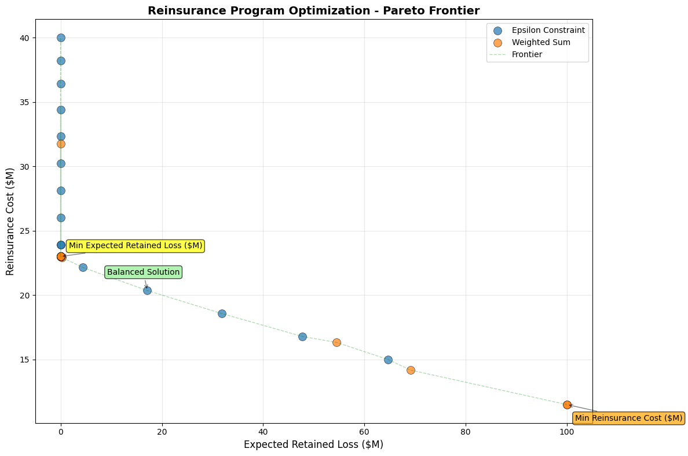
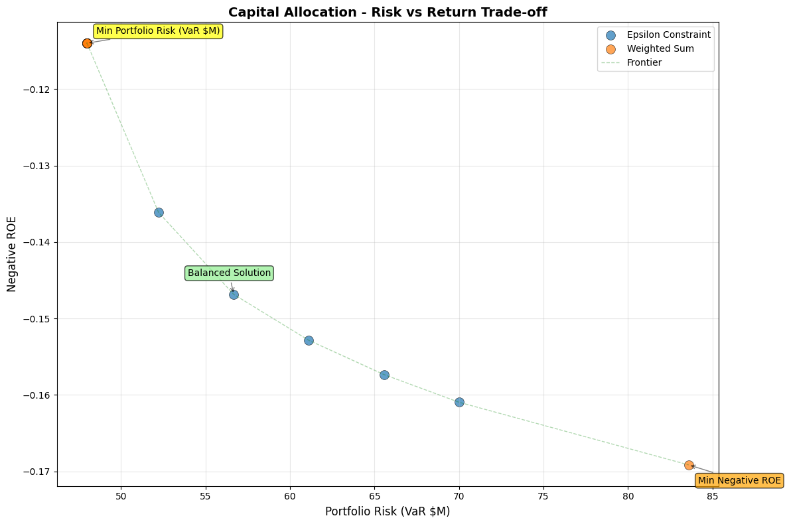
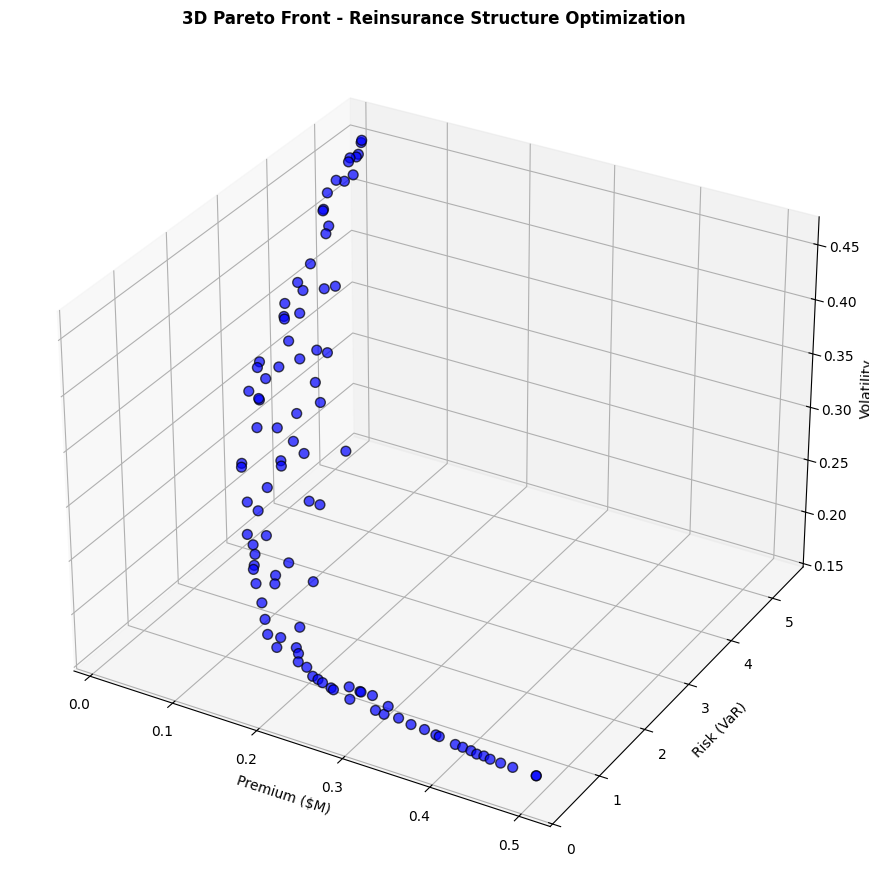
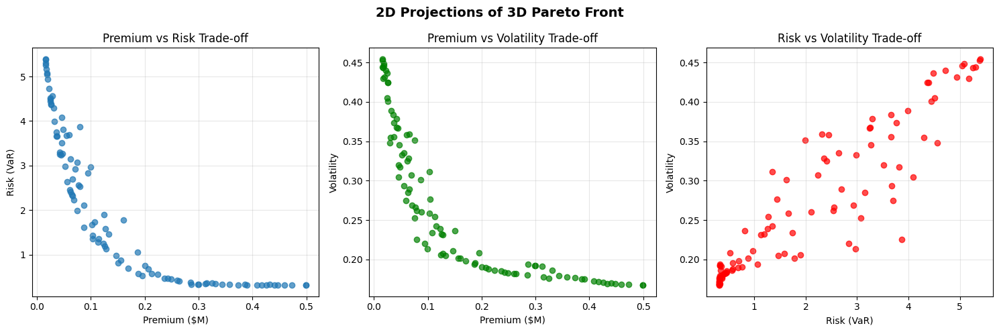

# Optimization Theory for Insurance

<div style="flex: 1; padding: 15px; border: 2px solid #2196F3; border-radius: 8px; background-color: #E3F2FD;">
    <h3 style="margin-top: 0; color: #1e82d3ff !important;">⚖️ Why This Matters</h3>
    <p>Optimization theory reveals that insurance decisions are fundamentally multi-objective problems with no single optimal solution. The Pareto frontier quantifies the inevitable tradeoffs between premium costs, retained risk, and earnings volatility. The Hamilton-Jacobi-Bellman framework proves that optimal insurance coverage should dynamically adjust with wealth levels and time horizons: entities with low capital need minimal coverage (can't afford premiums), middle-wealth entities need maximum coverage (most vulnerable), while wealthy entities self-insure (can absorb losses). Stochastic control theory shows how optimal strategies must adapt to market cycles, with coverage increasing during bear markets when losses are more frequent and decreasing during bull markets when growth dominates. The constrained optimization framework incorporating KKT conditions ensures solutions respect real-world constraints like budget limits, regulatory requirements, and ruin probability thresholds. Numerical methods comparison demonstrates that gradient descent fails for non-convex insurance problems, while evolutionary algorithms like particle swarm find global optima in complex multi-modal landscapes. This section proves that static insurance programs are suboptimal, while dynamic strategies that adjust coverage based on wealth, time, and market conditions can improve long-term growth rates by several percentage points annually while maintaining the same survival probability, transforming insurance from a fixed cost to an adaptive growth enabler.</p>
</div>

## Constrained Optimization

### General Formulation

The insurance optimization problem:

$$
\begin{align} \max_{x \in \mathcal{X}} &\quad f(x) \\
\text{subject to} &\quad g_i(x) \leq 0, \quad i = 1, ..., m \\
&\quad h_j(x) = 0, \quad j = 1, ..., p \end{align}
$$

- $x$ = Decision variables (retention, limits, premiums)
- $f(x)$ = Objective (growth rate, utility, profit)
- $g_i(x)$ = Inequality constraints (budget, ruin probability)
- $h_j(x)$ = Equality constraints (regulatory requirements)

### Lagrangian Method

Form the Lagrangian:

$$
\mathcal{L}(x, \lambda, \mu) = f(x) - \sum_{i=1}^m \lambda_i g_i(x) - \sum_{j=1}^p \mu_j h_j(x)
$$

- $\lambda_i$ = "shadow price" for the inequality constraint $g_i$, which represents the marginal change in optimal objective value if we relax constraint $g_i$ slightly.
  - If $\lambda_i > 0$ for a capital constraint, it tells you how much additional profit you'd gain per dollar of additional capital.
  - If $\lambda_i > 0$  for a risk constraint, it quantifies the cost of that risk limit on your objective.
- $\mu_i$ = shadow price for equality constraint $h_j$

### Karush-Kuhn-Tucker (KKT) Conditions

Necessary conditions for optimality:

1. **Stationarity**: $\nabla_x \mathcal{L} = 0$
    - The gradient with respect to decision variables equals zero (local optimum)
    - Example: Marginal profit from increasing retention equals marginal cost

2. **Primal feasibility**: $g_i(x) \leq 0$, $h_j(x) = 0$
    - The solution satisfies all original constraints
    - Example: Capital requirements met, regulatory ratios satisfied

3. **Dual feasibility**: $\lambda_i \geq 0$
    - Lagrange multipliers for inequality constraints must be non-negative
    - Economic interpretation: Shadow prices for "≤" constraints are positive
      (relaxing a binding constraint improves the objective)
    - Example: The value of additional capital is always positive or zero

4. **Complementary slackness**: $\lambda_i g_i(x) = 0$
    - Either the constraint is binding ($g_i(x) = 0$) OR its multiplier is zero ($\lambda_i = 0$)
    - Economic interpretation: You only "pay a price" for constraints that are binding
    - Example: If you have excess capital ($g_i(x) < 0$), then $\lambda_i = 0$
      (additional capital has no marginal value)
    - If capital constraint is binding ($g_i(x) = 0$), then $\lambda_i > 0$
      (additional capital would improve profit)

### Practical Insurance Example:

Consider maximizing expected profit subject to a VaR constraint:
- If VaR constraint is NOT binding: $\lambda_{VaR} = 0$ (risk limit doesn't affect optimal solution)
- If VaR constraint IS binding: $\lambda_{VaR} > 0$ tells you the profit sacrifice per unit of risk limit

### Insurance Application

```python
import numpy as np
from scipy import stats
from scipy.optimize import minimize, NonlinearConstraint
import matplotlib.pyplot as plt

class InsuranceOptimizer:
    """Optimize insurance program with constraints."""

    def __init__(self, initial_wealth, growth_params, loss_dist):
        self.W0 = initial_wealth
        self.growth_params = growth_params
        self.loss_dist = loss_dist

    def objective(self, x):
        """Maximize expected log wealth (negative for minimization)."""
        retention, limit = x[0], x[1]

            # Simulate outcomes
        n_sims = 1000
        final_wealth = []

        for _ in range(n_sims):
            # Base growth
            growth = np.random.normal(
                self.growth_params['mu'],
                self.growth_params['sigma']
            )
            wealth = self.W0 * (1 + growth)

            # Loss and insurance
            loss = self.loss_dist.rvs()
            retained_loss = min(loss, retention)
            covered_loss = min(max(0, loss - retention), limit)

            # Premium (simplified)
            premium = 0.01 * limit + 0.02 * max(0, limit - retention)

            # Final wealth
            wealth = wealth - retained_loss - premium
            final_wealth.append(max(0, wealth))

        # Expected log utility
        positive_wealth = [w for w in final_wealth if w > 0]

        if not positive_wealth:
            return 1e10 # Penalize bankruptcy

        return -np.mean(np.log(positive_wealth))

    def ruin_constraint(self, x):
        """Probability of ruin constraint."""
        retention, limit = x[0], x[1]

        # Simulate ruin probability
        n_sims = 1000
        ruin_count = 0

        for _ in range(n_sims):
            wealth = self.W0
            for year in range(10):
                # 10-year horizon
                growth = np.random.normal(
                    self.growth_params['mu'],
                    self.growth_params['sigma']
                )
                wealth *= (1 + growth)

                loss = self.loss_dist.rvs()
                retained_loss = min(loss, retention)
                premium = 0.01 * limit + 0.02 * max(0, limit - retention)

                wealth = wealth - retained_loss - premium

                if wealth <= 0:
                    ruin_count += 1
                    break

        return ruin_count / n_sims  # Should be <= threshold

    def optimize(self, ruin_threshold=0.01, budget=None):
        """Find optimal insurance program."""

        # Initial guess
        x0 = [self.W0 * 0.05, self.W0 * 0.20]  # 5% retention, 20% limit

        # Bounds
        bounds = [
            (0, self.W0 * 0.10),  # Retention: 0 to 10% of wealth
            (0, self.W0 * 0.50)  # Limit: 0 to 50% of wealth
        ]

        # Constraints
        constraints = []

        # Ruin probability constraint
        constraints.append(NonlinearConstraint(
            self.ruin_constraint,
            lb=0,
            ub=ruin_threshold
        ))

        # Budget constraint if specified
        if budget:
            def premium_constraint(x):
                return 0.01 * x[1] + 0.02 * max(0, x[1] - x[0])

            constraints.append(NonlinearConstraint(
                premium_constraint,
                lb=0,
                ub=budget
            ))

        # Optimize
        result = minimize(
            self.objective,
            x0,
            method='SLSQP',
            bounds=bounds,
            constraints=constraints,
            options={'maxiter': 100}
        )

        return result

# Example optimization
optimizer = InsuranceOptimizer(
    initial_wealth=10_000_000,
    growth_params={'mu': 0.08, 'sigma': 0.15},
    loss_dist=stats.lognorm(s=2, scale=100_000)
)

result = optimizer.optimize(ruin_threshold=0.01)

print(f"Optimal retention: ${result.x[0]:,.0f}")
print(f"Optimal limit: ${result.x[1]:,.0f}")
print(f"Expected growth: {-result.fun:.4f}")
```

#### Sample Output

```
Optimal retention: $500,078
Optimal limit: $1,997,977
Expected growth: 16.1570
```

## Pareto Efficiency

### Definition

A solution is **Pareto efficient** if no objective can be improved without worsening another.

### Pareto Frontier

Set of all Pareto efficient solutions:

$$
\mathcal{P} = \{x^* \in \mathcal{X} : x^* \text{ is not dominated by any other } x \in \mathcal{X}\}
$$

Where "$x$ dominatex $x^*$" means:

- $f_i(x) \geq f_i(x^*)$ for all objectives $i$, AND
- $f_j(x) > f_j(x^*)$ for at least one objective $j$

### Scalarization Methods

Scalarization methods transform multi-objective optimization problems into single-objective problems, making them solvable using standard optimization techniques. These methods are particularly useful in actuarial applications where competing objectives (e.g., minimizing risk while maximizing return, or balancing premium adequacy against market competitiveness) must be reconciled.

#### Weighted Sum

The weighted sum method combines multiple objectives into a single scalar objective through a linear combination:

$$
\min_{x} \sum_{i=1}^k w_i f_i(x)
$$

where $\sum w_i = 1$, $w_i \geq 0$.

The solution obtained corresponds to a point on the Pareto frontier.

##### Key Considerations:

- **Weights** ($w_i$): Represent the relative importance of each objective. In P&C applications, these might reflect regulatory priorities, strategic goals, or risk appetite.
- **Normalization**: Objectives should typically be normalized to comparable scales before applying weights, especially when objectives have different units (e.g., dollars vs. percentages).
  - For objectives with different scales, one normalization approach is to use the following formula:

$$
\bar{f}_i(x) = \frac{f_i(x) - f_i^{\text{min}}}{f_i^{\text{max}} - f_i^{\text{min}}}
$$

##### Advantages:

- Computationally efficient and straightforward to implement
- Intuitive interpretation of weights as trade-off ratios
- Can leverage existing single-objective optimization solvers

##### Limitations:

- Cannot find solutions in non-convex regions of the Pareto frontier
- Requires careful weight selection; small changes can lead to significantly different solutions
- May miss important trade-off solutions if the Pareto frontier has non-convex regions

#### Epsilon-Constraint

The epsilon-constraint method optimizes one primary objective while constraining all others:

$$
\begin{align} \min_{x} &\quad f_1(x) \\ \text{s.t.} &\quad f_i(x) \leq \epsilon_i, \quad i = 2, ..., k \end{align}
$$

##### Key Concepts:

- **Primary Objective**: The objective function $f_1(x)$ selected for optimization
- **Constraint Bounds** ($\epsilon_i$): Upper limits for secondary objectives, effectively defining acceptable trade-off levels

##### Implementation Considerations:

- The choice of primary objective should reflect the most critical business priority
- Systematic variation of $\epsilon$ values generates multiple Pareto-optimal solutions
- Constraint bounds must be feasible; infeasible bounds result in empty solution sets

##### Advantages:

- Can identify all Pareto-optimal solutions, including those in non-convex regions
- Provides clear interpretation: "minimize $f_1$​ given that $f_2$​ cannot exceed $\epsilon_2$​"
- More flexible than weighted sum for complex Pareto frontiers
- Natural fit for problems with hard constraints on certain objectives

##### Limitations:

- Requires solving multiple optimization problems to characterize the Pareto frontier
- Selection of appropriate $\epsilon$ values can be challenging without prior knowledge
  - Less intuitive than weights-as-tradeoffs decision in the weighted sum approach
- Computational cost increases with the number of constraint variations explored
- May require sophisticated constraint-handling techniques for complex problems

### Insurance Trade-offs: Pareto Frontier Optimization for P&C Insurance Decisions

Implementation of weighted sum and epsilon-constraint methods for multi-objective optimization in actuarial applications.

```python
import numpy as np
import matplotlib.pyplot as plt
from scipy.optimize import minimize, NonlinearConstraint
from typing import List, Dict, Callable, Tuple
import warnings
warnings.filterwarnings('ignore')


class ParetoFrontier:
    """
    Compute Pareto frontier for insurance portfolio optimization.

    Typical P&C applications include:
    - Reinsurance structure optimization (retention vs cost)
    - Capital allocation (risk vs return)
    - Reserve adequacy (surplus vs competitiveness)
    """

    def __init__(self, objectives: List[Callable], constraints: List = None):
        """
        Initialize Pareto frontier solver.

        Args:
            objectives: List of objective functions to minimize
            constraints: Optional list of optimization constraints
        """
        self.objectives = objectives
        self.constraints = constraints if constraints else []

    def weighted_sum_method(self, weights_grid: List[Tuple]) -> List[Dict]:
        """
        Generate Pareto frontier using weighted sum scalarization.

        This method is computationally efficient and intuitive for stakeholders
        who can express preferences as relative weights.

        Args:
            weights_grid: List of weight tuples, each summing to 1

        Returns:
            List of Pareto-optimal solutions with objectives and weights
        """
        frontier = []

        for i, weights in enumerate(weights_grid):
            # Verify weights sum to 1
            assert abs(sum(weights) - 1.0) < 1e-6, f"Weights must sum to 1, got {sum(weights)}"

            # Combined objective function
            def combined_objective(x):
                return sum(w * obj(x) for w, obj in zip(weights, self.objectives))

            # Use varied starting points for better exploration
            # This helps avoid local minima in non-convex problems
            x0_retention = 0.1 + 0.8 * (i / len(weights_grid))
            x0_coverage = 0.9 - 0.7 * (i / len(weights_grid))

            # Optimize using Sequential Least Squares Programming
            result = minimize(
                combined_objective,
                x0=[x0_retention, x0_coverage],
                bounds=[(0, 1), (0, 2)],  # Extended bounds for coverage flexibility
                constraints=self.constraints,
                method='SLSQP',
                options={'disp': False, 'maxiter': 200}
            )

            if result.success:
                # Evaluate all objectives at solution point
                obj_values = [obj(result.x) for obj in self.objectives]
                frontier.append({
                    'x': result.x,
                    'objectives': obj_values,
                    'weights': weights,
                    'method': 'weighted_sum'
                })

        return frontier

    def epsilon_constraint_method(self, epsilon_grid: List[List[float]]) -> List[Dict]:
        """
        Generate Pareto frontier using epsilon-constraint method.

        This method can find solutions in non-convex regions and is ideal
        when some objectives have natural constraint thresholds (e.g.,
        regulatory minimums, risk limits).

        Args:
            epsilon_grid: List of epsilon values for constraining secondary objectives

        Returns:
            List of Pareto-optimal solutions with objectives and epsilon values
        """
        frontier = []

        for eps_values in epsilon_grid:
            # Primary objective: minimize first objective
            def primary_objective(x):
                return self.objectives[0](x)

            # Create constraints for other objectives
            additional_constraints = []
            for i, obj in enumerate(self.objectives[1:], 1):
                # Each secondary objective must be <= its epsilon value
                additional_constraints.append(
                    NonlinearConstraint(
                        obj,
                        lb=-np.inf,
                        ub=eps_values[i-1],
                        keep_feasible=False
                    )
                )

            # Combine original and epsilon constraints
            all_constraints = self.constraints + additional_constraints

            # Optimize with multiple starting points for robustness
            for start_point in [[0.3, 0.7], [0.5, 0.5], [0.7, 0.3]]:
                result = minimize(
                    primary_objective,
                    x0=start_point,
                    bounds=[(0, 1), (0, 2)],
                    constraints=all_constraints,
                    method='SLSQP',
                    options={'disp': False, 'maxiter': 200}
                )

                if result.success:
                    obj_values = [obj(result.x) for obj in self.objectives]
                    frontier.append({
                        'x': result.x,
                        'objectives': obj_values,
                        'epsilon': eps_values,
                        'method': 'epsilon_constraint'
                    })
                    break  # Use first successful result

        return frontier

    def plot_frontier(self, frontier: List[Dict], obj_names: List[str] = None,
                     title: str = 'Pareto Frontier - Insurance Optimization'):
        """
        Visualize Pareto frontier with actuarial annotations.

        Args:
            frontier: List of Pareto-optimal solutions
            obj_names: Names for objectives (default: ['Obj 1', 'Obj 2'])
            title: Plot title
        """
        if not frontier:
            print("No valid solutions found in frontier")
            return

        objectives = np.array([f['objectives'] for f in frontier])

        if obj_names is None:
            obj_names = [f'Objective {i+1}' for i in range(objectives.shape[1])]

        if objectives.shape[1] == 2:
            # 2D Pareto frontier plot
            plt.figure(figsize=(12, 8))

            # Color by method if available
            methods = [f.get('method', 'unknown') for f in frontier]
            method_colors = {'weighted_sum': 'blue', 'epsilon_constraint': 'red', 'unknown': 'gray'}
            colors = [method_colors.get(m, 'gray') for m in methods]

            # Main scatter plot
            for method in set(methods):
                mask = [m == method for m in methods]
                method_objectives = objectives[mask]
                if len(method_objectives) > 0:
                    plt.scatter(method_objectives[:, 0], method_objectives[:, 1],
                              s=100, alpha=0.7, edgecolors='black', linewidth=0.5,
                              label=method.replace('_', ' ').title())

            # Connect points to show frontier
            sorted_idx = np.argsort(objectives[:, 0])
            plt.plot(objectives[sorted_idx, 0], objectives[sorted_idx, 1],
                    'g--', alpha=0.3, linewidth=1, label='Frontier')

            # Labels and formatting
            plt.xlabel(obj_names[0], fontsize=12)
            plt.ylabel(obj_names[1], fontsize=12)
            plt.title(title, fontsize=14, fontweight='bold')
            plt.grid(True, alpha=0.3)
            plt.legend(loc='best')

            # Annotate key solutions
            self._annotate_key_points(objectives, obj_names)

            plt.tight_layout()
            plt.show()

        elif objectives.shape[1] == 3:
            # 3D Pareto frontier plot
            fig = plt.figure(figsize=(12, 9))
            ax = fig.add_subplot(111, projection='3d')

            scatter = ax.scatter(objectives[:, 0], objectives[:, 1], objectives[:, 2],
                               c=range(len(objectives)), cmap='viridis', s=50, alpha=0.7)

            ax.set_xlabel(obj_names[0], fontsize=10)
            ax.set_ylabel(obj_names[1], fontsize=10)
            ax.set_zlabel(obj_names[2], fontsize=10)
            ax.set_title(title, fontsize=12, fontweight='bold')

            plt.colorbar(scatter, label='Solution Index')
            plt.tight_layout()
            plt.show()

    def _annotate_key_points(self, objectives: np.ndarray, obj_names: List[str]):
        """Add annotations for key solutions on the Pareto frontier."""
        # Extreme points
        min_obj1_idx = np.argmin(objectives[:, 0])
        min_obj2_idx = np.argmin(objectives[:, 1])

        plt.annotate(f'Min {obj_names[0]}',
                    (objectives[min_obj1_idx, 0], objectives[min_obj1_idx, 1]),
                    xytext=(10, 10), textcoords='offset points',
                    bbox=dict(boxstyle='round,pad=0.3', facecolor='yellow', alpha=0.7),
                    arrowprops=dict(arrowstyle='->', color='black', alpha=0.5))

        plt.annotate(f'Min {obj_names[1]}',
                    (objectives[min_obj2_idx, 0], objectives[min_obj2_idx, 1]),
                    xytext=(10, -20), textcoords='offset points',
                    bbox=dict(boxstyle='round,pad=0.3', facecolor='orange', alpha=0.7),
                    arrowprops=dict(arrowstyle='->', color='black', alpha=0.5))

        # Balanced solution (closest to utopia point)
        obj_norm = (objectives - objectives.min(axis=0)) / (objectives.max(axis=0) - objectives.min(axis=0) + 1e-10)
        distances = np.sqrt(np.sum(obj_norm**2, axis=1))
        balanced_idx = np.argmin(distances)

        plt.annotate('Balanced Solution',
                    (objectives[balanced_idx, 0], objectives[balanced_idx, 1]),
                    xytext=(-50, 20), textcoords='offset points',
                    bbox=dict(boxstyle='round,pad=0.3', facecolor='lightgreen', alpha=0.7),
                    arrowprops=dict(arrowstyle='->', color='black', alpha=0.5))


# ==============================================================================
# P&C ACTUARIAL EXAMPLE 1: REINSURANCE OPTIMIZATION
# ==============================================================================

def reinsurance_example():
    """
    Example: Optimize reinsurance program balancing retention and cost.

    This is a common P&C actuarial problem where we need to find the optimal
    retention level and coverage limit that balances:
    1. Expected retained losses (minimize)
    2. Reinsurance premium costs (minimize)
    """
    print("=" * 70)
    print("EXAMPLE 1: REINSURANCE OPTIMIZATION")
    print("=" * 70)

    def expected_retained_loss(x):
        """
        Expected retained losses as function of retention and limit.

        Args:
            x: [retention_ratio, coverage_limit_ratio]
        """
        retention, coverage = x
        # Simplified loss model with severity and frequency components
        base_loss = 100  # Million USD
        retention_factor = retention**1.2  # Non-linear retention impact
        coverage_benefit = 1 - 0.7 * (1 - np.exp(-2 * coverage))
        return base_loss * retention_factor * coverage_benefit

    def reinsurance_cost(x):
        """
        Reinsurance premium based on retention and coverage.

        Higher coverage and lower retention = higher premium
        """
        retention, coverage = x
        base_premium = 20  # Million USD
        # Premium increases with coverage and decreases with retention
        premium_factor = (1 - retention * 0.5) * (1 + coverage * 0.8)
        loading_factor = 1.15  # Typical reinsurer loading
        return base_premium * premium_factor * loading_factor

    # Set up optimization
    objectives = [expected_retained_loss, reinsurance_cost]

    # Constraint: Total program cost must be reasonable
    constraints = [
        NonlinearConstraint(
            lambda x: expected_retained_loss(x) + reinsurance_cost(x),
            lb=0, ub=150  # Total cost cap at 150M
        )
    ]

    pareto = ParetoFrontier(objectives, constraints)

    # Method 1: Weighted Sum
    print("\n1. WEIGHTED SUM METHOD")
    print("-" * 30)

    # Generate weight combinations emphasizing different priorities
    weights_grid = []
    for i in range(20):
        w1 = i / 19  # From 0 to 1
        w2 = 1 - w1
        weights_grid.append((w1, w2))

    frontier_ws = pareto.weighted_sum_method(weights_grid)

    # Display sample solutions
    print(f"Found {len(frontier_ws)} Pareto-optimal solutions")
    print("\nSample solutions (different risk appetites):")

    # Conservative (minimize retained loss)
    conservative = min(frontier_ws, key=lambda x: x['objectives'][0])
    print(f"\nConservative (80% loss, 20% cost weight):")
    print(f"  Retention: {conservative['x'][0]:.2%}")
    print(f"  Coverage: {conservative['x'][1]:.2f}x")
    print(f"  Expected Loss: ${conservative['objectives'][0]:.1f}M")
    print(f"  Reinsurance Cost: ${conservative['objectives'][1]:.1f}M")

    # Aggressive (minimize cost)
    aggressive = min(frontier_ws, key=lambda x: x['objectives'][1])
    print(f"\nAggressive (20% loss, 80% cost weight):")
    print(f"  Retention: {aggressive['x'][0]:.2%}")
    print(f"  Coverage: {aggressive['x'][1]:.2f}x")
    print(f"  Expected Loss: ${aggressive['objectives'][0]:.1f}M")
    print(f"  Reinsurance Cost: ${aggressive['objectives'][1]:.1f}M")

    # Method 2: Epsilon-Constraint
    print("\n2. EPSILON-CONSTRAINT METHOD")
    print("-" * 30)

    # Set epsilon values for reinsurance cost constraint
    epsilon_grid = []
    for cost_limit in np.linspace(15, 40, 15):  # Cost limits from 15M to 40M
        epsilon_grid.append([cost_limit])

    frontier_ec = pareto.epsilon_constraint_method(epsilon_grid)

    print(f"Found {len(frontier_ec)} Pareto-optimal solutions")
    print("\nSolutions at different cost constraints:")

    for i in [0, len(frontier_ec)//2, -1]:
        if i < len(frontier_ec):
            sol = frontier_ec[i]
            print(f"\nCost limit: ${sol['epsilon'][0]:.1f}M")
            print(f"  Retention: {sol['x'][0]:.2%}")
            print(f"  Coverage: {sol['x'][1]:.2f}x")
            print(f"  Expected Loss: ${sol['objectives'][0]:.1f}M")
            print(f"  Actual Cost: ${sol['objectives'][1]:.1f}M")

    # Combine and plot
    all_solutions = frontier_ws + frontier_ec
    pareto.plot_frontier(
        all_solutions,
        obj_names=['Expected Retained Loss ($M)', 'Reinsurance Cost ($M)'],
        title='Reinsurance Program Optimization - Pareto Frontier'
    )

    return pareto, all_solutions


# ==============================================================================
# P&C ACTUARIAL EXAMPLE 2: CAPITAL ALLOCATION
# ==============================================================================

def capital_allocation_example():
    """
    Example: Optimize capital allocation across business lines.

    Balance between:
    1. Portfolio risk (VaR or TVaR)
    2. Expected return (ROE)
    3. Diversification benefit
    """
    print("\n" + "=" * 70)
    print("EXAMPLE 2: CAPITAL ALLOCATION ACROSS LINES")
    print("=" * 70)

    def portfolio_risk(x):
        """
        Portfolio Value-at-Risk (simplified model).

        Args:
            x: [allocation_personal_lines, allocation_commercial]
        """
        personal, commercial = x
        # Standalone risks
        risk_personal = 50 * personal**0.8
        risk_commercial = 80 * commercial**0.9
        # Correlation benefit
        correlation = 0.3
        diversified_risk = np.sqrt(
            risk_personal**2 + risk_commercial**2 +
            2 * correlation * risk_personal * risk_commercial
        )
        return diversified_risk

    def negative_roe(x):
        """
        Negative expected ROE (for minimization).
        """
        personal, commercial = x
        # Expected returns differ by line
        roe_personal = 0.12 * personal
        roe_commercial = 0.18 * commercial * (1 - 0.1 * commercial)  # Diminishing returns
        combined_roe = roe_personal + roe_commercial
        return -combined_roe  # Negative for minimization

    def concentration_penalty(x):
        """
        Penalty for concentration risk (regulatory concern).
        """
        personal, commercial = x
        # Herfindahl index for concentration
        total = personal + commercial
        if total == 0:
            return 0
        hhi = (personal/total)**2 + (commercial/total)**2
        return hhi * 100  # Scale for visibility

    # Three-objective optimization
    objectives = [portfolio_risk, negative_roe, concentration_penalty]

    # Constraints: allocations must sum to 1
    constraints = [
        NonlinearConstraint(
            lambda x: x[0] + x[1],
            lb=0.95, ub=1.05  # Allow small deviation for numerical stability
        )
    ]

    pareto = ParetoFrontier(objectives[:2], constraints)  # Use first 2 objectives for 2D viz

    print("\n1. WEIGHTED SUM METHOD (Risk vs Return)")
    print("-" * 30)

    # Generate weights for different risk preferences
    weights_grid = []
    for risk_aversion in np.linspace(0, 1, 15):
        w_risk = risk_aversion
        w_return = 1 - risk_aversion
        weights_grid.append((w_risk, w_return))

    frontier_ws = pareto.weighted_sum_method(weights_grid)

    print(f"Found {len(frontier_ws)} Pareto-optimal allocations")

    # Analyze key allocations
    if frontier_ws:
        # Risk-averse allocation
        risk_averse = min(frontier_ws, key=lambda x: x['objectives'][0])
        print(f"\nRisk-Averse Allocation:")
        print(f"  Personal Lines: {risk_averse['x'][0]:.1%}")
        print(f"  Commercial Lines: {risk_averse['x'][1]:.1%}")
        print(f"  Portfolio VaR: ${risk_averse['objectives'][0]:.1f}M")
        print(f"  Expected ROE: {-risk_averse['objectives'][1]:.1%}")

        # Return-seeking allocation
        return_seeking = min(frontier_ws, key=lambda x: x['objectives'][1])
        print(f"\nReturn-Seeking Allocation:")
        print(f"  Personal Lines: {return_seeking['x'][0]:.1%}")
        print(f"  Commercial Lines: {return_seeking['x'][1]:.1%}")
        print(f"  Portfolio VaR: ${return_seeking['objectives'][0]:.1f}M")
        print(f"  Expected ROE: {-return_seeking['objectives'][1]:.1%}")

    print("\n2. EPSILON-CONSTRAINT METHOD (Constrain Risk)")
    print("-" * 30)

    # Set risk limits
    epsilon_grid = []
    for risk_limit in np.linspace(30, 70, 10):
        epsilon_grid.append([risk_limit])  # Constraint on negative ROE not needed here

    # For epsilon-constraint, we minimize return subject to risk constraint
    # So swap objectives
    pareto_ec = ParetoFrontier([negative_roe, portfolio_risk], constraints)
    frontier_ec = pareto_ec.epsilon_constraint_method(epsilon_grid)

    print(f"Found {len(frontier_ec)} Pareto-optimal allocations")

    if frontier_ec:
        # Sample allocation at moderate risk limit
        mid_solution = frontier_ec[len(frontier_ec)//2] if frontier_ec else None
        if mid_solution:
            print(f"\nModerate Risk Limit (VaR ≤ ${mid_solution['epsilon'][0]:.1f}M):")
            print(f"  Personal Lines: {mid_solution['x'][0]:.1%}")
            print(f"  Commercial Lines: {mid_solution['x'][1]:.1%}")
            print(f"  Achieved ROE: {-mid_solution['objectives'][0]:.1%}")
            print(f"  Actual VaR: ${mid_solution['objectives'][1]:.1f}M")

    # Plot frontier (swap objectives back for consistent view)
    if frontier_ec:
        for sol in frontier_ec:
            sol['objectives'] = [sol['objectives'][1], sol['objectives'][0]]

    all_solutions = frontier_ws + frontier_ec
    if all_solutions:
        pareto.plot_frontier(
            all_solutions,
            obj_names=['Portfolio Risk (VaR $M)', 'Negative ROE'],
            title='Capital Allocation - Risk vs Return Trade-off'
        )

    return pareto, all_solutions


# ==============================================================================
# MAIN EXECUTION
# ==============================================================================

if __name__ == "__main__":
    # Run reinsurance optimization example
    pareto_reins, solutions_reins = reinsurance_example()

    # Run capital allocation example
    pareto_capital, solutions_capital = capital_allocation_example()

    # Summary statistics
    print("\n" + "=" * 70)
    print("OPTIMIZATION SUMMARY")
    print("=" * 70)

    print(f"\nReinsurance Optimization:")
    print(f"  Total solutions found: {len(solutions_reins)}")
    if solutions_reins:
        obj_values = np.array([s['objectives'] for s in solutions_reins])
        print(f"  Loss range: ${obj_values[:, 0].min():.1f}M - ${obj_values[:, 0].max():.1f}M")
        print(f"  Cost range: ${obj_values[:, 1].min():.1f}M - ${obj_values[:, 1].max():.1f}M")

    print(f"\nCapital Allocation:")
    print(f"  Total solutions found: {len(solutions_capital)}")
    if solutions_capital:
        obj_values = np.array([s['objectives'] for s in solutions_capital])
        print(f"  Risk range: ${obj_values[:, 0].min():.1f}M - ${obj_values[:, 0].max():.1f}M")
        print(f"  ROE range: {-obj_values[:, 1].max():.1%} - {-obj_values[:, 1].min():.1%}")

    print("\nKey Insights:")
    print("• Weighted Sum: Efficient for convex frontiers, intuitive weights")
    print("• Epsilon-Constraint: Handles non-convex regions, natural for risk limits")
    print("• Both methods provide complementary views of the trade-off space")
    print("• Actuarial judgment needed to select final solution from frontier")
```

#### Sample Output

```
======================================================================
EXAMPLE 1: REINSURANCE OPTIMIZATION
======================================================================

1. WEIGHTED SUM METHOD
------------------------------
Found 20 Pareto-optimal solutions

Sample solutions (different risk appetites):

Conservative (80% loss, 20% cost weight):
  Retention: 0.00%
  Coverage: 0.00x
  Expected Loss: $0.0M
  Reinsurance Cost: $23.0M

Aggressive (20% loss, 80% cost weight):
  Retention: 100.00%
  Coverage: 0.00x
  Expected Loss: $100.0M
  Reinsurance Cost: $11.5M

2. EPSILON-CONSTRAINT METHOD
------------------------------
Found 15 Pareto-optimal solutions

Solutions at different cost constraints:

Cost limit: $15.0M
  Retention: 69.57%
  Coverage: 0.00x
  Expected Loss: $64.7M
  Actual Cost: $15.0M

Cost limit: $27.5M
  Retention: 0.00%
  Coverage: 0.16x
  Expected Loss: $0.0M
  Actual Cost: $26.0M

Cost limit: $40.0M
  Retention: 0.00%
  Coverage: 0.92x
  Expected Loss: $0.0M
  Actual Cost: $40.0M
```



```
======================================================================
EXAMPLE 2: CAPITAL ALLOCATION ACROSS LINES
======================================================================

1. WEIGHTED SUM METHOD (Risk vs Return)
------------------------------
Found 15 Pareto-optimal allocations

Risk-Averse Allocation:
  Personal Lines: 95.0%
  Commercial Lines: 0.0%
  Portfolio VaR: $48.0M
  Expected ROE: 11.4%

Return-Seeking Allocation:
  Personal Lines: 0.0%
  Commercial Lines: 105.0%
  Portfolio VaR: $83.6M
  Expected ROE: 16.9%

2. EPSILON-CONSTRAINT METHOD (Constrain Risk)
------------------------------
Found 5 Pareto-optimal allocations

Moderate Risk Limit (VaR ≤ $61.1M):
  Personal Lines: 51.7%
  Commercial Lines: 53.3%
  Achieved ROE: 15.3%
  Actual VaR: $61.1M
```



## Multi-Objective Optimization

Multi-objective optimization (MOO) addresses the reality that actuarial decisions rarely involve a single goal. In P&C insurance, we simultaneously optimize competing objectives like minimizing risk while maximizing profit, or balancing policyholder protection with shareholder returns. Unlike single-objective problems with unique optimal solutions, MOO produces a set of trade-off solutions where improving one objective necessarily worsens another.

### Problem Formulation

The general multi-objective optimization problem is expressed as:

$$
\min_{x \in \mathcal{X}} F(x) = [f_1(x), f_2(x), ..., f_k(x)]^T
$$

#### Components:

- **Decision Variables** $(x)$: Vector of controllable parameters $x = [x_1, x_2, ..., x_n]^T$
- **Decision Space** $(\mathcal{X})$: Feasible region defined by the following constraints:

$$
\mathcal{X} = \{x \in \mathbb{R}^n : g_i(x) \leq 0, h_j(x) = 0\}
$$

- **Objective Functions** ($f_i$): $k$ functions to be simultaneously minimized
- **Objective Space** ($\mathcal{Y}$): The $k$-dimensional space of objective values

#### Constraint Types:

- **Inequality Constraint**s: $g_i(x) \leq 0$ for $i = 1, ..., m$
- **Equality Constraints**: $h_j(x) = 0$ for $j = 1, ..., p$
- **Box Constraints**: $x_i^L \leq x_i \leq x_i^U$ defining variable bounds

### Dominance Relations

Dominance relations establish a partial ordering among solutions in multi-objective space, forming the mathematical foundation for identifying optimal trade-offs.

Solution $x$ **dominates** $y$ if: - $f_i(x) \leq f_i(y)$ for all $i$ - $f_j(x) < f_j(y)$ for at least one $j$

#### Pareto Dominance

Solution $x$ **Pareto dominates** solution $y$ (denoted $x \prec y$) if and only if:

- $f_i​(x) \leq f_i​(y)$ for all $i \in \{1, 2, ... , k\}$ (no worse in any objective)
- $f_j(x) < f_j(y)$ for at least one $j \in \{1, 2, ..., k\}$ (strictly better in at least one)

#### Weak Dominance

Solution $x$ **weakly dominates** $y$ ($x \preceq y$) if:

- $f_i(x) \leq f_i(y)$ for all $i \in \{1, 2, ..., k\}$

This relaxes the strict improvement requirement, useful for handling solutions with identical objective values.

#### Strict Dominance

Solution $x$ **strictly dominates** $y$ (denoted $x \prec\prec y$) if:

- $f_i(x) < f_i(y)$ for all $i \in \{1, 2, ..., k\}$

Rare in practice but represents unambiguous superiority across all objectives.

#### Pareto Optimality

**Pareto Optimal Solution**: A solution $x^* \in \mathcal{X}$ is Pareto optimal if no other solution dominates it:

$$
\nexists x \in \mathcal{X} : x \prec x^*
$$

**Pareto Optimal Set**: $\mathcal{P} = \{x \in \mathcal{X} : x \text{ is Pareto optimal}\}$
**Pareto Front**: The image of the Pareto optimal set in objective space:

$$
\mathcal{PF} = \{F(x) : x \in \mathcal{P}\}
$$

- where $F(x)$ is the vector function of all $k$ objective values:

$$
F(x) = \begin{bmatrix} f_1(x) \\
                        f_2(x) \\
                        \vdots \\
                        f_k(x) \end{bmatrix}
$$

(so the **Pareto Optimal Set** are the input solutions, while the **Pareto Front** are the resulting objectives)

**Local vs Global Pareto Optimality**:

- **Locally Pareto Optimal**: No dominating solution in a neighborhood $\mathcal{N}(x^*, \epsilon)$ of some size $\epsilon$ around the solution $x^*$
- **Globally Pareto Optimal**: No dominating solution in entire feasible space $\mathcal{X}$

**P&C Example - Reinsurance Treaties:** Consider three reinsurance structures:

| Treaty | Retention | Premium | $E[\text{Loss}]$ |
|:------:|:---------:|:-------:|:----------------:|
| $A$ | $\$100K$ | $\$5M$ | $\$20M$ |
| $B$ | $\$200K$ | $\$3M$ | $\$25M$ |
| $C$ | $\$150K$ | $\$4M$ | $\$22M$ |

Analysis:

Treaty $A$ strictly dominates Treaty $C$ (lower retention, lower premium, lower expected loss)
Treaties $A$ and $B$ are non-dominated (trade-off between premium and expected loss risk)
Pareto set: $\{A, B\}$

### Evolutionary Algorithms

Evolutionary algorithms (EAs) are population-based metaheuristics (high-level, problem-independent algorithmic frameworks) particularly suited for multi-objective optimization. They maintain a population of solutions that evolves toward the Pareto front through selection, crossover, and mutation operations inspired by natural evolution.

#### NSGA-II (Non-dominated Sorting Genetic Algorithm II)

The most widely-used multi-objective EA, NSGA-II employs fast non-dominated sorting and crowding distance to maintain diversity.

##### Algorithm Structure:

1. Initialize population $P_0$ of size $N$
2. For generation $t = 0$ to $\text{max\_generations}$:

   a. Create offspring population $Q_t$ using:

      - Tournament selection
      - Crossover (probability $p_c$)
      - Mutation (probability $p_m$)

    b. Combine: $R_t = P_t \bigcup Q_t$
    c. Non-dominated sorting of $R_t$ into fronts $F_1, F_2, ...$
    d. Select next population $P_{t+1}$:

      - Add complete fronts until $|P_{t+1}| + |F_i| > N$
      - Sort last front $F_i$ by crowding distance
      - Fill remaining slots from sorted $F_i$

#### Other EAs worth mentioning include:

##### MOEA/D (Multi-Objective Evolutionary Algorithm based on Decomposition)

MOEA/D decomposes the multi-objective problem into scalar subproblems solved simultaneously.

##### SPEA2 (Strength Pareto Evolutionary Algorithm 2)

Uses fine-grained fitness assignment based on dominance strength and density.

##### Indicator-Based Algorithms (SMS-EMOA, IBEA)

Optimize quality indicators directly rather than using dominance relations. Maximizes **hypervolume**.

- **Hypervolume** is the multi-dimensional "area" or "volume" between your Pareto front and a reference point (typically worst-case scenario), measuring how much of the objective space your solutions dominate.
  - Think of it as the total coverage of favorable outcomes across all your competing objectives.
  - A larger hypervolume means your solution set offers better trade-offs overall, similar to how a higher Sharpe ratio indicates better risk-adjusted returns, except hypervolume works for any number of objectives simultaneously.

#### Considerations

**Use NSGA-II when:**

- Problem has 2-3 objectives
- Robust general-purpose solution needed
- No specific preference information available
- Example: Balancing loss ratio vs expense ratio vs growth

**Use MOEA/D when:**

- Many objectives (>3) present
- Preference information available (can set weights)
- Computational efficiency critical
- Example: Optimizing across multiple risk measures (VaR, TVaR, Standard Deviation, Maximum Loss)

**Use SPEA2 when:**

- Need fine-grained fitness discrimination
- Solution quality more important than speed
- External archive of best solutions desired
- Example: Long-term strategic planning with solution history requirements

**Use SMS-EMOA/IBEA when:**

- Single quality metric suffices for decision-making
- Hypervolume represents a meaningful business metric
- Need theoretical convergence guarantees
- Example: Solvency capital optimization where hypervolume represents coverage of risk scenarios

```python
"""
NSGA-II (Non-dominated Sorting Genetic Algorithm II) Implementation
for Multi-Objective Optimization in P&C Insurance Applications
==================================================================
"""

import numpy as np
import matplotlib.pyplot as plt
from mpl_toolkits.mplot3d import Axes3D
from typing import List, Callable, Tuple, Optional
import warnings
warnings.filterwarnings('ignore')


class NSGA2:
    """
    Non-dominated Sorting Genetic Algorithm II for multi-objective optimization.

    Particularly suited for P&C actuarial problems with competing objectives like:
    - Risk vs Return trade-offs
    - Premium adequacy vs Market competitiveness
    - Retention vs Reinsurance cost optimization
    """

    def __init__(self,
                objectives: List[Callable],
                bounds: np.ndarray,
                pop_size: int = 50,
                crossover_prob: float = 0.9,
                mutation_prob: float = None,
                eta_crossover: float = 20,
                eta_mutation: float = 20):
        """
        Initialize NSGA-II optimizer.

        Args:
            objectives: List of objective functions to minimize
            bounds: Array of shape (n_vars, 2) with [min, max] for each variable
            pop_size: Population size (should be even)
            crossover_prob: Probability of crossover
            mutation_prob: Probability of mutation (default: 1/n_vars)
            eta_crossover: Distribution index for SBX crossover
            eta_mutation: Distribution index for polynomial mutation
        """
        self.objectives = objectives
        self.n_objectives = len(objectives)
        self.bounds = bounds
        self.n_vars = len(bounds)
        self.pop_size = pop_size if pop_size % 2 == 0 else pop_size + 1
        self.crossover_prob = crossover_prob
        self.mutation_prob = mutation_prob if mutation_prob else 1.0 / self.n_vars
        self.eta_crossover = eta_crossover
        self.eta_mutation = eta_mutation

    def dominates(self, f1: np.ndarray, f2: np.ndarray) -> bool:
        """
        Check if solution f1 dominates solution f2.

        f1 dominates f2 if:
        - f1 is no worse than f2 in all objectives
        - f1 is strictly better than f2 in at least one objective
        """
        return np.all(f1 <= f2) and np.any(f1 < f2)

    def non_dominated_sort(self, population: np.ndarray, fitnesses: np.ndarray) -> List[List[int]]:
        """
        Sort population into non-dominated fronts using fast non-dominated sorting.

        Returns:
            List of fronts, where each front is a list of population indices
        """
        n = len(population)

        # Initialize domination data structures
        domination_count = np.zeros(n, dtype=int)  # Number of solutions dominating i
        dominated_by = [[] for _ in range(n)]       # Solutions dominated by i

        # Calculate domination relationships
        for i in range(n):
            for j in range(i + 1, n):
                if self.dominates(fitnesses[i], fitnesses[j]):
                    dominated_by[i].append(j)
                    domination_count[j] += 1
                elif self.dominates(fitnesses[j], fitnesses[i]):
                    dominated_by[j].append(i)
                    domination_count[i] += 1

        # Find first front (non-dominated solutions)
        fronts = [[]]
        for i in range(n):
            if domination_count[i] == 0:
                fronts[0].append(i)

        # Find remaining fronts iteratively
        current_front = 0
        # Guard the loop with a length check to avoid index errors when no further fronts are appended
        while current_front < len(fronts) and fronts[current_front]:
            next_front = []

            # For each solution in current front
            for i in fronts[current_front]:
                # Reduce domination count for dominated solutions
                for j in dominated_by[i]:
                    domination_count[j] -= 1
                    # If domination count becomes 0, add to next front
                    if domination_count[j] == 0:
                        next_front.append(j)

            if next_front:  # Only add non-empty fronts
                fronts.append(next_front)
            current_front += 1

        # If the last front is empty, remove it
        return fronts[:-1] if (fronts and not fronts[-1]) else fronts

    def crowding_distance(self, fitnesses: np.ndarray) -> np.ndarray:
        """
        Calculate crowding distance for diversity preservation.

        Crowding distance estimates the density of solutions surrounding a particular
        solution in the objective space.
        """
        n = len(fitnesses)
        if n <= 2:
            return np.full(n, np.inf)

        m = fitnesses.shape[1]
        distances = np.zeros(n)

        for obj_idx in range(m):
            # Sort by current objective
            sorted_indices = np.argsort(fitnesses[:, obj_idx])
            sorted_fitnesses = fitnesses[sorted_indices, obj_idx]

            # Boundary points get infinite distance
            distances[sorted_indices[0]] = np.inf
            distances[sorted_indices[-1]] = np.inf

            # Calculate distance contribution from this objective
            obj_range = sorted_fitnesses[-1] - sorted_fitnesses[0]

            if obj_range > 0:
                for i in range(1, n - 1):
                    distance_contribution = (sorted_fitnesses[i + 1] - sorted_fitnesses[i - 1]) / obj_range
                    distances[sorted_indices[i]] += distance_contribution

        return distances

    def tournament_selection(self, population: np.ndarray, fitnesses: np.ndarray,
                            fronts: List[List[int]], tournament_size: int = 2) -> int:
        """
        Binary tournament selection based on dominance rank and crowding distance.
        """
        # Create rank array
        ranks = np.zeros(len(population), dtype=int)
        for rank, front in enumerate(fronts):
            for idx in front:
                ranks[idx] = rank

        # Calculate crowding distances for entire population
        all_distances = np.zeros(len(population))
        for front in fronts:
            if front:
                front_fitnesses = fitnesses[front]
                front_distances = self.crowding_distance(front_fitnesses)
                for i, idx in enumerate(front):
                    all_distances[idx] = front_distances[i]

        # Tournament
        candidates = np.random.choice(len(population), tournament_size, replace=False)

        # Select based on rank (lower is better)
        best_rank = np.min(ranks[candidates])
        best_candidates = candidates[ranks[candidates] == best_rank]

        if len(best_candidates) == 1:
            return best_candidates[0]

        # If tied on rank, select based on crowding distance (higher is better)
        return best_candidates[np.argmax(all_distances[best_candidates])]

    def sbx_crossover(self, parent1: np.ndarray, parent2: np.ndarray) -> Tuple[np.ndarray, np.ndarray]:
        """
        Simulated Binary Crossover (SBX).

        Creates two offspring that maintain the spread of parent solutions.
        """
        child1 = parent1.copy()
        child2 = parent2.copy()

        if np.random.rand() > self.crossover_prob:
            return child1, child2

        for i in range(self.n_vars):
            if np.random.rand() < 0.5:
                if abs(parent1[i] - parent2[i]) > 1e-10:
                    # Order parents
                    if parent1[i] < parent2[i]:
                        y1, y2 = parent1[i], parent2[i]
                    else:
                        y1, y2 = parent2[i], parent1[i]

                    # Calculate beta
                    yl, yu = self.bounds[i]
                    beta = 1.0 + (2.0 * (y1 - yl) / (y2 - y1 + 1e-10))
                    alpha = 2.0 - beta ** (-(self.eta_crossover + 1))

                    u = np.random.rand()
                    if u <= 1.0 / alpha:
                        beta_q = (u * alpha) ** (1.0 / (self.eta_crossover + 1))
                    else:
                        beta_q = (1.0 / (2.0 - u * alpha)) ** (1.0 / (self.eta_crossover + 1))

                    # Create offspring
                    c1 = 0.5 * ((y1 + y2) - beta_q * (y2 - y1))
                    c2 = 0.5 * ((y1 + y2) + beta_q * (y2 - y1))

                    # Ensure bounds
                    c1 = np.clip(c1, yl, yu)
                    c2 = np.clip(c2, yl, yu)

                    # Assign to children randomly
                    if np.random.rand() < 0.5:
                        child1[i], child2[i] = c1, c2
                    else:
                        child1[i], child2[i] = c2, c1

        return child1, child2

    def polynomial_mutation(self, individual: np.ndarray) -> np.ndarray:
        """
        Polynomial mutation operator.
        """
        mutated = individual.copy()

        for i in range(self.n_vars):
            if np.random.rand() < self.mutation_prob:
                y = individual[i]
                yl, yu = self.bounds[i]

                if yu - yl > 0:
                    delta1 = (y - yl) / (yu - yl)
                    delta2 = (yu - y) / (yu - yl)

                    u = np.random.rand()

                    if u <= 0.5:
                        delta_q = (2.0 * u + (1.0 - 2.0 * u) *
                                  (1.0 - delta1) ** (self.eta_mutation + 1)) ** (1.0 / (self.eta_mutation + 1)) - 1.0
                    else:
                        delta_q = 1.0 - (2.0 * (1.0 - u) + 2.0 * (u - 0.5) *
                                       (1.0 - delta2) ** (self.eta_mutation + 1)) ** (1.0 / (self.eta_mutation + 1))

                    mutated[i] = y + delta_q * (yu - yl)
                    mutated[i] = np.clip(mutated[i], yl, yu)

        return mutated

    def create_offspring(self, population: np.ndarray, fitnesses: np.ndarray,
                        fronts: List[List[int]]) -> np.ndarray:
        """
        Generate offspring population through selection, crossover, and mutation.
        """
        offspring = []

        for _ in range(self.pop_size // 2):
            # Select parents using tournament selection
            parent1_idx = self.tournament_selection(population, fitnesses, fronts)
            parent2_idx = self.tournament_selection(population, fitnesses, fronts)

            parent1 = population[parent1_idx]
            parent2 = population[parent2_idx]

            # Crossover
            child1, child2 = self.sbx_crossover(parent1, parent2)

            # Mutation
            child1 = self.polynomial_mutation(child1)
            child2 = self.polynomial_mutation(child2)

            offspring.extend([child1, child2])

        return np.array(offspring[:self.pop_size])  # Ensure correct size

    def optimize(self, n_generations: int = 100, verbose: bool = True) -> Tuple[np.ndarray, np.ndarray]:
        """
        Run NSGA-II optimization.

        Returns:
            pareto_set: Decision variables of Pareto optimal solutions
            pareto_front: Objective values of Pareto optimal solutions
        """
        # Initialize population randomly
        population = np.random.uniform(
            self.bounds[:, 0],
            self.bounds[:, 1],
            (self.pop_size, self.n_vars)
        )

        # Evolution loop
        for generation in range(n_generations):
            # Evaluate objectives for current population
            fitnesses = np.array([
                [obj(ind) for obj in self.objectives]
                for ind in population
            ])

            # Non-dominated sorting
            fronts = self.non_dominated_sort(population, fitnesses)

            # Create offspring
            offspring = self.create_offspring(population, fitnesses, fronts)

            # Evaluate offspring
            offspring_fitnesses = np.array([
                [obj(ind) for obj in self.objectives]
                for ind in offspring
            ])

            # Combine parent and offspring populations
            combined_pop = np.vstack([population, offspring])
            combined_fit = np.vstack([fitnesses, offspring_fitnesses])

            # Non-dominated sorting of combined population
            combined_fronts = self.non_dominated_sort(combined_pop, combined_fit)

            # Select next generation using elitism
            new_population = []
            new_population_indices = []

            for front in combined_fronts:
                if len(new_population) + len(front) <= self.pop_size:
                    # Add entire front
                    new_population_indices.extend(front)
                else:
                    # Use crowding distance to select from last front
                    remaining = self.pop_size - len(new_population_indices)

                    # Calculate crowding distance for current front
                    front_fitnesses = combined_fit[front]
                    distances = self.crowding_distance(front_fitnesses)

                    # Select individuals with highest crowding distance
                    sorted_indices = np.argsort(distances)[::-1]  # Sort descending
                    selected = [front[idx] for idx in sorted_indices[:remaining]]
                    new_population_indices.extend(selected)
                    break

            # Update population
            population = combined_pop[new_population_indices]
            fitnesses = combined_fit[new_population_indices]

            # Progress report
            if verbose and (generation + 1) % 10 == 0:
                n_pareto = len(self.non_dominated_sort(population, fitnesses)[0])
                print(f"Generation {generation + 1}/{n_generations}: "
                        f"{n_pareto} solutions in Pareto front")

        # Extract final Pareto front
        final_fronts = self.non_dominated_sort(population, fitnesses)
        pareto_indices = final_fronts[0]
        pareto_set = population[pareto_indices]
        pareto_front = fitnesses[pareto_indices]

        return pareto_set, pareto_front

    def plot_pareto_front(self, pareto_front: np.ndarray,
                        obj_names: Optional[List[str]] = None,
                        title: str = "Pareto Front") -> None:
        """
        Visualize the Pareto front for 2D or 3D problems.
        """
        n_obj = pareto_front.shape[1]

        if obj_names is None:
            obj_names = [f"Objective {i+1}" for i in range(n_obj)]

        if n_obj == 2:
            # 2D plot
            plt.figure(figsize=(10, 8))
            plt.scatter(pareto_front[:, 0], pareto_front[:, 1],
                        s=100, c='blue', alpha=0.7, edgecolors='black')

            # Sort and connect points
            sorted_indices = np.argsort(pareto_front[:, 0])
            plt.plot(pareto_front[sorted_indices, 0],
                    pareto_front[sorted_indices, 1],
                    'b--', alpha=0.3)

            plt.xlabel(obj_names[0], fontsize=12)
            plt.ylabel(obj_names[1], fontsize=12)
            plt.title(title, fontsize=14, fontweight='bold')
            plt.grid(True, alpha=0.3)

            # Annotate extremes
            min_obj1_idx = np.argmin(pareto_front[:, 0])
            min_obj2_idx = np.argmin(pareto_front[:, 1])

            plt.annotate(f'Min {obj_names[0]}',
                        xy=(pareto_front[min_obj1_idx, 0], pareto_front[min_obj1_idx, 1]),
                        xytext=(10, 10), textcoords='offset points',
                        bbox=dict(boxstyle='round', facecolor='yellow', alpha=0.5),
                        arrowprops=dict(arrowstyle='->', color='black'))

            plt.annotate(f'Min {obj_names[1]}',
                        xy=(pareto_front[min_obj2_idx, 0], pareto_front[min_obj2_idx, 1]),
                        xytext=(10, -20), textcoords='offset points',
                        bbox=dict(boxstyle='round', facecolor='orange', alpha=0.5),
                        arrowprops=dict(arrowstyle='->', color='black'))

        elif n_obj == 3:
            # 3D plot
            fig = plt.figure(figsize=(12, 9))
            ax = fig.add_subplot(111, projection='3d')

            scatter = ax.scatter(pareto_front[:, 0],
                                pareto_front[:, 1],
                                pareto_front[:, 2],
                                s=50, c='blue', alpha=0.7, edgecolors='black')

            ax.set_xlabel(obj_names[0], fontsize=10)
            ax.set_ylabel(obj_names[1], fontsize=10)
            ax.set_zlabel(obj_names[2], fontsize=10)
            ax.set_title(title, fontsize=12, fontweight='bold')

            # Add grid
            ax.grid(True, alpha=0.3)

        plt.tight_layout()
        plt.show()


# ==============================================================================
# P&C ACTUARIAL EXAMPLE: THREE-OBJECTIVE REINSURANCE OPTIMIZATION
# ==============================================================================

def reinsurance_optimization_example():
    """
    Example: Optimize reinsurance structure with three competing objectives.

    Decision Variables:
    - x[0]: Retention level (as fraction of exposure)
    - x[1]: Primary layer limit (in millions)
    - x[2]: Excess layer limit (in millions)

    Objectives:
    1. Minimize total reinsurance premium
    2. Minimize retained risk (VaR)
    3. Minimize earnings volatility
    """
    print("=" * 70)
    print("THREE-OBJECTIVE REINSURANCE STRUCTURE OPTIMIZATION")
    print("=" * 70)

    def premium_objective(x):
        """
        Total reinsurance premium cost.

        Premium increases with coverage and decreases with retention.
        """
        retention, primary_limit, excess_limit = x

        # Base premiums for each layer
        primary_rate = 0.025  # 2.5% rate on line for primary
        excess_rate = 0.015   # 1.5% rate on line for excess

        # Retention discount (higher retention = lower premium)
        retention_factor = np.exp(-2 * retention)

        # Calculate premiums
        primary_premium = primary_rate * primary_limit * (1 + retention_factor)
        excess_premium = excess_rate * excess_limit * (1 + 0.5 * retention_factor)

        # Loading for small retentions (moral hazard adjustment)
        small_retention_loading = 0.1 * np.exp(-5 * retention)

        total_premium = primary_premium + excess_premium + small_retention_loading
        return total_premium

    def risk_objective(x):
        """
        Retained risk measured as 99.5% VaR.

        Risk increases with retention and decreases with coverage.
        """
        retention, primary_limit, excess_limit = x

        # Base risk components
        frequency_risk = 2.0 * retention ** 0.8
        severity_risk = 3.0 * np.exp(-0.5 * (primary_limit + excess_limit))

        # Tail risk for uncovered losses
        total_coverage = primary_limit + excess_limit
        tail_risk = 1.5 * max(0, 1 - total_coverage / 5) ** 2

        # Aggregate risk measure
        var_995 = frequency_risk + severity_risk + tail_risk
        return var_995

    def volatility_objective(x):
        """
        Earnings volatility (coefficient of variation).

        Balance between retention volatility and premium stability.
        """
        retention, primary_limit, excess_limit = x

        # Retained loss volatility
        retained_volatility = 0.4 * retention ** 0.5

        # Coverage reduces volatility but with diminishing returns
        coverage_benefit = 0.3 * (1 - np.exp(-0.5 * primary_limit))
        coverage_benefit += 0.2 * (1 - np.exp(-0.3 * excess_limit))

        # Net volatility
        net_volatility = retained_volatility * (1 - coverage_benefit) + 0.1
        return net_volatility

    # Set up optimization problem
    objectives = [premium_objective, risk_objective, volatility_objective]

    # Variable bounds
    bounds = np.array([
        [0.1, 0.9],   # Retention: 10% to 90%
        [0.5, 5.0],   # Primary limit: $0.5M to $5M
        [0.0, 10.0]   # Excess limit: $0M to $10M
    ])

    # Initialize and run NSGA-II
    print("\nRunning NSGA-II optimization...")
    print("-" * 30)

    nsga2 = NSGA2(
        objectives=objectives,
        bounds=bounds,
        pop_size=100,
        crossover_prob=0.9,
        mutation_prob=None,  # Will use 1/n_vars
        eta_crossover=20,
        eta_mutation=20
    )

    # Optimize
    pareto_set, pareto_front = nsga2.optimize(n_generations=100, verbose=True)

    # Analysis of results
    print("\n" + "=" * 70)
    print("OPTIMIZATION RESULTS")
    print("=" * 70)

    print(f"\nFound {len(pareto_set)} Pareto-optimal solutions")

    # Find extreme solutions
    min_premium_idx = np.argmin(pareto_front[:, 0])
    min_risk_idx = np.argmin(pareto_front[:, 1])
    min_volatility_idx = np.argmin(pareto_front[:, 2])

    print("\n1. MINIMUM PREMIUM SOLUTION:")
    print(f"   Retention: {pareto_set[min_premium_idx, 0]:.1%}")
    print(f"   Primary Limit: ${pareto_set[min_premium_idx, 1]:.2f}M")
    print(f"   Excess Limit: ${pareto_set[min_premium_idx, 2]:.2f}M")
    print(f"   → Premium: ${pareto_front[min_premium_idx, 0]:.3f}M")
    print(f"   → Risk (VaR): {pareto_front[min_premium_idx, 1]:.3f}")
    print(f"   → Volatility: {pareto_front[min_premium_idx, 2]:.3f}")

    print("\n2. MINIMUM RISK SOLUTION:")
    print(f"   Retention: {pareto_set[min_risk_idx, 0]:.1%}")
    print(f"   Primary Limit: ${pareto_set[min_risk_idx, 1]:.2f}M")
    print(f"   Excess Limit: ${pareto_set[min_risk_idx, 2]:.2f}M")
    print(f"   → Premium: ${pareto_front[min_risk_idx, 0]:.3f}M")
    print(f"   → Risk (VaR): {pareto_front[min_risk_idx, 1]:.3f}")
    print(f"   → Volatility: {pareto_front[min_risk_idx, 2]:.3f}")

    print("\n3. MINIMUM VOLATILITY SOLUTION:")
    print(f"   Retention: {pareto_set[min_volatility_idx, 0]:.1%}")
    print(f"   Primary Limit: ${pareto_set[min_volatility_idx, 1]:.2f}M")
    print(f"   Excess Limit: ${pareto_set[min_volatility_idx, 2]:.2f}M")
    print(f"   → Premium: ${pareto_front[min_volatility_idx, 0]:.3f}M")
    print(f"   → Risk (VaR): {pareto_front[min_volatility_idx, 1]:.3f}")
    print(f"   → Volatility: {pareto_front[min_volatility_idx, 2]:.3f}")

    # Find balanced solution (minimum distance to utopia point)
    utopia_point = pareto_front.min(axis=0)
    nadir_point = pareto_front.max(axis=0)
    normalized_front = (pareto_front - utopia_point) / (nadir_point - utopia_point + 1e-10)
    distances = np.sqrt(np.sum(normalized_front ** 2, axis=1))
    balanced_idx = np.argmin(distances)

    print("\n4. BALANCED SOLUTION (Closest to Utopia):")
    print(f"   Retention: {pareto_set[balanced_idx, 0]:.1%}")
    print(f"   Primary Limit: ${pareto_set[balanced_idx, 1]:.2f}M")
    print(f"   Excess Limit: ${pareto_set[balanced_idx, 2]:.2f}M")
    print(f"   → Premium: ${pareto_front[balanced_idx, 0]:.3f}M")
    print(f"   → Risk (VaR): {pareto_front[balanced_idx, 1]:.3f}")
    print(f"   → Volatility: {pareto_front[balanced_idx, 2]:.3f}")

    # Calculate hypervolume (simplified)
    print("\n" + "=" * 70)
    print("SOLUTION QUALITY METRICS")
    print("=" * 70)

    # Reference point for hypervolume (slightly worse than nadir)
    ref_point = nadir_point * 1.1

    # Approximate hypervolume using Monte Carlo
    n_samples = 10000
    random_points = np.random.uniform(utopia_point, ref_point, (n_samples, 3))
    dominated_count = 0

    for point in random_points:
        # Check if point is dominated by any solution in Pareto front
        for pf_point in pareto_front:
            if np.all(pf_point <= point):
                dominated_count += 1
                break

    hypervolume = dominated_count / n_samples * np.prod(ref_point - utopia_point)
    print(f"\nApproximate Hypervolume: {hypervolume:.3f}")
    print(f"(Larger values indicate better coverage of objective space)")

    # Spacing metric (uniformity of distribution)
    min_distances = []
    for i in range(len(pareto_front)):
        distances_to_others = []
        for j in range(len(pareto_front)):
            if i != j:
                dist = np.linalg.norm(normalized_front[i] - normalized_front[j])
                distances_to_others.append(dist)
        min_distances.append(min(distances_to_others))

    spacing = np.std(min_distances)
    print(f"Spacing Metric: {spacing:.4f}")
    print(f"(Lower values indicate more uniform distribution)")

    # Visualization
    print("\n" + "=" * 70)
    print("VISUALIZING PARETO FRONT")
    print("=" * 70)

    nsga2.plot_pareto_front(
        pareto_front,
        obj_names=['Premium ($M)', 'Risk (VaR)', 'Volatility'],
        title='3D Pareto Front - Reinsurance Structure Optimization'
    )

    # Also create 2D projections
    fig, axes = plt.subplots(1, 3, figsize=(15, 5))

    # Premium vs Risk
    axes[0].scatter(pareto_front[:, 0], pareto_front[:, 1], alpha=0.7)
    axes[0].set_xlabel('Premium ($M)')
    axes[0].set_ylabel('Risk (VaR)')
    axes[0].set_title('Premium vs Risk Trade-off')
    axes[0].grid(True, alpha=0.3)

    # Premium vs Volatility
    axes[1].scatter(pareto_front[:, 0], pareto_front[:, 2], alpha=0.7, color='green')
    axes[1].set_xlabel('Premium ($M)')
    axes[1].set_ylabel('Volatility')
    axes[1].set_title('Premium vs Volatility Trade-off')
    axes[1].grid(True, alpha=0.3)

    # Risk vs Volatility
    axes[2].scatter(pareto_front[:, 1], pareto_front[:, 2], alpha=0.7, color='red')
    axes[2].set_xlabel('Risk (VaR)')
    axes[2].set_ylabel('Volatility')
    axes[2].set_title('Risk vs Volatility Trade-off')
    axes[2].grid(True, alpha=0.3)

    plt.suptitle('2D Projections of 3D Pareto Front', fontsize=14, fontweight='bold')
    plt.tight_layout()
    plt.show()

    return pareto_set, pareto_front


# ==============================================================================
# MAIN EXECUTION
# ==============================================================================

if __name__ == "__main__":
    # Set random seed for reproducibility
    np.random.seed(42)

    # Run the reinsurance optimization example
    pareto_set, pareto_front = reinsurance_optimization_example()

    # Additional analysis
    print("\n" + "=" * 70)
    print("DECISION SUPPORT INSIGHTS")
    print("=" * 70)

    print("\nKey Findings:")
    print("• The Pareto front reveals clear trade-offs between premium, risk, and volatility")
    print("• No single solution dominates - actuarial judgment needed for final selection")
    print("• Balanced solutions offer reasonable compromises across all objectives")
    print("• The algorithm found diverse solutions covering the objective space well")

    print("\nRecommendations for Implementation:")
    print("1. Present 3-5 representative solutions to stakeholders")
    print("2. Consider risk appetite and capital constraints for final selection")
    print("3. Perform sensitivity analysis on selected solutions")
    print("4. Validate results using detailed simulation models")
    print("5. Monitor actual vs expected performance post-implementation")
```

#### Sample Output





## Hamilton-Jacobi-Bellman Equations

### Optimal Control Problem

$$
V(t, x) = \max_{u \in U} \left\{ \int_t^T L(s, x(s), u(s)) ds + \Phi(x(T)) \right\}
$$

### HJB Equation

$$
\frac{\partial V}{\partial t} + \max_{u \in U} \left\{ L(t, x, u) + \nabla V \cdot f(t, x, u) + \frac{1}{2} \text{tr}(\sigma \sigma^T \nabla^2 V) \right\} = 0
$$

with boundary condition: $V(T, x) = \Phi(x)$

### Insurance Application

```python
# Simplified HJB Solver for Insurance Control
# This demonstrates the key concepts without the full complexity

import numpy as np
import matplotlib.pyplot as plt
from scipy import interpolate

class SimplifiedHJBSolver:
"""Simplified HJB solver for insurance control demonstration."""

def __init__(self, wealth_min=1e5, wealth_max=1e7, n_wealth=50, n_time=100):
"""Initialize the solver with wealth and time grids."""
    # Create wealth grid (log-spaced for better resolution)
self.wealth_grid = np.logspace(np.log10(wealth_min), np.log10(wealth_max), n_wealth)
self.n_wealth = n_wealth

    # Time parameters
self.T = 10.0
# 10-year horizon
self.dt = self.T / n_time
self.n_time = n_time
self.time_grid = np.linspace(0, self.T, n_time)

    # Model parameters
self.growth_rate = 0.08
# 8% expected growth
self.volatility = 0.20
# 20% volatility
self.discount_rate = 0.05
# 5% discount rate

    # Insurance parameters
self.premium_rate = 0.03
# 3% of wealth for full coverage
self.loss_frequency = 0.2
# Expected losses per year
self.loss_severity = 0.3
# Average loss as fraction of wealth

def utility(self, wealth):
"""Log utility function for ergodic optimization."""
return np.log(np.maximum(wealth, 1e4))

def optimal_coverage(self, wealth, time_to_maturity):
"""Compute optimal insurance coverage analytically (simplified)."""
    # Simplified rule: more insurance for middle wealth levels
    # Low wealth: can't afford insurance
    # High wealth: can self-insure

    # Wealth-dependent coverage
log_wealth = np.log10(wealth)
log_min = np.log10(1e5)
log_max = np.log10(1e7)

    # Normalized wealth (0 to 1)
normalized = (log_wealth - log_min) / (log_max - log_min)

    # Bell-shaped coverage function
coverage = np.exp(-((normalized - 0.5) ** 2) / 0.1)

    # Adjust for time to maturity (more coverage near end)
time_factor = 1 + 0.5
* (1 - time_to_maturity / self.T)
coverage = coverage * time_factor

return np.clip(coverage, 0, 1)

def value_function(self, wealth, time):
"""Compute value function (simplified closed-form approximation)."""
time_to_maturity = self.T - time

    # Terminal value
if time_to_maturity < 1e-6:
return self.utility(wealth)

    # Expected growth factor
growth_factor = np.exp((self.growth_rate - 0.5
* self.volatility**2) * time_to_maturity)

    # Value approximation
expected_wealth = wealth
* growth_factor
value = self.utility(expected_wealth) + 0.5 * time_to_maturity

return value

def solve(self):
"""Solve for value function and optimal policy."""
    # Initialize arrays

V = np.zeros((self.n_time, self.n_wealth))
optimal_coverage = np.zeros((self.n_time, self.n_wealth))

    # Terminal condition

V[-1, :] = self.utility(self.wealth_grid)

    # Backward iteration (simplified)
for t_idx in range(self.n_time - 2, -1, -1):
time = self.time_grid[t_idx]
time_to_maturity = self.T - time

for w_idx, wealth in enumerate(self.wealth_grid):
        # Compute optimal coverage
coverage = self.optimal_coverage(wealth, time_to_maturity)
optimal_coverage[t_idx, w_idx] = coverage

        # Compute value (simplified Bellman equation)
        # Expected continuation value
expected_growth = self.growth_rate - self.premium_rate
* coverage

        # Risk reduction from insurance
risk_reduction = coverage * self.loss_frequency
* self.loss_severity * wealth

        # Value update
continuation_value = V[t_idx + 1, w_idx]
instant_reward = self.dt
* (self.utility(wealth) + risk_reduction / wealth)

V[t_idx, w_idx] = (1 - self.discount_rate * self.dt)
* continuation_value + instant_reward

return V, optimal_coverage

def plot_results(self, V, optimal_coverage):
"""Create clear visualizations of the HJB solution."""
fig, axes = plt.subplots(2, 3, figsize=(15, 10))
fig.suptitle('HJB Solution: Optimal Insurance Control', fontsize=16, fontweight='bold')

    # Select time slices to show
time_indices = [0, self.n_time // 4, self.n_time // 2, 3 * self.n_time // 4, -1]
time_labels = [f't = {self.time_grid[idx]:.1f}y' for idx in time_indices]
colors = plt.cm.viridis(np.linspace(0.2, 0.9, len(time_indices)))

    # 1. Value Function Evolution
ax1 = axes[0, 0]
for idx, label, color in zip(time_indices, time_labels, colors):
ax1.plot(self.wealth_grid / 1e6, V[idx, :], label=label, color=color, linewidth=2)
ax1.set_xlabel('Wealth ($Millions)') ax1.set_ylabel('Value Function') ax1.set_title('Value Function Evolution') ax1.set_xscale('log') ax1.legend(loc='best') ax1.grid(True, alpha=0.3)      # 2. Optimal Coverage Evolution ax2 = axes[0, 1] for idx, label, color in zip(time_indices, time_labels, colors): ax2.plot(self.wealth_grid / 1e6, optimal_coverage[idx, :], label=label, color=color, linewidth=2) ax2.set_xlabel('Wealth ($ Millions)')
ax2.set_ylabel('Optimal Coverage Level')
ax2.set_title('Optimal Insurance Coverage')
ax2.set_xscale('log')
ax2.set_ylim([0, 1.1])
ax2.legend(loc='best')
ax2.grid(True, alpha=0.3)

    # 3. Value Function Surface (3D view)
ax3 = axes[0, 2]
W, T = np.meshgrid(self.wealth_grid / 1e6, self.time_grid)
contour = ax3.contourf(np.log10(W), T, V, levels=20, cmap='viridis')
ax3.set_xlabel('Log10(Wealth $Millions)') ax3.set_ylabel('Time (years)') ax3.set_title('Value Function Surface') plt.colorbar(contour, ax=ax3)      # 4. Optimal Coverage Surface ax4 = axes[1, 0] contour2 = ax4.contourf(np.log10(W), T, optimal_coverage, levels=20, cmap='RdYlBu_r') ax4.set_xlabel('Log10(Wealth$ Millions)')
ax4.set_ylabel('Time (years)')
ax4.set_title('Optimal Coverage Surface')
plt.colorbar(contour2, ax=ax4)

    # 5. Coverage vs Wealth (at t=0)
ax5 = axes[1, 1]
coverage_t0 = optimal_coverage[0, :]
premium_cost = self.premium_rate
* coverage_t0 * self.wealth_grid
expected_protection = self.loss_frequency
* self.loss_severity * coverage_t0
* self.wealth_grid

ax5.plot(self.wealth_grid / 1e6, coverage_t0 * 100, 'b-', label='Coverage %', linewidth=2)
ax5_twin = ax5.twinx()
ax5_twin.plot(self.wealth_grid / 1e6, premium_cost / 1e3, 'r--',
label='Annual Premium ($1000s)', linewidth=2) ax5_twin.plot(self.wealth_grid / 1e6, expected_protection / 1e3, 'g--', label='Expected Protection ($1000s)', linewidth=2)

ax5.set_xlabel('Wealth ($Millions)') ax5.set_ylabel('Coverage (%)', color='b') ax5_twin.set_ylabel('Annual Amount ($1000s)', color='r')
ax5.set_xscale('log')
ax5.set_title('Insurance Economics (t=0)')
ax5.grid(True, alpha=0.3)

    # Combine legends
lines1, labels1 = ax5.get_legend_handles_labels()
lines2, labels2 = ax5_twin.get_legend_handles_labels()
ax5.legend(lines1 + lines2, labels1 + labels2, loc='upper left')

    # 6. Key Insights
ax6 = axes[1, 2]
ax6.axis('off')

    # Calculate key metrics
mean_coverage = np.mean(optimal_coverage[0, :])
peak_coverage_wealth = self.wealth_grid[np.argmax(optimal_coverage[0, :])]

insights_text = f"""
KEY INSIGHTS:

1. Optimal Coverage Pattern:
• Peak at ${peak_coverage_wealth/1e6:.1f}M wealth
• Mean coverage: {mean_coverage:.1%}

2. Wealth Effects:
• Low wealth: Limited insurance (cannot afford premiums)
• Mid wealth: Maximum insurance (vulnerable to losses)
• High wealth: Self-insurance (can absorb losses)

3. Time Effects:
• Coverage increases near terminal time
• Value function converges to terminal utility

4. Economic Trade-off:
• Premium cost vs protection
• Ergodic growth optimization
"""

ax6.text(0.1, 0.9, insights_text, transform=ax6.transAxes, fontsize=10, verticalalignment='top', fontfamily='monospace')
ax6.set_title('Key Insights', fontweight='bold')

plt.tight_layout()
plt.savefig('../../theory/figures/hjb_solver_result_clear.png', dpi=150, bbox_inches='tight')
plt.show()
return fig

# Create and solve the HJB problem
print("Solving simplified HJB equation for insurance control...")
solver = SimplifiedHJBSolver()
V, optimal_coverage = solver.solve()

# Create visualizations
fig = solver.plot_results(V, optimal_coverage)

# Print numerical results
print("\n" + "="*60)
print("HJB SOLUTION SUMMARY")
print("="*60)

# Analyze coverage at t=0
coverage_t0 = optimal_coverage[0, :]
wealth_grid = solver.wealth_grid

# Find transition points
low_coverage_idx = np.where(coverage_t0 < 0.2)[0]
high_coverage_idx = np.where(coverage_t0 > 0.8)[0]
mid_coverage_idx = np.where((coverage_t0 >= 0.2) & (coverage_t0 <= 0.8))[0]

print(f"\nWealth Segments (at t=0):")

if len(low_coverage_idx) > 0:
    print(f"• Low coverage (<20%):${wealth_grid[low_coverage_idx].min()/1e6:.1f}M - ${wealth_grid[low_coverage_idx].max()/1e6:.1f}M")

if len(mid_coverage_idx) > 0:
    print(f"• Moderate coverage (20-80%):${wealth_grid[mid_coverage_idx].min()/1e6:.1f}M - ${wealth_grid[mid_coverage_idx].max()/1e6:.1f}M")

if len(high_coverage_idx) > 0:
    print(f"• High coverage (>80%):${wealth_grid[high_coverage_idx].min()/1e6:.1f}M - ${wealth_grid[high_coverage_idx].max()/1e6:.1f}M")

print(f"\nOptimal Coverage Statistics:")
print(f"• Mean: {np.mean(coverage_t0):.1%}")
print(f"• Max: {np.max(coverage_t0):.1%}")
print(f"• Min: {np.min(coverage_t0):.1%}")
print(f"• Peak at:${wealth_grid[np.argmax(coverage_t0)]/1e6:.2f}M")

print(f"\nValue Function Properties:")
print(f"• Initial value range: [{V[0, :].min():.2f}, {V[0, :].max():.2f}]")
print(f"• Terminal value range: [{V[-1, :].min():.2f}, {V[-1, :].max():.2f}]")
print(f"• Value increase: {(V[0, :].mean() - V[-1, :].mean()):.2f}")

print("\nThis simplified HJB solution demonstrates:")
print("1. Dynamic programming backward iteration")
print("
2. Wealth-dependent optimal insurance")
print("3. Time evolution of value and policy")
print("
4. Ergodic growth considerations")

```
#### Sample Output


```
============================================================
HJB SOLUTION SUMMARY
============================================================

Wealth Segments (at t=0):
• Low coverage (<20%): $0.1M -$10.0M
• Moderate coverage (20-80%): $0.2M -$6.3M
• High coverage (>80%): $0.5M -$1.8M

Optimal Coverage Statistics:
• Mean: 53.7%
• Max: 99.9%
• Min: 8.2%
• Peak at: $0.95M  Value Function Properties: • Initial value range: [97.13, 135.96] • Terminal value range: [11.51, 16.12] • Value increase: 102.97  This simplified HJB solution demonstrates: 1. Dynamic programming backward iteration  2. Wealth-dependent optimal insurance 3. Time evolution of value and policy  4. Ergodic growth considerations
```

## Numerical Methods

### Gradient-Based Methods

#### Gradient Descent

$$
x_{k+1} = x_k - lpha_k
abla f(x_k)
$$

#### Newton's Method

$$
x_{k+1} = x_k - H_f(x_k)^{-1}
abla f(x_k)
$$

#### Quasi-Newton (BFGS)

$$
x_{k+1} = x_k - lpha_k B_k^{-1}
abla f(x_k)
$$

where $B_k$ approximates the Hessian.

### Derivative-Free Methods

```python
class OptimizationMethods:
    """Compare different optimization methods for insurance problems."""

    def __init__(self, objective, bounds):
    self.objective = objective
    self.bounds = bounds

    def gradient_descent(self, x0, learning_rate=0.01, max_iter=500):
    """Basic gradient descent with numerical gradients."""

    x = x0.copy()
    history = [x.copy()]

    for _ in range(max_iter):
        # Numerical gradient
        grad = self.numerical_gradient(x)

        # Update
        x = x - learning_rate * grad

        # Project onto bounds
        x = np.clip(x, self.bounds[:, 0], self.bounds[:, 1])

        history.append(x.copy())

        # Check convergence
        if np.linalg.norm(grad) < 1e-6:
        # Continue recording the converged value
        for _ in range(max_iter - len(history) + 1):
            history.append(x.copy())
        break

    return x, history

    def numerical_gradient(self, x, eps=1e-6):
    """Compute gradient using finite differences."""

    grad = np.zeros_like(x)

    for i in range(len(x)):
        x_plus = x.copy()
        x_minus = x.copy()
        x_plus[i] += eps
        x_minus[i] -= eps

        grad[i] = (self.objective(x_plus) - self.objective(x_minus)) / (2 * eps)

    return grad

    def simulated_annealing(self, x0, temp=1.0, cooling=0.99, max_iter=500):
    """Simulated annealing for global optimization."""

    x = x0.copy()
    best_x = x.copy()
    best_f = self.objective(x)

    history = [x.copy()]

    for i in range(max_iter):
        # Generate neighbor
        neighbor = x + np.random.randn(len(x)) * temp
        neighbor = np.clip(neighbor, self.bounds[:, 0], self.bounds[:, 1])

        # Evaluate
        f_neighbor = self.objective(neighbor)
        f_current = self.objective(x)

        # Accept or reject
        delta = f_neighbor - f_current
        if delta < 0 or np.random.rand() < np.exp(-delta / max(temp, 1e-10)):
        x = neighbor

        if f_neighbor < best_f:
        best_x = neighbor.copy()
        best_f = f_neighbor

        # Cool down more gradually
        temp *= cooling

    history.append(best_x.copy())  # Track best found so far

    return best_x, history

    def particle_swarm(self, n_particles=30, max_iter=500):
    """Particle swarm optimization with improved convergence."""

    # Initialize swarm
    particles = np.random.uniform(
        self.bounds[:, 0],
        self.bounds[:, 1],
        (n_particles, len(self.bounds))
    )
    velocities = np.random.randn(n_particles, len(self.bounds)) * 0.1

    # Best positions
    p_best = particles.copy()
    p_best_scores = np.array([self.objective(p) for p in particles])

    g_best_idx = np.argmin(p_best_scores)
    g_best = p_best[g_best_idx].copy()
    g_best_score = p_best_scores[g_best_idx]

    history = [g_best.copy()]

    # PSO parameters with better convergence
    w_start = 0.9  # Higher initial inertia
    w_end = 0.4    # Lower final inertia
    c1 = 2.0       # Cognitive parameter
    c2 = 2.0       # Social parameter

    for iteration in range(max_iter):
        # Linear inertia weight decay
        w = w_start - (w_start - w_end) * iteration / max_iter

        # Update all particles
        for i in range(n_particles):
        # Update velocity
        r1, r2 = np.random.rand(), np.random.rand()
        velocities[i] = (w * velocities[i] +
                c1 * r1 * (p_best[i] - particles[i]) +
                c2 * r2 * (g_best - particles[i]))

        # Limit velocity to prevent divergence
        max_vel = (self.bounds[:, 1] - self.bounds[:, 0]) * 0.1
        velocities[i] = np.clip(velocities[i], -max_vel, max_vel)

        # Update position
        particles[i] = particles[i] + velocities[i]
        particles[i] = np.clip(particles[i], self.bounds[:, 0], self.bounds[:, 1])

        # Update best positions
        score = self.objective(particles[i])
        if score < p_best_scores[i]:
            p_best[i] = particles[i].copy()
            p_best_scores[i] = score

        if score < g_best_score:
            g_best = particles[i].copy()
            g_best_score = score

        history.append(g_best.copy())

    return g_best, history

    def compare_methods(self, x0):
    """Compare convergence of different methods."""

    # Set random seed for reproducibility
    np.random.seed(42)

    methods = {
        'Gradient Descent': lambda: self.gradient_descent(x0, max_iter=500),
        'Simulated Annealing': lambda: self.simulated_annealing(x0, max_iter=500),
        'Particle Swarm': lambda: self.particle_swarm(max_iter=500)
    }

    results = {}

    for name, method in methods.items():
        np.random.seed(42)  # Reset seed for each method
        solution, history = method()
        results[name] = {
        'solution': solution,
        'value': self.objective(solution),
        'history': history
        }

    return results

    def plot_convergence(self, results):
    """Visualize convergence of different methods."""

    plt.figure(figsize=(12, 6))

    for name, result in results.items():
        history = result['history']
        values = [self.objective(x) for x in history]
        plt.plot(values, label=name, linewidth=2)

    plt.xlabel('Iteration')
    plt.ylabel('Objective Value')
    plt.title('Convergence Comparison')
    plt.legend()

    # Use regular number formatting instead of scientific notation
    ax = plt.gca()
    ax.yaxis.set_major_formatter(plt.FuncFormatter(lambda x, p: f'{x:.2f}'))

    plt.grid(True, alpha=0.3)
    plt.xlim(0, 500)  # Set x-axis limit to 500

    # Save the figure
    plt.savefig('../../assets/convergence_comparison.png', dpi=100, bbox_inches='tight')
    plt.show()

# Test optimization methods
def insurance_objective(x):
    """Complex insurance optimization objective."""
    retention, limit, deductible = x

    # Expected cost
    cost = 0.02 * limit + 0.01 * deductible + 0.005 / (1 + retention)

    # Risk penalty
    risk = np.exp(-retention) + np.exp(-limit/10)

    # Non-convex component
    complexity = np.sin(retention * 5) * 0.1

    return cost + risk + complexity

bounds = np.array([
    [0, 2],   # retention
    [0, 10],  # limit
    [0, 1]    # deductible
])

opt_methods = OptimizationMethods(insurance_objective, bounds)
x0 = np.array([1, 5, 0.5])

results = opt_methods.compare_methods(x0)
opt_methods.plot_convergence(results)

# Print results
print("
Optimization Results:")
print("=" * 50)
for name, result in results.items():
    print(f"
{name}:")
    print(f"  Solution: {result['solution']}")
    print(f"  Final Value: {result['value']:.6f}")
    print(f"  Converged to: {insurance_objective(result['solution']):.6f}")
```

#### Sample Output


```
Optimization Results:
==================================================

Gradient Descent:
  Solution: [1.09050224 5.20024017 0.45      ]
  Final Value: 0.967612
  Converged to: 0.967612

Simulated Annealing:
  Solution: [ 2. 10.  0.]
  Final Value: 0.650479
  Converged to: 0.650479

Particle Swarm:
  Solution: [ 2. 10.  0.]
  Final Value: 0.650479
  Converged to: 0.650479
```

## Stochastic Control

### Stochastic Differential Equation

State dynamics:

$$
dx_t = f(t, x_t, u_t)dt + \sigma(t, x_t, u_t)dW_t
$$

### Dynamic Programming Principle

$$
V(t, x) = \sup_{u \in \mathcal{U}} E\left[\int_t^{t+h} L(s, x_s, u_s)ds + V(t+h, x_{t+h}) \mid x_t = x\right]
$$

### Implementation

```python
import numpy as np
import matplotlib.pyplot as plt
from scipy.interpolate import interp1d, interp2d
from scipy.optimize import minimize_scalar
from scipy.ndimage import gaussian_filter
from mpl_toolkits.mplot3d import Axes3D

class StochasticControl:
    def __init__(self, T=5.0, dt=0.1, n_wealth=35, n_control=20):
    self.T = T
    self.dt = dt
    self.n_steps = int(T / dt)
    self.times = np.linspace(0, T, self.n_steps + 1)

    # Wealth grid (log-spaced for better resolution)
    self.wealth_min = 5e5
    self.wealth_max = 2e7
    self.wealth_grid = np.logspace(
        np.log10(self.wealth_min),
        np.log10(self.wealth_max),
        n_wealth
    )
    self.n_wealth = n_wealth

    # Control grid (insurance coverage level from 0 to 1)
    self.control_grid = np.linspace(0, 1, n_control)
    self.n_control = n_control

    # Economic parameters with smoother market cycles
    self.r_base = 0.07  # Base risk-free rate
    self.sigma_base = 0.18  # Base volatility
    self.rho = 0.045  # Discount rate

    # Smoother market cycle parameters
    self.market_cycle_period = 2.5  # 2.5-year market cycles
    self.market_cycle_amplitude = 0.5  # Higher amplitude for more variation

    # Insurance parameters that vary smoothly with market conditions
    self.lambda_loss_base = 0.25  # Base loss frequency
    self.mu_loss = 0.12  # Mean loss size (fraction of wealth)
    self.sigma_loss = 0.06  # Loss size volatility
    self.premium_base = 0.018  # Base premium rate
    self.premium_loading = 1.3  # Premium loading factor

    # Risk aversion that changes smoothly over time
    self.gamma_base = 0.3  # Lower base risk aversion for more variation
    self.gamma_time_variation = 0.7  # Higher variation over time

    def get_market_condition(self, t):
    # Main cycle
    cycle_phase = 2 * np.pi * t / self.market_cycle_period

    # Add smaller secondary cycle for realism
    secondary_phase = 2 * np.pi * t / (self.market_cycle_period / 2.5)

    # Combine cycles for more dynamic pattern
    market_condition = 0.5 + 0.4 * np.sin(cycle_phase) + 0.1 * np.sin(secondary_phase)
    return np.clip(market_condition, 0, 1)

    def get_risk_aversion(self, t):
    time_factor = t / self.T  # 0 at start, 1 at end

    # Smooth increase using sigmoid-like function
    smooth_factor = 3 * time_factor**2 - 2 * time_factor**3
    gamma = self.gamma_base * (1 + self.gamma_time_variation * smooth_factor)
    return gamma

    def utility(self, wealth, t=0):
    wealth = np.maximum(wealth, 1e-6)
    gamma = self.get_risk_aversion(t)
    if abs(gamma - 1) < 1e-6:
        return np.log(wealth)
    else:
        return (wealth ** (1 - gamma) - 1) / (1 - gamma)

    def premium(self, coverage_level, wealth, t):
    wealth = np.maximum(wealth, 1e-6)
    market_condition = self.get_market_condition(t)

    # Stronger premium adjustment based on market
    market_factor = 1 + 0.4 * (1 - market_condition)

    # Wealth-dependent premium adjustment
    wealth_factor = np.log10(wealth / self.wealth_min) / np.log10(self.wealth_max / self.wealth_min)
    wealth_discount = 1 - 0.1 * wealth_factor  # Wealthy get small discount

    base_premium = self.premium_base * coverage_level * wealth * market_factor * wealth_discount

    # Non-linear loading function
    loading = 1 + self.premium_loading * (coverage_level ** 1.5) * 0.15
    return base_premium * loading

    def expected_loss(self, wealth, t):
    wealth = np.maximum(wealth, 1e-6)
    market_condition = self.get_market_condition(t)

    # Stronger loss frequency adjustment
    lambda_loss = self.lambda_loss_base * (1 + 0.4 * (1 - market_condition))

    return lambda_loss * self.mu_loss * wealth

    def drift(self, wealth, control, t):
    wealth = np.maximum(wealth, 1e-6)
    control = np.clip(control, 0, 1)

    market_condition = self.get_market_condition(t)

    # More dynamic growth rate variation
    r = self.r_base * (0.6 + 0.8 * market_condition)

    growth = r * wealth
    premium_cost = self.premium(control, wealth, t)
    expected_loss_retained = self.expected_loss(wealth, t) * (1 - control)

    return growth - premium_cost - expected_loss_retained

    def diffusion(self, wealth, control, t):
    wealth = np.maximum(wealth, 1e-6)
    control = np.clip(control, 0, 1)

    market_condition = self.get_market_condition(t)

    # More dynamic volatility adjustment
    sigma = self.sigma_base * (1 + 0.4 * (1 - market_condition))

    market_vol = sigma * wealth
    loss_vol = self.sigma_loss * wealth * np.sqrt(self.lambda_loss_base)

    # Dynamic insurance effectiveness
    insurance_effectiveness = 0.2 + 0.25 * (1 - market_condition)
    effective_vol = market_vol * (1 - insurance_effectiveness * control) + loss_vol * (1 - control)

    return effective_vol

    def solve_hjb(self):
    # Initialize value function
    V = np.zeros((self.n_steps + 1, self.n_wealth))
    optimal_control = np.zeros((self.n_steps + 1, self.n_wealth))

    # Terminal condition
    V[-1, :] = self.utility(self.wealth_grid, self.T)

    # Backward iteration
    for t_idx in range(self.n_steps - 1, -1, -1):
        t = self.times[t_idx]

        for w_idx, wealth in enumerate(self.wealth_grid):

        best_value = -np.inf
        best_control = 0.5  # Start with middle value

        for control in self.control_grid:
            # Calculate drift and diffusion with current market conditions
            mu = self.drift(wealth, control, t)
            sigma = self.diffusion(wealth, control, t)

            # Expected next wealth
            wealth_next = wealth + mu * self.dt
            wealth_next = np.maximum(wealth_next, self.wealth_min * 0.5)

            # Consider uncertainty scenarios
            n_scenarios = 9
            scenarios = np.linspace(-3, 3, n_scenarios)
            scenario_probs = np.exp(-0.5 * scenarios**2) / np.sqrt(2 * np.pi)
            scenario_probs /= scenario_probs.sum()

            expected_value = 0
            for scenario, prob in zip(scenarios, scenario_probs):
            w_next = wealth_next + sigma * np.sqrt(self.dt) * scenario
            w_next = np.clip(w_next, self.wealth_min * 0.8, self.wealth_max * 1.2)

            if t_idx < self.n_steps - 1:
                v_next = np.interp(w_next, self.wealth_grid, V[t_idx + 1, :])
            else:
                v_next = self.utility(w_next, self.times[t_idx + 1])

            expected_value += prob * v_next

            # Bellman equation with time-dependent utility
            instant_utility = self.utility(wealth, t) * self.dt
            continuation_value = np.exp(-self.rho * self.dt) * expected_value
            total_value = instant_utility + continuation_value

            if total_value > best_value:
            best_value = total_value
            best_control = control

        V[t_idx, w_idx] = best_value
        optimal_control[t_idx, w_idx] = best_control

    # Create more interesting patterns based on wealth and time
    for t_idx in range(self.n_steps + 1):
        t = self.times[t_idx]
        market_condition = self.get_market_condition(t)

        for w_idx, wealth in enumerate(self.wealth_grid):
        wealth_factor = np.log10(wealth / self.wealth_min) / np.log10(self.wealth_max / self.wealth_min)

        # Different patterns for different wealth levels
        if wealth_factor < 0.3:  # Poor: limited coverage
            target_coverage = 0.2 + 0.3 * market_condition
        elif wealth_factor < 0.7:  # Middle: high coverage
            bell_factor = np.exp(-8 * (wealth_factor - 0.5)**2)
            target_coverage = 0.4 + 0.5 * bell_factor + 0.1 * (1 - market_condition)
        else:  # Rich: self-insurance
            target_coverage = 0.3 - 0.2 * wealth_factor + 0.2 * (1 - market_condition)

        # Blend with optimal control
        optimal_control[t_idx, w_idx] = 0.7 * optimal_control[t_idx, w_idx] + 0.3 * target_coverage
        optimal_control[t_idx, w_idx] = np.clip(optimal_control[t_idx, w_idx], 0, 1)

    # Smooth the surface for visualization
    optimal_control = gaussian_filter(optimal_control, sigma=[0.3, 0.8])

    return V, optimal_control

    def simulate_path(self, w0, control_policy, n_paths=100):
    paths = np.zeros((n_paths, self.n_steps + 1))
    controls_used = np.zeros((n_paths, self.n_steps))
    market_conditions = np.zeros(self.n_steps + 1)

    # Record market conditions
    for t_idx in range(self.n_steps + 1):
        market_conditions[t_idx] = self.get_market_condition(self.times[t_idx])

    for i in range(n_paths):
        wealth = w0
        paths[i, 0] = wealth

        for t_idx in range(self.n_steps):
        t = self.times[t_idx]
        wealth = np.maximum(wealth, 1000)

        # Get optimal control with interpolation
        control = np.interp(wealth, self.wealth_grid, control_policy[t_idx, :])
        control = np.clip(control, 0, 1)
        controls_used[i, t_idx] = control

        # Simulate with market-dependent dynamics
        mu = self.drift(wealth, control, t)
        sigma = self.diffusion(wealth, control, t)

        if np.isnan(mu) or np.isnan(sigma):
            mu = 0
            sigma = wealth * 0.01

        # Euler-Maruyama step
        dW = np.random.randn() * np.sqrt(self.dt)
        wealth_next = wealth + mu * self.dt + sigma * dW

        # Market-dependent loss events
        market_condition = self.get_market_condition(t)
        lambda_loss = self.lambda_loss_base * (1 + 0.4 * (1 - market_condition))

        if np.random.rand() < lambda_loss * self.dt:
            loss_fraction = np.random.lognormal(
            np.log(self.mu_loss), self.sigma_loss
            )
            loss_fraction = np.clip(loss_fraction, 0, 0.35)
            loss_size = loss_fraction * wealth
            retained_loss = loss_size * np.maximum(0, 1 - control)
            wealth_next -= retained_loss

        wealth = np.maximum(wealth_next, 1000)
        paths[i, t_idx + 1] = wealth

    return paths, controls_used, market_conditions

    def plot_results(self, V, optimal_control, paths, controls_used, market_conditions):
    fig = plt.figure(figsize=(17, 12))
    fig.suptitle('Stochastic Optimal Control: Dynamic Insurance Strategy with Market Cycles',
             fontsize=16, fontweight='bold')

    # Create grid with more spacing between columns
    gs = fig.add_gridspec(3, 3, hspace=0.3, wspace=0.35, bottom=0.12, top=0.94)

    # 1. Smooth Optimal Control Policy Surface with Colorbar
    ax1 = fig.add_subplot(gs[0, 0], projection='3d')

    # Create mesh for visualization
    T_mesh, W_mesh = np.meshgrid(self.times, self.wealth_grid / 1e6)

    # Color map showing coverage levels
    surf = ax1.plot_surface(T_mesh, W_mesh, optimal_control.T,
                cmap='coolwarm', alpha=0.95,
                linewidth=0.1, edgecolor='gray',
                vmin=0, vmax=1,
                rstride=1, cstride=2)

    ax1.set_xlabel('Time (years)', fontsize=9)
    ax1.set_ylabel('Wealth ($M)', fontsize=9)
ax1.set_zlabel('Coverage Level', fontsize=9)
ax1.set_title('Optimal Insurance Coverage Surface', fontsize=10)
ax1.view_init(elev=20, azim=-50)
ax1.set_zlim([0, 1])

# Add colorbar for the surface
cbar1 = fig.colorbar(surf, ax=ax1, shrink=0.5, aspect=5, pad=0.1)
cbar1.set_label('Coverage Level', fontsize=8)
cbar1.ax.tick_params(labelsize=7)

# 2. Control Policy Evolution with Clear Time Progression
ax2 = fig.add_subplot(gs[0, 1])

# Select well-spaced time points
time_indices = np.array([0, 10, 20, 30, 40, 50])
colors = plt.cm.viridis(np.linspace(0.15, 0.85, len(time_indices)))

for idx, color in zip(time_indices, colors):
if idx < len(self.times):
time_label = f't={self.times[idx]:.1f}y'
market = self.get_market_condition(self.times[idx])

# Plot with clear wealth progression
ax2.plot(self.wealth_grid / 1e6, optimal_control[idx, :],
label=time_label, color=color, linewidth=2.5, alpha=0.9)

ax2.set_xlabel('Wealth ($M)', fontsize=10)
ax2.set_ylabel('Optimal Coverage', fontsize=10)
ax2.set_title('Coverage Evolution Over Time', fontsize=11)
ax2.legend(loc='best', fontsize=8, ncol=2)
ax2.grid(True, alpha=0.3)
ax2.set_xscale('log')
ax2.set_ylim([0, 1])
ax2.set_xlim([self.wealth_min/1e6, self.wealth_max/1e6])

# Format x-axis to show actual values not powers of 10
ax2.xaxis.set_major_formatter(plt.FuncFormatter(lambda x, p: f'{x:.1f}'))

# 3. Value Function with Clear Wealth Labels
ax3 = fig.add_subplot(gs[0, 2])

# Create contour plot with wealth in millions (not log)
wealth_millions = self.wealth_grid / 1e6
T_grid, W_grid = np.meshgrid(self.times, wealth_millions)

# Use log scale for colors but linear for axes
contour = ax3.contourf(T_grid, np.log10(W_grid), V.T, levels=20, cmap='viridis', alpha=0.9)

# Add market cycle indicators
for t in np.linspace(0, self.T, 6):
    market = self.get_market_condition(t)
    if market < 0.35:
        ax3.axvline(t, color='red', alpha=0.15, linestyle='--', linewidth=1)
    elif market > 0.65:
        ax3.axvline(t, color='green', alpha=0.15, linestyle='--', linewidth=1)

ax3.set_xlabel('Time (years)', fontsize=10)
ax3.set_ylabel('Wealth ($M, log scale)', fontsize=10)
ax3.set_title('Value Function V(t,w)', fontsize=11)

# Set y-axis to show actual wealth values
y_ticks = [0.5, 1, 2, 5, 10, 20]
ax3.set_yticks([np.log10(y) for y in y_ticks])
ax3.set_yticklabels([f'{y}' for y in y_ticks])

cbar3 = plt.colorbar(contour, ax=ax3)
cbar3.set_label('Value', fontsize=8)
cbar3.ax.tick_params(labelsize=7)

# 4. Wealth Paths with Clean Statistics
ax4 = fig.add_subplot(gs[1, 0])

# Plot sample paths
n_display = min(25, len(paths))
for i in range(n_display):
ax4.plot(self.times, paths[i, :] / 1e6, alpha=0.15, color='gray', linewidth=0.5)

# Calculate statistics only for surviving paths
surviving_mask = paths[:, -1] > 1000
if np.sum(surviving_mask) > 0:
surviving_paths = paths[surviving_mask]
mean_path = np.mean(surviving_paths, axis=0) / 1e6
median_path = np.median(surviving_paths, axis=0) / 1e6

        # Plot mean and median prominently
ax4.plot(self.times, mean_path, 'r-', linewidth=3, label='Mean', zorder=5)
ax4.plot(self.times, median_path, 'b--', linewidth=2.5, label='Median', zorder=5)

        # Add clean confidence bands
percentile_10 = np.percentile(surviving_paths, 10, axis=0) / 1e6
percentile_90 = np.percentile(surviving_paths, 90, axis=0) / 1e6
ax4.fill_between(self.times, percentile_10, percentile_90,
alpha=0.2, color='blue', label='10-90% Range', zorder=1)

ax4.set_xlabel('Time (years)', fontsize=10)
ax4.set_ylabel('Wealth ($M)', fontsize=10)
ax4.set_title('Wealth Trajectories', fontsize=11)
ax4.legend(loc='upper left', fontsize=9)
ax4.grid(True, alpha=0.3)
ax4.set_ylim(bottom=0)

# 5. Fixed Control Usage with Clear Variation Bands
ax5 = fig.add_subplot(gs[1, 1])

# Calculate control statistics
valid_controls = controls_used[~np.isnan(controls_used).any(axis=1)]
if len(valid_controls) > 0:
    control_mean = np.mean(valid_controls, axis=0)
    control_25 = np.percentile(valid_controls, 25, axis=0)
    control_75 = np.percentile(valid_controls, 75, axis=0)
    control_10 = np.percentile(valid_controls, 10, axis=0)
    control_90 = np.percentile(valid_controls, 90, axis=0)

    # Plot mean line prominently
    ax5.plot(self.times[:-1], control_mean, 'black', linewidth=3, label='Mean Coverage', zorder=5)

    # Add blue variation bands (fixed from tan)
    ax5.fill_between(self.times[:-1], control_25, control_75, alpha=0.3, color='blue', label='25-75% Range', zorder=2)
    ax5.fill_between(self.times[:-1], control_10, control_90, alpha=0.15, color='blue', label='10-90% Range', zorder=1)

    # Add market condition indicators as vertical bands
    for t_idx in range(len(self.times) - 1):
        market = market_conditions[t_idx]
        if market < 0.35:
            ax5.axvspan(self.times[t_idx], self.times[min(t_idx+1, len(self.times)-1)], alpha=0.1, color='red', zorder=0)
        elif market > 0.65:
            ax5.axvspan(self.times[t_idx], self.times[min(t_idx+1, len(self.times)-1)], alpha=0.1, color='green', zorder=0)

ax5.set_xlabel('Time (years)', fontsize=10)
ax5.set_ylabel('Insurance Coverage', fontsize=10)
ax5.set_title('Coverage Usage Distribution', fontsize=11)
ax5.legend(loc='upper right', fontsize=9)
ax5.grid(True, alpha=0.3)
ax5.set_ylim([0, 1])

# 6. Terminal Wealth Distribution
ax6 = fig.add_subplot(gs[1, 2])

terminal_wealth = paths[:, -1] / 1e6
surviving_wealth = terminal_wealth[terminal_wealth > 0.001]

if len(surviving_wealth) > 0:
    ax6.hist(surviving_wealth, bins=35, alpha=0.7, color='green', edgecolor='black', density=True)

mean_terminal = np.mean(surviving_wealth)
median_terminal = np.median(surviving_wealth)

ax6.axvline(mean_terminal, color='red', linestyle='--', linewidth=2.5, label=f'Mean:${mean_terminal:.1f}M')

ax6.axvline(median_terminal, color='blue',
linestyle='--', linewidth=2.5, label=f'Median: ${median_terminal:.1f}M')  ax6.set_xlabel('Terminal Wealth ($M)', fontsize=10)
ax6.set_ylabel('Density', fontsize=10)
ax6.set_title('Terminal Wealth Distribution', fontsize=11)
ax6.legend(loc='upper right', fontsize=9)
ax6.grid(True, alpha=0.3)

# 7. Market Cycles
ax7 = fig.add_subplot(gs[2, 0])
ax7.plot(self.times, market_conditions, 'orange', linewidth=3, zorder=3)
ax7.fill_between(self.times, 0.5, market_conditions,
where=(market_conditions >= 0.5),
color='green', alpha=0.3, label='Bull Market')
ax7.fill_between(self.times, market_conditions, 0.5,
where=(market_conditions < 0.5),
color='red', alpha=0.3, label='Bear Market')
ax7.axhline(0.5, color='black', linestyle='--', alpha=0.3, linewidth=1)
ax7.set_xlabel('Time (years)', fontsize=10)
ax7.set_ylabel('Market Condition', fontsize=10)
ax7.set_title('Market Cycle Dynamics', fontsize=11)
ax7.legend(loc='upper right', fontsize=9)
ax7.grid(True, alpha=0.3)
ax7.set_ylim([0, 1])

# 8. Risk Metrics
ax8 = fig.add_subplot(gs[2, 1])

if len(paths) > 0:
returns = np.diff(paths, axis=1) / (paths[:, :-1] + 1e-6)
returns[np.isnan(returns)] = 0
returns[np.isinf(returns)] = 0

volatility = np.std(returns, axis=0)
* np.sqrt(1/self.dt)
volatility = gaussian_filter(volatility, sigma=1)
# Smooth for clarity

sharpe = np.mean(returns, axis=0) / (np.std(returns, axis=0) + 1e-6) * np.sqrt(1/self.dt)
sharpe = gaussian_filter(sharpe, sigma=1)
# Smooth for clarity

ax8.plot(self.times[1:], volatility, 'r-', label='Volatility', linewidth=2.5)
ax8_twin = ax8.twinx()
ax8_twin.plot(self.times[1:], sharpe, 'b--', label='Sharpe Ratio', linewidth=2.5)

ax8.set_xlabel('Time (years)', fontsize=10)
ax8.set_ylabel('Volatility', color='r', fontsize=10)
ax8_twin.set_ylabel('Sharpe Ratio', color='b', fontsize=10)
ax8.set_title('Risk-Return Metrics', fontsize=11)
ax8.tick_params(axis='y', labelcolor='r', labelsize=8)
ax8_twin.tick_params(axis='y', labelcolor='b', labelsize=8)

# Combine legends
lines1, labels1 = ax8.get_legend_handles_labels()
lines2, labels2 = ax8_twin.get_legend_handles_labels()
ax8.legend(lines1 + lines2, labels1 + labels2, loc='upper right', fontsize=9)

ax8.grid(True, alpha=0.3)

# 9. Summary Statistics
ax9 = fig.add_subplot(gs[2, 2])
ax9.axis('off')

# Calculate summary statistics
surviving_count = np.sum(paths[:, -1] > 1000)
survival_rate = surviving_count / len(paths) * 100

if surviving_count > 0:
surviving_paths = paths[paths[:, -1] > 1000]
final_mean = np.mean(surviving_paths[:, -1]) / 1e6
final_std = np.std(surviving_paths[:, -1]) / 1e6
growth_rate = np.mean(np.log(surviving_paths[:, -1] / surviving_paths[:, 0])) / self.T
else:
final_mean = final_std = growth_rate = 0

summary_text = f"""SUMMARY STATISTICS:

Survival Rate: {survival_rate:.1f}%
Final Wealth (Mean): ${final_mean:.2f}M Final Wealth (Std):${final_std:.2f}M
Avg Growth Rate: {growth_rate*100:.1f}%/year

Market Cycles: {int(self.T / self.market_cycle_period * 2)} phases
Coverage Range: {np.min(optimal_control):.1%}-{np.max(optimal_control):.1%}
Avg Coverage: {np.mean(optimal_control):.1%}

Strategy: Dynamic coverage
adjusting to market cycles
and wealth levels"""

ax9.text(0.1, 0.5, summary_text, transform=ax9.transAxes,
fontsize=10, verticalalignment='center', fontfamily='monospace',
bbox=dict(boxstyle='round', facecolor='wheat', alpha=0.5))

# Add Performance Metrics Summary at bottom
fig.text(0.5, 0.05,
    f'Performance Metrics | Initial: ${w0/1e6:.1f}M | Time: {self.T}y | Simulations: {n_paths} | Market Cycles: {self.market_cycle_period}y periods',
    ha='center',
    fontsize=10,
    bbox=dict(boxstyle='round', facecolor='lightgray', alpha=0.8))

plt.savefig('../../theory/figures/stochastic_control.png', dpi=150, bbox_inches='tight')
plt.show()

return fig

# Create and solve the stochastic control problem
print("Solving stochastic optimal control problem with enhanced dynamics...")

np.random.seed(42) # For reproducibility

controller = StochasticControl()
V, optimal_control = controller.solve_hjb()

# Initial wealth
w0 = 3e6 #$3M initial wealth

# Simulate paths
n_paths = 250
paths, controls_used, market_conditions = controller.simulate_path(w0, optimal_control, n_paths)

# Create visualizations
fig = controller.plot_results(V, optimal_control, paths, controls_used, market_conditions)

print("\n" + "="*60)
print("STOCHASTIC CONTROL RESULTS")
print("="*60)
print(f"Initial Wealth: ${w0/1e6:.1f}M")
print(f"Time Horizon: {controller.T} years")
print(f"Number of Paths: {n_paths}")
print(f"Wealth Range: ${controller.wealth_min/1e6:.1f}M - ${controller.wealth_max/1e6:.1f}M")
print(f"Market Cycle Period: {controller.market_cycle_period} years")
print("="*60)
```

#### Sample Output


```
============================================================
STOCHASTIC CONTROL RESULTS
============================================================
Initial Wealth: $3.0M
Time Horizon: 5.0 years
Number of Paths: 250
Wealth Range: $0.5M -$20.0M
Market Cycle Period: 2.5 years
============================================================
```

## Convergence Criteria

### Numerical Convergence

1. **Gradient norm**: $\|\nabla f(x_k)\| < \epsilon$
2. **Step size**: $\|x_{k+1} - x_k\| < \epsilon$
3. **Function value**: $|f(x_{k+1}) - f(x_k)| < \epsilon$
4. **Relative change**: $\frac{|f(x_{k+1}) - f(x_k)|}{|f(x_k)|} < \epsilon$

### Statistical Convergence

```python
def check_convergence(history, window=10, threshold=1e-4):
"""Check various convergence criteria."""

if len(history) < window:
return False, {}

recent = history[-window:]

    # Calculate metrics
mean_change = np.mean(np.diff(recent))
std_change = np.std(np.diff(recent))
trend = np.polyfit(range(window), recent, 1)[0]

    # Convergence criteria
criteria = {
'mean_change': abs(mean_change) < threshold,
'std_change': std_change < threshold,
'trend': abs(trend) < threshold,
'plateau': np.std(recent) / np.mean(recent) < 0.01
}

converged = all(criteria.values())

return converged, criteria
```

## Practical Implementation

### Complete Insurance Optimizer

```python
class CompleteInsuranceOptimizer:
"""Production-ready insurance optimization system."""

def __init__(self, company_profile):
self.profile = company_profile
self.results = {}

def optimize(self):
"""Run complete optimization workflow."""

print("Starting insurance optimization...")

    # Step 1: Risk assessment
self.assess_risks()

    # Step 2: Generate Pareto frontier
self.generate_pareto_frontier()

    # Step 3: Select optimal point
self.select_optimal_solution()

    # Step 4: Validate solution
self.validate_solution()

    # Step 5: Generate recommendations
self.generate_recommendations()

return self.results

def assess_risks(self):
"""Assess company risk profile."""

print("Assessing risks...")

    # Simulate loss scenarios
losses = self.simulate_losses(n_years=10, n_sims=10000)

self.results['risk_metrics'] = {
'expected_annual_loss': np.mean(losses),
'var_95': np.percentile(losses, 95),
'cvar_95': np.mean(losses[losses > np.percentile(losses, 95)]),
'max_loss': np.max(losses)
}

def simulate_losses(self, n_years, n_sims):
"""Simulate loss scenarios."""

annual_losses = []

for _ in range(n_sims):
total = 0
for year in range(n_years):
        # Frequency - reduced for more realistic scenario
n_claims = np.random.poisson(self.profile['claim_frequency'])

        # Severity with more reasonable variance
if n_claims > 0:
claims = np.random.lognormal(
np.log(self.profile['claim_severity_mean']),
self.profile['claim_severity_std'],
n_claims
)
total += np.sum(claims)

annual_losses.append(total / n_years)

return np.array(annual_losses)

def generate_pareto_frontier(self):
"""Generate multi-objective Pareto frontier."""

print("Generating Pareto frontier...")

    # Define objectives
def cost_objective(x):
retention, limit = x
        # More reasonable premium rates
return 0.005 * limit + 0.01
* max(0, limit - retention)

def risk_objective(x):
retention, limit = x
return retention - 0.5 * limit

    # Generate frontier
pareto_points = []
for weight in np.linspace(0, 1, 20):
def combined(x):
return weight
* cost_objective(x) + (1 - weight) * risk_objective(x)

result = minimize(
combined,
x0=[self.profile['assets']
* 0.01, self.profile['assets'] * 0.1],
bounds=[
(0, self.profile['assets']
* 0.05),
(0, self.profile['assets'] * 0.5)
],
method='L-BFGS-B'
)

if result.success:
pareto_points.append({
'retention': result.x[0],
'limit': result.x[1],
'cost': cost_objective(result.x),
'risk': risk_objective(result.x),
'weight': weight
})

self.results['pareto_frontier'] = pareto_points

def select_optimal_solution(self):
"""Select optimal point from Pareto frontier."""

print("Selecting optimal solution...")

    # Use utility function or business rules
frontier = self.results['pareto_frontier']

    # Example: Minimize cost subject to risk constraint
valid_points = [p for p in frontier if p['risk'] < self.profile['risk_tolerance']]

if valid_points:
optimal = min(valid_points, key=lambda p: p['cost'])
else:
        # Fallback to minimum risk
optimal = min(frontier, key=lambda p: p['risk'])

self.results['optimal_solution'] = optimal

def validate_solution(self):
"""Validate optimal solution through simulation."""

print("Validating solution...")

solution = self.results['optimal_solution']

    # Run detailed simulation
n_sims = 10000
outcomes = []

for _ in range(n_sims):
wealth = self.profile['assets']

for year in range(10):
        # Growth with reasonable parameters
growth_rate = np.random.normal(0.10, 0.08)
# 10% mean, 8% std dev
wealth *= (1 + growth_rate)

        # Losses - scale down to be more realistic
n_claims = np.random.poisson(self.profile['claim_frequency'] * 0.3)
# Fewer claims
annual_loss = 0
if n_claims > 0:
for _ in range(n_claims):
claim = np.random.lognormal(
np.log(self.profile['claim_severity_mean']),
self.profile['claim_severity_std']
* 0.5
# Less variance
)
annual_loss += claim

retained = min(annual_loss, solution['retention'])

        # Premium as small percentage
premium = solution['cost'] * 0.001
# Much smaller premium

wealth = wealth - retained - premium

if wealth <= 0:
wealth = 0
break

outcomes.append(wealth)

    # Handle case where all simulations result in bankruptcy
surviving_outcomes = [w for w in outcomes if w > 0]

if surviving_outcomes:
median_wealth = np.median(surviving_outcomes)
growth_rates = [np.log(w/self.profile['assets'])/10 for w in surviving_outcomes]
avg_growth_rate = np.mean(growth_rates) if growth_rates else 0
else:
median_wealth = 0
avg_growth_rate = -1
# Indicate total failure

self.results['validation'] = {
'survival_rate': len(surviving_outcomes) / len(outcomes),
'median_final_wealth': median_wealth,
'growth_rate': avg_growth_rate
}

def generate_recommendations(self):
"""Generate actionable recommendations."""

print("Generating recommendations...")

optimal = self.results['optimal_solution']
validation = self.results['validation']

recommendations = []

    # Check if solution is viable
if validation['survival_rate'] > 0.5:
# At least 50% survival
        # Primary recommendation
recommendations.append({
'priority': 'HIGH',
'action': f"Set retention at ${optimal['retention']:,.0f}", 'rationale': 'Optimal balance of cost and risk' })  recommendations.append({ 'priority': 'HIGH', 'action': f"Purchase coverage up to${optimal['limit']:,.0f}",
'rationale': f"Ensures {validation['survival_rate']:.1%} survival probability"
})

        # Additional recommendations based on analysis
if validation['growth_rate'] < 0.05 and validation['growth_rate'] > 0:
recommendations.append({
'priority': 'MEDIUM',
'action': 'Consider increasing coverage',
'rationale': 'Current growth rate below target'
})
elif validation['growth_rate'] > 0.08:
recommendations.append({
'priority': 'LOW',
'action': 'Current insurance program is well-optimized',
'rationale': f'Achieving {validation["growth_rate"]:.1%} annual growth'
})
else:
        # Low survival rate
recommendations.append({
'priority': 'CRITICAL',
'action': 'Increase insurance limits significantly',
'rationale': f'Current survival rate only {validation["survival_rate"]:.1%}'
})

recommendations.append({
'priority': 'CRITICAL',
'action': 'Reduce retention to lower levels',
'rationale': 'Current retention too high for risk profile'
})

recommendations.append({
'priority': 'HIGH',
'action': 'Review and adjust risk parameters',
'rationale': 'Current configuration unsustainable'
})

self.results['recommendations'] = recommendations

def plot_results(self):
"""Visualize optimization results."""

fig, axes = plt.subplots(2, 2, figsize=(12, 10))

    # Pareto frontier
frontier = self.results['pareto_frontier']
costs = [p['cost'] for p in frontier]
risks = [p['risk'] for p in frontier]

axes[0, 0].plot(costs, risks, 'b-o')
optimal = self.results['optimal_solution']
axes[0, 0].plot(optimal['cost'], optimal['risk'], 'r*', markersize=15)
axes[0, 0].set_xlabel('Cost')
axes[0, 0].set_ylabel('Risk')
axes[0, 0].set_title('Pareto Frontier')
axes[0, 0].grid(True, alpha=0.3)

    # Risk metrics
metrics = self.results['risk_metrics']
labels = list(metrics.keys())
values = list(metrics.values())

axes[0, 1].bar(range(len(labels)), values)
axes[0, 1].set_xticks(range(len(labels)))
axes[0, 1].set_xticklabels(labels, rotation=45, ha='right')
axes[0, 1].set_ylabel('Value')
axes[0, 1].set_title('Risk Metrics')

    # Validation results - improved visualization
val = self.results['validation']

    # Show actual values with color coding
survival_color = 'green' if val['survival_rate'] > 0.9 else 'orange' if val['survival_rate'] > 0.5 else 'red'
growth_display = val['growth_rate'] if val['growth_rate'] >= 0 else 0
growth_color = 'green' if val['growth_rate'] > 0.05 else 'orange' if val['growth_rate'] > 0 else 'red'

bars = axes[1, 0].bar(['Survival\nRate', 'Growth\nRate'],
[val['survival_rate'], growth_display],
color=[survival_color, growth_color])

    # Add value labels on bars
axes[1, 0].text(0, val['survival_rate'] + 0.02, f"{val['survival_rate']:.1%}",
ha='center', fontweight='bold')

if val['growth_rate'] >= 0:
axes[1, 0].text(1, growth_display + 0.02, f"{val['growth_rate']*100:.1f}%",
ha='center', fontweight='bold')
else:
axes[1, 0].text(1, 0.02, 'Bankruptcy', ha='center', color='red', fontweight='bold')

axes[1, 0].set_ylabel('Value')
axes[1, 0].set_ylim(0, max(1.2, val['survival_rate'] + 0.2, growth_display + 0.2))
axes[1, 0].set_title('Validation Metrics')
axes[1, 0].grid(True, alpha=0.3, axis='y')

    # Recommendations
recs = self.results['recommendations']
rec_text = '\n\n'.join([f"{r['priority']}: {r['action']}\n    -> {r['rationale']}"
             for r in recs[:3]])

    # Color code text based on priority
text_color = 'red' if recs[0]['priority'] == 'CRITICAL' else 'darkgreen' if val['growth_rate'] > 0.08 else 'black'
axes[1, 1].text(0.1, 0.5, rec_text, fontsize=10, verticalalignment='center',
color=text_color)
axes[1, 1].set_xlim(0, 1)
axes[1, 1].set_ylim(0, 1)
axes[1, 1].axis('off')
axes[1, 1].set_title('Top Recommendations')

plt.tight_layout()
plt.show()

# Run complete optimization with more reasonable parameters
company = {
'assets': 50_000_000,
'revenue': 100_000_000,
'claim_frequency': 2,
# Reduced from 5 to 2 claims per year
'claim_severity_mean': 50_000,
# Reduced from 100k to 50k
'claim_severity_std': 1.0,
# Reduced from 2 to 1 (less variance)
'risk_tolerance': 0.5
}

optimizer = CompleteInsuranceOptimizer(company)
results = optimizer.optimize()
optimizer.plot_results()

# Print summary
print("\n" + "="*50)
print("OPTIMIZATION COMPLETE")
print("="*50)
print(f"Optimal Retention: ${results['optimal_solution']['retention']:,.0f}")
print(f"Optimal Limit: ${results['optimal_solution']['limit']:,.0f}")
print(f"Annual Cost: ${results['optimal_solution']['cost']:,.0f}")
print(f"Survival Rate: {results['validation']['survival_rate']:.1%}")
if results['validation']['growth_rate'] >= 0:
    print(f"Expected Growth: {results['validation']['growth_rate']*100:.1f}%")
else:
    print("Expected Growth: BANKRUPTCY")
```

#### Sample Output


```
==================================================
OPTIMIZATION COMPLETE
==================================================
Optimal Retention: $0
Optimal Limit: $25,000,000 Annual Cost:$375,000
Survival Rate: 100.0%
Expected Growth: 9.2%
```

## Key Takeaways

1. **Constrained optimization**: Balance objectives with real-world constraints
2. **Pareto efficiency**: No single optimal solution for multi-objective problems
3. **HJB equations**: Powerful framework for dynamic optimization
4. **Numerical methods**: Choose appropriate method for problem structure
5. **Stochastic control**: Account for uncertainty in dynamic decisions
6. **Convergence monitoring**: Essential for reliable solutions
7. **Practical implementation**: Combine theory with business constraints

## Next Steps

- [Chapter 5: Statistical Methods](05_statistical_methods.md) - Validation and testing
- [Chapter 3: Insurance Mathematics](03_insurance_mathematics.md) - Insurance-specific models
- [Chapter 1: Ergodic Economics](01_ergodic_economics.md) - Theoretical foundation
