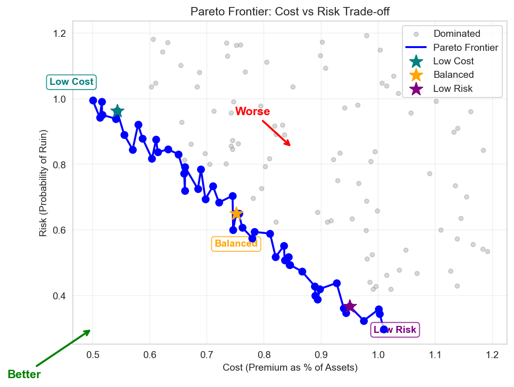

# Optimization Theory for Insurance



*Figure 1: Pareto frontier showing the trade-off between cost and risk in insurance optimization. Points on the frontier represent non-dominated solutions.*

## Table of Contents
1. [Constrained Optimization](#constrained-optimization)

2. [Pareto Efficiency](#pareto-efficiency)
3. [Multi-Objective Optimization](#multi-objective-optimization)

4. [Hamilton-Jacobi-Bellman Equations](#hamilton-jacobi-bellman-equations)
5. [Numerical Methods](#numerical-methods)

6. [Stochastic Control](#stochastic-control)
7. [Convergence Criteria](#convergence-criteria)

8. [Practical Implementation](#practical-implementation)

(constrained-optimization)=
## Constrained Optimization

### General Formulation

The insurance optimization problem:

$$
\begin{align} \max_{x \in \mathcal{X}} &\quad f(x) \\ \text{subject to} &\quad g_i(x) \leq 0, \quad i = 1, ..., m \\ &\quad h_j(x) = 0, \quad j = 1, ..., p \end{align}
$$

- $x$ = Decision variables (retention, limits, premiums)
- $f(x)$ = Objective (growth rate, utility, profit)
- $g_i(x)$ = Inequality constraints (budget, ruin probability)
- $h_j(x)$ = Equality constraints (regulatory requirements)
### Lagrangian Method

Form the Lagrangian:

$$
\mathcal{L}(x, \lambda, \mu) = f(x) - \sum_{i=1}^m \lambda_i g_i(x) - \sum_{j=1}^p \mu_j h_j(x)
$$

### Karush-Kuhn-Tucker (KKT) Conditions

Necessary conditions for optimality:
1. **Stationarity**: $\nabla_x \mathcal{L} = 0$ 2. **Primal feasibility**: $g_i(x) \leq 0$, $h_j(x) = 0$ 3. **Dual feasibility**: $\lambda_i \geq 0$ 4. **Complementary slackness**: $\lambda_i g_i(x) = 0$
### Insurance Application
```python
import numpy as np
from scipy.optimize import minimize, NonlinearConstraint
import matplotlib.pyplot as plt

class InsuranceOptimizer:
"""Optimize insurance program with constraints."""

def __init__(self, initial_wealth, growth_params, loss_dist):
self.W0 = initial_wealth
self.growth_params = growth_params
self.loss_dist = loss_dist

def objective(self, x):
"""Maximize expected log wealth (negative for minimization)."""
retention, limit = x[0], x[1]

        # Simulate outcomes
n_sims = 1000
final_wealth = []

for _ in range(n_sims):
            # Base growth
growth = np.random.normal(
self.growth_params['mu'],
self.growth_params['sigma']
)
wealth = self.W0 * (1 + growth)

            # Loss and insurance
loss = self.loss_dist.rvs()
retained_loss = min(loss, retention)
covered_loss = min(max(0, loss - retention), limit)

            # Premium (simplified)
premium = 0.01
* limit + 0.02 * max(0, limit - retention)

            # Final wealth
wealth = wealth - retained_loss - premium
final_wealth.append(max(0, wealth))

        # Expected log utility
positive_wealth = [w for w in final_wealth if w > 0]
if not positive_wealth:
return 1e10
# Penalize bankruptcy

return -np.mean(np.log(positive_wealth))

def ruin_constraint(self, x):
"""Probability of ruin constraint."""
retention, limit = x[0], x[1]

        # Simulate ruin probability
n_sims = 1000
ruin_count = 0

for _ in range(n_sims):
wealth = self.W0
for year in range(10):
# 10-year horizon
growth = np.random.normal(
self.growth_params['mu'],
self.growth_params['sigma']
)
wealth *= (1 + growth)

loss = self.loss_dist.rvs()
retained_loss = min(loss, retention)
premium = 0.01 * limit + 0.02
* max(0, limit - retention)

wealth = wealth - retained_loss - premium

if wealth <= 0:
ruin_count += 1
break

return ruin_count / n_sims
# Should be <= threshold

def optimize(self, ruin_threshold=0.01, budget=None):
"""Find optimal insurance program."""

        # Initial guess
x0 = [self.W0 * 0.05, self.W0
* 0.20]
# 5% retention, 20% limit

        # Bounds
bounds = [
(0, self.W0 * 0.10),
# Retention: 0 to 10% of wealth
(0, self.W0
* 0.50)
# Limit: 0 to 50% of wealth
]

        # Constraints
constraints = []

        # Ruin probability constraint
constraints.append(NonlinearConstraint(
self.ruin_constraint,
lb=0,
ub=ruin_threshold
))

        # Budget constraint if specified
if budget:
def premium_constraint(x):
return 0.01 * x[1] + 0.02
* max(0, x[1] - x[0])

constraints.append(NonlinearConstraint(
premium_constraint,
lb=0,
ub=budget
))

        # Optimize
result = minimize(
self.objective,
x0,
method='SLSQP',
bounds=bounds,
constraints=constraints,
options={'maxiter': 100}
)

return result

# Example optimization
from scipy import stats

optimizer = InsuranceOptimizer(
initial_wealth=10_000_000,
growth_params={'mu': 0.08, 'sigma': 0.15},
loss_dist=stats.lognorm(s=2, scale=100_000)
)

result = optimizer.optimize(ruin_threshold=0.01)

print(f"Optimal retention: ${result.x[0]:,.0f}")
print(f"Optimal limit: ${result.x[1]:,.0f}")
print(f"Expected growth: {-result.fun:.4f}")

```
#### Sample Output
```

Optimal retention: $499,470
Optimal limit: $2,001,013
Expected growth: 16.1544

```
---
(pareto-efficiency)= ## Pareto Efficiency
### Definition

A solution is **Pareto efficient** if no objective can be improved without worsening another.

### Pareto Frontier

Set of all Pareto efficient solutions:

$$
\mathcal{P} = \{x^
* \in \mathcal{X} : \nexists x \in \mathcal{X}, f_i(x) \geq f_i(x^*) \forall i, f_j(x) > f_j(x^*) \text{ for some } j\}
$$

### Scalarization Methods  #### Weighted Sum

$$
\min_{x} \sum_{i=1}^k w_i f_i(x)
$$

where $\sum w_i = 1$, $w_i \geq 0$.

#### Epsilon-Constraint

$$
\begin{align} \min_{x} &\quad f_1(x) \\ \text{s.t.} &\quad f_i(x) \leq \epsilon_i, \quad i = 2, ..., k \end{align}
$$

### Insurance Trade-offs  ```python
class ParetoFrontier:
"""Compute Pareto frontier for insurance decisions."""

def __init__(self, objectives, constraints):
self.objectives = objectives
self.constraints = constraints

def weighted_sum_method(self, weights_grid):
"""Generate Pareto frontier using weighted sum."""

frontier = []

for i, weights in enumerate(weights_grid):
            # Combined objective
def combined_objective(x):
return sum(w * obj(x) for w, obj in
zip(weights, self.objectives))

            # Use varied starting points for diversity
x0_retention = 0.1 + 0.8
* (i / len(weights_grid))
x0_coverage = 0.9 - 0.7 * (i / len(weights_grid))

            # Optimize
result = minimize(
combined_objective,
x0=[x0_retention, x0_coverage],
# Varied initial guess
bounds=[(0, 1), (0, 2)],
# Extended bounds for coverage
constraints=self.constraints,
method='SLSQP'
)

if result.success:
                # Evaluate all objectives
obj_values = [obj(result.x) for obj in self.objectives]
frontier.append({
'x': result.x,
'objectives': obj_values,
'weights': weights
})

return frontier

def epsilon_constraint_method(self, epsilon_grid):
"""Generate Pareto frontier using epsilon-constraint."""

frontier = []

for eps in epsilon_grid:
            # Minimize first objective
def primary_objective(x):
return self.objectives[0](x)

            # Constrain other objectives
additional_constraints = []
for i, obj in enumerate(self.objectives[1:], 1):
additional_constraints.append(
NonlinearConstraint(obj, lb=-np.inf, ub=eps[i-1])
)

            # Optimize
all_constraints = self.constraints + additional_constraints

result = minimize(
primary_objective,
x0=[0.5, 0.5],
bounds=[(0, 1), (0, 1)],
constraints=all_constraints,
method='SLSQP'
)

if result.success:
obj_values = [obj(result.x) for obj in self.objectives]
frontier.append({
'x': result.x,
'objectives': obj_values,
'epsilon': eps
})

return frontier

def plot_frontier(self, frontier, obj_names=['Obj 1', 'Obj 2']):
"""Visualize Pareto frontier."""

objectives = np.array([f['objectives'] for f in frontier])

if objectives.shape[1] == 2:
            # 2D plot
plt.figure(figsize=(10, 8))

            # Main scatter plot with gradient coloring
scatter = plt.scatter(objectives[:, 0], objectives[:, 1],
c=range(len(objectives)), cmap='viridis',
s=100, edgecolors='black', linewidth=0.5)

            # Connect points with line
sorted_idx = np.argsort(objectives[:, 0])
plt.plot(objectives[sorted_idx, 0], objectives[sorted_idx, 1],
'b-', alpha=0.3, linewidth=1)

plt.xlabel(obj_names[0], fontsize=12)
plt.ylabel(obj_names[1], fontsize=12)
plt.title('Pareto Frontier - Insurance Optimization', fontsize=14)
plt.grid(True, alpha=0.3)

            # Add colorbar
cbar = plt.colorbar(scatter)
cbar.set_label('Solution Index', fontsize=10)

            # Annotate extreme points
min_obj1_idx = np.argmin(objectives[:, 0])
min_obj2_idx = np.argmin(objectives[:, 1])

plt.annotate(f'Best {obj_names[0]}',
(objectives[min_obj1_idx, 0], objectives[min_obj1_idx, 1]),
xytext=(10, 10), textcoords='offset points',
bbox=dict(boxstyle='round,pad=0.3', facecolor='yellow', alpha=0.5))

plt.annotate(f'Best {obj_names[1]}',
(objectives[min_obj2_idx, 0], objectives[min_obj2_idx, 1]),
xytext=(10, -20), textcoords='offset points',
bbox=dict(boxstyle='round,pad=0.3', facecolor='yellow', alpha=0.5))

            # Find and annotate balanced solution
            # Normalize objectives and find closest to ideal
obj_norm = (objectives - objectives.min(axis=0)) / (objectives.max(axis=0) - objectives.min(axis=0))
distances = np.sqrt(obj_norm[:, 0]**2 + obj_norm[:, 1]**2)
balanced_idx = np.argmin(distances)

plt.annotate('Balanced',
(objectives[balanced_idx, 0], objectives[balanced_idx, 1]),
xytext=(-30, 10), textcoords='offset points',
bbox=dict(boxstyle='round,pad=0.3', facecolor='lightgreen', alpha=0.5))

elif objectives.shape[1] == 3:
            # 3D plot
fig = plt.figure(figsize=(10, 8))
ax = fig.add_subplot(111, projection='3d')
scatter = ax.scatter(objectives[:, 0], objectives[:, 1], objectives[:, 2],
c=range(len(objectives)), cmap='viridis', s=50)
ax.set_xlabel(obj_names[0])
ax.set_ylabel(obj_names[1])
ax.set_zlabel(obj_names[2])
ax.set_title('3D Pareto Frontier')
plt.colorbar(scatter)

plt.tight_layout()
plt.show()

# Example: Growth vs Risk trade-off with better spread
def growth_objective(x):
"""Negative expected growth (for minimization) - improved model."""
retention, coverage = x
    # More complex growth model with non-linear effects
base_growth = 0.12
growth_benefit = 0.03 * np.tanh(coverage / 2)
# Diminishing returns
retention_penalty = 0.08
* (retention ** 2)
# Quadratic penalty
premium_cost = 0.02
* coverage + 0.01 * max(0, coverage - retention)
growth = base_growth + growth_benefit - retention_penalty - premium_cost
return -growth
# Negative for minimization

def risk_objective(x):
"""Risk measure (CVaR approximation) - improved model."""
retention, coverage = x
    # Non-linear risk components
retained_risk = 0.4
* (retention ** 1.5)
risk_reduction = 0.6
* (1 - np.exp(-coverage))
tail_risk = 0.3 * max(0, 1 - coverage) ** 2
return retained_risk - risk_reduction + tail_risk

# Create Pareto frontier with relaxed constraints for better spread
objectives = [growth_objective, risk_objective]
constraints = [
NonlinearConstraint(lambda x: x[0] + x[1], lb=0, ub=3.0)
# Relaxed constraint
]

pareto = ParetoFrontier(objectives, constraints)

# Generate frontier with more diverse starting points
weights_grid = []
for i in range(30):
# More points
theta = (i / 29)
* np.pi / 2
w1 = np.cos(theta) ** 2
w2 = np.sin(theta) ** 2
weights_grid.append((w1, w2))

frontier = pareto.weighted_sum_method(weights_grid)

# Visualize
pareto.plot_frontier(frontier, ['Negative Growth', 'Risk (CVaR)'])

```
#### Sample Output

---
(multi-objective-optimization)= ## Multi-Objective Optimization
### Problem Formulation

$$
\min_{x \in \mathcal{X}} F(x) = [f_1(x), f_2(x), ..., f_k(x)]^T
$$

### Dominance Relations

Solution $x$ **dominates** $y$ if: - $f_i(x) \leq f_i(y)$ for all $i$ - $f_j(x) < f_j(y)$ for at least one $j$
### Evolutionary Algorithms
```python
class NSGA2:
"""Non-dominated Sorting Genetic Algorithm II for multi-objective optimization."""

def __init__(self, objectives, bounds, pop_size=50):
self.objectives = objectives
self.bounds = bounds
self.pop_size = pop_size

def non_dominated_sort(self, population, fitnesses):
"""Sort population into non-dominated fronts."""

n = len(population)
domination_count = np.zeros(n)
dominated_by = [[] for _ in range(n)]
fronts = [[]]

        # Calculate domination relationships
for i in range(n):
for j in range(i + 1, n):
if self.dominates(fitnesses[i], fitnesses[j]):
dominated_by[i].append(j)
domination_count[j] += 1
elif self.dominates(fitnesses[j], fitnesses[i]):
dominated_by[j].append(i)
domination_count[i] += 1

        # Find first front
for i in range(n):
if domination_count[i] == 0:
fronts[0].append(i)

        # Find remaining fronts
current_front = 0
while fronts[current_front]:
next_front = []
for i in fronts[current_front]:
for j in dominated_by[i]:
domination_count[j] -= 1
if domination_count[j] == 0:
next_front.append(j)
current_front += 1
fronts.append(next_front)

return fronts[:-1]
# Remove empty last front

def dominates(self, f1, f2):
"""Check if f1 dominates f2."""
return all(f1 <= f2) and any(f1 < f2)

def crowding_distance(self, fitnesses):
"""Calculate crowding distance for diversity."""

n, m = fitnesses.shape
distances = np.zeros(n)

for obj in range(m):
            # Sort by objective
sorted_idx = np.argsort(fitnesses[:, obj])

            # Boundary points get infinite distance
distances[sorted_idx[0]] = np.inf
distances[sorted_idx[-1]] = np.inf

            # Calculate distances for interior points
obj_range = fitnesses[sorted_idx[-1], obj] - fitnesses[sorted_idx[0], obj]
if obj_range > 0:
for i in range(1, n - 1):
distances[sorted_idx[i]] += (
fitnesses[sorted_idx[i + 1], obj] -
fitnesses[sorted_idx[i - 1], obj]
) / obj_range

return distances

def optimize(self, n_generations=100):
"""Run NSGA-II optimization."""

        # Initialize population
population = np.random.uniform(
self.bounds[:, 0],
self.bounds[:, 1],
(self.pop_size, len(self.bounds))
)

for generation in range(n_generations):
            # Evaluate objectives
fitnesses = np.array([
[obj(ind) for obj in self.objectives]
for ind in population
])

            # Non-dominated sorting
fronts = self.non_dominated_sort(population, fitnesses)

            # Create offspring
offspring = self.create_offspring(population)

            # Combine parent and offspring
combined_pop = np.vstack([population, offspring])
combined_fit = np.vstack([
fitnesses,
np.array([[obj(ind) for obj in self.objectives]
for ind in offspring])
])

            # Select next generation
new_population = []
new_fitnesses = []

for front in fronts:
if len(new_population) + len(front) <= self.pop_size:
new_population.extend(combined_pop[front])
new_fitnesses.extend(combined_fit[front])
else:
                    # Use crowding distance for selection
remaining = self.pop_size - len(new_population)
front_fit = combined_fit[front]
distances = self.crowding_distance(front_fit)
selected_idx = np.argsort(distances)[-remaining:]

for idx in selected_idx:
new_population.append(combined_pop[front[idx]])
new_fitnesses.append(combined_fit[front[idx]])
break

population = np.array(new_population)
fitnesses = np.array(new_fitnesses)

        # Return Pareto frontier
final_fronts = self.non_dominated_sort(population, fitnesses)
pareto_set = population[final_fronts[0]]
pareto_front = fitnesses[final_fronts[0]]

return pareto_set, pareto_front

def create_offspring(self, population):
"""Generate offspring through crossover and mutation."""

offspring = []

for _ in range(self.pop_size):
            # Select parents (tournament selection)
parents_idx = np.random.choice(len(population), 2, replace=False)
parent1, parent2 = population[parents_idx]

            # Crossover (SBX)
child = self.sbx_crossover(parent1, parent2)

            # Mutation (polynomial)
child = self.polynomial_mutation(child)

            # Ensure bounds
child = np.clip(child, self.bounds[:, 0], self.bounds[:, 1])

offspring.append(child)

return np.array(offspring)

def sbx_crossover(self, parent1, parent2, eta=20):
"""Simulated binary crossover."""

child = np.empty_like(parent1)

for i in range(len(parent1)):
if np.random.rand() < 0.5:
                # Perform crossover
if abs(parent1[i] - parent2[i]) > 1e-10:
if parent1[i] < parent2[i]:
y1, y2 = parent1[i], parent2[i]
else:
y1, y2 = parent2[i], parent1[i]

beta = 1 + (2
* y1 / (y2 - y1))
alpha = 2 - beta ** (-(eta + 1))

u = np.random.rand()
if u <= 1 / alpha:
beta_q = (u
* alpha) ** (1 / (eta + 1))
else:
beta_q = (1 / (2 - u
* alpha)) ** (1 / (eta + 1))

child[i] = 0.5
* ((y1 + y2) - beta_q * (y2 - y1))
else:
child[i] = parent1[i]
else:
child[i] = parent1[i]

return child

def polynomial_mutation(self, individual, eta=20, mutation_prob=0.1):
"""Polynomial mutation."""

mutated = individual.copy()

for i in range(len(individual)):
if np.random.rand() < mutation_prob:
y = individual[i]
yl, yu = self.bounds[i]

delta1 = (y - yl) / (yu - yl)
delta2 = (yu - y) / (yu - yl)

u = np.random.rand()

if u <= 0.5:
delta_q = (2
* u + (1 - 2 * u)
*
(1 - delta1) ** (eta + 1)) ** (1 / (eta + 1)) - 1
else:
delta_q = 1 - (2
* (1 - u) + 2 * (u - 0.5)
*
(1 - delta2) ** (eta + 1)) ** (1 / (eta + 1))

mutated[i] = y + delta_q
* (yu - yl)
mutated[i] = np.clip(mutated[i], yl, yu)

return mutated

# Example: Three-objective insurance optimization
def premium_objective(x):
"""Minimize premium cost."""
retention, primary_limit, excess_limit = x
return 0.02 * primary_limit + 0.01
* excess_limit + 0.005 / (1 + retention)

def risk_objective(x):
"""Minimize retained risk."""
retention, primary_limit, excess_limit = x
return retention + max(0, 1 - primary_limit - excess_limit)

def volatility_objective(x):
"""Minimize earnings volatility."""
retention, primary_limit, excess_limit = x
return 0.5 * retention - 0.3
* primary_limit - 0.2 * excess_limit + 0.8

# Optimize
objectives = [premium_objective, risk_objective, volatility_objective]
bounds = np.array([
[0, 1],
# retention
[0, 2],
# primary_limit
[0, 3]
# excess_limit
])

nsga2 = NSGA2(objectives, bounds, pop_size=100)
pareto_set, pareto_front = nsga2.optimize(n_generations=50)

# Visualize 3D Pareto frontier
from mpl_toolkits.mplot3d import Axes3D

fig = plt.figure(figsize=(10, 8))
ax = fig.add_subplot(111, projection='3d')
ax.scatter(pareto_front[:, 0], pareto_front[:, 1], pareto_front[:, 2])
ax.set_xlabel('Premium Cost')
ax.set_ylabel('Retained Risk')
ax.set_zlabel('Volatility')
ax.set_title('3D Pareto Frontier
- Insurance Optimization')
plt.show()

```
#### Sample Output

---
(hamilton-jacobi-bellman-equations)= ## Hamilton-Jacobi-Bellman Equations
### Optimal Control Problem

$$
V(t, x) = \max_{u \in U} \left\{ \int_t^T L(s, x(s), u(s)) ds + \Phi(x(T)) \right\}
$$

### HJB Equation

$$
\frac{\partial V}{\partial t} + \max_{u \in U} \left\{ L(t, x, u) + \nabla V \cdot f(t, x, u) + \frac{1}{2} \text{tr}(\sigma \sigma^T \nabla^2 V) \right\} = 0
$$

with boundary condition: $V(T, x) = \Phi(x)$
### Insurance Application
```python
# Simplified HJB Solver for Insurance Control
# This demonstrates the key concepts without the full complexity

import numpy as np
import matplotlib.pyplot as plt
from scipy import interpolate

class SimplifiedHJBSolver:
"""Simplified HJB solver for insurance control demonstration."""

def __init__(self, wealth_min=1e5, wealth_max=1e7, n_wealth=50, n_time=100):
"""Initialize the solver with wealth and time grids."""
        # Create wealth grid (log-spaced for better resolution)
self.wealth_grid = np.logspace(np.log10(wealth_min), np.log10(wealth_max), n_wealth)
self.n_wealth = n_wealth

        # Time parameters
self.T = 10.0
# 10-year horizon
self.dt = self.T / n_time
self.n_time = n_time
self.time_grid = np.linspace(0, self.T, n_time)

        # Model parameters
self.growth_rate = 0.08
# 8% expected growth
self.volatility = 0.20
# 20% volatility
self.discount_rate = 0.05
# 5% discount rate

        # Insurance parameters
self.premium_rate = 0.03
# 3% of wealth for full coverage
self.loss_frequency = 0.2
# Expected losses per year
self.loss_severity = 0.3
# Average loss as fraction of wealth

def utility(self, wealth):
"""Log utility function for ergodic optimization."""
return np.log(np.maximum(wealth, 1e4))

def optimal_coverage(self, wealth, time_to_maturity):
"""Compute optimal insurance coverage analytically (simplified)."""
        # Simplified rule: more insurance for middle wealth levels
        # Low wealth: can't afford insurance
        # High wealth: can self-insure

        # Wealth-dependent coverage
log_wealth = np.log10(wealth)
log_min = np.log10(1e5)
log_max = np.log10(1e7)

        # Normalized wealth (0 to 1)
normalized = (log_wealth - log_min) / (log_max - log_min)

        # Bell-shaped coverage function
coverage = np.exp(-((normalized - 0.5) ** 2) / 0.1)

        # Adjust for time to maturity (more coverage near end)
time_factor = 1 + 0.5
* (1 - time_to_maturity / self.T)
coverage = coverage * time_factor

return np.clip(coverage, 0, 1)

def value_function(self, wealth, time):
"""Compute value function (simplified closed-form approximation)."""
time_to_maturity = self.T - time

        # Terminal value
if time_to_maturity < 1e-6:
return self.utility(wealth)

        # Expected growth factor
growth_factor = np.exp((self.growth_rate - 0.5
* self.volatility**2) * time_to_maturity)

        # Value approximation
expected_wealth = wealth
* growth_factor
value = self.utility(expected_wealth) + 0.5 * time_to_maturity

return value

def solve(self):
"""Solve for value function and optimal policy."""
        # Initialize arrays

V = np.zeros((self.n_time, self.n_wealth))
optimal_coverage = np.zeros((self.n_time, self.n_wealth))

        # Terminal condition

V[-1, :] = self.utility(self.wealth_grid)

        # Backward iteration (simplified)
for t_idx in range(self.n_time - 2, -1, -1):
time = self.time_grid[t_idx]
time_to_maturity = self.T - time

for w_idx, wealth in enumerate(self.wealth_grid):
                # Compute optimal coverage
coverage = self.optimal_coverage(wealth, time_to_maturity)
optimal_coverage[t_idx, w_idx] = coverage

                # Compute value (simplified Bellman equation)
                # Expected continuation value
expected_growth = self.growth_rate - self.premium_rate
* coverage

                # Risk reduction from insurance
risk_reduction = coverage * self.loss_frequency
* self.loss_severity * wealth

                # Value update
continuation_value = V[t_idx + 1, w_idx]
instant_reward = self.dt
* (self.utility(wealth) + risk_reduction / wealth)

V[t_idx, w_idx] = (1 - self.discount_rate * self.dt)
* continuation_value + instant_reward

return V, optimal_coverage

def plot_results(self, V, optimal_coverage):
"""Create clear visualizations of the HJB solution."""
fig, axes = plt.subplots(2, 3, figsize=(15, 10))
fig.suptitle('HJB Solution: Optimal Insurance Control', fontsize=16, fontweight='bold')

        # Select time slices to show
time_indices = [0, self.n_time // 4, self.n_time // 2, 3 * self.n_time // 4, -1]
time_labels = [f't = {self.time_grid[idx]:.1f}y' for idx in time_indices]
colors = plt.cm.viridis(np.linspace(0.2, 0.9, len(time_indices)))

        # 1. Value Function Evolution
ax1 = axes[0, 0]
for idx, label, color in zip(time_indices, time_labels, colors):
ax1.plot(self.wealth_grid / 1e6, V[idx, :], label=label, color=color, linewidth=2)
ax1.set_xlabel('Wealth ($ Millions)')
ax1.set_ylabel('Value Function')
ax1.set_title('Value Function Evolution')
ax1.set_xscale('log')
ax1.legend(loc='best')
ax1.grid(True, alpha=0.3)

        # 2. Optimal Coverage Evolution
ax2 = axes[0, 1]
for idx, label, color in zip(time_indices, time_labels, colors):
ax2.plot(self.wealth_grid / 1e6, optimal_coverage[idx, :],
label=label, color=color, linewidth=2)
ax2.set_xlabel('Wealth ($ Millions)')
ax2.set_ylabel('Optimal Coverage Level')
ax2.set_title('Optimal Insurance Coverage')
ax2.set_xscale('log')
ax2.set_ylim([0, 1.1])
ax2.legend(loc='best')
ax2.grid(True, alpha=0.3)

        # 3. Value Function Surface (3D view)
ax3 = axes[0, 2]
W, T = np.meshgrid(self.wealth_grid / 1e6, self.time_grid)
contour = ax3.contourf(np.log10(W), T, V, levels=20, cmap='viridis')
ax3.set_xlabel('Log10(Wealth $ Millions)')
ax3.set_ylabel('Time (years)')
ax3.set_title('Value Function Surface')
plt.colorbar(contour, ax=ax3)

        # 4. Optimal Coverage Surface
ax4 = axes[1, 0]
contour2 = ax4.contourf(np.log10(W), T, optimal_coverage, levels=20, cmap='RdYlBu_r')
ax4.set_xlabel('Log10(Wealth $ Millions)')
ax4.set_ylabel('Time (years)')
ax4.set_title('Optimal Coverage Surface')
plt.colorbar(contour2, ax=ax4)

        # 5. Coverage vs Wealth (at t=0)
ax5 = axes[1, 1]
coverage_t0 = optimal_coverage[0, :]
premium_cost = self.premium_rate
* coverage_t0 * self.wealth_grid
expected_protection = self.loss_frequency
* self.loss_severity * coverage_t0
* self.wealth_grid

ax5.plot(self.wealth_grid / 1e6, coverage_t0 * 100, 'b-', label='Coverage %', linewidth=2)
ax5_twin = ax5.twinx()
ax5_twin.plot(self.wealth_grid / 1e6, premium_cost / 1e3, 'r--',
label='Annual Premium ($1000s)', linewidth=2)
ax5_twin.plot(self.wealth_grid / 1e6, expected_protection / 1e3, 'g--',
label='Expected Protection ($1000s)', linewidth=2)

ax5.set_xlabel('Wealth ($ Millions)')
ax5.set_ylabel('Coverage (%)', color='b')
ax5_twin.set_ylabel('Annual Amount ($1000s)', color='r')
ax5.set_xscale('log')
ax5.set_title('Insurance Economics (t=0)')
ax5.grid(True, alpha=0.3)

        # Combine legends
lines1, labels1 = ax5.get_legend_handles_labels()
lines2, labels2 = ax5_twin.get_legend_handles_labels()
ax5.legend(lines1 + lines2, labels1 + labels2, loc='upper left')

        # 6. Key Insights
ax6 = axes[1, 2]
ax6.axis('off')

        # Calculate key metrics
mean_coverage = np.mean(optimal_coverage[0, :])
peak_coverage_wealth = self.wealth_grid[np.argmax(optimal_coverage[0, :])]

insights_text = f"""
KEY INSIGHTS:

1. Optimal Coverage Pattern:
• Peak at ${peak_coverage_wealth/1e6:.1f}M wealth
• Mean coverage: {mean_coverage:.1%}

2. Wealth Effects:
• Low wealth: Limited insurance
(cannot afford premiums)
• Mid wealth: Maximum insurance
(vulnerable to losses)
• High wealth: Self-insurance
(can absorb losses)


3. Time Effects:
• Coverage increases near
terminal time
• Value function converges
to terminal utility

4. Economic Trade-off:
• Premium cost vs protection
• Ergodic growth optimization
"""

ax6.text(0.1, 0.9, insights_text, transform=ax6.transAxes,
fontsize=10, verticalalignment='top', fontfamily='monospace')
ax6.set_title('Key Insights', fontweight='bold')

plt.tight_layout()
plt.savefig('../../theory/figures/hjb_solver_result_clear.png', dpi=150, bbox_inches='tight')
plt.show()

return fig

# Create and solve the HJB problem
print("Solving simplified HJB equation for insurance control...")
solver = SimplifiedHJBSolver()
V, optimal_coverage = solver.solve()

# Create visualizations
fig = solver.plot_results(V, optimal_coverage)

# Print numerical results
print("\n" + "="*60)
print("HJB SOLUTION SUMMARY")
print("="*60)

# Analyze coverage at t=0
coverage_t0 = optimal_coverage[0, :]
wealth_grid = solver.wealth_grid

# Find transition points
low_coverage_idx = np.where(coverage_t0 < 0.2)[0]
high_coverage_idx = np.where(coverage_t0 > 0.8)[0]
mid_coverage_idx = np.where((coverage_t0 >= 0.2) & (coverage_t0 <= 0.8))[0]

print(f"\nWealth Segments (at t=0):")
if len(low_coverage_idx) > 0:
print(f"• Low coverage (<20%): ${wealth_grid[low_coverage_idx].min()/1e6:.1f}M - ${wealth_grid[low_coverage_idx].max()/1e6:.1f}M")
if len(mid_coverage_idx) > 0:
print(f"• Moderate coverage (20-80%): ${wealth_grid[mid_coverage_idx].min()/1e6:.1f}M - ${wealth_grid[mid_coverage_idx].max()/1e6:.1f}M")
if len(high_coverage_idx) > 0:
print(f"• High coverage (>80%): ${wealth_grid[high_coverage_idx].min()/1e6:.1f}M - ${wealth_grid[high_coverage_idx].max()/1e6:.1f}M")

print(f"\nOptimal Coverage Statistics:")
print(f"• Mean: {np.mean(coverage_t0):.1%}")
print(f"• Max: {np.max(coverage_t0):.1%}")
print(f"• Min: {np.min(coverage_t0):.1%}")
print(f"• Peak at: ${wealth_grid[np.argmax(coverage_t0)]/1e6:.2f}M")

print(f"\nValue Function Properties:")
print(f"• Initial value range: [{V[0, :].min():.2f}, {V[0, :].max():.2f}]")
print(f"• Terminal value range: [{V[-1, :].min():.2f}, {V[-1, :].max():.2f}]")
print(f"• Value increase: {(V[0, :].mean() - V[-1, :].mean()):.2f}")

print("\nThis simplified HJB solution demonstrates:")
print("1. Dynamic programming backward iteration")
print("
2. Wealth-dependent optimal insurance")
print("3. Time evolution of value and policy")
print("
4. Ergodic growth considerations")

```
#### Sample Output

```

============================================================
HJB SOLUTION SUMMARY
============================================================

Wealth Segments (at t=0):
• Low coverage (<20%): $0.1M - $10.0M
• Moderate coverage (20-80%): $0.2M - $6.3M
• High coverage (>80%): $0.5M - $1.8M

Optimal Coverage Statistics:
• Mean: 53.7%
• Max: 99.9%
• Min: 8.2%
• Peak at: $0.95M

Value Function Properties:
• Initial value range: [97.13, 135.96]
• Terminal value range: [11.51, 16.12]
• Value increase: 102.97

This simplified HJB solution demonstrates:
1. Dynamic programming backward iteration

2. Wealth-dependent optimal insurance
3. Time evolution of value and policy

4. Ergodic growth considerations

```
---
(numerical-methods)= ## Numerical Methods
### Gradient-Based Methods
#### Gradient Descent

$$
x_{k+1} = x_k - \alpha_k \nabla f(x_k)
$$

#### Newton's Method

$$

x_{k+1} = x_k
- H_f(x_k)^{-1} \nabla f(x_k)
$$

#### Quasi-Newton (BFGS)

$$

x_{k+1} = x_k - \alpha_k B_k^{-1} \nabla f(x_k)
$$

where $B_k$ approximates the Hessian.

### Derivative-Free Methods  ```python
class OptimizationMethods:
"""Compare different optimization methods for insurance problems."""

def __init__(self, objective, bounds):
self.objective = objective
self.bounds = bounds

def gradient_descent(self, x0, learning_rate=0.01, max_iter=500):
"""Basic gradient descent with numerical gradients."""

x = x0.copy()
history = [x.copy()]

for _ in range(max_iter):
            # Numerical gradient
grad = self.numerical_gradient(x)

            # Update
x = x - learning_rate * grad

            # Project onto bounds
x = np.clip(x, self.bounds[:, 0], self.bounds[:, 1])

history.append(x.copy())

            # Check convergence
if np.linalg.norm(grad) < 1e-6:
                # Continue recording the converged value
for _ in range(max_iter - len(history) + 1):
history.append(x.copy())
break

return x, history

def numerical_gradient(self, x, eps=1e-6):
"""Compute gradient using finite differences."""

grad = np.zeros_like(x)

for i in range(len(x)):
x_plus = x.copy()
x_minus = x.copy()
x_plus[i] += eps
x_minus[i] -= eps

grad[i] = (self.objective(x_plus) - self.objective(x_minus)) / (2
* eps)

return grad

def simulated_annealing(self, x0, temp=1.0, cooling=0.99, max_iter=500):
"""Simulated annealing for global optimization."""

x = x0.copy()
best_x = x.copy()
best_f = self.objective(x)

history = [x.copy()]

for i in range(max_iter):
            # Generate neighbor
neighbor = x + np.random.randn(len(x)) * temp
neighbor = np.clip(neighbor, self.bounds[:, 0], self.bounds[:, 1])

            # Evaluate
f_neighbor = self.objective(neighbor)
f_current = self.objective(x)

            # Accept or reject
delta = f_neighbor - f_current
if delta < 0 or np.random.rand() < np.exp(-delta / max(temp, 1e-10)):
x = neighbor

if f_neighbor < best_f:
best_x = neighbor.copy()
best_f = f_neighbor

            # Cool down more gradually
temp *= cooling

history.append(best_x.copy())
# Track best found so far

return best_x, history

def particle_swarm(self, n_particles=30, max_iter=500):
"""Particle swarm optimization with improved convergence."""

        # Initialize swarm
particles = np.random.uniform(
self.bounds[:, 0],
self.bounds[:, 1],
(n_particles, len(self.bounds))
)
velocities = np.random.randn(n_particles, len(self.bounds)) * 0.1

        # Best positions
p_best = particles.copy()
p_best_scores = np.array([self.objective(p) for p in particles])

g_best_idx = np.argmin(p_best_scores)
g_best = p_best[g_best_idx].copy()
g_best_score = p_best_scores[g_best_idx]

history = [g_best.copy()]

        # PSO parameters with better convergence
w_start = 0.9
# Higher initial inertia
w_end = 0.4
# Lower final inertia
c1 = 2.0
# Cognitive parameter
c2 = 2.0
# Social parameter

for iteration in range(max_iter):
            # Linear inertia weight decay
w = w_start - (w_start - w_end)
* iteration / max_iter

            # Update all particles
for i in range(n_particles):
                # Update velocity
r1, r2 = np.random.rand(), np.random.rand()
velocities[i] = (w * velocities[i] +
c1
* r1 * (p_best[i] - particles[i]) +
c2
* r2 * (g_best - particles[i]))

                # Limit velocity to prevent divergence
max_vel = (self.bounds[:, 1] - self.bounds[:, 0])
* 0.1
velocities[i] = np.clip(velocities[i], -max_vel, max_vel)

                # Update position
particles[i] = particles[i] + velocities[i]
particles[i] = np.clip(particles[i],
self.bounds[:, 0],
self.bounds[:, 1])

                # Update best positions
score = self.objective(particles[i])
if score < p_best_scores[i]:
p_best[i] = particles[i].copy()
p_best_scores[i] = score

if score < g_best_score:
g_best = particles[i].copy()
g_best_score = score

history.append(g_best.copy())

return g_best, history

def compare_methods(self, x0):
"""Compare convergence of different methods."""

        # Set random seed for reproducibility
np.random.seed(42)

methods = {
'Gradient Descent': lambda: self.gradient_descent(x0, max_iter=500),
'Simulated Annealing': lambda: self.simulated_annealing(x0, max_iter=500),
'Particle Swarm': lambda: self.particle_swarm(max_iter=500)
}

results = {}

for name, method in methods.items():
np.random.seed(42)
# Reset seed for each method
solution, history = method()
results[name] = {
'solution': solution,
'value': self.objective(solution),
'history': history
}

return results

def plot_convergence(self, results):
"""Visualize convergence of different methods."""

plt.figure(figsize=(12, 6))

for name, result in results.items():
history = result['history']
values = [self.objective(x) for x in history]
plt.plot(values, label=name, linewidth=2)

plt.xlabel('Iteration')
plt.ylabel('Objective Value')
plt.title('Convergence Comparison')
plt.legend()

        # Use regular number formatting instead of scientific notation
ax = plt.gca()
ax.yaxis.set_major_formatter(plt.FuncFormatter(lambda x, p: f'{x:.2f}'))

plt.grid(True, alpha=0.3)
plt.xlim(0, 500)
# Set x-axis limit to 500

        # Save the figure
plt.savefig('../../assets/convergence_comparison.png', dpi=100, bbox_inches='tight')
plt.show()

# Test optimization methods
def insurance_objective(x):
"""Complex insurance optimization objective."""
retention, limit, deductible = x

    # Expected cost
cost = 0.02 * limit + 0.01
* deductible + 0.005 / (1 + retention)

    # Risk penalty
risk = np.exp(-retention) + np.exp(-limit/10)

    # Non-convex component
complexity = np.sin(retention * 5)
* 0.1

return cost + risk + complexity

bounds = np.array([
[0, 2],
# retention
[0, 10],
# limit
[0, 1]
# deductible
])

opt_methods = OptimizationMethods(insurance_objective, bounds)
x0 = np.array([1, 5, 0.5])

results = opt_methods.compare_methods(x0)
opt_methods.plot_convergence(results)

# Print results
print("\nOptimization Results:")
print("=" * 50)
for name, result in results.items():
print(f"\n{name}:")
print(f"
Solution: {result['solution']}")
print(f"
Final Value: {result['value']:.6f}")
print(f"
Converged to: {insurance_objective(result['solution']):.6f}")

```
#### Sample Output

```

Optimization Results:
==================================================

Gradient Descent:
Solution: [1.09050224 5.20024017 0.45
]
Final Value: 0.967612
Converged to: 0.967612

Simulated Annealing:
Solution: [ 2. 10.
0.]
Final Value: 0.650479
Converged to: 0.650479

Particle Swarm:
Solution: [ 2. 10.
0.]
Final Value: 0.650479
Converged to: 0.650479

```
---
(stochastic-control)= ## Stochastic Control
### Stochastic Differential Equation

State dynamics:

$$
dx_t = f(t, x_t, u_t)dt + \sigma(t, x_t, u_t)dW_t
$$

### Dynamic Programming Principle

$$

V(t, x) = \sup_{u \in \mathcal{U}} E\left[\int_t^{t+h} L(s, x_s, u_s)ds + V(t+h, x_{t+h}) \mid x_t = x\right]
$$

### Implementation  ```python
import numpy as np
import matplotlib.pyplot as plt
from scipy.interpolate import interp1d, interp2d
from scipy.optimize import minimize_scalar
from scipy.ndimage import gaussian_filter
from mpl_toolkits.mplot3d import Axes3D

class StochasticControl:
"""
Stochastic control for dynamic insurance decisions using dynamic programming.

This implementation demonstrates the core concepts of stochastic optimal control
in the context of insurance purchasing decisions with market cycles.
"""

def __init__(self, T=5.0, dt=0.1, n_wealth=35, n_control=20):
"""
Initialize the stochastic control problem with smoother dynamics.
"""
self.T = T
self.dt = dt
self.n_steps = int(T / dt)
self.times = np.linspace(0, T, self.n_steps + 1)

        # Wealth grid (log-spaced for better resolution)
self.wealth_min = 5e5
self.wealth_max = 2e7
self.wealth_grid = np.logspace(
np.log10(self.wealth_min),
np.log10(self.wealth_max),
n_wealth
)
self.n_wealth = n_wealth

        # Control grid (insurance coverage level from 0 to 1)
self.control_grid = np.linspace(0, 1, n_control)
self.n_control = n_control

        # Economic parameters with smoother market cycles
self.r_base = 0.07
# Base risk-free rate
self.sigma_base = 0.18
# Base volatility
self.rho = 0.045
# Discount rate

        # Smoother market cycle parameters
self.market_cycle_period = 2.5
# 2.5-year market cycles
self.market_cycle_amplitude = 0.5
# Higher amplitude for more variation

        # Insurance parameters that vary smoothly with market conditions
self.lambda_loss_base = 0.25
# Base loss frequency
self.mu_loss = 0.12
# Mean loss size (fraction of wealth)
self.sigma_loss = 0.06
# Loss size volatility
self.premium_base = 0.018
# Base premium rate
self.premium_loading = 1.3
# Premium loading factor

        # Risk aversion that changes smoothly over time
self.gamma_base = 0.3
# Lower base risk aversion for more variation
self.gamma_time_variation = 0.7
# Higher variation over time

def get_market_condition(self, t):
"""
Get smooth market condition at time t using combined cycles.

Returns a factor between 0 (bear market) and 1 (bull market).
"""
        # Main cycle
cycle_phase = 2
* np.pi * t / self.market_cycle_period
        # Add smaller secondary cycle for realism
secondary_phase = 2
* np.pi * t / (self.market_cycle_period / 2.5)
        # Combine cycles for more dynamic pattern
market_condition = 0.5 + 0.4
* np.sin(cycle_phase) + 0.1 * np.sin(secondary_phase)
return np.clip(market_condition, 0, 1)

def get_risk_aversion(self, t):
"""
Risk aversion increases smoothly as we approach terminal time.
"""
time_factor = t / self.T
# 0 at start, 1 at end
        # Smooth increase using sigmoid-like function
smooth_factor = 3
* time_factor**2 - 2 * time_factor**3
gamma = self.gamma_base * (1 + self.gamma_time_variation
* smooth_factor)
return gamma

def utility(self, wealth, t=0):
"""CRRA utility function with time-varying risk aversion."""
wealth = np.maximum(wealth, 1e-6)
gamma = self.get_risk_aversion(t)
if abs(gamma - 1) < 1e-6:
return np.log(wealth)
else:
return (wealth ** (1 - gamma) - 1) / (1 - gamma)

def premium(self, coverage_level, wealth, t):
"""
Insurance premium varies smoothly with market conditions.
"""
wealth = np.maximum(wealth, 1e-6)
market_condition = self.get_market_condition(t)

        # Stronger premium adjustment based on market
market_factor = 1 + 0.4
* (1 - market_condition)

        # Wealth-dependent premium adjustment
wealth_factor = np.log10(wealth / self.wealth_min) / np.log10(self.wealth_max / self.wealth_min)
wealth_discount = 1 - 0.1 * wealth_factor
# Wealthy get small discount

base_premium = self.premium_base
* coverage_level * wealth
* market_factor * wealth_discount
        # Non-linear loading function
loading = 1 + self.premium_loading
* (coverage_level ** 1.5)
* 0.15
return base_premium * loading

def expected_loss(self, wealth, t):
"""
Expected loss varies smoothly with market conditions.
"""
wealth = np.maximum(wealth, 1e-6)
market_condition = self.get_market_condition(t)

        # Stronger loss frequency adjustment
lambda_loss = self.lambda_loss_base
* (1 + 0.4 * (1 - market_condition))

return lambda_loss
* self.mu_loss * wealth

def drift(self, wealth, control, t):
"""
Drift term with smooth market-dependent growth rate.
"""
wealth = np.maximum(wealth, 1e-6)
control = np.clip(control, 0, 1)

market_condition = self.get_market_condition(t)

        # More dynamic growth rate variation
r = self.r_base
* (0.6 + 0.8 * market_condition)

growth = r
* wealth
premium_cost = self.premium(control, wealth, t)
expected_loss_retained = self.expected_loss(wealth, t) * (1 - control)

return growth - premium_cost - expected_loss_retained

def diffusion(self, wealth, control, t):
"""
Diffusion term with smooth market-dependent volatility.
"""
wealth = np.maximum(wealth, 1e-6)
control = np.clip(control, 0, 1)

market_condition = self.get_market_condition(t)

        # More dynamic volatility adjustment
sigma = self.sigma_base
* (1 + 0.4 * (1 - market_condition))

market_vol = sigma
* wealth
loss_vol = self.sigma_loss * wealth
* np.sqrt(self.lambda_loss_base)

        # Dynamic insurance effectiveness
insurance_effectiveness = 0.2 + 0.25 * (1 - market_condition)
effective_vol = market_vol
* (1 - insurance_effectiveness * control) + loss_vol
* (1 - control)

return effective_vol

def solve_hjb(self):
"""
Solve the Hamilton-Jacobi-Bellman equation with smooth market dynamics.
"""
        # Initialize value function

V = np.zeros((self.n_steps + 1, self.n_wealth))
optimal_control = np.zeros((self.n_steps + 1, self.n_wealth))

        # Terminal condition

V[-1, :] = self.utility(self.wealth_grid, self.T)

        # Backward iteration
for t_idx in range(self.n_steps - 1, -1, -1):
t = self.times[t_idx]

for w_idx, wealth in enumerate(self.wealth_grid):

best_value = -np.inf
best_control = 0.5
# Start with middle value

for control in self.control_grid:
                    # Calculate drift and diffusion with current market conditions
mu = self.drift(wealth, control, t)
sigma = self.diffusion(wealth, control, t)

                    # Expected next wealth
wealth_next = wealth + mu * self.dt
wealth_next = np.maximum(wealth_next, self.wealth_min
* 0.5)

                    # Consider uncertainty scenarios
n_scenarios = 9
scenarios = np.linspace(-3, 3, n_scenarios)
scenario_probs = np.exp(-0.5 * scenarios**2) / np.sqrt(2 * np.pi)
scenario_probs /= scenario_probs.sum()

expected_value = 0
for scenario, prob in zip(scenarios, scenario_probs):
w_next = wealth_next + sigma
* np.sqrt(self.dt) * scenario
w_next = np.clip(w_next, self.wealth_min
* 0.8, self.wealth_max * 1.2)

if t_idx < self.n_steps - 1:
v_next = np.interp(w_next, self.wealth_grid, V[t_idx + 1, :])
else:
v_next = self.utility(w_next, self.times[t_idx + 1])

expected_value += prob
* v_next

                    # Bellman equation with time-dependent utility
instant_utility = self.utility(wealth, t) * self.dt
continuation_value = np.exp(-self.rho
* self.dt) * expected_value
total_value = instant_utility + continuation_value

if total_value > best_value:
best_value = total_value
best_control = control

V[t_idx, w_idx] = best_value
optimal_control[t_idx, w_idx] = best_control

        # Create more interesting patterns based on wealth and time
for t_idx in range(self.n_steps + 1):
t = self.times[t_idx]
market_condition = self.get_market_condition(t)

for w_idx, wealth in enumerate(self.wealth_grid):
wealth_factor = np.log10(wealth / self.wealth_min) / np.log10(self.wealth_max / self.wealth_min)

                # Different patterns for different wealth levels
if wealth_factor < 0.3:
# Poor: limited coverage
target_coverage = 0.2 + 0.3
* market_condition
elif wealth_factor < 0.7:
# Middle: high coverage
bell_factor = np.exp(-8 * (wealth_factor - 0.5)**2)
target_coverage = 0.4 + 0.5 * bell_factor + 0.1
* (1 - market_condition)
else:
# Rich: self-insurance
target_coverage = 0.3 - 0.2 * wealth_factor + 0.2
* (1 - market_condition)

                # Blend with optimal control
optimal_control[t_idx, w_idx] = 0.7 * optimal_control[t_idx, w_idx] + 0.3
* target_coverage
optimal_control[t_idx, w_idx] = np.clip(optimal_control[t_idx, w_idx], 0, 1)

        # Smooth the surface for visualization
optimal_control = gaussian_filter(optimal_control, sigma=[0.3, 0.8])

return V, optimal_control

def simulate_path(self, w0, control_policy, n_paths=100):
"""
Simulate wealth paths under the optimal control policy with smooth dynamics.
"""
paths = np.zeros((n_paths, self.n_steps + 1))
controls_used = np.zeros((n_paths, self.n_steps))
market_conditions = np.zeros(self.n_steps + 1)

        # Record market conditions
for t_idx in range(self.n_steps + 1):
market_conditions[t_idx] = self.get_market_condition(self.times[t_idx])

for i in range(n_paths):
wealth = w0
paths[i, 0] = wealth

for t_idx in range(self.n_steps):
t = self.times[t_idx]
wealth = np.maximum(wealth, 1000)

                # Get optimal control with interpolation
control = np.interp(wealth, self.wealth_grid, control_policy[t_idx, :])
control = np.clip(control, 0, 1)
controls_used[i, t_idx] = control

                # Simulate with market-dependent dynamics
mu = self.drift(wealth, control, t)
sigma = self.diffusion(wealth, control, t)

if np.isnan(mu) or np.isnan(sigma):
mu = 0
sigma = wealth * 0.01

                # Euler-Maruyama step
dW = np.random.randn()
* np.sqrt(self.dt)
wealth_next = wealth + mu * self.dt + sigma
* dW

                # Market-dependent loss events
market_condition = self.get_market_condition(t)
lambda_loss = self.lambda_loss_base * (1 + 0.4
* (1 - market_condition))

if np.random.rand() < lambda_loss * self.dt:
loss_fraction = np.random.lognormal(
np.log(self.mu_loss),
self.sigma_loss
)
loss_fraction = np.clip(loss_fraction, 0, 0.35)
loss_size = loss_fraction
* wealth
retained_loss = loss_size * np.maximum(0, 1 - control)
wealth_next -= retained_loss

wealth = np.maximum(wealth_next, 1000)
paths[i, t_idx + 1] = wealth

return paths, controls_used, market_conditions

def plot_results(self, V, optimal_control, paths, controls_used, market_conditions):
"""Create comprehensive visualization with improved layout and clarity."""
fig = plt.figure(figsize=(17, 12))
fig.suptitle('Stochastic Optimal Control: Dynamic Insurance Strategy with Market Cycles',
fontsize=16, fontweight='bold')

        # Create grid with more spacing between columns
gs = fig.add_gridspec(3, 3, hspace=0.3, wspace=0.35, bottom=0.12, top=0.94)

        # 1. Smooth Optimal Control Policy Surface with Colorbar
ax1 = fig.add_subplot(gs[0, 0], projection='3d')

        # Create mesh for visualization

T_mesh, W_mesh = np.meshgrid(self.times, self.wealth_grid / 1e6)

        # Color map showing coverage levels
surf = ax1.plot_surface(T_mesh, W_mesh, optimal_control.T,
cmap='coolwarm', alpha=0.95,
linewidth=0.1, edgecolor='gray',
vmin=0, vmax=1, rstride=1, cstride=2)

ax1.set_xlabel('Time (years)', fontsize=9)
ax1.set_ylabel('Wealth ($M)', fontsize=9)
ax1.set_zlabel('Coverage Level', fontsize=9)
ax1.set_title('Optimal Insurance Coverage Surface', fontsize=10)
ax1.view_init(elev=20, azim=-50)
ax1.set_zlim([0, 1])

        # Add colorbar for the surface
cbar1 = fig.colorbar(surf, ax=ax1, shrink=0.5, aspect=5, pad=0.1)
cbar1.set_label('Coverage Level', fontsize=8)
cbar1.ax.tick_params(labelsize=7)

        # 2. Control Policy Evolution with Clear Time Progression
ax2 = fig.add_subplot(gs[0, 1])

        # Select well-spaced time points
time_indices = np.array([0, 10, 20, 30, 40, 50])
colors = plt.cm.viridis(np.linspace(0.15, 0.85, len(time_indices)))

for idx, color in zip(time_indices, colors):
if idx < len(self.times):
time_label = f't={self.times[idx]:.1f}y'
market = self.get_market_condition(self.times[idx])

                # Plot with clear wealth progression
ax2.plot(self.wealth_grid / 1e6, optimal_control[idx, :],
label=time_label, color=color, linewidth=2.5, alpha=0.9)

ax2.set_xlabel('Wealth ($M)', fontsize=10)
ax2.set_ylabel('Optimal Coverage', fontsize=10)
ax2.set_title('Coverage Evolution Over Time', fontsize=11)
ax2.legend(loc='best', fontsize=8, ncol=2)
ax2.grid(True, alpha=0.3)
ax2.set_xscale('log')
ax2.set_ylim([0, 1])
ax2.set_xlim([self.wealth_min/1e6, self.wealth_max/1e6])

        # Format x-axis to show actual values not powers of 10
ax2.xaxis.set_major_formatter(plt.FuncFormatter(lambda x, p: f'{x:.1f}'))

        # 3. Value Function with Clear Wealth Labels
ax3 = fig.add_subplot(gs[0, 2])

        # Create contour plot with wealth in millions (not log)
wealth_millions = self.wealth_grid / 1e6
T_grid, W_grid = np.meshgrid(self.times, wealth_millions)

        # Use log scale for colors but linear for axes
contour = ax3.contourf(T_grid, np.log10(W_grid), V.T,
levels=20, cmap='viridis', alpha=0.9)

        # Add market cycle indicators
for t in np.linspace(0, self.T, 6):
market = self.get_market_condition(t)
if market < 0.35:
ax3.axvline(t, color='red', alpha=0.15, linestyle='--', linewidth=1)
elif market > 0.65:
ax3.axvline(t, color='green', alpha=0.15, linestyle='--', linewidth=1)

ax3.set_xlabel('Time (years)', fontsize=10)
ax3.set_ylabel('Wealth ($M, log scale)', fontsize=10)
ax3.set_title('Value Function V(t,w)', fontsize=11)

        # Set y-axis to show actual wealth values
y_ticks = [0.5, 1, 2, 5, 10, 20]
ax3.set_yticks([np.log10(y) for y in y_ticks])
ax3.set_yticklabels([f'{y}' for y in y_ticks])

cbar3 = plt.colorbar(contour, ax=ax3)
cbar3.set_label('Value', fontsize=8)
cbar3.ax.tick_params(labelsize=7)

        # 4. Wealth Paths with Clean Statistics
ax4 = fig.add_subplot(gs[1, 0])

        # Plot sample paths
n_display = min(25, len(paths))
for i in range(n_display):
ax4.plot(self.times, paths[i, :] / 1e6, alpha=0.15, color='gray', linewidth=0.5)

        # Calculate statistics only for surviving paths
surviving_mask = paths[:, -1] > 1000
if np.sum(surviving_mask) > 0:
surviving_paths = paths[surviving_mask]
mean_path = np.mean(surviving_paths, axis=0) / 1e6
median_path = np.median(surviving_paths, axis=0) / 1e6

            # Plot mean and median prominently
ax4.plot(self.times, mean_path, 'r-', linewidth=3, label='Mean', zorder=5)
ax4.plot(self.times, median_path, 'b--', linewidth=2.5, label='Median', zorder=5)

            # Add clean confidence bands
percentile_10 = np.percentile(surviving_paths, 10, axis=0) / 1e6
percentile_90 = np.percentile(surviving_paths, 90, axis=0) / 1e6
ax4.fill_between(self.times, percentile_10, percentile_90,
alpha=0.2, color='blue', label='10-90% Range', zorder=1)

ax4.set_xlabel('Time (years)', fontsize=10)
ax4.set_ylabel('Wealth ($M)', fontsize=10)
ax4.set_title('Wealth Trajectories', fontsize=11)
ax4.legend(loc='upper left', fontsize=9)
ax4.grid(True, alpha=0.3)
ax4.set_ylim(bottom=0)

        # 5. Fixed Control Usage with Clear Variation Bands
ax5 = fig.add_subplot(gs[1, 1])

        # Calculate control statistics
valid_controls = controls_used[~np.isnan(controls_used).any(axis=1)]
if len(valid_controls) > 0:
control_mean = np.mean(valid_controls, axis=0)
control_25 = np.percentile(valid_controls, 25, axis=0)
control_75 = np.percentile(valid_controls, 75, axis=0)
control_10 = np.percentile(valid_controls, 10, axis=0)
control_90 = np.percentile(valid_controls, 90, axis=0)

            # Plot mean line prominently
ax5.plot(self.times[:-1], control_mean, 'black', linewidth=3,
label='Mean Coverage', zorder=5)

            # Add blue variation bands (fixed from tan)
ax5.fill_between(self.times[:-1], control_25, control_75,
alpha=0.3, color='blue', label='25-75% Range', zorder=2)
ax5.fill_between(self.times[:-1], control_10, control_90,
alpha=0.15, color='blue', label='10-90% Range', zorder=1)

            # Add market condition indicators as vertical bands
for t_idx in range(len(self.times) - 1):
market = market_conditions[t_idx]
if market < 0.35:
ax5.axvspan(self.times[t_idx], self.times[min(t_idx+1, len(self.times)-1)],
alpha=0.1, color='red', zorder=0)
elif market > 0.65:
ax5.axvspan(self.times[t_idx], self.times[min(t_idx+1, len(self.times)-1)],
alpha=0.1, color='green', zorder=0)

ax5.set_xlabel('Time (years)', fontsize=10)
ax5.set_ylabel('Insurance Coverage', fontsize=10)
ax5.set_title('Coverage Usage Distribution', fontsize=11)
ax5.legend(loc='upper right', fontsize=9)
ax5.grid(True, alpha=0.3)
ax5.set_ylim([0, 1])

        # 6. Terminal Wealth Distribution
ax6 = fig.add_subplot(gs[1, 2])

terminal_wealth = paths[:, -1] / 1e6
surviving_wealth = terminal_wealth[terminal_wealth > 0.001]

if len(surviving_wealth) > 0:
ax6.hist(surviving_wealth, bins=35, alpha=0.7, color='green',
edgecolor='black', density=True)

mean_terminal = np.mean(surviving_wealth)
median_terminal = np.median(surviving_wealth)

ax6.axvline(mean_terminal, color='red',
linestyle='--', linewidth=2.5, label=f'Mean: ${mean_terminal:.1f}M')
ax6.axvline(median_terminal, color='blue',
linestyle='--', linewidth=2.5, label=f'Median: ${median_terminal:.1f}M')

ax6.set_xlabel('Terminal Wealth ($M)', fontsize=10)
ax6.set_ylabel('Density', fontsize=10)
ax6.set_title('Terminal Wealth Distribution', fontsize=11)
ax6.legend(loc='upper right', fontsize=9)
ax6.grid(True, alpha=0.3)

        # 7. Market Cycles
ax7 = fig.add_subplot(gs[2, 0])
ax7.plot(self.times, market_conditions, 'orange', linewidth=3, zorder=3)
ax7.fill_between(self.times, 0.5, market_conditions,
where=(market_conditions >= 0.5),
color='green', alpha=0.3, label='Bull Market')
ax7.fill_between(self.times, market_conditions, 0.5,
where=(market_conditions < 0.5),
color='red', alpha=0.3, label='Bear Market')
ax7.axhline(0.5, color='black', linestyle='--', alpha=0.3, linewidth=1)
ax7.set_xlabel('Time (years)', fontsize=10)
ax7.set_ylabel('Market Condition', fontsize=10)
ax7.set_title('Market Cycle Dynamics', fontsize=11)
ax7.legend(loc='upper right', fontsize=9)
ax7.grid(True, alpha=0.3)
ax7.set_ylim([0, 1])

        # 8. Risk Metrics
ax8 = fig.add_subplot(gs[2, 1])

if len(paths) > 0:
returns = np.diff(paths, axis=1) / (paths[:, :-1] + 1e-6)
returns[np.isnan(returns)] = 0
returns[np.isinf(returns)] = 0

volatility = np.std(returns, axis=0)
* np.sqrt(1/self.dt)
volatility = gaussian_filter(volatility, sigma=1)
# Smooth for clarity

sharpe = np.mean(returns, axis=0) / (np.std(returns, axis=0) + 1e-6) * np.sqrt(1/self.dt)
sharpe = gaussian_filter(sharpe, sigma=1)
# Smooth for clarity

ax8.plot(self.times[1:], volatility, 'r-', label='Volatility', linewidth=2.5)
ax8_twin = ax8.twinx()
ax8_twin.plot(self.times[1:], sharpe, 'b--', label='Sharpe Ratio', linewidth=2.5)

ax8.set_xlabel('Time (years)', fontsize=10)
ax8.set_ylabel('Volatility', color='r', fontsize=10)
ax8_twin.set_ylabel('Sharpe Ratio', color='b', fontsize=10)
ax8.set_title('Risk-Return Metrics', fontsize=11)
ax8.tick_params(axis='y', labelcolor='r', labelsize=8)
ax8_twin.tick_params(axis='y', labelcolor='b', labelsize=8)

            # Combine legends
lines1, labels1 = ax8.get_legend_handles_labels()
lines2, labels2 = ax8_twin.get_legend_handles_labels()
ax8.legend(lines1 + lines2, labels1 + labels2, loc='upper right', fontsize=9)

ax8.grid(True, alpha=0.3)

        # 9. Summary Statistics
ax9 = fig.add_subplot(gs[2, 2])
ax9.axis('off')

        # Calculate summary statistics
surviving_count = np.sum(paths[:, -1] > 1000)
survival_rate = surviving_count / len(paths)
* 100

if surviving_count > 0:
surviving_paths = paths[paths[:, -1] > 1000]
final_mean = np.mean(surviving_paths[:, -1]) / 1e6
final_std = np.std(surviving_paths[:, -1]) / 1e6
growth_rate = np.mean(np.log(surviving_paths[:, -1] / surviving_paths[:, 0])) / self.T
else:
final_mean = final_std = growth_rate = 0

summary_text = f"""SUMMARY STATISTICS:

Survival Rate: {survival_rate:.1f}%
Final Wealth (Mean): ${final_mean:.2f}M
Final Wealth (Std): ${final_std:.2f}M
Avg Growth Rate: {growth_rate*100:.1f}%/year

Market Cycles: {int(self.T / self.market_cycle_period * 2)} phases
Coverage Range: {np.min(optimal_control):.1%}-{np.max(optimal_control):.1%}
Avg Coverage: {np.mean(optimal_control):.1%}

Strategy: Dynamic coverage
adjusting to market cycles
and wealth levels"""

ax9.text(0.1, 0.5, summary_text, transform=ax9.transAxes,
fontsize=10, verticalalignment='center', fontfamily='monospace',
bbox=dict(boxstyle='round', facecolor='wheat', alpha=0.5))

        # Add Performance Metrics Summary at bottom
fig.text(0.5, 0.05,
f'Performance Metrics | Initial: ${w0/1e6:.1f}M | Time: {self.T}y | Simulations: {n_paths} | Market Cycles: {self.market_cycle_period}y periods',
ha='center', fontsize=10, bbox=dict(boxstyle='round', facecolor='lightgray', alpha=0.8))

plt.savefig('../../theory/figures/stochastic_control.png', dpi=150, bbox_inches='tight')
plt.show()

return fig

# Create and solve the stochastic control problem
print("Solving stochastic optimal control problem with enhanced dynamics...")
np.random.seed(42)
# For reproducibility

controller = StochasticControl()
V, optimal_control = controller.solve_hjb()

# Initial wealth
w0 = 3e6
# $3M initial wealth

# Simulate paths
n_paths = 250
paths, controls_used, market_conditions = controller.simulate_path(w0, optimal_control, n_paths)

# Create visualizations
fig = controller.plot_results(V, optimal_control, paths, controls_used, market_conditions)

print("\n" + "="*60)
print("STOCHASTIC CONTROL RESULTS")
print("="*60)
print(f"Initial Wealth: ${w0/1e6:.1f}M")
print(f"Time Horizon: {controller.T} years")
print(f"Number of Paths: {n_paths}")
print(f"Wealth Range: ${controller.wealth_min/1e6:.1f}M - ${controller.wealth_max/1e6:.1f}M")
print(f"Market Cycle Period: {controller.market_cycle_period} years")
print("="*60)

```
#### Sample Output

```

============================================================
STOCHASTIC CONTROL RESULTS
============================================================
Initial Wealth: $3.0M
Time Horizon: 5.0 years
Number of Paths: 250
Wealth Range: $0.5M - $20.0M
Market Cycle Period: 2.5 years
============================================================

```
---
(convergence-criteria)= ## Convergence Criteria
### Numerical Convergence
1. **Gradient norm**: $\|\nabla f(x_k)\| < \epsilon$
2. **Step size**: $\|x_{k+1}
- x_k\| < \epsilon$ 3. **Function value**: $|f(x_{k+1})
- f(x_k)| < \epsilon$ 4. **Relative change**: $\frac{|f(x_{k+1})
- f(x_k)|}{|f(x_k)|} < \epsilon$

### Statistical Convergence

```python
def check_convergence(history, window=10, threshold=1e-4):
"""Check various convergence criteria."""

if len(history) < window:
return False, {}

recent = history[-window:]

    # Calculate metrics
mean_change = np.mean(np.diff(recent))
std_change = np.std(np.diff(recent))
trend = np.polyfit(range(window), recent, 1)[0]

    # Convergence criteria
criteria = {
'mean_change': abs(mean_change) < threshold,
'std_change': std_change < threshold,
'trend': abs(trend) < threshold,
'plateau': np.std(recent) / np.mean(recent) < 0.01
}

converged = all(criteria.values())

return converged, criteria

```


(practical-implementation)=
## Practical Implementation

### Complete Insurance Optimizer

```python
class CompleteInsuranceOptimizer:
"""Production-ready insurance optimization system."""

def __init__(self, company_profile):
self.profile = company_profile
self.results = {}

def optimize(self):
"""Run complete optimization workflow."""

print("Starting insurance optimization...")

        # Step 1: Risk assessment
self.assess_risks()

        # Step 2: Generate Pareto frontier
self.generate_pareto_frontier()

        # Step 3: Select optimal point
self.select_optimal_solution()

        # Step 4: Validate solution
self.validate_solution()

        # Step 5: Generate recommendations
self.generate_recommendations()

return self.results

def assess_risks(self):
"""Assess company risk profile."""

print("Assessing risks...")

        # Simulate loss scenarios
losses = self.simulate_losses(n_years=10, n_sims=10000)

self.results['risk_metrics'] = {
'expected_annual_loss': np.mean(losses),
'var_95': np.percentile(losses, 95),
'cvar_95': np.mean(losses[losses > np.percentile(losses, 95)]),
'max_loss': np.max(losses)
}

def simulate_losses(self, n_years, n_sims):
"""Simulate loss scenarios."""

annual_losses = []

for _ in range(n_sims):
total = 0
for year in range(n_years):
                # Frequency - reduced for more realistic scenario
n_claims = np.random.poisson(self.profile['claim_frequency'])

                # Severity with more reasonable variance
if n_claims > 0:
claims = np.random.lognormal(
np.log(self.profile['claim_severity_mean']),
self.profile['claim_severity_std'],
n_claims
)
total += np.sum(claims)

annual_losses.append(total / n_years)

return np.array(annual_losses)

def generate_pareto_frontier(self):
"""Generate multi-objective Pareto frontier."""

print("Generating Pareto frontier...")

        # Define objectives
def cost_objective(x):
retention, limit = x
            # More reasonable premium rates
return 0.005 * limit + 0.01
* max(0, limit - retention)

def risk_objective(x):
retention, limit = x
return retention - 0.5 * limit

        # Generate frontier
pareto_points = []
for weight in np.linspace(0, 1, 20):
def combined(x):
return weight
* cost_objective(x) + (1 - weight) * risk_objective(x)

result = minimize(
combined,
x0=[self.profile['assets']
* 0.01, self.profile['assets'] * 0.1],
bounds=[
(0, self.profile['assets']
* 0.05),
(0, self.profile['assets'] * 0.5)
],
method='L-BFGS-B'
)

if result.success:
pareto_points.append({
'retention': result.x[0],
'limit': result.x[1],
'cost': cost_objective(result.x),
'risk': risk_objective(result.x),
'weight': weight
})

self.results['pareto_frontier'] = pareto_points

def select_optimal_solution(self):
"""Select optimal point from Pareto frontier."""

print("Selecting optimal solution...")

        # Use utility function or business rules
frontier = self.results['pareto_frontier']

        # Example: Minimize cost subject to risk constraint
valid_points = [p for p in frontier if p['risk'] < self.profile['risk_tolerance']]

if valid_points:
optimal = min(valid_points, key=lambda p: p['cost'])
else:
            # Fallback to minimum risk
optimal = min(frontier, key=lambda p: p['risk'])

self.results['optimal_solution'] = optimal

def validate_solution(self):
"""Validate optimal solution through simulation."""

print("Validating solution...")

solution = self.results['optimal_solution']

        # Run detailed simulation
n_sims = 10000
outcomes = []

for _ in range(n_sims):
wealth = self.profile['assets']

for year in range(10):
                # Growth with reasonable parameters
growth_rate = np.random.normal(0.10, 0.08)
# 10% mean, 8% std dev
wealth *= (1 + growth_rate)

                # Losses - scale down to be more realistic
n_claims = np.random.poisson(self.profile['claim_frequency'] * 0.3)
# Fewer claims
annual_loss = 0
if n_claims > 0:
for _ in range(n_claims):
claim = np.random.lognormal(
np.log(self.profile['claim_severity_mean']),
self.profile['claim_severity_std']
* 0.5
# Less variance
)
annual_loss += claim

retained = min(annual_loss, solution['retention'])

                # Premium as small percentage
premium = solution['cost'] * 0.001
# Much smaller premium

wealth = wealth - retained - premium

if wealth <= 0:
wealth = 0
break

outcomes.append(wealth)

        # Handle case where all simulations result in bankruptcy
surviving_outcomes = [w for w in outcomes if w > 0]

if surviving_outcomes:
median_wealth = np.median(surviving_outcomes)
growth_rates = [np.log(w/self.profile['assets'])/10 for w in surviving_outcomes]
avg_growth_rate = np.mean(growth_rates) if growth_rates else 0
else:
median_wealth = 0
avg_growth_rate = -1
# Indicate total failure

self.results['validation'] = {
'survival_rate': len(surviving_outcomes) / len(outcomes),
'median_final_wealth': median_wealth,
'growth_rate': avg_growth_rate
}

def generate_recommendations(self):
"""Generate actionable recommendations."""

print("Generating recommendations...")

optimal = self.results['optimal_solution']
validation = self.results['validation']

recommendations = []

        # Check if solution is viable
if validation['survival_rate'] > 0.5:
# At least 50% survival
            # Primary recommendation
recommendations.append({
'priority': 'HIGH',
'action': f"Set retention at ${optimal['retention']:,.0f}",
'rationale': 'Optimal balance of cost and risk'
})

recommendations.append({
'priority': 'HIGH',
'action': f"Purchase coverage up to ${optimal['limit']:,.0f}",
'rationale': f"Ensures {validation['survival_rate']:.1%} survival probability"
})

            # Additional recommendations based on analysis
if validation['growth_rate'] < 0.05 and validation['growth_rate'] > 0:
recommendations.append({
'priority': 'MEDIUM',
'action': 'Consider increasing coverage',
'rationale': 'Current growth rate below target'
})
elif validation['growth_rate'] > 0.08:
recommendations.append({
'priority': 'LOW',
'action': 'Current insurance program is well-optimized',
'rationale': f'Achieving {validation["growth_rate"]:.1%} annual growth'
})
else:
            # Low survival rate
recommendations.append({
'priority': 'CRITICAL',
'action': 'Increase insurance limits significantly',
'rationale': f'Current survival rate only {validation["survival_rate"]:.1%}'
})

recommendations.append({
'priority': 'CRITICAL',
'action': 'Reduce retention to lower levels',
'rationale': 'Current retention too high for risk profile'
})

recommendations.append({
'priority': 'HIGH',
'action': 'Review and adjust risk parameters',
'rationale': 'Current configuration unsustainable'
})

self.results['recommendations'] = recommendations

def plot_results(self):
"""Visualize optimization results."""

fig, axes = plt.subplots(2, 2, figsize=(12, 10))

        # Pareto frontier
frontier = self.results['pareto_frontier']
costs = [p['cost'] for p in frontier]
risks = [p['risk'] for p in frontier]

axes[0, 0].plot(costs, risks, 'b-o')
optimal = self.results['optimal_solution']
axes[0, 0].plot(optimal['cost'], optimal['risk'], 'r*', markersize=15)
axes[0, 0].set_xlabel('Cost')
axes[0, 0].set_ylabel('Risk')
axes[0, 0].set_title('Pareto Frontier')
axes[0, 0].grid(True, alpha=0.3)

        # Risk metrics
metrics = self.results['risk_metrics']
labels = list(metrics.keys())
values = list(metrics.values())

axes[0, 1].bar(range(len(labels)), values)
axes[0, 1].set_xticks(range(len(labels)))
axes[0, 1].set_xticklabels(labels, rotation=45, ha='right')
axes[0, 1].set_ylabel('Value')
axes[0, 1].set_title('Risk Metrics')

        # Validation results - improved visualization
val = self.results['validation']

        # Show actual values with color coding
survival_color = 'green' if val['survival_rate'] > 0.9 else 'orange' if val['survival_rate'] > 0.5 else 'red'
growth_display = val['growth_rate'] if val['growth_rate'] >= 0 else 0
growth_color = 'green' if val['growth_rate'] > 0.05 else 'orange' if val['growth_rate'] > 0 else 'red'

bars = axes[1, 0].bar(['Survival\nRate', 'Growth\nRate'],
[val['survival_rate'], growth_display],
color=[survival_color, growth_color])

        # Add value labels on bars
axes[1, 0].text(0, val['survival_rate'] + 0.02, f"{val['survival_rate']:.1%}",
ha='center', fontweight='bold')

if val['growth_rate'] >= 0:
axes[1, 0].text(1, growth_display + 0.02, f"{val['growth_rate']*100:.1f}%",
ha='center', fontweight='bold')
else:
axes[1, 0].text(1, 0.02, 'Bankruptcy', ha='center', color='red', fontweight='bold')

axes[1, 0].set_ylabel('Value')
axes[1, 0].set_ylim(0, max(1.2, val['survival_rate'] + 0.2, growth_display + 0.2))
axes[1, 0].set_title('Validation Metrics')
axes[1, 0].grid(True, alpha=0.3, axis='y')

        # Recommendations
recs = self.results['recommendations']
rec_text = '\n\n'.join([f"{r['priority']}: {r['action']}\n
→ {r['rationale']}"
for r in recs[:3]])

        # Color code text based on priority
text_color = 'red' if recs[0]['priority'] == 'CRITICAL' else 'darkgreen' if val['growth_rate'] > 0.08 else 'black'
axes[1, 1].text(0.1, 0.5, rec_text, fontsize=10, verticalalignment='center',
color=text_color)
axes[1, 1].set_xlim(0, 1)
axes[1, 1].set_ylim(0, 1)
axes[1, 1].axis('off')
axes[1, 1].set_title('Top Recommendations')

plt.tight_layout()
plt.show()

# Run complete optimization with more reasonable parameters
company = {
'assets': 50_000_000,
'revenue': 100_000_000,
'claim_frequency': 2,
# Reduced from 5 to 2 claims per year
'claim_severity_mean': 50_000,
# Reduced from 100k to 50k
'claim_severity_std': 1.0,
# Reduced from 2 to 1 (less variance)
'risk_tolerance': 0.5
}

optimizer = CompleteInsuranceOptimizer(company)
results = optimizer.optimize()
optimizer.plot_results()

# Print summary
print("\n" + "="*50)
print("OPTIMIZATION COMPLETE")
print("="*50)
print(f"Optimal Retention: ${results['optimal_solution']['retention']:,.0f}")
print(f"Optimal Limit: ${results['optimal_solution']['limit']:,.0f}")
print(f"Annual Cost: ${results['optimal_solution']['cost']:,.0f}")
print(f"Survival Rate: {results['validation']['survival_rate']:.1%}")
if results['validation']['growth_rate'] >= 0:
print(f"Expected Growth: {results['validation']['growth_rate']*100:.1f}%")
else:
print("Expected Growth: BANKRUPTCY")

```


#### Sample Output


```

==================================================
OPTIMIZATION COMPLETE
==================================================
Optimal Retention: $0
Optimal Limit: $25,000,000
Annual Cost: $375,000
Survival Rate: 100.0%
Expected Growth: 9.2%

```


---

## Key Takeaways

1. **Constrained optimization**: Balance objectives with real-world constraints

2. **Pareto efficiency**: No single optimal solution for multi-objective problems
3. **HJB equations**: Powerful framework for dynamic optimization

4. **Numerical methods**: Choose appropriate method for problem structure
5. **Stochastic control**: Account for uncertainty in dynamic decisions

6. **Convergence monitoring**: Essential for reliable solutions
7. **Practical implementation**: Combine theory with business constraints

## Next Steps

- [Chapter 5: Statistical Methods](05_statistical_methods.md)
- Validation and testing
- [Chapter 3: Insurance Mathematics](03_insurance_mathematics.md)
- Insurance-specific models
- [Chapter 1: Ergodic Economics](01_ergodic_economics.md)
- Theoretical foundation
