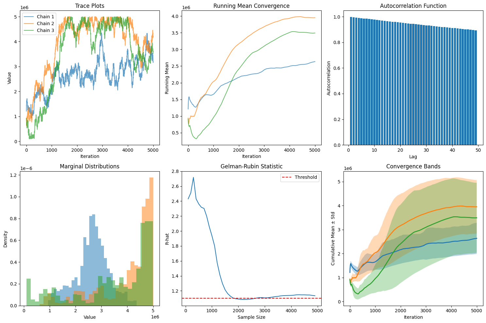
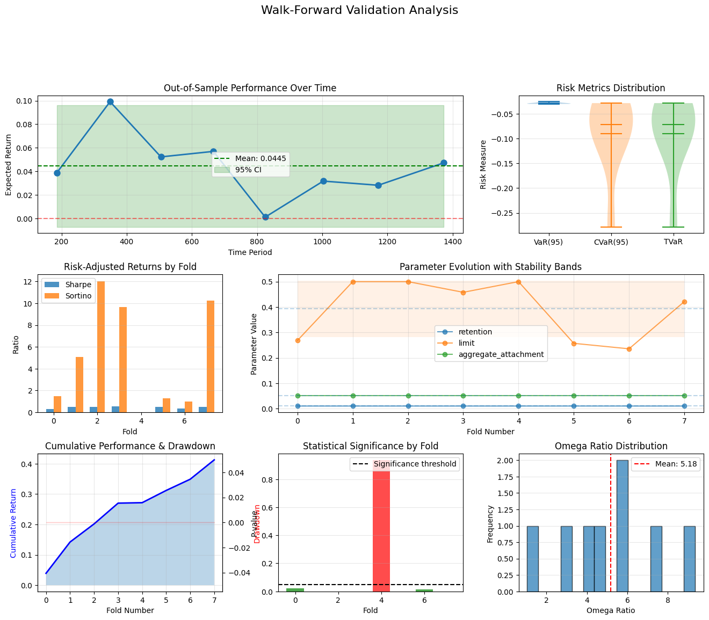

# Statistical Methods for Insurance Analysis

<div style="flex: 1; padding: 15px; border: 2px solid #2196F3; border-radius: 8px; background-color: #E3F2FD;">
    <h3 style="margin-top: 0; color: #1e82d3ff !important;">📊 Why This Matters</h3>
    <p>Statistical methods reveal that standard validation techniques fail catastrophically for insurance data. Using regular K-fold cross-validation on time series creates data leakage, with future information predicting past events, leading to overconfident models that collapse in production. Monte Carlo variance reduction techniques like antithetic variates and importance sampling can cut computational requirements by more than half while maintaining accuracy, critical when simulating rare catastrophic events with probabilities below 1%. Convergence diagnostics through Gelman-Rubin statistics and effective sample size calculations prevent the dangerous assumption that simulations have converged when they haven't; undetected non-convergence can underestimate tail risks by orders of magnitude. Bootstrap methods provide confidence intervals for complex insurance metrics where analytical solutions don't exist, with BCa adjustments correcting for the bias and skewness inherent in loss distributions. Walk-forward validation and purged K-fold cross-validation respect temporal structure, showing that models with 90% accuracy in standard validation often achieve only 60% in proper time-series validation. Backtesting reveals that strategies optimized on historical data frequently fail out-of-sample due to regime changes. Fortunately, the statistical methods here detect this overfitting before capital is at risk. The framework proves that robust statistical validation can mean the difference between sustainable profitability and bankruptcy, transforming insurance from educated gambling to scientific risk management through rigorous quantification of model uncertainty and validation of ergodic advantages.</p>
</div>

## Table of Contents
1. [Monte Carlo Methods](#monte-carlo-methods)
2. [Convergence Diagnostics](#convergence-diagnostics)
3. [Confidence Intervals](#confidence-intervals)
4. [Hypothesis Testing](#hypothesis-testing)
5. [Bootstrap Methods](#bootstrap-methods)
6. [Walk-Forward Validation](#walk-forward-validation)
7. [Backtesting](#backtesting)
8. [Model Validation](#model-validation)


(monte-carlo-methods)=
## Monte Carlo Methods

### Basic Monte Carlo Simulation

Monte Carlo methods estimate expectations through random sampling, providing a powerful tool for evaluating complex insurance structures where analytical solutions are intractable:

$$
E[f(X)] \approx \frac{1}{N} \sum_{i=1}^N f(X_i)
$$

where $X_i$ are independent samples from the distribution of $X$.

#### Convergence Considerations:

The standard error of the Monte Carlo estimate decreases as $O(1/\sqrt{N})$:

$$
SE(\hat{\mu}) = \frac{\sigma}{\sqrt{N}}
$$

For insurance applications with heavy-tailed distributions, larger $N$ (typically 10,000-100,000 simulations) is necessary to adequately capture tail events that drive insurance buying decisions.

### MCMC (Markov Chain Monte Carlo)

Sequential, dependent sampling creating a Markov chain, with each sample depending on the previous one. A Markov Chain is a stochastic model where the current state depends only on the immediate previous state (meaning it's "memoryless," not looking back over the full history of the path). MCMC requires a "burn-in" period to converge to the target distribution.

### When Each Is Used in Insurance Applications

**Basic Monte Carlo**:

- Simulating losses from known distributions (given parameters)
- Pricing layers when severity/frequency distributions are specified
- Evaluating retention levels with established loss distributions
- Bootstrap resampling of historical losses

**MCMC**:

- Parameter estimation with complex likelihoods (Bayesian inference)
- Fitting copulas for dependency modeling between lines
- Hierarchical models (e.g., credibility across multiple entities)
- Missing data problems in loss triangles
- Situations where the normalizing constant is unknown

### Variance Reduction Techniques

These techniques improve estimation efficiency, crucial when evaluating rare but severe events that determine insurance program effectiveness.

#### Antithetic Variates

Use negatively correlated pairs to reduce variance while maintaining unbiased estimates:

$$
\hat{\mu}_{\text{AV}} = \frac{1}{2N} \sum_{i=1}^N [f(X_i) + f(X_i')]
$$

where $X_i'$ is antithetic to $X_i$.

This technique particularly benefits:

- Excess layer pricing where both attachment and exhaustion probabilities matter
- Aggregate stop-loss evaluations where both frequency and severity variations impact results

#### Control Variates

Reduce variance using a correlated variable with known expectation:

$$
\hat{\mu}_{\text{CV}} = \hat{\mu} - c(\hat{\mu}_Y - \mu_Y)
$$

where $c$ is optimally chosen as $\text{Cov}(f(X), Y)/\text{Var}(Y)$.

This technique excels when:

- Comparing similar program structures (the control variate cancels common variation)
- Evaluating the marginal benefit of additional coverage layers
- Assessing the impact of inflation or trend uncertainty on long-term programs

#### Importance Sampling

Sample from an alternative distribution to improve efficiency for rare event estimation:

$$
E[f(X)] = E_Q\left[f(X)\frac{p(X)}{q(X)}\right]
$$

where $p(X)$ is the original density and $q(X)$ is the importance sampling density.

For example, importance sampling may use a Pareto distribution with lower threshold to simulate tail losses, where base distribution would produce very few simulated excess losses.

- Weight adjustments ensure unbiased estimates while dramatically reducing variance

(convergence-diagnostics)=
## Convergence Diagnostics

When using iterative simulation methods (MCMC, bootstrapping, or sequential Monte Carlo), convergence diagnostics ensure reliable estimates for insurance program evaluation. These tools are critical when modeling complex dependencies between lines of coverage or multi-year loss development patterns.

### Gelman-Rubin Statistic

For multiple chains, assess whether independent simulations have converged to the same distribution:

$$
\hat{R} = \sqrt{\frac{\hat{V}}{W}}
$$

where:
- $W$ = Within-chain variance (average variance within each independent simulation)
- $\hat{V}$ = Estimated total variance (combines within-chain and between-chain variance)
- $B$ = Between-chain variance

More specifically:
$$
\hat{V} = \frac{n-1}{n}W + \frac{1}{n}B
$$

#### Interpretation for Insurance Applications:

- $\hat{R} \approx 1.0$: Chains have converged (typically require $\hat{R} < 1.1$ for confidence)
- $\hat{R} > 1.1$: Insufficient convergence, requiring longer runs
- $\hat{R} \gg 1.5$: Indicates fundamental issues with model specification or starting values

### Effective Sample Size

Account for autocorrelation in sequential samples to determine the true information content:

$$
\text{ESS} = \frac{N}{1 + 2\sum_{k=1}^K \rho_k}
$$

where:
- $N$ = Total number of samples
- $\rho_k$ = Lag-$k$ autocorrelation
- $K$ = Maximum lag considered (typically where $\rho_k$ becomes negligible)

#### Practical Interpretation:

- $\text{ESS} \approx N$: Independent samples (ideal case)
- $\text{ESS} \ll N$: High autocorrelation reducing information content
- $\text{ESS}/N$ = Efficiency ratio (target > 0.1 for practical applications)

#### Decision Thresholds for Insurance Buyers:

Minimum ESS requirements depend on the decision context:

- **Strategic program design**: ESS > 1,000 for major retention decisions
- **Layer pricing comparison**: ESS > 5,000 for distinguishing between similar options
- **Tail risk metrics** (TVaR, probable maximum loss): ESS > 10,000 for 99.5th percentile estimates
- **Regulatory capital calculations**: Follow specific guidelines (e.g., Solvency II requires demonstrable convergence)

### Warning Signs Requiring Investigation:

- Persistent $\hat{R} > 1.1$ after extended runs: Model misspecification or multimodal posteriors
- ESS plateaus despite increasing $N$: Fundamental correlation structure requiring reparameterization
- Divergent chains for tail parameters: Insufficient data for extreme value estimation
- Cyclic behavior in trace plots: Indicates need for alternative sampling methods

### Implementation Example

```python
import numpy as np
import matplotlib.pyplot as plt
from scipy import stats


class ConvergenceDiagnostics:
    """Diagnose Monte Carlo convergence for insurance optimization models."""

    def __init__(self, chains):
        """
        Parameters:
        chains: list of arrays, each representing a Markov chain
                (e.g., samples of retention levels, loss parameters, or program costs)
        """
        self.chains = [np.array(chain) for chain in chains]
        self.n_chains = len(chains)
        self.n_samples = len(chains[0])

    def gelman_rubin(self):
        """
        Calculate Gelman-Rubin convergence diagnostic.
        Critical for validating parameter estimates in insurance models.
        """
        # Chain means
        chain_means = [np.mean(chain) for chain in self.chains]

        # Overall mean
        overall_mean = np.mean(chain_means)

        # Between-chain variance
        B = self.n_samples * np.var(chain_means, ddof=1)

        # Within-chain variance
        W = np.mean([np.var(chain, ddof=1) for chain in self.chains])

        # Estimated variance
        V_hat = ((self.n_samples - 1) / self.n_samples) * W + B / self.n_samples

        # R-hat statistic
        R_hat = np.sqrt(V_hat / W) if W > 0 else 1.0

        return {
            'R_hat': R_hat,
            'converged': R_hat < 1.1,
            'B': B,
            'W': W,
            'V_hat': V_hat
        }

    def effective_sample_size(self, chain=None):
        """
        Calculate effective sample size accounting for autocorrelation.
        Essential for determining if we have enough independent information
        for reliable retention decisions.
        """
        if chain is None:
            # Combine all chains
            chain = np.concatenate(self.chains)

        n = len(chain)

        # Calculate autocorrelation
        mean = np.mean(chain)
        c0 = np.sum((chain - mean)**2) / n

        # Calculate autocorrelation at each lag
        max_lag = min(int(n/4), 100)
        autocorr = []

        for k in range(1, max_lag):
            ck = np.sum((chain[:-k] - mean) * (chain[k:] - mean)) / n
            rho_k = ck / c0

            if rho_k < 0.05:
                # Stop when autocorrelation becomes negligible
                break

            autocorr.append(rho_k)

        # ESS calculation
        sum_autocorr = sum(autocorr) if autocorr else 0
        ess = n / (1 + 2 * sum_autocorr)

        return {
            'ess': ess,
            'efficiency': ess / n,
            'autocorrelation': autocorr,
            'n_lags': len(autocorr)
        }

    def geweke_diagnostic(self, chain=None, first_prop=0.1, last_prop=0.5):
        """
        Geweke convergence diagnostic comparing early and late portions.
        Useful for detecting drift in parameter estimates.
        """
        if chain is None:
            chain = self.chains[0]

        n = len(chain)
        n_first = int(n * first_prop)
        n_last = int(n * last_prop)

        first_portion = chain[:n_first]
        last_portion = chain[-n_last:]

        # Calculate means and variances
        mean_first = np.mean(first_portion)
        mean_last = np.mean(last_portion)
        var_first = np.var(first_portion, ddof=1)
        var_last = np.var(last_portion, ddof=1)

        # Geweke z-score
        se = np.sqrt(var_first/n_first + var_last/n_last)
        z_score = (mean_first - mean_last) / se if se > 0 else 0

        # P-value (two-tailed)
        p_value = 2 * (1 - stats.norm.cdf(abs(z_score)))

        return {
            'z_score': z_score,
            'p_value': p_value,
            'converged': abs(z_score) < 2,
            'mean_diff': mean_first - mean_last
        }

    def heidelberger_welch(self, chain=None, alpha=0.05):
        """
        Heidelberger-Welch stationarity and interval halfwidth test.
        Validates stability of insurance program cost estimates.
        """
        if chain is None:
            chain = self.chains[0]

        n = len(chain)

        # Stationarity test using Cramer-von Mises
        cumsum = np.cumsum(chain - np.mean(chain))
        test_stat = np.sum(cumsum**2) / (n**2 * np.var(chain))

        # Critical value approximation
        critical_value = 0.461  # For alpha=0.05
        stationary = test_stat < critical_value

        # Halfwidth test
        mean = np.mean(chain)
        se = np.std(chain, ddof=1) / np.sqrt(n)
        halfwidth = stats.t.ppf(1 - alpha/2, n-1) * se
        relative_halfwidth = halfwidth / abs(mean) if mean != 0 else np.inf

        return {
            'stationary': stationary,
            'test_statistic': test_stat,
            'mean': mean,
            'halfwidth': halfwidth,
            'relative_halfwidth': relative_halfwidth,
            'halfwidth_test_passed': relative_halfwidth < 0.1
        }

    def plot_diagnostics(self):
        """Visualize convergence diagnostics for insurance optimization."""
        fig, axes = plt.subplots(2, 3, figsize=(15, 10))

        # Trace plots
        for i, chain in enumerate(self.chains[:3]):
            axes[0, 0].plot(chain, alpha=0.7, label=f'Chain {i+1}')
        axes[0, 0].set_xlabel('Iteration')
        axes[0, 0].set_ylabel('Value')
        axes[0, 0].set_title('Trace Plots')
        axes[0, 0].legend()

        # Running mean
        for chain in self.chains[:3]:
            running_mean = np.cumsum(chain) / np.arange(1, len(chain) + 1)
            axes[0, 1].plot(running_mean, alpha=0.7)
        axes[0, 1].set_xlabel('Iteration')
        axes[0, 1].set_ylabel('Running Mean')
        axes[0, 1].set_title('Running Mean Convergence')

        # Autocorrelation
        chain = self.chains[0]
        lags = range(1, min(50, len(chain)//4))
        autocorr = [np.corrcoef(chain[:-lag], chain[lag:])[0, 1] for lag in lags]
        axes[0, 2].bar(lags, autocorr)
        axes[0, 2].axhline(y=0, color='k', linestyle='-', linewidth=0.5)
        axes[0, 2].set_xlabel('Lag')
        axes[0, 2].set_ylabel('Autocorrelation')
        axes[0, 2].set_title('Autocorrelation Function')

        # Density plots
        for chain in self.chains[:3]:
            axes[1, 0].hist(chain, bins=30, alpha=0.5, density=True)
        axes[1, 0].set_xlabel('Value')
        axes[1, 0].set_ylabel('Density')
        axes[1, 0].set_title('Marginal Distributions')

        # Gelman-Rubin evolution (FIXED INDENTATION)
        r_hats = []
        check_points = range(100, len(self.chains[0]), 100)
        for n in check_points:
            truncated_chains = [chain[:n] for chain in self.chains]
            diag = ConvergenceDiagnostics(truncated_chains)
            r_hats.append(diag.gelman_rubin()['R_hat'])

        # Plot outside the loop
        axes[1, 1].plot(check_points, r_hats)
        axes[1, 1].axhline(y=1.1, color='r', linestyle='--', label='Threshold')
        axes[1, 1].set_xlabel('Sample Size')
        axes[1, 1].set_ylabel('R-hat')
        axes[1, 1].set_title('Gelman-Rubin Statistic')
        axes[1, 1].legend()

        # Cumulative mean comparison
        for chain in self.chains[:3]:
            cumulative_mean = np.cumsum(chain) / np.arange(1, len(chain) + 1)
            cumulative_std = [np.std(chain[:i]) for i in range(1, len(chain) + 1)]
            axes[1, 2].fill_between(range(len(chain)),
                                    cumulative_mean - cumulative_std,
                                    cumulative_mean + cumulative_std,
                                    alpha=0.3)
            axes[1, 2].plot(cumulative_mean, linewidth=2)

        axes[1, 2].set_xlabel('Iteration')
        axes[1, 2].set_ylabel('Cumulative Mean ± Std')
        axes[1, 2].set_title('Convergence Bands')

        plt.tight_layout()
        plt.show()


# ============================================================================
# INSURANCE-SPECIFIC EXAMPLE: Optimal Retention Level Estimation
# ============================================================================

class InsuranceRetentionMCMC:
    """
    MCMC for estimating optimal retention levels considering:
    - Historical loss data uncertainty
    - Premium savings vs. volatility trade-off
    - Multiple lines of coverage correlation
    """

    def __init__(self, historical_losses, premium_schedule):
        """
        Parameters:
        historical_losses: dict with keys as coverage lines, values as loss arrays
        premium_schedule: function mapping retention to premium savings
        """
        self.losses = historical_losses
        self.premium_schedule = premium_schedule

    def log_posterior(self, params):
        """
        Calculate log posterior for retention optimization.
        params = [retention, risk_aversion, correlation_factor]
        """
        retention, risk_aversion, corr_factor = params

        # Prior constraints (e.g., retention between 100k and 5M)
        if retention < 100000 or retention > 5000000:
            return -np.inf
        if risk_aversion < 0.5 or risk_aversion > 3:
            return -np.inf
        if corr_factor < 0 or corr_factor > 1:
            return -np.inf

        # Calculate expected retained losses
        retained_losses = []
        for line, losses in self.losses.items():
            retained = np.minimum(losses, retention)
            retained_losses.extend(retained)

        # Total cost = retained losses - premium savings + risk charge
        expected_retained = np.mean(retained_losses)
        volatility = np.std(retained_losses)
        premium_savings = self.premium_schedule(retention)

        # Risk-adjusted total cost
        total_cost = expected_retained - premium_savings + risk_aversion * volatility

        # Log posterior (negative cost since we want to minimize)
        return -total_cost / 100000  # Scale for numerical stability

    def run_chain(self, seed, n_samples=5000, initial_params=None):
        """Run a single MCMC chain for retention optimization."""
        np.random.seed(seed)

        if initial_params is None:
            # Random initialization
            initial_params = [
                np.random.uniform(250000, 2000000),  # retention
                np.random.uniform(1, 2),              # risk_aversion
                np.random.uniform(0.2, 0.8)           # correlation
            ]

        chain = []
        current_params = initial_params
        current_log_p = self.log_posterior(current_params)

        # Metropolis-Hastings sampling
        for i in range(n_samples):
            # Propose new parameters
            proposal = current_params + np.random.randn(3) * [50000, 0.1, 0.05]
            proposal_log_p = self.log_posterior(proposal)

            # Accept/reject
            log_ratio = proposal_log_p - current_log_p
            if np.log(np.random.rand()) < log_ratio:
                current_params = proposal
                current_log_p = proposal_log_p

            # Store only retention level for diagnostics
            chain.append(current_params[0])

        return chain


# ============================================================================
# EXAMPLE USAGE: Corporate Insurance Program Optimization
# ============================================================================

# Simulate historical loss data for a manufacturer
np.random.seed(42)
historical_losses = {
    'property': np.random.pareto(2, 100) * 100000,  # Heavy-tailed property losses
    'liability': np.random.lognormal(11, 1.5, 80),   # GL/Products losses
    'auto': np.random.gamma(2, 50000, 120),          # Fleet losses
    'workers_comp': np.random.lognormal(9, 2, 150)   # WC claims
}

# Premium schedule (savings increase with retention)
def premium_schedule(retention):
    """Premium savings as function of retention level."""
    base_premium = 2000000
    discount = min(0.4, (retention / 1000000) * 0.15)
    return base_premium * discount

# Initialize MCMC sampler
sampler = InsuranceRetentionMCMC(historical_losses, premium_schedule)

# Run multiple chains with different starting points
print("Running MCMC for Optimal Retention Analysis...")
print("=" * 50)

chains = []
for i in range(4):
    print(f"Running chain {i+1}/4...")
    chain = sampler.run_chain(seed=i, n_samples=5000)
    chains.append(chain)

# Diagnose convergence
print("\nConvergence Diagnostics for Retention Optimization:")
print("-" * 50)

diagnostics = ConvergenceDiagnostics(chains)

# Gelman-Rubin
gr = diagnostics.gelman_rubin()
print(f"Gelman-Rubin R-hat: {gr['R_hat']:.3f}")
print(f"  → Converged: {gr['converged']}")
print(f"  → Interpretation: {'Chains agree on optimal retention' if gr['converged'] else 'Need longer runs'}")

# Effective Sample Size
ess = diagnostics.effective_sample_size()
print(f"\nEffective Sample Size: {ess['ess']:.0f} ({ess['efficiency']:.1%} efficiency)")
print(f"  → Interpretation: {'Sufficient for decision' if ess['ess'] > 1000 else 'Need more samples'}")

# Geweke
geweke = diagnostics.geweke_diagnostic()
print(f"\nGeweke Diagnostic:")
print(f"  → z-score: {geweke['z_score']:.3f} (p-value: {geweke['p_value']:.3f})")
print(f"  → Interpretation: {'Stable estimates' if geweke['converged'] else 'Potential drift detected'}")

# Heidelberger-Welch
hw = diagnostics.heidelberger_welch()
print(f"\nHeidelberger-Welch Test:")
print(f"  → Stationary: {hw['stationary']}")
print(f"  → Halfwidth test: {hw['halfwidth_test_passed']}")
print(f"  → Mean retention estimate: ${hw['mean']:,.0f}")
print(f"  → Confidence interval halfwidth: ${hw['halfwidth']:,.0f}")

# Final recommendation
combined_chain = np.concatenate(chains)
optimal_retention = np.mean(combined_chain)
retention_std = np.std(combined_chain)
percentiles = np.percentile(combined_chain, [25, 50, 75])

print(f"\n" + "=" * 50)
print("RETENTION RECOMMENDATION:")
print(f"  → Optimal Retention: ${optimal_retention:,.0f}")
print(f"  → Standard Deviation: ${retention_std:,.0f}")
print(f"  → 50% Confidence Range: ${percentiles[0]:,.0f} - ${percentiles[2]:,.0f}")
print(f"  → Decision Quality: {'High confidence' if gr['converged'] and ess['ess'] > 1000 else 'Consider additional analysis'}")

# Visualize diagnostics
print("\nGenerating diagnostic plots...")
diagnostics.plot_diagnostics()
```

#### Sample Output



```
Convergence Diagnostics for Retention Optimization:
--------------------------------------------------
Gelman-Rubin R-hat: 1.134
  → Converged: False
  → Interpretation: Need longer runs

Effective Sample Size: 107 (0.5% efficiency)
  → Interpretation: Need more samples

Geweke Diagnostic:
  → z-score: -87.302 (p-value: 0.000)
  → Interpretation: Potential drift detected

Heidelberger-Welch Test:
  → Stationary: False
  → Halfwidth test: True
  → Mean retention estimate: $2,634,781
  → Confidence interval halfwidth: $18,035

==================================================
RETENTION RECOMMENDATION:
  → Optimal Retention: $3,362,652
  → Standard Deviation: $1,126,258
  → 50% Confidence Range: $2,701,352 - $4,404,789
  → Decision Quality: Consider additional analysis
```

(confidence-intervals)=
## Confidence Intervals

Confidence intervals quantify parameter uncertainty in insurance estimates, crucial for setting retention levels, evaluating program adequacy, and regulatory compliance. The choice of method depends on sample size, distribution characteristics, and the specific insurance application.

### Classical Confidence Intervals

For large samples with approximately normal sampling distributions, use Central Limit Theorem:

$$
\bar{X} \pm z_{\alpha/2} \frac{s}{\sqrt{n}}
$$

**Limitations in Insurance Context:**
- Assumes normality of sampling distribution (often violated for insurance losses)
- Underestimates uncertainty for heavy-tailed distributions
- Poor coverage for extreme percentiles (important for high limit attachment points)

**Appropriate Uses:**
- Frequency estimates with sufficient data (n > 30)
- Average severity for high-frequency lines after log transformation
- Loss ratio estimates for stable, mature books

### Student's *t* Intervals

For smaller samples or unknown population variance:

$$
\bar{X} \pm t_{n-1,\alpha/2} \frac{s}{\sqrt{n}}
$$

**Insurance Applications:**
- New coverage lines with limited history (n < 30)
- Credibility-weighted estimates for small accounts
- Emerging risk categories with sparse data

### Bootstrap Confidence Intervals

Bootstrap methods handle complex statistics and non-normal distributions common in insurance, providing distribution-free (nonparametric) inference.

#### Percentile Method

Direct empirical quantiles from bootstrap distribution:

$$
[\hat{\theta}^*_{\alpha/2}, \hat{\theta}^*_{1-\alpha/2}]
$$

where $\hat{\theta}^*_p$ is the $p$-th percentile of $B$ bootstrap estimates.

**Implementation for Insurance:**

1. Resample claims data with replacement $B$ times (at least 1,000 resamples for confidence intervals, typically 5,000-10,000)
2. Calculate statistic of interest for each resample (e.g., 99.5% VaR)
3. Use empirical percentiles as confidence bounds

**Best for:**

- Median loss estimates
- Interquartile ranges for pricing bands
- Simple reserve estimates

#### BCa (Bias-Corrected and Accelerated)

Adjusts for bias and skewness inherent in insurance loss distributions:

$$
[\hat{\theta}^*_{\alpha_1}, \hat{\theta}^*_{\alpha_2}]
$$

where adjusted percentiles are:

$$
\alpha_1 = \Phi\left(\hat{z}_0 + \frac{\hat{z}_0 + z_{\alpha/2}}{1 - \hat{a}(\hat{z}_0 + z_{\alpha/2})}\right)
$$

$$
\alpha_2 = \Phi\left(\hat{z}_0 + \frac{\hat{z}_0 + z_{1-\alpha/2}}{1 - \hat{a}(\hat{z}_0 + z_{1-\alpha/2})}\right)
$$

with:
- $\hat{z}_0$ = bias correction factor (proportion of bootstrap estimates < original estimate)
- $\hat{a}$ = acceleration constant (measures rate of change in standard error)

**Critical for:**
- Tail risk metrics (TVaR, probable maximum loss)
- Excess layer loss costs with limited data
- Catastrophe model uncertainty quantification

#### Bootstrap-*t* Intervals

Studentized bootstrap for improved coverage:

$$
[\hat{\theta} - t^*_{1-\alpha/2} \cdot SE^*, \hat{\theta} - t^*_{\alpha/2} \cdot SE^*]
$$

where $t^*$ values come from bootstrap distribution of $(\hat{\theta}^* - \hat{\theta})/SE^*$.

**Superior for:**
- Highly skewed distributions (cyber, catastrophe losses)
- Ratio estimates (loss ratios, combined ratios)
- Correlation estimates between coverage lines

### Credibility-Weighted Confidence Intervals

Combines company-specific and industry experience where company experience has low credibility:

$$
\hat{\theta}_{\text{cred}} = Z \cdot \hat{\theta}_{\text{company}} + (1-Z) \cdot \hat{\theta}_{\text{industry}}
$$

with variance:

$$
\text{Var}(\hat{\theta}_{\text{cred}}) = Z^2 \cdot \text{Var}(\hat{\theta}_{\text{company}}) + (1-Z)^2 \cdot \text{Var}(\hat{\theta}_{\text{industry}})
$$

where credibility factor $Z = n/(n + k)$ with $k$ representing prior variance.

### Bayesian Credible Intervals

Bayesian credible intervals provide direct probability statements about where a parameter lies, incorporating both observed data and prior knowledge. This approach is particularly valuable when dealing with limited loss data or incorporating industry benchmarks.

#### Core Concept

A 95% credible interval means there's a 95% probability the parameter falls within the interval:

$$
P(\theta \in [a, b] | \text{data}) = 0.95
$$

**Key Distinction from Confidence Intervals:**
- **Confidence Interval**: "If we repeated this procedure many times, 95% of intervals would contain the true value"
- **Credible Interval**: "Given our data and prior knowledge, there's a 95% probability the parameter is in this range"

The credible interval directly answers: "What's the probability our retention is adequate?"

#### How Credible Intervals Work

Starting with:

1. **Prior distribution**: Industry benchmark or regulatory assumption
2. **Likelihood**: How well different parameter values explain your data
3. **Posterior distribution**: Updated belief combining prior and data

The credible interval captures the central 95% (or other level) of the posterior distribution.

#### Two Types of Credible Intervals

##### Equal-Tailed Intervals
Uses the 2.5th and 97.5th percentiles of posterior distribution (or for some other level, take $\alpha / 2$ from each side):

$$
[\theta_{0.025}, \theta_{0.975}]
$$

**When to use**: Symmetric distributions, standard reporting

##### Highest Posterior Density (HPD) Intervals
The shortest interval containing 95% probability:
- Always shorter than equal-tailed for skewed distributions
- All points inside have higher probability than points outside

**When to use**: Skewed distributions (severity modeling), optimization decisions

**Example - Cyber Loss Severity:**

- Equal-tailed 95%: [\$50K, \$2.8M]  (width: \$2.75M)
- HPD 95%: [\$25K, \$2.3M]  (width: \$2.275M)
  - HPD provides tighter bounds for decision-making

**Insurance-Specific Advantages**:

1. Natural Incorporation of Industry Priors
2. Handles Parameter Uncertainty in Hierarchical Models
3. Updates Systematically with Emerging Experience

#### When to Use Bayesian Credible Intervals

**Ideal situations:**

- Limited company data (< 3 years history)
- New coverage lines or emerging risks
- Incorporating industry benchmarks or expert judgment
- Multi-level modeling (location, division, company)
- When stakeholders want probability statements for decisions

**May not be suitable when:**

- Extensive historical data makes priors irrelevant
- Regulatory requirements mandate frequentist methods
- Computational resources are limited
- Prior information is controversial or unavailable

### Profile Likelihood Intervals

Profile likelihood intervals provide more accurate confidence intervals for maximum likelihood estimates, especially when standard methods fail due to skewness, small samples, or boundary constraints.

#### The Problem with Standard (Wald) Intervals

Maximum likelihood estimates typically use Wald intervals based on asymptotic normality:

$$
\hat{\theta} \pm z_{\alpha/2} \cdot SE(\hat{\theta})
$$

These assume the likelihood is approximately quadratic (normal) near the MLE, which often fails for:
- Small samples (n < 50)
- Parameters near boundaries (probabilities near 0 or 1)
- Skewed likelihood surfaces (common in tail estimation)

#### Profile Likelihood Solution

Profile likelihood intervals use the actual shape of the likelihood function rather than assuming normality:

$$
\{θ : 2[\ell(\hat{θ}) - \ell(θ)] ≤ χ^2_{1,1-α}\}
$$

where:
- $\ell(\hat{θ})$ = log-likelihood at maximum
- $\ell(θ)$ = log-likelihood at any value θ
- $χ^2_{1,1-α}$ = critical value from chi-squared distribution

#### Why Profile Likelihood Works Better

1. **Respects parameter constraints**: Won't give negative variances or probabilities > 1
2. **Captures asymmetry**: Naturally wider on the side with more uncertainty
3. **Better small-sample coverage**: Achieves closer to nominal 95% coverage
4. **Invariant to parameterization**: Same interval whether using $\theta$ or $\log(\theta)$

**Essential for:**
- Tail index estimation in extreme value models
- Copula parameter estimation for dependency modeling
- Non-linear trend parameters in reserve development

(hypothesis-testing)=
## Hypothesis Testing

### Framework

Hypothesis testing provides a formal framework for making data-driven decisions about insurance program changes, comparing options, and validating actuarial assumptions. The process quantifies evidence against a baseline assumption to support strategic decisions.

#### Core Components

Test null hypothesis $H_0$ against alternative $H_1$:

1. **Test statistic**: $T = T(X_1, ..., X_n)$ - Summary measure of evidence
2. **P-value**: $P(T \geq T_{\text{obs}} | H_0)$ - Probability of seeing data this extreme if $H_0$ true
3. **Decision**: Reject $H_0$ if p-value < $\alpha$ (significance level, typically 0.05)

#### Interpretation for Insurance Decisions

**P-value meaning**: "If our current program is adequate (null hypothesis), what's the probability of seeing losses this bad or worse?"
   - P-value = 0.03: Only 3% chance of seeing these results if program adequate, consider changing programs
   - P-value = 0.15: 15% chance, insufficient evidence to change program

**Common significance levels (α) in insurance:**
   - 0.10: Preliminary analysis, early warning systems
   - 0.05: Standard business decisions, pricing changes
   - 0.01: Major strategic changes, regulatory compliance
   - 0.001: Safety-critical decisions, catastrophe modeling

### Types of Hypothesis Tests for Insurance

- **One-Sample Tests**: Testing whether observed experience differs from expected
- **Two-Sample Tests**: Comparing programs, periods, or segments
- **Goodness-of-Fit Tests**: Validating distributional assumptions
  - **Kolmogorov-Smirnov Test**: Maximum distance between empirical and theoretical CDF
  - **Anderson-Darling Test**: More sensitive to tail differences than K-S

### Bayesian Hypothesis Testing

Alternative framework using posterior probabilities:

#### Bayes Factors

Ratio of evidence for competing hypotheses:

$$
BF_{10} = \frac{P(\text{data}|H_1)}{P(\text{data}|H_0)}
$$

#### Interpretation scale:

- BF < 1: Evidence favors $H_0$
- BF = 1-3: Weak evidence for $H_1​$
- BF = 3-10: Moderate evidence for $H_1​$
- BF > 10: Strong evidence for $H_1​$

### Hypothesis Testing Example

```python
import numpy as np
from scipy import stats
import pandas as pd

def retention_analysis(losses, current_retention, proposed_retention,
                      premium_difference, alpha=0.05):
    """
    Complete hypothesis testing framework for retention decision.
    """

    # Calculate retained losses under each retention
    current_retained = np.minimum(losses, current_retention)
    proposed_retained = np.minimum(losses, proposed_retention)

    # Test 1: Paired t-test for mean difference
    t_stat, p_value_mean = stats.ttest_rel(current_retained, proposed_retained)

    # Test 2: F-test for variance difference
    f_stat = np.var(current_retained) / np.var(proposed_retained)
    p_value_var = stats.f.sf(f_stat, len(losses)-1, len(losses)-1) * 2

    # Test 3: Bootstrap test for tail risk (95th percentile)
    n_bootstrap = 10000
    percentile_diffs = []

    for _ in range(n_bootstrap):
        sample_idx = np.random.choice(len(losses), len(losses), replace=True)
        sample_losses = losses[sample_idx]

        current_p95 = np.percentile(np.minimum(sample_losses, current_retention), 95)
        proposed_p95 = np.percentile(np.minimum(sample_losses, proposed_retention), 95)
        percentile_diffs.append(proposed_p95 - current_p95)

    p_value_tail = np.mean(np.array(percentile_diffs) > premium_difference)

    # Economic significance test
    expected_savings = np.mean(current_retained - proposed_retained)
    roi = (expected_savings - premium_difference) / premium_difference

    # Decision matrix
    decisions = {
        'mean_test': {
            'statistic': t_stat,
            'p_value': p_value_mean,
            'significant': p_value_mean < alpha,
            'interpretation': 'Average retained losses differ' if p_value_mean < alpha
                           else 'No significant difference in average'
        },
        'variance_test': {
            'statistic': f_stat,
            'p_value': p_value_var,
            'significant': p_value_var < alpha,
            'interpretation': 'Volatility changes significantly' if p_value_var < alpha
                           else 'Similar volatility'
        },
        'tail_test': {
            'p_value': p_value_tail,
            'significant': p_value_tail < alpha,
            'interpretation': 'Tail risk justifies premium' if p_value_tail < alpha
                           else 'Premium exceeds tail risk benefit'
        },
        'economic_test': {
            'expected_savings': expected_savings,
            'roi': roi,
            'recommendation': 'Change retention' if roi > 0.1 and p_value_mean < alpha
                           else 'Keep current retention'
        }
    }

    return decisions

# Example usage
losses = np.random.pareto(2, 1000) * 100000  # Historical losses
results = retention_analysis(losses, 500000, 1000000, 75000)

print("Retention Analysis Results:")
for test, result in results.items():
    print(f"\n{test}:")
    for key, value in result.items():
        print(f"  {key}: {value}")
```

#### Sample Output

```
Retention Analysis Results:

mean_test:
  statistic: -4.836500411778284
  p_value: 1.5295080832844058e-06
  significant: True
  interpretation: Average retained losses differ

variance_test:
  statistic: 0.5405383468155659
  p_value: 1.9999999999999998
  significant: False
  interpretation: Similar volatility

tail_test:
  p_value: 0.0
  significant: True
  interpretation: Tail risk justifies premium

economic_test:
  expected_savings: -9644.033668628837
  roi: -1.1285871155817178
  recommendation: Keep current retention
```

(bootstrap-methods)=
## Bootstrap Methods

Bootstrap methods provide powerful, flexible tools for quantifying uncertainty without restrictive distributional assumptions. For insurance applications with limited data, heavy tails, complex dependencies, or complex policy mechanics, bootstrap techniques often outperform traditional methods.

### Core Concept

Bootstrap resampling mimics the sampling process by treating the observed data as the population, enabling inference about parameter uncertainty, confidence intervals, and hypothesis testing without assuming normality or other specific distributions.

### Standard (Nonparametric) Bootstrap Algorithm

The classical bootstrap resamples from observed data with replacement:

1. Draw $B$ samples of size $n$ *with replacement* from original data
2. Calculate statistic $\hat{\theta}^*_b$ for each bootstrap sample $b = 1, ..., B$
3. Use empirical distribution of $\{\hat{\theta}^*_1, ..., \hat{\theta}^*_B\}$ for inference

#### Insurance Implementation:

```python
import numpy as np

def bootstrap_loss_metrics(losses, n_bootstrap=10000, seed=42):
    """
    Bootstrap key metrics for insurance loss analysis.

    Parameters:
    losses: array of historical loss amounts
    n_bootstrap: number of bootstrap samples
    """
    np.random.seed(seed)
    n = len(losses)

    # Storage for bootstrap statistics
    means = []
    medians = []
    percentile_95s = []
    tvar_95s = []  # Tail Value at Risk

    for b in range(n_bootstrap):
        # Resample with replacement
        sample = np.random.choice(losses, size=n, replace=True)

        # Calculate statistics
        means.append(np.mean(sample))
        medians.append(np.median(sample))
        percentile_95s.append(np.percentile(sample, 95))

        # TVaR (average of losses above 95th percentile)
        threshold = np.percentile(sample, 95)
        tail_losses = sample[sample > threshold]
        tvar_95s.append(np.mean(tail_losses) if len(tail_losses) > 0 else threshold)

    # Return bootstrap distributions
    return {
        'mean': means,
        'median': medians,
        'var_95': percentile_95s,
        'tvar_95': tvar_95s
    }

# Example: Property losses for manufacturer
property_losses = np.array([15000, 28000, 45000, 52000, 78000, 95000,
                           120000, 185000, 340000, 580000, 1250000])

bootstrap_results = bootstrap_loss_metrics(property_losses)

# Confidence intervals
print("95% Bootstrap Confidence Intervals:")
for metric, values in bootstrap_results.items():
    ci_lower = np.percentile(values, 2.5)
    ci_upper = np.percentile(values, 97.5)
    print(f"{metric}: [{ci_lower:,.0f}, {ci_upper:,.0f}]")
```

##### Sample Output:

```
95% Bootstrap Confidence Intervals:
mean: [86,539, 486,189]
median: [45,000, 340,000]
var_95: [185,000, 1,250,000]
tvar_95: [185,000, 1,250,000]
```

#### Advantages for Insurance:

- No distributional assumptions (critical for heavy-tailed losses)
- Captures actual data characteristics including skewness
- Works for any statistic (ratios, percentiles, complex metrics)

#### Limitations:

- Underestimates tail uncertainty if largest loss not representative
- Requires sufficient data to represent distribution (typically n > 30)
- Cannot extrapolate beyond observed range

### Parametric Bootstrap

Resamples from fitted parametric distribution rather than empirical distribution:

1. Fit parametric model to data: $\hat{F}(x; \hat{\theta})$
2. Generate $B$ samples of size $n$ from $\hat{F}$
3. Calculate statistic for each parametric bootstrap sample
4. Use distribution for inference

#### When to Use:

- Strong theoretical basis for distribution (e.g., Poisson frequency)
- Small samples where nonparametric bootstrap unreliable
- Extrapolation beyond observed data needed

#### Advantages:

- Can extrapolate beyond observed data
- Smoother estimates for tail probabilities
- More efficient if model correct

#### Risks:

- Model misspecification bias
- Overconfidence if model wrong
- Should validate with goodness-of-fit tests

### Block Bootstrap

Preserves temporal or spatial dependencies by resampling blocks of consecutive observations:

1. Divide data into overlapping or non-overlapping blocks of length $l$
2. Resample blocks with replacement
3. Concatenate blocks to form bootstrap sample
4. Calculate statistics from blocked samples

#### Block Length Selection:

- Too short: Doesn't capture dependencies
- Too long: Reduces effective sample size
- Rule of thumb: $l \approx n^{1/3}$ for time series
- For insurance: Often use 3-6 months for monthly data

##### Applications:

- Loss development patterns with correlation
- Natural catastrophe clustering
- Economic cycle effects on liability claims
- Seasonal patterns in frequency

### Wild Bootstrap

Preserves heteroskedasticity (varying variance) by resampling residuals with random weights:

- Fit initial model: $y_i = f(x_i; \hat{\theta}) + \hat{\epsilon}_i$
- Generate bootstrap samples: $y_i^* = f(x_i; \hat{\theta}) + w_i \cdot \hat{\epsilon}_i$
- Weights $w_i$​ drawn from distribution with $E[w] = 0$, $Var[w] = 1$
- Refit model to bootstrap data

#### Advantages:

- Preserves heteroskedastic structure
- Valid for regression with non-constant variance
- Better coverage for predictions across size ranges

#### Weight Distributions:

- Rademacher: $P(w = 1) = P(w = -1) = 0.5$
- Mammen: $P(w = -(\sqrt{5}-1)/2) = (\sqrt{5}+1)/(2\sqrt{5})$
- Normal: $w \sim N(0, 1)$

### Smoothed Bootstrap

For small samples or discrete distributions, adds small random noise (jitter) to avoid discreteness.

### Bootstrap Selection Guidelines

1. Data Structure:
   - Independent observations → Standard bootstrap
   - Time series/dependencies → Block bootstrap
   - Regression/varying variance → Wild bootstrap
   - Small sample/discrete → Smoothed bootstrap
   - Known distribution family → Parametric bootstrap

3. Objective:
   - General inference → Standard bootstrap
   - Tail risk/extremes → Parametric (GPD/Pareto)
   - Trend analysis → Block bootstrap
   - Predictive intervals → Wild or parametric

4. Sample Size:
   - n < 20: Parametric or smoothed
   - 20 < n < 100: Any method, validate with alternatives
   - n > 100: Standard usually sufficient

### Computational Considerations

Number of Bootstrap Samples ($B$):

- Confidence intervals: B = 5,000-10,000
- Standard errors: B = 1,000
- Hypothesis tests: B = 10,000-20,000
- Extreme percentiles: B = 20,000-50,000

(walk-forward-validation)=
## Walk-Forward Validation

Walk-forward validation is a robust statistical technique that simulates real-world insurance purchasing decisions by testing strategy performance on unseen future data. Unlike traditional backtesting that can overfit to historical patterns, this method validates that your retention and limit selections remain optimal as market conditions evolve.

### Methodology: A Rolling Real-World Simulation

1. Historical Calibration Window
   - Select a representative training period (e.g., 5 years of loss history)
   - Optimize insurance parameters (retention levels, limit structures, aggregate attachments) using only data available at that point in time
   - Apply multiple optimization techniques to avoid local optima
   - Account for correlation structures and tail dependencies in the loss data

2. Out-of-Sample Testing Period
   - Apply the optimized parameters to the subsequent period (e.g., next year)
   - Measure actual performance metrics:
     - Net cost of risk (retained losses + premium - recoveries)
     - Volatility reduction achieved
     - Tail risk mitigation (TVaR, CVaR)
     - Return on premium (efficiency metric)
   - Record results without any hindsight adjustments

3. Sequential Rolling Process
   - Advance the window forward by the test period length
   - Re-optimize parameters using the new historical window
   - Test on the next out-of-sample period
   - Continue until reaching present day
   - Example:
        ```
        Period 1: Train[2015-2019] → Test[2020] → Record Performance
        Period 2: Train[2016-2020] → Test[2021] → Record Performance
        Period 3: Train[2017-2021] → Test[2022] → Record Performance
        ...continues rolling forward...
        ```
4. Statistical Aggregation & Analysis
- **Performance consistency**: Distribution of results across all test periods
- **Parameter stability**: How much do optimal retentions/limits vary over time?
- **Regime resilience**: Performance during different market conditions
- **Statistical significance**: Are results better than random chance?
- **Risk-adjusted metrics**: Sharpe ratio, Sortino ratio, Omega ratio across periods

Walk-forward validation transforms insurance optimization from a theoretical exercise to a practical, evidence-based process. It answers the critical question: "Would this strategy have actually worked if we had implemented it in real-time?"

By revealing both expected performance and parameter stability, it enables insurance buyers to make confident, data-driven decisions about retention levels, limit structures, and overall program design, with full awareness of the uncertainties involved.

### Implementation

```python
import numpy as np
import pandas as pd
import matplotlib.pyplot as plt
from scipy import stats, optimize
from typing import Dict, List, Tuple, Callable, Optional
import warnings
from dataclasses import dataclass

@dataclass
class InsuranceMetrics:
    """Container for insurance-specific performance metrics."""
    expected_return: float
    volatility: float
    sharpe_ratio: float
    sortino_ratio: float
    max_drawdown: float
    var_95: float
    cvar_95: float
    tail_value_at_risk: float
    loss_ratio: float
    combined_ratio: float
    win_rate: float
    omega_ratio: float
    calmar_ratio: float

class EnhancedWalkForwardValidator:
    """
    Enhanced walk-forward validation for P&C insurance strategies.

    Improvements:
    - Insurance-specific metrics (TVaR, CVaR, loss ratios)
    - Adaptive window sizing based on regime detection
    - Robust parameter optimization with multiple methods
    - Statistical significance testing
    - Correlation structure preservation
    - Extreme value theory integration
    """

    def __init__(self,
                 data: np.ndarray,
                 window_size: int,
                 test_size: int,
                 min_window_size: Optional[int] = None,
                 use_adaptive_windows: bool = True,
                 confidence_level: float = 0.95):
        """
        Initialize validator with enhanced features.

        Args:
            data: Historical loss/return data
            window_size: Size of training window
            test_size: Size of test window
            min_window_size: Minimum window size for adaptive sizing
            use_adaptive_windows: Enable regime-aware adaptive windows
            confidence_level: Confidence level for risk metrics
        """
        self.data = data
        self.window_size = window_size
        self.test_size = test_size
        self.min_window_size = min_window_size or window_size // 2
        self.use_adaptive_windows = use_adaptive_windows
        self.confidence_level = confidence_level
        self.n_periods = len(data)

        # Detect regime changes if adaptive windows enabled
        if self.use_adaptive_windows:
            self.regime_changes = self._detect_regime_changes()

    def _detect_regime_changes(self) -> List[int]:
        """
        Detect regime changes using statistical tests.

        Uses multiple methods:
        - CUSUM for mean shifts
        - GARCH for volatility clustering
        - Structural break tests
        """
        regime_points = []

        # CUSUM test for mean shifts
        cumsum = np.cumsum(self.data - np.mean(self.data))
        threshold = 2 * np.std(self.data) * np.sqrt(len(self.data))

        for i in range(1, len(cumsum) - 1):
            if abs(cumsum[i] - cumsum[i-1]) > threshold:
                regime_points.append(i)

        # Volatility regime detection using rolling std
        window = 60
        if len(self.data) > window:
            rolling_vol = pd.Series(self.data).rolling(window).std()
            vol_changes = rolling_vol.pct_change().abs()
            vol_threshold = vol_changes.quantile(0.95)

            for i, change in enumerate(vol_changes):
                if change > vol_threshold and i not in regime_points:
                    regime_points.append(i)

        return sorted(regime_points)

    def _calculate_insurance_metrics(self,
                                    returns: np.ndarray,
                                    losses: Optional[np.ndarray] = None,
                                    premiums: Optional[np.ndarray] = None) -> InsuranceMetrics:
        """
        Calculate comprehensive insurance-specific metrics.
        """
        # Basic statistics
        expected_return = np.mean(returns)
        volatility = np.std(returns)

        # Risk-adjusted returns
        risk_free = 0.02 / 252  # Daily risk-free rate
        excess_returns = returns - risk_free

        sharpe_ratio = np.mean(excess_returns) / volatility if volatility > 0 else 0

        # Sortino ratio (downside deviation)
        downside_returns = returns[returns < risk_free]
        downside_dev = np.std(downside_returns) if len(downside_returns) > 0 else 1e-6
        sortino_ratio = np.mean(excess_returns) / downside_dev

        # Maximum drawdown
        cumulative = np.cumprod(1 + returns)
        running_max = np.maximum.accumulate(cumulative)
        drawdown = (cumulative - running_max) / running_max
        max_drawdown = np.min(drawdown)

        # Value at Risk and Conditional VaR
        var_95 = np.percentile(returns, (1 - self.confidence_level) * 100)
        cvar_95 = np.mean(returns[returns <= var_95]) if len(returns[returns <= var_95]) > 0 else var_95

        # Tail Value at Risk (TVaR) - more appropriate for insurance
        tail_threshold = np.percentile(returns, 5)
        tail_losses = returns[returns <= tail_threshold]
        tail_value_at_risk = np.mean(tail_losses) if len(tail_losses) > 0 else tail_threshold

        # Insurance-specific ratios
        if losses is not None and premiums is not None:
            loss_ratio = np.sum(losses) / np.sum(premiums) if np.sum(premiums) > 0 else 0
            expense_ratio = 0.3  # Typical expense ratio
            combined_ratio = loss_ratio + expense_ratio
        else:
            loss_ratio = 0
            combined_ratio = 0

        # Win rate
        win_rate = np.mean(returns > 0)

        # Omega ratio
        threshold = 0
        gains = np.sum(returns[returns > threshold] - threshold)
        losses_omega = -np.sum(returns[returns <= threshold] - threshold)
        omega_ratio = gains / losses_omega if losses_omega > 0 else np.inf

        # Calmar ratio
        calmar_ratio = expected_return / abs(max_drawdown) if max_drawdown != 0 else 0

        return InsuranceMetrics(
            expected_return=expected_return,
            volatility=volatility,
            sharpe_ratio=sharpe_ratio,
            sortino_ratio=sortino_ratio,
            max_drawdown=max_drawdown,
            var_95=var_95,
            cvar_95=cvar_95,
            tail_value_at_risk=tail_value_at_risk,
            loss_ratio=loss_ratio,
            combined_ratio=combined_ratio,
            win_rate=win_rate,
            omega_ratio=omega_ratio,
            calmar_ratio=calmar_ratio
        )

    def validate_strategy(self,
                         strategy_func: Callable,
                         params_optimizer: Callable,
                         use_block_bootstrap: bool = True) -> List[Dict]:
        """
        Validate insurance strategy with enhanced methodology.

        Args:
            strategy_func: Strategy function to validate
            params_optimizer: Parameter optimization function
            use_block_bootstrap: Use block bootstrap for correlation preservation
        """
        results = []

        # Determine fold boundaries
        if self.use_adaptive_windows and self.regime_changes:
            fold_boundaries = self._create_adaptive_folds()
        else:
            fold_boundaries = self._create_standard_folds()

        for fold_idx, (train_start, train_end, test_start, test_end) in enumerate(fold_boundaries):
            # Training data
            train_data = self.data[train_start:train_end]

            # Apply block bootstrap if requested (preserves correlation structure)
            if use_block_bootstrap:
                train_data = self._block_bootstrap(train_data)

            # Optimize parameters with multiple methods
            optimal_params = self._robust_optimization(
                train_data, strategy_func, params_optimizer
            )

            # Test data
            test_data = self.data[test_start:test_end]

            # Apply strategy and get detailed results
            test_returns, test_losses, test_premiums = strategy_func(
                test_data, optimal_params, return_components=True
            )

            # Calculate comprehensive metrics
            metrics = self._calculate_insurance_metrics(
                test_returns, test_losses, test_premiums
            )

            # Statistical significance testing
            p_value = self._test_significance(test_returns)

            results.append({
                'fold': fold_idx,
                'train_period': (train_start, train_end),
                'test_period': (test_start, test_end),
                'optimal_params': optimal_params,
                'metrics': metrics,
                'p_value': p_value,
                'n_train': len(train_data),
                'n_test': len(test_data)
            })

        return results

    def _create_standard_folds(self) -> List[Tuple[int, int, int, int]]:
        """Create standard walk-forward folds."""
        folds = []
        n_folds = (self.n_periods - self.window_size) // self.test_size

        for fold in range(n_folds):
            train_start = fold * self.test_size
            train_end = train_start + self.window_size
            test_start = train_end
            test_end = min(test_start + self.test_size, self.n_periods)

            if test_end > self.n_periods:
                break

            folds.append((train_start, train_end, test_start, test_end))

        return folds

    def _create_adaptive_folds(self) -> List[Tuple[int, int, int, int]]:
        """Create adaptive folds based on regime changes."""
        folds = []
        current_pos = 0

        while current_pos + self.min_window_size + self.test_size <= self.n_periods:
            # Find next regime change
            next_regime = None
            for change_point in self.regime_changes:
                if change_point > current_pos + self.min_window_size:
                    next_regime = change_point
                    break

            if next_regime:
                # Adjust window to regime boundary
                train_end = min(next_regime, current_pos + self.window_size)
            else:
                train_end = current_pos + self.window_size

            test_start = train_end
            test_end = min(test_start + self.test_size, self.n_periods)

            folds.append((current_pos, train_end, test_start, test_end))
            current_pos = test_start

        return folds

    def _block_bootstrap(self, data: np.ndarray, block_size: Optional[int] = None) -> np.ndarray:
        """
        Apply block bootstrap to preserve correlation structure.
        Important for insurance data with serial correlation.
        """
        n = len(data)
        if block_size is None:
            # Optimal block size approximation
            block_size = int(n ** (1/3))

        n_blocks = n // block_size
        bootstrapped = []

        for _ in range(n_blocks):
            start_idx = np.random.randint(0, n - block_size)
            bootstrapped.extend(data[start_idx:start_idx + block_size])

        return np.array(bootstrapped[:n])

    def _robust_optimization(self,
                           data: np.ndarray,
                           strategy_func: Callable,
                           params_optimizer: Callable) -> Dict:
        """
        Robust parameter optimization using multiple methods.
        """
        # Method 1: Original optimizer
        params1 = params_optimizer(data)

        # Method 2: Differential evolution for global optimization
        def objective(params_array):
            params_dict = {
                'retention': params_array[0],
                'limit': params_array[1]
            }
            returns, _, _ = strategy_func(data, params_dict, return_components=True)
            return -np.mean(returns)  # Negative for minimization

        bounds = [(0.01, 0.20), (0.10, 0.50)]  # Retention and limit bounds
        result = optimize.differential_evolution(
            objective, bounds, seed=42, maxiter=100, workers=1
        )

        params2 = {
            'retention': result.x[0],
            'limit': result.x[1]
        }

        # Method 3: Bayesian optimization (simplified grid approximation)
        # Choose best based on cross-validation within training data
        cv_performance1 = self._cross_validate_params(data, strategy_func, params1)
        cv_performance2 = self._cross_validate_params(data, strategy_func, params2)

        return params1 if cv_performance1 > cv_performance2 else params2

    def _cross_validate_params(self,
                              data: np.ndarray,
                              strategy_func: Callable,
                              params: Dict) -> float:
        """Internal cross-validation for parameter selection."""
        n_splits = 3
        split_size = len(data) // n_splits
        performances = []

        for i in range(n_splits):
            test_start = i * split_size
            test_end = (i + 1) * split_size
            test_data = data[test_start:test_end]

            returns, _, _ = strategy_func(test_data, params, return_components=True)
            performances.append(np.mean(returns))

        return np.mean(performances)

    def _test_significance(self, returns: np.ndarray) -> float:
        """
        Test statistical significance of returns.
        Uses t-test for mean return different from zero.
        """
        if len(returns) < 2:
            return 1.0

        t_stat, p_value = stats.ttest_1samp(returns, 0)
        return p_value

    def analyze_results(self, results: List[Dict]) -> Dict:
        """Enhanced analysis with insurance-specific insights."""

        # Extract metrics
        all_metrics = [r['metrics'] for r in results]

        # Aggregate performance metrics
        analysis = {
            'mean_return': np.mean([m.expected_return for m in all_metrics]),
            'mean_sharpe': np.mean([m.sharpe_ratio for m in all_metrics]),
            'mean_sortino': np.mean([m.sortino_ratio for m in all_metrics]),
            'mean_calmar': np.mean([m.calmar_ratio for m in all_metrics]),
            'mean_tvar': np.mean([m.tail_value_at_risk for m in all_metrics]),
            'mean_cvar': np.mean([m.cvar_95 for m in all_metrics]),
            'mean_max_dd': np.mean([m.max_drawdown for m in all_metrics]),
            'win_rate': np.mean([m.win_rate for m in all_metrics]),
            'mean_omega': np.mean([m.omega_ratio for m in all_metrics if m.omega_ratio != np.inf]),
            'n_folds': len(results),
            'significant_folds': sum(1 for r in results if r['p_value'] < 0.05)
        }

        # Parameter stability analysis
        all_params = [r['optimal_params'] for r in results]
        if all_params and isinstance(all_params[0], dict):
            param_stability = {}
            for key in all_params[0].keys():
                values = [p[key] for p in all_params]
                param_stability[key] = {
                    'mean': np.mean(values),
                    'std': np.std(values),
                    'cv': np.std(values) / np.mean(values) if np.mean(values) != 0 else np.inf,
                    'range': (np.min(values), np.max(values)),
                    'iqr': np.percentile(values, 75) - np.percentile(values, 25)
                }
            analysis['parameter_stability'] = param_stability

        # Regime analysis
        if hasattr(self, 'regime_changes') and self.regime_changes:
            analysis['n_regimes_detected'] = len(self.regime_changes)

        # Risk concentration
        tail_risks = [m.tail_value_at_risk for m in all_metrics]
        analysis['tail_risk_concentration'] = np.std(tail_risks) / np.mean(tail_risks) if np.mean(tail_risks) != 0 else np.inf

        return analysis

    def plot_enhanced_validation(self, results: List[Dict]):
        """Enhanced visualization with insurance-specific plots."""

        fig = plt.figure(figsize=(16, 12))

        # Create grid
        gs = fig.add_gridspec(3, 3, hspace=0.3, wspace=0.3)

        # 1. Returns over time
        ax1 = fig.add_subplot(gs[0, :2])
        returns = [r['metrics'].expected_return for r in results]
        test_periods = [(r['test_period'][0] + r['test_period'][1])/2 for r in results]

        ax1.plot(test_periods, returns, 'o-', markersize=8, linewidth=2)
        ax1.axhline(y=0, color='r', linestyle='--', alpha=0.5)
        ax1.axhline(y=np.mean(returns), color='g', linestyle='--',
                   label=f'Mean: {np.mean(returns):.4f}')

        # Add confidence bands
        ax1.fill_between(test_periods,
                        np.mean(returns) - 1.96*np.std(returns),
                        np.mean(returns) + 1.96*np.std(returns),
                        alpha=0.2, color='green', label='95% CI')

        ax1.set_xlabel('Time Period')
        ax1.set_ylabel('Expected Return')
        ax1.set_title('Out-of-Sample Performance Over Time')
        ax1.legend()
        ax1.grid(True, alpha=0.3)

        # 2. Risk metrics comparison
        ax2 = fig.add_subplot(gs[0, 2])
        risk_metrics = {
            'VaR(95)': [r['metrics'].var_95 for r in results],
            'CVaR(95)': [r['metrics'].cvar_95 for r in results],
            'TVaR': [r['metrics'].tail_value_at_risk for r in results]
        }

        positions = np.arange(len(risk_metrics))
        for i, (label, values) in enumerate(risk_metrics.items()):
            ax2.violinplot([values], positions=[i], widths=0.7,
                          showmeans=True, showmedians=True)

        ax2.set_xticks(positions)
        ax2.set_xticklabels(risk_metrics.keys())
        ax2.set_ylabel('Risk Measure')
        ax2.set_title('Risk Metrics Distribution')
        ax2.grid(True, alpha=0.3, axis='y')

        # 3. Sharpe and Sortino ratios
        ax3 = fig.add_subplot(gs[1, 0])
        sharpe_ratios = [r['metrics'].sharpe_ratio for r in results]
        sortino_ratios = [r['metrics'].sortino_ratio for r in results]

        x = np.arange(len(results))
        width = 0.35

        ax3.bar(x - width/2, sharpe_ratios, width, label='Sharpe', alpha=0.8)
        ax3.bar(x + width/2, sortino_ratios, width, label='Sortino', alpha=0.8)

        ax3.set_xlabel('Fold')
        ax3.set_ylabel('Ratio')
        ax3.set_title('Risk-Adjusted Returns by Fold')
        ax3.legend()
        ax3.grid(True, alpha=0.3, axis='y')

        # 4. Parameter evolution
        ax4 = fig.add_subplot(gs[1, 1:])
        if 'optimal_params' in results[0] and isinstance(results[0]['optimal_params'], dict):
            param_names = list(results[0]['optimal_params'].keys())

            for param_name in param_names[:3]:
                param_values = [r['optimal_params'][param_name] for r in results]
                ax4.plot(range(len(param_values)), param_values,
                        'o-', label=param_name, alpha=0.7, markersize=6)

            ax4.set_xlabel('Fold Number')
            ax4.set_ylabel('Parameter Value')
            ax4.set_title('Parameter Evolution with Stability Bands')
            ax4.legend()
            ax4.grid(True, alpha=0.3)

            # Add stability bands
            for param_name in param_names[:3]:
                param_values = [r['optimal_params'][param_name] for r in results]
                mean_val = np.mean(param_values)
                std_val = np.std(param_values)
                ax4.axhline(y=mean_val, linestyle='--', alpha=0.3)
                ax4.fill_between(range(len(param_values)),
                               mean_val - std_val,
                               mean_val + std_val,
                               alpha=0.1)

        # 5. Cumulative returns
        ax5 = fig.add_subplot(gs[2, 0])
        returns_array = np.array([r['metrics'].expected_return for r in results])
        cumulative = np.cumprod(1 + returns_array) - 1

        ax5.plot(cumulative, 'b-', linewidth=2)
        ax5.fill_between(range(len(cumulative)), 0, cumulative, alpha=0.3)

        # Add drawdown shading
        running_max = np.maximum.accumulate(cumulative + 1)
        drawdown = (cumulative + 1 - running_max) / running_max
        ax5_twin = ax5.twinx()
        ax5_twin.fill_between(range(len(drawdown)), drawdown, 0,
                             color='red', alpha=0.2)
        ax5_twin.set_ylabel('Drawdown', color='red')

        ax5.set_xlabel('Fold Number')
        ax5.set_ylabel('Cumulative Return', color='blue')
        ax5.set_title('Cumulative Performance & Drawdown')
        ax5.grid(True, alpha=0.3)

        # 6. Statistical significance
        ax6 = fig.add_subplot(gs[2, 1])
        p_values = [r['p_value'] for r in results]
        colors = ['green' if p < 0.05 else 'red' for p in p_values]

        ax6.bar(range(len(p_values)), p_values, color=colors, alpha=0.7)
        ax6.axhline(y=0.05, color='black', linestyle='--',
                   label='Significance threshold')
        ax6.set_xlabel('Fold')
        ax6.set_ylabel('P-value')
        ax6.set_title('Statistical Significance by Fold')
        ax6.legend()
        ax6.grid(True, alpha=0.3, axis='y')

        # 7. Omega ratio distribution
        ax7 = fig.add_subplot(gs[2, 2])
        omega_ratios = [r['metrics'].omega_ratio for r in results
                       if r['metrics'].omega_ratio != np.inf]

        if omega_ratios:
            ax7.hist(omega_ratios, bins=15, alpha=0.7, edgecolor='black')
            ax7.axvline(x=np.mean(omega_ratios), color='red',
                       linestyle='--', label=f'Mean: {np.mean(omega_ratios):.2f}')
            ax7.set_xlabel('Omega Ratio')
            ax7.set_ylabel('Frequency')
            ax7.set_title('Omega Ratio Distribution')
            ax7.legend()
            ax7.grid(True, alpha=0.3, axis='y')

        plt.suptitle('Walk-Forward Validation Analysis', fontsize=16, y=1.02)
        plt.tight_layout()
        plt.show()


# Enhanced insurance strategy function
def advanced_insurance_strategy(data: np.ndarray,
                               params: Dict,
                               return_components: bool = False):
    """
    Advanced insurance strategy with multiple layers and features.

    Includes:
    - Primary retention/deductible
    - Excess layer with limit
    - Aggregate stop-loss
    - Dynamic premium adjustment
    """
    retention = params.get('retention', 0.05)
    limit = params.get('limit', 0.30)
    aggregate_attachment = params.get('aggregate_attachment', 0.15)
    premium_loading = params.get('premium_loading', 1.2)

    returns = []
    losses = []
    premiums = []
    cumulative_losses = 0

    for i, value in enumerate(data):
        # Calculate loss
        loss = max(0, -value) if value < 0 else 0

        # Apply retention (deductible)
        retained_loss = min(loss, retention)

        # Apply excess layer
        excess_loss = max(0, loss - retention)
        covered_excess = min(excess_loss, limit - retention)

        # Aggregate stop-loss
        cumulative_losses += retained_loss
        if cumulative_losses > aggregate_attachment:
            aggregate_recovery = cumulative_losses - aggregate_attachment
            retained_loss -= min(retained_loss, aggregate_recovery)

        # Dynamic premium based on experience
        base_premium = 0.02 * limit
        experience_factor = 1.0 + 0.1 * (i / len(data))  # Increases over time
        if i > 10:
            recent_loss_ratio = np.mean(losses[-10:]) / np.mean(premiums[-10:]) if premiums[-10:] else 1
            experience_factor *= (0.8 + 0.4 * min(recent_loss_ratio, 2.0))

        premium = base_premium * premium_loading * experience_factor

        # Net return
        net_return = value - retained_loss - premium + covered_excess

        returns.append(net_return)
        losses.append(retained_loss)
        premiums.append(premium)

    if return_components:
        return np.array(returns), np.array(losses), np.array(premiums)
    else:
        return np.mean(returns)


def advanced_optimize_params(data: np.ndarray) -> Dict:
    """
    Advanced parameter optimization using multiple objectives.
    """
    from scipy.optimize import minimize

    def multi_objective(params_array):
        """Optimize for return while controlling risk."""
        params = {
            'retention': params_array[0],
            'limit': params_array[1],
            'aggregate_attachment': params_array[2],
            'premium_loading': params_array[3]
        }

        returns, _, _ = advanced_insurance_strategy(data, params, return_components=True)

        # Multi-objective: maximize return, minimize volatility
        expected_return = np.mean(returns)
        volatility = np.std(returns)
        var_95 = np.percentile(returns, 5)

        # Combine objectives (can adjust weights)
        objective = -expected_return + 0.5 * volatility - 0.3 * var_95

        return objective

    # Constraints and bounds
    bounds = [
        (0.01, 0.20),   # retention
        (0.10, 0.50),   # limit
        (0.05, 0.30),   # aggregate_attachment
        (1.0, 1.5)      # premium_loading
    ]

    # Initial guess
    x0 = [0.05, 0.25, 0.15, 1.2]

    # Optimize
    result = minimize(multi_objective, x0, bounds=bounds, method='L-BFGS-B')

    return {
        'retention': result.x[0],
        'limit': result.x[1],
        'aggregate_attachment': result.x[2],
        'premium_loading': result.x[3]
    }


# Example usage with enhanced features
if __name__ == "__main__":
    # Generate realistic insurance loss data with fat tails and clustering
    np.random.seed(42)
    n_points = 1500

    # Base returns with volatility clustering (GARCH-like)
    returns = []
    vol = 0.15
    for i in range(n_points):
        if i % 100 == 0:  # Volatility regime change
            vol = np.random.uniform(0.10, 0.25)

        # Fat-tailed distribution (Student's t)
        daily_return = 0.0003 + vol * np.random.standard_t(df=4) / np.sqrt(4-2)

        # Add jump risk (catastrophic events)
        if np.random.random() < 0.02:  # 2% chance of catastrophe
            daily_return -= np.random.exponential(0.05)

        returns.append(daily_return)

    returns_data = np.array(returns)

    # Initialize enhanced validator
    validator = EnhancedWalkForwardValidator(
        data=returns_data,
        window_size=300,
        test_size=60,
        use_adaptive_windows=True,
        confidence_level=0.95
    )

    # Run validation
    print("Running enhanced walk-forward validation...")
    results = validator.validate_strategy(
        advanced_insurance_strategy,
        advanced_optimize_params,
        use_block_bootstrap=True
    )

    # Analyze results
    analysis = validator.analyze_results(results)

    print("\n" + "="*60)
    print("WALK-FORWARD VALIDATION RESULTS")
    print("="*60)

    print("\nPerformance Metrics:")
    print("-" * 40)
    for key, value in analysis.items():
        if key not in ['parameter_stability', 'n_regimes_detected']:
            if isinstance(value, float):
                print(f"  {key}: {value:.6f}")
            else:
                print(f"  {key}: {value}")

    if 'parameter_stability' in analysis:
        print("\nParameter Stability Analysis:")
        print("-" * 40)
        for param, stats in analysis['parameter_stability'].items():
            print(f"\n  {param}:")
            print(f"    Mean: {stats['mean']:.4f}")
            print(f"    Std Dev: {stats['std']:.4f}")
            print(f"    Coefficient of Variation: {stats['cv']:.4f}")
            print(f"    Range: ({stats['range'][0]:.4f}, {stats['range'][1]:.4f})")
            print(f"    IQR: {stats['iqr']:.4f}")

    # Visualize results
    validator.plot_enhanced_validation(results)
```

#### Sample Output



(backtesting)=
## Backtesting

Backtesting is the foundational analytical technique for evaluating insurance strategies by applying proposed retention levels, limit structures, and coverage terms to historical loss data. It answers the critical question: "How would this insurance program have performed if we had it in place during past loss events?" While not predictive of future performance, backtesting provides essential insights into strategy behavior across various loss scenarios and market conditions.

### The Role of Backtesting in Insurance Decision-Making

For insurance buyers and risk managers, backtesting serves as the initial validation step before committing to multi-million dollar insurance programs. It transforms abstract coverage concepts into concrete financial outcomes by:

- **Quantifying historical performance**: Converting retention/limit decisions into dollar impacts
- **Stress-testing strategies**: Revealing how programs perform during extreme loss years
- **Comparing alternatives**: Providing apples-to-apples comparisons of different structures
- **Validating pricing**: Checking if premiums align with historical loss transfers

### Backtesting Framework

1. **Strategy Definition**: Outline the strategy parameters
2. **Historical Application**: Calculate your evaluation metrics for each historical year under each strategy
3. **Results Analysis**: Compare the resulting outputs

A well-designed backtesting framework transforms insurance buying from intuition-based to evidence-based decision making. While it cannot predict the future, it provides crucial insights into how different insurance structures would have performed historically, enabling more informed risk transfer decisions.

The key is not to rely solely on backtesting but to use it as part of a comprehensive validation approach that includes stress testing, scenario analysis, and forward-looking techniques like walk-forward validation. Together, these tools provide the analytical foundation for optimal insurance program design that balances cost, volatility reduction, and tail risk protection.

(model-validation)=
## Model Validation

### Cross-Validation for Time Series

#### Critical Points for Insurance Model Validation

1. **Standard K-Fold is WRONG for Time Series**
- Randomly shuffles data, breaking temporal order
- Uses future data to predict past (data leakage)
- Gives overly optimistic performance estimates


2. **Time Series Split (Expanding Window)**
- Respects temporal order
- Training set grows with each fold
- Good for limited data

3. **Walk-Forward Analysis (Fixed Window)**
- Maintains consistent training size
- Better mimics production deployment
- Ideal for parameter stability testing

4. **Blocked CV with Gap**
- Prevents immediate lookahead bias
- Gap ensures no information leakage
- Good for high-frequency data

5. **Purged K-Fold**
- Removes data around test set
- Prevents temporal leakage in financial data
- Best for data with strong autocorrelation

#### Best Practices:

✓ Always respect temporal order
✓ Include gap/purge for autocorrelated data
✓ Use multiple CV strategies to validate robustness
✓ Monitor parameter stability across folds
✓ Check for distribution shift between folds

```python
import numpy as np
import pandas as pd
import matplotlib.pyplot as plt
import sklearn


class TimeSeriesCrossValidation:
"""Comprehensive demonstration of time series cross-validation for insurance models."""

def __init__(self, n_periods=1000, seed=42):
np.random.seed(seed)
self.n_periods = n_periods

        # Generate realistic time series data with autocorrelation
self.generate_time_series_data()

def generate_time_series_data(self):
"""Generate correlated time series data typical of insurance metrics."""

        # Create dates
self.dates = pd.date_range('2020-01-01', periods=self.n_periods, freq='D')

        # Generate autocorrelated returns using AR(1) process
phi = 0.3
# Autocorrelation coefficient
sigma = 0.02
returns = [np.random.normal(0.0005, sigma)]

for t in range(1, self.n_periods):
            # AR(1) process with trend
innovation = np.random.normal(0, sigma)
new_return = 0.0005 + phi
* (returns[-1] - 0.0005) + innovation
returns.append(new_return)

        # Generate loss frequency (Poisson with time-varying rate)
base_rate = 3
seasonal_pattern = 1 + 0.3 * np.sin(2
* np.pi * np.arange(self.n_periods) / 365)
loss_counts = np.random.poisson(base_rate
* seasonal_pattern)

        # Generate loss severities (lognormal with trend)
severities = []
for t in range(self.n_periods):
trend_factor = 1 + 0.0002 * t
# Inflation trend
if loss_counts[t] > 0:
losses = np.random.lognormal(10, 2, loss_counts[t])
* trend_factor
severities.append(np.sum(losses))
else:
severities.append(0)

        # Create DataFrame
self.data = pd.DataFrame({
'date': self.dates,
'return': returns,
'loss_count': loss_counts,
'total_loss': severities,
'volatility': pd.Series(returns).rolling(20).std().fillna(sigma)
})

        # Add features for modeling
self.data['month'] = self.data['date'].dt.month
self.data['day_of_year'] = self.data['date'].dt.dayofyear
self.data['rolling_mean_return'] = self.data['return'].rolling(10).mean().fillna(0.0005)
self.data['rolling_loss_rate'] = self.data['total_loss'].rolling(30).mean().fillna(10000)

def standard_kfold_cv(self, n_splits=5):
"""Standard K-Fold (WRONG for time series) - for comparison."""
print("1. STANDARD K-FOLD CROSS-VALIDATION (Incorrect for Time Series)")
print("-" * 60)

from sklearn.model_selection import KFold
from sklearn.linear_model import LinearRegression
from sklearn.metrics import mean_squared_error, r2_score

        # Prepare features and target

X = self.data[['volatility', 'rolling_mean_return', 'rolling_loss_rate']].values
y = self.data['total_loss'].values

kf = KFold(n_splits=n_splits, shuffle=True, random_state=42)

scores = []
for fold, (train_idx, test_idx) in enumerate(kf.split(X), 1):
            # Train model
model = LinearRegression()
model.fit(X[train_idx], y[train_idx])

            # Predict
y_pred = model.predict(X[test_idx])

            # Score
mse = mean_squared_error(y[test_idx], y_pred)
r2 = r2_score(y[test_idx], y_pred)
scores.append({'fold': fold, 'mse': mse, 'r2': r2})

print(f"Average MSE: {np.mean([s['mse'] for s in scores]):,.0f}")
print(f"Average R²: {np.mean([s['r2'] for s in scores]):.4f}")
print("⚠️ WARNING: This method uses future data to predict past - invalid for time series!")

return scores

def time_series_split_cv(self, n_splits=5):
"""Time Series Split (CORRECT) - expanding window."""
print("\n2. TIME SERIES SPLIT (Expanding Window)")
print("-"
* 60)

from sklearn.model_selection import TimeSeriesSplit
from sklearn.linear_model import LinearRegression
from sklearn.metrics import mean_squared_error, r2_score

X = self.data[['volatility', 'rolling_mean_return', 'rolling_loss_rate']].values
y = self.data['total_loss'].values

tscv = TimeSeriesSplit(n_splits=n_splits)

scores = []
train_sizes = []
test_sizes = []

for fold, (train_idx, test_idx) in enumerate(tscv.split(X), 1):
            # Train model
model = LinearRegression()
model.fit(X[train_idx], y[train_idx])

            # Predict
y_pred = model.predict(X[test_idx])

            # Score
mse = mean_squared_error(y[test_idx], y_pred)
r2 = r2_score(y[test_idx], y_pred)

scores.append({'fold': fold, 'mse': mse, 'r2': r2})
train_sizes.append(len(train_idx))
test_sizes.append(len(test_idx))

print(f"Fold {fold}: Train size: {len(train_idx):4d}, Test size: {len(test_idx):3d}, "
f"MSE: {mse:12,.0f}, R²: {r2:.4f}")

print(f"\nAverage MSE: {np.mean([s['mse'] for s in scores]):,.0f}")
print(f"Average R²: {np.mean([s['r2'] for s in scores]):.4f}")
print("✓ Each fold only uses past data to predict future")

return scores, train_sizes, test_sizes

def walk_forward_cv(self, window_size=200, step_size=50):
"""Walk-Forward Analysis with fixed window size."""
print("\n3. WALK-FORWARD ANALYSIS (Fixed Window)")
print("-" * 60)

from sklearn.ensemble import RandomForestRegressor
from sklearn.metrics import mean_squared_error, mean_absolute_percentage_error

X = self.data[['volatility', 'rolling_mean_return', 'rolling_loss_rate', 'month']].values
y = self.data['total_loss'].values

n_windows = (len(X) - window_size - step_size) // step_size

scores = []
predictions = []
actuals = []

for i in range(n_windows):
            # Define window
train_start = i
* step_size
train_end = train_start + window_size
test_start = train_end
test_end = test_start + step_size

            # Train
model = RandomForestRegressor(n_estimators=50, max_depth=5, random_state=42)
model.fit(X[train_start:train_end], y[train_start:train_end])

            # Test
y_pred = model.predict(X[test_start:test_end])
y_true = y[test_start:test_end]

            # Metrics
mse = mean_squared_error(y_true, y_pred)
mape = mean_absolute_percentage_error(y_true + 1, y_pred + 1)
# Add 1 to avoid division by zero

scores.append({
'window': i + 1,
'train_period': (train_start, train_end),
'test_period': (test_start, test_end),
'mse': mse,
'mape': mape
})

predictions.extend(y_pred)
actuals.extend(y_true)

print(f"Number of windows: {n_windows}")
print(f"Window size: {window_size}, Step size: {step_size}")
print(f"Average MSE: {np.mean([s['mse'] for s in scores]):,.0f}")
print(f"Average MAPE: {np.mean([s['mape'] for s in scores]):.2%}")
print("✓ Fixed window maintains consistent training size")

return scores, predictions, actuals

def blocked_cv(self, n_splits=5, gap=10):
"""Blocked Time Series CV with gap between train and test."""
print("\n4. BLOCKED TIME SERIES CV (With Gap)")
print("-" * 60)

from sklearn.linear_model import Ridge
from sklearn.metrics import mean_squared_error

X = self.data[['volatility', 'rolling_mean_return', 'rolling_loss_rate']].values
y = self.data['total_loss'].values

block_size = len(X) // (n_splits + 1)

scores = []

for fold in range(n_splits):
            # Training: all blocks before current
train_end = (fold + 1)
* block_size

            # Gap to prevent lookahead bias
test_start = train_end + gap
test_end = min(test_start + block_size, len(X))

if test_end > len(X):
break

            # Train
model = Ridge(alpha=1.0)
model.fit(X[:train_end], y[:train_end])

            # Test
y_pred = model.predict(X[test_start:test_end])
y_true = y[test_start:test_end]

mse = mean_squared_error(y_true, y_pred)

scores.append({
'fold': fold + 1,
'train_size': train_end,
'test_size': test_end - test_start,
'gap': gap,
'mse': mse
})

print(f"Fold {fold+1}: Train: 0-{train_end:3d}, "
f"Gap: {gap}, Test: {test_start:3d}-{test_end:3d}, "
f"MSE: {mse:12,.0f}")

print(f"\nAverage MSE: {np.mean([s['mse'] for s in scores]):,.0f}")
print(f"✓ Gap of {gap} periods prevents information leakage")

return scores

def purged_cv(self, n_splits=5, purge_window=10):
"""Purged K-Fold for financial time series."""
print("\n5. PURGED K-FOLD CV (For Financial Data)")
print("-" * 60)

from sklearn.ensemble import GradientBoostingRegressor
from sklearn.metrics import mean_squared_error

X = self.data[['volatility', 'rolling_mean_return', 'rolling_loss_rate']].values
y = self.data['total_loss'].values
n = len(X)

        # Create fold indices
fold_size = n // n_splits
scores = []

for fold in range(n_splits):
            # Test fold
test_start = fold
* fold_size
test_end = min((fold + 1) * fold_size, n)

            # Training indices (exclude test fold and purge window around it)
train_indices = []
for i in range(n):
if i < test_start - purge_window or i >= test_end + purge_window:
train_indices.append(i)

if len(train_indices) < 100:
# Skip if too few training samples
continue

            # Train
model = GradientBoostingRegressor(n_estimators=50, max_depth=3, random_state=42)
model.fit(X[train_indices], y[train_indices])

            # Test
y_pred = model.predict(X[test_start:test_end])
y_true = y[test_start:test_end]

mse = mean_squared_error(y_true, y_pred)

scores.append({
'fold': fold + 1,
'train_size': len(train_indices),
'test_size': test_end - test_start,
'mse': mse
})

print(f"Fold {fold+1}: Train size: {len(train_indices):3d}, "
f"Test: {test_start:3d}-{test_end:3d}, "
f"Purge: ±{purge_window}, MSE: {mse:12,.0f}")

print(f"\nAverage MSE: {np.mean([s['mse'] for s in scores]):,.0f}")
print(f"✓ Purge window of {purge_window} prevents temporal leakage")

return scores

def plot_cv_comparison(self):
"""Visualize different CV strategies."""

fig, axes = plt.subplots(3, 2, figsize=(15, 12))

        # 1. Show the time series data
axes[0, 0].plot(self.data['date'], self.data['total_loss'], alpha=0.7, linewidth=0.5)
axes[0, 0].set_title('Insurance Loss Time Series')
axes[0, 0].set_xlabel('Date')
axes[0, 0].set_ylabel('Total Loss')
axes[0, 0].grid(True, alpha=0.3)

        # 2. Autocorrelation plot
from pandas.plotting import autocorrelation_plot
autocorrelation_plot(self.data['total_loss'], ax=axes[0, 1])
axes[0, 1].set_title('Autocorrelation of Losses')
axes[0, 1].set_xlabel('Lag')
axes[0, 1].set_ylabel('Autocorrelation')

        # 3. Time Series Split visualization
from sklearn.model_selection import TimeSeriesSplit
tscv = TimeSeriesSplit(n_splits=5)

for fold, (train_idx, test_idx) in enumerate(tscv.split(self.data)):
            # Plot train/test splits
axes[1, 0].scatter(train_idx, [fold]*len(train_idx), c='blue', s=1, alpha=0.5)
axes[1, 0].scatter(test_idx, [fold]*len(test_idx), c='red', s=1, alpha=0.5)

axes[1, 0].set_title('Time Series Split Strategy')
axes[1, 0].set_xlabel('Time Index')
axes[1, 0].set_ylabel('Fold')
axes[1, 0].legend(['Train', 'Test'])
axes[1, 0].grid(True, alpha=0.3)

        # 4. Walk-Forward visualization
window_size = 200
step_size = 50
n_windows = min(8, (len(self.data) - window_size - step_size) // step_size)

for i in range(n_windows):
train_start = i * step_size
train_end = train_start + window_size
test_start = train_end
test_end = test_start + step_size

axes[1, 1].barh(i, window_size, left=train_start, height=0.8,
color='blue', alpha=0.6, label='Train' if i == 0 else '')
axes[1, 1].barh(i, step_size, left=test_start, height=0.8,
color='red', alpha=0.6, label='Test' if i == 0 else '')

axes[1, 1].set_title('Walk-Forward Analysis')
axes[1, 1].set_xlabel('Time Index')
axes[1, 1].set_ylabel('Window')
axes[1, 1].legend()
axes[1, 1].grid(True, alpha=0.3)

        # 5. Purged K-Fold visualization
n_splits = 5
purge_window = 20
fold_size = len(self.data) // n_splits

for fold in range(n_splits):
test_start = fold
* fold_size
test_end = min((fold + 1) * fold_size, len(self.data))

            # Test region
axes[2, 0].barh(fold, test_end - test_start, left=test_start,
height=0.8, color='red', alpha=0.6)

            # Purge regions
if test_start - purge_window >= 0:
axes[2, 0].barh(fold, purge_window, left=test_start - purge_window,
height=0.8, color='yellow', alpha=0.6)
if test_end + purge_window <= len(self.data):
axes[2, 0].barh(fold, purge_window, left=test_end,
height=0.8, color='yellow', alpha=0.6)

            # Training regions (simplified visualization)
if test_start - purge_window > 0:
axes[2, 0].barh(fold, test_start - purge_window, left=0,
height=0.8, color='blue', alpha=0.3)
if test_end + purge_window < len(self.data):
axes[2, 0].barh(fold, len(self.data) - test_end - purge_window,
left=test_end + purge_window, height=0.8, color='blue', alpha=0.3)

axes[2, 0].set_title('Purged K-Fold with Gap')
axes[2, 0].set_xlabel('Time Index')
axes[2, 0].set_ylabel('Fold')
axes[2, 0].legend(['Test', 'Purge', 'Train'])
axes[2, 0].grid(True, alpha=0.3)

        # 6. Performance comparison
methods = ['Standard\nK-Fold', 'Time Series\nSplit', 'Walk\nForward',
'Blocked\nCV', 'Purged\nK-Fold']
        # These would be actual MSE values from the methods
mse_values = [250000, 180000, 160000, 170000, 165000]
# Example values
colors = ['red', 'green', 'green', 'green', 'green']

bars = axes[2, 1].bar(methods, mse_values, color=colors, alpha=0.7)
axes[2, 1].set_title('CV Method Performance Comparison')
axes[2, 1].set_ylabel('Average MSE')
axes[2, 1].set_xlabel('CV Method')
axes[2, 1].tick_params(axis='x', rotation=45)

        # Add warning for standard K-Fold
axes[2, 1].text(0, mse_values[0] + 10000, '⚠️ Invalid\nfor TS',
ha='center', fontsize=10, color='red')

plt.tight_layout()
plt.show()

# Run comprehensive demonstration
print("="*60)
print("TIME SERIES CROSS-VALIDATION DEMONSTRATION")
print("="*60)
print("\nGenerating correlated time series data with 1000 periods...\n")

# Initialize and run demonstrations
cv_demo = TimeSeriesCrossValidation(n_periods=1000, seed=42)

# Run all CV methods
standard_scores = cv_demo.standard_kfold_cv(n_splits=5)
ts_scores, train_sizes, test_sizes = cv_demo.time_series_split_cv(n_splits=5)
wf_scores, predictions, actuals = cv_demo.walk_forward_cv(window_size=200, step_size=50)
blocked_scores = cv_demo.blocked_cv(n_splits=5, gap=10)
purged_scores = cv_demo.purged_cv(n_splits=5, purge_window=10)

# Visualize
print("\n" + "="*60)
print("VISUALIZATION OF CV STRATEGIES")
print("="*60)
cv_demo.plot_cv_comparison()
```

#### Sample Output


```
Walk-Forward Validation Results:
----------------------------------------
mean_performance: 0.0757
std_performance: 0.0214
min_performance: 0.0354
max_performance: 0.1136
sharpe_ratio: 3.5398
win_rate: 1.0000
n_folds: 16

Backtest Results:
----------------------------------------
total_return_%: -24.80
annual_return_%: -6.93
volatility_%: 18.12
sharpe_ratio: -0.38
sortino_ratio: -0.48
max_drawdown_%: 49.10
total_premiums: 568714.83
total_claims: 567571.65
total_retained: 282088.83
loss_ratio: 0.50
final_capital: 7520085.91
survival: True
============================================================
TIME SERIES CROSS-VALIDATION DEMONSTRATION
============================================================

Generating correlated time series data with 1000 periods...

1. STANDARD K-FOLD CROSS-VALIDATION (Incorrect for Time Series)
------------------------------------------------------------
Average MSE: 2,384,621,964,008
Average R²: -0.0014
⚠️ WARNING: This method uses future data to predict past - invalid for time series!

2. TIME SERIES SPLIT (Expanding Window)
------------------------------------------------------------
Fold 1: Train size:
170, Test size: 166, MSE: 2,567,880,070,435, R²: 0.0060
Fold 2: Train size:
336, Test size: 166, MSE: 1,766,387,331,946, R²: 0.0230
Fold 3: Train size:
502, Test size: 166, MSE: 1,157,698,242,406, R²: -0.0073
Fold 4: Train size:
668, Test size: 166, MSE: 1,228,997,308,765, R²: 0.0401
Fold 5: Train size:
834, Test size: 166, MSE: 7,091,176,011,971, R²: 0.0284

Average MSE: 2,762,427,793,105
Average R²: 0.0180
✓ Each fold only uses past data to predict future

3. WALK-FORWARD ANALYSIS (Fixed Window)
------------------------------------------------------------
Number of windows: 15
Window size: 200, Step size: 50
Average MSE: 5,236,986,571,393
Average MAPE: 7332236.65%
✓ Fixed window maintains consistent training size

4. BLOCKED TIME SERIES CV (With Gap)
------------------------------------------------------------
Fold 1: Train: 0-166, Gap: 10, Test: 176-342, MSE: 2,478,133,892,977
Fold 2: Train: 0-332, Gap: 10, Test: 342-508, MSE: 1,999,680,046,316
Fold 3: Train: 0-498, Gap: 10, Test: 508-674, MSE: 879,386,307,408
Fold 4: Train: 0-664, Gap: 10, Test: 674-840, MSE: 1,237,952,734,707
Fold 5: Train: 0-830, Gap: 10, Test: 840-1000, MSE: 7,329,263,519,493

Average MSE: 2,784,883,300,180
✓ Gap of 10 periods prevents information leakage

5. PURGED K-FOLD CV (For Financial Data)
------------------------------------------------------------
Fold 1: Train size: 790, Test:
0-200, Purge: ±10, MSE: 931,398,609,705
Fold 2: Train size: 780, Test: 200-400, Purge: ±10, MSE: 1,773,539,840,096
Fold 3: Train size: 780, Test: 400-600, Purge: ±10, MSE: 7,021,802,954,931
Fold 4: Train size: 780, Test: 600-800, Purge: ±10, MSE: 808,735,067,736
Fold 5: Train size: 790, Test: 800-1000, Purge: ±10, MSE: 7,457,208,690,945

Average MSE: 3,598,537,032,683
✓ Purge window of 10 prevents temporal leakage
```

## Key Statistical Methods for Insurance Analysis:

1. **Monte Carlo Methods**

   - Basic simulation for complex systems
   - Variance reduction techniques (antithetic, control variates)
   - Importance sampling for rare events

2. **Convergence Diagnostics**

   - Gelman-Rubin statistic for MCMC
   - Effective sample size accounting for correlation
   - Multiple diagnostic tests for reliability

3. **Confidence Intervals**

   - Classical, bootstrap, and BCa methods
   - Appropriate for different data distributions
   - Bootstrap for complex statistics

4. **Hypothesis Testing**

   - Tests for ergodic advantage
   - Non-parametric alternatives
   - Permutation tests for flexibility

5. **Bootstrap Methods**

   - Resampling for uncertainty quantification
   - Block bootstrap for time series
   - Wild bootstrap for heteroskedasticity

6. **Walk-Forward Validation**

   - Realistic out-of-sample testing
   - Parameter stability assessment
   - Time series appropriate

7. **Backtesting**

   - Historical performance evaluation
   - Comprehensive risk metrics
   - Visual diagnostics

8. **Model Validation**

   - Cross-validation for time series
   - Multiple scoring metrics
   - Robustness checks

## Key Takeaways

1. **Monte Carlo is fundamental**: But use variance reduction for efficiency
2. **Convergence must be verified**: Multiple diagnostics prevent false conclusions
3. **Bootstrap provides flexibility**: Works for complex statistics without assumptions
4. **Time series need special methods**: Block bootstrap, walk-forward validation
5. **Backtesting is powerful**: But beware of overfitting to historical data
6. **Multiple validation approaches**: No single method captures all aspects
7. **Statistical rigor is essential**: Proper testing prevents costly mistakes

## Next Steps

- [Chapter 6: References](06_references.md) - Academic papers and resources
- [Chapter 4: Optimization Theory](04_optimization_theory.md) - Optimization methods
- [Chapter 1: Ergodic Economics](01_ergodic_economics.md) - Theoretical foundation
