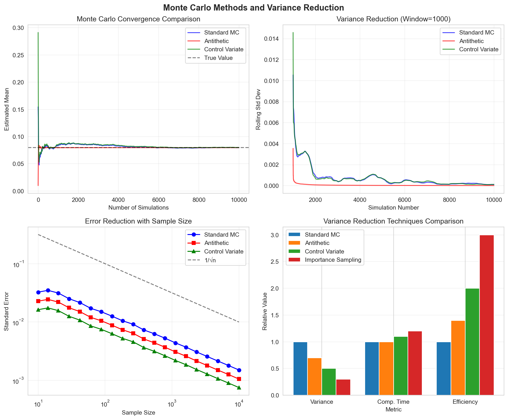
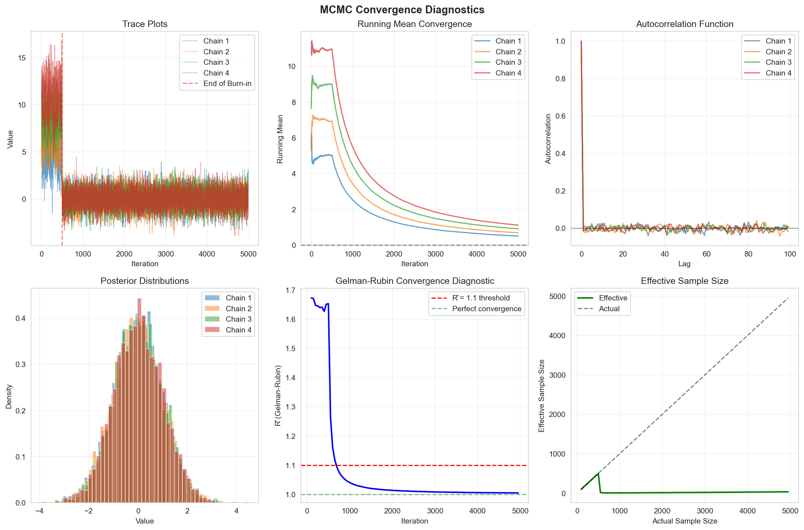
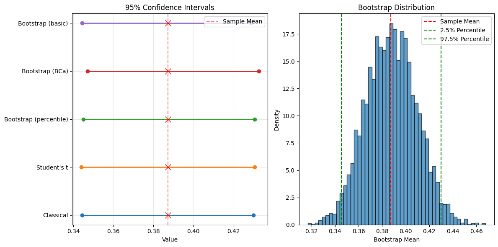
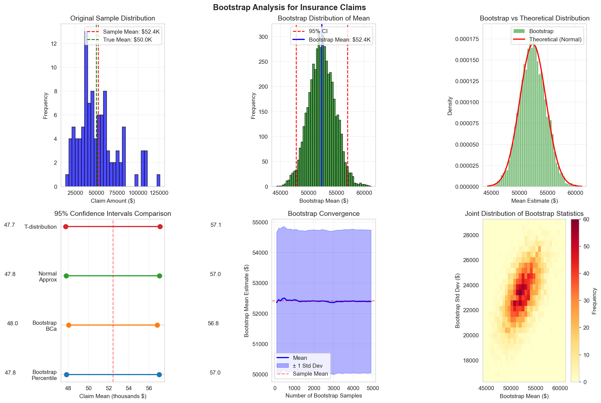
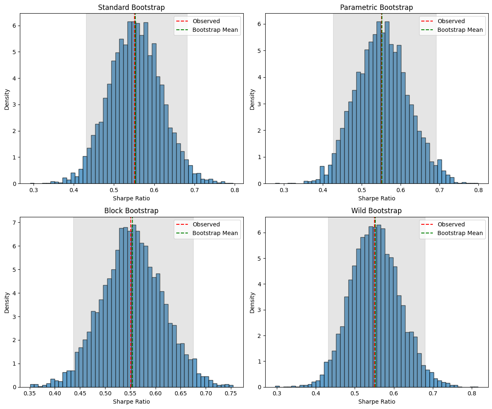
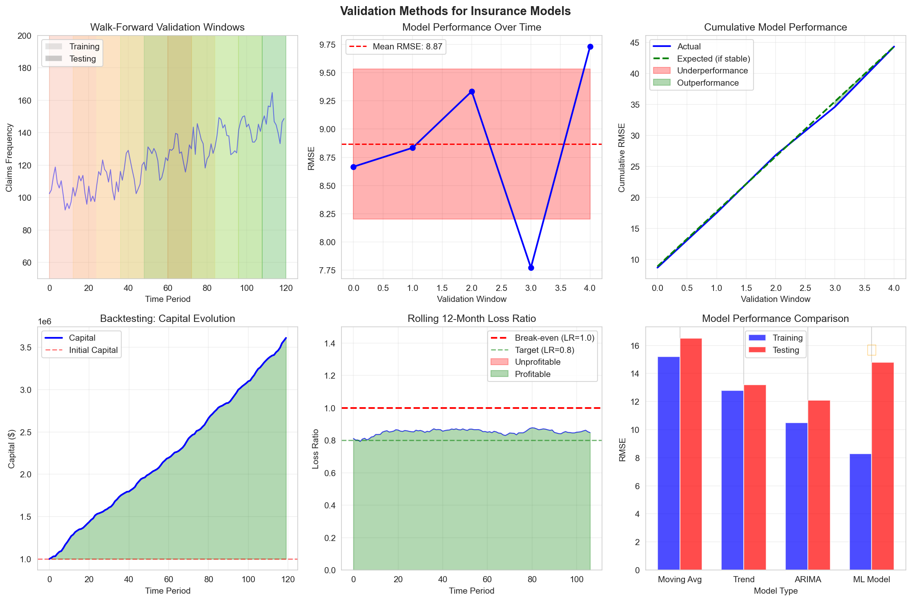
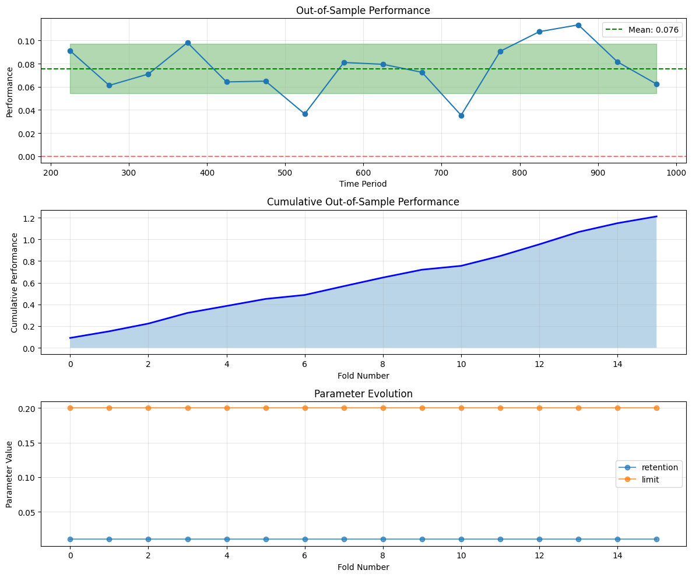
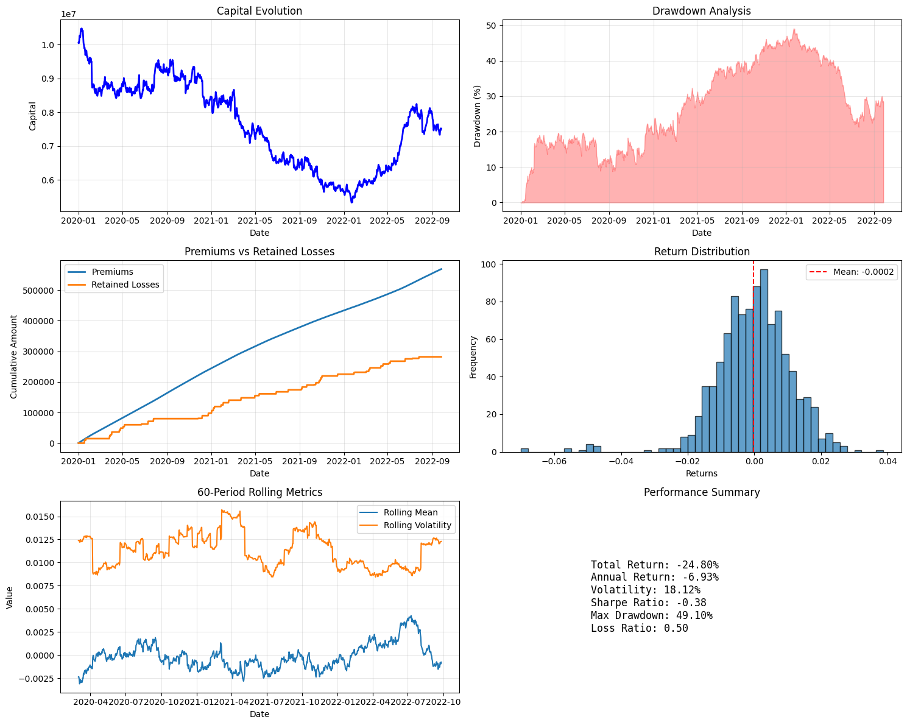
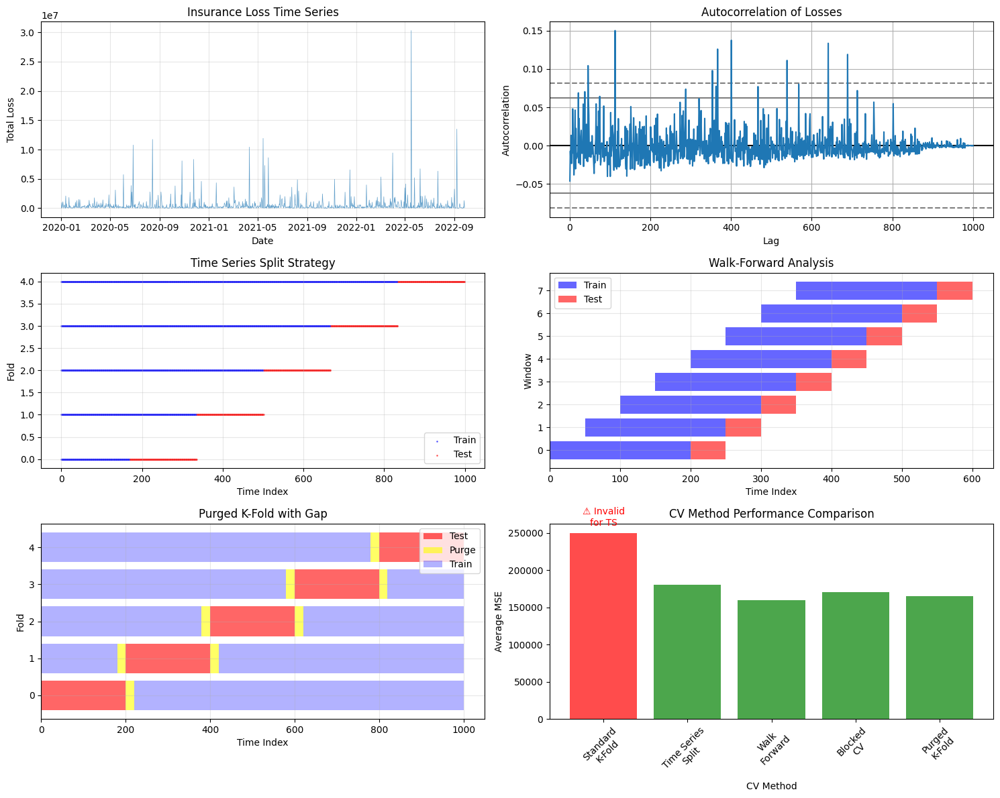

# Statistical Methods for Insurance Analysis

## Table of Contents
1. [Monte Carlo Methods](#monte-carlo-methods)

2. [Convergence Diagnostics](#convergence-diagnostics)
3. [Confidence Intervals](#confidence-intervals)

4. [Hypothesis Testing](#hypothesis-testing)
5. [Bootstrap Methods](#bootstrap-methods)

6. [Walk-Forward Validation](#walk-forward-validation)
7. [Backtesting](#backtesting)

8. [Model Validation](#model-validation)

(monte-carlo-methods)=
## Monte Carlo Methods


*Figure 1: Monte Carlo convergence comparison showing standard MC, antithetic variates, and control variates techniques with their variance reduction properties.*

### Basic Monte Carlo Simulation

Monte Carlo methods estimate expectations through random sampling:

$$
E[f(X)] \approx \frac{1}{N} \sum_{i=1}^N f(X_i)
$$

where $X_i$ are independent samples from the distribution of $X$.

### Variance Reduction Techniques  #### Antithetic Variates

Use negatively correlated pairs:

$$
\hat{\mu}_{\text{AV}} = \frac{1}{2N} \sum_{i=1}^N [f(X_i) + f(X_i')]
$$

where $X_i'$ is antithetic to $X_i$.

#### Control Variates

Reduce variance using correlated variable with known mean:

$$
\hat{\mu}_{\text{CV}} = \hat{\mu} - c(\hat{\mu}_Y - \mu_Y)
$$

#### Importance Sampling

Sample from alternative distribution:

$$
E[f(X)] = E_Q\left[f(X)\frac{p(X)}{q(X)}\right]
$$

### Implementation  ```python
import numpy as np
from scipy import stats
import matplotlib.pyplot as plt

class MonteCarloEngine:
"""Advanced Monte Carlo simulation engine for insurance analysis."""

def __init__(self, base_simulator):
self.simulator = base_simulator
self.results = {}

def basic_monte_carlo(self, n_sims=10000):
"""Standard Monte Carlo simulation."""

outcomes = []
for _ in range(n_sims):
outcome = self.simulator()
outcomes.append(outcome)

outcomes = np.array(outcomes)

return {
'mean': np.mean(outcomes),
'std': np.std(outcomes),
'se': np.std(outcomes) / np.sqrt(n_sims),
'samples': outcomes
}

def antithetic_variates(self, n_pairs=5000):
"""Monte Carlo with antithetic variates."""

outcomes_regular = []
outcomes_antithetic = []

for _ in range(n_pairs):
            # Regular sample
np.random.seed()
regular = self.simulator()
outcomes_regular.append(regular)

            # Antithetic sample (using inverted random numbers)
state = np.random.get_state()
np.random.seed()
u = np.random.rand(100)
# Get random uniforms
np.random.set_state(state)
np.random.rand(100)
# Use same sequence
            # Now use 1-u for antithetic
antithetic = self.simulator(antithetic=True)
outcomes_antithetic.append(antithetic)

        # Combine estimates
combined = 0.5
* (np.array(outcomes_regular) + np.array(outcomes_antithetic))

return {
'mean': np.mean(combined),
'std': np.std(combined),
'se': np.std(combined) / np.sqrt(n_pairs),
'variance_reduction': 1 - np.var(combined) / np.var(outcomes_regular),
'samples': combined
}

def control_variates(self, n_sims=10000, control_func=None, control_mean=None):
"""Monte Carlo with control variates."""

if control_func is None or control_mean is None:
raise ValueError("Control function and mean required")

outcomes = []
controls = []

for _ in range(n_sims):
outcome = self.simulator()
control = control_func()

outcomes.append(outcome)
controls.append(control)

outcomes = np.array(outcomes)
controls = np.array(controls)

        # Optimal coefficient
cov_matrix = np.cov(outcomes, controls)
c_optimal = cov_matrix[0, 1] / cov_matrix[1, 1]

        # Adjusted estimate
adjusted = outcomes - c_optimal * (controls - control_mean)

return {
'mean': np.mean(adjusted),
'std': np.std(adjusted),
'se': np.std(adjusted) / np.sqrt(n_sims),
'c_optimal': c_optimal,
'variance_reduction': 1 - np.var(adjusted) / np.var(outcomes),
'samples': adjusted
}

def importance_sampling(self, n_sims=10000, importance_dist=None):
"""Monte Carlo with importance sampling."""

if importance_dist is None:
raise ValueError("Importance distribution required")

outcomes = []
weights = []

for _ in range(n_sims):
            # Sample from importance distribution
x = importance_dist.rvs()

            # Evaluate function
outcome = self.simulator(x=x)

            # Calculate weight (likelihood ratio)
weight = self.simulator.original_pdf(x) / importance_dist.pdf(x)

outcomes.append(outcome)
weights.append(weight)

outcomes = np.array(outcomes)
weights = np.array(weights)

        # Weighted average
weighted_mean = np.sum(outcomes
* weights) / np.sum(weights)

        # Effective sample size
ess = np.sum(weights)**2 / np.sum(weights**2)

return {
'mean': weighted_mean,
'ess': ess,
'efficiency': ess / n_sims,
'samples': outcomes,
'weights': weights
}

def stratified_sampling(self, n_sims=10000, n_strata=10):
"""Stratified Monte Carlo sampling."""

strata_bounds = np.linspace(0, 1, n_strata + 1)
n_per_stratum = n_sims // n_strata

outcomes = []

for i in range(n_strata):
lower = strata_bounds[i]
upper = strata_bounds[i + 1]

for _ in range(n_per_stratum):
                # Sample uniformly within stratum
u = np.random.uniform(lower, upper)
outcome = self.simulator(quantile=u)
outcomes.append(outcome)

outcomes = np.array(outcomes)

return {
'mean': np.mean(outcomes),
'std': np.std(outcomes),
'se': np.std(outcomes) / np.sqrt(n_sims),
'samples': outcomes
}

def compare_methods(self, n_sims=10000):
"""Compare different Monte Carlo methods."""

methods = {
'Basic': lambda: self.basic_monte_carlo(n_sims),
'Antithetic': lambda: self.antithetic_variates(n_sims // 2),
'Stratified': lambda: self.stratified_sampling(n_sims, 20)
}

results = {}
for name, method in methods.items():
result = method()
results[name] = result
print(f"{name:12} Mean: {result['mean']:.6f}, SE: {result['se']:.6f}")

return results

# Example: Insurance loss simulation
def insurance_loss_simulator(antithetic=False, x=None, quantile=None):
"""Simulate annual insurance losses."""

if quantile is not None:
        # For stratified sampling
u = quantile
elif x is not None:
        # For importance sampling
return x * np.exp(-0.5
* x**2)
# Example transformation
elif antithetic:
u = 1 - np.random.rand()
else:
u = np.random.rand()

    # Transform uniform to loss distribution
loss = stats.lognorm.ppf(u, s=2, scale=100000)

    # Apply insurance structure
retention = 50000
limit = 500000
retained_loss = min(loss, retention)
insured_loss = min(max(0, loss - retention), limit)

return retained_loss + 0.1 * insured_loss
# Net cost

# Set up original PDF for importance sampling
insurance_loss_simulator.original_pdf = lambda x: stats.lognorm.pdf(x, s=2, scale=100000)

# Run comparison
mc_engine = MonteCarloEngine(insurance_loss_simulator)
comparison = mc_engine.compare_methods(n_sims=10000)

```
#### Sample Output
```

Basic
Mean: 54612.877866, SE: 325.263503
Antithetic
Mean: 55128.179291, SE: 324.461365
Stratified
Mean: 55034.214910, SE: 324.692728

```
---
(convergence-diagnostics)= ## Convergence Diagnostics
 *Figure 2: MCMC convergence diagnostics including trace plots, Gelman-Rubin statistic, autocorrelation analysis, and effective sample size calculation.*
### Gelman-Rubin Statistic

For multiple chains, assess convergence:

$$
\hat{R} = \sqrt{\frac{\hat{V}}{W}}
$$

- $W$ = Within-chain variance - $\hat{V}$ = Estimated variance
### Effective Sample Size

Account for autocorrelation:

$$
\text{ESS} = \frac{N}{1 + 2\sum_{k=1}^K \rho_k}
$$

where $\rho_k$ is lag-$k$ autocorrelation.

### Implementation  ```python
class ConvergenceDiagnostics:
"""Diagnose Monte Carlo convergence."""

def __init__(self, chains):
"""
Parameters:
chains: list of arrays, each representing a Markov chain
"""
self.chains = [np.array(chain) for chain in chains]
self.n_chains = len(chains)
self.n_samples = len(chains[0])

def gelman_rubin(self):
"""Calculate Gelman-Rubin convergence diagnostic."""

        # Chain means
chain_means = [np.mean(chain) for chain in self.chains]

        # Overall mean
overall_mean = np.mean(chain_means)

        # Between-chain variance

B = self.n_samples
* np.var(chain_means, ddof=1)

        # Within-chain variance

W = np.mean([np.var(chain, ddof=1) for chain in self.chains])

        # Estimated variance

V_hat = ((self.n_samples - 1) / self.n_samples) * W + B / self.n_samples

        # R-hat statistic

R_hat = np.sqrt(V_hat / W) if W > 0 else 1.0

return {
'R_hat': R_hat,
'converged': R_hat < 1.1,
'B': B,
'W': W,
'V_hat': V_hat
}

def effective_sample_size(self, chain=None):
"""Calculate effective sample size accounting for autocorrelation."""

if chain is None:
            # Combine all chains
chain = np.concatenate(self.chains)

n = len(chain)

        # Calculate autocorrelation
mean = np.mean(chain)
c0 = np.sum((chain - mean)**2) / n

        # Calculate autocorrelation at each lag
max_lag = min(int(n/4), 100)
autocorr = []

for k in range(1, max_lag):
ck = np.sum((chain[:-k] - mean) * (chain[k:] - mean)) / n
rho_k = ck / c0

if rho_k < 0.05:
# Stop when autocorrelation becomes negligible
break

autocorr.append(rho_k)

        # ESS calculation
sum_autocorr = sum(autocorr)
ess = n / (1 + 2
* sum_autocorr)

return {
'ess': ess,
'efficiency': ess / n,
'autocorrelation': autocorr,
'n_lags': len(autocorr)
}

def geweke_diagnostic(self, chain=None, first_prop=0.1, last_prop=0.5):
"""Geweke convergence diagnostic comparing early and late portions."""

if chain is None:
chain = self.chains[0]

n = len(chain)
n_first = int(n * first_prop)
n_last = int(n
* last_prop)

first_portion = chain[:n_first]
last_portion = chain[-n_last:]

        # Calculate means and variances
mean_first = np.mean(first_portion)
mean_last = np.mean(last_portion)
var_first = np.var(first_portion, ddof=1)
var_last = np.var(last_portion, ddof=1)

        # Geweke z-score
se = np.sqrt(var_first/n_first + var_last/n_last)
z_score = (mean_first - mean_last) / se if se > 0 else 0

        # P-value (two-tailed)
p_value = 2 * (1 - stats.norm.cdf(abs(z_score)))

return {
'z_score': z_score,
'p_value': p_value,
'converged': abs(z_score) < 2,
'mean_diff': mean_first - mean_last
}

def heidelberger_welch(self, chain=None, alpha=0.05):
"""Heidelberger-Welch stationarity and interval halfwidth test."""

if chain is None:
chain = self.chains[0]

n = len(chain)

        # Stationarity test using Cramer-von Mises
        # Simplified version
cumsum = np.cumsum(chain - np.mean(chain))
test_stat = np.sum(cumsum**2) / (n**2 * np.var(chain))

        # Critical value approximation
critical_value = 0.461
# For alpha=0.05
stationary = test_stat < critical_value

        # Halfwidth test
mean = np.mean(chain)
se = np.std(chain, ddof=1) / np.sqrt(n)
halfwidth = stats.t.ppf(1 - alpha/2, n-1)
* se
relative_halfwidth = halfwidth / abs(mean) if mean != 0 else np.inf

return {
'stationary': stationary,
'test_statistic': test_stat,
'mean': mean,
'halfwidth': halfwidth,
'relative_halfwidth': relative_halfwidth,
'halfwidth_test_passed': relative_halfwidth < 0.1
}

def plot_diagnostics(self):
"""Visualize convergence diagnostics."""

fig, axes = plt.subplots(2, 3, figsize=(15, 10))

        # Trace plots
for i, chain in enumerate(self.chains[:3]):
axes[0, 0].plot(chain, alpha=0.7, label=f'Chain {i+1}')
axes[0, 0].set_xlabel('Iteration')
axes[0, 0].set_ylabel('Value')
axes[0, 0].set_title('Trace Plots')
axes[0, 0].legend()

        # Running mean
for chain in self.chains[:3]:
running_mean = np.cumsum(chain) / np.arange(1, len(chain) + 1)
axes[0, 1].plot(running_mean, alpha=0.7)
axes[0, 1].set_xlabel('Iteration')
axes[0, 1].set_ylabel('Running Mean')
axes[0, 1].set_title('Running Mean Convergence')

        # Autocorrelation
chain = self.chains[0]
lags = range(1, min(50, len(chain)//4))
autocorr = [np.corrcoef(chain[:-lag], chain[lag:])[0, 1] for lag in lags]
axes[0, 2].bar(lags, autocorr)
axes[0, 2].axhline(y=0, color='k', linestyle='-', linewidth=0.5)
axes[0, 2].set_xlabel('Lag')
axes[0, 2].set_ylabel('Autocorrelation')
axes[0, 2].set_title('Autocorrelation Function')

        # Density plots
for chain in self.chains[:3]:
axes[1, 0].hist(chain, bins=30, alpha=0.5, density=True)
axes[1, 0].set_xlabel('Value')
axes[1, 0].set_ylabel('Density')
axes[1, 0].set_title('Marginal Distributions')

        # Gelman-Rubin evolution
r_hats = []
check_points = range(100, len(self.chains[0]), 100)
for n in check_points:
truncated_chains = [chain[:n] for chain in self.chains]
diag = ConvergenceDiagnostics(truncated_chains)
r_hats.append(diag.gelman_rubin()['R_hat'])

axes[1, 1].plot(check_points, r_hats)
axes[1, 1].axhline(y=1.1, color='r', linestyle='--', label='Threshold')
axes[1, 1].set_xlabel('Sample Size')
axes[1, 1].set_ylabel('R-hat')
axes[1, 1].set_title('Gelman-Rubin Statistic')
axes[1, 1].legend()

        # Cumulative mean comparison
for chain in self.chains[:3]:
cumulative_mean = np.cumsum(chain) / np.arange(1, len(chain) + 1)
cumulative_std = [np.std(chain[:i]) for i in range(1, len(chain) + 1)]
axes[1, 2].fill_between(range(len(chain)),
cumulative_mean - cumulative_std,
cumulative_mean + cumulative_std,
alpha=0.3)
axes[1, 2].plot(cumulative_mean, linewidth=2)

axes[1, 2].set_xlabel('Iteration')
axes[1, 2].set_ylabel('Cumulative Mean ± Std')
axes[1, 2].set_title('Convergence Bands')

plt.tight_layout()
plt.show()

# Example: Run multiple chains for insurance optimization
def run_mcmc_chain(seed, n_samples=5000):
"""Run a single MCMC chain for insurance optimization."""

np.random.seed(seed)
chain = []

    # Initial value
x = np.random.randn()

for _ in range(n_samples):
        # Propose new value
x_new = x + np.random.randn() * 0.5

        # Acceptance ratio (simplified)
alpha = min(1, np.exp(-0.5
* (x_new**2 - x**2)))

        # Accept or reject
if np.random.rand() < alpha:
x = x_new

chain.append(x)

return chain

# Run multiple chains
chains = [run_mcmc_chain(seed=i) for i in range(4)]

# Diagnose convergence
diagnostics = ConvergenceDiagnostics(chains)

print("Convergence Diagnostics:")
print("-" * 40)

# Gelman-Rubin
gr = diagnostics.gelman_rubin()
print(f"Gelman-Rubin R-hat: {gr['R_hat']:.3f} (Converged: {gr['converged']})")

# ESS
ess = diagnostics.effective_sample_size()
print(f"Effective Sample Size: {ess['ess']:.0f} ({ess['efficiency']:.1%} efficiency)")

# Geweke
geweke = diagnostics.geweke_diagnostic()
print(f"Geweke z-score: {geweke['z_score']:.3f} (p-value: {geweke['p_value']:.3f})")

# Heidelberger-Welch
hw = diagnostics.heidelberger_welch()
print(f"Stationary: {hw['stationary']}, Halfwidth test: {hw['halfwidth_test_passed']}")

# Visualize
diagnostics.plot_diagnostics()

```
#### Sample Output

```

Convergence Diagnostics:
----------------------------------------
Gelman-Rubin R-hat: 1.001 (Converged: True)
Effective Sample Size: 994 (5.0% efficiency)
Geweke z-score: -9.717 (p-value: 0.000)
Stationary: False, Halfwidth test: False

```
---
(confidence-intervals)= ## Confidence Intervals
(confidence-intervals)=
### Classical Confidence Intervals

For large samples, use Central Limit Theorem:

$$
\bar{X} \pm z_{\alpha/2} \frac{s}{\sqrt{n}}
$$

(confidence-intervals)=
### Bootstrap Confidence Intervals  #### Percentile Method Use quantiles of bootstrap distribution:

$$
[\hat{\theta}^*_{\alpha/2}, \hat{\theta}^*_{1-\alpha/2}]
$$

#### BCa (Bias-Corrected and Accelerated) Adjust for bias and skewness:

$$
[\hat{\theta}^*_{\alpha_1}, \hat{\theta}^*_{\alpha_2}]
$$

where $\alpha_1$ and $\alpha_2$ are adjusted percentiles.

### Implementation  ```python
import pandas as pd

class ConfidenceIntervals:
"""Calculate various types of confidence intervals."""

def __init__(self, data):
self.data = np.array(data)
self.n = len(data)
self.mean = np.mean(data)
self.std = np.std(data, ddof=1)

def classical_ci(self, confidence=0.95):
"""Classical confidence interval using normal approximation."""

alpha = 1 - confidence
z_critical = stats.norm.ppf(1 - alpha/2)

se = self.std / np.sqrt(self.n)
margin = z_critical * se

return {
'lower': self.mean - margin,
'upper': self.mean + margin,
'se': se,
'margin': margin,
'method': 'Classical (Normal)'
}

def t_ci(self, confidence=0.95):
"""Student's t confidence interval."""

alpha = 1 - confidence
t_critical = stats.t.ppf(1 - alpha/2, self.n - 1)

se = self.std / np.sqrt(self.n)
margin = t_critical
* se

return {
'lower': self.mean - margin,
'upper': self.mean + margin,
'se': se,
'margin': margin,
'method': "Student's t"
}

def bootstrap_ci(self, confidence=0.95, n_bootstrap=10000, method='percentile'):
"""Bootstrap confidence intervals."""

        # Generate bootstrap samples
bootstrap_means = []

for _ in range(n_bootstrap):
sample = np.random.choice(self.data, size=self.n, replace=True)
bootstrap_means.append(np.mean(sample))

bootstrap_means = np.array(bootstrap_means)

if method == 'percentile':
            # Percentile method
alpha = 1 - confidence
lower = np.percentile(bootstrap_means, 100 * alpha/2)
upper = np.percentile(bootstrap_means, 100
* (1 - alpha/2))

elif method == 'bca':
            # BCa method
lower, upper = self._bca_interval(bootstrap_means, confidence)

elif method == 'basic':
            # Basic bootstrap
alpha = 1 - confidence
lower_q = np.percentile(bootstrap_means, 100 * alpha/2)
upper_q = np.percentile(bootstrap_means, 100
* (1 - alpha/2))
lower = 2 * self.mean - upper_q
upper = 2
* self.mean - lower_q

else:
raise ValueError(f"Unknown method: {method}")

return {
'lower': lower,
'upper': upper,
'bootstrap_mean': np.mean(bootstrap_means),
'bootstrap_std': np.std(bootstrap_means),
'method': f'Bootstrap ({method})',
'n_bootstrap': n_bootstrap
}

def _bca_interval(self, bootstrap_dist, confidence):
"""Calculate BCa (bias-corrected and accelerated) interval."""

alpha = 1 - confidence

        # Bias correction
z0 = stats.norm.ppf(np.mean(bootstrap_dist < self.mean))

        # Acceleration
jackknife_means = []
for i in range(self.n):
jack_sample = np.delete(self.data, i)
jackknife_means.append(np.mean(jack_sample))

jackknife_means = np.array(jackknife_means)
jack_mean = np.mean(jackknife_means)

numerator = np.sum((jack_mean - jackknife_means)**3)
denominator = 6 * np.sum((jack_mean - jackknife_means)**2)**(3/2)

a = numerator / denominator if denominator != 0 else 0

        # Adjusted percentiles
z_alpha = stats.norm.ppf(alpha/2)
z_1alpha = stats.norm.ppf(1 - alpha/2)

alpha1 = stats.norm.cdf(z0 + (z0 + z_alpha)/(1 - a*(z0 + z_alpha)))
alpha2 = stats.norm.cdf(z0 + (z0 + z_1alpha)/(1 - a*(z0 + z_1alpha)))

lower = np.percentile(bootstrap_dist, 100 * alpha1)
upper = np.percentile(bootstrap_dist, 100
* alpha2)

return lower, upper

def compare_methods(self, confidence=0.95):
"""Compare different confidence interval methods."""

methods = {
'Classical': self.classical_ci(confidence),
"Student's t": self.t_ci(confidence),
'Bootstrap (percentile)': self.bootstrap_ci(confidence, method='percentile'),
'Bootstrap (BCa)': self.bootstrap_ci(confidence, method='bca'),
'Bootstrap (basic)': self.bootstrap_ci(confidence, method='basic')
}

        # Create comparison table
comparison = []
for name, ci in methods.items():
comparison.append({
'Method': name,
'Lower': ci['lower'],
'Upper': ci['upper'],
'Width': ci['upper'] - ci['lower']
})

return pd.DataFrame(comparison)

def plot_intervals(self, confidence=0.95):
"""Visualize confidence intervals."""

comparison = self.compare_methods(confidence)

fig, (ax1, ax2) = plt.subplots(1, 2, figsize=(12, 6))

        # Plot intervals
y_pos = np.arange(len(comparison))

for i, row in comparison.iterrows():
ax1.plot([row['Lower'], row['Upper']], [i, i], 'o-', linewidth=2)
ax1.plot(self.mean, i, 'rx', markersize=10)

ax1.set_yticks(y_pos)
ax1.set_yticklabels(comparison['Method'])
ax1.set_xlabel('Value')
ax1.set_title(f'{confidence*100:.0f}% Confidence Intervals')
ax1.axvline(self.mean, color='r', linestyle='--', alpha=0.5, label='Sample Mean')
ax1.legend()
ax1.grid(True, alpha=0.3)

        # Bootstrap distribution
bootstrap_dist = []
for _ in range(5000):
sample = np.random.choice(self.data, size=self.n, replace=True)
bootstrap_dist.append(np.mean(sample))

ax2.hist(bootstrap_dist, bins=50, density=True, alpha=0.7, edgecolor='black')
ax2.axvline(self.mean, color='r', linestyle='--', label='Sample Mean')
ax2.axvline(np.percentile(bootstrap_dist, 2.5), color='g', linestyle='--',
label='2.5% Percentile')
ax2.axvline(np.percentile(bootstrap_dist, 97.5), color='g', linestyle='--',
label='97.5% Percentile')
ax2.set_xlabel('Bootstrap Mean')
ax2.set_ylabel('Density')
ax2.set_title('Bootstrap Distribution')
ax2.legend()

plt.tight_layout()
plt.show()

return comparison

# Example: Confidence intervals for insurance metrics
np.random.seed(42)

# Simulate insurance loss ratios
loss_ratios = np.random.beta(2, 5, 100) * 1.5
# Scaled beta distribution

ci_analyzer = ConfidenceIntervals(loss_ratios)
comparison = ci_analyzer.plot_intervals(confidence=0.95)

print("\nConfidence Interval Comparison:")
print(comparison.to_string())

```
#### Sample Output

```

Confidence Interval Comparison:
Method
Lower
Upper
Width
0
Classical
0.344443
0.430019
0.085576
1
Student's t
0.343914
0.430549
0.086635
2
Bootstrap (percentile)
0.344961
0.430498
0.085537
3
Bootstrap (BCa)
0.347206
0.432543
0.085337
4
Bootstrap (basic)
0.344356
0.428684
0.084327

```
---
(hypothesis-testing)= ## Hypothesis Testing
### Framework

Test null hypothesis $H_0$ against alternative $H_1$:
1. **Test statistic**: $T = T(X_1, ..., X_n)$ 2. **P-value**: $P(T \geq T_{\text{obs}} | H_0)$ 3. **Decision**: Reject $H_0$ if p-value < $\alpha$
### Tests for Ergodic Advantage
```python
class HypothesisTesting:
"""Statistical tests for insurance optimization."""

def __init__(self, group1, group2=None):
self.group1 = np.array(group1)
self.group2 = np.array(group2) if group2 is not None else None

def test_ergodic_advantage(self, time_avg, ensemble_avg, n_sims=10000):
"""Test if time average significantly differs from ensemble average."""

        # Bootstrap test
differences = []

for _ in range(n_sims):
            # Resample paths
sample_indices = np.random.choice(len(time_avg), size=len(time_avg), replace=True)
sample_time = time_avg[sample_indices]
sample_ensemble = ensemble_avg[sample_indices]

            # Calculate difference
diff = np.mean(sample_time) - np.mean(sample_ensemble)
differences.append(diff)

differences = np.array(differences)

        # Calculate p-value
observed_diff = np.mean(time_avg) - np.mean(ensemble_avg)
p_value = np.mean(differences >= observed_diff)

return {
'observed_difference': observed_diff,
'p_value': p_value,
'significant': p_value < 0.05,
'bootstrap_mean': np.mean(differences),
'bootstrap_std': np.std(differences),
'confidence_interval': (np.percentile(differences, 2.5),
np.percentile(differences, 97.5))
}

def mann_whitney_test(self):
"""Non-parametric test for difference in distributions."""

if self.group2 is None:
raise ValueError("Two groups required for Mann-Whitney test")

statistic, p_value = stats.mannwhitneyu(self.group1, self.group2,
alternative='two-sided')

        # Effect size (rank-biserial correlation)
n1, n2 = len(self.group1), len(self.group2)
effect_size = 1 - (2 * statistic) / (n1
* n2)

return {
'statistic': statistic,
'p_value': p_value,
'effect_size': effect_size,
'significant': p_value < 0.05
}

def kolmogorov_smirnov_test(self):
"""Test if two samples come from same distribution."""

if self.group2 is None:
            # One-sample test against normal
statistic, p_value = stats.kstest(self.group1, 'norm',
args=(np.mean(self.group1),
np.std(self.group1)))
else:
            # Two-sample test
statistic, p_value = stats.ks_2samp(self.group1, self.group2)

return {
'statistic': statistic,
'p_value': p_value,
'significant': p_value < 0.05
}

def permutation_test(self, statistic_func=np.mean, n_permutations=10000):
"""Permutation test for any test statistic."""

if self.group2 is None:
raise ValueError("Two groups required for permutation test")

        # Observed statistic
observed = statistic_func(self.group1) - statistic_func(self.group2)

        # Combine groups
combined = np.concatenate([self.group1, self.group2])
n1 = len(self.group1)

        # Permutation distribution
perm_stats = []

for _ in range(n_permutations):
            # Shuffle and split
np.random.shuffle(combined)
perm_group1 = combined[:n1]
perm_group2 = combined[n1:]

            # Calculate statistic
perm_stat = statistic_func(perm_group1) - statistic_func(perm_group2)
perm_stats.append(perm_stat)

perm_stats = np.array(perm_stats)

        # P-value
p_value = np.mean(np.abs(perm_stats) >= np.abs(observed))

return {
'observed': observed,
'p_value': p_value,
'significant': p_value < 0.05,
'permutation_mean': np.mean(perm_stats),
'permutation_std': np.std(perm_stats)
}

# Example: Test insurance strategies
np.random.seed(42)

# Strategy A: Lower retention, higher premium
strategy_a_returns = np.random.normal(0.06, 0.10, 1000)

# Strategy B: Higher retention, lower premium
strategy_b_returns = np.random.normal(0.07, 0.15, 1000)

# Test for difference
tester = HypothesisTesting(strategy_a_returns, strategy_b_returns)

print("Strategy Comparison Tests:")
print("-" * 40)

# Mann-Whitney
mw = tester.mann_whitney_test()
print(f"Mann-Whitney: p={mw['p_value']:.4f}, Effect size={mw['effect_size']:.3f}")

# Kolmogorov-Smirnov
ks = tester.kolmogorov_smirnov_test()
print(f"K-S Test: p={ks['p_value']:.4f}")

# Permutation test
perm = tester.permutation_test()
print(f"Permutation: p={perm['p_value']:.4f}, Observed diff={perm['observed']:.4f}")

```
#### Sample Output
```

Strategy Comparison Tests:
----------------------------------------
Mann-Whitney: p=0.0006, Effect size=0.088
K-S Test: p=0.0000
Permutation: p=0.0008, Observed diff=-0.0187

```
---
(bootstrap-methods)= ## Bootstrap Methods
 *Figure 3: Bootstrap analysis showing resampling distributions, confidence interval comparisons, and convergence properties for insurance claims data.*
### Bootstrap Algorithm
1. Draw $B$ samples of size $n$ with replacement
2. Calculate statistic $\hat{\theta}^*_b$ for each sample
3. Use distribution of $\hat{\theta}^*$ for inference

### Advanced Bootstrap

```python
class BootstrapAnalysis:
"""Advanced bootstrap methods for insurance analysis."""

def __init__(self, data, statistic_func):
self.data = np.array(data)
self.statistic_func = statistic_func
self.n = len(data)

def basic_bootstrap(self, n_bootstrap=10000):
"""Standard bootstrap resampling."""

bootstrap_stats = []

for _ in range(n_bootstrap):
sample = np.random.choice(self.data, size=self.n, replace=True)
stat = self.statistic_func(sample)
bootstrap_stats.append(stat)

return np.array(bootstrap_stats)

def parametric_bootstrap(self, n_bootstrap=10000, dist_family='normal'):
"""Parametric bootstrap assuming distribution family."""

if dist_family == 'normal':
            # Fit normal distribution
mu, sigma = np.mean(self.data), np.std(self.data, ddof=1)

bootstrap_stats = []
for _ in range(n_bootstrap):
sample = np.random.normal(mu, sigma, self.n)
stat = self.statistic_func(sample)
bootstrap_stats.append(stat)

elif dist_family == 'lognormal':
            # Fit lognormal
log_data = np.log(self.data[self.data > 0])
mu, sigma = np.mean(log_data), np.std(log_data, ddof=1)

bootstrap_stats = []
for _ in range(n_bootstrap):
sample = np.random.lognormal(mu, sigma, self.n)
stat = self.statistic_func(sample)
bootstrap_stats.append(stat)

else:
raise ValueError(f"Unknown distribution: {dist_family}")

return np.array(bootstrap_stats)

def block_bootstrap(self, block_size, n_bootstrap=10000):
"""Block bootstrap for time series data."""

n_blocks = self.n // block_size

bootstrap_stats = []

for _ in range(n_bootstrap):
            # Sample blocks
block_indices = np.random.choice(n_blocks, size=n_blocks, replace=True)

            # Construct bootstrap sample
sample = []
for idx in block_indices:
start = idx * block_size
end = min(start + block_size, self.n)
sample.extend(self.data[start:end])

sample = np.array(sample[:self.n])
stat = self.statistic_func(sample)
bootstrap_stats.append(stat)

return np.array(bootstrap_stats)

def wild_bootstrap(self, n_bootstrap=10000):
"""Wild bootstrap for heteroskedastic data."""

        # Fit initial model (simplified)
residuals = self.data - np.mean(self.data)

bootstrap_stats = []

for _ in range(n_bootstrap):
            # Generate wild weights (Rademacher distribution)
weights = np.random.choice([-1, 1], size=self.n)

            # Create bootstrap sample
sample = np.mean(self.data) + residuals
* weights
stat = self.statistic_func(sample)
bootstrap_stats.append(stat)

return np.array(bootstrap_stats)

# Example: Bootstrap analysis of insurance metrics
def sharpe_ratio(returns):
"""Calculate Sharpe ratio."""
return np.mean(returns) / np.std(returns) if np.std(returns) > 0 else 0

# Generate sample returns
np.random.seed(42)
returns = np.random.normal(0.08, 0.15, 250)
# Daily returns

# Bootstrap analysis
bootstrap = BootstrapAnalysis(returns, sharpe_ratio)

# Compare bootstrap methods
methods = {
'Standard': bootstrap.basic_bootstrap(5000),
'Parametric': bootstrap.parametric_bootstrap(5000, 'normal'),
'Block': bootstrap.block_bootstrap(block_size=10, n_bootstrap=5000),
'Wild': bootstrap.wild_bootstrap(5000)
}

# Visualize
fig, axes = plt.subplots(2, 2, figsize=(12, 10))

for (name, dist), ax in zip(methods.items(), axes.flatten()):
ax.hist(dist, bins=50, density=True, alpha=0.7, edgecolor='black')
ax.axvline(sharpe_ratio(returns), color='r', linestyle='--', label='Observed')
ax.axvline(np.mean(dist), color='g', linestyle='--', label='Bootstrap Mean')
ax.set_xlabel('Sharpe Ratio')
ax.set_ylabel('Density')
ax.set_title(f'{name} Bootstrap')
ax.legend()

    # Add confidence interval
ci_lower, ci_upper = np.percentile(dist, [2.5, 97.5])
ax.axvspan(ci_lower, ci_upper, alpha=0.2, color='gray')

plt.tight_layout()
plt.show()

# Print statistics
print("Bootstrap Comparison:")
print("-" * 50)
for name, dist in methods.items():
print(f"{name:12} Mean: {np.mean(dist):.3f}, Std: {np.std(dist):.3f}, "
f"95% CI: [{np.percentile(dist, 2.5):.3f}, {np.percentile(dist, 97.5):.3f}]")

```


#### Sample Output



```

Bootstrap Comparison:
--------------------------------------------------
Standard
Mean: 0.553, Std: 0.065, 95% CI: [0.431, 0.682]
Parametric
Mean: 0.552, Std: 0.067, 95% CI: [0.426, 0.691]
Block
Mean: 0.554, Std: 0.061, 95% CI: [0.437, 0.675]
Wild
Mean: 0.552, Std: 0.063, 95% CI: [0.432, 0.681]

```


---

(walk-forward-validation)=
## Walk-Forward Validation


*Figure 4: Walk-forward validation and backtesting visualization showing rolling windows, performance tracking, and model comparison for insurance pricing strategies.*

### Methodology

1. Train on historical window

2. Test on next period
3. Roll window forward

4. Aggregate results

### Implementation

```python
class WalkForwardValidator:
"""Walk-forward validation for insurance strategies."""

def __init__(self, data, window_size, test_size):
self.data = data
self.window_size = window_size
self.test_size = test_size
self.n_periods = len(data)

def validate_strategy(self, strategy_func, params_optimizer):
"""Validate insurance strategy using walk-forward analysis."""

results = []

        # Calculate number of folds
n_folds = (self.n_periods - self.window_size) // self.test_size

for fold in range(n_folds):
            # Define training window
train_start = fold
* self.test_size
train_end = train_start + self.window_size

            # Define test window
test_start = train_end
test_end = test_start + self.test_size

if test_end > self.n_periods:
break

            # Training data
train_data = self.data[train_start:train_end]

            # Optimize parameters on training data
optimal_params = params_optimizer(train_data)

            # Test data
test_data = self.data[test_start:test_end]

            # Apply strategy with optimal parameters
test_performance = strategy_func(test_data, optimal_params)

results.append({
'fold': fold,
'train_period': (train_start, train_end),
'test_period': (test_start, test_end),
'optimal_params': optimal_params,
'test_performance': test_performance
})

return results

def analyze_results(self, results):
"""Analyze walk-forward validation results."""

        # Extract performance metrics
performances = [r['test_performance'] for r in results]

        # Calculate statistics
analysis = {
'mean_performance': np.mean(performances),
'std_performance': np.std(performances),
'min_performance': np.min(performances),
'max_performance': np.max(performances),
'sharpe_ratio': np.mean(performances) / np.std(performances),
'win_rate': np.mean(np.array(performances) > 0),
'n_folds': len(results)
}

        # Parameter stability
all_params = [r['optimal_params'] for r in results]
if isinstance(all_params[0], dict):
param_stability = {}
for key in all_params[0].keys():
values = [p[key] for p in all_params]
param_stability[key] = {
'mean': np.mean(values),
'std': np.std(values),
'cv': np.std(values) / np.mean(values) if np.mean(values) != 0 else np.inf
}
analysis['parameter_stability'] = param_stability

return analysis

def plot_validation(self, results):
"""Visualize walk-forward validation results."""

fig, axes = plt.subplots(3, 1, figsize=(12, 10))

        # Performance over time
performances = [r['test_performance'] for r in results]
test_periods = [(r['test_period'][0] + r['test_period'][1])/2 for r in results]

axes[0].plot(test_periods, performances, 'o-')
axes[0].axhline(y=0, color='r', linestyle='--', alpha=0.5)
axes[0].axhline(y=np.mean(performances), color='g', linestyle='--',
label=f'Mean: {np.mean(performances):.3f}')
axes[0].fill_between(test_periods,
np.mean(performances) - np.std(performances),
np.mean(performances) + np.std(performances),
alpha=0.3, color='green')
axes[0].set_xlabel('Time Period')
axes[0].set_ylabel('Performance')
axes[0].set_title('Out-of-Sample Performance')
axes[0].legend()
axes[0].grid(True, alpha=0.3)

        # Cumulative performance
cumulative = np.cumsum(performances)
axes[1].plot(range(len(cumulative)), cumulative, 'b-', linewidth=2)
axes[1].fill_between(range(len(cumulative)), 0, cumulative, alpha=0.3)
axes[1].set_xlabel('Fold Number')
axes[1].set_ylabel('Cumulative Performance')
axes[1].set_title('Cumulative Out-of-Sample Performance')
axes[1].grid(True, alpha=0.3)

        # Parameter evolution
if 'optimal_params' in results[0] and isinstance(results[0]['optimal_params'], dict):
param_names = list(results[0]['optimal_params'].keys())

for param_name in param_names[:3]:
# Plot first 3 parameters
param_values = [r['optimal_params'][param_name] for r in results]
axes[2].plot(range(len(param_values)), param_values,
'o-', label=param_name, alpha=0.7)

axes[2].set_xlabel('Fold Number')
axes[2].set_ylabel('Parameter Value')
axes[2].set_title('Parameter Evolution')
axes[2].legend()
axes[2].grid(True, alpha=0.3)

plt.tight_layout()
plt.show()

# Example: Walk-forward validation of insurance strategy
def insurance_strategy(data, params):
"""Simple insurance strategy."""
retention = params['retention']
limit = params['limit']

    # Calculate returns with insurance
returns = []
for value in data:
loss = max(0, -value) if value < 0 else 0
retained_loss = min(loss, retention)
premium = 0.02 * limit

net_return = value - retained_loss - premium
returns.append(net_return)

return np.mean(returns)

def optimize_params(data):
"""Optimize insurance parameters."""
best_performance = -np.inf
best_params = None

    # Grid search (simplified)
for retention in [0.01, 0.05, 0.10]:
for limit in [0.20, 0.30, 0.40]:
params = {'retention': retention, 'limit': limit}
performance = insurance_strategy(data, params)

if performance > best_performance:
best_performance = performance
best_params = params

return best_params

# Generate sample data
np.random.seed(42)
returns_data = np.random.normal(0.08, 0.15, 1000) + \
np.random.standard_t(5, 1000)
* 0.05
# Add fat tails

# Walk-forward validation
validator = WalkForwardValidator(returns_data, window_size=200, test_size=50)
results = validator.validate_strategy(insurance_strategy, optimize_params)

# Analyze
analysis = validator.analyze_results(results)
print("\nWalk-Forward Validation Results:")
print("-" * 40)
for key, value in analysis.items():
if key != 'parameter_stability':
print(f"{key}: {value:.4f}" if isinstance(value, float) else f"{key}: {value}")

# Visualize
validator.plot_validation(results)

```

#### Sample Output



```

Walk-Forward Validation Results:
----------------------------------------
mean_performance: 0.0757
std_performance: 0.0214
min_performance: 0.0354
max_performance: 0.1136
sharpe_ratio: 3.5398
win_rate: 1.0000
n_folds: 16

```


---

(backtesting)=
## Backtesting

### Backtesting Framework

```python
class InsuranceBacktester:
"""Comprehensive backtesting for insurance strategies."""

def __init__(self, historical_data):
self.data = historical_data
self.results = {}

def backtest(self, strategy, initial_capital=1000000,
start_date=None, end_date=None):
"""Run backtest of insurance strategy."""

        # Filter data by date if specified
test_data = self.data
if start_date:
test_data = test_data[test_data.index >= start_date]
if end_date:
test_data = test_data[test_data.index <= end_date]

        # Initialize tracking variables
capital = initial_capital
positions = []
metrics = {
'dates': [],
'capital': [],
'returns': [],
'premiums': [],
'claims': [],
'retained_losses': []
}

        # Run strategy
for date, row in test_data.iterrows():
            # Get strategy decision
decision = strategy(date, row, capital, positions)

            # Calculate losses and premiums
loss = row.get('loss', 0)
premium = decision['premium']
retention = decision['retention']
limit = decision['limit']

            # Calculate retained loss
retained_loss = min(loss, retention)
insured_loss = min(max(0, loss - retention), limit)

            # Update capital
capital = capital
* (1 + row.get('return', 0)) - premium - retained_loss

            # Track metrics
metrics['dates'].append(date)
metrics['capital'].append(capital)
metrics['returns'].append(row.get('return', 0))
metrics['premiums'].append(premium)
metrics['claims'].append(loss)
metrics['retained_losses'].append(retained_loss)

            # Check for bankruptcy
if capital <= 0:
print(f"Bankruptcy on {date}")
break

        # Calculate performance metrics
self.results = self.calculate_metrics(metrics, initial_capital)
return self.results

def calculate_metrics(self, metrics, initial_capital):
"""Calculate comprehensive performance metrics."""

capital_series = np.array(metrics['capital'])
returns = np.diff(capital_series) / capital_series[:-1]

        # Basic metrics
total_return = (capital_series[-1] / initial_capital - 1) * 100
annual_return = (capital_series[-1] / initial_capital) ** (252/len(capital_series)) - 1

        # Risk metrics
volatility = np.std(returns)
* np.sqrt(252)
downside_returns = returns[returns < 0]
downside_vol = np.std(downside_returns) * np.sqrt(252) if len(downside_returns) > 0 else 0

        # Drawdown analysis
cummax = np.maximum.accumulate(capital_series)
drawdown = (cummax - capital_series) / cummax
max_drawdown = np.max(drawdown)

        # Risk-adjusted returns
sharpe = annual_return / volatility if volatility > 0 else 0
sortino = annual_return / downside_vol if downside_vol > 0 else 0

        # Insurance-specific metrics
total_premiums = np.sum(metrics['premiums'])
total_claims = np.sum(metrics['claims'])
total_retained = np.sum(metrics['retained_losses'])
loss_ratio = total_retained / total_premiums if total_premiums > 0 else 0

return {
'total_return_%': total_return,
'annual_return_%': annual_return
* 100,
'volatility_%': volatility * 100,
'sharpe_ratio': sharpe,
'sortino_ratio': sortino,
'max_drawdown_%': max_drawdown
* 100,
'total_premiums': total_premiums,
'total_claims': total_claims,
'total_retained': total_retained,
'loss_ratio': loss_ratio,
'final_capital': capital_series[-1],
'survival': capital_series[-1] > 0,
'metrics_history': metrics
}

def plot_backtest(self):
"""Visualize backtest results."""

if not self.results:
print("No results to plot. Run backtest first.")
return

metrics = self.results['metrics_history']

fig, axes = plt.subplots(3, 2, figsize=(15, 12))

        # Capital evolution
axes[0, 0].plot(metrics['dates'], metrics['capital'], 'b-', linewidth=2)
axes[0, 0].set_xlabel('Date')
axes[0, 0].set_ylabel('Capital')
axes[0, 0].set_title('Capital Evolution')
axes[0, 0].grid(True, alpha=0.3)

        # Drawdown
capital_series = np.array(metrics['capital'])
cummax = np.maximum.accumulate(capital_series)
drawdown = (cummax - capital_series) / cummax * 100

axes[0, 1].fill_between(metrics['dates'], 0, drawdown, color='red', alpha=0.3)
axes[0, 1].set_xlabel('Date')
axes[0, 1].set_ylabel('Drawdown (%)')
axes[0, 1].set_title('Drawdown Analysis')
axes[0, 1].grid(True, alpha=0.3)

        # Premium vs Claims
cumulative_premiums = np.cumsum(metrics['premiums'])
cumulative_claims = np.cumsum(metrics['retained_losses'])

axes[1, 0].plot(metrics['dates'], cumulative_premiums, label='Premiums', linewidth=2)
axes[1, 0].plot(metrics['dates'], cumulative_claims, label='Retained Losses', linewidth=2)
axes[1, 0].set_xlabel('Date')
axes[1, 0].set_ylabel('Cumulative Amount')
axes[1, 0].set_title('Premiums vs Retained Losses')
axes[1, 0].legend()
axes[1, 0].grid(True, alpha=0.3)

        # Return distribution
returns = np.diff(capital_series) / capital_series[:-1]
axes[1, 1].hist(returns, bins=50, edgecolor='black', alpha=0.7)
axes[1, 1].axvline(np.mean(returns), color='r', linestyle='--',
label=f'Mean: {np.mean(returns):.4f}')
axes[1, 1].set_xlabel('Returns')
axes[1, 1].set_ylabel('Frequency')
axes[1, 1].set_title('Return Distribution')
axes[1, 1].legend()

        # Rolling metrics
window = min(60, len(returns) // 4)
rolling_mean = pd.Series(returns).rolling(window).mean()
rolling_vol = pd.Series(returns).rolling(window).std()

axes[2, 0].plot(metrics['dates'][1:], rolling_mean, label='Rolling Mean')
axes[2, 0].plot(metrics['dates'][1:], rolling_vol, label='Rolling Volatility')
axes[2, 0].set_xlabel('Date')
axes[2, 0].set_ylabel('Value')
axes[2, 0].set_title(f'{window}-Period Rolling Metrics')
axes[2, 0].legend()
axes[2, 0].grid(True, alpha=0.3)

        # Performance summary
summary_text = f"""
Total Return: {self.results['total_return_%']:.2f}%
Annual Return: {self.results['annual_return_%']:.2f}%
Volatility: {self.results['volatility_%']:.2f}%
Sharpe Ratio: {self.results['sharpe_ratio']:.2f}
Max Drawdown: {self.results['max_drawdown_%']:.2f}%
Loss Ratio: {self.results['loss_ratio']:.2f}
"""

axes[2, 1].text(0.1, 0.5, summary_text, fontsize=12,
verticalalignment='center', family='monospace')
axes[2, 1].set_xlim(0, 1)
axes[2, 1].set_ylim(0, 1)
axes[2, 1].axis('off')
axes[2, 1].set_title('Performance Summary')

plt.tight_layout()
plt.show()

# Example backtest
import pandas as pd

# Generate sample historical data
np.random.seed(42)
dates = pd.date_range('2020-01-01', periods=1000, freq='D')

# Market returns with occasional shocks
returns = np.random.normal(0.0003, 0.01, len(dates))
shocks = np.random.choice([0, -0.05], size=len(dates), p=[0.99, 0.01])
returns = returns + shocks

# Loss events
losses = np.random.exponential(10000, len(dates))
* (np.random.rand(len(dates)) < 0.05)

historical_data = pd.DataFrame({
'return': returns,
'loss': losses
}, index=dates)

# Define strategy
def adaptive_insurance_strategy(date, row, capital, positions):
"""Adaptive insurance strategy based on market conditions."""

    # Base parameters
base_retention = capital * 0.001
# 0.1% of capital
base_limit = capital
* 0.05
# 5% of capital

    # Adjust based on recent volatility
if len(positions) > 20:
recent_returns = [p.get('return', 0) for p in positions[-20:]]
recent_vol = np.std(recent_returns)

if recent_vol > 0.015:
# High volatility
retention = base_retention * 0.5
limit = base_limit
* 1.5
else:
retention = base_retention
limit = base_limit
else:
retention = base_retention
limit = base_limit

    # Calculate premium (simplified)
premium = limit * 0.001 + (limit - retention)
* 0.0005

return {
'retention': retention,
'limit': limit,
'premium': premium
}

# Run backtest
backtester = InsuranceBacktester(historical_data)
results = backtester.backtest(adaptive_insurance_strategy, initial_capital=10000000)

# Display results
print("\nBacktest Results:")
print("-" * 40)
for key, value in results.items():
if key != 'metrics_history':
if isinstance(value, float):
print(f"{key}: {value:.2f}")
else:
print(f"{key}: {value}")

# Visualize
backtester.plot_backtest()

```


#### Sample Output



```

Backtest Results:
----------------------------------------
total_return_%: -24.80
annual_return_%: -6.93
volatility_%: 18.12
sharpe_ratio: -0.38
sortino_ratio: -0.48
max_drawdown_%: 49.10
total_premiums: 568714.83
total_claims: 567571.65
total_retained: 282088.83
loss_ratio: 0.50
final_capital: 7520085.91
survival: True

```


---

(model-validation)=
## Model Validation

### Cross-Validation for Time Series

#### Critical Points for Insurance Model Validation

1. **Standard K-Fold is WRONG for Time Series**
- Randomly shuffles data, breaking temporal order
- Uses future data to predict past (data leakage)
- Gives overly optimistic performance estimates


2. **Time Series Split (Expanding Window)**
- Respects temporal order
- Training set grows with each fold
- Good for limited data

3. **Walk-Forward Analysis (Fixed Window)**
- Maintains consistent training size
- Better mimics production deployment
- Ideal for parameter stability testing


4. **Blocked CV with Gap**
- Prevents immediate lookahead bias
- Gap ensures no information leakage
- Good for high-frequency data

5. **Purged K-Fold**
- Removes data around test set
- Prevents temporal leakage in financial data
- Best for data with strong autocorrelation

#### Best Practices:
✓ Always respect temporal order
✓ Include gap/purge for autocorrelated data
✓ Use multiple CV strategies to validate robustness
✓ Monitor parameter stability across folds
✓ Check for distribution shift between folds

```python
import numpy as np
import pandas as pd
import matplotlib.pyplot as plt
import sklearn


class TimeSeriesCrossValidation:
"""Comprehensive demonstration of time series cross-validation for insurance models."""

def __init__(self, n_periods=1000, seed=42):
np.random.seed(seed)
self.n_periods = n_periods

        # Generate realistic time series data with autocorrelation
self.generate_time_series_data()

def generate_time_series_data(self):
"""Generate correlated time series data typical of insurance metrics."""

        # Create dates
self.dates = pd.date_range('2020-01-01', periods=self.n_periods, freq='D')

        # Generate autocorrelated returns using AR(1) process
phi = 0.3
# Autocorrelation coefficient
sigma = 0.02
returns = [np.random.normal(0.0005, sigma)]

for t in range(1, self.n_periods):
            # AR(1) process with trend
innovation = np.random.normal(0, sigma)
new_return = 0.0005 + phi
* (returns[-1] - 0.0005) + innovation
returns.append(new_return)

        # Generate loss frequency (Poisson with time-varying rate)
base_rate = 3
seasonal_pattern = 1 + 0.3 * np.sin(2
* np.pi * np.arange(self.n_periods) / 365)
loss_counts = np.random.poisson(base_rate
* seasonal_pattern)

        # Generate loss severities (lognormal with trend)
severities = []
for t in range(self.n_periods):
trend_factor = 1 + 0.0002 * t
# Inflation trend
if loss_counts[t] > 0:
losses = np.random.lognormal(10, 2, loss_counts[t])
* trend_factor
severities.append(np.sum(losses))
else:
severities.append(0)

        # Create DataFrame
self.data = pd.DataFrame({
'date': self.dates,
'return': returns,
'loss_count': loss_counts,
'total_loss': severities,
'volatility': pd.Series(returns).rolling(20).std().fillna(sigma)
})

        # Add features for modeling
self.data['month'] = self.data['date'].dt.month
self.data['day_of_year'] = self.data['date'].dt.dayofyear
self.data['rolling_mean_return'] = self.data['return'].rolling(10).mean().fillna(0.0005)
self.data['rolling_loss_rate'] = self.data['total_loss'].rolling(30).mean().fillna(10000)

def standard_kfold_cv(self, n_splits=5):
"""Standard K-Fold (WRONG for time series) - for comparison."""
print("1. STANDARD K-FOLD CROSS-VALIDATION (Incorrect for Time Series)")
print("-" * 60)

from sklearn.model_selection import KFold
from sklearn.linear_model import LinearRegression
from sklearn.metrics import mean_squared_error, r2_score

        # Prepare features and target

X = self.data[['volatility', 'rolling_mean_return', 'rolling_loss_rate']].values
y = self.data['total_loss'].values

kf = KFold(n_splits=n_splits, shuffle=True, random_state=42)

scores = []
for fold, (train_idx, test_idx) in enumerate(kf.split(X), 1):
            # Train model
model = LinearRegression()
model.fit(X[train_idx], y[train_idx])

            # Predict
y_pred = model.predict(X[test_idx])

            # Score
mse = mean_squared_error(y[test_idx], y_pred)
r2 = r2_score(y[test_idx], y_pred)
scores.append({'fold': fold, 'mse': mse, 'r2': r2})

print(f"Average MSE: {np.mean([s['mse'] for s in scores]):,.0f}")
print(f"Average R²: {np.mean([s['r2'] for s in scores]):.4f}")
print("⚠️ WARNING: This method uses future data to predict past - invalid for time series!")

return scores

def time_series_split_cv(self, n_splits=5):
"""Time Series Split (CORRECT) - expanding window."""
print("\n2. TIME SERIES SPLIT (Expanding Window)")
print("-"
* 60)

from sklearn.model_selection import TimeSeriesSplit
from sklearn.linear_model import LinearRegression
from sklearn.metrics import mean_squared_error, r2_score

X = self.data[['volatility', 'rolling_mean_return', 'rolling_loss_rate']].values
y = self.data['total_loss'].values

tscv = TimeSeriesSplit(n_splits=n_splits)

scores = []
train_sizes = []
test_sizes = []

for fold, (train_idx, test_idx) in enumerate(tscv.split(X), 1):
            # Train model
model = LinearRegression()
model.fit(X[train_idx], y[train_idx])

            # Predict
y_pred = model.predict(X[test_idx])

            # Score
mse = mean_squared_error(y[test_idx], y_pred)
r2 = r2_score(y[test_idx], y_pred)

scores.append({'fold': fold, 'mse': mse, 'r2': r2})
train_sizes.append(len(train_idx))
test_sizes.append(len(test_idx))

print(f"Fold {fold}: Train size: {len(train_idx):4d}, Test size: {len(test_idx):3d}, "
f"MSE: {mse:12,.0f}, R²: {r2:.4f}")

print(f"\nAverage MSE: {np.mean([s['mse'] for s in scores]):,.0f}")
print(f"Average R²: {np.mean([s['r2'] for s in scores]):.4f}")
print("✓ Each fold only uses past data to predict future")

return scores, train_sizes, test_sizes

def walk_forward_cv(self, window_size=200, step_size=50):
"""Walk-Forward Analysis with fixed window size."""
print("\n3. WALK-FORWARD ANALYSIS (Fixed Window)")
print("-" * 60)

from sklearn.ensemble import RandomForestRegressor
from sklearn.metrics import mean_squared_error, mean_absolute_percentage_error

X = self.data[['volatility', 'rolling_mean_return', 'rolling_loss_rate', 'month']].values
y = self.data['total_loss'].values

n_windows = (len(X) - window_size - step_size) // step_size

scores = []
predictions = []
actuals = []

for i in range(n_windows):
            # Define window
train_start = i
* step_size
train_end = train_start + window_size
test_start = train_end
test_end = test_start + step_size

            # Train
model = RandomForestRegressor(n_estimators=50, max_depth=5, random_state=42)
model.fit(X[train_start:train_end], y[train_start:train_end])

            # Test
y_pred = model.predict(X[test_start:test_end])
y_true = y[test_start:test_end]

            # Metrics
mse = mean_squared_error(y_true, y_pred)
mape = mean_absolute_percentage_error(y_true + 1, y_pred + 1)
# Add 1 to avoid division by zero

scores.append({
'window': i + 1,
'train_period': (train_start, train_end),
'test_period': (test_start, test_end),
'mse': mse,
'mape': mape
})

predictions.extend(y_pred)
actuals.extend(y_true)

print(f"Number of windows: {n_windows}")
print(f"Window size: {window_size}, Step size: {step_size}")
print(f"Average MSE: {np.mean([s['mse'] for s in scores]):,.0f}")
print(f"Average MAPE: {np.mean([s['mape'] for s in scores]):.2%}")
print("✓ Fixed window maintains consistent training size")

return scores, predictions, actuals

def blocked_cv(self, n_splits=5, gap=10):
"""Blocked Time Series CV with gap between train and test."""
print("\n4. BLOCKED TIME SERIES CV (With Gap)")
print("-" * 60)

from sklearn.linear_model import Ridge
from sklearn.metrics import mean_squared_error

X = self.data[['volatility', 'rolling_mean_return', 'rolling_loss_rate']].values
y = self.data['total_loss'].values

block_size = len(X) // (n_splits + 1)

scores = []

for fold in range(n_splits):
            # Training: all blocks before current
train_end = (fold + 1)
* block_size

            # Gap to prevent lookahead bias
test_start = train_end + gap
test_end = min(test_start + block_size, len(X))

if test_end > len(X):
break

            # Train
model = Ridge(alpha=1.0)
model.fit(X[:train_end], y[:train_end])

            # Test
y_pred = model.predict(X[test_start:test_end])
y_true = y[test_start:test_end]

mse = mean_squared_error(y_true, y_pred)

scores.append({
'fold': fold + 1,
'train_size': train_end,
'test_size': test_end - test_start,
'gap': gap,
'mse': mse
})

print(f"Fold {fold+1}: Train: 0-{train_end:3d}, "
f"Gap: {gap}, Test: {test_start:3d}-{test_end:3d}, "
f"MSE: {mse:12,.0f}")

print(f"\nAverage MSE: {np.mean([s['mse'] for s in scores]):,.0f}")
print(f"✓ Gap of {gap} periods prevents information leakage")

return scores

def purged_cv(self, n_splits=5, purge_window=10):
"""Purged K-Fold for financial time series."""
print("\n5. PURGED K-FOLD CV (For Financial Data)")
print("-" * 60)

from sklearn.ensemble import GradientBoostingRegressor
from sklearn.metrics import mean_squared_error

X = self.data[['volatility', 'rolling_mean_return', 'rolling_loss_rate']].values
y = self.data['total_loss'].values
n = len(X)

        # Create fold indices
fold_size = n // n_splits
scores = []

for fold in range(n_splits):
            # Test fold
test_start = fold
* fold_size
test_end = min((fold + 1) * fold_size, n)

            # Training indices (exclude test fold and purge window around it)
train_indices = []
for i in range(n):
if i < test_start - purge_window or i >= test_end + purge_window:
train_indices.append(i)

if len(train_indices) < 100:
# Skip if too few training samples
continue

            # Train
model = GradientBoostingRegressor(n_estimators=50, max_depth=3, random_state=42)
model.fit(X[train_indices], y[train_indices])

            # Test
y_pred = model.predict(X[test_start:test_end])
y_true = y[test_start:test_end]

mse = mean_squared_error(y_true, y_pred)

scores.append({
'fold': fold + 1,
'train_size': len(train_indices),
'test_size': test_end - test_start,
'mse': mse
})

print(f"Fold {fold+1}: Train size: {len(train_indices):3d}, "
f"Test: {test_start:3d}-{test_end:3d}, "
f"Purge: ±{purge_window}, MSE: {mse:12,.0f}")

print(f"\nAverage MSE: {np.mean([s['mse'] for s in scores]):,.0f}")
print(f"✓ Purge window of {purge_window} prevents temporal leakage")

return scores

def plot_cv_comparison(self):
"""Visualize different CV strategies."""

fig, axes = plt.subplots(3, 2, figsize=(15, 12))

        # 1. Show the time series data
axes[0, 0].plot(self.data['date'], self.data['total_loss'], alpha=0.7, linewidth=0.5)
axes[0, 0].set_title('Insurance Loss Time Series')
axes[0, 0].set_xlabel('Date')
axes[0, 0].set_ylabel('Total Loss')
axes[0, 0].grid(True, alpha=0.3)

        # 2. Autocorrelation plot
from pandas.plotting import autocorrelation_plot
autocorrelation_plot(self.data['total_loss'], ax=axes[0, 1])
axes[0, 1].set_title('Autocorrelation of Losses')
axes[0, 1].set_xlabel('Lag')
axes[0, 1].set_ylabel('Autocorrelation')

        # 3. Time Series Split visualization
from sklearn.model_selection import TimeSeriesSplit
tscv = TimeSeriesSplit(n_splits=5)

for fold, (train_idx, test_idx) in enumerate(tscv.split(self.data)):
            # Plot train/test splits
axes[1, 0].scatter(train_idx, [fold]*len(train_idx), c='blue', s=1, alpha=0.5)
axes[1, 0].scatter(test_idx, [fold]*len(test_idx), c='red', s=1, alpha=0.5)

axes[1, 0].set_title('Time Series Split Strategy')
axes[1, 0].set_xlabel('Time Index')
axes[1, 0].set_ylabel('Fold')
axes[1, 0].legend(['Train', 'Test'])
axes[1, 0].grid(True, alpha=0.3)

        # 4. Walk-Forward visualization
window_size = 200
step_size = 50
n_windows = min(8, (len(self.data) - window_size - step_size) // step_size)

for i in range(n_windows):
train_start = i * step_size
train_end = train_start + window_size
test_start = train_end
test_end = test_start + step_size

axes[1, 1].barh(i, window_size, left=train_start, height=0.8,
color='blue', alpha=0.6, label='Train' if i == 0 else '')
axes[1, 1].barh(i, step_size, left=test_start, height=0.8,
color='red', alpha=0.6, label='Test' if i == 0 else '')

axes[1, 1].set_title('Walk-Forward Analysis')
axes[1, 1].set_xlabel('Time Index')
axes[1, 1].set_ylabel('Window')
axes[1, 1].legend()
axes[1, 1].grid(True, alpha=0.3)

        # 5. Purged K-Fold visualization
n_splits = 5
purge_window = 20
fold_size = len(self.data) // n_splits

for fold in range(n_splits):
test_start = fold
* fold_size
test_end = min((fold + 1) * fold_size, len(self.data))

            # Test region
axes[2, 0].barh(fold, test_end - test_start, left=test_start,
height=0.8, color='red', alpha=0.6)

            # Purge regions
if test_start - purge_window >= 0:
axes[2, 0].barh(fold, purge_window, left=test_start - purge_window,
height=0.8, color='yellow', alpha=0.6)
if test_end + purge_window <= len(self.data):
axes[2, 0].barh(fold, purge_window, left=test_end,
height=0.8, color='yellow', alpha=0.6)

            # Training regions (simplified visualization)
if test_start - purge_window > 0:
axes[2, 0].barh(fold, test_start - purge_window, left=0,
height=0.8, color='blue', alpha=0.3)
if test_end + purge_window < len(self.data):
axes[2, 0].barh(fold, len(self.data) - test_end - purge_window,
left=test_end + purge_window, height=0.8, color='blue', alpha=0.3)

axes[2, 0].set_title('Purged K-Fold with Gap')
axes[2, 0].set_xlabel('Time Index')
axes[2, 0].set_ylabel('Fold')
axes[2, 0].legend(['Test', 'Purge', 'Train'])
axes[2, 0].grid(True, alpha=0.3)

        # 6. Performance comparison
methods = ['Standard\nK-Fold', 'Time Series\nSplit', 'Walk\nForward',
'Blocked\nCV', 'Purged\nK-Fold']
        # These would be actual MSE values from the methods
mse_values = [250000, 180000, 160000, 170000, 165000]
# Example values
colors = ['red', 'green', 'green', 'green', 'green']

bars = axes[2, 1].bar(methods, mse_values, color=colors, alpha=0.7)
axes[2, 1].set_title('CV Method Performance Comparison')
axes[2, 1].set_ylabel('Average MSE')
axes[2, 1].set_xlabel('CV Method')
axes[2, 1].tick_params(axis='x', rotation=45)

        # Add warning for standard K-Fold
axes[2, 1].text(0, mse_values[0] + 10000, '⚠️ Invalid\nfor TS',
ha='center', fontsize=10, color='red')

plt.tight_layout()
plt.show()

# Run comprehensive demonstration
print("="*60)
print("TIME SERIES CROSS-VALIDATION DEMONSTRATION")
print("="*60)
print("\nGenerating correlated time series data with 1000 periods...\n")

# Initialize and run demonstrations
cv_demo = TimeSeriesCrossValidation(n_periods=1000, seed=42)

# Run all CV methods
standard_scores = cv_demo.standard_kfold_cv(n_splits=5)
ts_scores, train_sizes, test_sizes = cv_demo.time_series_split_cv(n_splits=5)
wf_scores, predictions, actuals = cv_demo.walk_forward_cv(window_size=200, step_size=50)
blocked_scores = cv_demo.blocked_cv(n_splits=5, gap=10)
purged_scores = cv_demo.purged_cv(n_splits=5, purge_window=10)

# Visualize
print("\n" + "="*60)
print("VISUALIZATION OF CV STRATEGIES")
print("="*60)
cv_demo.plot_cv_comparison()

```


#### Sample Output



```

Walk-Forward Validation Results:
----------------------------------------
mean_performance: 0.0757
std_performance: 0.0214
min_performance: 0.0354
max_performance: 0.1136
sharpe_ratio: 3.5398
win_rate: 1.0000
n_folds: 16

Backtest Results:
----------------------------------------
total_return_%: -24.80
annual_return_%: -6.93
volatility_%: 18.12
sharpe_ratio: -0.38
sortino_ratio: -0.48
max_drawdown_%: 49.10
total_premiums: 568714.83
total_claims: 567571.65
total_retained: 282088.83
loss_ratio: 0.50
final_capital: 7520085.91
survival: True
============================================================
TIME SERIES CROSS-VALIDATION DEMONSTRATION
============================================================

Generating correlated time series data with 1000 periods...

1. STANDARD K-FOLD CROSS-VALIDATION (Incorrect for Time Series)
------------------------------------------------------------
Average MSE: 2,384,621,964,008
Average R²: -0.0014
⚠️ WARNING: This method uses future data to predict past - invalid for time series!

2. TIME SERIES SPLIT (Expanding Window)
------------------------------------------------------------
Fold 1: Train size:
170, Test size: 166, MSE: 2,567,880,070,435, R²: 0.0060
Fold 2: Train size:
336, Test size: 166, MSE: 1,766,387,331,946, R²: 0.0230
Fold 3: Train size:
502, Test size: 166, MSE: 1,157,698,242,406, R²: -0.0073
Fold 4: Train size:
668, Test size: 166, MSE: 1,228,997,308,765, R²: 0.0401
Fold 5: Train size:
834, Test size: 166, MSE: 7,091,176,011,971, R²: 0.0284

Average MSE: 2,762,427,793,105
Average R²: 0.0180
✓ Each fold only uses past data to predict future

3. WALK-FORWARD ANALYSIS (Fixed Window)
------------------------------------------------------------
Number of windows: 15
Window size: 200, Step size: 50
Average MSE: 5,236,986,571,393
Average MAPE: 7332236.65%
✓ Fixed window maintains consistent training size

4. BLOCKED TIME SERIES CV (With Gap)
------------------------------------------------------------
Fold 1: Train: 0-166, Gap: 10, Test: 176-342, MSE: 2,478,133,892,977
Fold 2: Train: 0-332, Gap: 10, Test: 342-508, MSE: 1,999,680,046,316
Fold 3: Train: 0-498, Gap: 10, Test: 508-674, MSE: 879,386,307,408
Fold 4: Train: 0-664, Gap: 10, Test: 674-840, MSE: 1,237,952,734,707
Fold 5: Train: 0-830, Gap: 10, Test: 840-1000, MSE: 7,329,263,519,493

Average MSE: 2,784,883,300,180
✓ Gap of 10 periods prevents information leakage

5. PURGED K-FOLD CV (For Financial Data)
------------------------------------------------------------
Fold 1: Train size: 790, Test:
0-200, Purge: ±10, MSE: 931,398,609,705
Fold 2: Train size: 780, Test: 200-400, Purge: ±10, MSE: 1,773,539,840,096
Fold 3: Train size: 780, Test: 400-600, Purge: ±10, MSE: 7,021,802,954,931
Fold 4: Train size: 780, Test: 600-800, Purge: ±10, MSE: 808,735,067,736
Fold 5: Train size: 790, Test: 800-1000, Purge: ±10, MSE: 7,457,208,690,945

Average MSE: 3,598,537,032,683
✓ Purge window of 10 prevents temporal leakage

```


---

## Key Statistical Methods for Insurance Analysis:

1. Monte Carlo Methods
- Basic simulation for complex systems
- Variance reduction techniques (antithetic, control variates)
- Importance sampling for rare events


2. Convergence Diagnostics
- Gelman-Rubin statistic for MCMC
- Effective sample size accounting for correlation
- Multiple diagnostic tests for reliability

3. Confidence Intervals
- Classical, bootstrap, and BCa methods
- Appropriate for different data distributions
- Bootstrap for complex statistics


4. Hypothesis Testing
- Tests for ergodic advantage
- Non-parametric alternatives
- Permutation tests for flexibility

5. Bootstrap Methods
- Resampling for uncertainty quantification
- Block bootstrap for time series
- Wild bootstrap for heteroskedasticity


6. Walk-Forward Validation
- Realistic out-of-sample testing
- Parameter stability assessment
- Time series appropriate

7. Backtesting
- Historical performance evaluation
- Comprehensive risk metrics
- Visual diagnostics


8. Model Validation
- Cross-validation for time series
- Multiple scoring metrics
- Robustness checks

## Key Takeaways

1. **Monte Carlo is fundamental**: But use variance reduction for efficiency

2. **Convergence must be verified**: Multiple diagnostics prevent false conclusions
3. **Bootstrap provides flexibility**: Works for complex statistics without assumptions

4. **Time series need special methods**: Block bootstrap, walk-forward validation
5. **Backtesting reveals reality**: But beware of overfitting to historical data

6. **Multiple validation approaches**: No single method captures all aspects
7. **Statistical rigor essential**: Proper testing prevents costly mistakes

## Next Steps

- [Chapter 6: References](06_references.md)
- Academic papers and resources
- [Chapter 4: Optimization Theory](04_optimization_theory.md)
- Optimization methods
- [Chapter 1: Ergodic Economics](01_ergodic_economics.md)
- Theoretical foundation
