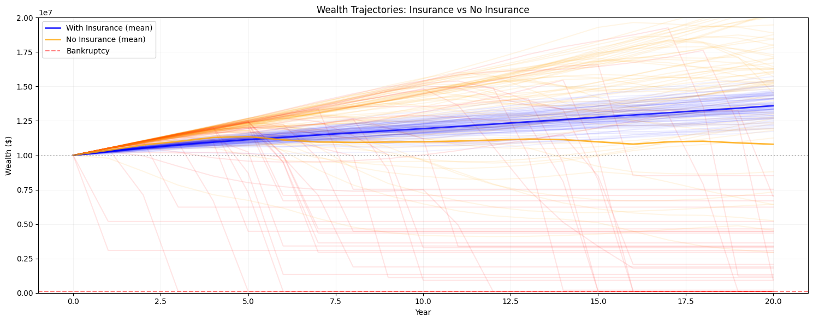

# Getting Started with Ergodic Insurance Framework

Welcome to the Ergodic Insurance Framework! This tutorial will help you get up and running with your first insurance optimization analysis in just a few minutes.

## What You'll Learn

By the end of this tutorial, you will:
- Install the framework and verify your setup
- Run your first manufacturer simulation
- Understand the basic output metrics
- Visualize wealth trajectories over time
- Learn where to go next

## Prerequisites

- Python 3.12 or higher installed
- Basic familiarity with Python (ability to run scripts)
- No advanced mathematics or insurance knowledge required!

## Installation

### Step 1: Clone or Download the Framework

If you have git installed:
```bash
git clone https://github.com/AlexFiliakov/Ergodic-Insurance-Limits.git
cd Ergodic-Insurance-Limits
```

Or download the [ZIP file from GitHub](https://github.com/AlexFiliakov/Ergodic-Insurance-Limits/archive/refs/heads/main.zip) and extract it.

### Step 2: Install Dependencies

We recommend using `uv` for faster installation:
```bash
pip install uv
uv sync
```

Alternatively, use standard pip:
```bash
cd ergodic_insurance
pip install -e .
```

### Step 3: Verify Installation

Let's verify everything is working:

```python
# test_installation.py
from ergodic_insurance.manufacturer import WidgetManufacturer
from ergodic_insurance.claim_generator import ClaimGenerator
from ergodic_insurance.config_v2 import ManufacturerConfig

print("✅ Framework imported successfully!")

# Create configuration
config = ManufacturerConfig(
    initial_assets=10_000_000,
    asset_turnover_ratio=1.0,
    operating_margin=0.08,
    tax_rate=0.25,
    retention_ratio=0.7
)

# Create a simple manufacturer
company = WidgetManufacturer(config)

print(f"✅ Created company with ${company.assets:,.0f} in assets")
print("🎉 Installation successful!")
```

## Your First Simulation

Now let's run a real simulation to see how insurance affects your company's growth trajectory.

### Step 1: Create the Basic Setup

```python
# first_simulation.py
import numpy as np
import matplotlib.pyplot as plt
from ergodic_insurance.manufacturer import WidgetManufacturer
from ergodic_insurance.claim_generator import ClaimGenerator
from ergodic_insurance.config_v2 import ManufacturerConfig

# Set random seed for reproducibility
np.random.seed(42)

# Configure the manufacturer
config = ManufacturerConfig(
    initial_assets=10_000_000,    # Starting with $10M
    asset_turnover_ratio=1.0,     # Generate revenue equal to assets
    operating_margin=0.08,        # 8% profit margin
    tax_rate=0.25,                # 25% corporate tax
    retention_ratio=0.7           # Retain 70% of earnings
)

# Create a $10M widget manufacturer
manufacturer = WidgetManufacturer(config)

print(f"Company Profile:")
print(f"  Initial Assets: ${manufacturer.assets:,.0f}")
print(f"  Expected Annual Revenue: ${manufacturer.assets * config.asset_turnover_ratio:,.0f}")
print(f"  Expected Operating Income: ${manufacturer.assets * config.asset_turnover_ratio * config.operating_margin:,.0f}")
```

#### Expected Output:

```
Company Profile:
  Initial Assets: $10,000,000
  Expected Annual Revenue: $10,000,000
  Expected Operating Income: $800,000
```

### Step 2: Set Up Loss Generation

```python
# Configure realistic loss patterns with catastrophic tail risk
# This demonstrates why insurance is valuable - protecting against rare but devastating events

# Two types of losses:
# 1. Regular operational losses (frequent but manageable)
# 2. Catastrophic losses (rare but potentially ruinous)

revenue = manufacturer.assets * config.asset_turnover_ratio  # Current revenue

# Regular losses: 4-6 per year, typically $50K-$150K
regular_frequency = 5.0 * (revenue / 10_000_000)  # Scale with revenue
regular_generator = ClaimGenerator(
    frequency=regular_frequency,
    severity_mean=80_000,       # Mean claim size $80K
    severity_std=50_000,        # Moderate variation
    seed=42                     # For reproducibility
)

# Catastrophic losses: ~0.3 per year (once every 3 years), but can be $1M-$5M
catastrophic_frequency = 0.3 * (revenue / 10_000_000)  # Also scales with revenue
catastrophic_generator = ClaimGenerator(
    frequency=catastrophic_frequency,
    severity_mean=2_000_000,    # Mean catastrophic loss $2M
    severity_std=1_500_000,     # High variation - can reach $5M+
    seed=43                     # Different seed for independence
)

# Generate sample losses to understand the risk profile
regular_claims, _ = regular_generator.generate_enhanced_claims(
    years=1,
    revenue=revenue,
    use_enhanced_distributions=False
)
catastrophic_claims, _ = catastrophic_generator.generate_enhanced_claims(
    years=1,
    revenue=revenue,
    use_enhanced_distributions=False
)

all_sample_claims = regular_claims + catastrophic_claims
sample_losses = [claim.amount for claim in all_sample_claims]

print(f"\nAnnual Loss Profile (Revenue: ${revenue:,.0f}):")
print(f"Regular Losses:")
print(f"  Expected frequency: {regular_frequency:.1f} losses/year")
print(f"  Actual regular losses: {len(regular_claims)}")
if regular_claims:
    regular_amounts = [c.amount for c in regular_claims]
    print(f"  Range: ${min(regular_amounts):,.0f} - ${max(regular_amounts):,.0f}")
    print(f"  Total regular: ${sum(regular_amounts):,.0f}")

print(f"\nCatastrophic Losses:")
print(f"  Expected frequency: {catastrophic_frequency:.2f} losses/year (once every {1/catastrophic_frequency:.1f} years)")
print(f"  Actual catastrophic losses: {len(catastrophic_claims)}")
if catastrophic_claims:
    cat_amounts = [c.amount for c in catastrophic_claims]
    print(f"  Range: ${min(cat_amounts):,.0f} - ${max(cat_amounts):,.0f}")
    print(f"  Total catastrophic: ${sum(cat_amounts):,.0f}")

if sample_losses:
    print(f"\nCombined Annual Losses:")
    print(f"  Total events: {len(sample_losses)}")
    print(f"  Total losses: ${sum(sample_losses):,.0f}")
    print(f"  Expected annual losses: ~${int(regular_frequency * 80_000 + catastrophic_frequency * 2_000_000):,.0f}")
```

#### Expected Output:

```
Annual Loss Profile (Revenue: $10,000,000):
Regular Losses:
  Expected frequency: 5.0 losses/year
  Actual regular losses: 5
  Range: $51,809 - $168,006
  Total regular: $469,851

Catastrophic Losses:
  Expected frequency: 0.30 losses/year (once every 3.3 years)
  Actual catastrophic losses: 0

Combined Annual Losses:
  Total events: 5
  Total losses: $469,851
  Expected annual losses: ~$1,000,000
```

### Step 3: Run the Simulation

```python
# Run simulations with different insurance scenarios
years = 20  # Run longer to see catastrophic events

# IMPORTANT: Generate claims for all years upfront (same for both scenarios)
# This ensures fair comparison - both scenarios face identical losses.
baseline_revenue = config.initial_assets * config.asset_turnover_ratio

# Generate both regular and catastrophic losses for all years
all_year_claims = []
np.random.seed(42)  # Reset seed for reproducibility

for year in range(years):
    # Generate regular losses for this year
    regular_claims, _ = regular_generator.generate_enhanced_claims(
        years=1,
        revenue=baseline_revenue,
        use_enhanced_distributions=False
    )

    # Generate catastrophic losses for this year
    catastrophic_claims, _ = catastrophic_generator.generate_enhanced_claims(
        years=1,
        revenue=baseline_revenue,
        use_enhanced_distributions=False
    )

    # Combine all losses for this year
    year_claims = regular_claims + catastrophic_claims
    all_year_claims.append(year_claims)

# Show preview of losses over time
print(f"\nLoss Preview (20 years):")
total_by_year = [sum(c.amount for c in year_claims) for year_claims in all_year_claims]
catastrophic_years = [i for i, claims in enumerate(all_year_claims)
                      if any(c.amount > 1_000_000 for c in claims)]
print(f"  Years with catastrophic losses (>$1M): {catastrophic_years}")
print(f"  Maximum annual loss: ${max(total_by_year):,.0f} (Year {total_by_year.index(max(total_by_year))})")
print(f"  Average annual loss: ${np.mean(total_by_year):,.0f}")

# Scenario 1: No insurance
manufacturer_no_ins = WidgetManufacturer(config)
for year in range(years):
    claims = all_year_claims[year]

    # For no insurance, company pays all losses directly
    total_loss = sum(claim.amount for claim in claims)
    if total_loss > 0:
        manufacturer_no_ins.assets -= min(total_loss, manufacturer_no_ins.assets)
        manufacturer_no_ins.equity -= min(total_loss, manufacturer_no_ins.equity)

    manufacturer_no_ins.step()

# Scenario 2: With insurance ($100K deductible, $5M limit)
manufacturer_with_ins = WidgetManufacturer(config)
annual_premium = 100_000  # Updated premium as requested

for year in range(years):
    claims = all_year_claims[year]  # Use same claims as no-insurance scenario

    # Calculate company's net loss after insurance
    total_company_payment = 0
    for claim in claims:
        claim_amount = claim.amount
        if claim_amount <= 100_000:
            # Below deductible, company pays all
            company_payment = claim_amount
        else:
            # Above deductible, company pays deductible, insurance covers rest up to limit
            company_payment = 100_000  # Deductible
            insurance_coverage = min(claim_amount - 100_000, 5_000_000 - 100_000)
            # Company also pays any amount above the limit
            if claim_amount > 5_000_000:
                company_payment += claim_amount - 5_000_000

        total_company_payment += company_payment

    # Apply losses and premium
    if total_company_payment > 0:
        manufacturer_with_ins.assets -= min(total_company_payment, manufacturer_with_ins.assets)
        manufacturer_with_ins.equity -= min(total_company_payment, manufacturer_with_ins.equity)

    # Deduct premium
    manufacturer_with_ins.assets -= annual_premium
    manufacturer_with_ins.equity -= annual_premium

    manufacturer_with_ins.step()

print(f"\nResults After {years} Years:")
print(f"Without Insurance:")
print(f"  Final Wealth: ${manufacturer_no_ins.assets:,.0f}")
print(f"  Survived: {manufacturer_no_ins.assets > 0}")
if manufacturer_no_ins.assets > 0:
    print(f"  Annualized Growth: {((manufacturer_no_ins.assets / config.initial_assets) ** (1/years) - 1) * 100:.1f}%")

print(f"\nWith Insurance ($100K deductible, $5M limit):")
print(f"  Final Wealth: ${manufacturer_with_ins.assets:,.0f}")
print(f"  Survived: {manufacturer_with_ins.assets > 0}")
print(f"  Annual Premium: ${annual_premium:,.0f}")
if manufacturer_with_ins.assets > 0:
    print(f"  Annualized Growth: {((manufacturer_with_ins.assets / config.initial_assets) ** (1/years) - 1) * 100:.1f}%")
    print(f"  Total Premiums Paid: ${annual_premium * years:,.0f}")

# Show the benefit of insurance
if manufacturer_with_ins.assets > 0 and manufacturer_no_ins.assets <= 0:
    print(f"\n⚠️ Insurance SAVED the company from bankruptcy!")
elif manufacturer_with_ins.assets > manufacturer_no_ins.assets:
    print(f"\n✅ Insurance resulted in ${manufacturer_with_ins.assets - manufacturer_no_ins.assets:,.0f} higher wealth")
else:
    print(f"\n📊 In this scenario, insurance cost exceeded benefits by ${manufacturer_no_ins.assets - manufacturer_with_ins.assets:,.0f}")
```

#### Expected Output:

```
Company became insolvent with equity: $0.00
Company is already insolvent, skipping step
Company is already insolvent, skipping step

Loss Preview (20 years):
  Years with catastrophic losses (>$1M): [14, 17]
  Maximum annual loss: $6,214,104 (Year 14)
  Average annual loss: $932,290

Results After 20 Years:
Without Insurance:
  Final Wealth: $0
  Survived: False

With Insurance ($100K deductible, $5M limit):
  Final Wealth: $5,945,285
  Survived: True
  Annual Premium: $100,000
  Annualized Growth: -2.6%
  Total Premiums Paid: $2,000,000

⚠️ Insurance SAVED the company from bankruptcy!
```

### Step 4: Visualize the Results

```python
# Track wealth trajectories for visualization
wealth_no_insurance = [config.initial_assets]
wealth_with_insurance = [config.initial_assets]
annual_losses = []

# Use the same claims we generated before
annual_premium = 100_000  # Updated premium as requested

# Re-run simulations while tracking wealth
manufacturer_no_ins = WidgetManufacturer(config)
manufacturer_with_ins = WidgetManufacturer(config)

for year in range(years):
    claims = all_year_claims[year]  # Same claims for both scenarios
    year_loss = sum(c.amount for c in claims)
    annual_losses.append(year_loss)

    # No insurance scenario - company pays all losses
    if year_loss > 0:
        manufacturer_no_ins.assets -= min(year_loss, manufacturer_no_ins.assets)
        manufacturer_no_ins.equity -= min(year_loss, manufacturer_no_ins.equity)
    manufacturer_no_ins.step()
    wealth_no_insurance.append(manufacturer_no_ins.assets)

    # With insurance scenario - calculate net company payment
    total_company_payment = 0
    for claim in claims:
        claim_amount = claim.amount
        if claim_amount <= 100_000:
            company_payment = claim_amount
        else:
            company_payment = 100_000  # Deductible
            if claim_amount > 5_000_000:
                company_payment += claim_amount - 5_000_000  # Excess over limit
        total_company_payment += company_payment

    # Apply losses
    if total_company_payment > 0:
        manufacturer_with_ins.assets -= min(total_company_payment, manufacturer_with_ins.assets)
        manufacturer_with_ins.equity -= min(total_company_payment, manufacturer_with_ins.equity)

    # Deduct premium
    manufacturer_with_ins.assets -= annual_premium
    manufacturer_with_ins.equity -= annual_premium

    manufacturer_with_ins.step()
    wealth_with_insurance.append(manufacturer_with_ins.assets)

# Create comprehensive visualization
fig = plt.figure(figsize=(15, 10))

# Plot 1: Wealth trajectories comparison
ax1 = plt.subplot(2, 2, 1)
ax1.plot(range(len(wealth_no_insurance)), wealth_no_insurance,
         label='No Insurance', linewidth=2, alpha=0.8)
ax1.plot(range(len(wealth_with_insurance)), wealth_with_insurance,
         label='With Insurance', linewidth=2, alpha=0.8)
ax1.axhline(y=0, color='r', linestyle='--', alpha=0.5, label='Bankruptcy')
ax1.axhline(y=config.initial_assets, color='gray', linestyle=':', alpha=0.5)

# Mark catastrophic loss years
for i, loss in enumerate(annual_losses):
    if loss > 1_000_000:
        ax1.axvline(x=i+1, color='orange', alpha=0.3, linestyle=':')
        ax1.text(i+1, ax1.get_ylim()[1]*0.95, f'Cat', rotation=90,
                fontsize=8, color='orange', alpha=0.7)

ax1.set_xlabel('Year')
ax1.set_ylabel('Wealth ($)')
ax1.set_title('Wealth Trajectories: Insurance vs No Insurance')
ax1.legend()
ax1.grid(True, alpha=0.3)

# Plot 2: Annual losses
ax2 = plt.subplot(2, 2, 2)
bars = ax2.bar(range(1, len(annual_losses)+1), annual_losses,
               color=['red' if l > 1_000_000 else 'blue' for l in annual_losses],
               alpha=0.7)
ax2.axhline(y=1_000_000, color='red', linestyle='--', alpha=0.5,
            label='Catastrophic Threshold')
ax2.axhline(y=annual_premium, color='green', linestyle='--', alpha=0.5,
            label=f'Annual Premium (${annual_premium/1000:.0f}K)')
ax2.set_xlabel('Year')
ax2.set_ylabel('Loss Amount ($)')
ax2.set_title('Annual Loss Distribution')
ax2.legend()
ax2.grid(True, alpha=0.3)

# Plot 3: Cumulative growth comparison
ax3 = plt.subplot(2, 2, 3)
growth_no_ins = [(w/config.initial_assets - 1) * 100 for w in wealth_no_insurance]
growth_with_ins = [(w/config.initial_assets - 1) * 100 for w in wealth_with_insurance]
ax3.plot(growth_no_ins, label='No Insurance', linewidth=2)
ax3.plot(growth_with_ins, label='With Insurance', linewidth=2)
ax3.axhline(y=0, color='black', linestyle='-', alpha=0.3)
ax3.set_xlabel('Year')
ax3.set_ylabel('Cumulative Growth (%)')
ax3.set_title('Growth Rate Comparison')
ax3.legend()
ax3.grid(True, alpha=0.3)

# Plot 4: Insurance benefit analysis
ax4 = plt.subplot(2, 2, 4)
wealth_difference = [w_ins - w_no for w_ins, w_no in
                    zip(wealth_with_insurance, wealth_no_insurance)]
colors = ['green' if d > 0 else 'red' for d in wealth_difference]
ax4.bar(range(len(wealth_difference)), wealth_difference, color=colors, alpha=0.7)
ax4.axhline(y=0, color='black', linestyle='-', alpha=0.5)
ax4.set_xlabel('Year')
ax4.set_ylabel('Wealth Difference ($)')
ax4.set_title('Insurance Benefit: (With Insurance) - (Without Insurance)')
ax4.grid(True, alpha=0.3)

plt.suptitle(f'Insurance Analysis: {years}-Year Simulation\n'
            f'Premium: ${annual_premium:,.0f}/year | Deductible: $100K | Limit: $5M',
            fontsize=14, fontweight='bold')
plt.tight_layout()
plt.show()
```

#### Expected Output:



## Understanding the Results

### Why Insurance Creates Value

This demonstration shows the true value of insurance: **protection against catastrophic losses that can bankrupt the company**.

#### The Loss Structure
1. **Regular Losses** (~5 per year, \$50K\$150K each)
   - These are manageable without insurance
   - Total ~$400K per year on average

2. **Catastrophic Losses** (~0.3 per year, \$1M-\$5M each)
   - Occur roughly once every 3 years
   - Can exceed annual profits by 2-5x
   - **These are what make insurance valuable**
   - What's not shown here is that catastrophic attritional losses (below the retention) can also matter

#### Key Insights

1. **Insurance Premium vs Expected Losses**:
   - Annual premium: \$100,000
   - Expected regular losses: ~\$400,000/year
   - Expected catastrophic losses: ~\$600,000/year
   - Total expected losses: ~\$1,000,000/year
   - **The premium is only 10% of expected losses!**

2. **The Catastrophic Protection**:
   - Without insurance: A single loss can wipe out years of profits
   - With insurance: Maximum exposure is the deductible (\$100K) per event
     - Barring a tail event
   - The \$5M limit covers most catastrophic events

3. **Long-term Growth Impact**:
   - Insurance smooths the growth trajectory
   - Prevents bankruptcy during catastrophic years
   - Enables compound growth over time

### What to Look For in the Graphs

1. **Wealth Trajectories (Top Left)**:
   - Orange vertical lines mark catastrophic events
   - Notice how "No Insurance" drops sharply at these points
   - "With Insurance" shows smoother, more consistent growth

2. **Annual Losses (Top Right)**:
   - Red bars show catastrophic losses (>\$1M)
   - Green line shows annual premium (\$100K)
   - Insurance is valuable when red bars appear

3. **Growth Comparison (Bottom Left)**:
   - Shows cumulative growth percentage
   - Insurance provides more stable, predictable growth
   - No insurance shows higher volatility

4. **Insurance Benefit (Bottom Right)**:
   - Green bars: Insurance is ahead
   - Red bars: No insurance is ahead
   - Look for the trend over time, not individual years

## Common Patterns You'll See

1. **The Insurance Paradox**: Sometimes paying 2-3x expected losses in premiums is optimal!
2. **Volatility Reduction**: Insurance smooths the wealth trajectory
3. **Growth vs. Safety Trade-off**: Lower retention = safer but more expensive
4. **Long-term Benefits**: Insurance benefits compound over time

## Next Steps

Now that you've run your first simulation, explore these topics:

1. **[Basic Simulation](02_basic_simulation.md)**: Deep dive into the simulation mechanics
2. **[Configuring Insurance](03_configuring_insurance.md)**: Understanding layers, retentions, and limits
3. **[Optimization Workflow](04_optimization_workflow.md)**: Finding the optimal insurance strategy
4. **[Analyzing Results](05_analyzing_results.md)**: Advanced metrics and decision-making

## Quick Tips

- **Start Simple**: Begin with single-layer insurance before exploring complex programs
- **Use Seeds**: Set `np.random.seed()` for reproducible results during testing
- **Experiment**: Try different retention levels to see the trade-offs
- **Think Long-term**: Run simulations for 20-50 years to see ergodic effects

## Getting Help

- Check the [Troubleshooting Guide](troubleshooting.md) for common issues
- Review the [FAQ](../user_guide/faq.rst) for conceptual questions
- Explore the [API Documentation](../api/modules.rst) for detailed function references
- Open an issue on [GitHub](https://github.com/AlexFiliakov/Ergodic-Insurance-Limits/issues)
- Contact: [Alex Filiakov](mailto:alexfiliakov@gmail.com)

## Summary

Congratulations! You've successfully:
- ✅ Installed the Ergodic Insurance Framework
- ✅ Created your first manufacturer model
- ✅ Generated realistic loss scenarios
- ✅ Run simulations with and without insurance
- ✅ Visualized and interpreted the results

You're now ready to explore more advanced features and optimize your insurance strategy!
