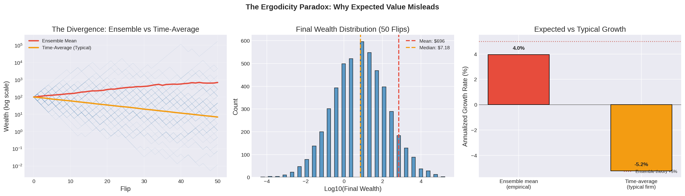
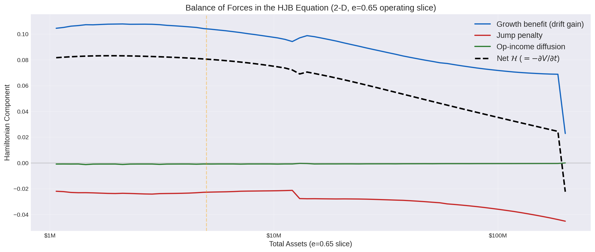
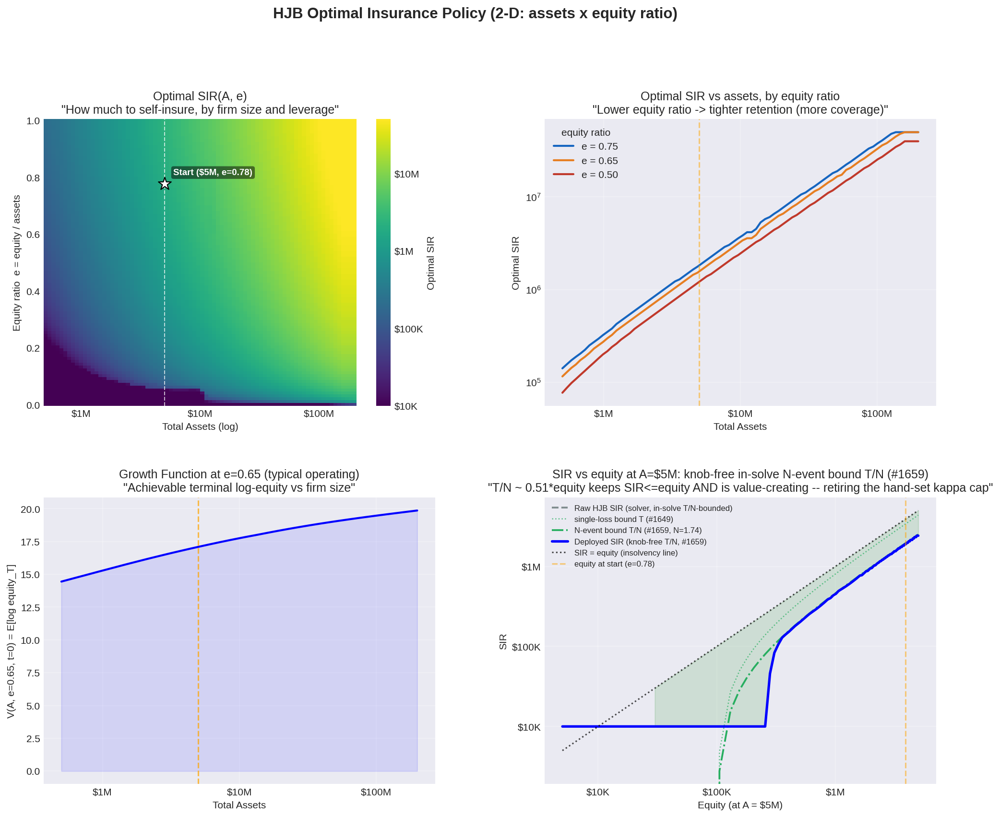
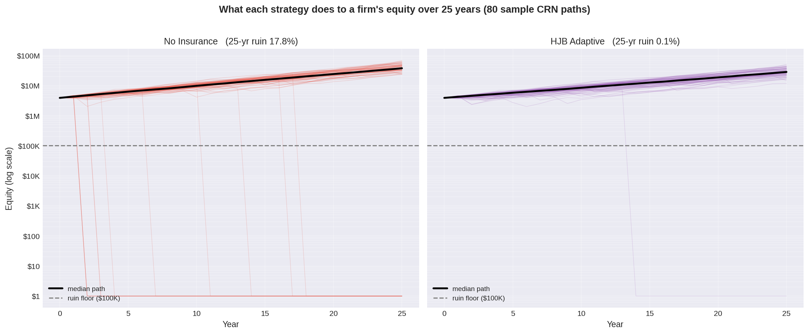
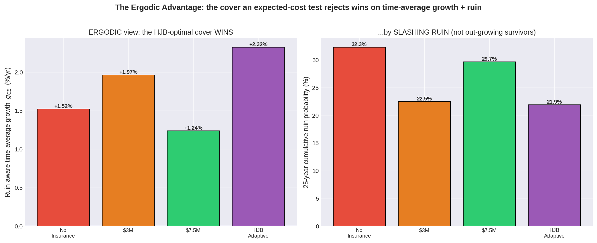
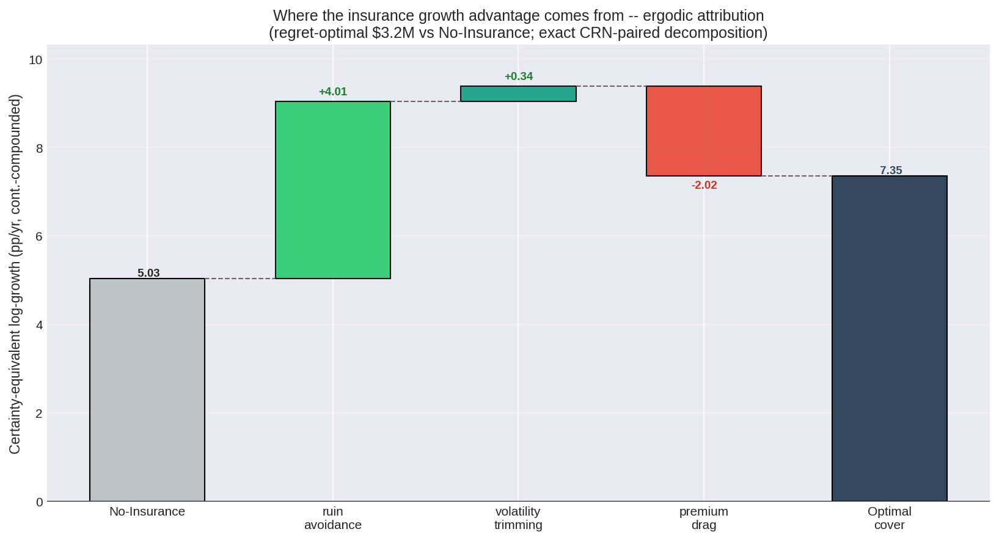
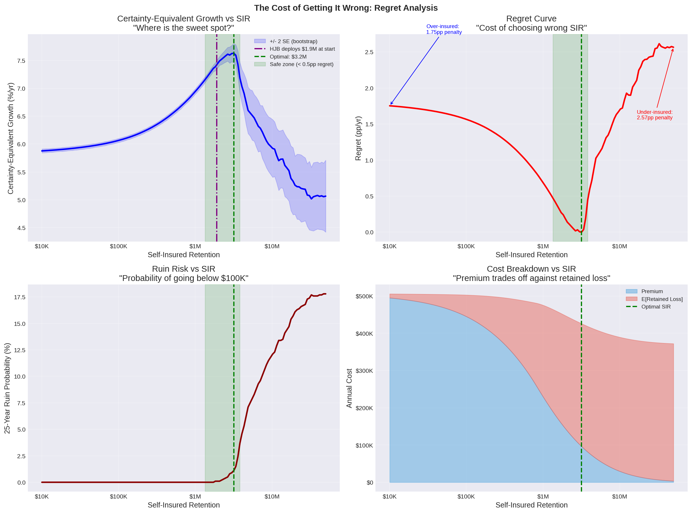
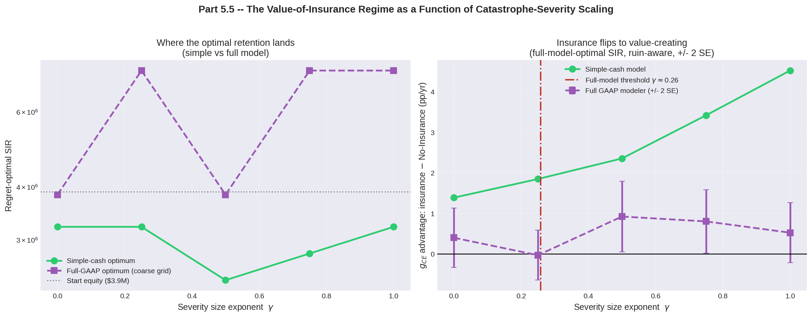
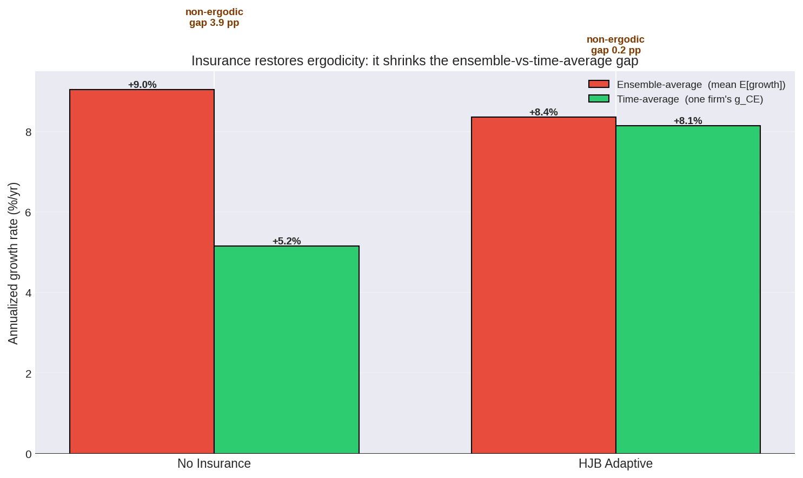

# The Ergodicity of Insurance — Seminar Slides

**Companion deck for `07_hjb_insurance_optimization.ipynb`**
Seminar: *Ergodicity Economics and Applications to Insurance* · 30 min talk + 30 min Q&A
Audience: Ergodicity-Economics enthusiasts (quant grad backgrounds) who may be new to Hamilton–Jacobi–Bellman control and actuarial mechanics.

> **How to use this file.** This is a tooling-agnostic *reading deck* — one `##` heading per slide, ready to paste into PowerPoint / Google Slides / Keynote. Each slide **embeds the actual rendered figure** from notebook 07 (exported to `07_hjb_slides_figures/` and referenced by relative path), plus body text, an optional `[Image: …]` stock-photo suggestion, and `_Speaker notes:_`. A full slide→file map is in the **Figure index** at the end. Equations are in display blocks; currency is plain text.
>
> **Language convention (deliberate).** Throughout we use *ergodicity-economics* vocabulary, never expected-utility vocabulary: **growth function** (not "value function"), **ergodicity transformation `log(w)`** (not "log-utility" / "utility curve"), **horizon discount** (not "time preference"), and concavity that is **forced by multiplicative dynamics** (not "risk aversion"). This is a feature of the framing, not an oversight.
>
> **Numbers** are from the validated 1,000-path committed run; treat them as illustrative, not prescriptive.

---

## Slide 1 — The Ergodicity of Insurance: Steering One Firm Through Time

**Take the ergodicity you already know, and aim it at a question actuaries have answered with the wrong average for a century: how much risk should *one* firm retain?**

- A 30-minute tour of an open-source Python library — **Ergodic-Insurance-Limits** — for time-average insurance optimization.
- The worked example: a **Hamilton–Jacobi–Bellman (HJB)** optimal-control solve that turns the retention decision into a dynamic rule.
- No optimal-control or actuarial background assumed — we build both, fast.

[Image: a single small ship on a vast, dark sea — "the firm lives one path, not the average of all paths."]

_Speaker notes (~45s):_ Welcome. 30 minutes, then 30 for Q&A. My main goal is to put a real, open-source library in your hands; the HJB problem is the engaging worked example that shows it off. The one substitution that organizes the whole talk: replace the EE gambler with a *company*, and the bet with *how much loss to retain*. Everything else is machinery to do that substitution honestly — including being candid about where it works and where it barely does.

---

## Slide 2 — You already know the punchline (let's agree on it fast)

**The Peters coin — the shared touchstone for this room.** Multiply wealth by 1.5 on heads, 0.6 on tails.

- **Ensemble average:** `0.5·1.5 + 0.5·0.6 = 1.05` → **+5%/yr**. Looks like a money machine.
- **Time average** (one player, through time): geometric mean `√(1.5·0.6) = √0.9 = 0.949` → **−5.1%/yr**.
- After 50 flips: **median** wealth ≈ \$7.18 from a \$100 start; ≈ **24%** of players end below \$1. A vanishing handful of jackpot paths drags the *mean* up while the median collapses.
- For the experts in the room: with 5,000 simulated players the *empirical* ensemble mean is only ≈ **+4.0%**, not +5% — the ensemble average of a heavy-tailed multiplicative process is even **hard to estimate**. The time average is stable.


_Figure — notebook Part 4 / cell 12: (a) ensemble-mean vs median path on log wealth, (b) final-wealth histogram, (c) expected-vs-typical growth._

_Speaker notes (~90s):_ This is the EE handshake — you know this cold, so I'm not re-teaching it, I'm establishing common ground. The whole talk is this slide with a balance sheet instead of a coin. Flag the +4% undershoot as a wink to the experts: for a single firm the ensemble average isn't just the *wrong* target, it's barely *measurable*. The geometric mean is what you actually live.

---

## Slide 3 — The actuary's blind spot: pricing a book ≠ steering a firm

**Same loss distribution, two genuinely different problems — and they can recommend opposite actions.**

- An actuary prices a **book** of thousands of independent risks. There the *ensemble* average is correct — the law of large numbers makes the pool self-average. Expected loss is the right planning number **for the pool**.
- But the firm *buying* the cover is **N = 1**. It survives sequentially, along one path; it never averages over the ensemble of companies it might have been. What governs its fate is the **time average**.
- Ergodicity makes the gap precise: wealth is **multiplicative** (it grows by percentages), so it is **non-ergodic** — time average ≠ ensemble average.

[Image: split frame — a dense fleet of identical ships (the book the actuary prices) vs a single ship (the firm that buys).]

_Speaker notes (~75s):_ This is the conceptual pivot, and the bridge into the part you *don't* know — insurance mechanics. The actuary isn't wrong; they're answering the pool's question superbly, and they've handed the buyer the pool's answer. EE is exactly the lens that separates "price a book" from "steer a firm." Define the word *retention* here verbally — the slice of each loss the firm keeps — as a teaser for the next slide.

---

## Slide 4 — One firm, one knob: the self-insured retention (SIR)

**A thin annual cushion against a fat-tailed loss distribution — the regime where the two averages part ways.**

- Our manufacturer (the library's `WidgetManufacturer`): **\$5M** assets · **1.5×** turnover → **~\$7.5M** revenue · **12.5%** margin → **~\$937.5K** operating income · **30%** income volatility · 25% tax · 70% retained · **25-year** horizon.
- ~\$0.94M of annual cushion against losses in the **millions to tens of millions**. A single bad year can erase a decade.
- A realistic **4-layer tower** sits above a **self-insured retention (SIR)**. Quick vocabulary: *attachment* = where a layer starts; *limit* = how much it pays; *loading* = premium ÷ expected loss; rate-on-line falls as you climb (higher layers rarely attach). Priced by `LayerPricer` via a **Wang-transform distortion** — loadings shown in parentheses.
- **We optimize ONE number: the SIR.** "How much of each loss does the firm keep before the tower attaches?"

```
              $200M ┌──────────────────────┐
                    │ Layer 4: CAT         │  $150M  xs $50M   (4.43× load)
               $50M ├──────────────────────┤
                    │ Layer 3: 2nd Excess  │  $25M   xs $25M   (3.80×)
               $25M ├──────────────────────┤
                    │ Layer 2: 1st Excess  │  $20M   xs $5M    (2.84×)
                $5M ├──────────────────────┤
                    │ Layer 1: Primary     │  $4.75M xs $250K  (1.54×, 65% LR)
              $250K ├──────────────────────┤
                    │ Self-Insured         │  ◄── the one knob we optimize
                 $0 │ Retention (SIR)      │
                    └──────────────────────┘
```
_Schematic — notebook Part 3 / cell 7 (ASCII; no rendered PNG). Recreate as a clean graphic, or screenshot the notebook cell._

_Speaker notes (~90s):_ Ninety seconds of actuarial primer on one concrete firm — this is the vocabulary the room lacks. Two things to plant: (1) we hold the tower fixed and optimize only the retention, keeping the control one-dimensional and the story clean; (2) the Wang loadings (1.54× on the working primary up to 4.43× on the cat layer) mean every insured strategy *spends more than its expected-loss savings* — so by the ensemble yardstick, insurance already "loses." Hold that thought; it's the setup for the flip.

---

## Slide 5 — The retention is a moving target — so we need a rule, not a number

**The retention you set today shapes the balance sheet that sets the retention you can afford tomorrow.**

- The decision compounds over decades — so the right object isn't a single SIR, it's a **feedback rule `SIR(state)`** that re-derives the best retention from where the firm currently sits.
- **Hamilton–Jacobi–Bellman (HJB)** optimal control produces exactly that rule.
- Mental model: **GPS for the retention decision** — turn-by-turn directions that re-route as the balance sheet moves, not one route chosen at the start of the trip.

[Image: a GPS / navigation screen mid-reroute.]

_Speaker notes (~60s):_ Motivate *why* optimal control — a fair question is "why not just grid-search a static SIR?" Because the optimum is state-dependent and the state evolves; a static number is leaving growth on the table every year the firm drifts away from it. This is also where dynamic Kelly enters: Kelly gives the growth-optimal bet *fraction*; HJB gives it *as a function of state, solved through time*. The equation is next — and it's friendlier than it looks.

---

## Slide 6 — HJB = dynamic Kelly (and we mean *growth*, not utility)

**The equation, read in ergodicity-economics language.**

$$\frac{\partial V}{\partial t} + \max_{\text{SIR}}\Big[\ \underbrace{\mu(w,\text{SIR})\,\partial_w V}_{\text{drift}} + \underbrace{\tfrac{1}{2}\sigma^2\,\partial_{ww}V}_{\text{diffusion}} + \underbrace{\lambda\,\mathbb{E}_X\!\big[V(w-L)-V(w)\big]}_{\text{loss jumps}}\ \Big] = 0,\qquad V(w,T)=\log w,\quad \rho = 0$$

- **`V` is the growth function** — the maximum achievable *time-average growth rate* from a state — **not** a utility-to-go.
- **`log(w)` is the ergodicity transformation** (multiplicative → additive, so its expectation *is* time-average growth). It enters as the **terminal condition**, not as "log-utility."
- **`ρ = 0`:** no time-preference; the objective is the undiscounted `E[log W_T]` over 25 years.
- **Concavity of `V` is forced by the dynamics** — a 50% loss needs a 100% gain to undo — **not** by any assumed dislike of risk. Insurance demand falls out of the *dynamics*.
- `max` picks the growth-maximizing retention each instant; `∂V/∂t` threads it through time via **backward induction** (Bellman: solve the last year first).

[Image: a small two-column callout — "EUT vocabulary → EE vocabulary": value function→growth function · running reward→none · discount→horizon regularizer · risk aversion→forced concavity.]

_Speaker notes (~2 min):_ This is *the* slide for this audience. The equations are identical to what the control/econ literature writes down — but we deliberately refuse the expected-utility reading. Make the contrast loud: under EE the concavity isn't a taste, it's geometry imposed by compounding, so the demand for insurance is *derived*, not preference. (Aside they'll enjoy: the library still names its transform class `LogUtility` for historical compatibility — read it as the log ergodicity transformation, a rename is just deferred.) Backward induction = a chess endgame: solve mate-in-one, then mate-in-two.

---

## Slide 7 — The jump term *is* your aggregate-loss model, viewed through growth

**`λ·E[V(w−L) − V(w)]` = compound-Poisson frequency × severity — asking what a loss does to *log-equity*, not to *premium*.**

- `L` is the **retained** loss; the **SIR resizes it**. Same frequency-severity model an actuary prices every day, now acting as a growth operator.
- Two forces the SIR trades off:
  - **Drift gain** — higher SIR → lower premium → faster between-jump growth (pulls toward *retaining*).
  - **Jump penalty** — higher SIR → bigger retained losses landing on a **concave** `V` (pulls toward *covering*).
- Because `∂²V/∂w² < 0`, symmetric shocks have **asymmetric** growth effects → **the growth-optimal premium can exceed expected loss.** The premium paradox is a theorem of the dynamics, not a preference.
- A sharp **single-loss-insolvency threshold** appears at `SIR = T(A,e)`: below it no single loss can ruin the firm; at it the whole catastrophe tail flips to "insolvency." The solver parks the retention **just below `T`** — "buy exactly enough that no single loss can bankrupt you, not a dollar more."


_Figure — notebook Part 6b / cell 31 (e = 0.65 operating slice). Companion derivative plot available: `extra_growth-function-derivatives.png`._

_Speaker notes (~90s):_ For this room the genuinely new actuarial object is the aggregate-loss model — and the payoff is seeing it as a growth operator. Hammer the premium paradox: it's the EE punchline in equation form, and it's *why* a strategy that "loses" on expected value can win on time-average growth. The single-loss cliff is the moment the math reads the balance sheet — and it's exactly what makes the optimal policy state-dependent, which is the next slide.

---

## Slide 8 — The answer is a surface: `SIR(assets, leverage)`

**Optimal retention depends jointly on firm size and leverage — so the policy is a surface, not a curve.**

- State = total assets `A` and equity ratio `e = equity / assets`.
- Reading it: retention generally **falls as leverage rises** (buy more cover when more of the firm is borrowed) — *until* equity is so thin that asset-priced premium is unaffordable, and the policy flips to **near-self-insurance** (the "gamble band").
- Retention is bounded **inside the solve** by a **knob-free, frequency-derived** threshold `T/N ≈ 0.51·equity` — survive a bad *year* of `N ≈ 1.74` worst events, not just one. No hand-tuned cap; "retain at most ~half your equity" falls out of the loss frequency alone.
- **Honest caveat:** the Hamiltonian is nearly *flat* in SIR across a wide band — read the surface as a **band**, not a knife-edge. The decision-grade answer comes from regret (Slide 13).


_Figure — notebook Part 7 / cell 33: SIR(A,e) heatmap · SIR-vs-assets by equity ratio · growth function V · SIR-vs-equity with the T/N bound._

[Image: a topographic contour map — the policy as terrain.]

_Speaker notes (~90s):_ Why 2-D? Because ruin triggers on *equity* but a loss is booked as a deferred *liability* — equity drops at the instant of loss while assets stay flat. A 1-D "wealth" policy missed that and once recommended retentions *larger than equity* (a single working-layer loss → negative equity). The 2-D policy makes the retention a function of how much of the firm the owners actually own. The `T/N` bound is the rigor crowd's favorite: a retention cap *derived* from modeled loss frequency, not assumed.

---

## Slide 9 — Same storms, different ships — and one honest yardstick

**Two methodological pillars that make every result below trustworthy.**

- **Common Random Numbers (CRN):** every strategy faces the *identical* loss draws, so outcome differences are **causal**, not luck — a paired comparison that finds the signal with ~10× fewer paths.
- **The metric problem:** under an absorbing ruin barrier the plain time-average growth rate is `−∞` (`log 0`). Reporting a single growth number needs a convention.
- **Decision-grade metric — certainty-equivalent log-growth, floored at the \$100K ruin threshold:**

$$g_{CE} \;=\; \exp\!\Big(\tfrac{1}{T}\,\mathbb{E}\big[\log\big(\max(W_T,\ \$100\text{K})/W_0\big)\big]\Big) \;-\; 1$$

- Same ergodicity transformation, applied **after flooring ruined paths** — it rolls survivor-growth *and* ruin into one comparable number. Exchange rate: each **1% of ruin ≈ −0.16 pp/yr**.

[Image: optional — `extra_part5-same-storms-trajectories.png` (Part 5 / cell 14) shows the four strategies on identical CRN draws, if you want a visual here.]

_Speaker notes (~90s):_ Why not just report growth conditional on survival? Because averaging only the survivors is the *wrong reference class* — you must choose the retention *before* you know whether this firm lands in the lucky cohort, so the decision has to price the ruined paths in, not condition them away. `g_CE` does exactly that, on the *same* \$100K floor the HJB terminal condition uses — by construction, not tuning. This is the single EE-faithful axis every comparison that follows is read on.

---

## Slide 10 — What insurance actually does: it removes the crashes

**The cover does not lift the typical path — it deletes the wipe-outs.**

- 80 sample firms, the **same** 25-year CRN loss sequence. Left: uninsured. Right: HJB-adaptive cover.
- In the uninsured panel a handful of paths **crash to the floor** — the multiplicative wipe-outs that compound a single firm to zero.
- The cover does **not** raise the median path — a premium is a certain drag on a firm that has no loss. It **removes the crashes**.
- That is precisely what the time-average growth rate rewards and the ensemble average never feels.


_Figure — notebook Part 8b / cell 39: 80 CRN equity paths, log scale, No-Insurance (left) vs HJB (right)._

_Speaker notes (~75s):_ This is the visceral center of the talk — let it breathe and point at actual crashing lines. The median barely moves; the tail is transformed. This is EE made visible on a balance sheet: insurance is not a growth *additive*, it's a ruin *subtractive* — and under multiplicative dynamics, subtracting ruin *is* adding time-average growth.

---

## Slide 11 — The whole argument in one figure: the ergodic flip

**Same data, two yardsticks, opposite verdicts.**

- By the **ensemble** yardstick (expected terminal wealth), every insured strategy looks like a loser — premiums exceed expected recoveries, so **No-Insurance posts the highest *average* terminal wealth**.
- By the **ergodic** yardstick that governs one firm's fate (ruin-aware `g_CE`), the **HJB cover wins**.
- It wins exactly as EE predicts: **not** by out-growing the uninsured firm year to year, but by **slashing the ruinous paths** a single company cannot average away.
- Full-GAAP modeler (`WidgetManufacturer`): 25-yr **ruin ~32% → ~22%**; `g_CE` advantage **+0.79 ± 0.26 pp/yr**.


_Figure — notebook Part 12 / cell 60: g_CE and 25-year ruin by strategy (full-GAAP modeler)._

_Speaker notes (~90s):_ The headline. Be precise about the number: this is the **full GAAP** model — the most realistic one — and the edge is +0.79 ± 0.26, positive at roughly 3 standard errors but *modest*. I'm deliberately not overselling; Slide 14 owns that honesty. The point of this slide isn't "huge win," it's that **the sign of the verdict flips when you change the average** — that's the ergodic flip on a real firm.

---

## Slide 12 — Where the advantage comes from: ruin-avoidance, not growth

**EE makes a falsifiable prediction; CRN lets us test it exactly.**

The `g_CE` gap decomposes additively (one counterfactual run — the same cover with the premium switched off — isolates the premium):

- **− Premium drag:** the certain cost of paying premium.
- **+ Ruin avoidance:** paths where the uninsured firm ruins but the cover survives — the multiplicative downside rescued.
- **+ Volatility / severity trimming:** paths where both survive, but the cover ceded the big-but-survivable losses.
- **= the optimal cover's `g_CE` advantage** (the three sum *exactly*).

**Result: ruin avoidance ≈ 92% of the gross protective benefit** — it dominates and more than repays the premium drag. EE prediction confirmed.


_Figure — notebook Part 11b / cell 58: No-Insurance → (+ruin avoidance) → (+vol trimming) → (−premium drag) → optimal cover._

_Speaker notes (~75s):_ This is the slide that *proves* the mechanism instead of asserting it — and for this audience it's the satisfying part. The theory said "the value is in killing the wipe-outs"; an exact, CRN-paired decomposition says 92% of the protective benefit is precisely that. Note we don't hide the premium drag — it's real and negative; it's simply outweighed by the ruin term.

---

## Slide 13 — The cost of getting it wrong (and why it's a band)

**Sweep the retention; read off where the optimum is, how wide it is, and which error is costlier.**

- Sweep SIR \$10K → \$50M; plot `g_CE`, regret (the `g_CE` penalty vs the optimum), and ruin.
- The decision-grade optimum is a **moderate interior retention (~\$3M)** — not the self-insure-everything corner. And it's **not a knife-edge**: a wide **safe-zone band** sits within ~0.5 pp/yr of the peak — many retentions are about equally good.
- The regret curve is **asymmetric**, and here **under-insuring (a very high SIR) costs materially more `g_CE` than over-insuring** — past a threshold a single bad year exhausts equity and ruin climbs. **Practical rule: when in doubt, buy more.**
- *Which* side is costlier is **regime-dependent — read off the data, never assumed.** It would flip for sturdier firms, softer loadings, or losses small relative to wealth.


_Figure — notebook Part 11 / cell 55: g_CE vs SIR · regret curve · ruin vs SIR · premium-vs-retained-loss cost._

_Speaker notes (~90s):_ The most practically useful slide for a CFO — and quietly an honesty slide: the flatness of the Hamiltonian from Slide 8 shows up here as a *band* of near-equal optima. The asymmetry direction is a **finding**, not an input — this is the project's stated goal in action: *derive* where premium-above-expected-loss flips from value-destroying to value-creating, per scenario, rather than presuppose it.

---

## Slide 14 — The contribution isn't "insurance wins" — it's *locating where it does*

**A method that derives the value-creating regime boundary — and says plainly when the advantage is thin.**

- It took **real, defensible modeling** to find the regime — not a thumb on the scale:
  - **Catastrophe severity must scale with firm size** (the γ-sweep, shown). At γ = 0 a growing firm *outgrows* fixed-dollar losses and insurance becomes valueless; **γ = 0.25 is value-neutral, γ = 0.5 value-creating**. We *sweep* γ — we don't assume it.
  - **Accounting frictions modeled honestly** (letter-of-credit collateral; a revenue-scaled liquidity facility). Earlier builds *spuriously punished* coverage and produced a backwards "more cover → more ruin." Fixing the accounting removed the artifact.
- **The verdict, stated against its error bar:**
  - *Simple teaching model:* large and unambiguous — **+2.98 pp/yr at \$5M**, wins **100%** of out-of-sample windows.
  - *Full-GAAP model:* real but **modest — +0.79 ± 0.26 pp/yr (~3 SE)**, **3 of 5** windows. A sub-2-SE gap we call **value-neutral**, not a win.


_Figure — notebook Part 5.5 / cell 16: where insurance flips to value-creating as γ rises (simple-optimal vs full-model-optimal SIR, ruin-aware, ±2 SE)._

[Image: a balance scale, or a tightrope walker — calibrated honesty.]

_Speaker notes (~2 min):_ This is the slide you'll respect most, and the one I want to feature. The story is not triumphalist. We changed the model in defensible ways and *watched the verdict move*; we report the full-GAAP edge **with a standard error** and refuse to call a few-SE gap a victory. That candor *is* the product: a framework that finds the regime boundary and is honest about its width. Great place to invite Q&A on the γ-sweep and the GAAP frictions.

---

## Slide 15 — Three questions a decision-maker asks — answered

**Size, ergodicity, and the market cycle — with the EE result as the hero.**

- **Size:** insurance is worth most where a single loss is existential. `g_CE` advantage **+2.98 pp/yr at \$5M**, tapering to **+0.21 pp/yr at \$100M** (the *same* adaptive policy, deployed across sizes). → `slide15_value-vs-firm-size.png`
- **Ergodicity (the hero, below):** for this firm, **uninsured**, the ensemble-average growth (**+9.04%**) and the time-average it actually compounds (**+5.16%**) diverge by **3.88 pp** — the Slide-2 coin flip, now on a real balance sheet. Under the HJB cover the gap **collapses to 0.21 pp** (+8.35% vs +8.14%). **Insurance restores ergodicity.**
- **Market cycle:** breakeven loading **≈ 2.35× expected loss (LR ≈ 0.43)**. The shipped 0.65 loading has real headroom — a hard-market decision rule. → `slide15_breakeven-premium-loading.png`


_Hero figure — notebook Part 13b / cell 63. Supporting: `slide15_value-vs-firm-size.png` (Part 13a / cell 62) and `slide15_breakeven-premium-loading.png` (Part 13c / cell 64)._

_Speaker notes (~90s):_ Lead with the ergodicity-restoration result — it's the most beautiful for this room: the firm's own non-ergodicity gap, **3.88 pp → 0.21 pp**. Note the internal consistency: the +2.98 pp value-at-\$5M (size panel) *is* the time-average growth gap from the ergodicity panel — same firm, same metric, two views. And breakeven 2.35× ties straight back to the premium paradox: the cover pays even at more than twice its expected loss.

---

## Slide 16 — Everything you just saw is one open-source library

**Ergodic-Insurance-Limits — a Python framework for time-average insurance optimization.**

The pieces behind every figure in this talk:

- `WidgetManufacturer` — full GAAP balance sheet, tax (NOL / ASC 740), multi-year claim development.
- `ManufacturingLossGenerator` — Poisson-frequency / heavy-tail-severity loss model.
- `InsuranceProgram` + `LayerPricer` — layered towers and **Wang-transform** pricing.
- `Simulation` / `MonteCarloEngine` — single-path and parallel-path engines (CRN built in).
- `ErgodicAnalyzer` — time-average vs ensemble growth, the ergodic advantage.
- `HJBSolver` — the optimal-control solve you just walked through.
- `BusinessOptimizer`, Pareto frontiers, walk-forward validation, and **GAAP/actuarial reconciliation** notebooks.
- **~50 worked notebooks**: foundations → optimization → reconciliation → visualization.

**Get it:** `github.com/AlexFiliakov/Ergodic-Insurance-Limits` · docs at `mostlyoptimal.com`.

[Image: a clean software-architecture diagram, or a Python + finance motif.]

_Speaker notes (~75s):_ This is the main goal of the talk — land it as "you've been watching the library work the whole time." Walk the list against the figures: that spaghetti plot was `WidgetManufacturer` + the CRN engine; the policy surface was `HJBSolver`; the loadings were `LayerPricer`'s Wang transform. Stress it's not a toy — real GAAP accounting, actuarial pricing, reconciliation notebooks, and the optimal-control solver are all in there and reproducible. The notebook you just toured is `07_hjb_insurance_optimization`.

---

## Slide 17 — Takeaways

1. **Insurance can be a growth enabler — in the right regime.** Time-average, not ensemble.
2. **The optimal retention is dynamic and state-dependent** (size × leverage). HJB = dynamic Kelly = ergodic optimality — no preferences invoked; concavity is forced by the dynamics.
3. **The value is ruin-avoidance** — it removes the multiplicative wipe-outs and, measurably, **restores ergodicity** for the firm.
4. **The contribution is a *method*** that locates — and honestly bounds — where the ergodic advantage exists; candid when it's thin.
5. **It's a real, open-source library**, applicable to a real business with real financials.

[Image: the lone ship from Slide 1, now sailing clear water.]

_Speaker notes (~60s):_ Mirror the opening image to close the loop. The meta-point for this audience: this is EE *operationalized* — not a parable about coin flips, but a deployable optimal-control system running on GAAP financials that reports its own error bars. That's the bar I think EE applications should clear.

---

## Slide 18 — Thank you — let's dig in (Q&A)

**30 minutes — happy to go deep. Some threads I can pull on request:**

- The finite-difference **backward-induction** scheme and convergence/refinement diagnostics.
- The **γ severity-scaling** sweep — why size-scaling of catastrophe severity decides the whole thesis.
- The **full-GAAP frictions** (letter-of-credit collateral, revenue-scaled liquidity facility) that flipped a spurious result.
- **Wang-transform** distortion pricing and the per-layer loadings.
- Why the policy is a **band, not a curve** (Hamiltonian flatness / `#1582` indeterminacy).

**Resources:** repo `github.com/AlexFiliakov/Ergodic-Insurance-Limits` · theory & user guide `mostlyoptimal.com` · notebook `ergodic_insurance/notebooks/optimization/07_hjb_insurance_optimization.ipynb` · contact `alexfiliakov@gmail.com`.

_Speaker notes:_ Offer the deep-dive menu up front so the room knows the 30-minute Q&A can go as technical as they want. If the audience is more practitioner than quant, steer toward the regime/honesty story; if more quant, the HJB scheme and the γ-sweep.

---

## Appendix — Q&A backup figures (not part of the 30-minute flow)

All figures are exported to `07_hjb_slides_figures/`. Pull these on demand; they answer the most likely technical questions without adding slides to the main talk.

- **Is the optimum real or numerical noise?** `appendix_hamiltonian-sir-diagnostic.png` (Part 6 diagnostic / cell 22 — Hamiltonian unimodality in SIR; the single-loss cliff at `T`) together with the Part 7 surface on Slide 8 (cell 33 — argmax moves <~couple % under a 1.5× finer grid → feature, not noise).
- **Does the ruin value need tuning?** `appendix_vruin-robustness.png` (Part 6c / cell 24) — `V_RUIN = log(\$100K)` is forced by the objective; doubling the destruction-at-ruin leaves the start-state SIR unchanged.
- **Out-of-sample robustness:** `appendix_walk-forward-simple.png` (Part 10 / cell 47) and `appendix_walk-forward-full.png` (Part 10b / cell 49) — 5×5-year path-continuous windows; survivor-growth vs cumulative-ruin (the HJB loses on survivor growth yet wins on `g_CE`: 100% of windows in the simple model, full-horizon in the full GAAP model).
- **Parameter sensitivity / what flips the verdict:** `appendix_sensitivity-tornado.png` (Part 9a / cell 41 — ±20% on 7 knobs; loss ratio and cat-tail α dominate), `appendix_sensitivity-full-model.png` (Part 9b / cell 42 — full-model ±2 SE spot-check), `appendix_premium-loading-sensitivity.png` (Part 9c / cell 44 — where the shipped LR sits vs the value-creating region).
- **Full-model retention calibration:** `appendix_full-model-regret.png` (Part 10d / cell 53 — full-GAAP regret + N-event-bound validation) and `appendix_strategy-showdown.png` (Part 8 / cell 37 — 25-year showdown: trajectories, terminal-wealth KDE, CAGR distribution, summary).
- **Can a grown firm outgrow its tower?** Part 5.5b / cell 18 is a text diagnostic (no figure): a fixed \$200M cat top vs a firm compounding ~10× → a rare, late-horizon uninsured-excess tail.

**Other exported extras** (in `07_hjb_slides_figures/`, not wired into the deck): `extra_part5-same-storms-trajectories.png` (Part 5 / cell 14), `extra_growth-function-derivatives.png` (∂V/∂w & ∂²V/∂w² / cell 27), `extra_hamiltonian-decomposition.png` (cell 29), `extra_hjb-dominant-force.png` (cell 31 lower strip), `extra_paydown-shape-diagnostic.png` (cell 56).

---

## Figure index (slide → file)

All paths are relative to this file, under `07_hjb_slides_figures/`.

| Slide | File | Notebook source |
|---|---|---|
| 2 | `slide02_coin-flip-ergodicity-paradox.png` | Part 4 / cell 12 |
| 4 | *(ASCII tower — no PNG)* | Part 3 / cell 7 |
| 7 | `slide07_hjb-balance-of-forces.png` | Part 6b / cell 31 |
| 8 | `slide08_optimal-policy-surface.png` | Part 7 / cell 33 |
| 10 | `slide10_equity-trajectories.png` | Part 8b / cell 39 |
| 11 | `slide11_ergodic-advantage-at-a-glance.png` | Part 12 / cell 60 |
| 12 | `slide12_ergodic-attribution-waterfall.png` | Part 11b / cell 58 |
| 13 | `slide13_regret-analysis.png` | Part 11 / cell 55 |
| 14 | `slide14_value-of-insurance-regime-gamma-sweep.png` | Part 5.5 / cell 16 |
| 15 | `slide15_insurance-restores-ergodicity.png` (hero) | Part 13b / cell 63 |
| 15 | `slide15_value-vs-firm-size.png` (support) | Part 13a / cell 62 |
| 15 | `slide15_breakeven-premium-loading.png` (support) | Part 13c / cell 64 |

_Slides 1, 3, 5, 6, 9, 16, 17, 18 carry stock-image suggestions (`[Image: …]`) rather than notebook figures._
